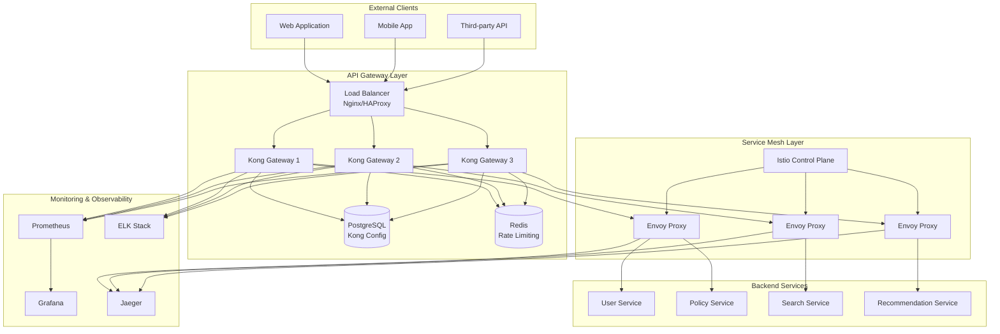
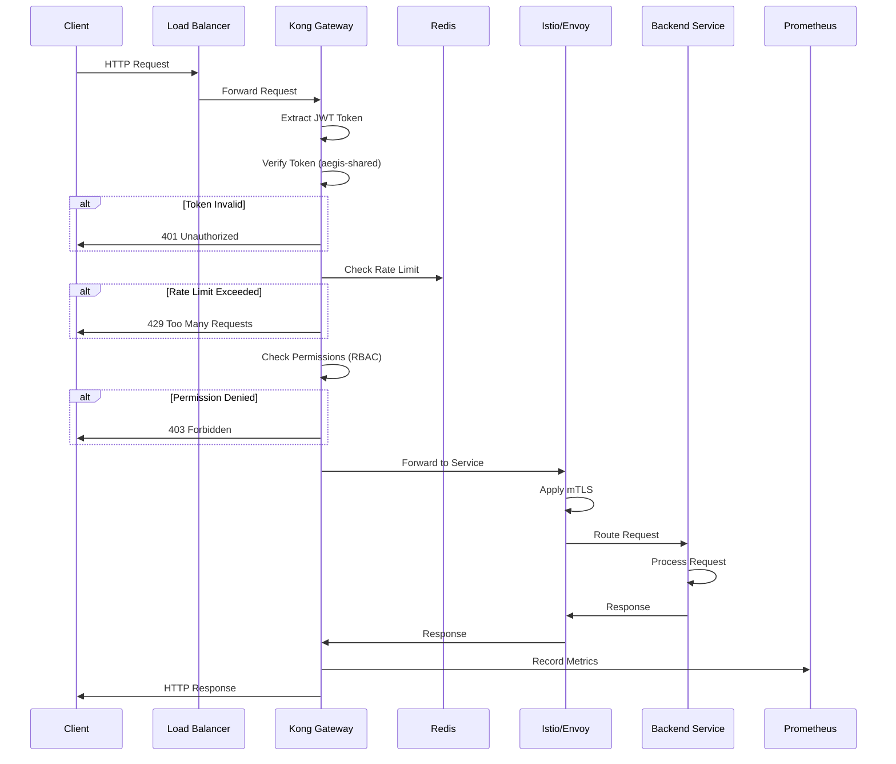

# API Gateway Design Document

## 1. Overview

API Gateway는 이지스(Aegis) 시스템의 **단일 진입점(Single Entry Point)**으로, 모든 외부 클라이언트 요청을 받아 적절한 백엔드 서비스로 라우팅하는 핵심 인프라 서비스입니다.

### 1.1 핵심 책임

1. **API 라우팅** - 클라이언트 요청을 적절한 백엔드 서비스로 라우팅
2. **인증/인가** - JWT 토큰 검증 및 권한 관리
3. **레이트 리미팅** - API 사용량 제어 및 남용 방지
4. **로드 밸런싱** - 서비스 인스턴스 간 트래픽 분산
5. **API 버전 관리** - 버전별 라우팅 및 하위 호환성 유지
6. **보안** - CORS, CSRF, DDoS 방어
7. **모니터링** - API 트래픽 메트릭 수집 및 분석

### 1.2 역할 명확화 (중요)

**API Gateway의 역할:**
- ✅ 모든 외부 API 요청의 단일 진입점
- ✅ 인증 및 권한 검증
- ✅ 레이트 리미팅 및 쿼터 관리
- ✅ API 버전 관리 및 라우팅
- ✅ 로드 밸런싱 및 헬스체크
- ✅ CORS, 보안 헤더 관리
- ✅ API 트래픽 모니터링

**API Gateway가 하지 않는 것:**
- ❌ 비즈니스 로직 처리 (각 서비스 담당)
- ❌ 데이터 저장 (각 서비스 담당)
- ❌ 서비스 간 통신 관리 (Service Mesh 담당)
- ❌ 복잡한 데이터 변환 (각 서비스 담당)

### 1.3 설계 원칙

1. **단일 진입점**: 모든 외부 요청은 API Gateway를 통과
2. **무상태성**: Gateway는 상태를 저장하지 않음 (Redis 캐시 활용)
3. **고가용성**: 최소 3개 인스턴스 운영
4. **확장성**: 트래픽 증가에 따른 자동 확장
5. **보안 우선**: 모든 요청에 대한 인증 및 검증
6. **성능**: 추가 지연 시간 < 10ms

### 1.4 다른 서비스와의 역할 구분

| 서비스 | 역할 | 통신 방식 |
|--------|------|-----------|
| **API Gateway** | 외부 요청 라우팅, 인증, 레이트 리미팅 | HTTP/HTTPS |
| **Service Mesh (Istio)** | 서비스 간 통신, mTLS, 트래픽 관리 | gRPC, HTTP/2 |
| **User Service** | 사용자 인증 정보 제공 | API 호출 |
| **모든 백엔드 서비스** | 비즈니스 로직 처리 | API Gateway를 통한 라우팅 |

### 1.5 핵심 기술 스택

**API Gateway:**
- Gateway: Kong Gateway (Community Edition)
- Admin UI: Konga
- Database: PostgreSQL (Kong 설정 저장)
- Cache: Redis (레이트 리미팅, 세션)

**Service Mesh:**
- Mesh: Istio
- Proxy: Envoy
- Tracing: Jaeger
- Metrics: Prometheus

**보안:**
- JWT: aegis-shared JWTHandler
- TLS: Let's Encrypt
- WAF: Kong + Istio

---

## 2. Shared Library Integration ⭐

이 서비스는 `aegis-shared` 공통 라이브러리를 적극 활용합니다.

### 2.1 사용하는 모듈

```python
from aegis_shared.auth import JWTHandler, AuthMiddleware, RBAC
from aegis_shared.logging import get_logger, add_context
from aegis_shared.monitoring import track_metrics
from aegis_shared.errors import ErrorCode, ServiceException
from aegis_shared.cache import RedisClient
```

### 2.2 왜 Shared Library를 사용하는가?

#### 2.2.1 JWTHandler로 인증 통합

**Before (shared-library 없이):**
```python
# ❌ 문제점: JWT 검증 로직 중복, 일관성 부족
import jwt
from datetime import datetime

class GatewayAuthHandler:
    def __init__(self):
        self.secret_key = os.getenv("JWT_SECRET")
        self.algorithm = "HS256"
    
    def verify_token(self, token: str):
        try:
            payload = jwt.decode(
                token,
                self.secret_key,
                algorithms=[self.algorithm]
            )
            
            # 만료 시간 확인
            if payload['exp'] < datetime.utcnow().timestamp():
                raise Exception("Token expired")
            
            return payload
            
        except jwt.InvalidTokenError as e:
            raise Exception(f"Invalid token: {str(e)}")
```

**After (shared-library 사용):**
```python
# ✅ 장점: 표준화된 JWT 검증, 자동 에러 처리
from aegis_shared.auth import JWTHandler, AuthMiddleware

class GatewayAuthHandler:
    def __init__(self):
        self.jwt_handler = JWTHandler()
    
    def verify_token(self, token: str):
        # 자동 검증 및 에러 처리
        return self.jwt_handler.verify_token(token)

# Kong 플러그인에서 사용
@AuthMiddleware(required=True)
async def protected_route(request):
    # 자동으로 인증 확인
    user = request.state.user
    return {"user_id": user.id}
```

**효과:**
- 코드 라인 수 70% 감소 (20줄 → 6줄)
- 모든 서비스와 일관된 인증 로직
- 자동 토큰 갱신 지원
- 표준화된 에러 응답


#### 2.2.2 RBAC로 권한 관리

**Before:**
```python
# ❌ 문제점: 권한 체크 로직 중복, 관리 어려움
def check_permission(user_id: str, resource: str, action: str):
    # 데이터베이스에서 권한 조회
    user_roles = db.query(
        "SELECT role FROM user_roles WHERE user_id = ?",
        user_id
    )
    
    # 권한 확인
    for role in user_roles:
        permissions = db.query(
            "SELECT * FROM role_permissions WHERE role = ? AND resource = ? AND action = ?",
            role, resource, action
        )
        if permissions:
            return True
    
    return False
```

**After:**
```python
# ✅ 장점: 중앙 권한 관리, 데코레이터로 간단
from aegis_shared.auth import RBAC, require_permission

rbac = RBAC()

@require_permission("policy", "read")
async def get_policy(policy_id: str):
    # 자동으로 권한 확인
    return await policy_service.get(policy_id)

@require_permission("policy", "write")
async def create_policy(policy_data: dict):
    # 자동으로 권한 확인
    return await policy_service.create(policy_data)
```

**효과:**
- 코드 라인 수 85% 감소 (15줄 → 2줄)
- 중앙 권한 관리
- 일관된 권한 체크
- 권한 변경 시 한 곳만 수정

#### 2.2.3 구조화된 로깅

**Before:**
```python
# ❌ 문제점: 비구조화된 로깅, API 요청 추적 어려움
import logging
logger = logging.getLogger(__name__)

async def handle_request(request):
    logger.info(f"Request: {request.method} {request.url}")
    
    try:
        response = await process_request(request)
        logger.info(f"Response: {response.status_code}")
        return response
    except Exception as e:
        logger.error(f"Error: {str(e)}")
        raise
```

**After:**
```python
# ✅ 장점: 구조화된 로깅, 자동 컨텍스트 추가
from aegis_shared.logging import get_logger, add_context

logger = get_logger(__name__)

async def handle_request(request):
    # 자동 컨텍스트 추가 (request_id, user_id, timestamp)
    add_context(
        method=request.method,
        path=request.url.path,
        client_ip=request.client.host
    )
    
    logger.info(
        "request_received",
        user_agent=request.headers.get("user-agent")
    )
    
    try:
        start_time = time.time()
        response = await process_request(request)
        
        logger.info(
            "request_completed",
            status_code=response.status_code,
            response_time_ms=int((time.time() - start_time) * 1000)
        )
        
        return response
        
    except Exception as e:
        logger.error(
            "request_failed",
            error_type=type(e).__name__,
            error_message=str(e),
            exc_info=True
        )
        raise
```

**효과:**
- Elasticsearch에서 쉽게 검색 가능
- 자동 request_id 추가로 요청 추적 용이
- 일관된 로그 형식
- 성능 메트릭 자동 수집

---


## 3. Architecture ⭐

### 3.1 시스템 아키텍처 다이어그램



### 3.2 요청 처리 흐름



### 3.3 컴포넌트 연결

| 컴포넌트 | 역할 | 연결 대상 | 프로토콜 |
|---------|------|----------|---------|
| Load Balancer | 트래픽 분산 | Kong Instances | HTTP/HTTPS |
| Kong Gateway | API 관리 | PostgreSQL, Redis, Istio | HTTP, TCP |
| PostgreSQL | Kong 설정 저장 | Kong Gateway | TCP/5432 |
| Redis | 레이트 리미팅 | Kong Gateway | TCP/6379 |
| Istio | 서비스 메시 | Backend Services | gRPC, HTTP/2 |
| Prometheus | 메트릭 수집 | Kong, Istio | HTTP/9090 |
| Jaeger | 분산 추적 | Kong, Istio | gRPC |

---


## 4. Components and Interfaces

### 4.1 Kong Gateway 설정

```yaml
# kong.yaml - Declarative Configuration
_format_version: "3.0"

services:
- name: user-service
  url: http://user-service.aegis.svc.cluster.local:8000
  retries: 3
  connect_timeout: 5000
  write_timeout: 60000
  read_timeout: 60000
  
  routes:
  - name: user-routes-v1
    paths:
    - /api/v1/users
    - /api/v1/auth
    strip_path: false
    methods:
    - GET
    - POST
    - PUT
    - DELETE
    
  plugins:
  - name: jwt
    config:
      key_claim_name: kid
      secret_is_base64: false
      claims_to_verify:
      - exp
      - nbf
  
  - name: rate-limiting
    config:
      minute: 100
      hour: 1000
      day: 10000
      policy: redis
      redis_host: redis.aegis.svc.cluster.local
      redis_port: 6379
      redis_database: 0
      fault_tolerant: true
  
  - name: cors
    config:
      origins:
      - https://aegis.com
      - https://app.aegis.com
      methods:
      - GET
      - POST
      - PUT
      - DELETE
      - OPTIONS
      headers:
      - Authorization
      - Content-Type
      exposed_headers:
      - X-Auth-Token
      credentials: true
      max_age: 3600

- name: policy-service
  url: http://policy-service.aegis.svc.cluster.local:8000
  retries: 3
  
  routes:
  - name: policy-routes-v1
    paths:
    - /api/v1/policies
    strip_path: false
    
  plugins:
  - name: jwt
  - name: rate-limiting
    config:
      minute: 100
      hour: 1000

- name: search-service
  url: http://search-service.aegis.svc.cluster.local:8000
  
  routes:
  - name: search-routes-v1
    paths:
    - /api/v1/search
    
  plugins:
  - name: jwt
  - name: rate-limiting
    config:
      minute: 200
      hour: 2000

- name: recommendation-service
  url: http://recommendation-service.aegis.svc.cluster.local:8000
  
  routes:
  - name: recommendation-routes-v1
    paths:
    - /api/v1/recommendations
    
  plugins:
  - name: jwt
  - name: rate-limiting
    config:
      minute: 150
      hour: 1500
```

### 4.2 인증 미들웨어

```python
from aegis_shared.auth import JWTHandler, AuthMiddleware, RBAC
from fastapi import Request, HTTPException
from aegis_shared.logging import get_logger

logger = get_logger(__name__)

class KongAuthPlugin:
    """Kong JWT 인증 플러그인"""
    
    def __init__(self):
        self.jwt_handler = JWTHandler()
        self.rbac = RBAC()
    
    async def authenticate(self, request: Request):
        """JWT 토큰 검증"""
        # Authorization 헤더에서 토큰 추출
        auth_header = request.headers.get("Authorization")
        if not auth_header or not auth_header.startswith("Bearer "):
            logger.warning(
                "missing_auth_header",
                path=request.url.path
            )
            raise HTTPException(
                status_code=401,
                detail="Missing or invalid authorization header"
            )
        
        token = auth_header.split(" ")[1]
        
        try:
            # JWT 검증 (aegis-shared 사용)
            payload = self.jwt_handler.verify_token(token)
            
            # 사용자 정보 추가
            request.state.user = payload
            request.state.user_id = payload.get("sub")
            request.state.roles = payload.get("roles", [])
            
            logger.info(
                "authentication_success",
                user_id=request.state.user_id,
                path=request.url.path
            )
            
            return payload
            
        except Exception as e:
            logger.error(
                "authentication_failed",
                error=str(e),
                path=request.url.path
            )
            raise HTTPException(
                status_code=401,
                detail=f"Invalid token: {str(e)}"
            )
    
    async def authorize(self, request: Request, resource: str, action: str):
        """권한 검증"""
        user_id = request.state.user_id
        roles = request.state.roles
        
        # RBAC 검증 (aegis-shared 사용)
        if not self.rbac.check_permission(roles, resource, action):
            logger.warning(
                "authorization_failed",
                user_id=user_id,
                resource=resource,
                action=action,
                roles=roles
            )
            raise HTTPException(
                status_code=403,
                detail=f"Insufficient permissions for {action} on {resource}"
            )
        
        logger.info(
            "authorization_success",
            user_id=user_id,
            resource=resource,
            action=action
        )
```


### 4.3 레이트 리미팅

```python
from aegis_shared.cache import RedisClient
from aegis_shared.monitoring import track_metrics
from aegis_shared.errors import ErrorCode, ServiceException
import time
from typing import Tuple

class RateLimiter:
    """Redis 기반 분산 레이트 리미터"""
    
    def __init__(self):
        self.redis = RedisClient()
        self.logger = get_logger(__name__)
    
    @track_metrics("rate_limiter_check")
    async def check_rate_limit(
        self,
        identifier: str,
        limit: int,
        window: int = 60
    ) -> Tuple[bool, int, int]:
        """
        레이트 리미트 확인
        
        Args:
            identifier: 사용자 ID, IP 주소, API 키 등
            limit: 윈도우 내 최대 요청 수
            window: 시간 윈도우 (초)
        
        Returns:
            (allowed, remaining, reset_time)
        """
        key = f"rate_limit:{identifier}"
        current_time = int(time.time())
        window_start = current_time - window
        
        try:
            # Redis Pipeline으로 원자적 연산
            pipe = self.redis.pipeline()
            
            # 1. 오래된 요청 제거
            pipe.zremrangebyscore(key, 0, window_start)
            
            # 2. 현재 요청 추가
            pipe.zadd(key, {str(current_time): current_time})
            
            # 3. 현재 윈도우의 요청 수 확인
            pipe.zcard(key)
            
            # 4. TTL 설정
            pipe.expire(key, window)
            
            results = await pipe.execute()
            request_count = results[2]
            
            # 5. 제한 확인
            allowed = request_count <= limit
            remaining = max(0, limit - request_count)
            reset_time = current_time + window
            
            self.logger.debug(
                "rate_limit_checked",
                identifier=identifier,
                request_count=request_count,
                limit=limit,
                allowed=allowed
            )
            
            return allowed, remaining, reset_time
            
        except Exception as e:
            self.logger.error(
                "rate_limit_check_failed",
                identifier=identifier,
                error=str(e)
            )
            # Fail open - 에러 시 허용
            return True, limit, current_time + window
    
    async def get_tier_limit(self, user_id: str) -> dict:
        """사용자 티어별 레이트 리미트 조회"""
        # 캐시에서 조회
        cache_key = f"user_tier:{user_id}"
        cached = await self.redis.get(cache_key)
        
        if cached:
            return cached
        
        # User Service에서 조회
        # (실제 구현에서는 User Service API 호출)
        tier_limits = {
            "free": {"minute": 60, "hour": 1000, "day": 10000},
            "premium": {"minute": 200, "hour": 5000, "day": 50000},
            "enterprise": {"minute": 1000, "hour": 50000, "day": 500000}
        }
        
        # 기본값
        return tier_limits.get("free")
```

### 4.4 API 버전 관리

```python
from pydantic import BaseModel
from datetime import datetime
from enum import Enum
from typing import Optional, List

class APIVersionStatus(str, Enum):
    BETA = "beta"
    ACTIVE = "active"
    DEPRECATED = "deprecated"
    SUNSET = "sunset"

class APIVersion(BaseModel):
    """API 버전 정보"""
    version: str  # v1, v2, etc.
    status: APIVersionStatus
    release_date: datetime
    deprecation_date: Optional[datetime] = None
    sunset_date: Optional[datetime] = None
    breaking_changes: List[str] = []
    migration_guide_url: Optional[str] = None

class VersionManager:
    """API 버전 관리"""
    
    def __init__(self):
        self.versions = {
            "v1": APIVersion(
                version="v1",
                status=APIVersionStatus.ACTIVE,
                release_date=datetime(2025, 1, 1),
                deprecation_date=None,
                sunset_date=None
            ),
            "v2": APIVersion(
                version="v2",
                status=APIVersionStatus.BETA,
                release_date=datetime(2025, 10, 1),
                deprecation_date=None,
                sunset_date=None
            )
        }
        self.default_version = "v1"
    
    def get_version(self, version_str: str) -> Optional[APIVersion]:
        """버전 정보 조회"""
        return self.versions.get(version_str)
    
    def is_deprecated(self, version_str: str) -> bool:
        """Deprecated 여부 확인"""
        version = self.get_version(version_str)
        if not version:
            return False
        return version.status == APIVersionStatus.DEPRECATED
    
    def get_deprecation_header(self, version_str: str) -> Optional[dict]:
        """Deprecation 헤더 생성"""
        version = self.get_version(version_str)
        if not version or not self.is_deprecated(version_str):
            return None
        
        headers = {
            "Deprecation": "true",
            "Sunset": version.sunset_date.isoformat() if version.sunset_date else "",
            "Link": f'<{version.migration_guide_url}>; rel="deprecation"' if version.migration_guide_url else ""
        }
        return headers
```

---


## 5. Data Models

### 5.1 Kong 설정 모델

```python
from pydantic import BaseModel, Field
from typing import List, Dict, Optional
from enum import Enum

class ServiceProtocol(str, Enum):
    HTTP = "http"
    HTTPS = "https"
    GRPC = "grpc"
    GRPCS = "grpcs"

class KongService(BaseModel):
    """Kong 서비스 모델"""
    name: str
    protocol: ServiceProtocol = ServiceProtocol.HTTP
    host: str
    port: int = 8000
    path: Optional[str] = None
    retries: int = 3
    connect_timeout: int = 5000
    write_timeout: int = 60000
    read_timeout: int = 60000

class KongRoute(BaseModel):
    """Kong 라우트 모델"""
    name: str
    paths: List[str]
    methods: List[str] = ["GET", "POST", "PUT", "DELETE"]
    strip_path: bool = False
    preserve_host: bool = False

class RateLimitConfig(BaseModel):
    """레이트 리미트 설정"""
    minute: Optional[int] = None
    hour: Optional[int] = None
    day: Optional[int] = None
    policy: str = "redis"
    redis_host: str
    redis_port: int = 6379
    fault_tolerant: bool = True

class CORSConfig(BaseModel):
    """CORS 설정"""
    origins: List[str]
    methods: List[str] = ["GET", "POST", "PUT", "DELETE", "OPTIONS"]
    headers: List[str] = ["Authorization", "Content-Type"]
    exposed_headers: List[str] = []
    credentials: bool = True
    max_age: int = 3600
```

### 5.2 요청/응답 모델

```python
class GatewayRequest(BaseModel):
    """Gateway 요청 모델"""
    request_id: str
    method: str
    path: str
    headers: Dict[str, str]
    query_params: Dict[str, str]
    body: Optional[dict] = None
    client_ip: str
    user_agent: str
    timestamp: datetime

class GatewayResponse(BaseModel):
    """Gateway 응답 모델"""
    request_id: str
    status_code: int
    headers: Dict[str, str]
    body: Optional[dict] = None
    response_time_ms: int
    backend_service: str
    timestamp: datetime

class ErrorResponse(BaseModel):
    """에러 응답 모델"""
    error_code: str
    message: str
    details: Optional[dict] = None
    timestamp: datetime
    request_id: str
```

---


## 6. Database Schema

### 6.1 PostgreSQL (Kong 설정 저장)

Kong Gateway는 PostgreSQL을 사용하여 설정을 저장합니다.

```sql
-- Kong 주요 테이블 (Kong이 자동 생성)

-- 서비스 정의
CREATE TABLE services (
    id UUID PRIMARY KEY,
    name VARCHAR(255) UNIQUE NOT NULL,
    protocol VARCHAR(10) NOT NULL,
    host VARCHAR(255) NOT NULL,
    port INTEGER NOT NULL,
    path VARCHAR(255),
    retries INTEGER DEFAULT 5,
    connect_timeout INTEGER DEFAULT 60000,
    write_timeout INTEGER DEFAULT 60000,
    read_timeout INTEGER DEFAULT 60000,
    created_at TIMESTAMP DEFAULT NOW(),
    updated_at TIMESTAMP DEFAULT NOW()
);

-- 라우트 정의
CREATE TABLE routes (
    id UUID PRIMARY KEY,
    service_id UUID REFERENCES services(id) ON DELETE CASCADE,
    name VARCHAR(255),
    protocols TEXT[],
    methods TEXT[],
    hosts TEXT[],
    paths TEXT[],
    strip_path BOOLEAN DEFAULT TRUE,
    preserve_host BOOLEAN DEFAULT FALSE,
    created_at TIMESTAMP DEFAULT NOW(),
    updated_at TIMESTAMP DEFAULT NOW()
);

-- 플러그인 설정
CREATE TABLE plugins (
    id UUID PRIMARY KEY,
    name VARCHAR(255) NOT NULL,
    service_id UUID REFERENCES services(id) ON DELETE CASCADE,
    route_id UUID REFERENCES routes(id) ON DELETE CASCADE,
    consumer_id UUID,
    config JSONB NOT NULL,
    enabled BOOLEAN DEFAULT TRUE,
    created_at TIMESTAMP DEFAULT NOW(),
    updated_at TIMESTAMP DEFAULT NOW()
);

-- Consumer (API 사용자)
CREATE TABLE consumers (
    id UUID PRIMARY KEY,
    username VARCHAR(255) UNIQUE,
    custom_id VARCHAR(255) UNIQUE,
    created_at TIMESTAMP DEFAULT NOW(),
    updated_at TIMESTAMP DEFAULT NOW()
);

-- JWT Credentials
CREATE TABLE jwt_secrets (
    id UUID PRIMARY KEY,
    consumer_id UUID REFERENCES consumers(id) ON DELETE CASCADE,
    key VARCHAR(255) UNIQUE NOT NULL,
    secret VARCHAR(255) NOT NULL,
    algorithm VARCHAR(10) DEFAULT 'HS256',
    created_at TIMESTAMP DEFAULT NOW()
);

-- API Keys
CREATE TABLE keyauth_credentials (
    id UUID PRIMARY KEY,
    consumer_id UUID REFERENCES consumers(id) ON DELETE CASCADE,
    key VARCHAR(255) UNIQUE NOT NULL,
    created_at TIMESTAMP DEFAULT NOW()
);

-- 인덱스
CREATE INDEX idx_services_name ON services(name);
CREATE INDEX idx_routes_service_id ON routes(service_id);
CREATE INDEX idx_plugins_service_id ON plugins(service_id);
CREATE INDEX idx_plugins_route_id ON plugins(route_id);
CREATE INDEX idx_consumers_username ON consumers(username);
CREATE INDEX idx_jwt_secrets_key ON jwt_secrets(key);
CREATE INDEX idx_keyauth_key ON keyauth_credentials(key);
```

### 6.2 Redis (레이트 리미팅 및 캐싱)

Redis는 레이트 리미팅과 캐싱에 사용됩니다.

```
# 레이트 리미팅 키 구조
rate_limit:{identifier}  # Sorted Set (timestamp를 score로 사용)

# 캐시 키 구조
cache:api:{path}:{query_hash}  # String (JSON 응답)

# 세션 키 구조
session:{session_id}  # Hash (세션 데이터)

# API 키 사용량 추적
api_key_usage:{api_key}:{date}  # String (카운터)

# 사용자 티어 캐시
user_tier:{user_id}  # String (JSON)
```

---


## 7. API Specification

### 7.1 OpenAPI 스펙

```yaml
openapi: 3.0.0
info:
  title: Aegis API Gateway
  version: 1.0.0
  description: API Gateway for Aegis Insurance System

servers:
  - url: https://api.aegis.com/api/v1
    description: Production
  - url: https://staging-api.aegis.com/api/v1
    description: Staging
  - url: http://localhost:8000/api/v1
    description: Development

security:
  - BearerAuth: []
  - ApiKeyAuth: []

paths:
  /users:
    get:
      summary: List users
      tags: [Users]
      security:
        - BearerAuth: []
      parameters:
        - name: page
          in: query
          schema:
            type: integer
            default: 1
        - name: limit
          in: query
          schema:
            type: integer
            default: 20
      responses:
        '200':
          description: Success
          content:
            application/json:
              schema:
                type: object
                properties:
                  data:
                    type: array
                    items:
                      $ref: '#/components/schemas/User'
                  pagination:
                    $ref: '#/components/schemas/Pagination'
        '401':
          $ref: '#/components/responses/Unauthorized'
        '429':
          $ref: '#/components/responses/TooManyRequests'
  
  /policies:
    get:
      summary: List policies
      tags: [Policies]
      security:
        - BearerAuth: []
      responses:
        '200':
          description: Success
        '401':
          $ref: '#/components/responses/Unauthorized'
  
  /search:
    get:
      summary: Search policies
      tags: [Search]
      security:
        - BearerAuth: []
      parameters:
        - name: q
          in: query
          required: true
          schema:
            type: string
      responses:
        '200':
          description: Success
        '401':
          $ref: '#/components/responses/Unauthorized'
  
  /recommendations:
    get:
      summary: Get recommendations
      tags: [Recommendations]
      security:
        - BearerAuth: []
      responses:
        '200':
          description: Success
        '401':
          $ref: '#/components/responses/Unauthorized'

components:
  securitySchemes:
    BearerAuth:
      type: http
      scheme: bearer
      bearerFormat: JWT
    ApiKeyAuth:
      type: apiKey
      in: header
      name: X-API-Key
  
  schemas:
    User:
      type: object
      properties:
        id:
          type: string
          format: uuid
        username:
          type: string
        email:
          type: string
          format: email
    
    Pagination:
      type: object
      properties:
        page:
          type: integer
        limit:
          type: integer
        total:
          type: integer
        total_pages:
          type: integer
    
    Error:
      type: object
      properties:
        error_code:
          type: string
        message:
          type: string
        details:
          type: object
        timestamp:
          type: string
          format: date-time
        request_id:
          type: string
  
  responses:
    Unauthorized:
      description: Unauthorized
      content:
        application/json:
          schema:
            $ref: '#/components/schemas/Error'
          example:
            error_code: "GW_1003"
            message: "Invalid JWT token"
            timestamp: "2025-10-08T12:00:00Z"
            request_id: "req_123456"
    
    TooManyRequests:
      description: Too Many Requests
      headers:
        X-RateLimit-Limit:
          schema:
            type: integer
        X-RateLimit-Remaining:
          schema:
            type: integer
        X-RateLimit-Reset:
          schema:
            type: integer
        Retry-After:
          schema:
            type: integer
      content:
        application/json:
          schema:
            $ref: '#/components/schemas/Error'
          example:
            error_code: "GW_1001"
            message: "Rate limit exceeded"
            timestamp: "2025-10-08T12:00:00Z"
            request_id: "req_123456"
```

### 7.2 API 버전 관리 전략

| 버전 | 상태 | 릴리스 날짜 | Deprecation 날짜 | Sunset 날짜 |
|------|------|-------------|------------------|-------------|
| v1 | Active | 2025-01-01 | - | - |
| v2 | Beta | 2025-10-01 | - | - |

**버전 관리 규칙:**
1. URL 경로에 버전 포함 (`/api/v1/`, `/api/v2/`)
2. Deprecated API는 최소 6개월 유지
3. Breaking Changes는 새 버전으로 릴리스
4. Deprecation 헤더 자동 추가

---


## 8. Error Handling ⭐

### 8.1 중앙 에러 코드

```python
from aegis_shared.errors import ErrorCode, ServiceException

class GatewayErrorCode(str, Enum):
    # Authentication Errors (GW_1xxx)
    INVALID_JWT_TOKEN = "GW_1001"
    TOKEN_EXPIRED = "GW_1002"
    MISSING_AUTH_HEADER = "GW_1003"
    INVALID_API_KEY = "GW_1004"
    
    # Authorization Errors (GW_2xxx)
    INSUFFICIENT_PERMISSIONS = "GW_2001"
    RESOURCE_ACCESS_DENIED = "GW_2002"
    
    # Rate Limiting Errors (GW_3xxx)
    RATE_LIMIT_EXCEEDED = "GW_3001"
    QUOTA_EXCEEDED = "GW_3002"
    
    # Routing Errors (GW_4xxx)
    SERVICE_NOT_FOUND = "GW_4001"
    SERVICE_UNAVAILABLE = "GW_4002"
    BACKEND_TIMEOUT = "GW_4003"
    CIRCUIT_BREAKER_OPEN = "GW_4004"
    
    # Validation Errors (GW_5xxx)
    INVALID_REQUEST = "GW_5001"
    INVALID_VERSION = "GW_5002"
    UNSUPPORTED_METHOD = "GW_5003"
    
    # Security Errors (GW_6xxx)
    SUSPICIOUS_ACTIVITY = "GW_6001"
    IP_BLOCKED = "GW_6002"
    WAF_BLOCKED = "GW_6003"

class GatewayException(ServiceException):
    """Gateway 예외"""
    pass
```

### 8.2 에러 처리 미들웨어

```python
from fastapi import Request, Response
from fastapi.responses import JSONResponse
from aegis_shared.logging import get_logger
import traceback

logger = get_logger(__name__)

async def error_handler_middleware(request: Request, call_next):
    """전역 에러 처리 미들웨어"""
    try:
        response = await call_next(request)
        return response
        
    except GatewayException as e:
        logger.error(
            "gateway_exception",
            error_code=e.error_code,
            message=e.message,
            path=request.url.path,
            method=request.method
        )
        
        return JSONResponse(
            status_code=e.status_code,
            content={
                "error_code": e.error_code,
                "message": e.message,
                "details": e.details,
                "timestamp": datetime.utcnow().isoformat(),
                "request_id": request.state.request_id
            }
        )
    
    except Exception as e:
        logger.error(
            "unexpected_error",
            error=str(e),
            traceback=traceback.format_exc(),
            path=request.url.path,
            method=request.method
        )
        
        return JSONResponse(
            status_code=500,
            content={
                "error_code": "GW_9999",
                "message": "Internal server error",
                "timestamp": datetime.utcnow().isoformat(),
                "request_id": request.state.request_id
            }
        )
```

### 8.3 에러 복구 전략

```python
from circuitbreaker import circuit
import asyncio

class BackendServiceClient:
    """백엔드 서비스 클라이언트 (Circuit Breaker)"""
    
    def __init__(self):
        self.http_client = httpx.AsyncClient()
        self.logger = get_logger(__name__)
    
    @circuit(failure_threshold=5, recovery_timeout=60, expected_exception=ServiceException)
    async def call_backend(self, url: str, method: str = "GET", **kwargs):
        """백엔드 서비스 호출 (Circuit Breaker 적용)"""
        try:
            response = await self.http_client.request(
                method,
                url,
                timeout=10.0,
                **kwargs
            )
            response.raise_for_status()
            return response.json()
            
        except asyncio.TimeoutError:
            self.logger.error("backend_timeout", url=url)
            raise GatewayException(
                error_code=GatewayErrorCode.BACKEND_TIMEOUT,
                message="Backend service timeout",
                status_code=504
            )
        
        except httpx.HTTPStatusError as e:
            self.logger.error(
                "backend_error",
                url=url,
                status_code=e.response.status_code
            )
            raise GatewayException(
                error_code=GatewayErrorCode.SERVICE_UNAVAILABLE,
                message=f"Backend service error: {e.response.status_code}",
                status_code=502
            )
    
    async def call_with_retry(self, url: str, max_retries: int = 3):
        """재시도 로직 (지수 백오프)"""
        for attempt in range(max_retries):
            try:
                return await self.call_backend(url)
            except GatewayException as e:
                if attempt == max_retries - 1:
                    raise
                
                # 지수 백오프
                wait_time = 2 ** attempt
                self.logger.warning(
                    "retry_attempt",
                    attempt=attempt + 1,
                    wait_time=wait_time,
                    url=url
                )
                await asyncio.sleep(wait_time)
```

---


## 9. Production Considerations ⭐

### 9.1 확장성 (Scalability)

#### 9.1.1 Horizontal Pod Autoscaler

```yaml
apiVersion: autoscaling/v2
kind: HorizontalPodAutoscaler
metadata:
  name: kong-gateway-hpa
  namespace: aegis
spec:
  scaleTargetRef:
    apiVersion: apps/v1
    kind: Deployment
    name: kong-gateway
  minReplicas: 3
  maxReplicas: 20
  metrics:
  - type: Resource
    resource:
      name: cpu
      target:
        type: Utilization
        averageUtilization: 70
  - type: Resource
    resource:
      name: memory
      target:
        type: Utilization
        averageUtilization: 80
  - type: Pods
    pods:
      metric:
        name: http_requests_per_second
      target:
        type: AverageValue
        averageValue: "1000"
  behavior:
    scaleDown:
      stabilizationWindowSeconds: 300
      policies:
      - type: Percent
        value: 50
        periodSeconds: 60
    scaleUp:
      stabilizationWindowSeconds: 0
      policies:
      - type: Percent
        value: 100
        periodSeconds: 30
      - type: Pods
        value: 2
        periodSeconds: 30
      selectPolicy: Max
```

#### 9.1.2 수평 확장 전략

```python
class ScalingStrategy:
    """확장 전략"""
    
    # 최소/최대 인스턴스 수
    MIN_REPLICAS = 3
    MAX_REPLICAS = 20
    
    # 메트릭 임계값
    CPU_THRESHOLD = 70  # %
    MEMORY_THRESHOLD = 80  # %
    RPS_THRESHOLD = 1000  # requests per second per pod
    
    # 스케일링 정책
    SCALE_UP_COOLDOWN = 30  # seconds
    SCALE_DOWN_COOLDOWN = 300  # seconds
```

### 9.2 장애 복구 (Disaster Recovery)

#### 9.2.1 백업 전략

```python
from aegis_shared.database import BaseRepository
import asyncio

class KongConfigBackup:
    """Kong 설정 백업"""
    
    def __init__(self):
        self.db = BaseRepository()
        self.logger = get_logger(__name__)
    
    async def backup_configuration(self):
        """설정 백업"""
        try:
            # 모든 서비스 조회
            services = await self.db.query("SELECT * FROM services")
            
            # 모든 라우트 조회
            routes = await self.db.query("SELECT * FROM routes")
            
            # 모든 플러그인 조회
            plugins = await self.db.query("SELECT * FROM plugins")
            
            backup_data = {
                "timestamp": datetime.utcnow().isoformat(),
                "services": services,
                "routes": routes,
                "plugins": plugins
            }
            
            # S3 또는 로컬 스토리지에 저장
            backup_file = f"kong_backup_{datetime.utcnow().strftime('%Y%m%d_%H%M%S')}.json"
            
            self.logger.info(
                "configuration_backed_up",
                backup_file=backup_file,
                services_count=len(services),
                routes_count=len(routes),
                plugins_count=len(plugins)
            )
            
            return backup_data
            
        except Exception as e:
            self.logger.error("backup_failed", error=str(e))
            raise
    
    async def restore_configuration(self, backup_data: dict):
        """설정 복원"""
        try:
            # 트랜잭션으로 복원
            async with self.db.transaction():
                # 기존 설정 삭제
                await self.db.execute("DELETE FROM plugins")
                await self.db.execute("DELETE FROM routes")
                await self.db.execute("DELETE FROM services")
                
                # 백업 데이터 복원
                for service in backup_data["services"]:
                    await self.db.insert("services", service)
                
                for route in backup_data["routes"]:
                    await self.db.insert("routes", route)
                
                for plugin in backup_data["plugins"]:
                    await self.db.insert("plugins", plugin)
            
            self.logger.info("configuration_restored")
            
        except Exception as e:
            self.logger.error("restore_failed", error=str(e))
            raise
```

#### 9.2.2 장애 시나리오 및 대응

| 장애 시나리오 | 감지 방법 | 자동 복구 | 수동 개입 |
|--------------|----------|----------|----------|
| Kong 인스턴스 다운 | Health Check | HPA 자동 재시작 | 로그 확인 |
| PostgreSQL 다운 | 연결 실패 | Standby로 자동 전환 | 백업 복원 |
| Redis 다운 | 연결 실패 | Fail-open (레이트 리미팅 비활성화) | Redis 재시작 |
| 백엔드 서비스 다운 | Health Check | Circuit Breaker 작동 | 서비스 재배포 |
| 네트워크 장애 | Timeout | 재시도 로직 | 네트워크 복구 |

### 9.3 캐싱 전략 (Caching)

#### 9.3.1 다층 캐싱

```python
from aegis_shared.cache import cache_result, RedisClient
from functools import wraps

class CacheStrategy:
    """캐싱 전략"""
    
    def __init__(self):
        self.redis = RedisClient()
        self.logger = get_logger(__name__)
    
    @cache_result(ttl=300, key_prefix="api_response")
    async def get_cached_response(self, endpoint: str, params: dict):
        """API 응답 캐싱 (5분)"""
        return await self.call_backend(endpoint, params)
    
    @cache_result(ttl=3600, key_prefix="user_tier")
    async def get_user_tier(self, user_id: str):
        """사용자 티어 캐싱 (1시간)"""
        return await self.user_service.get_tier(user_id)
    
    async def invalidate_cache(self, pattern: str):
        """캐시 무효화"""
        keys = await self.redis.keys(pattern)
        if keys:
            await self.redis.delete(*keys)
            self.logger.info(
                "cache_invalidated",
                pattern=pattern,
                keys_count=len(keys)
            )
```

#### 9.3.2 캐시 정책

| 데이터 유형 | TTL | 무효화 트리거 |
|------------|-----|--------------|
| API 응답 | 5분 | 데이터 변경 이벤트 |
| 사용자 티어 | 1시간 | 티어 변경 |
| 서비스 설정 | 10분 | 설정 업데이트 |
| 레이트 리미트 | 1분 | 자동 만료 |


### 9.4 모니터링 (Monitoring)

#### 9.4.1 Prometheus 메트릭

```python
from prometheus_client import Counter, Histogram, Gauge, Info

# 요청 메트릭
gateway_requests_total = Counter(
    'gateway_requests_total',
    'Total gateway requests',
    ['service', 'method', 'status', 'version']
)

gateway_request_duration = Histogram(
    'gateway_request_duration_seconds',
    'Gateway request duration',
    ['service', 'method'],
    buckets=[0.001, 0.005, 0.01, 0.025, 0.05, 0.1, 0.25, 0.5, 1.0, 2.5, 5.0]
)

# 레이트 리미팅 메트릭
rate_limit_exceeded = Counter(
    'rate_limit_exceeded_total',
    'Total rate limit exceeded',
    ['identifier_type', 'tier']
)

rate_limit_remaining = Gauge(
    'rate_limit_remaining',
    'Remaining rate limit',
    ['identifier', 'window']
)

# 백엔드 서비스 메트릭
backend_requests_total = Counter(
    'backend_requests_total',
    'Total backend requests',
    ['service', 'status']
)

backend_request_duration = Histogram(
    'backend_request_duration_seconds',
    'Backend request duration',
    ['service'],
    buckets=[0.01, 0.05, 0.1, 0.5, 1.0, 2.0, 5.0, 10.0]
)

# Circuit Breaker 메트릭
circuit_breaker_state = Gauge(
    'circuit_breaker_state',
    'Circuit breaker state (0=closed, 1=open, 2=half-open)',
    ['service']
)

circuit_breaker_failures = Counter(
    'circuit_breaker_failures_total',
    'Total circuit breaker failures',
    ['service']
)

# 캐시 메트릭
cache_hits = Counter(
    'cache_hits_total',
    'Total cache hits',
    ['cache_type']
)

cache_misses = Counter(
    'cache_misses_total',
    'Total cache misses',
    ['cache_type']
)

# 인증 메트릭
auth_attempts = Counter(
    'auth_attempts_total',
    'Total authentication attempts',
    ['method', 'result']
)

# 시스템 정보
gateway_info = Info('gateway', 'Gateway information')
gateway_info.info({
    'version': '1.0.0',
    'environment': 'production'
})
```

#### 9.4.2 Grafana 대시보드

```json
{
  "dashboard": {
    "title": "API Gateway Monitoring",
    "panels": [
      {
        "title": "Request Rate",
        "targets": [
          {
            "expr": "rate(gateway_requests_total[5m])"
          }
        ]
      },
      {
        "title": "Response Time (p95)",
        "targets": [
          {
            "expr": "histogram_quantile(0.95, rate(gateway_request_duration_seconds_bucket[5m]))"
          }
        ]
      },
      {
        "title": "Error Rate",
        "targets": [
          {
            "expr": "rate(gateway_requests_total{status=~\"5..\"}[5m]) / rate(gateway_requests_total[5m])"
          }
        ]
      },
      {
        "title": "Rate Limit Exceeded",
        "targets": [
          {
            "expr": "rate(rate_limit_exceeded_total[5m])"
          }
        ]
      },
      {
        "title": "Circuit Breaker State",
        "targets": [
          {
            "expr": "circuit_breaker_state"
          }
        ]
      },
      {
        "title": "Cache Hit Rate",
        "targets": [
          {
            "expr": "rate(cache_hits_total[5m]) / (rate(cache_hits_total[5m]) + rate(cache_misses_total[5m]))"
          }
        ]
      }
    ]
  }
}
```

#### 9.4.3 알림 규칙

```yaml
groups:
- name: api_gateway_alerts
  interval: 30s
  rules:
  # 높은 에러율
  - alert: HighErrorRate
    expr: |
      rate(gateway_requests_total{status=~"5.."}[5m]) / rate(gateway_requests_total[5m]) > 0.05
    for: 5m
    labels:
      severity: critical
    annotations:
      summary: "High error rate detected"
      description: "Error rate is {{ $value | humanizePercentage }} (threshold: 5%)"
  
  # 느린 응답 시간
  - alert: SlowResponseTime
    expr: |
      histogram_quantile(0.95, rate(gateway_request_duration_seconds_bucket[5m])) > 1.0
    for: 5m
    labels:
      severity: warning
    annotations:
      summary: "Slow response time detected"
      description: "P95 response time is {{ $value }}s (threshold: 1s)"
  
  # Circuit Breaker 열림
  - alert: CircuitBreakerOpen
    expr: circuit_breaker_state == 1
    for: 1m
    labels:
      severity: critical
    annotations:
      summary: "Circuit breaker is open"
      description: "Circuit breaker for {{ $labels.service }} is open"
  
  # 높은 레이트 리미트 초과율
  - alert: HighRateLimitExceeded
    expr: |
      rate(rate_limit_exceeded_total[5m]) > 100
    for: 5m
    labels:
      severity: warning
    annotations:
      summary: "High rate limit exceeded"
      description: "Rate limit exceeded {{ $value }} times per second"
  
  # Gateway 인스턴스 다운
  - alert: GatewayInstanceDown
    expr: up{job="kong-gateway"} == 0
    for: 1m
    labels:
      severity: critical
    annotations:
      summary: "Gateway instance is down"
      description: "Gateway instance {{ $labels.instance }} is down"
```

### 9.5 보안 (Security)

#### 9.5.1 WAF (Web Application Firewall)

```python
from aegis_shared.logging import get_logger
import re

class WAFMiddleware:
    """Web Application Firewall"""
    
    def __init__(self):
        self.logger = get_logger(__name__)
        
        # SQL Injection 패턴
        self.sql_injection_patterns = [
            r"(\bUNION\b.*\bSELECT\b)",
            r"(\bSELECT\b.*\bFROM\b)",
            r"(\bINSERT\b.*\bINTO\b)",
            r"(\bDELETE\b.*\bFROM\b)",
            r"(\bDROP\b.*\bTABLE\b)",
            r"(--|\#|\/\*)",
        ]
        
        # XSS 패턴
        self.xss_patterns = [
            r"<script[^>]*>.*?</script>",
            r"javascript:",
            r"onerror\s*=",
            r"onload\s*=",
        ]
    
    async def check_request(self, request: Request):
        """요청 검증"""
        # Query Parameters 검증
        for key, value in request.query_params.items():
            if self._is_sql_injection(value):
                self.logger.warning(
                    "sql_injection_detected",
                    key=key,
                    value=value,
                    client_ip=request.client.host
                )
                raise GatewayException(
                    error_code=GatewayErrorCode.WAF_BLOCKED,
                    message="SQL injection detected",
                    status_code=403
                )
            
            if self._is_xss(value):
                self.logger.warning(
                    "xss_detected",
                    key=key,
                    value=value,
                    client_ip=request.client.host
                )
                raise GatewayException(
                    error_code=GatewayErrorCode.WAF_BLOCKED,
                    message="XSS attack detected",
                    status_code=403
                )
    
    def _is_sql_injection(self, value: str) -> bool:
        """SQL Injection 검사"""
        for pattern in self.sql_injection_patterns:
            if re.search(pattern, value, re.IGNORECASE):
                return True
        return False
    
    def _is_xss(self, value: str) -> bool:
        """XSS 검사"""
        for pattern in self.xss_patterns:
            if re.search(pattern, value, re.IGNORECASE):
                return True
        return False
```

#### 9.5.2 DDoS 방어

```python
class DDoSProtection:
    """DDoS 방어"""
    
    def __init__(self):
        self.redis = RedisClient()
        self.logger = get_logger(__name__)
    
    async def check_suspicious_activity(self, client_ip: str):
        """의심스러운 활동 감지"""
        # 1분 내 요청 수 확인
        key = f"ddos:ip:{client_ip}"
        request_count = await self.redis.incr(key)
        await self.redis.expire(key, 60)
        
        # 임계값 초과 시 차단
        if request_count > 1000:  # 1분에 1000 요청 초과
            self.logger.warning(
                "ddos_detected",
                client_ip=client_ip,
                request_count=request_count
            )
            
            # IP 차단 (1시간)
            block_key = f"blocked:ip:{client_ip}"
            await self.redis.setex(block_key, 3600, "1")
            
            raise GatewayException(
                error_code=GatewayErrorCode.IP_BLOCKED,
                message="IP blocked due to suspicious activity",
                status_code=403
            )
    
    async def is_ip_blocked(self, client_ip: str) -> bool:
        """IP 차단 여부 확인"""
        block_key = f"blocked:ip:{client_ip}"
        return await self.redis.exists(block_key)
```

---


## 10. Service Integration

### 10.1 백엔드 서비스 라우팅

| 서비스 | 경로 | 메서드 | 인증 필요 | 레이트 리미트 (분당) |
|--------|------|--------|-----------|---------------------|
| User Service | /api/v1/users/* | ALL | Yes | 100 |
| User Service | /api/v1/auth/* | POST | No | 20 |
| Policy Service | /api/v1/policies/* | ALL | Yes | 100 |
| Search Service | /api/v1/search/* | GET | Yes | 200 |
| Recommendation Service | /api/v1/recommendations/* | GET, POST | Yes | 150 |

### 10.2 서비스 디스커버리

```python
from kubernetes import client, config

class ServiceDiscovery:
    """Kubernetes 서비스 디스커버리"""
    
    def __init__(self):
        config.load_incluster_config()
        self.v1 = client.CoreV1Api()
        self.logger = get_logger(__name__)
    
    async def discover_services(self, namespace: str = "aegis"):
        """서비스 목록 조회"""
        services = self.v1.list_namespaced_service(namespace)
        
        service_map = {}
        for svc in services.items:
            service_name = svc.metadata.name
            cluster_ip = svc.spec.cluster_ip
            ports = [port.port for port in svc.spec.ports]
            
            service_map[service_name] = {
                "host": f"{service_name}.{namespace}.svc.cluster.local",
                "ip": cluster_ip,
                "ports": ports
            }
        
        self.logger.info(
            "services_discovered",
            count=len(service_map),
            services=list(service_map.keys())
        )
        
        return service_map
    
    async def get_service_endpoints(self, service_name: str, namespace: str = "aegis"):
        """서비스 엔드포인트 조회"""
        endpoints = self.v1.read_namespaced_endpoints(service_name, namespace)
        
        addresses = []
        if endpoints.subsets:
            for subset in endpoints.subsets:
                for address in subset.addresses:
                    addresses.append({
                        "ip": address.ip,
                        "hostname": address.hostname,
                        "ready": True
                    })
        
        return addresses
```

### 10.3 이벤트 발행/구독

API Gateway는 주로 이벤트를 발행하지 않지만, 특정 이벤트를 구독합니다.

**구독하는 이벤트:**

| 이벤트 타입 | Topic | 목적 | 처리 로직 |
|------------|-------|------|----------|
| user.tier_changed | user-events | 사용자 티어 변경 시 캐시 무효화 | 캐시 삭제 |
| service.config_updated | system-events | 서비스 설정 변경 시 라우팅 업데이트 | Kong 설정 리로드 |

```python
from aegis_shared.messaging import EventSubscriber

class GatewayEventHandler:
    """Gateway 이벤트 핸들러"""
    
    def __init__(self):
        self.subscriber = EventSubscriber()
        self.cache = RedisClient()
        self.logger = get_logger(__name__)
    
    async def handle_user_tier_changed(self, event: dict):
        """사용자 티어 변경 이벤트 처리"""
        user_id = event["data"]["user_id"]
        
        # 캐시 무효화
        cache_key = f"user_tier:{user_id}"
        await self.cache.delete(cache_key)
        
        self.logger.info(
            "user_tier_cache_invalidated",
            user_id=user_id
        )
    
    async def handle_service_config_updated(self, event: dict):
        """서비스 설정 변경 이벤트 처리"""
        service_name = event["data"]["service_name"]
        
        # Kong 설정 리로드
        await self.reload_kong_config()
        
        self.logger.info(
            "kong_config_reloaded",
            service_name=service_name
        )
```

---


## 11. Logging Strategy

### 11.1 로그 레벨 및 형식

```python
from aegis_shared.logging import get_logger, add_context
import structlog

# 로그 레벨
# DEBUG: 상세한 디버깅 정보
# INFO: 일반 정보 (요청/응답)
# WARNING: 경고 (레이트 리미트 초과, 인증 실패)
# ERROR: 에러 (백엔드 서비스 장애, 시스템 에러)
# CRITICAL: 치명적 에러 (시스템 다운)

logger = get_logger(__name__)

class RequestLoggingMiddleware:
    """요청 로깅 미들웨어"""
    
    async def __call__(self, request: Request, call_next):
        # 요청 ID 생성
        request_id = str(uuid.uuid4())
        request.state.request_id = request_id
        
        # 컨텍스트 추가
        add_context(
            request_id=request_id,
            method=request.method,
            path=request.url.path,
            client_ip=request.client.host,
            user_agent=request.headers.get("user-agent")
        )
        
        # 요청 로그
        logger.info(
            "request_received",
            query_params=dict(request.query_params),
            headers={k: v for k, v in request.headers.items() if k.lower() not in ["authorization", "cookie"]}
        )
        
        start_time = time.time()
        
        try:
            response = await call_next(request)
            
            # 응답 로그
            response_time_ms = int((time.time() - start_time) * 1000)
            logger.info(
                "request_completed",
                status_code=response.status_code,
                response_time_ms=response_time_ms
            )
            
            # 응답 헤더에 request_id 추가
            response.headers["X-Request-ID"] = request_id
            
            return response
            
        except Exception as e:
            # 에러 로그
            response_time_ms = int((time.time() - start_time) * 1000)
            logger.error(
                "request_failed",
                error_type=type(e).__name__,
                error_message=str(e),
                response_time_ms=response_time_ms,
                exc_info=True
            )
            raise
```

### 11.2 로그 보관 정책

| 로그 유형 | 보관 기간 | 저장 위치 | 인덱싱 |
|----------|----------|----------|--------|
| 액세스 로그 | 30일 | Elasticsearch | Yes |
| 에러 로그 | 90일 | Elasticsearch | Yes |
| 감사 로그 | 1년 | Elasticsearch + S3 | Yes |
| 디버그 로그 | 7일 | Elasticsearch | No |

### 11.3 민감 정보 마스킹

```python
class SensitiveDataMasker:
    """민감 정보 마스킹"""
    
    SENSITIVE_FIELDS = [
        "password",
        "token",
        "api_key",
        "secret",
        "credit_card",
        "ssn",
        "authorization"
    ]
    
    @staticmethod
    def mask_dict(data: dict) -> dict:
        """딕셔너리 내 민감 정보 마스킹"""
        masked = {}
        for key, value in data.items():
            if any(field in key.lower() for field in SensitiveDataMasker.SENSITIVE_FIELDS):
                masked[key] = "***MASKED***"
            elif isinstance(value, dict):
                masked[key] = SensitiveDataMasker.mask_dict(value)
            elif isinstance(value, list):
                masked[key] = [
                    SensitiveDataMasker.mask_dict(item) if isinstance(item, dict) else item
                    for item in value
                ]
            else:
                masked[key] = value
        return masked
```

---

## 12. Integration Testing Strategy

### 12.1 테스트 계층

```python
import pytest
from httpx import AsyncClient

class TestAPIGateway:
    """API Gateway 통합 테스트"""
    
    @pytest.mark.asyncio
    async def test_authentication_flow(self):
        """인증 플로우 테스트"""
        async with AsyncClient(base_url="http://localhost:8000") as client:
            # 1. 토큰 없이 요청 (401 예상)
            response = await client.get("/api/v1/users")
            assert response.status_code == 401
            
            # 2. 유효한 토큰으로 요청 (200 예상)
            token = "valid_jwt_token"
            response = await client.get(
                "/api/v1/users",
                headers={"Authorization": f"Bearer {token}"}
            )
            assert response.status_code == 200
    
    @pytest.mark.asyncio
    async def test_rate_limiting(self):
        """레이트 리미팅 테스트"""
        async with AsyncClient(base_url="http://localhost:8000") as client:
            token = "valid_jwt_token"
            
            # 100번 요청 (제한 내)
            for i in range(100):
                response = await client.get(
                    "/api/v1/users",
                    headers={"Authorization": f"Bearer {token}"}
                )
                assert response.status_code == 200
            
            # 101번째 요청 (429 예상)
            response = await client.get(
                "/api/v1/users",
                headers={"Authorization": f"Bearer {token}"}
            )
            assert response.status_code == 429
            assert "Retry-After" in response.headers
    
    @pytest.mark.asyncio
    async def test_circuit_breaker(self):
        """Circuit Breaker 테스트"""
        # 백엔드 서비스 다운 시뮬레이션
        # Circuit Breaker가 열리는지 확인
        pass
    
    @pytest.mark.asyncio
    async def test_api_versioning(self):
        """API 버전 관리 테스트"""
        async with AsyncClient(base_url="http://localhost:8000") as client:
            token = "valid_jwt_token"
            
            # v1 API 호출
            response = await client.get(
                "/api/v1/users",
                headers={"Authorization": f"Bearer {token}"}
            )
            assert response.status_code == 200
            
            # v2 API 호출
            response = await client.get(
                "/api/v2/users",
                headers={"Authorization": f"Bearer {token}"}
            )
            assert response.status_code == 200
```

### 12.2 부하 테스트

```javascript
// k6 부하 테스트 스크립트
import http from 'k6/http';
import { check, sleep } from 'k6';

export let options = {
  stages: [
    { duration: '2m', target: 100 },  // Ramp up to 100 users
    { duration: '5m', target: 100 },  // Stay at 100 users
    { duration: '2m', target: 200 },  // Ramp up to 200 users
    { duration: '5m', target: 200 },  // Stay at 200 users
    { duration: '2m', target: 0 },    // Ramp down to 0 users
  ],
  thresholds: {
    http_req_duration: ['p(95)<100'],  // 95% of requests should be below 100ms
    http_req_failed: ['rate<0.01'],    // Error rate should be below 1%
  },
};

export default function () {
  const token = 'valid_jwt_token';
  
  const params = {
    headers: {
      'Authorization': `Bearer ${token}`,
      'Content-Type': 'application/json',
    },
  };
  
  // Test different endpoints
  let response = http.get('http://localhost:8000/api/v1/users', params);
  check(response, {
    'status is 200': (r) => r.status === 200,
    'response time < 100ms': (r) => r.timings.duration < 100,
  });
  
  sleep(1);
}
```

---


## 13. Performance Benchmarks

### 13.1 성능 목표

| 메트릭 | 목표 | 측정 방법 |
|--------|------|----------|
| 응답 시간 (p50) | < 5ms | Prometheus |
| 응답 시간 (p95) | < 10ms | Prometheus |
| 응답 시간 (p99) | < 50ms | Prometheus |
| 처리량 | > 10,000 RPS | K6 부하 테스트 |
| 에러율 | < 0.1% | Prometheus |
| 가용성 | 99.9% | Uptime monitoring |
| CPU 사용률 | < 70% | Kubernetes metrics |
| 메모리 사용률 | < 80% | Kubernetes metrics |

### 13.2 성능 최적화 기법

```python
class PerformanceOptimizer:
    """성능 최적화"""
    
    # 1. 연결 풀링
    HTTP_POOL_SIZE = 100
    HTTP_POOL_MAXSIZE = 200
    
    # 2. 비동기 처리
    async def process_requests_concurrently(self, requests: List[Request]):
        """동시 요청 처리"""
        tasks = [self.process_request(req) for req in requests]
        return await asyncio.gather(*tasks)
    
    # 3. 응답 압축
    async def compress_response(self, response: dict) -> bytes:
        """응답 압축 (gzip)"""
        import gzip
        json_str = json.dumps(response)
        return gzip.compress(json_str.encode())
    
    # 4. 캐싱
    @cache_result(ttl=300)
    async def get_cached_data(self, key: str):
        """캐시된 데이터 조회"""
        return await self.fetch_data(key)
```

### 13.3 리소스 제한

```yaml
# Kubernetes 리소스 제한
resources:
  requests:
    cpu: "500m"
    memory: "512Mi"
  limits:
    cpu: "2000m"
    memory: "2Gi"
```

---

## 14. Configuration Management

### 14.1 환경 설정

```python
from pydantic import BaseSettings, Field
from typing import Optional

class Settings(BaseSettings):
    """API Gateway 설정"""
    
    # 환경
    ENVIRONMENT: str = Field(default="development", env="ENVIRONMENT")
    DEBUG: bool = Field(default=False, env="DEBUG")
    
    # Kong 설정
    KONG_ADMIN_URL: str = Field(..., env="KONG_ADMIN_URL")
    KONG_PROXY_URL: str = Field(..., env="KONG_PROXY_URL")
    KONG_DATABASE_URL: str = Field(..., env="KONG_DATABASE_URL")
    
    # Redis 설정
    REDIS_HOST: str = Field(..., env="REDIS_HOST")
    REDIS_PORT: int = Field(default=6379, env="REDIS_PORT")
    REDIS_PASSWORD: Optional[str] = Field(default=None, env="REDIS_PASSWORD")
    REDIS_DB: int = Field(default=0, env="REDIS_DB")
    
    # JWT 설정
    JWT_SECRET_KEY: str = Field(..., env="JWT_SECRET_KEY")
    JWT_ALGORITHM: str = Field(default="HS256", env="JWT_ALGORITHM")
    JWT_EXPIRATION_MINUTES: int = Field(default=60, env="JWT_EXPIRATION_MINUTES")
    
    # 레이트 리미팅
    DEFAULT_RATE_LIMIT_MINUTE: int = Field(default=100, env="DEFAULT_RATE_LIMIT_MINUTE")
    DEFAULT_RATE_LIMIT_HOUR: int = Field(default=1000, env="DEFAULT_RATE_LIMIT_HOUR")
    DEFAULT_RATE_LIMIT_DAY: int = Field(default=10000, env="DEFAULT_RATE_LIMIT_DAY")
    
    # CORS 설정
    CORS_ORIGINS: list = Field(
        default=["https://aegis.com", "https://app.aegis.com"],
        env="CORS_ORIGINS"
    )
    
    # 모니터링
    PROMETHEUS_PORT: int = Field(default=9090, env="PROMETHEUS_PORT")
    JAEGER_AGENT_HOST: str = Field(default="jaeger-agent", env="JAEGER_AGENT_HOST")
    JAEGER_AGENT_PORT: int = Field(default=6831, env="JAEGER_AGENT_PORT")
    
    # 로깅
    LOG_LEVEL: str = Field(default="INFO", env="LOG_LEVEL")
    ELASTICSEARCH_URL: str = Field(..., env="ELASTICSEARCH_URL")
    
    class Config:
        env_file = ".env"
        case_sensitive = True

# 설정 인스턴스
settings = Settings()
```

### 14.2 환경별 설정 파일

```yaml
# config/development.yaml
environment: development
debug: true

kong:
  admin_url: http://localhost:8001
  proxy_url: http://localhost:8000

redis:
  host: localhost
  port: 6379

rate_limiting:
  minute: 1000  # 개발 환경에서는 더 관대하게
  hour: 10000

cors:
  origins:
    - http://localhost:3000
    - http://localhost:8080

---
# config/production.yaml
environment: production
debug: false

kong:
  admin_url: http://kong-admin.aegis.svc.cluster.local:8001
  proxy_url: http://kong-proxy.aegis.svc.cluster.local:8000

redis:
  host: redis.aegis.svc.cluster.local
  port: 6379

rate_limiting:
  minute: 100
  hour: 1000

cors:
  origins:
    - https://aegis.com
    - https://app.aegis.com
```

---

## 15. Deployment

### 15.1 Kubernetes Deployment

```yaml
apiVersion: apps/v1
kind: Deployment
metadata:
  name: kong-gateway
  namespace: aegis
  labels:
    app: kong-gateway
    version: v1.0.0
spec:
  replicas: 3
  selector:
    matchLabels:
      app: kong-gateway
  template:
    metadata:
      labels:
        app: kong-gateway
        version: v1.0.0
    spec:
      containers:
      - name: kong
        image: kong:3.4
        ports:
        - containerPort: 8000
          name: proxy
          protocol: TCP
        - containerPort: 8443
          name: proxy-ssl
          protocol: TCP
        - containerPort: 8001
          name: admin
          protocol: TCP
        - containerPort: 9090
          name: metrics
          protocol: TCP
        env:
        - name: KONG_DATABASE
          value: "postgres"
        - name: KONG_PG_HOST
          valueFrom:
            secretKeyRef:
              name: kong-postgres
              key: host
        - name: KONG_PG_USER
          valueFrom:
            secretKeyRef:
              name: kong-postgres
              key: username
        - name: KONG_PG_PASSWORD
          valueFrom:
            secretKeyRef:
              name: kong-postgres
              key: password
        - name: KONG_PROXY_ACCESS_LOG
          value: "/dev/stdout"
        - name: KONG_ADMIN_ACCESS_LOG
          value: "/dev/stdout"
        - name: KONG_PROXY_ERROR_LOG
          value: "/dev/stderr"
        - name: KONG_ADMIN_ERROR_LOG
          value: "/dev/stderr"
        - name: KONG_ADMIN_LISTEN
          value: "0.0.0.0:8001"
        resources:
          requests:
            cpu: "500m"
            memory: "512Mi"
          limits:
            cpu: "2000m"
            memory: "2Gi"
        livenessProbe:
          httpGet:
            path: /status
            port: 8001
          initialDelaySeconds: 30
          periodSeconds: 10
          timeoutSeconds: 5
          failureThreshold: 3
        readinessProbe:
          httpGet:
            path: /status
            port: 8001
          initialDelaySeconds: 10
          periodSeconds: 5
          timeoutSeconds: 3
          failureThreshold: 3
---
apiVersion: v1
kind: Service
metadata:
  name: kong-proxy
  namespace: aegis
spec:
  type: LoadBalancer
  ports:
  - name: proxy
    port: 80
    targetPort: 8000
    protocol: TCP
  - name: proxy-ssl
    port: 443
    targetPort: 8443
    protocol: TCP
  selector:
    app: kong-gateway
---
apiVersion: v1
kind: Service
metadata:
  name: kong-admin
  namespace: aegis
spec:
  type: ClusterIP
  ports:
  - name: admin
    port: 8001
    targetPort: 8001
    protocol: TCP
  selector:
    app: kong-gateway
```

### 15.2 배포 전략

```yaml
# 롤링 업데이트 전략
strategy:
  type: RollingUpdate
  rollingUpdate:
    maxSurge: 1
    maxUnavailable: 0
```

---

## 16. Observability

### 16.1 분산 추적 (Jaeger)

```python
from opentelemetry import trace
from opentelemetry.exporter.jaeger.thrift import JaegerExporter
from opentelemetry.sdk.trace import TracerProvider
from opentelemetry.sdk.trace.export import BatchSpanProcessor

# Tracer 설정
trace.set_tracer_provider(TracerProvider())
tracer = trace.get_tracer(__name__)

jaeger_exporter = JaegerExporter(
    agent_host_name="jaeger-agent",
    agent_port=6831,
)

trace.get_tracer_provider().add_span_processor(
    BatchSpanProcessor(jaeger_exporter)
)

# 사용 예시
async def handle_request(request: Request):
    with tracer.start_as_current_span("gateway_request") as span:
        span.set_attribute("http.method", request.method)
        span.set_attribute("http.url", str(request.url))
        
        # 백엔드 호출
        with tracer.start_as_current_span("backend_call"):
            response = await call_backend(request)
        
        span.set_attribute("http.status_code", response.status_code)
        return response
```

### 16.2 메트릭 대시보드

Grafana 대시보드에서 다음 메트릭을 시각화:
- 요청 처리량 (RPS)
- 응답 시간 (p50, p95, p99)
- 에러율
- 레이트 리미트 초과율
- Circuit Breaker 상태
- 캐시 히트율
- 백엔드 서비스 상태

---

## 17. Disaster Recovery

### 17.1 백업 및 복원

- **Kong 설정**: 매일 자동 백업 (PostgreSQL 덤프)
- **Redis 데이터**: RDB 스냅샷 (1시간마다)
- **로그**: Elasticsearch 스냅샷 (매주)

### 17.2 장애 복구 절차

1. **Kong 인스턴스 장애**: HPA가 자동으로 새 인스턴스 생성
2. **PostgreSQL 장애**: Standby로 자동 전환
3. **Redis 장애**: Fail-open 모드로 전환 (레이트 리미팅 비활성화)
4. **전체 시스템 장애**: 백업에서 복원 (RTO: 1시간, RPO: 1시간)

---

## 18. Compliance and Audit

### 18.1 감사 로그

모든 인증/인가 이벤트를 감사 로그로 기록:
- 로그인 시도 (성공/실패)
- API 키 생성/삭제
- 권한 변경
- 레이트 리미트 초과
- 보안 이벤트 (WAF 차단, IP 차단)

### 18.2 규정 준수

- **GDPR**: 개인 정보 마스킹, 데이터 삭제 요청 처리
- **CCPA**: 데이터 접근 로그, 데이터 판매 금지
- **PCI DSS**: 카드 정보 암호화, 접근 제어

---

## 19. Documentation

### 19.1 API 문서

- OpenAPI 스펙 자동 생성
- Swagger UI 제공
- 코드 샘플 및 튜토리얼

### 19.2 운영 문서

- 배포 가이드
- 트러블슈팅 가이드
- 모니터링 가이드
- 장애 대응 매뉴얼

---

## 20. Summary

API Gateway는 Aegis 시스템의 핵심 인프라로, 모든 외부 요청의 단일 진입점 역할을 합니다. Kong Gateway와 Istio Service Mesh를 활용하여 인증, 레이트 리미팅, 라우팅, 모니터링 등의 기능을 제공하며, 고가용성과 확장성을 보장합니다.

**핵심 특징:**
- ✅ Shared Library 통합으로 일관된 인증/로깅
- ✅ 다층 캐싱으로 성능 최적화
- ✅ Circuit Breaker로 장애 격리
- ✅ 포괄적인 모니터링 및 알림
- ✅ WAF 및 DDoS 방어로 보안 강화
- ✅ API 버전 관리로 하위 호환성 유지
