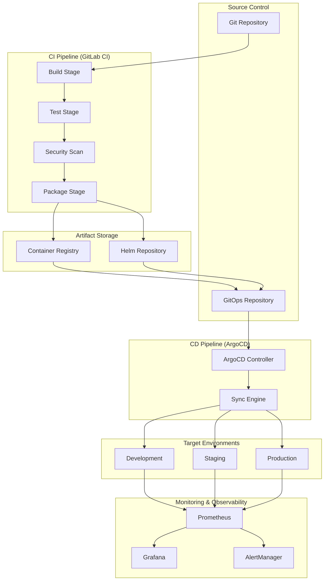
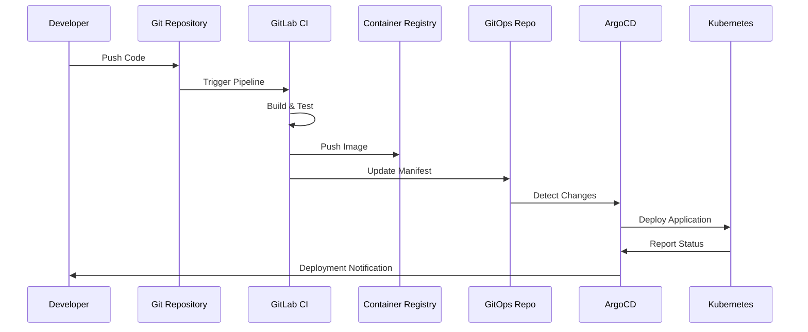

# CI/CD Pipeline Design Document

## Overview

CI/CD 파이프라인은 이지스(Aegis) 시스템의 지속적 통합 및 배포를 담당하는 핵심 인프라입니다. **GitOps 원칙**을 기반으로 한 완전 자동화된 파이프라인을 통해 코드 변경부터 프로덕션 배포까지의 전체 과정을 안전하고 효율적으로 관리합니다.

## Shared Library CI/CD

shared-library는 별도의 CI/CD 파이프라인을 가집니다:

**파이프라인 단계:**
1. **Test**: 단위 테스트 및 커버리지 측정 (80% 이상)
2. **Build**: Python 패키지 빌드
3. **Publish**: Private PyPI에 배포
4. **Tag**: 버전 태깅 및 CHANGELOG 생성

**버전 관리:**
- Semantic Versioning (SemVer)
- 자동 버전 bump
- Breaking changes 명시

**다른 서비스 배포:**
- shared-library 새 버전 배포 시
- 모든 서비스가 새 버전 사용
- 호환성 테스트 자동 실행

## Architecture

### 전체 CI/CD 아키텍처



### GitOps 워크플로우



## Components and Interfaces

### 1. GitLab CI Pipeline Configuration

#### 1.1 .gitlab-ci.yml 구조
```yaml
# .gitlab-ci.yml
stages:
  - validate
  - build
  - test
  - security
  - package
  - deploy-dev
  - deploy-staging
  - deploy-prod

variables:
  DOCKER_DRIVER: overlay2
  DOCKER_TLS_CERTDIR: "/certs"
  IMAGE_NAME: $CI_REGISTRY_IMAGE/$CI_COMMIT_REF_SLUG
  IMAGE_TAG: $CI_COMMIT_SHA

# 코드 검증 단계
validate:
  stage: validate
  image: python:3.11-slim
  script:
    - pip install pre-commit
    - pre-commit run --all-files
  rules:
    - if: $CI_PIPELINE_SOURCE == "merge_request_event"
    - if: $CI_COMMIT_BRANCH == $CI_DEFAULT_BRANCH

# 빌드 단계
build:
  stage: build
  image: docker:20.10.16
  services:
    - docker:20.10.16-dind
  before_script:
    - echo $CI_REGISTRY_PASSWORD | docker login -u $CI_REGISTRY_USER --password-stdin $CI_REGISTRY
  script:
    - docker build -t $IMAGE_NAME:$IMAGE_TAG .
    - docker push $IMAGE_NAME:$IMAGE_TAG
  rules:
    - if: $CI_COMMIT_BRANCH == $CI_DEFAULT_BRANCH
    - if: $CI_PIPELINE_SOURCE == "merge_request_event"

# 테스트 단계
test:unit:
  stage: test
  image: python:3.11-slim
  script:
    - pip install -r requirements-test.txt
    - pytest tests/unit --cov=app --cov-report=xml --cov-report=term
    - coverage report --fail-under=80
  coverage: '/TOTAL.*\s+(\d+%)$/'
  artifacts:
    reports:
      coverage_report:
        coverage_format: cobertura
        path: coverage.xml
    expire_in: 1 week

test:integration:
  stage: test
  image: docker:20.10.16
  services:
    - docker:20.10.16-dind
    - postgres:15
    - redis:7-alpine
  variables:
    POSTGRES_DB: test_db
    POSTGRES_USER: test_user
    POSTGRES_PASSWORD: test_pass
  script:
    - docker-compose -f docker-compose.test.yml up -d
    - sleep 30
    - docker-compose -f docker-compose.test.yml exec -T app pytest tests/integration
  after_script:
    - docker-compose -f docker-compose.test.yml down

# 보안 스캔
security:sast:
  stage: security
  image: securecodewarrior/gitlab-sast:latest
  script:
    - /analyzer run
  artifacts:
    reports:
      sast: gl-sast-report.json
  rules:
    - if: $CI_COMMIT_BRANCH == $CI_DEFAULT_BRANCH

security:container:
  stage: security
  image: aquasec/trivy:latest
  script:
    - trivy image --format template --template "@contrib/gitlab.tpl" -o gl-container-scanning-report.json $IMAGE_NAME:$IMAGE_TAG
  artifacts:
    reports:
      container_scanning: gl-container-scanning-report.json
  dependencies:
    - build

# 패키징 단계
package:helm:
  stage: package
  image: alpine/helm:latest
  script:
    - helm package helm/aegis --version $CI_COMMIT_SHA --app-version $CI_COMMIT_SHA
    - helm push aegis-$CI_COMMIT_SHA.tgz oci://$CI_REGISTRY_IMAGE/helm
  rules:
    - if: $CI_COMMIT_BRANCH == $CI_DEFAULT_BRANCH

# 개발 환경 배포
deploy:dev:
  stage: deploy-dev
  image: bitnami/kubectl:latest
  script:
    - kubectl config use-context $KUBE_CONTEXT_DEV
    - |
      cat <<EOF | kubectl apply -f -
      apiVersion: argoproj.io/v1alpha1
      kind: Application
      metadata:
        name: aegis-dev
        namespace: argocd
      spec:
        project: default
        source:
          repoURL: $GITOPS_REPO
          targetRevision: HEAD
          path: environments/dev
        destination:
          server: https://kubernetes.default.svc
          namespace: aegis-dev
        syncPolicy:
          automated:
            prune: true
            selfHeal: true
      EOF
  environment:
    name: development
    url: https://dev.aegis.kr
  rules:
    - if: $CI_COMMIT_BRANCH == $CI_DEFAULT_BRANCH

# 스테이징 환경 배포
deploy:staging:
  stage: deploy-staging
  image: bitnami/kubectl:latest
  script:
    - kubectl config use-context $KUBE_CONTEXT_STAGING
    - |
      cat <<EOF | kubectl apply -f -
      apiVersion: argoproj.io/v1alpha1
      kind: Application
      metadata:
        name: aegis-staging
        namespace: argocd
      spec:
        project: default
        source:
          repoURL: $GITOPS_REPO
          targetRevision: HEAD
          path: environments/staging
        destination:
          server: https://kubernetes.default.svc
          namespace: aegis-staging
        syncPolicy:
          automated:
            prune: true
            selfHeal: true
      EOF
  environment:
    name: staging
    url: https://staging.aegis.kr
  rules:
    - if: $CI_COMMIT_BRANCH == $CI_DEFAULT_BRANCH
  needs:
    - deploy:dev

# 프로덕션 배포 (수동 승인 필요)
deploy:prod:
  stage: deploy-prod
  image: bitnami/kubectl:latest
  script:
    - kubectl config use-context $KUBE_CONTEXT_PROD
    - |
      cat <<EOF | kubectl apply -f -
      apiVersion: argoproj.io/v1alpha1
      kind: Application
      metadata:
        name: aegis-prod
        namespace: argocd
      spec:
        project: default
        source:
          repoURL: $GITOPS_REPO
          targetRevision: HEAD
          path: environments/prod
        destination:
          server: https://kubernetes.default.svc
          namespace: aegis-prod
        syncPolicy:
          syncOptions:
          - CreateNamespace=true
      EOF
  environment:
    name: production
    url: https://aegis.kr
  rules:
    - if: $CI_COMMIT_BRANCH == $CI_DEFAULT_BRANCH
      when: manual
  needs:
    - deploy:staging
```

### 2. ArgoCD 설정

#### 2.1 ArgoCD Application 매니페스트
```yaml
# argocd/applications/aegis-prod.yaml
apiVersion: argoproj.io/v1alpha1
kind: Application
metadata:
  name: aegis-prod
  namespace: argocd
  finalizers:
    - resources-finalizer.argocd.argoproj.io
spec:
  project: aegis
  source:
    repoURL: https://gitlab.com/aegis/gitops
    targetRevision: HEAD
    path: environments/prod
    helm:
      valueFiles:
        - values.yaml
        - values-prod.yaml
  destination:
    server: https://kubernetes.default.svc
    namespace: aegis-prod
  syncPolicy:
    automated:
      prune: true
      selfHeal: true
      allowEmpty: false
    syncOptions:
      - CreateNamespace=true
      - PrunePropagationPolicy=foreground
      - PruneLast=true
    retry:
      limit: 5
      backoff:
        duration: 5s
        factor: 2
        maxDuration: 3m
  revisionHistoryLimit: 10
```

#### 2.2 ArgoCD Project 설정
```yaml
# argocd/projects/aegis.yaml
apiVersion: argoproj.io/v1alpha1
kind: AppProject
metadata:
  name: aegis
  namespace: argocd
spec:
  description: Aegis Project
  sourceRepos:
    - 'https://gitlab.com/aegis/*'
    - 'https://charts.helm.sh/stable'
  destinations:
    - namespace: 'aegis-*'
      server: https://kubernetes.default.svc
  clusterResourceWhitelist:
    - group: ''
      kind: Namespace
    - group: rbac.authorization.k8s.io
      kind: ClusterRole
    - group: rbac.authorization.k8s.io
      kind: ClusterRoleBinding
  namespaceResourceWhitelist:
    - group: ''
      kind: '*'
    - group: apps
      kind: '*'
    - group: extensions
      kind: '*'
  roles:
    - name: admin
      description: Admin role for Aegis project
      policies:
        - p, proj:aegis:admin, applications, *, aegis/*, allow
        - p, proj:aegis:admin, repositories, *, *, allow
      groups:
        - aegis:admin
    - name: developer
      description: Developer role for Aegis project
      policies:
        - p, proj:aegis:developer, applications, get, aegis/*, allow
        - p, proj:aegis:developer, applications, sync, aegis/*, allow
      groups:
        - aegis:developer
```

### 3. GitOps Repository 구조

#### 3.1 GitOps 저장소 구조
```
gitops-repo/
├── applications/
│   ├── aegis-dev.yaml
│   ├── aegis-staging.yaml
│   └── aegis-prod.yaml
├── environments/
│   ├── dev/
│   │   ├── kustomization.yaml
│   │   ├── values.yaml
│   │   └── patches/
│   ├── staging/
│   │   ├── kustomization.yaml
│   │   ├── values.yaml
│   │   └── patches/
│   └── prod/
│       ├── kustomization.yaml
│       ├── values.yaml
│       └── patches/
├── base/
│   ├── api/
│   ├── database/
│   ├── redis/
│   └── monitoring/
└── scripts/
    ├── update-image.sh
    └── promote-env.sh
```

#### 3.2 Kustomization 설정
```yaml
# environments/prod/kustomization.yaml
apiVersion: kustomize.config.k8s.io/v1beta1
kind: Kustomization

namespace: aegis-prod

resources:
  - ../../base/api
  - ../../base/database
  - ../../base/redis
  - ../../base/monitoring

patchesStrategicMerge:
  - patches/api-prod.yaml
  - patches/database-prod.yaml

images:
  - name: aegis/api
    newTag: latest
  - name: aegis/recommendation
    newTag: latest

configMapGenerator:
  - name: app-config
    files:
      - config/app.yaml
    options:
      disableNameSuffixHash: true

secretGenerator:
  - name: app-secrets
    files:
      - secrets/database.env
      - secrets/redis.env
    options:
      disableNameSuffixHash: true
```

### 4. 보안 및 시크릿 관리

#### 4.1 GitLab CI 변수 설정
```yaml
# GitLab CI/CD Variables (UI에서 설정)
variables:
  # Container Registry
  CI_REGISTRY: registry.gitlab.com
  CI_REGISTRY_IMAGE: registry.gitlab.com/aegis/app
  
  # Kubernetes Contexts
  KUBE_CONTEXT_DEV: aegis/dev-cluster:aegis-dev
  KUBE_CONTEXT_STAGING: aegis/staging-cluster:aegis-staging
  KUBE_CONTEXT_PROD: aegis/prod-cluster:aegis-prod
  
  # GitOps Repository
  GITOPS_REPO: https://gitlab.com/aegis/gitops
  
  # Notification
  SLACK_WEBHOOK_URL: https://hooks.slack.com/services/...
  
  # Security Scanning
  TRIVY_USERNAME: $CI_REGISTRY_USER
  TRIVY_PASSWORD: $CI_REGISTRY_PASSWORD
```

#### 4.2 Kubernetes Secrets 관리
```yaml
# External Secrets Operator 설정
apiVersion: external-secrets.io/v1beta1
kind: SecretStore
metadata:
  name: vault-backend
  namespace: aegis-prod
spec:
  provider:
    vault:
      server: "https://vault.aegis.kr"
      path: "secret"
      version: "v2"
      auth:
        kubernetes:
          mountPath: "kubernetes"
          role: "aegis-prod"
          serviceAccountRef:
            name: "external-secrets-sa"
---
apiVersion: external-secrets.io/v1beta1
kind: ExternalSecret
metadata:
  name: app-secrets
  namespace: aegis-prod
spec:
  refreshInterval: 1h
  secretStoreRef:
    name: vault-backend
    kind: SecretStore
  target:
    name: app-secrets
    creationPolicy: Owner
  data:
  - secretKey: database-url
    remoteRef:
      key: aegis/prod
      property: database_url
  - secretKey: redis-url
    remoteRef:
      key: aegis/prod
      property: redis_url
```

### 5. 모니터링 및 알림

#### 5.1 파이프라인 메트릭 수집
```python
# scripts/pipeline-metrics.py
import gitlab
import prometheus_client
from prometheus_client import CollectorRegistry, Gauge, Counter, push_to_gateway

class PipelineMetrics:
    def __init__(self, gitlab_token, project_id):
        self.gl = gitlab.Gitlab('https://gitlab.com', private_token=gitlab_token)
        self.project = self.gl.projects.get(project_id)
        
        # 메트릭 정의
        self.pipeline_duration = Gauge(
            'gitlab_pipeline_duration_seconds',
            'Pipeline duration in seconds',
            ['project', 'branch', 'status']
        )
        
        self.pipeline_success_rate = Gauge(
            'gitlab_pipeline_success_rate',
            'Pipeline success rate',
            ['project', 'branch']
        )
        
        self.deployment_frequency = Counter(
            'gitlab_deployments_total',
            'Total number of deployments',
            ['project', 'environment']
        )
    
    def collect_metrics(self):
        """파이프라인 메트릭 수집"""
        pipelines = self.project.pipelines.list(per_page=100)
        
        for pipeline in pipelines:
            duration = pipeline.duration or 0
            self.pipeline_duration.labels(
                project=self.project.name,
                branch=pipeline.ref,
                status=pipeline.status
            ).set(duration)
            
            # 배포 메트릭 수집
            if pipeline.status == 'success':
                jobs = pipeline.jobs.list()
                for job in jobs:
                    if job.name.startswith('deploy:'):
                        env = job.name.split(':')[1]
                        self.deployment_frequency.labels(
                            project=self.project.name,
                            environment=env
                        ).inc()
    
    def push_metrics(self, gateway_url):
        """Prometheus Gateway로 메트릭 전송"""
        push_to_gateway(
            gateway_url,
            job='gitlab-pipeline-metrics',
            registry=prometheus_client.REGISTRY
        )
```

#### 5.2 Slack 알림 설정
```python
# scripts/slack-notifications.py
import requests
import json
from datetime import datetime

class SlackNotifier:
    def __init__(self, webhook_url):
        self.webhook_url = webhook_url
    
    def send_pipeline_notification(self, pipeline_data):
        """파이프라인 결과 알림"""
        status_color = {
            'success': 'good',
            'failed': 'danger',
            'running': 'warning'
        }
        
        message = {
            "attachments": [
                {
                    "color": status_color.get(pipeline_data['status'], 'warning'),
                    "title": f"Pipeline {pipeline_data['status'].upper()}",
                    "title_link": pipeline_data['web_url'],
                    "fields": [
                        {
                            "title": "Project",
                            "value": pipeline_data['project_name'],
                            "short": True
                        },
                        {
                            "title": "Branch",
                            "value": pipeline_data['ref'],
                            "short": True
                        },
                        {
                            "title": "Duration",
                            "value": f"{pipeline_data['duration']}s",
                            "short": True
                        },
                        {
                            "title": "Commit",
                            "value": pipeline_data['sha'][:8],
                            "short": True
                        }
                    ],
                    "footer": "GitLab CI/CD",
                    "ts": int(datetime.now().timestamp())
                }
            ]
        }
        
        response = requests.post(self.webhook_url, json=message)
        return response.status_code == 200
    
    def send_deployment_notification(self, deployment_data):
        """배포 결과 알림"""
        message = {
            "text": f"🚀 Deployment to {deployment_data['environment']} completed!",
            "attachments": [
                {
                    "color": "good",
                    "fields": [
                        {
                            "title": "Application",
                            "value": deployment_data['app_name'],
                            "short": True
                        },
                        {
                            "title": "Version",
                            "value": deployment_data['version'],
                            "short": True
                        },
                        {
                            "title": "Environment",
                            "value": deployment_data['environment'],
                            "short": True
                        },
                        {
                            "title": "URL",
                            "value": deployment_data['url'],
                            "short": True
                        }
                    ]
                }
            ]
        }
        
        response = requests.post(self.webhook_url, json=message)
        return response.status_code == 200
```

## Data Models

### 파이프라인 설정 모델

```python
from pydantic import BaseModel
from typing import List, Dict, Optional
from enum import Enum

class PipelineStage(str, Enum):
    VALIDATE = "validate"
    BUILD = "build"
    TEST = "test"
    SECURITY = "security"
    PACKAGE = "package"
    DEPLOY = "deploy"

class Environment(str, Enum):
    DEVELOPMENT = "development"
    STAGING = "staging"
    PRODUCTION = "production"

class PipelineConfig(BaseModel):
    name: str
    stages: List[PipelineStage]
    variables: Dict[str, str]
    rules: List[Dict[str, str]]
    
class DeploymentConfig(BaseModel):
    environment: Environment
    cluster: str
    namespace: str
    auto_deploy: bool = False
    approval_required: bool = False
    
class QualityGate(BaseModel):
    coverage_threshold: float = 80.0
    security_threshold: str = "medium"
    performance_threshold: float = 3.0
    
class NotificationConfig(BaseModel):
    slack_webhook: Optional[str]
    email_recipients: List[str] = []
    notify_on_success: bool = True
    notify_on_failure: bool = True
```

## Error Handling

### 파이프라인 오류 처리

```python
class PipelineError(Exception):
    """파이프라인 기본 예외"""
    pass

class BuildFailureError(PipelineError):
    """빌드 실패 예외"""
    pass

class TestFailureError(PipelineError):
    """테스트 실패 예외"""
    pass

class SecurityScanError(PipelineError):
    """보안 스캔 실패 예외"""
    pass

class DeploymentError(PipelineError):
    """배포 실패 예외"""
    pass

# 오류 처리 및 복구 로직
class PipelineErrorHandler:
    def __init__(self):
        self.retry_strategies = {
            BuildFailureError: self.retry_build,
            TestFailureError: self.analyze_test_failure,
            SecurityScanError: self.handle_security_issues,
            DeploymentError: self.rollback_deployment
        }
    
    def handle_error(self, error: PipelineError, context: dict):
        """오류 타입에 따른 처리"""
        handler = self.retry_strategies.get(type(error))
        if handler:
            return handler(error, context)
        else:
            return self.default_error_handling(error, context)
    
    def retry_build(self, error: BuildFailureError, context: dict):
        """빌드 재시도 로직"""
        if context.get('retry_count', 0) < 3:
            return {'action': 'retry', 'delay': 60}
        return {'action': 'fail', 'notify': True}
    
    def rollback_deployment(self, error: DeploymentError, context: dict):
        """배포 실패 시 롤백"""
        return {
            'action': 'rollback',
            'target_version': context.get('previous_version'),
            'notify': True
        }
```

## Testing Strategy

### 파이프라인 테스트

```python
import pytest
from unittest.mock import Mock, patch
from pipeline.gitlab_ci import GitLabPipeline

class TestGitLabPipeline:
    @pytest.fixture
    def pipeline(self):
        return GitLabPipeline(
            project_id=123,
            token="test-token"
        )
    
    @pytest.mark.asyncio
    async def test_build_stage_success(self, pipeline):
        """빌드 단계 성공 테스트"""
        with patch('pipeline.docker.build') as mock_build:
            mock_build.return_value = True
            
            result = await pipeline.run_build_stage()
            
            assert result.status == 'success'
            assert result.artifacts is not None
            mock_build.assert_called_once()
    
    @pytest.mark.asyncio
    async def test_deployment_rollback(self, pipeline):
        """배포 롤백 테스트"""
        with patch('pipeline.kubernetes.rollback') as mock_rollback:
            mock_rollback.return_value = True
            
            result = await pipeline.rollback_deployment(
                environment='production',
                target_version='v1.2.3'
            )
            
            assert result.status == 'success'
            mock_rollback.assert_called_with('v1.2.3')

# 통합 테스트
@pytest.mark.integration
class TestPipelineIntegration:
    def test_full_pipeline_flow(self):
        """전체 파이프라인 플로우 테스트"""
        # 실제 Git 저장소와 연동한 통합 테스트
        pass
    
    def test_gitops_sync(self):
        """GitOps 동기화 테스트"""
        # ArgoCD와의 실제 동기화 테스트
        pass
```

---
# CI/CD Pipeline Design Document - Additional Sections

## Production Considerations ⭐

### 확장성 (Scalability)

#### GitLab Runner 자동 스케일링

```yaml
# gitlab-runner-config.toml
concurrent = 50
check_interval = 0

[[runners]]
  name = "aegis-kubernetes-runner"
  url = "https://gitlab.com/"
  token = "RUNNER_TOKEN"
  executor = "kubernetes"
  
  [runners.kubernetes]
    host = ""
    namespace = "gitlab-runner"
    privileged = true
    cpu_limit = "2"
    memory_limit = "4Gi"
    service_cpu_limit = "1"
    service_memory_limit = "2Gi"
    helper_cpu_limit = "500m"
    helper_memory_limit = "512Mi"
    poll_interval = 5
    poll_timeout = 3600
    
    # 자동 스케일링 설정
    [runners.kubernetes.pod_annotations]
      "cluster-autoscaler.kubernetes.io/safe-to-evict" = "true"
    
    [[runners.kubernetes.volumes.empty_dir]]
      name = "docker-certs"
      mount_path = "/certs/client"
      medium = "Memory"
```

#### HPA 설정

```yaml
apiVersion: autoscaling/v2
kind: HorizontalPodAutoscaler
metadata:
  name: gitlab-runner-hpa
  namespace: gitlab-runner
spec:
  scaleTargetRef:
    apiVersion: apps/v1
    kind: Deployment
    name: gitlab-runner
  minReplicas: 2
  maxReplicas: 50
  metrics:
  - type: Resource
    resource:
      name: cpu
      target:
        type: Utilization
        averageUtilization: 70
  - type: Pods
    pods:
      metric:
        name: gitlab_runner_jobs
      target:
        type: AverageValue
        averageValue: "5"
```

### 장애 복구 (Disaster Recovery)

#### 백업 전략

```python
# scripts/backup-cicd.py
import gitlab
import boto3
from datetime import datetime
import json

class CICDBackup:
    def __init__(self):
        self.gl = gitlab.Gitlab('https://gitlab.com', private_token='token')
        self.s3 = boto3.client('s3')
        self.bucket = 'aegis-cicd-backups'
    
    def backup_gitlab_config(self):
        """GitLab CI/CD 설정 백업"""
        projects = self.gl.projects.list(all=True)
        
        backup_data = {
            'timestamp': datetime.now().isoformat(),
            'projects': []
        }
        
        for project in projects:
            project_data = {
                'id': project.id,
                'name': project.name,
                'variables': [],
                'pipelines': []
            }
            
            # CI/CD 변수 백업
            variables = project.variables.list()
            for var in variables:
                project_data['variables'].append({
                    'key': var.key,
                    'value': var.value,  # 암호화 필요
                    'protected': var.protected,
                    'masked': var.masked
                })
            
            # 최근 파이프라인 설정 백업
            pipelines = project.pipelines.list(per_page=10)
            for pipeline in pipelines:
                project_data['pipelines'].append({
                    'id': pipeline.id,
                    'ref': pipeline.ref,
                    'sha': pipeline.sha,
                    'status': pipeline.status
                })
            
            backup_data['projects'].append(project_data)
        
        # S3에 백업
        backup_key = f"gitlab-config/{datetime.now().strftime('%Y%m%d_%H%M%S')}.json"
        self.s3.put_object(
            Bucket=self.bucket,
            Key=backup_key,
            Body=json.dumps(backup_data),
            ServerSideEncryption='AES256'
        )
        
        return backup_key
    
    def backup_argocd_config(self):
        """ArgoCD 설정 백업"""
        # ArgoCD 애플리케이션 및 프로젝트 설정 백업
        pass
    
    def restore_from_backup(self, backup_key):
        """백업으로부터 복원"""
        # S3에서 백업 데이터 가져오기
        response = self.s3.get_object(Bucket=self.bucket, Key=backup_key)
        backup_data = json.loads(response['Body'].read())
        
        # GitLab 설정 복원
        for project_data in backup_data['projects']:
            project = self.gl.projects.get(project_data['id'])
            
            # CI/CD 변수 복원
            for var in project_data['variables']:
                try:
                    project.variables.create({
                        'key': var['key'],
                        'value': var['value'],
                        'protected': var['protected'],
                        'masked': var['masked']
                    })
                except Exception as e:
                    print(f"Failed to restore variable {var['key']}: {e}")
```

### 캐싱 전략 (Caching)

#### Docker 레이어 캐싱

```yaml
# .gitlab-ci.yml
build:
  stage: build
  image: docker:20.10.16
  services:
    - docker:20.10.16-dind
  variables:
    DOCKER_BUILDKIT: 1
    BUILDKIT_INLINE_CACHE: 1
  before_script:
    - docker login -u $CI_REGISTRY_USER -p $CI_REGISTRY_PASSWORD $CI_REGISTRY
  script:
    # 이전 이미지를 캐시로 사용
    - docker pull $CI_REGISTRY_IMAGE:latest || true
    - |
      docker build \
        --cache-from $CI_REGISTRY_IMAGE:latest \
        --build-arg BUILDKIT_INLINE_CACHE=1 \
        --tag $CI_REGISTRY_IMAGE:$CI_COMMIT_SHA \
        --tag $CI_REGISTRY_IMAGE:latest \
        .
    - docker push $CI_REGISTRY_IMAGE:$CI_COMMIT_SHA
    - docker push $CI_REGISTRY_IMAGE:latest
```

#### 의존성 캐싱

```yaml
# .gitlab-ci.yml
.cache_template: &cache_template
  cache:
    key:
      files:
        - requirements.txt
        - package-lock.json
    paths:
      - .pip-cache/
      - node_modules/
    policy: pull-push

test:
  <<: *cache_template
  stage: test
  before_script:
    - pip install --cache-dir .pip-cache -r requirements.txt
  script:
    - pytest tests/
```

### 모니터링 (Monitoring)

#### Prometheus 메트릭

```python
# scripts/pipeline-exporter.py
from prometheus_client import start_http_server, Gauge, Counter, Histogram
import gitlab
import time

class PipelineExporter:
    def __init__(self, gitlab_token, project_id):
        self.gl = gitlab.Gitlab('https://gitlab.com', private_token=gitlab_token)
        self.project = self.gl.projects.get(project_id)
        
        # 메트릭 정의
        self.pipeline_duration = Histogram(
            'gitlab_pipeline_duration_seconds',
            'Pipeline duration in seconds',
            ['project', 'branch', 'status'],
            buckets=[60, 300, 600, 1200, 1800, 3600]
        )
        
        self.pipeline_success_total = Counter(
            'gitlab_pipeline_success_total',
            'Total successful pipelines',
            ['project', 'branch']
        )
        
        self.pipeline_failure_total = Counter(
            'gitlab_pipeline_failure_total',
            'Total failed pipelines',
            ['project', 'branch']
        )
        
        self.deployment_total = Counter(
            'gitlab_deployment_total',
            'Total deployments',
            ['project', 'environment', 'status']
        )
        
        self.pipeline_queue_time = Gauge(
            'gitlab_pipeline_queue_time_seconds',
            'Time pipeline spent in queue',
            ['project']
        )
    
    def collect_metrics(self):
        """메트릭 수집"""
        pipelines = self.project.pipelines.list(per_page=100)
        
        for pipeline in pipelines:
            if pipeline.duration:
                self.pipeline_duration.labels(
                    project=self.project.name,
                    branch=pipeline.ref,
                    status=pipeline.status
                ).observe(pipeline.duration)
            
            if pipeline.status == 'success':
                self.pipeline_success_total.labels(
                    project=self.project.name,
                    branch=pipeline.ref
                ).inc()
            elif pipeline.status == 'failed':
                self.pipeline_failure_total.labels(
                    project=self.project.name,
                    branch=pipeline.ref
                ).inc()
            
            # 배포 메트릭
            jobs = pipeline.jobs.list()
            for job in jobs:
                if job.name.startswith('deploy:'):
                    env = job.name.split(':')[1]
                    self.deployment_total.labels(
                        project=self.project.name,
                        environment=env,
                        status=job.status
                    ).inc()
    
    def run(self, port=9090):
        """메트릭 서버 실행"""
        start_http_server(port)
        while True:
            self.collect_metrics()
            time.sleep(60)  # 1분마다 수집

if __name__ == '__main__':
    exporter = PipelineExporter(
        gitlab_token='YOUR_TOKEN',
        project_id=123
    )
    exporter.run()
```

#### Grafana 대시보드

```json
{
  "dashboard": {
    "title": "CI/CD Pipeline Metrics",
    "panels": [
      {
        "title": "Pipeline Success Rate",
        "targets": [
          {
            "expr": "rate(gitlab_pipeline_success_total[5m]) / (rate(gitlab_pipeline_success_total[5m]) + rate(gitlab_pipeline_failure_total[5m]))"
          }
        ]
      },
      {
        "title": "Average Pipeline Duration",
        "targets": [
          {
            "expr": "histogram_quantile(0.95, rate(gitlab_pipeline_duration_seconds_bucket[5m]))"
          }
        ]
      },
      {
        "title": "Deployment Frequency",
        "targets": [
          {
            "expr": "rate(gitlab_deployment_total{status=\"success\"}[1h])"
          }
        ]
      },
      {
        "title": "Failed Pipelines",
        "targets": [
          {
            "expr": "increase(gitlab_pipeline_failure_total[24h])"
          }
        ]
      }
    ]
  }
}
```

### 보안 (Security)

#### 시크릿 스캔

```yaml
# .gitlab-ci.yml
security:secrets:
  stage: security
  image: trufflesecurity/trufflehog:latest
  script:
    - trufflehog filesystem . --json --fail > trufflehog-report.json
  artifacts:
    reports:
      secret_detection: trufflehog-report.json
  allow_failure: false
```

#### SBOM 생성

```yaml
# .gitlab-ci.yml
security:sbom:
  stage: security
  image: anchore/syft:latest
  script:
    - syft $CI_REGISTRY_IMAGE:$CI_COMMIT_SHA -o cyclonedx-json > sbom.json
  artifacts:
    paths:
      - sbom.json
    expire_in: 1 year
```

---

## Performance Benchmarks

### 성능 목표

| 메트릭 | 목표 | 측정 방법 |
|--------|------|----------|
| 평균 빌드 시간 | < 10분 | Prometheus |
| 평균 테스트 시간 | < 15분 | Prometheus |
| 배포 시간 (개발) | < 5분 | ArgoCD 메트릭 |
| 배포 시간 (프로덕션) | < 10분 | ArgoCD 메트릭 |
| 파이프라인 성공률 | > 95% | GitLab API |
| 배포 성공률 | > 98% | ArgoCD API |
| 동시 빌드 처리 | > 10개 | GitLab Runner 메트릭 |
| 파이프라인 큐 대기 시간 | < 30초 | Prometheus |

### 성능 최적화 전략

```python
# 성능 최적화 체크리스트
performance_optimizations = {
    'build': [
        '✅ Docker 레이어 캐싱',
        '✅ 멀티스테이지 빌드',
        '✅ 빌드 아티팩트 재사용',
        '✅ 병렬 빌드 실행'
    ],
    'test': [
        '✅ 테스트 병렬 실행',
        '✅ 테스트 결과 캐싱',
        '✅ 선택적 테스트 실행',
        '✅ 테스트 데이터 재사용'
    ],
    'deployment': [
        '✅ 롤링 업데이트',
        '✅ 이미지 프리풀링',
        '✅ 헬스체크 최적화',
        '✅ 리소스 사전 할당'
    ],
    'infrastructure': [
        '✅ Runner 자동 스케일링',
        '✅ 리소스 제한 최적화',
        '✅ 네트워크 최적화',
        '✅ 스토리지 최적화'
    ]
}
```

---

## Configuration Management

### 환경 변수 관리

```yaml
# .gitlab-ci.yml - 환경별 변수
variables:
  # 공통 변수
  DOCKER_DRIVER: overlay2
  DOCKER_TLS_CERTDIR: "/certs"
  
  # 개발 환경
  DEV_CLUSTER: "dev-cluster"
  DEV_NAMESPACE: "aegis-dev"
  DEV_DOMAIN: "dev.aegis.kr"
  
  # 스테이징 환경
  STAGING_CLUSTER: "staging-cluster"
  STAGING_NAMESPACE: "aegis-staging"
  STAGING_DOMAIN: "staging.aegis.kr"
  
  # 프로덕션 환경
  PROD_CLUSTER: "prod-cluster"
  PROD_NAMESPACE: "aegis-prod"
  PROD_DOMAIN: "aegis.kr"
```

### ArgoCD 설정 관리

```yaml
# argocd/config/argocd-cm.yaml
apiVersion: v1
kind: ConfigMap
metadata:
  name: argocd-cm
  namespace: argocd
data:
  # Git 저장소 설정
  repositories: |
    - url: https://gitlab.com/aegis/gitops
      passwordSecret:
        name: gitlab-secret
        key: password
      usernameSecret:
        name: gitlab-secret
        key: username
  
  # 알림 설정
  notifications.slack: |
    token: $slack-token
    channels:
      - name: deployments
        channel: #deployments
  
  # 리소스 제외 설정
  resource.exclusions: |
    - apiGroups:
      - cilium.io
      kinds:
      - CiliumIdentity
      clusters:
      - "*"
  
  # 헬스체크 설정
  resource.customizations: |
    argoproj.io/Application:
      health.lua: |
        hs = {}
        hs.status = "Progressing"
        hs.message = ""
        if obj.status ~= nil then
          if obj.status.health ~= nil then
            hs.status = obj.status.health.status
            hs.message = obj.status.health.message
          end
        end
        return hs
```

---

## Logging Strategy

### 파이프라인 로그 수집

```yaml
# filebeat-config.yaml
filebeat.inputs:
- type: log
  enabled: true
  paths:
    - /var/log/gitlab-runner/*.log
  fields:
    type: gitlab-runner
    environment: production
  multiline.pattern: '^[0-9]{4}-[0-9]{2}-[0-9]{2}'
  multiline.negate: true
  multiline.match: after

- type: log
  enabled: true
  paths:
    - /var/log/argocd/*.log
  fields:
    type: argocd
    environment: production

output.elasticsearch:
  hosts: ["elasticsearch:9200"]
  index: "cicd-logs-%{+yyyy.MM.dd}"
  
processors:
  - add_host_metadata: ~
  - add_cloud_metadata: ~
  - add_docker_metadata: ~
```

### 로그 보존 정책

```python
# scripts/log-retention.py
from elasticsearch import Elasticsearch
from datetime import datetime, timedelta

class LogRetentionPolicy:
    def __init__(self, es_host):
        self.es = Elasticsearch([es_host])
    
    def apply_retention_policy(self):
        """로그 보존 정책 적용"""
        policies = {
            'cicd-logs-*': 90,  # 90일
            'pipeline-metrics-*': 365,  # 1년
            'deployment-logs-*': 730,  # 2년
            'audit-logs-*': 2555  # 7년
        }
        
        for index_pattern, retention_days in policies.items():
            cutoff_date = datetime.now() - timedelta(days=retention_days)
            
            # 오래된 인덱스 삭제
            indices = self.es.indices.get(index=index_pattern)
            for index in indices:
                index_date = self.parse_index_date(index)
                if index_date < cutoff_date:
                    self.es.indices.delete(index=index)
                    print(f"Deleted index: {index}")
    
    def parse_index_date(self, index_name):
        """인덱스 이름에서 날짜 추출"""
        # cicd-logs-2025.10.08 형식
        date_str = index_name.split('-')[-1]
        return datetime.strptime(date_str, '%Y.%m.%d')
```

---

## Deployment

### Kubernetes 배포

```yaml
# k8s/gitlab-runner-deployment.yaml
apiVersion: apps/v1
kind: Deployment
metadata:
  name: gitlab-runner
  namespace: gitlab-runner
spec:
  replicas: 2
  selector:
    matchLabels:
      app: gitlab-runner
  template:
    metadata:
      labels:
        app: gitlab-runner
    spec:
      serviceAccountName: gitlab-runner
      containers:
      - name: gitlab-runner
        image: gitlab/gitlab-runner:latest
        command: ["/usr/bin/dumb-init", "--", "/bin/bash", "/scripts/entrypoint"]
        env:
        - name: CI_SERVER_URL
          value: "https://gitlab.com/"
        - name: RUNNER_EXECUTOR
          value: "kubernetes"
        - name: KUBERNETES_NAMESPACE
          value: "gitlab-runner"
        volumeMounts:
        - name: config
          mountPath: /etc/gitlab-runner
        - name: scripts
          mountPath: /scripts
        resources:
          requests:
            cpu: "500m"
            memory: "512Mi"
          limits:
            cpu: "2000m"
            memory: "2Gi"
      volumes:
      - name: config
        configMap:
          name: gitlab-runner-config
      - name: scripts
        configMap:
          name: gitlab-runner-scripts
---
apiVersion: v1
kind: ServiceAccount
metadata:
  name: gitlab-runner
  namespace: gitlab-runner
---
apiVersion: rbac.authorization.k8s.io/v1
kind: Role
metadata:
  name: gitlab-runner
  namespace: gitlab-runner
rules:
- apiGroups: [""]
  resources: ["pods", "pods/exec", "pods/log", "secrets", "configmaps"]
  verbs: ["get", "list", "watch", "create", "delete", "update"]
- apiGroups: [""]
  resources: ["services"]
  verbs: ["get", "list", "create", "delete"]
---
apiVersion: rbac.authorization.k8s.io/v1
kind: RoleBinding
metadata:
  name: gitlab-runner
  namespace: gitlab-runner
roleRef:
  apiGroup: rbac.authorization.k8s.io
  kind: Role
  name: gitlab-runner
subjects:
- kind: ServiceAccount
  name: gitlab-runner
  namespace: gitlab-runner
```

### ArgoCD 배포

```yaml
# k8s/argocd-deployment.yaml
apiVersion: v1
kind: Namespace
metadata:
  name: argocd
---
apiVersion: v1
kind: ConfigMap
metadata:
  name: argocd-cm
  namespace: argocd
data:
  url: https://argocd.aegis.kr
  dex.config: |
    connectors:
      - type: gitlab
        id: gitlab
        name: GitLab
        config:
          baseURL: https://gitlab.com
          clientID: $gitlab-oauth-client-id
          clientSecret: $gitlab-oauth-client-secret
          redirectURI: https://argocd.aegis.kr/api/dex/callback
---
apiVersion: apps/v1
kind: Deployment
metadata:
  name: argocd-server
  namespace: argocd
spec:
  replicas: 3
  selector:
    matchLabels:
      app: argocd-server
  template:
    metadata:
      labels:
        app: argocd-server
    spec:
      containers:
      - name: argocd-server
        image: argoproj/argocd:v2.8.0
        command: [argocd-server]
        ports:
        - containerPort: 8080
        - containerPort: 8083
        resources:
          requests:
            cpu: "500m"
            memory: "512Mi"
          limits:
            cpu: "2000m"
            memory: "2Gi"
        livenessProbe:
          httpGet:
            path: /healthz
            port: 8080
          initialDelaySeconds: 30
          periodSeconds: 10
        readinessProbe:
          httpGet:
            path: /healthz
            port: 8080
          initialDelaySeconds: 10
          periodSeconds: 5
```

---

## Observability

### 분산 추적

```python
# scripts/pipeline-tracing.py
from opentelemetry import trace
from opentelemetry.exporter.jaeger.thrift import JaegerExporter
from opentelemetry.sdk.trace import TracerProvider
from opentelemetry.sdk.trace.export import BatchSpanProcessor

class PipelineTracer:
    def __init__(self):
        trace.set_tracer_provider(TracerProvider())
        tracer = trace.get_tracer(__name__)
        
        jaeger_exporter = JaegerExporter(
            agent_host_name="jaeger-agent",
            agent_port=6831,
        )
        
        trace.get_tracer_provider().add_span_processor(
            BatchSpanProcessor(jaeger_exporter)
        )
        
        self.tracer = tracer
    
    def trace_pipeline(self, pipeline_id, stages):
        """파이프라인 실행 추적"""
        with self.tracer.start_as_current_span("pipeline") as pipeline_span:
            pipeline_span.set_attribute("pipeline.id", pipeline_id)
            
            for stage in stages:
                with self.tracer.start_as_current_span(f"stage.{stage['name']}") as stage_span:
                    stage_span.set_attribute("stage.name", stage['name'])
                    stage_span.set_attribute("stage.status", stage['status'])
                    stage_span.set_attribute("stage.duration", stage['duration'])
```

---

## Summary

CI/CD Pipeline은 GitOps 원칙을 기반으로 한 완전 자동화된 배포 시스템으로, 다음과 같은 핵심 특징을 가집니다:

**핵심 특징:**
- ✅ GitLab CI 기반 자동화된 빌드 및 테스트
- ✅ ArgoCD 기반 GitOps 배포
- ✅ 환경별 배포 전략 (개발, 스테이징, 프로덕션)
- ✅ 포괄적인 보안 스캔 (SAST, 컨테이너 스캔, 시크릿 스캔)
- ✅ 자동 롤백 및 장애 복구
- ✅ 실시간 모니터링 및 알림
- ✅ Infrastructure as Code
- ✅ 완전한 감사 추적

**성능 목표:**
- 빌드 시간 < 10분
- 배포 시간 < 10분
- 파이프라인 성공률 > 95%
- 배포 성공률 > 98%

**보안:**
- Vault 기반 시크릿 관리
- 모든 이미지 취약점 스캔
- RBAC 기반 접근 제어
- 완전한 감사 로그
