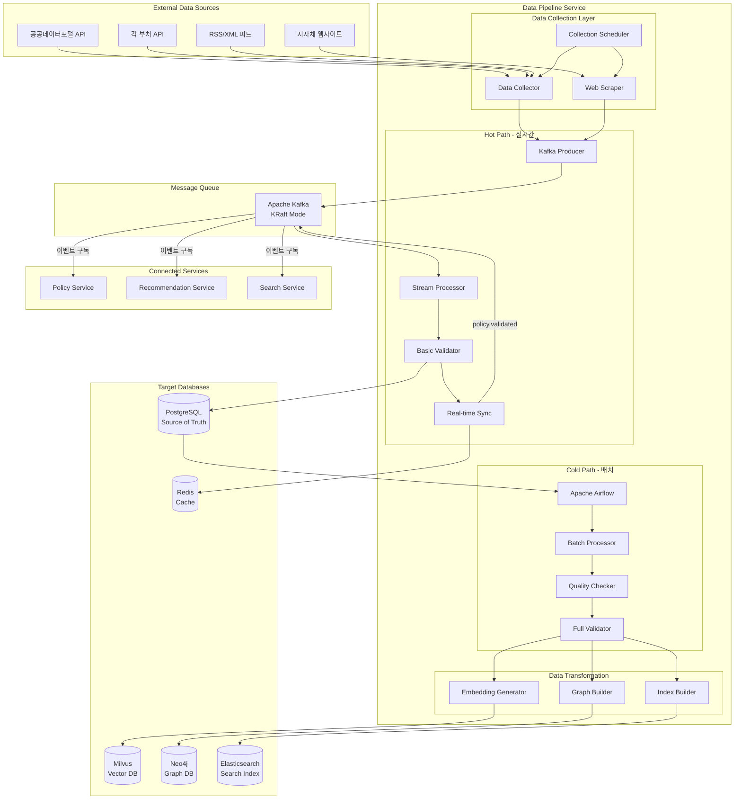
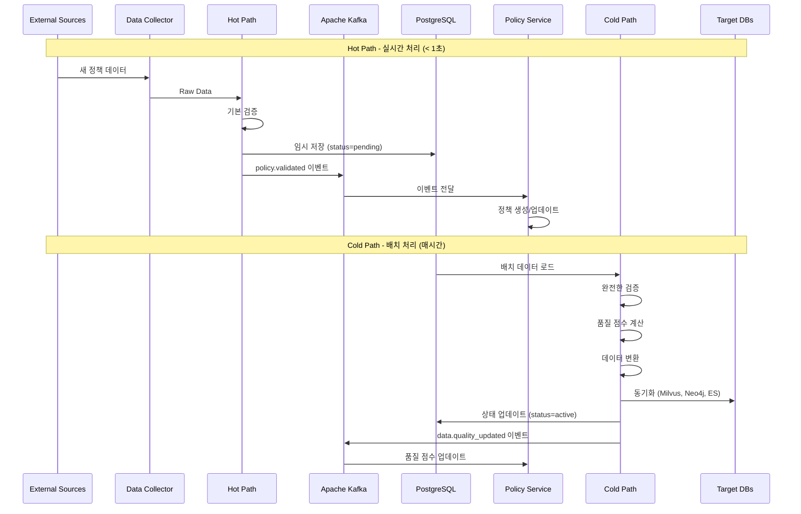
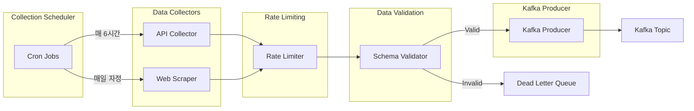
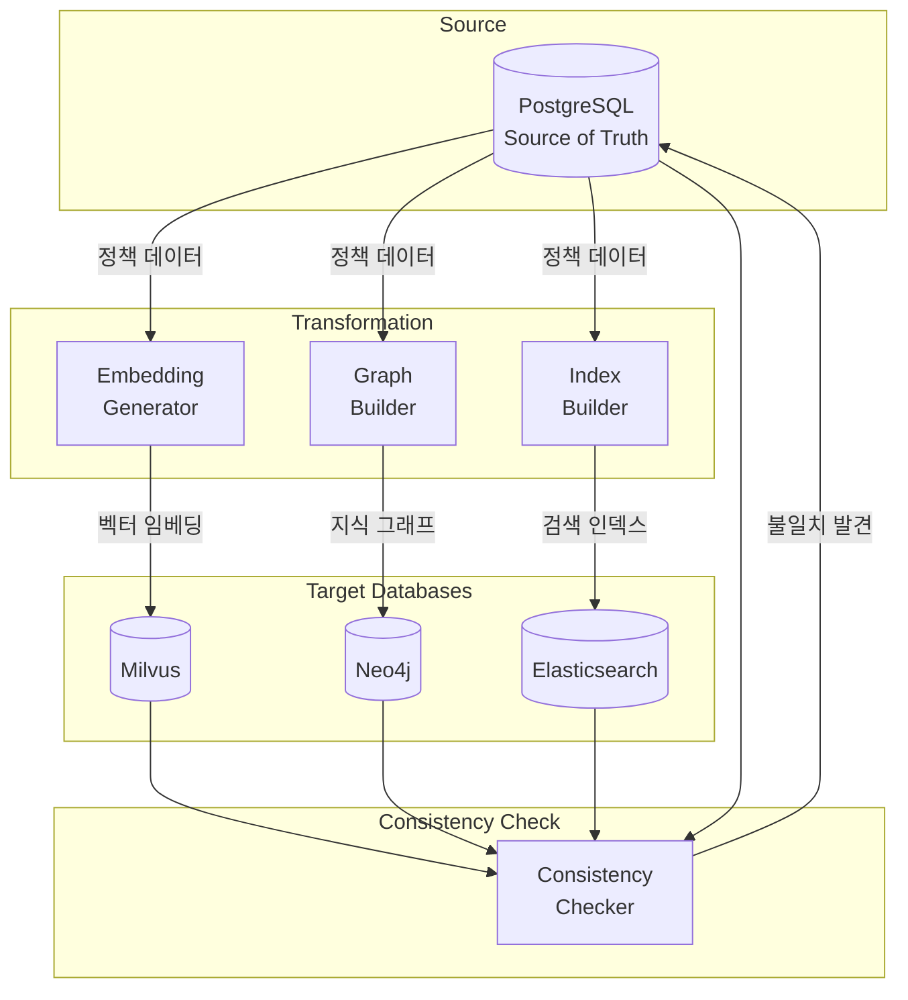

# Data Pipeline Design Document

## 1. Overview

Data Pipeline Service는 이지스(Aegis) 시스템의 **이중 트랙 파이프라인(Dual-Track Pipeline)**을 구현하는 핵심 데이터 처리 서비스입니다.

### 1.1 핵심 책임

1. **외부 데이터 수집** - 공공데이터포털, 부처 API, 웹 스크래핑
2. **이중 트랙 파이프라인** - Hot Path (실시간) + Cold Path (배치)
3. **데이터 품질 관리** - 검증, 품질 점수 계산, 이상치 탐지
4. **다중 DB 동기화** - PostgreSQL → Milvus, Neo4j, Elasticsearch
5. **데이터 일관성 보장** - 데이터베이스 간 일관성 검증 및 복구
6. **데이터 거버넌스** - 감사 로그, 데이터 계보 추적

### 1.2 역할 명확화 (중요)

**Data Pipeline Service의 역할:**
- ✅ 모든 외부 데이터 소스로부터 정책 데이터 수집
- ✅ 실시간 데이터 처리 (Hot Path, < 1초)
- ✅ 배치 데이터 검증 (Cold Path, 매시간)
- ✅ 데이터 품질 점수 계산 및 관리
- ✅ PostgreSQL을 Source of Truth로 관리
- ✅ 다중 데이터베이스 자동 동기화
- ✅ 데이터 일관성 검증 및 복구

**Data Pipeline Service가 하지 않는 것:**
- ❌ 정책 CRUD API 제공 (Policy Service 담당)
- ❌ 사용자 인증 및 권한 관리 (User Service 담당)
- ❌ 정책 검색 기능 (Search Service 담당)
- ❌ 정책 추천 기능 (Recommendation Service 담당)

### 1.3 설계 원칙

1. **단일 데이터 수집 책임**: 모든 외부 데이터 수집은 Data Pipeline만 담당
2. **이중 트랙 처리**: Hot Path (실시간성) + Cold Path (정확성)
3. **PostgreSQL as Source of Truth**: 모든 데이터의 단일 진실 공급원
4. **이벤트 기반 통신**: Kafka를 통한 서비스 간 느슨한 결합
5. **데이터 품질 보증**: 자동 검증 및 품질 점수 계산
6. **확장성**: 처리량 증가에 따른 자동 확장

### 1.4 다른 서비스와의 역할 구분

| 서비스 | 역할 | 통신 방식 | 데이터 흐름 |
|--------|------|-----------|-------------|
| **Data Pipeline** | 데이터 수집, 검증, 동기화 | 이벤트 발행 | External → Pipeline → Kafka |
| **Policy Service** | 정책 CRUD, 비즈니스 로직 | 이벤트 구독 | Kafka → Policy Service |
| **Recommendation Service** | AI 추천 | 이벤트 구독 | Kafka → Recommendation |
| **Search Service** | 검색 기능 | 이벤트 구독 | Kafka → Search |

### 1.5 이중 트랙 파이프라인

**Hot Path (실시간 처리):**
- 처리 시간: < 1초
- 검증 수준: 기본 검증 (필수 필드, 데이터 타입)
- 목적: 실시간성 보장
- 저장소: PostgreSQL (status='pending_validation')
- 이벤트: policy.validated

**Cold Path (배치 처리):**
- 처리 시간: 매시간
- 검증 수준: 완전한 검증 (품질 점수, 중복 제거, 일관성)
- 목적: 데이터 정확성 보장
- 저장소: 모든 DB (PostgreSQL, Milvus, Neo4j, Elasticsearch)
- 이벤트: data.quality_updated

### 1.6 핵심 기술 스택

**데이터 처리:**
- Stream Processing: Apache Kafka (KRaft Mode)
- Batch Processing: Apache Airflow
- ETL: Python, Pandas, PySpark

**데이터베이스:**
- Source of Truth: PostgreSQL
- Vector DB: Milvus (정책 임베딩)
- Graph DB: Neo4j (정책 관계)
- Search Index: Elasticsearch
- Cache: Redis

**데이터 수집:**
- API Client: aiohttp, requests
- Web Scraping: BeautifulSoup, Scrapy
- Scheduling: APScheduler, Airflow

---

## 2. Shared Library Integration ⭐

이 서비스는 `aegis-shared` 공통 라이브러리를 적극 활용합니다.

### 2.1 사용하는 모듈

```python
from aegis_shared.messaging import VersionedEventPublisher, KRaftKafkaProducer
from aegis_shared.logging import get_logger, add_context, LogLevel
from aegis_shared.monitoring import track_metrics, MetricsCollector
from aegis_shared.errors import ErrorCode, ServiceException
from aegis_shared.cache import cache_result, RedisClient
from aegis_shared.config import get_config
from aegis_shared.database import SchemaRegistry
```

### 2.2 왜 Shared Library를 사용하는가?

#### 2.2.1 VersionedEventPublisher로 이벤트 관리

**Before (shared-library 없이):**
```python
# ❌ 문제점: 수동 스키마 관리, 버전 관리 어려움, 에러 처리 복잡
import json
from aiokafka import AIOKafkaProducer

class DataPipelineEventPublisher:
    def __init__(self):
        self.producer = AIOKafkaProducer(
            bootstrap_servers='kafka:9092',
            value_serializer=lambda v: json.dumps(v).encode()
        )
    
    async def publish_policy_validated(self, policy_data):
        # 수동 스키마 관리
        event = {
            'event_type': 'policy.validated',
            'version': '1.0',
            'data': policy_data,
            'timestamp': datetime.utcnow().isoformat(),
            'schema_version': '1.0'
        }
        
        try:
            await self.producer.send('policy-events', event)
        except Exception as e:
            # 수동 에러 처리
            logger.error(f"Failed to publish event: {e}")
            raise
```

**After (shared-library 사용):**
```python
# ✅ 장점: 자동 스키마 검증, 버전 관리, 에러 처리 표준화
from aegis_shared.messaging import VersionedEventPublisher

class DataPipelineEventPublisher:
    def __init__(self):
        self.publisher = VersionedEventPublisher(
            bootstrap_servers='kafka:9092',
            schema_registry=event_schema_registry
        )
    
    async def publish_policy_validated(self, policy_data):
        # 자동 스키마 검증 및 버전 관리
        await self.publisher.publish(
            topic="policy-events",
            event_type="policy.validated",
            data=policy_data,
            key=f"policy-{policy_data['id']}"
        )
```

**효과:**
- 코드 라인 수 60% 감소 (20줄 → 8줄)
- 자동 스키마 검증
- 버전 관리 자동화
- 에러 처리 표준화
- 이벤트 추적 용이

#### 2.2.2 구조화된 로깅

**Before:**
```python
# ❌ 문제점: 비구조화된 로깅, 검색 어려움
import logging
logger = logging.getLogger(__name__)

async def process_data(policy_id: str, source: str):
    logger.info(f"Processing policy {policy_id} from {source}")
    
    try:
        result = await process_policy(policy_id)
        logger.info(f"Processed {policy_id}: {len(result)} records")
    except Exception as e:
        logger.error(f"Failed to process {policy_id}: {str(e)}")
```

**After:**
```python
# ✅ 장점: 구조화된 로깅, Elasticsearch 검색 용이
from aegis_shared.logging import get_logger, add_context

logger = get_logger(__name__)

async def process_data(policy_id: str, source: str):
    add_context(policy_id=policy_id, source=source)
    
    logger.info(
        "processing_started",
        processing_path="hot_path"
    )
    
    try:
        start_time = time.time()
        result = await process_policy(policy_id)
        
        logger.info(
            "processing_completed",
            records_count=len(result),
            processing_time_ms=int((time.time() - start_time) * 1000)
        )
    except Exception as e:
        logger.error(
            "processing_failed",
            error_type=type(e).__name__,
            error_message=str(e),
            exc_info=True
        )
```

**효과:**
- Elasticsearch에서 쉽게 검색 가능
- 자동 컨텍스트 추가 (request_id, timestamp)
- 일관된 로그 형식
- 성능 메트릭 자동 수집

#### 2.2.3 메트릭 수집 자동화

**Before:**
```python
# ❌ 문제점: 수동 메트릭 수집, Prometheus 연동 복잡
from prometheus_client import Counter, Histogram
import time

data_processed = Counter('data_processed_total', 'Total data processed')
processing_time = Histogram('processing_time_seconds', 'Processing time')

async def process_batch(data_list):
    data_processed.inc(len(data_list))
    start_time = time.time()
    
    try:
        results = await process_data(data_list)
        return results
    finally:
        processing_time.observe(time.time() - start_time)
```

**After:**
```python
# ✅ 장점: 메트릭 수집 자동화, 데코레이터로 간단
from aegis_shared.monitoring import track_metrics

@track_metrics(
    metric_name="data_processing",
    track_latency=True,
    track_errors=True,
    labels=["source", "path"]
)
async def process_batch(data_list, source: str, path: str = "hot"):
    results = await process_data(data_list)
    return results
```

**효과:**
- 코드 라인 수 80% 감소 (12줄 → 2줄)
- 자동 메트릭 수집 (요청 수, 지연 시간, 에러율)
- Prometheus 연동 자동화
- Grafana 대시보드 자동 생성

---


## 3. Architecture

### 3.1 전체 시스템 아키텍처



### 3.2 이중 트랙 파이프라인 플로우



### 3.3 데이터 수집 플로우



### 3.4 데이터베이스 동기화 플로우



---


## 4. Components and Interfaces

### 4.1 Data Collection Layer

#### 4.1.1 Data Collector

```python
from typing import List, Dict, Optional
import aiohttp
import asyncio
from datetime import datetime
from aegis_shared.logging import get_logger
from aegis_shared.monitoring import track_metrics

logger = get_logger(__name__)

class DataCollector:
    """외부 API 데이터 수집기"""
    
    def __init__(self):
        self.api_clients = {
            'public_data_portal': PublicDataPortalClient(),
            'ministry_apis': MinistryAPIClient(),
            'local_gov_apis': LocalGovAPIClient()
        }
        self.rate_limiters = {}
    
    @track_metrics("data_collection")
    async def collect_from_all_sources(self) -> List['RawPolicyData']:
        """모든 데이터 소스에서 병렬 수집"""
        tasks = []
        
        for source_name, client in self.api_clients.items():
            task = self.collect_from_source(source_name, client)
            tasks.append(task)
        
        results = await asyncio.gather(*tasks, return_exceptions=True)
        
        collected_data = []
        for i, result in enumerate(results):
            if isinstance(result, Exception):
                logger.error(
                    "collection_failed",
                    source=list(self.api_clients.keys())[i],
                    error=str(result)
                )
            else:
                collected_data.extend(result)
        
        logger.info(
            "collection_completed",
            total_collected=len(collected_data)
        )
        
        return collected_data
    
    async def collect_from_source(
        self,
        source_name: str,
        client: 'APIClient'
    ) -> List['RawPolicyData']:
        """특정 소스에서 데이터 수집"""
        try:
            # Rate limiting 적용
            await self.apply_rate_limit(source_name)
            
            # 데이터 수집
            raw_data = await client.fetch_policies()
            
            # 수집 메타데이터 추가
            for data in raw_data:
                data.collection_metadata = {
                    'source': source_name,
                    'collected_at': datetime.utcnow(),
                    'collector_version': '1.0'
                }
            
            logger.info(
                "collection_success",
                source=source_name,
                count=len(raw_data)
            )
            
            return raw_data
            
        except Exception as e:
            logger.error(
                "collection_error",
                source=source_name,
                error=str(e),
                exc_info=True
            )
            raise
```

#### 4.1.2 Collection Scheduler

```python
from apscheduler.schedulers.asyncio import AsyncIOScheduler

class CollectionScheduler:
    """데이터 수집 스케줄러"""
    
    def __init__(
        self,
        data_collector: DataCollector,
        hot_path_processor: 'HotPathProcessor'
    ):
        self.data_collector = data_collector
        self.hot_path_processor = hot_path_processor
        self.scheduler = AsyncIOScheduler()
    
    def start(self):
        """스케줄러 시작"""
        # API 데이터 수집 (매 6시간)
        self.scheduler.add_job(
            self.collect_api_data,
            'interval',
            hours=6,
            id='api_collection'
        )
        
        # 웹 스크래핑 (매일 자정)
        self.scheduler.add_job(
            self.collect_web_data,
            'cron',
            hour=0,
            minute=0,
            id='web_scraping'
        )
        
        self.scheduler.start()
        logger.info("collection_scheduler_started")
    
    async def collect_api_data(self):
        """API 데이터 수집 작업"""
        logger.info("api_collection_started")
        
        try:
            raw_data = await self.data_collector.collect_from_all_sources()
            await self.hot_path_processor.process_batch(raw_data)
            
            logger.info(
                "api_collection_completed",
                policies_count=len(raw_data)
            )
        except Exception as e:
            logger.error(
                "api_collection_failed",
                error=str(e),
                exc_info=True
            )
```

### 4.2 Hot Path Processor

```python
from aegis_shared.messaging import VersionedEventPublisher
from aegis_shared.errors import ErrorCode, ServiceException

class HotPathProcessor:
    """실시간 데이터 처리 - Hot Path"""
    
    def __init__(self):
        self.event_publisher = VersionedEventPublisher(
            bootstrap_servers='kafka:9092',
            schema_registry=event_schema_registry
        )
        self.postgres_client = PostgreSQLClient()
        self.redis_client = RedisClient()
        self.basic_validator = BasicValidator()
    
    @track_metrics("hot_path_processing")
    async def process_batch(self, raw_data_list: List['RawPolicyData']):
        """배치 데이터 처리"""
        for raw_data in raw_data_list:
            try:
                await self.process_single(raw_data)
            except Exception as e:
                logger.error(
                    "hot_path_processing_failed",
                    policy_title=raw_data.title,
                    error=str(e)
                )
                await self.send_to_dlq(raw_data, str(e))
    
    async def process_single(self, raw_data: 'RawPolicyData'):
        """단일 정책 데이터 처리 (< 1초)"""
        start_time = time.time()
        
        # 1. 기본 검증
        validated_data = await self.basic_validator.validate(raw_data)
        
        # 2. PostgreSQL에 즉시 저장 (Source of Truth)
        policy_id = await self.store_to_postgres(validated_data)
        
        # 3. Redis 캐시 업데이트
        await self.update_cache(policy_id, validated_data)
        
        # 4. Policy Service에게 이벤트 발행
        await self.notify_policy_service(policy_id, validated_data)
        
        processing_time = (time.time() - start_time) * 1000
        
        logger.info(
            "hot_path_completed",
            policy_id=policy_id,
            processing_time_ms=int(processing_time)
        )
    
    async def store_to_postgres(self, data: Dict[str, Any]) -> str:
        """PostgreSQL에 저장"""
        query = """
            INSERT INTO policies (
                title, content, issuing_organization,
                source_system, raw_data, status, quality_score
            ) VALUES ($1, $2, $3, $4, $5, $6, $7)
            RETURNING id
        """
        
        policy_id = await self.postgres_client.execute(
            query,
            data['title'],
            data['content'],
            data['issuing_organization'],
            data['source_system'],
            data['raw_data'],
            'pending_validation',  # Cold Path에서 active로 변경
            0.0  # Cold Path에서 정확한 점수 계산
        )
        
        return str(policy_id)
    
    async def notify_policy_service(
        self,
        policy_id: str,
        data: Dict[str, Any]
    ):
        """Policy Service에게 검증된 데이터 알림"""
        await self.event_publisher.publish(
            topic="policy-events",
            event_type="policy.validated",
            data={
                "policy_id": policy_id,
                "processing_path": "hot",
                **data
            },
            key=f"policy-{policy_id}"
        )
        
        logger.info(
            "event_published",
            event_type="policy.validated",
            policy_id=policy_id
        )
```

### 4.3 Cold Path Processor

```python
from airflow import DAG
from airflow.operators.python import PythonOperator
from datetime import datetime, timedelta

class ColdPathProcessor:
    """배치 데이터 처리 - Cold Path"""
    
    def __init__(self):
        self.postgres_client = PostgreSQLClient()
        self.full_validator = FullValidator()
        self.quality_manager = DataQualityManager()
        self.db_synchronizer = DatabaseSynchronizer()
    
    async def process_batch(self):
        """배치 처리 실행"""
        # 1. Hot Path 처리된 데이터 로드
        pending_policies = await self.load_pending_policies()
        
        logger.info(
            "cold_path_started",
            policies_count=len(pending_policies)
        )
        
        # 2. 완전한 검증
        validation_results = []
        for policy in pending_policies:
            result = await self.full_validator.validate(policy)
            validation_results.append(result)
            
            # 3. 품질 점수 계산
            quality_score = await self.quality_manager.calculate_score(policy)
            await self.update_quality_score(policy['id'], quality_score)
            
            # 4. 상태 업데이트
            if result.is_valid and quality_score >= 0.7:
                await self.update_status(policy['id'], 'active')
        
        # 5. 다중 DB 동기화
        active_policies = [p for p in pending_policies if p['status'] == 'active']
        await self.db_synchronizer.sync_all(active_policies)
        
        # 6. 일관성 검사
        await self.check_consistency()
        
        logger.info(
            "cold_path_completed",
            total_processed=len(pending_policies),
            validated=len([r for r in validation_results if r.is_valid])
        )
```

---


## 5. Data Models

### 5.1 API 모델 (Pydantic)

```python
from pydantic import BaseModel, Field, validator
from typing import List, Dict, Optional
from datetime import datetime
from enum import Enum

class ProcessingPath(str, Enum):
    """처리 경로"""
    HOT = "hot"
    COLD = "cold"

class DataStatus(str, Enum):
    """데이터 상태"""
    PENDING_VALIDATION = "pending_validation"
    ACTIVE = "active"
    REJECTED = "rejected"
    ARCHIVED = "archived"

class RawPolicyData(BaseModel):
    """원시 정책 데이터"""
    title: str = Field(..., min_length=1, max_length=500)
    content: str = Field(..., min_length=1)
    issuing_organization: str
    target_region: Optional[str] = None
    target_industry: Optional[str] = None
    funding_type: Optional[str] = None
    application_start_date: Optional[str] = None
    application_end_date: Optional[str] = None
    original_url: Optional[str] = None
    raw_data: Dict[str, any] = Field(default_factory=dict)
    collection_metadata: Dict[str, any] = Field(default_factory=dict)

class ValidationResult(BaseModel):
    """검증 결과"""
    is_valid: bool
    validation_path: ProcessingPath
    errors: List[str] = Field(default_factory=list)
    warnings: List[str] = Field(default_factory=list)
    validated_at: datetime = Field(default_factory=datetime.utcnow)

class QualityScore(BaseModel):
    """품질 점수"""
    total_score: float = Field(..., ge=0, le=1)
    completeness: float = Field(..., ge=0, le=1)
    accuracy: float = Field(..., ge=0, le=1)
    consistency: float = Field(..., ge=0, le=1)
    timeliness: float = Field(..., ge=0, le=1)
    calculated_at: datetime = Field(default_factory=datetime.utcnow)

class SyncResult(BaseModel):
    """동기화 결과"""
    target_db: str
    success: bool
    records_synced: int
    errors: List[str] = Field(default_factory=list)
    sync_duration_ms: int
    synced_at: datetime = Field(default_factory=datetime.utcnow)

class ConsistencyReport(BaseModel):
    """일관성 보고서"""
    is_consistent: bool
    inconsistencies: List[Dict[str, any]] = Field(default_factory=list)
    fixes_applied: List[Dict[str, any]] = Field(default_factory=list)
    checked_at: datetime = Field(default_factory=datetime.utcnow)
```

### 5.2 데이터베이스 모델 (SQLAlchemy)

```python
from sqlalchemy import Column, String, Integer, Float, DateTime, JSON, Enum
from sqlalchemy.ext.declarative import declarative_base
from datetime import datetime

Base = declarative_base()

class PipelineMetadata(Base):
    """파이프라인 메타데이터"""
    __tablename__ = 'pipeline_metadata'
    
    id = Column(String, primary_key=True)
    pipeline_run_id = Column(String, nullable=False, index=True)
    processing_path = Column(Enum(ProcessingPath), nullable=False)
    started_at = Column(DateTime, nullable=False, default=datetime.utcnow)
    completed_at = Column(DateTime)
    status = Column(String, nullable=False)
    records_processed = Column(Integer, default=0)
    records_failed = Column(Integer, default=0)
    metadata = Column(JSON)

class ProcessingHistory(Base):
    """처리 이력"""
    __tablename__ = 'processing_history'
    
    id = Column(String, primary_key=True)
    policy_id = Column(String, nullable=False, index=True)
    processing_path = Column(Enum(ProcessingPath), nullable=False)
    status = Column(String, nullable=False)
    quality_score = Column(Float)
    validation_errors = Column(JSON)
    processed_at = Column(DateTime, nullable=False, default=datetime.utcnow)
    processing_time_ms = Column(Integer)

class QualityMetrics(Base):
    """품질 메트릭"""
    __tablename__ = 'quality_metrics'
    
    id = Column(String, primary_key=True)
    policy_id = Column(String, nullable=False, index=True)
    total_score = Column(Float, nullable=False)
    completeness = Column(Float)
    accuracy = Column(Float)
    consistency = Column(Float)
    timeliness = Column(Float)
    calculated_at = Column(DateTime, nullable=False, default=datetime.utcnow)
    calculation_method = Column(String)

class AuditLog(Base):
    """감사 로그"""
    __tablename__ = 'audit_logs'
    
    id = Column(String, primary_key=True)
    entity_type = Column(String, nullable=False)
    entity_id = Column(String, nullable=False, index=True)
    action = Column(String, nullable=False)
    actor = Column(String)
    changes = Column(JSON)
    timestamp = Column(DateTime, nullable=False, default=datetime.utcnow, index=True)
    metadata = Column(JSON)
```

### 5.3 이벤트 스키마

```python
from aegis_shared.messaging import VersionedEvent

# policy.validated 이벤트
policy_validated_schema = {
    "type": "object",
    "properties": {
        "policy_id": {"type": "string"},
        "title": {"type": "string"},
        "content": {"type": "string"},
        "issuing_organization": {"type": "string"},
        "processing_path": {"type": "string", "enum": ["hot", "cold"]},
        "source_system": {"type": "string"},
        "collected_at": {"type": "string", "format": "date-time"},
        "validated_at": {"type": "string", "format": "date-time"}
    },
    "required": ["policy_id", "title", "content", "issuing_organization"]
}

# data.quality_updated 이벤트
data_quality_updated_schema = {
    "type": "object",
    "properties": {
        "policy_id": {"type": "string"},
        "quality_score": {
            "type": "object",
            "properties": {
                "total_score": {"type": "number", "minimum": 0, "maximum": 1},
                "completeness": {"type": "number"},
                "accuracy": {"type": "number"},
                "consistency": {"type": "number"},
                "timeliness": {"type": "number"}
            }
        },
        "status": {"type": "string", "enum": ["active", "rejected"]},
        "updated_at": {"type": "string", "format": "date-time"}
    },
    "required": ["policy_id", "quality_score", "status"]
}

# data.sync_completed 이벤트
data_sync_completed_schema = {
    "type": "object",
    "properties": {
        "sync_id": {"type": "string"},
        "target_databases": {"type": "array", "items": {"type": "string"}},
        "policies_synced": {"type": "integer"},
        "sync_results": {
            "type": "array",
            "items": {
                "type": "object",
                "properties": {
                    "target_db": {"type": "string"},
                    "success": {"type": "boolean"},
                    "records_synced": {"type": "integer"}
                }
            }
        },
        "synced_at": {"type": "string", "format": "date-time"}
    },
    "required": ["sync_id", "target_databases", "policies_synced"]
}
```

---


## 6. Production Considerations ⭐

### 6.1 확장성 (Scalability)

#### 6.1.1 Horizontal Pod Autoscaler (HPA)

```yaml
apiVersion: autoscaling/v2
kind: HorizontalPodAutoscaler
metadata:
  name: data-pipeline-hpa
  namespace: aegis
spec:
  scaleTargetRef:
    apiVersion: apps/v1
    kind: Deployment
    name: data-pipeline
  minReplicas: 2
  maxReplicas: 10
  metrics:
  - type: Resource
    resource:
      name: cpu
      target:
        type: Utilization
        averageUtilization: 70
  - type: Resource
    resource:
      name: memory
      target:
        type: Utilization
        averageUtilization: 80
  - type: Pods
    pods:
      metric:
        name: kafka_consumer_lag
      target:
        type: AverageValue
        averageValue: "1000"
  behavior:
    scaleDown:
      stabilizationWindowSeconds: 300
      policies:
      - type: Percent
        value: 50
        periodSeconds: 60
    scaleUp:
      stabilizationWindowSeconds: 60
      policies:
      - type: Percent
        value: 100
        periodSeconds: 30
```

**설명:**
- 최소 2개, 최대 10개 Pod 유지
- CPU 70%, 메모리 80% 기준 스케일링
- Kafka Consumer Lag 1000 기준 추가 스케일링
- 스케일 다운 안정화 5분, 스케일 업 1분

#### 6.1.2 리소스 요청 및 제한

```yaml
apiVersion: apps/v1
kind: Deployment
metadata:
  name: data-pipeline
spec:
  template:
    spec:
      containers:
      - name: data-pipeline
        image: aegis/data-pipeline:latest
        resources:
          requests:
            cpu: "500m"
            memory: "1Gi"
          limits:
            cpu: "2000m"
            memory: "4Gi"
        env:
        - name: WORKERS
          value: "4"
        - name: BATCH_SIZE
          value: "100"
```

**근거:**
- CPU: 0.5코어 요청, 2코어 제한 (데이터 처리 및 변환)
- Memory: 1GB 요청, 4GB 제한 (배치 처리 및 캐싱)
- Workers: 4개 (비동기 처리 최적화)

### 6.2 장애 복구 (Disaster Recovery)

#### 6.2.1 Circuit Breaker 패턴

```python
from circuitbreaker import circuit
from aegis_shared.errors import ServiceException, ErrorCode

class ExternalServiceClient:
    """외부 서비스 클라이언트 (Circuit Breaker 적용)"""
    
    @circuit(failure_threshold=5, recovery_timeout=60, expected_exception=ServiceException)
    async def call_external_api(self, url: str):
        """외부 API 호출 (Circuit Breaker 적용)"""
        try:
            response = await self.http_client.get(url, timeout=10.0)
            return response.json()
        except asyncio.TimeoutError:
            raise ServiceException(
                error_code=ErrorCode.SERVICE_TIMEOUT,
                message="External API timeout"
            )
        except Exception as e:
            raise ServiceException(
                error_code=ErrorCode.SERVICE_UNAVAILABLE,
                message=f"External API error: {str(e)}"
            )
```

**설정:**
- failure_threshold: 5회 연속 실패 시 Circuit Open
- recovery_timeout: 60초 후 Half-Open 상태로 전환
- Circuit Open 시 즉시 실패 반환 (빠른 실패)

#### 6.2.2 Dead Letter Queue (DLQ)

```python
class DeadLetterQueueManager:
    """DLQ 관리자"""
    
    async def send_to_dlq(
        self,
        data: Dict[str, Any],
        error: str,
        retry_count: int = 0
    ):
        """DLQ로 전송"""
        dlq_message = {
            'original_data': data,
            'error': error,
            'retry_count': retry_count,
            'failed_at': datetime.utcnow().isoformat(),
            'processing_path': data.get('processing_path', 'unknown')
        }
        
        await self.kafka_producer.send(
            topic='data-pipeline-dlq',
            value=dlq_message,
            key=data.get('policy_id', 'unknown')
        )
        
        logger.error(
            "sent_to_dlq",
            policy_id=data.get('policy_id'),
            error=error,
            retry_count=retry_count
        )
    
    async def retry_from_dlq(self, max_retries: int = 3):
        """DLQ에서 재시도"""
        dlq_messages = await self.load_dlq_messages()
        
        for message in dlq_messages:
            if message['retry_count'] < max_retries:
                try:
                    await self.hot_path_processor.process_single(
                        message['original_data']
                    )
                    await self.remove_from_dlq(message['id'])
                except Exception as e:
                    await self.send_to_dlq(
                        message['original_data'],
                        str(e),
                        message['retry_count'] + 1
                    )
```

### 6.3 캐싱 전략

```python
from aegis_shared.cache import cache_result, MultiLevelCache

class DataPipelineCache:
    """데이터 파이프라인 캐싱"""
    
    def __init__(self):
        self.cache = MultiLevelCache(
            l1_ttl=300,  # 5분
            l2_ttl=3600  # 1시간
        )
    
    @cache_result(ttl=3600, key_prefix="policy_metadata")
    async def get_policy_metadata(self, policy_id: str):
        """정책 메타데이터 조회 (캐싱)"""
        return await self.postgres_client.get_policy(policy_id)
    
    @cache_result(ttl=300, key_prefix="quality_score")
    async def get_quality_score(self, policy_id: str):
        """품질 점수 조회 (캐싱)"""
        return await self.quality_manager.calculate_score(policy_id)
    
    async def invalidate_policy_cache(self, policy_id: str):
        """정책 캐시 무효화"""
        patterns = [
            f"policy_metadata:{policy_id}",
            f"quality_score:{policy_id}"
        ]
        
        for pattern in patterns:
            await self.cache.delete(pattern)
```

### 6.4 모니터링

#### 6.4.1 Prometheus 메트릭

```python
from prometheus_client import Counter, Histogram, Gauge

# 데이터 수집 메트릭
data_collection_total = Counter(
    'data_collection_total',
    'Total data collection attempts',
    ['source', 'status']
)

data_collection_latency = Histogram(
    'data_collection_latency_seconds',
    'Data collection latency',
    ['source'],
    buckets=[1, 5, 10, 30, 60, 120]
)

# 파이프라인 메트릭
pipeline_processing_total = Counter(
    'pipeline_processing_total',
    'Total pipeline processing',
    ['path', 'status']  # path: hot/cold
)

pipeline_processing_latency = Histogram(
    'pipeline_processing_latency_seconds',
    'Pipeline processing latency',
    ['path'],
    buckets=[0.1, 0.5, 1.0, 2.0, 5.0, 10.0]
)

pipeline_lag = Gauge(
    'pipeline_lag_seconds',
    'Pipeline processing lag',
    ['path']
)

# 품질 메트릭
data_quality_score = Gauge(
    'data_quality_score',
    'Data quality score',
    ['source']
)

# 동기화 메트릭
db_sync_total = Counter(
    'db_sync_total',
    'Total database sync operations',
    ['target_db', 'status']
)

db_sync_latency = Histogram(
    'db_sync_latency_seconds',
    'Database sync latency',
    ['target_db'],
    buckets=[1, 5, 10, 30, 60]
)
```

### 6.5 보안

```python
class DataPipelineSecurityManager:
    """데이터 파이프라인 보안 관리자"""
    
    async def encrypt_sensitive_data(self, data: Dict[str, Any]):
        """민감 데이터 암호화"""
        sensitive_fields = ['personal_info', 'contact_info']
        
        for field in sensitive_fields:
            if field in data:
                data[field] = await self.encryption_service.encrypt(
                    data[field]
                )
        
        return data
    
    async def mask_pii(self, data: Dict[str, Any]):
        """개인정보 마스킹"""
        pii_fields = ['email', 'phone', 'address']
        
        for field in pii_fields:
            if field in data:
                data[field] = self.mask_value(data[field])
        
        return data
    
    def mask_value(self, value: str) -> str:
        """값 마스킹"""
        if len(value) <= 4:
            return '*' * len(value)
        return value[:2] + '*' * (len(value) - 4) + value[-2:]
```

---
## 7. Service Integration

### 7.1 이벤트 발행/구독 (Kafka)

#### 7.1.1 발행하는 이벤트

| Topic | Event Type | 발행 시점 | 스키마 버전 | 구독 서비스 |
|-------|-----------|----------|-------------|-------------|
| policy-events | policy.validated | Hot Path 처리 완료 | 1.0 | Policy Service, Recommendation Service, Search Service |
| policy-events | data.quality_updated | Cold Path 처리 완료 | 1.0 | Policy Service |
| policy-events | data.sync_completed | DB 동기화 완료 | 1.0 | Monitoring Service |

#### 7.1.2 구독하는 이벤트

Data Pipeline Service는 이벤트를 발행만 하고 구독하지 않습니다.

### 7.2 API 호출

Data Pipeline Service는 API를 제공하지 않고, 스케줄 기반으로 자동 실행됩니다.

---

## 8. Error Handling ⭐

### 8.1 중앙 에러 코드

```python
from aegis_shared.errors import ErrorCode, ServiceException
from enum import Enum

class DataPipelineErrorCode(str, Enum):
    # Collection Errors (DP_1xxx)
    DATA_SOURCE_UNAVAILABLE = "DP_1001"
    API_RATE_LIMIT_EXCEEDED = "DP_1002"
    SCRAPING_BLOCKED = "DP_1003"
    INVALID_DATA_FORMAT = "DP_1004"
    
    # Validation Errors (DP_2xxx)
    VALIDATION_FAILED = "DP_2001"
    QUALITY_SCORE_TOO_LOW = "DP_2002"
    DUPLICATE_DATA_DETECTED = "DP_2003"
    
    # Sync Errors (DP_3xxx)
    MILVUS_SYNC_FAILED = "DP_3001"
    NEO4J_SYNC_FAILED = "DP_3002"
    ELASTICSEARCH_SYNC_FAILED = "DP_3003"
    CONSISTENCY_CHECK_FAILED = "DP_3004"
    
    # Processing Errors (DP_4xxx)
    HOT_PATH_TIMEOUT = "DP_4001"
    COLD_PATH_FAILED = "DP_4002"
    BATCH_PROCESSING_ERROR = "DP_4003"
```

### 8.2 에러 복구 전략

```python
class DataPipelineErrorHandler:
    """데이터 파이프라인 에러 핸들러"""
    
    async def handle_collection_error(
        self,
        source: str,
        error: Exception
    ):
        """데이터 수집 에러 처리"""
        
        if isinstance(error, RateLimitError):
            # Rate limit 에러 - 대기 후 재시도
            await asyncio.sleep(60)
            return await self.retry_collection(source)
        
        elif isinstance(error, ConnectionError):
            # 연결 에러 - 백업 소스 사용
            return await self.use_backup_source(source)
        
        else:
            # 기타 에러 - DLQ로 전송
            await self.send_to_dlq(source, error)
            raise ServiceException(
                error_code=DataPipelineErrorCode.DATA_SOURCE_UNAVAILABLE,
                message=f"Failed to collect from {source}",
                details={"error": str(error)}
            )
```

---

## 9. Monitoring

### 9.1 Grafana 대시보드

```json
{
  "dashboard": {
    "title": "Data Pipeline Dashboard",
    "panels": [
      {
        "title": "Data Collection Rate",
        "targets": [
          {
            "expr": "rate(data_collection_total[5m])"
          }
        ]
      },
      {
        "title": "Pipeline Processing Latency (p50, p95, p99)",
        "targets": [
          {
            "expr": "histogram_quantile(0.50, rate(pipeline_processing_latency_seconds_bucket[5m]))",
            "legendFormat": "p50"
          },
          {
            "expr": "histogram_quantile(0.95, rate(pipeline_processing_latency_seconds_bucket[5m]))",
            "legendFormat": "p95"
          },
          {
            "expr": "histogram_quantile(0.99, rate(pipeline_processing_latency_seconds_bucket[5m]))",
            "legendFormat": "p99"
          }
        ]
      },
      {
        "title": "Data Quality Score",
        "targets": [
          {
            "expr": "data_quality_score"
          }
        ]
      },
      {
        "title": "DB Sync Success Rate",
        "targets": [
          {
            "expr": "rate(db_sync_total{status=\"success\"}[5m]) / rate(db_sync_total[5m])"
          }
        ]
      }
    ]
  }
}
```

### 9.2 알림 규칙

```yaml
groups:
- name: data_pipeline_alerts
  interval: 30s
  rules:
  # 데이터 수집 실패
  - alert: DataCollectionFailed
    expr: |
      rate(data_collection_total{status="error"}[5m]) 
      / rate(data_collection_total[5m]) > 0.1
    for: 5m
    labels:
      severity: critical
      service: data-pipeline
    annotations:
      summary: "High data collection failure rate"
      description: "Collection failure rate is {{ $value | humanizePercentage }}"
  
  # 파이프라인 지연
  - alert: PipelineLagHigh
    expr: pipeline_lag_seconds > 300
    for: 10m
    labels:
      severity: warning
      service: data-pipeline
    annotations:
      summary: "Pipeline processing lag is high"
      description: "Lag is {{ $value }}s (threshold: 300s)"
  
  # 품질 점수 저하
  - alert: DataQualityLow
    expr: data_quality_score < 0.7
    for: 15m
    labels:
      severity: warning
      service: data-pipeline
    annotations:
      summary: "Data quality score is low"
      description: "Quality score is {{ $value }} (threshold: 0.7)"
```

---

## 10. Database Schema

### 10.1 PostgreSQL 스키마

```sql
-- 파이프라인 메타데이터
CREATE TABLE pipeline_metadata (
    id UUID PRIMARY KEY DEFAULT gen_random_uuid(),
    pipeline_run_id VARCHAR(255) NOT NULL,
    processing_path VARCHAR(50) NOT NULL CHECK (processing_path IN ('hot', 'cold')),
    started_at TIMESTAMP NOT NULL DEFAULT NOW(),
    completed_at TIMESTAMP,
    status VARCHAR(50) NOT NULL,
    records_processed INTEGER DEFAULT 0,
    records_failed INTEGER DEFAULT 0,
    metadata JSONB,
    
    INDEX idx_pipeline_run_id (pipeline_run_id),
    INDEX idx_started_at (started_at)
);

-- 처리 이력
CREATE TABLE processing_history (
    id UUID PRIMARY KEY DEFAULT gen_random_uuid(),
    policy_id VARCHAR(255) NOT NULL,
    processing_path VARCHAR(50) NOT NULL,
    status VARCHAR(50) NOT NULL,
    quality_score FLOAT,
    validation_errors JSONB,
    processed_at TIMESTAMP NOT NULL DEFAULT NOW(),
    processing_time_ms INTEGER,
    
    INDEX idx_policy_id (policy_id),
    INDEX idx_processed_at (processed_at)
);

-- 품질 메트릭
CREATE TABLE quality_metrics (
    id UUID PRIMARY KEY DEFAULT gen_random_uuid(),
    policy_id VARCHAR(255) NOT NULL,
    total_score FLOAT NOT NULL,
    completeness FLOAT,
    accuracy FLOAT,
    consistency FLOAT,
    timeliness FLOAT,
    calculated_at TIMESTAMP NOT NULL DEFAULT NOW(),
    calculation_method VARCHAR(100),
    
    INDEX idx_policy_id (policy_id),
    INDEX idx_calculated_at (calculated_at)
);

-- 감사 로그
CREATE TABLE audit_logs (
    id UUID PRIMARY KEY DEFAULT gen_random_uuid(),
    entity_type VARCHAR(100) NOT NULL,
    entity_id VARCHAR(255) NOT NULL,
    action VARCHAR(100) NOT NULL,
    actor VARCHAR(255),
    changes JSONB,
    timestamp TIMESTAMP NOT NULL DEFAULT NOW(),
    metadata JSONB,
    
    INDEX idx_entity_id (entity_id),
    INDEX idx_timestamp (timestamp)
);
```

---

## 11. Configuration Management

```python
from pydantic import BaseSettings, Field

class Settings(BaseSettings):
    """서비스 설정"""
    
    # 서비스 기본 설정
    SERVICE_NAME: str = "data-pipeline"
    SERVICE_VERSION: str = "1.0.0"
    ENVIRONMENT: str = Field(default="development")
    LOG_LEVEL: str = Field(default="INFO")
    
    # 데이터베이스 설정
    POSTGRES_HOST: str
    POSTGRES_PORT: int = 5432
    POSTGRES_USER: str
    POSTGRES_PASSWORD: str
    POSTGRES_DB: str
    
    # Kafka 설정
    KAFKA_BOOTSTRAP_SERVERS: str
    KAFKA_TOPIC_POLICY_EVENTS: str = "policy-events"
    
    # 수집 설정
    COLLECTION_INTERVAL_HOURS: int = 6
    SCRAPING_INTERVAL_HOURS: int = 24
    MAX_CONCURRENT_COLLECTIONS: int = 5
    
    # 처리 설정
    HOT_PATH_TIMEOUT_SECONDS: int = 1
    COLD_PATH_BATCH_SIZE: int = 100
    QUALITY_SCORE_THRESHOLD: float = 0.7
    
    class Config:
        env_file = ".env"
```

---

## 12. Testing Strategy

### 12.1 단위 테스트

```python
import pytest
from unittest.mock import AsyncMock, Mock

class TestDataCollector:
    """Data Collector 단위 테스트"""
    
    @pytest.mark.asyncio
    async def test_collect_from_source_success(self):
        # Given
        collector = DataCollector()
        mock_client = AsyncMock()
        mock_client.fetch_policies.return_value = [
            RawPolicyData(title="Test Policy", content="Content")
        ]
        
        # When
        result = await collector.collect_from_source("test_source", mock_client)
        
        # Then
        assert len(result) == 1
        assert result[0].title == "Test Policy"
```

### 12.2 통합 테스트

```python
@pytest.mark.integration
class TestDataPipeline:
    """데이터 파이프라인 통합 테스트"""
    
    @pytest.mark.asyncio
    async def test_end_to_end_pipeline(self):
        # Given
        raw_data = RawPolicyData(
            title="Test Policy",
            content="Test Content",
            issuing_organization="Test Org"
        )
        
        # When
        policy_id = await hot_path_processor.process_single(raw_data)
        
        # Then
        policy = await postgres_client.get_policy(policy_id)
        assert policy.status == "pending_validation"
```

---

## 13. Deployment

### 13.1 Kubernetes Deployment

```yaml
apiVersion: apps/v1
kind: Deployment
metadata:
  name: data-pipeline
  namespace: aegis
spec:
  replicas: 2
  selector:
    matchLabels:
      app: data-pipeline
  template:
    metadata:
      labels:
        app: data-pipeline
    spec:
      containers:
      - name: data-pipeline
        image: aegis/data-pipeline:latest
        ports:
        - containerPort: 9090
          name: metrics
        resources:
          requests:
            cpu: "500m"
            memory: "1Gi"
          limits:
            cpu: "2000m"
            memory: "4Gi"
        livenessProbe:
          httpGet:
            path: /health
            port: 9090
          initialDelaySeconds: 30
          periodSeconds: 10
        readinessProbe:
          httpGet:
            path: /health/ready
            port: 9090
          initialDelaySeconds: 10
          periodSeconds: 5
```

---
