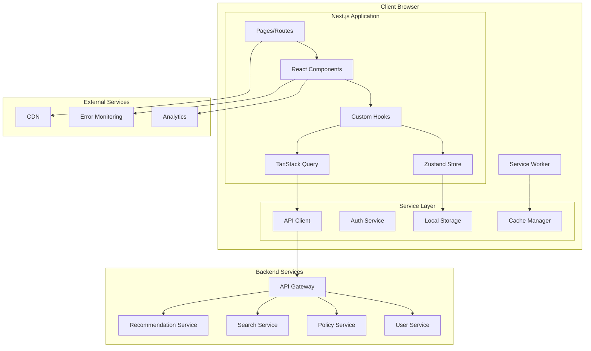
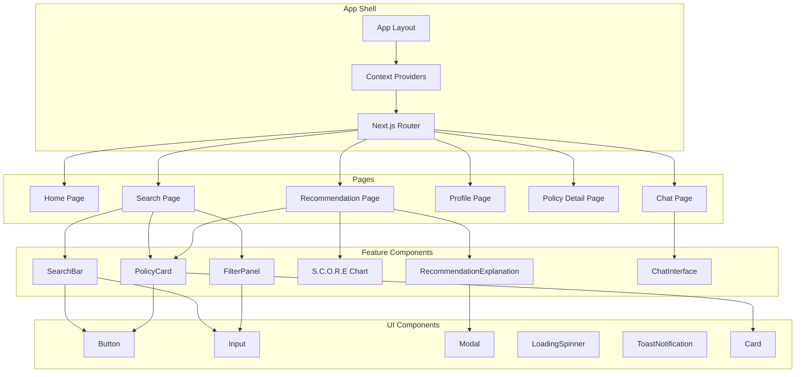
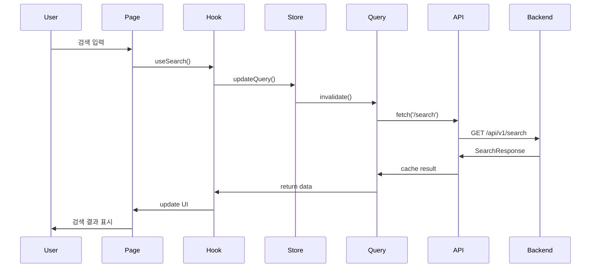

# Frontend Application Design Document

## 1. Overview

Frontend Application은 이지스(Aegis) 시스템의 사용자 인터페이스를 담당하는 Next.js 14 기반 웹 애플리케이션입니다. **사용자 중심 설계**와 **접근성**을 최우선으로 하며, **S.C.O.R.E. 프레임워크**의 설명가능성 원칙을 구현하여 AI 추천의 근거를 직관적으로 제시합니다.

### 1.1 핵심 책임

1. **사용자 인터페이스 제공** - 직관적이고 반응형인 웹 인터페이스
2. **API Gateway 연동** - 백엔드 서비스와의 통신 관리
3. **상태 관리** - 클라이언트 사이드 상태 및 캐싱
4. **사용자 경험 최적화** - 성능, 접근성, 사용성 보장
5. **AI 추천 시각화** - S.C.O.R.E. 프레임워크 기반 설명 가능한 추천 표시
6. **실시간 상호작용** - 검색, 추천, 챗봇 등 실시간 기능 제공

### 1.2 역할 명확화

**Frontend의 역할:**
- ✅ 사용자 인터페이스 렌더링 및 상호작용
- ✅ API Gateway를 통한 백엔드 통신
- ✅ 클라이언트 사이드 상태 관리 및 캐싱
- ✅ 사용자 입력 검증 및 sanitization
- ✅ 접근성 및 반응형 디자인 구현
- ✅ 성능 최적화 (코드 스플리팅, 지연 로딩)

**Frontend가 하지 않는 것:**
- ❌ 비즈니스 로직 처리 (백엔드 서비스 담당)
- ❌ 데이터베이스 직접 접근 (백엔드 서비스 담당)
- ❌ 서버 사이드 인증 검증 (API Gateway 담당)
- ❌ AI 모델 실행 (Recommendation Service 담당)

### 1.3 설계 원칙

1. **사용자 중심 설계**: 사용자 경험을 최우선으로 고려
2. **접근성 우선**: WCAG 2.1 AA 수준 준수
3. **성능 최적화**: 빠른 로딩과 부드러운 인터랙션
4. **반응형 디자인**: 모든 디바이스에서 최적화된 경험
5. **점진적 향상**: 기본 기능은 모든 환경에서 동작
6. **보안 우선**: XSS, CSRF 등 클라이언트 보안 강화

### 1.4 기술 스택

**프레임워크 및 라이브러리:**
- Framework: Next.js 14 (App Router)
- Language: TypeScript 5.x
- UI Library: React 18
- Styling: Tailwind CSS 3.x
- Component Library: shadcn/ui
- Animation: Framer Motion

**상태 관리:**
- Global State: Zustand
- Server State: TanStack Query (React Query)
- Form State: React Hook Form

**데이터 시각화:**
- Charts: Recharts
- Icons: Lucide React

**개발 도구:**
- Build Tool: Turbopack
- Linter: ESLint
- Formatter: Prettier
- Testing: Jest, React Testing Library, Playwright

---

## 2. Shared Library Integration ⭐

Frontend는 shared-library를 직접 사용하지 않지만, 백엔드 API 표준을 준수합니다.

### 2.1 Backend API 표준 준수

#### 2.1.1 에러 응답 형식 (shared-library 호환)

**Backend (shared-library):**
```python
# aegis_shared.errors
class ServiceException(Exception):
    def __init__(self, error_code: str, message: str, details: dict = None):
        self.error_code = error_code
        self.message = message
        self.details = details

# API 응답
{
    "success": false,
    "error": {
        "code": "AUTH_1001",
        "message": "Invalid token",
        "details": {}
    },
    "timestamp": "2025-10-08T12:00:00Z"
}
```

**Frontend (호환 타입):**
```typescript
// types/api.ts
interface ApiError {
  success: false
  error: {
    code: string        // shared-library 에러 코드
    message: string     // 사용자 친화적 메시지
    details?: any       // 추가 정보
  }
  timestamp: string
}

// 에러 처리
const handleApiError = (error: ApiError) => {
  // shared-library 에러 코드에 따른 처리
  switch (error.error.code) {
    case 'AUTH_1001':
      // 인증 오류 처리
      break
    case 'SEARCH_2001':
      // 검색 오류 처리
      break
    // ...
  }
}
```

**효과:**
- 백엔드와 일관된 에러 처리
- 에러 코드 기반 자동화된 에러 핸들링
- 사용자 친화적 에러 메시지 표시


#### 2.1.2 JWT 토큰 형식 (shared-library 호환)

**Backend (shared-library):**
```python
# aegis_shared.auth.JWTHandler
class JWTHandler:
    def create_token(self, user_id: str, roles: List[str]) -> str:
        payload = {
            "user_id": user_id,
            "email": user.email,
            "roles": roles,
            "exp": datetime.utcnow() + timedelta(hours=1),
            "iat": datetime.utcnow(),
            "type": "access"
        }
        return jwt.encode(payload, self.secret_key, algorithm="HS256")
```

**Frontend (호환 타입):**
```typescript
// types/auth.ts
interface JWTPayload {
  user_id: string
  email: string
  roles: string[]
  exp: number
  iat: number
  type: "access" | "refresh"
}

// JWT 디코딩 및 검증
import { jwtDecode } from 'jwt-decode'

const decodeToken = (token: string): JWTPayload => {
  try {
    const decoded = jwtDecode<JWTPayload>(token)
    
    // 만료 시간 확인
    if (decoded.exp * 1000 < Date.now()) {
      throw new Error('Token expired')
    }
    
    return decoded
  } catch (error) {
    throw new Error('Invalid token')
  }
}
```

**효과:**
- 백엔드와 일관된 토큰 구조
- 자동 토큰 만료 감지
- 역할 기반 권한 관리

#### 2.1.3 API 응답 형식 표준

**Backend (shared-library):**
```python
# 성공 응답
{
    "success": true,
    "data": {...},
    "metadata": {
        "page": 1,
        "size": 20,
        "total": 100
    }
}
```

**Frontend (호환 타입):**
```typescript
// types/api.ts
interface ApiResponse<T> {
  success: true
  data: T
  metadata?: {
    page?: number
    size?: number
    total?: number
    [key: string]: any
  }
}

// 타입 안전한 API 호출
const fetchData = async <T>(endpoint: string): Promise<T> => {
  const response = await fetch(endpoint)
  const result: ApiResponse<T> = await response.json()
  
  if (!result.success) {
    throw new Error('API call failed')
  }
  
  return result.data
}
```

---

## 3. Architecture ⭐

### 3.1 시스템 아키텍처 다이어그램



### 3.2 컴포넌트 아키텍처



### 3.3 데이터 흐름



### 3.4 폴더 구조

```
frontend/
├── app/                          # Next.js App Router
│   ├── (auth)/                   # 인증 관련 페이지
│   │   ├── login/
│   │   └── register/
│   ├── (main)/                   # 메인 페이지
│   │   ├── page.tsx              # 홈
│   │   ├── search/               # 검색
│   │   ├── recommendations/      # 추천
│   │   ├── profile/              # 프로필
│   │   └── policies/[id]/        # 정책 상세
│   ├── layout.tsx                # 루트 레이아웃
│   └── providers.tsx             # Context Providers
├── components/                   # React 컴포넌트
│   ├── features/                 # 기능별 컴포넌트
│   │   ├── search/
│   │   ├── recommendation/
│   │   ├── policy/
│   │   └── chat/
│   ├── ui/                       # 재사용 UI 컴포넌트
│   └── layout/                   # 레이아웃 컴포넌트
├── hooks/                        # Custom Hooks
│   ├── useAuth.ts
│   ├── useSearch.ts
│   ├── useRecommendation.ts
│   └── useApi.ts
├── lib/                          # 유틸리티 및 설정
│   ├── api/                      # API 클라이언트
│   ├── utils/                    # 유틸리티 함수
│   └── constants/                # 상수
├── store/                        # Zustand 스토어
│   ├── authStore.ts
│   ├── searchStore.ts
│   └── recommendationStore.ts
├── types/                        # TypeScript 타입
│   ├── api.ts
│   ├── auth.ts
│   ├── policy.ts
│   └── recommendation.ts
├── styles/                       # 스타일
│   └── globals.css
└── public/                       # 정적 파일
    ├── images/
    └── icons/
```

---


## 4. Components and Interfaces

### 4.1 State Management (Zustand)

#### 4.1.1 Auth Store

```typescript
// store/authStore.ts
import { create } from 'zustand'
import { persist } from 'zustand/middleware'

interface User {
  id: string
  email: string
  name: string
  profile: UserProfile
  preferences: UserPreferences
  accessToken: string
  refreshToken: string
}

interface UserProfile {
  businessType: string
  region: string
  industry: string
  businessScale: string
  establishmentDate?: string
  annualRevenue?: number
  employeeCount?: number
}

interface UserPreferences {
  language: string
  theme: 'light' | 'dark' | 'system'
  notifications: {
    email: boolean
    push: boolean
    sms: boolean
  }
}

interface AuthState {
  user: User | null
  isAuthenticated: boolean
  isLoading: boolean
  
  // Actions
  login: (email: string, password: string) => Promise<void>
  logout: () => void
  updateProfile: (profile: Partial<UserProfile>) => Promise<void>
  updatePreferences: (preferences: Partial<UserPreferences>) => Promise<void>
  refreshToken: () => Promise<void>
}

export const useAuthStore = create<AuthState>()(
  persist(
    (set, get) => ({
      user: null,
      isAuthenticated: false,
      isLoading: false,
      
      login: async (email: string, password: string) => {
        set({ isLoading: true })
        
        try {
          const response = await apiClient.post<AuthResponse>('/auth/login', {
            email,
            password
          })
          
          set({
            user: response.user,
            isAuthenticated: true,
            isLoading: false
          })
          
          // 토큰을 로컬 스토리지에 저장
          localStorage.setItem('accessToken', response.user.accessToken)
          localStorage.setItem('refreshToken', response.user.refreshToken)
          
        } catch (error) {
          set({ isLoading: false })
          throw error
        }
      },
      
      logout: () => {
        // 토큰 제거
        localStorage.removeItem('accessToken')
        localStorage.removeItem('refreshToken')
        
        set({
          user: null,
          isAuthenticated: false
        })
      },
      
      updateProfile: async (profile: Partial<UserProfile>) => {
        const { user } = get()
        if (!user) return
        
        try {
          const updatedUser = await apiClient.put<User>(
            `/users/${user.id}/profile`,
            profile
          )
          
          set({
            user: {
              ...user,
              profile: { ...user.profile, ...profile }
            }
          })
        } catch (error) {
          throw error
        }
      },
      
      updatePreferences: async (preferences: Partial<UserPreferences>) => {
        const { user } = get()
        if (!user) return
        
        try {
          await apiClient.put(
            `/users/${user.id}/preferences`,
            preferences
          )
          
          set({
            user: {
              ...user,
              preferences: { ...user.preferences, ...preferences }
            }
          })
        } catch (error) {
          throw error
        }
      },
      
      refreshToken: async () => {
        const { user } = get()
        if (!user) return
        
        try {
          const response = await apiClient.post<AuthResponse>('/auth/refresh', {
            refreshToken: user.refreshToken
          })
          
          set({
            user: {
              ...user,
              accessToken: response.user.accessToken,
              refreshToken: response.user.refreshToken
            }
          })
          
          // 새 토큰 저장
          localStorage.setItem('accessToken', response.user.accessToken)
          localStorage.setItem('refreshToken', response.user.refreshToken)
          
        } catch (error) {
          // 토큰 갱신 실패 시 로그아웃
          get().logout()
          throw error
        }
      }
    }),
    {
      name: 'auth-storage',
      partialize: (state) => ({ 
        user: state.user, 
        isAuthenticated: state.isAuthenticated 
      })
    }
  )
)
```

#### 4.1.2 Search Store

```typescript
// store/searchStore.ts
import { create } from 'zustand'

interface SearchFilters {
  region?: string[]
  industry?: string[]
  businessType?: string[]
  fundingType?: string[]
  amountRange?: [number, number]
  deadlineRange?: [Date, Date]
}

interface SearchResult {
  policies: PolicySummary[]
  total: number
  facets: SearchFacets
  suggestions: string[]
  searchMetadata: {
    query: string
    took: number
    maxScore: number
  }
}

interface SearchState {
  query: string
  filters: SearchFilters
  results: SearchResult | null
  isLoading: boolean
  searchHistory: string[]
  savedSearches: SavedSearch[]
  
  // Actions
  search: (query: string, filters?: SearchFilters) => Promise<void>
  updateFilters: (filters: Partial<SearchFilters>) => void
  clearResults: () => void
  addToHistory: (query: string) => void
  saveSearch: (name: string, query: string, filters: SearchFilters) => void
  deleteSavedSearch: (id: string) => void
}

export const useSearchStore = create<SearchState>((set, get) => ({
  query: '',
  filters: {},
  results: null,
  isLoading: false,
  searchHistory: [],
  savedSearches: [],
  
  search: async (query: string, filters?: SearchFilters) => {
    set({ isLoading: true, query })
    
    try {
      const results = await apiClient.get<SearchResult>('/search/policies', {
        params: {
          q: query,
          ...filters,
          page: 1,
          size: 20
        }
      })
      
      set({
        results,
        isLoading: false,
        filters: { ...get().filters, ...filters }
      })
      
      // 검색 기록 추가
      get().addToHistory(query)
      
    } catch (error) {
      set({ isLoading: false })
      throw error
    }
  },
  
  updateFilters: (filters: Partial<SearchFilters>) => {
    const newFilters = { ...get().filters, ...filters }
    set({ filters: newFilters })
    
    // 필터 변경 시 자동 재검색
    if (get().query) {
      get().search(get().query, newFilters)
    }
  },
  
  clearResults: () => {
    set({
      query: '',
      filters: {},
      results: null
    })
  },
  
  addToHistory: (query: string) => {
    const { searchHistory } = get()
    const newHistory = [
      query,
      ...searchHistory.filter(h => h !== query)
    ].slice(0, 10)
    
    set({ searchHistory: newHistory })
  },
  
  saveSearch: (name: string, query: string, filters: SearchFilters) => {
    const { savedSearches } = get()
    const newSearch: SavedSearch = {
      id: Date.now().toString(),
      name,
      query,
      filters,
      createdAt: new Date()
    }
    
    set({
      savedSearches: [...savedSearches, newSearch]
    })
  },
  
  deleteSavedSearch: (id: string) => {
    const { savedSearches } = get()
    set({
      savedSearches: savedSearches.filter(s => s.id !== id)
    })
  }
}))
```

#### 4.1.3 Recommendation Store

```typescript
// store/recommendationStore.ts
import { create } from 'zustand'

interface RecommendationState {
  recommendations: PolicyRecommendation[]
  isLoading: boolean
  sessionId: string | null
  conversationHistory: ConversationMessage[]
  feedbackHistory: FeedbackRecord[]
  
  // Actions
  getRecommendations: (query?: string) => Promise<void>
  provideFeedback: (policyId: string, rating: number, comments?: string) => Promise<void>
  startConversation: () => string
  sendMessage: (message: string) => Promise<void>
  clearConversation: () => void
}

export const useRecommendationStore = create<RecommendationState>((set, get) => ({
  recommendations: [],
  isLoading: false,
  sessionId: null,
  conversationHistory: [],
  feedbackHistory: [],
  
  getRecommendations: async (query?: string) => {
    const { user } = useAuthStore.getState()
    if (!user) return
    
    set({ isLoading: true })
    
    try {
      const response = await apiClient.post<RecommendationResponse>(
        '/recommendations',
        {
          sessionId: get().sessionId,
          query: query || '',
          userProfile: user.profile,
          options: {
            maxResults: 10,
            includeExplanations: true,
            sortBy: 'relevance'
          }
        }
      )
      
      set({
        recommendations: response.recommendations,
        sessionId: response.sessionId,
        isLoading: false
      })
      
    } catch (error) {
      set({ isLoading: false })
      throw error
    }
  },
  
  provideFeedback: async (
    policyId: string,
    rating: number,
    comments?: string
  ) => {
    try {
      await apiClient.post('/recommendations/feedback', {
        policyId,
        rating,
        comments,
        sessionId: get().sessionId
      })
      
      // 피드백 기록 추가
      const feedback: FeedbackRecord = {
        policyId,
        rating,
        comments,
        timestamp: new Date()
      }
      
      set({
        feedbackHistory: [...get().feedbackHistory, feedback]
      })
      
      // 피드백 제공 후 추천 결과 갱신
      await get().getRecommendations()
      
    } catch (error) {
      throw error
    }
  },
  
  startConversation: () => {
    const sessionId = `session_${Date.now()}_${Math.random().toString(36).substr(2, 9)}`
    set({ 
      sessionId,
      conversationHistory: []
    })
    return sessionId
  },
  
  sendMessage: async (message: string) => {
    const { sessionId, conversationHistory } = get()
    
    // 사용자 메시지 추가
    const userMessage: ConversationMessage = {
      id: Date.now().toString(),
      type: 'user',
      content: message,
      timestamp: new Date()
    }
    
    set({
      conversationHistory: [...conversationHistory, userMessage],
      isLoading: true
    })
    
    try {
      const response = await apiClient.post<ChatResponse>('/recommendations/chat', {
        sessionId,
        message,
        conversationHistory
      })
      
      // AI 응답 추가
      const aiMessage: ConversationMessage = {
        id: response.messageId,
        type: 'assistant',
        content: response.message,
        timestamp: new Date(),
        recommendations: response.recommendations
      }
      
      set({
        conversationHistory: [...get().conversationHistory, aiMessage],
        isLoading: false
      })
      
    } catch (error) {
      set({ isLoading: false })
      throw error
    }
  },
  
  clearConversation: () => {
    set({
      conversationHistory: [],
      sessionId: null
    })
  }
}))
```


### 4.2 API Client

```typescript
// lib/api/client.ts
import axios, { AxiosInstance, AxiosRequestConfig, AxiosResponse } from 'axios'
import { useAuthStore } from '@/store/authStore'

class ApiClient {
  private client: AxiosInstance
  
  constructor(baseURL: string) {
    this.client = axios.create({
      baseURL,
      timeout: 30000,
      headers: {
        'Content-Type': 'application/json'
      }
    })
    
    // 요청 인터셉터
    this.client.interceptors.request.use(
      (config) => {
        const { user } = useAuthStore.getState()
        
        if (user?.accessToken) {
          config.headers.Authorization = `Bearer ${user.accessToken}`
        }
        
        return config
      },
      (error) => {
        return Promise.reject(error)
      }
    )
    
    // 응답 인터셉터
    this.client.interceptors.response.use(
      (response) => response,
      async (error) => {
        const originalRequest = error.config
        
        // 401 에러 시 토큰 갱신 시도
        if (error.response?.status === 401 && !originalRequest._retry) {
          originalRequest._retry = true
          
          try {
            await useAuthStore.getState().refreshToken()
            
            // 갱신된 토큰으로 재시도
            const { user } = useAuthStore.getState()
            originalRequest.headers.Authorization = `Bearer ${user?.accessToken}`
            
            return this.client(originalRequest)
          } catch (refreshError) {
            // 토큰 갱신 실패 시 로그아웃
            useAuthStore.getState().logout()
            window.location.href = '/login'
            return Promise.reject(refreshError)
          }
        }
        
        return Promise.reject(error)
      }
    )
  }
  
  async get<T>(url: string, config?: AxiosRequestConfig): Promise<T> {
    const response = await this.client.get<ApiResponse<T>>(url, config)
    return response.data.data
  }
  
  async post<T>(url: string, data?: any, config?: AxiosRequestConfig): Promise<T> {
    const response = await this.client.post<ApiResponse<T>>(url, data, config)
    return response.data.data
  }
  
  async put<T>(url: string, data?: any, config?: AxiosRequestConfig): Promise<T> {
    const response = await this.client.put<ApiResponse<T>>(url, data, config)
    return response.data.data
  }
  
  async delete<T>(url: string, config?: AxiosRequestConfig): Promise<T> {
    const response = await this.client.delete<ApiResponse<T>>(url, config)
    return response.data.data
  }
}

export const apiClient = new ApiClient(
  process.env.NEXT_PUBLIC_API_BASE_URL || 'http://localhost:8000/api/v1'
)
```

### 4.3 Custom Hooks

#### 4.3.1 useApi Hook

```typescript
// hooks/useApi.ts
import { useState, useCallback } from 'react'
import { apiClient } from '@/lib/api/client'

interface UseApiOptions<T> {
  onSuccess?: (data: T) => void
  onError?: (error: Error) => void
}

export function useApi<T>(
  apiFunc: () => Promise<T>,
  options?: UseApiOptions<T>
) {
  const [data, setData] = useState<T | null>(null)
  const [error, setError] = useState<Error | null>(null)
  const [isLoading, setIsLoading] = useState(false)
  
  const execute = useCallback(async () => {
    setIsLoading(true)
    setError(null)
    
    try {
      const result = await apiFunc()
      setData(result)
      options?.onSuccess?.(result)
      return result
    } catch (err) {
      const error = err as Error
      setError(error)
      options?.onError?.(error)
      throw error
    } finally {
      setIsLoading(false)
    }
  }, [apiFunc, options])
  
  return { data, error, isLoading, execute }
}
```

#### 4.3.2 useDebounce Hook

```typescript
// hooks/useDebounce.ts
import { useState, useEffect } from 'react'

export function useDebounce<T>(value: T, delay: number = 500): T {
  const [debouncedValue, setDebouncedValue] = useState<T>(value)
  
  useEffect(() => {
    const handler = setTimeout(() => {
      setDebouncedValue(value)
    }, delay)
    
    return () => {
      clearTimeout(handler)
    }
  }, [value, delay])
  
  return debouncedValue
}
```

### 4.4 UI Components

#### 4.4.1 S.C.O.R.E. Chart Component

```typescript
// components/features/recommendation/SCOREChart.tsx
import React from 'react'
import {
  Radar,
  RadarChart,
  PolarGrid,
  PolarAngleAxis,
  PolarRadiusAxis,
  ResponsiveContainer,
  Tooltip
} from 'recharts'

interface SCOREChartProps {
  scoreData: {
    specificity: number
    consistency: number
    observability: number
    reproducibility: number
    explainability: number
  }
  className?: string
}

export const SCOREChart: React.FC<SCOREChartProps> = ({
  scoreData,
  className
}) => {
  const chartData = [
    {
      subject: '구체성\n(Specificity)',
      value: scoreData.specificity * 100,
      fullMark: 100
    },
    {
      subject: '일관성\n(Consistency)',
      value: scoreData.consistency * 100,
      fullMark: 100
    },
    {
      subject: '관찰가능성\n(Observability)',
      value: scoreData.observability * 100,
      fullMark: 100
    },
    {
      subject: '재현가능성\n(Reproducibility)',
      value: scoreData.reproducibility * 100,
      fullMark: 100
    },
    {
      subject: '설명가능성\n(Explainability)',
      value: scoreData.explainability * 100,
      fullMark: 100
    }
  ]
  
  return (
    <div className={`score-chart bg-white rounded-lg p-6 ${className}`}>
      <h3 className="text-lg font-semibold mb-4 text-gray-900">
        S.C.O.R.E. 분석
      </h3>
      
      <ResponsiveContainer width="100%" height={300}>
        <RadarChart data={chartData}>
          <PolarGrid stroke="#E5E7EB" />
          <PolarAngleAxis
            dataKey="subject"
            tick={{ fill: '#6B7280', fontSize: 12 }}
          />
          <PolarRadiusAxis
            angle={90}
            domain={[0, 100]}
            tick={{ fill: '#9CA3AF', fontSize: 10 }}
          />
          <Radar
            name="점수"
            dataKey="value"
            stroke="#3B82F6"
            fill="#3B82F6"
            fillOpacity={0.3}
            strokeWidth={2}
          />
          <Tooltip
            formatter={(value: number) => `${value.toFixed(1)}%`}
            contentStyle={{
              backgroundColor: '#FFFFFF',
              border: '1px solid #E5E7EB',
              borderRadius: '0.5rem'
            }}
          />
        </RadarChart>
      </ResponsiveContainer>
      
      <div className="mt-4 grid grid-cols-2 gap-3 text-sm">
        {chartData.map((item) => (
          <div
            key={item.subject}
            className="flex justify-between items-center p-2 bg-gray-50 rounded"
          >
            <span className="text-gray-700">
              {item.subject.split('\n')[0]}
            </span>
            <span className="font-medium text-blue-600">
              {item.value.toFixed(1)}%
            </span>
          </div>
        ))}
      </div>
    </div>
  )
}
```

#### 4.4.2 Policy Card Component

```typescript
// components/features/policy/PolicyCard.tsx
import React from 'react'
import { Card, CardContent, CardFooter, CardHeader } from '@/components/ui/card'
import { Button } from '@/components/ui/button'
import { Badge } from '@/components/ui/badge'
import { BookmarkIcon, ExternalLinkIcon } from 'lucide-react'
import { PolicySummary } from '@/types/policy'

interface PolicyCardProps {
  policy: PolicySummary
  showRecommendationReason?: boolean
  onBookmark?: (policyId: string) => void
  onViewDetails?: (policyId: string) => void
  className?: string
}

export const PolicyCard: React.FC<PolicyCardProps> = ({
  policy,
  showRecommendationReason = false,
  onBookmark,
  onViewDetails,
  className
}) => {
  const handleBookmark = (e: React.MouseEvent) => {
    e.stopPropagation()
    onBookmark?.(policy.id)
  }
  
  const handleViewDetails = () => {
    onViewDetails?.(policy.id)
  }
  
  const isDeadlineNear = policy.applicationDeadline &&
    new Date(policy.applicationDeadline).getTime() - Date.now() < 7 * 24 * 60 * 60 * 1000
  
  return (
    <Card
      className={`policy-card hover:shadow-lg transition-shadow cursor-pointer ${className}`}
      onClick={handleViewDetails}
    >
      <CardHeader className="flex flex-row justify-between items-start">
        <div className="flex-1">
          <h3 className="text-lg font-semibold text-gray-900 mb-2 line-clamp-2">
            {policy.title}
          </h3>
          <p className="text-sm text-gray-600">
            {policy.issuingOrganization}
          </p>
        </div>
        
        <Button
          variant="ghost"
          size="icon"
          onClick={handleBookmark}
          className="ml-4"
          aria-label="북마크"
        >
          <BookmarkIcon className="w-5 h-5" />
        </Button>
      </CardHeader>
      
      <CardContent>
        {/* 정책 요약 */}
        {policy.summary && (
          <p className="text-gray-700 mb-4 line-clamp-3">
            {policy.summary}
          </p>
        )}
        
        {/* 지원 정보 */}
        <div className="grid grid-cols-2 gap-4 mb-4">
          {policy.maxFundingAmount && (
            <div>
              <span className="text-sm text-gray-500 block mb-1">
                최대 지원금액
              </span>
              <p className="font-medium text-blue-600">
                {policy.maxFundingAmount.toLocaleString()}원
              </p>
            </div>
          )}
          
          {policy.applicationDeadline && (
            <div>
              <span className="text-sm text-gray-500 block mb-1">
                신청 마감
              </span>
              <p className={`font-medium ${isDeadlineNear ? 'text-red-600' : 'text-gray-900'}`}>
                {new Date(policy.applicationDeadline).toLocaleDateString()}
                {isDeadlineNear && (
                  <Badge variant="destructive" className="ml-2">
                    마감 임박
                  </Badge>
                )}
              </p>
            </div>
          )}
        </div>
        
        {/* 추천 이유 */}
        {showRecommendationReason && policy.recommendationReason && (
          <div className="bg-blue-50 rounded-lg p-3 mb-4">
            <h4 className="text-sm font-medium text-blue-900 mb-1">
              추천 이유
            </h4>
            <p className="text-sm text-blue-800">
              {policy.recommendationReason}
            </p>
          </div>
        )}
        
        {/* 태그 */}
        {policy.tags && policy.tags.length > 0 && (
          <div className="flex flex-wrap gap-2">
            {policy.tags.slice(0, 3).map((tag) => (
              <Badge key={tag} variant="secondary">
                {tag}
              </Badge>
            ))}
            {policy.tags.length > 3 && (
              <Badge variant="secondary">
                +{policy.tags.length - 3}
              </Badge>
            )}
          </div>
        )}
      </CardContent>
      
      <CardFooter>
        <Button
          variant="outline"
          className="w-full"
          onClick={handleViewDetails}
        >
          상세 보기
          <ExternalLinkIcon className="w-4 h-4 ml-2" />
        </Button>
      </CardFooter>
    </Card>
  )
}
```


#### 4.4.3 Search Bar Component

```typescript
// components/features/search/SearchBar.tsx
import React, { useState, useEffect } from 'react'
import { Input } from '@/components/ui/input'
import { Button } from '@/components/ui/button'
import { SearchIcon, XIcon } from 'lucide-react'
import { useDebounce } from '@/hooks/useDebounce'
import { useSearchStore } from '@/store/searchStore'

interface SearchBarProps {
  onSearch?: (query: string) => void
  placeholder?: string
  showSuggestions?: boolean
  className?: string
}

export const SearchBar: React.FC<SearchBarProps> = ({
  onSearch,
  placeholder = '정책을 검색하세요...',
  showSuggestions = true,
  className
}) => {
  const [inputValue, setInputValue] = useState('')
  const [suggestions, setSuggestions] = useState<string[]>([])
  const [showSuggestionList, setShowSuggestionList] = useState(false)
  
  const debouncedValue = useDebounce(inputValue, 300)
  const { search, searchHistory } = useSearchStore()
  
  // 자동완성 제안 가져오기
  useEffect(() => {
    if (debouncedValue && showSuggestions) {
      fetchSuggestions(debouncedValue)
    } else {
      setSuggestions([])
    }
  }, [debouncedValue, showSuggestions])
  
  const fetchSuggestions = async (query: string) => {
    try {
      const result = await apiClient.get<string[]>(
        `/search/autocomplete?q=${encodeURIComponent(query)}`
      )
      setSuggestions(result)
    } catch (error) {
      console.error('Failed to fetch suggestions:', error)
    }
  }
  
  const handleSearch = () => {
    if (inputValue.trim()) {
      search(inputValue)
      onSearch?.(inputValue)
      setShowSuggestionList(false)
    }
  }
  
  const handleKeyDown = (e: React.KeyboardEvent) => {
    if (e.key === 'Enter') {
      handleSearch()
    }
  }
  
  const handleClear = () => {
    setInputValue('')
    setSuggestions([])
  }
  
  const handleSuggestionClick = (suggestion: string) => {
    setInputValue(suggestion)
    search(suggestion)
    onSearch?.(suggestion)
    setShowSuggestionList(false)
  }
  
  return (
    <div className={`search-bar relative ${className}`}>
      <div className="flex gap-2">
        <div className="relative flex-1">
          <Input
            type="text"
            value={inputValue}
            onChange={(e) => setInputValue(e.target.value)}
            onKeyDown={handleKeyDown}
            onFocus={() => setShowSuggestionList(true)}
            placeholder={placeholder}
            className="pr-10"
          />
          
          {inputValue && (
            <Button
              variant="ghost"
              size="icon"
              className="absolute right-2 top-1/2 -translate-y-1/2"
              onClick={handleClear}
            >
              <XIcon className="w-4 h-4" />
            </Button>
          )}
        </div>
        
        <Button onClick={handleSearch}>
          <SearchIcon className="w-4 h-4 mr-2" />
          검색
        </Button>
      </div>
      
      {/* 자동완성 제안 */}
      {showSuggestionList && (suggestions.length > 0 || searchHistory.length > 0) && (
        <div className="absolute z-10 w-full mt-2 bg-white border border-gray-200 rounded-lg shadow-lg">
          {suggestions.length > 0 && (
            <div className="p-2">
              <p className="text-xs text-gray-500 px-2 mb-1">추천 검색어</p>
              {suggestions.map((suggestion, index) => (
                <button
                  key={index}
                  className="w-full text-left px-3 py-2 hover:bg-gray-100 rounded"
                  onClick={() => handleSuggestionClick(suggestion)}
                >
                  <SearchIcon className="w-4 h-4 inline mr-2 text-gray-400" />
                  {suggestion}
                </button>
              ))}
            </div>
          )}
          
          {searchHistory.length > 0 && (
            <div className="p-2 border-t border-gray-200">
              <p className="text-xs text-gray-500 px-2 mb-1">최근 검색</p>
              {searchHistory.slice(0, 5).map((history, index) => (
                <button
                  key={index}
                  className="w-full text-left px-3 py-2 hover:bg-gray-100 rounded text-gray-600"
                  onClick={() => handleSuggestionClick(history)}
                >
                  {history}
                </button>
              ))}
            </div>
          )}
        </div>
      )}
    </div>
  )
}
```

---

## 5. Data Models

### 5.1 TypeScript 인터페이스

```typescript
// types/auth.ts
export interface User {
  id: string
  email: string
  name: string
  profile: UserProfile
  preferences: UserPreferences
  accessToken: string
  refreshToken: string
  createdAt: string
  lastLoginAt?: string
}

export interface UserProfile {
  businessType: string
  region: string
  industry: string
  businessScale: string
  establishmentDate?: string
  annualRevenue?: number
  employeeCount?: number
}

export interface UserPreferences {
  language: string
  theme: 'light' | 'dark' | 'system'
  notifications: {
    email: boolean
    push: boolean
    sms: boolean
  }
}

// types/policy.ts
export interface PolicySummary {
  id: string
  title: string
  issuingOrganization: string
  summary?: string
  fundingType?: string
  maxFundingAmount?: number
  applicationDeadline?: string
  tags: string[]
  relevanceScore?: number
  recommendationReason?: string
}

export interface PolicyDetail extends PolicySummary {
  content: string
  eligibilityCriteria: string[]
  applicationMethod: string
  requiredDocuments: string[]
  contactInfo: ContactInfo
  relatedPolicies: PolicySummary[]
  applicationUrl?: string
}

export interface ContactInfo {
  department: string
  phone: string
  email: string
  address?: string
  website?: string
}

// types/search.ts
export interface SearchRequest {
  query: string
  filters?: SearchFilters
  sort?: 'relevance' | 'amount' | 'deadline' | 'popularity'
  page?: number
  size?: number
}

export interface SearchFilters {
  region?: string[]
  industry?: string[]
  businessType?: string[]
  fundingType?: string[]
  amountRange?: [number, number]
  deadlineRange?: [Date, Date]
}

export interface SearchResponse {
  success: boolean
  results: PolicySummary[]
  total: number
  facets?: SearchFacets
  suggestions?: string[]
  searchMetadata: SearchMetadata
}

export interface SearchFacets {
  regions: FacetItem[]
  industries: FacetItem[]
  fundingTypes: FacetItem[]
}

export interface FacetItem {
  value: string
  count: number
}

export interface SearchMetadata {
  query: string
  took: number
  maxScore: number
}

// types/recommendation.ts
export interface RecommendationRequest {
  sessionId?: string
  query?: string
  userProfile: UserProfile
  options: {
    maxResults: number
    includeExplanations: boolean
    sortBy: string
  }
}

export interface PolicyRecommendation {
  rank: number
  policy: PolicySummary
  scoreBreakdown: {
    finalScore: number
    semanticSimilarity: number
    kgBoostFactor: number
    ruleAdjustments: number
  }
  explanation: {
    whyRecommended: string
    eligibilityMatch: Record<string, string>
    evidenceSnippet: string
    considerations?: string[]
  }
  scoreData: {
    specificity: number
    consistency: number
    observability: number
    reproducibility: number
    explainability: number
  }
}

export interface RecommendationResponse {
  success: boolean
  sessionId: string
  recommendations: PolicyRecommendation[]
  metadata: {
    totalCandidates: number
    processingTime: number
  }
}

// types/chat.ts
export interface ConversationMessage {
  id: string
  type: 'user' | 'assistant'
  content: string
  timestamp: Date
  recommendations?: PolicyRecommendation[]
}

export interface ChatResponse {
  messageId: string
  message: string
  recommendations?: PolicyRecommendation[]
  suggestedActions?: string[]
}

// types/api.ts
export interface ApiResponse<T> {
  success: true
  data: T
  metadata?: {
    page?: number
    size?: number
    total?: number
    [key: string]: any
  }
}

export interface ApiError {
  success: false
  error: {
    code: string
    message: string
    details?: any
  }
  timestamp: string
}
```

---

## 6. API Specification

### 6.1 API 엔드포인트

Frontend는 API Gateway를 통해 다음 엔드포인트들과 통신합니다:

#### 6.1.1 인증 API

```typescript
// POST /api/v1/auth/login
interface LoginRequest {
  email: string
  password: string
}

interface LoginResponse {
  user: User
  accessToken: string
  refreshToken: string
}

// POST /api/v1/auth/register
interface RegisterRequest {
  email: string
  password: string
  name: string
  profile: UserProfile
}

// POST /api/v1/auth/refresh
interface RefreshRequest {
  refreshToken: string
}

// POST /api/v1/auth/logout
// No request body
```

#### 6.1.2 검색 API

```typescript
// GET /api/v1/search/policies
interface SearchParams {
  q: string
  region?: string[]
  industry?: string[]
  businessType?: string[]
  fundingType?: string[]
  minAmount?: number
  maxAmount?: number
  sort?: string
  page?: number
  size?: number
}

// GET /api/v1/search/autocomplete
interface AutocompleteParams {
  q: string
  limit?: number
}
```

#### 6.1.3 추천 API

```typescript
// POST /api/v1/recommendations
interface RecommendationRequest {
  sessionId?: string
  query?: string
  userProfile: UserProfile
  options: {
    maxResults: number
    includeExplanations: boolean
    sortBy: string
  }
}

// POST /api/v1/recommendations/feedback
interface FeedbackRequest {
  policyId: string
  rating: number
  comments?: string
  sessionId?: string
}

// POST /api/v1/recommendations/chat
interface ChatRequest {
  sessionId: string
  message: string
  conversationHistory: ConversationMessage[]
}
```

#### 6.1.4 정책 API

```typescript
// GET /api/v1/policies/:id
// Returns PolicyDetail

// GET /api/v1/policies/:id/related
// Returns PolicySummary[]

// POST /api/v1/policies/:id/bookmark
// No request body

// DELETE /api/v1/policies/:id/bookmark
// No request body
```

#### 6.1.5 사용자 API

```typescript
// GET /api/v1/users/:id/profile
// Returns UserProfile

// PUT /api/v1/users/:id/profile
interface UpdateProfileRequest {
  profile: Partial<UserProfile>
}

// PUT /api/v1/users/:id/preferences
interface UpdatePreferencesRequest {
  preferences: Partial<UserPreferences>
}

// GET /api/v1/users/:id/bookmarks
// Returns PolicySummary[]
```

### 6.2 API 에러 처리

```typescript
// lib/api/errorHandler.ts
export const handleApiError = (error: any) => {
  if (error.response) {
    // 서버 응답이 있는 경우
    const apiError: ApiError = error.response.data
    
    switch (apiError.error.code) {
      case 'AUTH_1001':
      case 'AUTH_1002':
        // 인증 오류
        toast.error('로그인이 필요합니다.')
        useAuthStore.getState().logout()
        window.location.href = '/login'
        break
        
      case 'AUTH_2001':
        // 권한 오류
        toast.error('접근 권한이 없습니다.')
        break
        
      case 'SEARCH_2001':
        // 검색 오류
        toast.error('검색 중 오류가 발생했습니다.')
        break
        
      case 'REC_3001':
        // 추천 오류
        toast.error('추천 결과를 가져오는 중 오류가 발생했습니다.')
        break
        
      default:
        toast.error(apiError.error.message || '알 수 없는 오류가 발생했습니다.')
    }
  } else if (error.request) {
    // 요청은 보냈지만 응답이 없는 경우
    toast.error('서버와 연결할 수 없습니다. 네트워크를 확인해주세요.')
  } else {
    // 요청 설정 중 오류
    toast.error('요청 중 오류가 발생했습니다.')
  }
}
```

---


## 7. Error Handling ⭐

### 7.1 에러 타입 정의

```typescript
// lib/errors/types.ts
export class AppError extends Error {
  constructor(
    public code: string,
    message: string,
    public details?: any
  ) {
    super(message)
    this.name = 'AppError'
  }
}

export class NetworkError extends AppError {
  constructor(message: string = '네트워크 연결을 확인해주세요.') {
    super('NETWORK_ERROR', message)
    this.name = 'NetworkError'
  }
}

export class ValidationError extends AppError {
  constructor(message: string, details?: any) {
    super('VALIDATION_ERROR', message, details)
    this.name = 'ValidationError'
  }
}
```

### 7.2 React Error Boundary

```typescript
// components/ErrorBoundary.tsx
import React, { Component, ErrorInfo, ReactNode } from 'react'
import { Button } from '@/components/ui/button'
import { AlertTriangle } from 'lucide-react'

interface Props {
  children: ReactNode
  fallback?: ReactNode
}

interface State {
  hasError: boolean
  error?: Error
}

export class ErrorBoundary extends Component<Props, State> {
  constructor(props: Props) {
    super(props)
    this.state = { hasError: false }
  }
  
  static getDerivedStateFromError(error: Error): State {
    return { hasError: true, error }
  }
  
  componentDidCatch(error: Error, errorInfo: ErrorInfo) {
    console.error('React Error Boundary caught an error:', error, errorInfo)
    
    // 에러 모니터링 서비스로 전송 (Sentry 등)
    if (process.env.NODE_ENV === 'production') {
      // Sentry.captureException(error, { extra: errorInfo })
    }
  }
  
  handleReset = () => {
    this.setState({ hasError: false, error: undefined })
  }
  
  render() {
    if (this.state.hasError) {
      if (this.props.fallback) {
        return this.props.fallback
      }
      
      return (
        <div className="min-h-screen flex items-center justify-center bg-gray-50">
          <div className="max-w-md w-full bg-white rounded-lg shadow-lg p-8 text-center">
            <AlertTriangle className="w-16 h-16 text-red-500 mx-auto mb-4" />
            <h2 className="text-2xl font-bold text-gray-900 mb-2">
              문제가 발생했습니다
            </h2>
            <p className="text-gray-600 mb-6">
              페이지를 새로고침하거나 잠시 후 다시 시도해주세요.
            </p>
            {process.env.NODE_ENV === 'development' && this.state.error && (
              <pre className="text-left text-xs bg-gray-100 p-4 rounded mb-4 overflow-auto">
                {this.state.error.message}
              </pre>
            )}
            <div className="flex gap-4">
              <Button
                onClick={this.handleReset}
                variant="outline"
                className="flex-1"
              >
                다시 시도
              </Button>
              <Button
                onClick={() => window.location.href = '/'}
                className="flex-1"
              >
                홈으로 이동
              </Button>
            </div>
          </div>
        </div>
      )
    }
    
    return this.props.children
  }
}
```

### 7.3 Toast 알림 시스템

```typescript
// lib/toast.ts
import { toast as sonnerToast } from 'sonner'

export const toast = {
  success: (message: string) => {
    sonnerToast.success(message, {
      duration: 3000,
      position: 'top-right'
    })
  },
  
  error: (message: string) => {
    sonnerToast.error(message, {
      duration: 5000,
      position: 'top-right'
    })
  },
  
  warning: (message: string) => {
    sonnerToast.warning(message, {
      duration: 4000,
      position: 'top-right'
    })
  },
  
  info: (message: string) => {
    sonnerToast.info(message, {
      duration: 3000,
      position: 'top-right'
    })
  },
  
  loading: (message: string) => {
    return sonnerToast.loading(message, {
      position: 'top-right'
    })
  }
}
```

---

## 8. Production Considerations ⭐

### 8.1 확장성 (Scalability)

#### 8.1.1 코드 스플리팅

```typescript
// app/layout.tsx
import dynamic from 'next/dynamic'

// 동적 임포트로 코드 스플리팅
const ChatInterface = dynamic(
  () => import('@/components/features/chat/ChatInterface'),
  {
    loading: () => <LoadingSpinner />,
    ssr: false
  }
)

const RecommendationExplanation = dynamic(
  () => import('@/components/features/recommendation/RecommendationExplanation'),
  {
    loading: () => <LoadingSpinner />
  }
)
```

#### 8.1.2 이미지 최적화

```typescript
// next.config.js
module.exports = {
  images: {
    domains: ['cdn.aegis.com'],
    formats: ['image/avif', 'image/webp'],
    deviceSizes: [640, 750, 828, 1080, 1200, 1920, 2048, 3840],
    imageSizes: [16, 32, 48, 64, 96, 128, 256, 384],
    minimumCacheTTL: 60,
  }
}

// 사용 예시
import Image from 'next/image'

<Image
  src="/policy-image.jpg"
  alt="정책 이미지"
  width={800}
  height={600}
  loading="lazy"
  placeholder="blur"
/>
```

#### 8.1.3 가상 스크롤링

```typescript
// components/features/policy/PolicyList.tsx
import { useVirtualizer } from '@tanstack/react-virtual'
import { useRef } from 'react'

export const PolicyList: React.FC<{ policies: PolicySummary[] }> = ({
  policies
}) => {
  const parentRef = useRef<HTMLDivElement>(null)
  
  const virtualizer = useVirtualizer({
    count: policies.length,
    getScrollElement: () => parentRef.current,
    estimateSize: () => 200,
    overscan: 5
  })
  
  return (
    <div ref={parentRef} className="h-screen overflow-auto">
      <div
        style={{
          height: `${virtualizer.getTotalSize()}px`,
          width: '100%',
          position: 'relative'
        }}
      >
        {virtualizer.getVirtualItems().map((virtualItem) => (
          <div
            key={virtualItem.key}
            style={{
              position: 'absolute',
              top: 0,
              left: 0,
              width: '100%',
              height: `${virtualItem.size}px`,
              transform: `translateY(${virtualItem.start}px)`
            }}
          >
            <PolicyCard policy={policies[virtualItem.index]} />
          </div>
        ))}
      </div>
    </div>
  )
}
```

### 8.2 장애 복구 (Disaster Recovery)

#### 8.2.1 Service Worker 및 오프라인 지원

```typescript
// public/sw.js
const CACHE_NAME = 'aegis-v1'
const urlsToCache = [
  '/',
  '/search',
  '/recommendations',
  '/offline.html'
]

self.addEventListener('install', (event) => {
  event.waitUntil(
    caches.open(CACHE_NAME)
      .then((cache) => cache.addAll(urlsToCache))
  )
})

self.addEventListener('fetch', (event) => {
  event.respondWith(
    caches.match(event.request)
      .then((response) => {
        // 캐시에 있으면 캐시 반환, 없으면 네트워크 요청
        return response || fetch(event.request)
      })
      .catch(() => {
        // 오프라인 시 오프라인 페이지 반환
        return caches.match('/offline.html')
      })
  )
})
```

#### 8.2.2 자동 재시도 로직

```typescript
// lib/api/retry.ts
export async function fetchWithRetry<T>(
  fetchFn: () => Promise<T>,
  maxRetries: number = 3,
  delay: number = 1000
): Promise<T> {
  let lastError: Error
  
  for (let i = 0; i < maxRetries; i++) {
    try {
      return await fetchFn()
    } catch (error) {
      lastError = error as Error
      
      if (i < maxRetries - 1) {
        // 지수 백오프
        await new Promise(resolve => setTimeout(resolve, delay * Math.pow(2, i)))
      }
    }
  }
  
  throw lastError!
}
```

### 8.3 캐싱 전략 (Caching)

#### 8.3.1 TanStack Query 캐싱

```typescript
// lib/queryClient.ts
import { QueryClient } from '@tanstack/react-query'

export const queryClient = new QueryClient({
  defaultOptions: {
    queries: {
      staleTime: 5 * 60 * 1000, // 5분
      cacheTime: 10 * 60 * 1000, // 10분
      retry: 3,
      retryDelay: (attemptIndex) => Math.min(1000 * 2 ** attemptIndex, 30000),
      refetchOnWindowFocus: false,
      refetchOnReconnect: true
    }
  }
})
```

#### 8.3.2 로컬 스토리지 캐싱

```typescript
// lib/cache/localStorage.ts
export class LocalStorageCache {
  private prefix: string = 'aegis_'
  
  set<T>(key: string, value: T, ttl?: number): void {
    const item = {
      value,
      timestamp: Date.now(),
      ttl
    }
    
    try {
      localStorage.setItem(
        this.prefix + key,
        JSON.stringify(item)
      )
    } catch (error) {
      console.error('Failed to set localStorage:', error)
    }
  }
  
  get<T>(key: string): T | null {
    try {
      const item = localStorage.getItem(this.prefix + key)
      if (!item) return null
      
      const parsed = JSON.parse(item)
      
      // TTL 확인
      if (parsed.ttl && Date.now() - parsed.timestamp > parsed.ttl) {
        this.remove(key)
        return null
      }
      
      return parsed.value
    } catch (error) {
      console.error('Failed to get localStorage:', error)
      return null
    }
  }
  
  remove(key: string): void {
    localStorage.removeItem(this.prefix + key)
  }
  
  clear(): void {
    Object.keys(localStorage)
      .filter(key => key.startsWith(this.prefix))
      .forEach(key => localStorage.removeItem(key))
  }
}

export const cache = new LocalStorageCache()
```

### 8.4 모니터링 (Monitoring)

#### 8.4.1 Web Vitals 측정

```typescript
// lib/monitoring/webVitals.ts
import { onCLS, onFID, onFCP, onLCP, onTTFB } from 'web-vitals'

export function reportWebVitals() {
  onCLS((metric) => {
    console.log('CLS:', metric)
    // Analytics로 전송
    sendToAnalytics({
      name: 'CLS',
      value: metric.value,
      id: metric.id
    })
  })
  
  onFID((metric) => {
    console.log('FID:', metric)
    sendToAnalytics({
      name: 'FID',
      value: metric.value,
      id: metric.id
    })
  })
  
  onFCP((metric) => {
    console.log('FCP:', metric)
    sendToAnalytics({
      name: 'FCP',
      value: metric.value,
      id: metric.id
    })
  })
  
  onLCP((metric) => {
    console.log('LCP:', metric)
    sendToAnalytics({
      name: 'LCP',
      value: metric.value,
      id: metric.id
    })
  })
  
  onTTFB((metric) => {
    console.log('TTFB:', metric)
    sendToAnalytics({
      name: 'TTFB',
      value: metric.value,
      id: metric.id
    })
  })
}

function sendToAnalytics(metric: any) {
  // Google Analytics, Mixpanel 등으로 전송
  if (typeof window !== 'undefined' && (window as any).gtag) {
    (window as any).gtag('event', metric.name, {
      value: Math.round(metric.value),
      metric_id: metric.id,
      metric_value: metric.value,
      metric_delta: metric.delta
    })
  }
}
```

#### 8.4.2 에러 모니터링 (Sentry)

```typescript
// lib/monitoring/sentry.ts
import * as Sentry from '@sentry/nextjs'

export function initSentry() {
  if (process.env.NODE_ENV === 'production') {
    Sentry.init({
      dsn: process.env.NEXT_PUBLIC_SENTRY_DSN,
      environment: process.env.NEXT_PUBLIC_ENV,
      tracesSampleRate: 0.1,
      beforeSend(event, hint) {
        // 민감한 정보 필터링
        if (event.request) {
          delete event.request.cookies
          delete event.request.headers
        }
        return event
      }
    })
  }
}

export function captureError(error: Error, context?: any) {
  if (process.env.NODE_ENV === 'production') {
    Sentry.captureException(error, {
      extra: context
    })
  } else {
    console.error('Error:', error, context)
  }
}
```

### 8.5 보안 (Security)

#### 8.5.1 XSS 방지

```typescript
// lib/security/sanitize.ts
import DOMPurify from 'isomorphic-dompurify'

export function sanitizeHtml(html: string): string {
  return DOMPurify.sanitize(html, {
    ALLOWED_TAGS: ['b', 'i', 'em', 'strong', 'a', 'p', 'br'],
    ALLOWED_ATTR: ['href', 'target']
  })
}

export function sanitizeInput(input: string): string {
  return input
    .replace(/</g, '&lt;')
    .replace(/>/g, '&gt;')
    .replace(/"/g, '&quot;')
    .replace(/'/g, '&#x27;')
    .replace(/\//g, '&#x2F;')
}
```

#### 8.5.2 Content Security Policy

```typescript
// next.config.js
const securityHeaders = [
  {
    key: 'Content-Security-Policy',
    value: `
      default-src 'self';
      script-src 'self' 'unsafe-eval' 'unsafe-inline' https://cdn.aegis.com;
      style-src 'self' 'unsafe-inline';
      img-src 'self' data: https://cdn.aegis.com;
      font-src 'self' data:;
      connect-src 'self' https://api.aegis.com;
      frame-ancestors 'none';
    `.replace(/\s{2,}/g, ' ').trim()
  },
  {
    key: 'X-Frame-Options',
    value: 'DENY'
  },
  {
    key: 'X-Content-Type-Options',
    value: 'nosniff'
  },
  {
    key: 'Referrer-Policy',
    value: 'strict-origin-when-cross-origin'
  },
  {
    key: 'Permissions-Policy',
    value: 'camera=(), microphone=(), geolocation=()'
  }
]

module.exports = {
  async headers() {
    return [
      {
        source: '/:path*',
        headers: securityHeaders
      }
    ]
  }
}
```

---

# Frontend Design Document - Additional Sections

## 9. Service Integration

### 9.1 백엔드 서비스 연동

Frontend는 API Gateway를 통해 다음 백엔드 서비스들과 통신합니다:

| 서비스 | 엔드포인트 | 목적 | 인증 필요 |
|--------|-----------|------|-----------|
| User Service | /api/v1/users/* | 사용자 관리, 프로필 | Yes |
| User Service | /api/v1/auth/* | 인증, 로그인 | No (login), Yes (others) |
| Policy Service | /api/v1/policies/* | 정책 조회, 북마크 | Yes |
| Search Service | /api/v1/search/* | 검색, 자동완성 | Yes |
| Recommendation Service | /api/v1/recommendations/* | AI 추천, 챗봇 | Yes |

### 9.2 실시간 통신

```typescript
// lib/websocket/client.ts
export class WebSocketClient {
  private ws: WebSocket | null = null
  private reconnectAttempts = 0
  private maxReconnectAttempts = 5
  
  connect(url: string) {
    this.ws = new WebSocket(url)
    
    this.ws.onopen = () => {
      console.log('WebSocket connected')
      this.reconnectAttempts = 0
    }
    
    this.ws.onmessage = (event) => {
      const data = JSON.parse(event.data)
      this.handleMessage(data)
    }
    
    this.ws.onclose = () => {
      console.log('WebSocket disconnected')
      this.reconnect(url)
    }
    
    this.ws.onerror = (error) => {
      console.error('WebSocket error:', error)
    }
  }
  
  private reconnect(url: string) {
    if (this.reconnectAttempts < this.maxReconnectAttempts) {
      this.reconnectAttempts++
      setTimeout(() => {
        console.log(`Reconnecting... (${this.reconnectAttempts}/${this.maxReconnectAttempts})`)
        this.connect(url)
      }, 1000 * Math.pow(2, this.reconnectAttempts))
    }
  }
  
  private handleMessage(data: any) {
    // 메시지 타입에 따른 처리
    switch (data.type) {
      case 'notification':
        toast.info(data.message)
        break
      case 'policy_update':
        // 정책 업데이트 처리
        break
      default:
        console.log('Unknown message type:', data.type)
    }
  }
  
  send(data: any) {
    if (this.ws && this.ws.readyState === WebSocket.OPEN) {
      this.ws.send(JSON.stringify(data))
    }
  }
  
  disconnect() {
    if (this.ws) {
      this.ws.close()
      this.ws = null
    }
  }
}
```

---

## 10. Logging Strategy

### 10.1 로그 레벨 및 형식

```typescript
// lib/logging/logger.ts
enum LogLevel {
  DEBUG = 'debug',
  INFO = 'info',
  WARN = 'warn',
  ERROR = 'error'
}

class Logger {
  private context: string
  
  constructor(context: string) {
    this.context = context
  }
  
  private log(level: LogLevel, message: string, data?: any) {
    const logEntry = {
      timestamp: new Date().toISOString(),
      level,
      context: this.context,
      message,
      data,
      userAgent: typeof window !== 'undefined' ? window.navigator.userAgent : undefined,
      url: typeof window !== 'undefined' ? window.location.href : undefined
    }
    
    // 개발 환경에서는 콘솔에 출력
    if (process.env.NODE_ENV === 'development') {
      console[level](logEntry)
    }
    
    // 프로덕션 환경에서는 로깅 서비스로 전송
    if (process.env.NODE_ENV === 'production') {
      this.sendToLoggingService(logEntry)
    }
  }
  
  private sendToLoggingService(logEntry: any) {
    // Elasticsearch, CloudWatch 등으로 전송
    if (logEntry.level === LogLevel.ERROR) {
      // 에러는 Sentry로도 전송
      captureError(new Error(logEntry.message), logEntry.data)
    }
  }
  
  debug(message: string, data?: any) {
    this.log(LogLevel.DEBUG, message, data)
  }
  
  info(message: string, data?: any) {
    this.log(LogLevel.INFO, message, data)
  }
  
  warn(message: string, data?: any) {
    this.log(LogLevel.WARN, message, data)
  }
  
  error(message: string, data?: any) {
    this.log(LogLevel.ERROR, message, data)
  }
}

export const createLogger = (context: string) => new Logger(context)
```

### 10.2 사용자 행동 추적

```typescript
// lib/analytics/tracker.ts
export class AnalyticsTracker {
  track(event: string, properties?: Record<string, any>) {
    const eventData = {
      event,
      properties: {
        ...properties,
        timestamp: new Date().toISOString(),
        page: window.location.pathname,
        referrer: document.referrer
      },
      user: this.getUserInfo()
    }
    
    // Google Analytics
    if (typeof window !== 'undefined' && (window as any).gtag) {
      (window as any).gtag('event', event, properties)
    }
    
    // 커스텀 분석 서비스
    this.sendToAnalytics(eventData)
  }
  
  private getUserInfo() {
    const { user } = useAuthStore.getState()
    return user ? {
      id: user.id,
      email: user.email
    } : null
  }
  
  private sendToAnalytics(data: any) {
    // 분석 서비스로 전송
    fetch('/api/analytics', {
      method: 'POST',
      headers: { 'Content-Type': 'application/json' },
      body: JSON.stringify(data)
    }).catch(console.error)
  }
  
  // 주요 이벤트 추적 메서드
  trackPageView(page: string) {
    this.track('page_view', { page })
  }
  
  trackSearch(query: string, resultsCount: number) {
    this.track('search', { query, resultsCount })
  }
  
  trackPolicyView(policyId: string) {
    this.track('policy_view', { policyId })
  }
  
  trackRecommendationClick(policyId: string, rank: number) {
    this.track('recommendation_click', { policyId, rank })
  }
  
  trackFeedback(policyId: string, rating: number) {
    this.track('feedback', { policyId, rating })
  }
}

export const analytics = new AnalyticsTracker()
```

---

## 11. Integration Testing Strategy

### 11.1 단위 테스트

```typescript
// __tests__/components/PolicyCard.test.tsx
import { render, screen, fireEvent } from '@testing-library/react'
import { PolicyCard } from '@/components/features/policy/PolicyCard'

describe('PolicyCard', () => {
  const mockPolicy = {
    id: '1',
    title: '테스트 정책',
    issuingOrganization: '테스트 기관',
    summary: '테스트 요약',
    maxFundingAmount: 10000000,
    applicationDeadline: '2025-12-31',
    tags: ['태그1', '태그2']
  }
  
  it('정책 정보를 올바르게 렌더링한다', () => {
    render(<PolicyCard policy={mockPolicy} />)
    
    expect(screen.getByText('테스트 정책')).toBeInTheDocument()
    expect(screen.getByText('테스트 기관')).toBeInTheDocument()
    expect(screen.getByText('10,000,000원')).toBeInTheDocument()
  })
  
  it('북마크 버튼 클릭 시 콜백이 호출된다', () => {
    const onBookmark = jest.fn()
    render(<PolicyCard policy={mockPolicy} onBookmark={onBookmark} />)
    
    const bookmarkButton = screen.getByLabelText('북마크')
    fireEvent.click(bookmarkButton)
    
    expect(onBookmark).toHaveBeenCalledWith('1')
  })
  
  it('추천 이유가 있을 때 표시된다', () => {
    const policyWithReason = {
      ...mockPolicy,
      recommendationReason: '귀하의 업종과 일치합니다'
    }
    
    render(
      <PolicyCard
        policy={policyWithReason}
        showRecommendationReason={true}
      />
    )
    
    expect(screen.getByText('추천 이유')).toBeInTheDocument()
    expect(screen.getByText('귀하의 업종과 일치합니다')).toBeInTheDocument()
  })
})
```

### 11.2 통합 테스트

```typescript
// __tests__/integration/search.test.tsx
import { render, screen, waitFor } from '@testing-library/react'
import userEvent from '@testing-library/user-event'
import { SearchPage } from '@/app/(main)/search/page'
import { server } from '@/mocks/server'
import { rest } from 'msw'

describe('Search Integration', () => {
  it('검색 플로우가 정상 동작한다', async () => {
    const user = userEvent.setup()
    render(<SearchPage />)
    
    // 검색어 입력
    const searchInput = screen.getByPlaceholderText('정책을 검색하세요...')
    await user.type(searchInput, '소상공인')
    
    // 검색 버튼 클릭
    const searchButton = screen.getByRole('button', { name: '검색' })
    await user.click(searchButton)
    
    // 로딩 표시 확인
    expect(screen.getByText('검색 중...')).toBeInTheDocument()
    
    // 검색 결과 표시 확인
    await waitFor(() => {
      expect(screen.getByText('검색 결과')).toBeInTheDocument()
    })
    
    // 정책 카드 표시 확인
    expect(screen.getAllByTestId('policy-card')).toHaveLength(10)
  })
  
  it('필터 적용이 정상 동작한다', async () => {
    const user = userEvent.setup()
    render(<SearchPage />)
    
    // 필터 패널 열기
    const filterButton = screen.getByRole('button', { name: '필터' })
    await user.click(filterButton)
    
    // 지역 필터 선택
    const regionFilter = screen.getByLabelText('서울')
    await user.click(regionFilter)
    
    // 필터 적용
    const applyButton = screen.getByRole('button', { name: '적용' })
    await user.click(applyButton)
    
    // 필터링된 결과 확인
    await waitFor(() => {
      expect(screen.getByText('서울 지역 정책')).toBeInTheDocument()
    })
  })
})
```

### 11.3 E2E 테스트

```typescript
// e2e/recommendation.spec.ts
import { test, expect } from '@playwright/test'

test.describe('Recommendation Flow', () => {
  test.beforeEach(async ({ page }) => {
    // 로그인
    await page.goto('/login')
    await page.fill('input[name="email"]', 'test@example.com')
    await page.fill('input[name="password"]', 'password123')
    await page.click('button[type="submit"]')
    await page.waitForURL('/dashboard')
  })
  
  test('추천 받기 플로우', async ({ page }) => {
    // 추천 페이지로 이동
    await page.goto('/recommendations')
    
    // 추천 결과 로딩 대기
    await page.waitForSelector('[data-testid="recommendation-list"]')
    
    // 추천 정책 카드 확인
    const policyCards = await page.locator('[data-testid="policy-card"]').count()
    expect(policyCards).toBeGreaterThan(0)
    
    // S.C.O.R.E. 차트 확인
    await expect(page.locator('[data-testid="score-chart"]')).toBeVisible()
    
    // 첫 번째 정책 클릭
    await page.locator('[data-testid="policy-card"]').first().click()
    
    // 정책 상세 페이지 확인
    await expect(page.locator('h1')).toContainText('정책 상세')
    
    // 북마크 추가
    await page.click('[aria-label="북마크"]')
    await expect(page.locator('.toast')).toContainText('북마크에 추가되었습니다')
  })
  
  test('피드백 제공 플로우', async ({ page }) => {
    await page.goto('/recommendations')
    
    // 첫 번째 정책에 피드백
    await page.locator('[data-testid="policy-card"]').first().hover()
    await page.click('[aria-label="피드백"]')
    
    // 평점 선택
    await page.click('[data-rating="5"]')
    
    // 코멘트 입력
    await page.fill('textarea[name="comments"]', '매우 유용한 정책입니다')
    
    // 제출
    await page.click('button[type="submit"]')
    
    // 성공 메시지 확인
    await expect(page.locator('.toast')).toContainText('피드백이 제출되었습니다')
  })
})
```

---

## 12. Performance Benchmarks

### 12.1 성능 목표

| 메트릭 | 목표 | 측정 방법 |
|--------|------|----------|
| First Contentful Paint (FCP) | < 1.5초 | Lighthouse |
| Largest Contentful Paint (LCP) | < 2.5초 | Lighthouse |
| Time to Interactive (TTI) | < 3초 | Lighthouse |
| Cumulative Layout Shift (CLS) | < 0.1 | Lighthouse |
| First Input Delay (FID) | < 100ms | Real User Monitoring |
| 번들 크기 (초기) | < 200KB (gzipped) | webpack-bundle-analyzer |
| 번들 크기 (전체) | < 1MB (gzipped) | webpack-bundle-analyzer |
| API 응답 시간 | < 1초 | Network monitoring |

### 12.2 성능 최적화 체크리스트

```typescript
// 성능 최적화 체크리스트
const performanceChecklist = {
  // 코드 최적화
  codeOptimization: [
    '✅ 코드 스플리팅 적용',
    '✅ 동적 임포트 사용',
    '✅ Tree shaking 활성화',
    '✅ 불필요한 re-render 방지 (React.memo, useMemo, useCallback)',
    '✅ 가상 스크롤링 적용'
  ],
  
  // 리소스 최적화
  resourceOptimization: [
    '✅ 이미지 최적화 (WebP, AVIF)',
    '✅ 이미지 지연 로딩',
    '✅ 폰트 최적화 (font-display: swap)',
    '✅ CSS 최소화',
    '✅ JavaScript 최소화'
  ],
  
  // 캐싱 전략
  cachingStrategy: [
    '✅ Service Worker 캐싱',
    '✅ HTTP 캐싱 헤더 설정',
    '✅ TanStack Query 캐싱',
    '✅ 로컬 스토리지 캐싱'
  ],
  
  // 네트워크 최적화
  networkOptimization: [
    '✅ HTTP/2 사용',
    '✅ CDN 사용',
    '✅ Gzip/Brotli 압축',
    '✅ 리소스 프리로딩',
    '✅ DNS 프리페치'
  ]
}
```

---

## 13. Configuration Management

### 13.1 환경 변수 관리

```typescript
// .env.local (개발)
NEXT_PUBLIC_API_BASE_URL=http://localhost:8000/api/v1
NEXT_PUBLIC_ENV=development
NEXT_PUBLIC_SENTRY_DSN=
NEXT_PUBLIC_GA_ID=

// .env.production (프로덕션)
NEXT_PUBLIC_API_BASE_URL=https://api.aegis.com/api/v1
NEXT_PUBLIC_ENV=production
NEXT_PUBLIC_SENTRY_DSN=https://xxx@sentry.io/xxx
NEXT_PUBLIC_GA_ID=G-XXXXXXXXXX
```

### 13.2 설정 파일

```typescript
// lib/config/index.ts
export const config = {
  api: {
    baseURL: process.env.NEXT_PUBLIC_API_BASE_URL || 'http://localhost:8000/api/v1',
    timeout: 30000
  },
  
  auth: {
    tokenKey: 'accessToken',
    refreshTokenKey: 'refreshToken',
    tokenExpiry: 3600 // 1 hour
  },
  
  cache: {
    defaultTTL: 5 * 60 * 1000, // 5 minutes
    maxSize: 100 // MB
  },
  
  pagination: {
    defaultPageSize: 20,
    maxPageSize: 100
  },
  
  features: {
    enableChat: true,
    enableNotifications: true,
    enableAnalytics: process.env.NODE_ENV === 'production'
  },
  
  monitoring: {
    sentry: {
      dsn: process.env.NEXT_PUBLIC_SENTRY_DSN,
      environment: process.env.NEXT_PUBLIC_ENV,
      tracesSampleRate: 0.1
    },
    analytics: {
      gaId: process.env.NEXT_PUBLIC_GA_ID
    }
  }
}
```

---

## 14. Deployment

### 14.1 Docker 설정

```dockerfile
# Dockerfile
FROM node:20-alpine AS base

# Dependencies
FROM base AS deps
RUN apk add --no-cache libc6-compat
WORKDIR /app

COPY package.json package-lock.json ./
RUN npm ci

# Builder
FROM base AS builder
WORKDIR /app
COPY --from=deps /app/node_modules ./node_modules
COPY . .

ENV NEXT_TELEMETRY_DISABLED 1

RUN npm run build

# Runner
FROM base AS runner
WORKDIR /app

ENV NODE_ENV production
ENV NEXT_TELEMETRY_DISABLED 1

RUN addgroup --system --gid 1001 nodejs
RUN adduser --system --uid 1001 nextjs

COPY --from=builder /app/public ./public
COPY --from=builder --chown=nextjs:nodejs /app/.next/standalone ./
COPY --from=builder --chown=nextjs:nodejs /app/.next/static ./.next/static

USER nextjs

EXPOSE 3000

ENV PORT 3000
ENV HOSTNAME "0.0.0.0"

CMD ["node", "server.js"]
```

### 14.2 Kubernetes Deployment

```yaml
# k8s/deployment.yaml
apiVersion: apps/v1
kind: Deployment
metadata:
  name: frontend
  namespace: aegis
spec:
  replicas: 3
  selector:
    matchLabels:
      app: frontend
  template:
    metadata:
      labels:
        app: frontend
    spec:
      containers:
      - name: frontend
        image: aegis/frontend:latest
        ports:
        - containerPort: 3000
        env:
        - name: NEXT_PUBLIC_API_BASE_URL
          value: "https://api.aegis.com/api/v1"
        - name: NEXT_PUBLIC_ENV
          value: "production"
        resources:
          requests:
            cpu: "200m"
            memory: "256Mi"
          limits:
            cpu: "1000m"
            memory: "512Mi"
        livenessProbe:
          httpGet:
            path: /api/health
            port: 3000
          initialDelaySeconds: 30
          periodSeconds: 10
        readinessProbe:
          httpGet:
            path: /api/health
            port: 3000
          initialDelaySeconds: 10
          periodSeconds: 5
---
apiVersion: v1
kind: Service
metadata:
  name: frontend
  namespace: aegis
spec:
  type: ClusterIP
  ports:
  - port: 80
    targetPort: 3000
  selector:
    app: frontend
---
apiVersion: autoscaling/v2
kind: HorizontalPodAutoscaler
metadata:
  name: frontend-hpa
  namespace: aegis
spec:
  scaleTargetRef:
    apiVersion: apps/v1
    kind: Deployment
    name: frontend
  minReplicas: 3
  maxReplicas: 10
  metrics:
  - type: Resource
    resource:
      name: cpu
      target:
        type: Utilization
        averageUtilization: 70
  - type: Resource
    resource:
      name: memory
      target:
        type: Utilization
        averageUtilization: 80
```

---

## 15. Observability

### 15.1 분산 추적

```typescript
// lib/tracing/opentelemetry.ts
import { WebTracerProvider } from '@opentelemetry/sdk-trace-web'
import { registerInstrumentations } from '@opentelemetry/instrumentation'
import { getWebAutoInstrumentations } from '@opentelemetry/auto-instrumentations-web'
import { ZoneContextManager } from '@opentelemetry/context-zone'
import { BatchSpanProcessor } from '@opentelemetry/sdk-trace-base'
import { OTLPTraceExporter } from '@opentelemetry/exporter-trace-otlp-http'

export function initTracing() {
  const provider = new WebTracerProvider()
  
  provider.addSpanProcessor(
    new BatchSpanProcessor(
      new OTLPTraceExporter({
        url: 'https://api.aegis.com/v1/traces'
      })
    )
  )
  
  provider.register({
    contextManager: new ZoneContextManager()
  })
  
  registerInstrumentations({
    instrumentations: [
      getWebAutoInstrumentations({
        '@opentelemetry/instrumentation-fetch': {
          propagateTraceHeaderCorsUrls: [
            /https:\/\/api\.aegis\.com\/.*/
          ]
        }
      })
    ]
  })
}
```

---

## 16. Accessibility

### 16.1 WCAG 2.1 AA 준수

```typescript
// 접근성 체크리스트
const accessibilityChecklist = {
  // 키보드 네비게이션
  keyboardNavigation: [
    '✅ 모든 인터랙티브 요소에 키보드로 접근 가능',
    '✅ Tab 순서가 논리적',
    '✅ Focus 표시가 명확',
    '✅ Skip to content 링크 제공'
  ],
  
  // 스크린 리더
  screenReader: [
    '✅ 모든 이미지에 alt 텍스트',
    '✅ ARIA 라벨 및 역할 속성 사용',
    '✅ 폼 필드에 레이블 연결',
    '✅ 에러 메시지가 스크린 리더로 읽힘'
  ],
  
  // 색상 및 대비
  colorContrast: [
    '✅ 텍스트 대비율 4.5:1 이상',
    '✅ 색상만으로 정보 전달하지 않음',
    '✅ 고대비 모드 지원'
  ],
  
  // 반응형
  responsive: [
    '✅ 텍스트 크기 조절 가능 (200%까지)',
    '✅ 모바일 터치 타겟 크기 충분 (44x44px)',
    '✅ 가로/세로 모드 모두 지원'
  ]
}
```

---

## 17. Internationalization

### 17.1 다국어 지원

```typescript
// lib/i18n/config.ts
import i18n from 'i18next'
import { initReactI18next } from 'react-i18next'
import LanguageDetector from 'i18next-browser-languagedetector'

i18n
  .use(LanguageDetector)
  .use(initReactI18next)
  .init({
    resources: {
      ko: {
        translation: {
          common: {
            search: '검색',
            filter: '필터',
            bookmark: '북마크',
            share: '공유'
          },
          policy: {
            title: '정책 제목',
            deadline: '신청 마감',
            amount: '지원 금액'
          }
        }
      },
      en: {
        translation: {
          common: {
            search: 'Search',
            filter: 'Filter',
            bookmark: 'Bookmark',
            share: 'Share'
          },
          policy: {
            title: 'Policy Title',
            deadline: 'Application Deadline',
            amount: 'Funding Amount'
          }
        }
      }
    },
    fallbackLng: 'ko',
    interpolation: {
      escapeValue: false
    }
  })

export default i18n
```

---

## 18. Summary

Frontend Application은 Next.js 14 기반의 현대적인 웹 애플리케이션으로, 다음과 같은 핵심 특징을 가집니다:

**핵심 특징:**
- ✅ API Gateway를 통한 백엔드 통합
- ✅ Zustand 기반 효율적인 상태 관리
- ✅ TanStack Query를 통한 서버 상태 캐싱
- ✅ S.C.O.R.E. 프레임워크 시각화
- ✅ WCAG 2.1 AA 수준 접근성
- ✅ 반응형 디자인 (모바일, 태블릿, 데스크톱)
- ✅ 성능 최적화 (코드 스플리팅, 지연 로딩)
- ✅ 포괄적인 에러 처리 및 모니터링
- ✅ 오프라인 지원 (Service Worker)
- ✅ 다국어 지원 (i18n)

**백엔드 서비스 연동:**
- User Service: 인증 및 사용자 관리
- Policy Service: 정책 조회 및 북마크
- Search Service: 검색 및 자동완성
- Recommendation Service: AI 추천 및 챗봇

**성능 목표:**
- FCP < 1.5초
- LCP < 2.5초
- TTI < 3초
- 번들 크기 < 200KB (초기)

**보안:**
- XSS 방지
- CSRF 방지
- Content Security Policy
- HTTPS 강제

