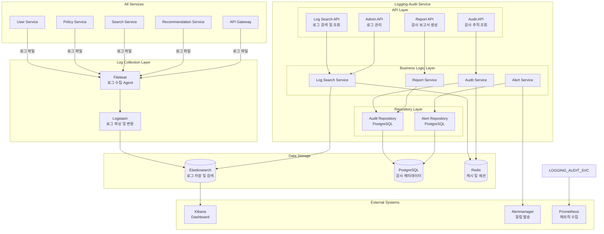
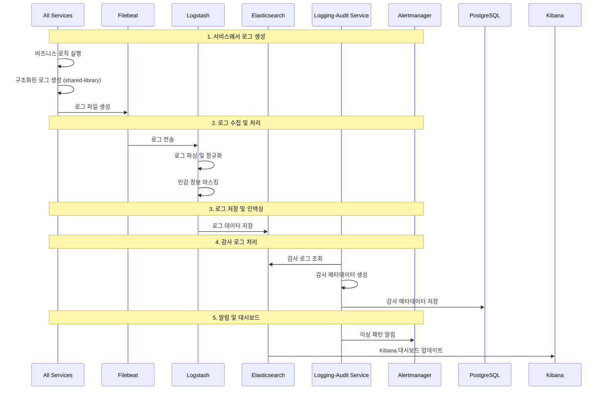

# Logging & Audit Service Design Document

## 1. Overview

Logging & Audit Service는 이지스(Aegis) 시스템의 **중앙 로깅 및 감사 추적** 서비스로, 모든 서비스의 로그 수집, 저장, 분석 및 감사 추적을 담당합니다.

### 1.1 핵심 책임

1. **중앙 로그 수집** - 모든 서비스로부터 구조화된 로그 수집
2. **감사 추적 (Audit Trail)** - 사용자 행동 및 시스템 변경 추적
3. **로그 저장 및 인덱싱** - Elasticsearch 기반 로그 저장 및 검색
4. **로그 분석 및 알림** - 이상 패턴 감지 및 실시간 알림
5. **규정 준수 (Compliance)** - GDPR, 개인정보보호법 등 규정 준수
6. **로그 보관 및 아카이빙** - 로그 생명주기 관리

### 1.2 역할 명확화 (중요)

**Logging-Audit Service의 역할:**
- ✅ 모든 서비스의 로그 중앙 수집 및 저장
- ✅ 감사 이벤트 추적 및 분석
- ✅ 로그 검색 및 분석 API 제공
- ✅ 규정 준수를 위한 감사 보고서 생성
- ✅ 보안 이벤트 모니터링 및 알림
- ✅ 로그 보관 정책 관리

**Logging-Audit Service가 하지 않는 것:**
- ❌ 개별 서비스의 비즈니스 로직 (각 서비스 담당)
- ❌ 메트릭 수집 및 모니터링 (Prometheus/Grafana 담당)
- ❌ 애플리케이션 성능 모니터링 (APM 도구 담당)
- ❌ 인프라 모니터링 (Infrastructure Service 담당)

### 1.3 설계 원칙

1. **중앙화**: 모든 로그를 중앙에서 수집 및 관리
2. **확장성**: 대용량 로그 처리 가능한 수평 확장 설계
3. **실시간성**: 실시간 로그 수집 및 분석
4. **보안성**: 로그 데이터 암호화 및 접근 제어
5. **규정 준수**: GDPR, 개인정보보호법 등 준수
6. **관찰성**: 로깅 시스템 자체의 모니터링

### 1.4 다른 서비스와의 역할 구분

| 서비스 | 역할 | 통신 방식 |
|--------|------|------------|
| **All Services** | 구조화된 로그 생성 | Filebeat → Logstash |
| **Logging-Audit Service** | 로그 수집, 저장, 분석 | Elasticsearch 저장 |
| **User Service** | 사용자 인증 정보 제공 | API 호출 |
| **Policy Service** | 정책 변경 감사 | 감사 로그 |
| **Infrastructure** | 시스템 메트릭 | Prometheus |

---

## 2. Shared Library Integration

이 서비스는 `aegis-shared` 공통 라이브러리를 적극 활용합니다.

### 2.1 사용하는 모듈

```python
from aegis_shared.database import BaseRepository, DatabaseManager
from aegis_shared.auth import JWTHandler, AuthMiddleware, RBAC
from aegis_shared.logging import get_logger, add_context, LogLevel
from aegis_shared.monitoring import track_metrics
from aegis_shared.errors import ErrorCode, ServiceException
from aegis_shared.cache import cache_result, RedisClient
from aegis_shared.config import get_config
```

### 2.2 왜 Shared Library를 사용하는가?

#### 2.2.1 구조화된 로깅 표준화

**Before (shared-library 없이):**
```python
# ❌ 문제점: 각 서비스마다 다른 로그 형식, 일관성 부족
import logging

logger = logging.getLogger(__name__)
logger.info(f"User {user_id} logged in from {ip_address}")  # 비구조화
logger.error(f"Database error: {error}")  # 검색 어려움
```

**After (shared-library 사용):**
```python
# ✅ 장점: 구조화된 로깅, 자동 컨텍스트, 표준화
from aegis_shared.logging import get_logger, add_context

logger = get_logger(__name__)

# 구조화된 로깅
logger.info(
    "user_login_success",
    user_id=user_id,
    ip_address=ip_address,
    user_agent=request.headers.get("user-agent"),
    session_id=session_id
)

# 자동 컨텍스트 추가 (request_id, service_name 등)
logger.error(
    "database_connection_failed",
    error_code="DB_001",
    database="postgresql",
    retry_count=3
)
```

**효과:**
- 모든 서비스에서 일관된 로그 형식
- Elasticsearch에서 쉽게 검색 가능
- 자동 컨텍스트 추가 (request_id, user_id, service_name)
- 로그 레벨 표준화

#### 2.2.2 BaseRepository로 감사 로그 관리

**Before:**
```python
# ❌ 반복적인 CRUD 코드, 트랜잭션 관리 복잡
class AuditLogRepository:
    def __init__(self, session):
        self.session = session
    
    async def create_audit_log(self, log_data: dict):
        audit_log = AuditLog(**log_data)
        self.session.add(audit_log)
        await self.session.commit()
        return audit_log
    
    async def find_by_user_id(self, user_id: str):
        result = await self.session.execute(
            select(AuditLog).where(AuditLog.user_id == user_id)
        )
        return result.scalars().all()
```

**After:**
```python
# ✅ BaseRepository 상속으로 CRUD 자동화
from aegis_shared.database import BaseRepository

class AuditLogRepository(BaseRepository[AuditLog]):
    def __init__(self, session: AsyncSession):
        super().__init__(session, AuditLog)
    
    # create, get_by_id, update, delete, list, count 자동 제공
    
    # 도메인 특화 메서드만 추가
    async def find_by_user_and_action(
        self,
        user_id: str,
        action: str,
        start_date: datetime,
        end_date: datetime
    ) -> List[AuditLog]:
        return await self.list(
            filters={
                "user_id": user_id,
                "action": action,
                "created_at__gte": start_date,
                "created_at__lte": end_date
            }
        )
```

**효과:**
- 코드 라인 수 70% 감소
- 트랜잭션 관리 자동화
- 에러 처리 표준화
- 페이징, 필터링 자동 지원

---

## 3. Architecture

### 3.1 서비스 아키텍처



### 3.2 로그 수집 흐름



---

## 4. Components and Interfaces

### 4.1 API Layer

#### 4.1.1 Log Search API

```python
from fastapi import APIRouter, Depends, HTTPException, status, Query
from typing import List, Optional, Dict, Any
from datetime import datetime, timedelta
from aegis_shared.auth import require_role, get_current_user
from aegis_shared.monitoring import track_metrics
from aegis_shared.logging import get_logger
from aegis_shared.errors import ErrorCode, ServiceException

router = APIRouter(prefix="/api/v1/logs", tags=["logs"])
logger = get_logger(__name__)

@router.get(
    "/search",
    response_model=PaginatedLogResponse
)
@track_metrics("log_search")
@require_role([" admin", "moderator", "analyst"])
async def search_logs(
    q: Optional[str] = Query(None, description="검색 쿼리"),
    service: Optional[str] = Query(None, description="서비스 필터"),
    level: Optional[str] = Query(None, description="로그 레벨 필터"),
    start_time: Optional[datetime] = Query(None, description="시작 시간"),
    end_time: Optional[datetime] = Query(None, description="종료 시간"),
    page: int = Query(1, ge=1, description="페이지 번호"),
    size: int = Query(20, ge=1, le=1000, description="페이지 크기"),
    log_service: LogSearchService = Depends(get_log_search_service),
    current_user: dict = Depends(get_current_user)
):
    """
    로그 검색
    
    - 관리자, 모더레이터, 분석가만 접근 가능
    - Elasticsearch 기반 전문 검색
    - 시간 범위, 서비스, 로그 레벨 필터링 지원
    """
    try:
        search_params = {
            'query': q,
            'service': service,
            'level': level,
            'start_time': start_time or datetime.utcnow() - timedelta(hours=24),
            'end_time': end_time or datetime.utcnow(),
            'page': page,
            'size': size
        }
        
        result = await log_service.search_logs(search_params)
        
        logger.info(
            "log_search_completed",
            user_id=current_user.get('user_id'),
            query=q,
            result_count=result['total']
        )
        
        return PaginatedLogResponse(
            items=result['logs'],
            total=result['total'],
            page=page,
            size=size,
            total_pages=(result['total'] + size - 1) // size
        )
        
    except Exception as e:
        logger.error(
            "log_search_failed",
            user_id=current_user.get('user_id'),
            search_params=search_params,
            error=str(e),
            exc_info=True
        )
        raise ServiceException(
            error_code=ErrorCode.LOG_SEARCH_FAILED,
            message="Log search failed",
            details={"error": str(e)}
        )

@router.get(
    "/recent/{service}",
    response_model=List[LogEntry]
)
@track_metrics("recent_logs")
@require_role(["admin", "moderator", "analyst"])
async def get_recent_logs(
    service: str,
    limit: int = Query(50, ge=1, le=500),
    log_service: LogSearchService = Depends(get_log_search_service)
):
    """특정 서비스의 최근 로그 조회 (캐시 기반)"""
    return await log_service.get_recent_logs(service, limit)

@router.get(
    "/errors",
    response_model=PaginatedErrorLogResponse
)
@track_metrics("error_logs")
@require_role(["admin", "moderator"])
async def get_error_logs(
    service: Optional[str] = Query(None),
    error_code: Optional[str] = Query(None),
    start_time: Optional[datetime] = Query(None),
    end_time: Optional[datetime] = Query(None),
    page: int = Query(1, ge=1),
    size: int = Query(20, ge=1, le=100),
    log_service: LogSearchService = Depends(get_log_search_service)
):
    """에러 로그 조회 및 분석"""
    search_params = {
        'service': service,
        'error_code': error_code,
        'start_time': start_time or datetime.utcnow() - timedelta(hours=24),
        'end_time': end_time or datetime.utcnow(),
        'page': page,
        'size': size
    }
    
    result = await log_service.search_error_logs(search_params)
    
    return PaginatedErrorLogResponse(
        items=result['errors'],
        total=result['total'],
        page=page,
        size=size,
        error_statistics=result['statistics']
    )
```

#### 4.1.2 Audit API

```python
@router.get(
    "/audit/trail/{user_id}",
    response_model=UserAuditTrailResponse
)
@track_metrics("audit_trail")
@require_role(["admin", "auditor"])
async def get_user_audit_trail(
    user_id: str,
    start_date: Optional[datetime] = Query(None),
    end_date: Optional[datetime] = Query(None),
    action_type: Optional[str] = Query(None),
    page: int = Query(1, ge=1),
    size: int = Query(50, ge=1, le=500),
    audit_service: AuditService = Depends(get_audit_service),
    current_user: dict = Depends(get_current_user)
):
    """
    사용자 감사 추적 조회
    
    - 특정 사용자의 모든 행동 이력 조회
    - 관리자, 감사자만 접근 가능
    """
    search_params = {
        'user_id': user_id,
        'start_date': start_date or datetime.utcnow() - timedelta(days=30),
        'end_date': end_date or datetime.utcnow(),
        'action_type': action_type,
        'page': page,
        'size': size
    }
    
    result = await audit_service.get_user_audit_trail(search_params)
    
    logger.info(
        "audit_trail_retrieved",
        auditor_id=current_user.get('user_id'),
        target_user_id=user_id,
        result_count=result['total']
    )
    
    return UserAuditTrailResponse(
        user_id=user_id,
        audit_entries=result['entries'],
        total=result['total'],
        page=page,
        size=size,
        summary=result['summary']
    )

@router.get(
    "/audit/reports/compliance",
    response_model=ComplianceReportResponse
)
@track_metrics("compliance_report")
@require_role(["admin", "compliance_officer"])
async def generate_compliance_report(
    report_type: str = Query(..., description="보고서 타입 (gdpr, privacy, security)"),
    start_date: datetime = Query(..., description="시작 날짜"),
    end_date: datetime = Query(..., description="종료 날짜"),
    format: str = Query("json", description="출력 형식 (json, pdf, csv)"),
    audit_service: AuditService = Depends(get_audit_service),
    current_user: dict = Depends(get_current_user)
):
    """
    규정 준수 보고서 생성
    
    - GDPR, 개인정보보호법 등 규정 준수 보고서
    - 관리자, 컴플라이언스 담당자만 접근 가능
    """
    report_params = {
        'report_type': report_type,
        'start_date': start_date,
        'end_date': end_date,
        'format': format
    }
    
    report = await audit_service.generate_compliance_report(report_params)
    
    logger.info(
        "compliance_report_generated",
        officer_id=current_user.get('user_id'),
        report_type=report_type,
        report_id=report['id']
    )
    
    return ComplianceReportResponse(
        report_id=report['id'],
        report_type=report_type,
        generated_at=datetime.utcnow(),
        data=report['data'],
        download_url=report.get('download_url')
    )
```

### 4.2 Business Logic Layer

#### 4.2.1 Log Search Service

```python
from elasticsearch import AsyncElasticsearch
from typing import Dict, Any, List, Optional
from datetime import datetime, timedelta
from aegis_shared.cache import cache_result, RedisClient
from aegis_shared.logging import get_logger
from aegis_shared.monitoring import track_metrics
from aegis_shared.errors import ErrorCode, ServiceException

logger = get_logger(__name__)

class LogSearchService:
    """로그 검색 서비스"""
    
    def __init__(
        self,
        elasticsearch_client: AsyncElasticsearch,
        redis_client: RedisClient
    ):
        self.es_client = elasticsearch_client
        self.redis_client = redis_client
    
    @track_metrics("log_search_query")
    async def search_logs(
        self,
        search_params: Dict[str, Any]
    ) -> Dict[str, Any]:
        """로그 검색 (Elasticsearch 기반)"""
        try:
            # 검색 쿼리 구성
            query = self.build_search_query(search_params)
            
            # 인덱스 패턴 생성 (날짜 범위 기반)
            index_pattern = self.build_index_pattern(
                search_params['start_time'],
                search_params['end_time']
            )
            
            # Elasticsearch 검색 실행
            response = await self.es_client.search(
                index=index_pattern,
                body={
                    'query': query,
                    'sort': [{'timestamp': {'order': 'desc'}}],
                    'from': (search_params['page'] - 1) * search_params['size'],
                    'size': search_params['size'],
                    'highlight': {
                        'fields': {
                            'message': {},
                            'event_type': {}
                        }
                    }
                }
            )
            
            # 결과 파싱
            logs = []
            for hit in response['hits']['hits']:
                log_entry = hit['_source']
                log_entry['_id'] = hit['_id']
                log_entry['_score'] = hit['_score']
                
                # 하이라이트 추가
                if 'highlight' in hit:
                    log_entry['_highlight'] = hit['highlight']
                
                logs.append(log_entry)
            
            logger.info(
                "log_search_completed",
                query=search_params.get('query'),
                result_count=len(logs),
                total=response['hits']['total']['value']
            )
            
            return {
                'logs': logs,
                'total': response['hits']['total']['value'],
                'took': response['took'],
                'max_score': response['hits']['max_score']
            }
            
        except Exception as e:
            logger.error(
                "log_search_failed",
                search_params=search_params,
                error=str(e),
                exc_info=True
            )
            raise ServiceException(
                error_code=ErrorCode.LOG_SEARCH_FAILED,
                message="Log search failed",
                details={"error": str(e)}
            )
    
    def build_search_query(self, search_params: Dict[str, Any]) -> Dict[str, Any]:
        """검색 쿼리 구성"""
        must_clauses = []
        filter_clauses = []
        
        # 시간 범위 필터
        filter_clauses.append({
            'range': {
                'timestamp': {
                    'gte': search_params['start_time'].isoformat(),
                    'lte': search_params['end_time'].isoformat()
                }
            }
        })
        
        # 서비스 필터
        if search_params.get('service'):
            filter_clauses.append({
                'term': {'service.keyword': search_params['service']}
            })
        
        # 로그 레벨 필터
        if search_params.get('level'):
            filter_clauses.append({
                'term': {'level.keyword': search_params['level']}
            })
        
        # 텍스트 검색
        if search_params.get('query'):
            must_clauses.append({
                'multi_match': {
                    'query': search_params['query'],
                    'fields': ['message^2', 'event_type', 'data.*'],
                    'type': 'best_fields',
                    'fuzziness': 'AUTO'
                }
            })
        
        # 쿼리 조합
        if must_clauses:
            return {
                'bool': {
                    'must': must_clauses,
                    'filter': filter_clauses
                }
            }
        else:
            return {
                'bool': {
                    'filter': filter_clauses
                }
            }
    
    def build_index_pattern(
        self,
        start_time: datetime,
        end_time: datetime
    ) -> str:
        """날짜 범위에 따른 인덱스 패턴 생성"""
        # 날짜 범위가 하루 이내면 특정 인덱스
        if (end_time - start_time).days <= 1:
            return f"aegis-logs-{start_time.strftime('%Y.%m.%d')}"
        
        # 여러 날짜에 걸치면 와일드카드 패턴
        return "aegis-logs-*"
    
    @cache_result(ttl=300, key_prefix="recent_logs")
    async def get_recent_logs(
        self,
        service: str,
        limit: int = 50
    ) -> List[Dict[str, Any]]:
        """최근 로그 조회 (캐시 우선)"""
        try:
            # Elasticsearch 검색
            response = await self.es_client.search(
                index="aegis-logs-*",
                body={
                    'query': {
                        'bool': {
                            'filter': [
                                {'term': {'service.keyword': service}},
                                {
                                    'range': {
                                        'timestamp': {
                                            'gte': 'now-1h'
                                        }
                                    }
                                }
                            ]
                        }
                    },
                    'sort': [{'timestamp': {'order': 'desc'}}],
                    'size': limit
                }
            )
            
            logs = [hit['_source'] for hit in response['hits']['hits']]
            
            logger.debug(
                "recent_logs_retrieved",
                service=service,
                count=len(logs)
            )
            
            return logs
            
        except Exception as e:
            logger.error(
                "recent_logs_retrieval_failed",
                service=service,
                error=str(e),
                exc_info=True
            )
            raise ServiceException(
                error_code=ErrorCode.LOG_RETRIEVAL_FAILED,
                message="Recent logs retrieval failed",
                details={"service": service, "error": str(e)}
            )
```

#### 4.2.2 Audit Service

```python
from aegis_shared.database import BaseRepository
from typing import Dict, Any, List
from datetime import datetime

class AuditService:
    """감사 서비스"""
    
    def __init__(
        self,
        audit_repository: 'AuditLogRepository',
        elasticsearch_client: AsyncElasticsearch,
        redis_client: RedisClient
    ):
        self.audit_repo = audit_repository
        self.es_client = elasticsearch_client
        self.redis_client = redis_client
    
    async def get_user_audit_trail(
        self,
        search_params: Dict[str, Any]
    ) -> Dict[str, Any]:
        """사용자 감사 추적 조회"""
        try:
            # Elasticsearch에서 감사 로그 조회
            query = {
                'bool': {
                    'filter': [
                        {'term': {'user_id.keyword': search_params['user_id']}},
                        {
                            'range': {
                                'timestamp': {
                                    'gte': search_params['start_date'].isoformat(),
                                    'lte': search_params['end_date'].isoformat()
                                }
                            }
                        }
                    ]
                }
            }
            
            if search_params.get('action_type'):
                query['bool']['filter'].append({
                    'term': {'action_type.keyword': search_params['action_type']}
                })
            
            response = await self.es_client.search(
                index="aegis-audit-*",
                body={
                    'query': query,
                    'sort': [{'timestamp': {'order': 'desc'}}],
                    'from': (search_params['page'] - 1) * search_params['size'],
                    'size': search_params['size']
                }
            )
            
            entries = [hit['_source'] for hit in response['hits']['hits']]
            total = response['hits']['total']['value']
            
            # 요약 정보 생성
            summary = await self.generate_audit_summary(
                search_params['user_id'],
                search_params['start_date'],
                search_params['end_date']
            )
            
            logger.info(
                "audit_trail_retrieved",
                user_id=search_params['user_id'],
                entry_count=len(entries),
                total=total
            )
            
            return {
                'entries': entries,
                'total': total,
                'summary': summary
            }
            
        except Exception as e:
            logger.error(
                "audit_trail_retrieval_failed",
                user_id=search_params['user_id'],
                error=str(e),
                exc_info=True
            )
            raise ServiceException(
                error_code=ErrorCode.AUDIT_TRAIL_FAILED,
                message="Audit trail retrieval failed",
                details={"error": str(e)}
            )
    
    async def generate_audit_summary(
        self,
        user_id: str,
        start_date: datetime,
        end_date: datetime
    ) -> Dict[str, Any]:
        """감사 요약 정보 생성"""
        # 집계 쿼리로 요약 정보 생성
        response = await self.es_client.search(
            index="aegis-audit-*",
            body={
                'query': {
                    'bool': {
                        'filter': [
                            {'term': {'user_id.keyword': user_id}},
                            {
                                'range': {
                                    'timestamp': {
                                        'gte': start_date.isoformat(),
                                        'lte': end_date.isoformat()
                                    }
                                }
                            }
                        ]
                    }
                },
                'aggs': {
                    'action_types': {
                        'terms': {'field': 'action_type.keyword'}
                    },
                    'services': {
                        'terms': {'field': 'service.keyword'}
                    }
                },
                'size': 0
            }
        )
        
        return {
            'total_actions': response['hits']['total']['value'],
            'action_types': response['aggregations']['action_types']['buckets'],
            'services': response['aggregations']['services']['buckets']
        }
    
    async def generate_compliance_report(
        self,
        report_params: Dict[str, Any]
    ) -> Dict[str, Any]:
        """규정 준수 보고서 생성"""
        report_type = report_params['report_type']
        
        if report_type == 'gdpr':
            return await self.generate_gdpr_report(report_params)
        elif report_type == 'privacy':
            return await self.generate_privacy_report(report_params)
        elif report_type == 'security':
            return await self.generate_security_report(report_params)
        else:
            raise ServiceException(
                error_code=ErrorCode.INVALID_REPORT_TYPE,
                message=f"Invalid report type: {report_type}"
            )
    
    async def generate_gdpr_report(
        self,
        report_params: Dict[str, Any]
    ) -> Dict[str, Any]:
        """GDPR 준수 보고서 생성"""
        # GDPR 관련 감사 로그 수집
        # - 개인정보 접근 이력
        # - 개인정보 수정 이력
        # - 개인정보 삭제 요청 이력
        # - 데이터 이동권 요청 이력
        
        report_id = f"gdpr-{datetime.utcnow().strftime('%Y%m%d%H%M%S')}"
        
        logger.info(
            "gdpr_report_generated",
            report_id=report_id,
            start_date=report_params['start_date'],
            end_date=report_params['end_date']
        )
        
        return {
            'id': report_id,
            'data': {
                # 보고서 데이터
            },
            'download_url': f"/api/v1/audit/reports/{report_id}/download"
        }
```

### 4.3 Repository Layer

```python
from aegis_shared.database import BaseRepository
from sqlalchemy.ext.asyncio import AsyncSession
from typing import List, Optional
from datetime import datetime

class AuditLogRepository(BaseRepository[AuditLog]):
    """감사 로그 리포지토리"""
    
    def __init__(self, session: AsyncSession):
        super().__init__(session, AuditLog)
    
    async def find_by_user_and_action(
        self,
        user_id: str,
        action: str,
        start_date: datetime,
        end_date: datetime
    ) -> List[AuditLog]:
        """사용자 및 액션별 감사 로그 조회"""
        return await self.list(
            filters={
                "user_id": user_id,
                "action": action,
                "created_at__gte": start_date,
                "created_at__lte": end_date
            },
            order_by=[("created_at", "desc")]
        )
    
    async def find_by_resource(
        self,
        resource_type: str,
        resource_id: str,
        start_date: Optional[datetime] = None,
        end_date: Optional[datetime] = None
    ) -> List[AuditLog]:
        """리소스별 감사 로그 조회"""
        filters = {
            "resource_type": resource_type,
            "resource_id": resource_id
        }
        
        if start_date:
            filters["created_at__gte"] = start_date
        if end_date:
            filters["created_at__lte"] = end_date
        
        return await self.list(
            filters=filters,
            order_by=[("created_at", "desc")]
        )
    
    async def count_by_action_type(
        self,
        action_type: str,
        start_date: datetime,
        end_date: datetime
    ) -> int:
        """액션 타입별 감사 로그 수 조회"""
        return await self.count(
            filters={
                "action_type": action_type,
                "created_at__gte": start_date,
                "created_at__lte": end_date
            }
        )
```

---


## 5. Error Handling

### 5.1 중앙 에러 코드 사용

```python
from aegis_shared.errors import ErrorCode, ServiceException

# Logging-Audit Service 전용 에러 코드
class LoggingErrorCode(ErrorCode):
    # 로그 검색 관련 (3000-3099)
    LOG_SEARCH_FAILED = ("LOG_3001", "Log search failed")
    LOG_RETRIEVAL_FAILED = ("LOG_3002", "Log retrieval failed")
    INVALID_SEARCH_QUERY = ("LOG_3003", "Invalid search query")
    ELASTICSEARCH_CONNECTION_FAILED = ("LOG_3004", "Elasticsearch connection failed")
    
    # 감사 로그 관련 (3100-3199)
    AUDIT_TRAIL_FAILED = ("LOG_3101", "Audit trail retrieval failed")
    AUDIT_LOG_CREATION_FAILED = ("LOG_3102", "Audit log creation failed")
    INVALID_AUDIT_PARAMS = ("LOG_3103", "Invalid audit parameters")
    
    # 보고서 생성 관련 (3200-3299)
    REPORT_GENERATION_FAILED = ("LOG_3201", "Report generation failed")
    INVALID_REPORT_TYPE = ("LOG_3202", "Invalid report type")
    REPORT_EXPORT_FAILED = ("LOG_3203", "Report export failed")
    
    # 알림 관련 (3300-3399)
    ALERT_CREATION_FAILED = ("LOG_3301", "Alert creation failed")
    ALERT_DELIVERY_FAILED = ("LOG_3302", "Alert delivery failed")
    
    # 데이터베이스 관련 (3400-3499)
    AUDIT_DB_CONNECTION_FAILED = ("LOG_3401", "Audit database connection failed")
    AUDIT_DB_QUERY_FAILED = ("LOG_3402", "Audit database query failed")
```

### 5.2 에러 처리 패턴

#### 5.2.1 API Layer 에러 처리

```python
from fastapi import HTTPException, status
from aegis_shared.errors import ServiceException
from aegis_shared.logging import get_logger

logger = get_logger(__name__)

@router.get("/logs/search")
async def search_logs(...):
    try:
        result = await log_service.search_logs(search_params)
        return result
        
    except ServiceException as e:
        # 비즈니스 로직 에러
        logger.error(
            "service_exception_occurred",
            error_code=e.error_code,
            message=e.message,
            details=e.details
        )
        raise HTTPException(
            status_code=status.HTTP_400_BAD_REQUEST,
            detail={
                "error_code": e.error_code,
                "message": e.message,
                "details": e.details
            }
        )
    
    except Exception as e:
        # 예상치 못한 에러
        logger.error(
            "unexpected_error_occurred",
            error=str(e),
            exc_info=True
        )
        raise HTTPException(
            status_code=status.HTTP_500_INTERNAL_SERVER_ERROR,
            detail={
                "error_code": "LOG_9999",
                "message": "Internal server error",
                "details": {}
            }
        )
```

#### 5.2.2 Service Layer 에러 처리

```python
class LogSearchService:
    async def search_logs(self, search_params: Dict[str, Any]) -> Dict[str, Any]:
        try:
            # Elasticsearch 검색
            response = await self.es_client.search(...)
            return self.parse_search_response(response)
            
        except elasticsearch.exceptions.ConnectionError as e:
            logger.error(
                "elasticsearch_connection_failed",
                error=str(e),
                exc_info=True
            )
            raise ServiceException(
                error_code=LoggingErrorCode.ELASTICSEARCH_CONNECTION_FAILED,
                message="Failed to connect to Elasticsearch",
                details={"error": str(e)}
            )
        
        except elasticsearch.exceptions.RequestError as e:
            logger.error(
                "invalid_search_query",
                query=search_params,
                error=str(e),
                exc_info=True
            )
            raise ServiceException(
                error_code=LoggingErrorCode.INVALID_SEARCH_QUERY,
                message="Invalid search query",
                details={"query": search_params, "error": str(e)}
            )
        
        except Exception as e:
            logger.error(
                "log_search_failed",
                error=str(e),
                exc_info=True
            )
            raise ServiceException(
                error_code=LoggingErrorCode.LOG_SEARCH_FAILED,
                message="Log search failed",
                details={"error": str(e)}
            )
```

### 5.3 재시도 전략

```python
from tenacity import (
    retry,
    stop_after_attempt,
    wait_exponential,
    retry_if_exception_type
)
import elasticsearch

class LogSearchService:
    @retry(
        stop=stop_after_attempt(3),
        wait=wait_exponential(multiplier=1, min=2, max=10),
        retry=retry_if_exception_type(elasticsearch.exceptions.ConnectionError),
        reraise=True
    )
    async def search_logs_with_retry(
        self,
        search_params: Dict[str, Any]
    ) -> Dict[str, Any]:
        """재시도 로직이 포함된 로그 검색"""
        logger.info(
            "attempting_log_search",
            search_params=search_params
        )
        
        try:
            response = await self.es_client.search(...)
            
            logger.info(
                "log_search_succeeded",
                result_count=response['hits']['total']['value']
            )
            
            return self.parse_search_response(response)
            
        except elasticsearch.exceptions.ConnectionError as e:
            logger.warning(
                "elasticsearch_connection_failed_retrying",
                error=str(e)
            )
            raise  # 재시도
        
        except Exception as e:
            logger.error(
                "log_search_failed_no_retry",
                error=str(e),
                exc_info=True
            )
            raise ServiceException(
                error_code=LoggingErrorCode.LOG_SEARCH_FAILED,
                message="Log search failed",
                details={"error": str(e)}
            )
```

### 5.4 Circuit Breaker 패턴

```python
from circuitbreaker import circuit
from aegis_shared.logging import get_logger

logger = get_logger(__name__)

class ElasticsearchClient:
    @circuit(
        failure_threshold=5,
        recovery_timeout=60,
        expected_exception=elasticsearch.exceptions.ConnectionError
    )
    async def search(self, index: str, body: Dict[str, Any]) -> Dict[str, Any]:
        """Circuit Breaker가 적용된 Elasticsearch 검색"""
        try:
            response = await self.es_client.search(
                index=index,
                body=body
            )
            
            logger.debug(
                "elasticsearch_search_succeeded",
                index=index,
                took=response.get('took')
            )
            
            return response
            
        except elasticsearch.exceptions.ConnectionError as e:
            logger.error(
                "elasticsearch_connection_error",
                error=str(e),
                exc_info=True
            )
            # Circuit Breaker가 이 예외를 감지하고 회로를 열음
            raise
        
        except Exception as e:
            logger.error(
                "elasticsearch_search_error",
                error=str(e),
                exc_info=True
            )
            raise
```

### 5.5 에러 로깅 및 알림

```python
class AlertService:
    async def handle_critical_error(
        self,
        error: Exception,
        context: Dict[str, Any]
    ):
        """치명적 에러 처리 및 알림"""
        
        # 에러 로그 기록
        logger.critical(
            "critical_error_occurred",
            error_type=type(error).__name__,
            error_message=str(error),
            context=context,
            exc_info=True
        )
        
        # Slack 알림 발송
        await self.send_slack_alert(
            channel="#critical-alerts",
            message=f"🚨 Critical Error in Logging-Audit Service\n"
                   f"Error: {type(error).__name__}\n"
                   f"Message: {str(error)}\n"
                   f"Context: {context}",
            severity="critical"
        )
        
        # PagerDuty 알림 (운영팀 호출)
        await self.send_pagerduty_alert(
            severity="critical",
            summary=f"Critical error in Logging-Audit Service: {type(error).__name__}",
            details=context
        )
```

---


## 6. Production Considerations

### 6.1 확장성 (Scalability)

#### 6.1.1 Horizontal Pod Autoscaler (HPA)

```yaml
# kubernetes/hpa.yaml
apiVersion: autoscaling/v2
kind: HorizontalPodAutoscaler
metadata:
  name: logging-audit-service-hpa
  namespace: aegis
spec:
  scaleTargetRef:
    apiVersion: apps/v1
    kind: Deployment
    name: logging-audit-service
  minReplicas: 3
  maxReplicas: 20
  metrics:
  - type: Resource
    resource:
      name: cpu
      target:
        type: Utilization
        averageUtilization: 70
  - type: Resource
    resource:
      name: memory
      target:
        type: Utilization
        averageUtilization: 80
  - type: Pods
    pods:
      metric:
        name: http_requests_per_second
      target:
        type: AverageValue
        averageValue: "1000"
  behavior:
    scaleDown:
      stabilizationWindowSeconds: 300
      policies:
      - type: Percent
        value: 50
        periodSeconds: 60
    scaleUp:
      stabilizationWindowSeconds: 60
      policies:
      - type: Percent
        value: 100
        periodSeconds: 30
      - type: Pods
        value: 4
        periodSeconds: 30
      selectPolicy: Max
```

#### 6.1.2 Elasticsearch 클러스터 확장

```yaml
# elasticsearch/elasticsearch-cluster.yaml
apiVersion: elasticsearch.k8s.elastic.co/v1
kind: Elasticsearch
metadata:
  name: aegis-logs
  namespace: aegis
spec:
  version: 8.11.0
  nodeSets:
  # Master 노드 (클러스터 관리)
  - name: master
    count: 3
    config:
      node.roles: ["master"]
      xpack.security.enabled: true
    podTemplate:
      spec:
        containers:
        - name: elasticsearch
          resources:
            requests:
              memory: 4Gi
              cpu: 2
            limits:
              memory: 4Gi
              cpu: 2
    volumeClaimTemplates:
    - metadata:
        name: elasticsearch-data
      spec:
        accessModes:
        - ReadWriteOnce
        resources:
          requests:
            storage: 50Gi
        storageClassName: fast-ssd
  
  # Data 노드 (데이터 저장 및 검색)
  - name: data
    count: 5
    config:
      node.roles: ["data", "ingest"]
      xpack.security.enabled: true
    podTemplate:
      spec:
        containers:
        - name: elasticsearch
          resources:
            requests:
              memory: 16Gi
              cpu: 4
            limits:
              memory: 16Gi
              cpu: 4
    volumeClaimTemplates:
    - metadata:
        name: elasticsearch-data
      spec:
        accessModes:
        - ReadWriteOnce
        resources:
          requests:
            storage: 500Gi
        storageClassName: fast-ssd
  
  # Coordinating 노드 (검색 요청 조정)
  - name: coordinating
    count: 3
    config:
      node.roles: []
      xpack.security.enabled: true
    podTemplate:
      spec:
        containers:
        - name: elasticsearch
          resources:
            requests:
              memory: 8Gi
              cpu: 2
            limits:
              memory: 8Gi
              cpu: 2
```

### 6.2 장애 복구 (Fault Tolerance)

#### 6.2.1 Circuit Breaker 구현

```python
from circuitbreaker import circuit
from typing import Dict, Any, Optional
import asyncio

class ResilientElasticsearchClient:
    """장애 복구 기능이 있는 Elasticsearch 클라이언트"""
    
    def __init__(
        self,
        primary_client: AsyncElasticsearch,
        fallback_client: Optional[AsyncElasticsearch] = None
    ):
        self.primary_client = primary_client
        self.fallback_client = fallback_client
        self.circuit_open = False
    
    @circuit(
        failure_threshold=5,
        recovery_timeout=60,
        expected_exception=elasticsearch.exceptions.ConnectionError
    )
    async def search(
        self,
        index: str,
        body: Dict[str, Any],
        timeout: int = 30
    ) -> Dict[str, Any]:
        """Circuit Breaker가 적용된 검색"""
        try:
            response = await asyncio.wait_for(
                self.primary_client.search(index=index, body=body),
                timeout=timeout
            )
            
            logger.debug(
                "elasticsearch_search_succeeded",
                index=index,
                took=response.get('took')
            )
            
            return response
            
        except asyncio.TimeoutError:
            logger.warning(
                "elasticsearch_search_timeout",
                index=index,
                timeout=timeout
            )
            
            # Fallback 클라이언트 사용
            if self.fallback_client:
                return await self.fallback_with_cache(index, body)
            
            raise ServiceException(
                error_code=LoggingErrorCode.ELASTICSEARCH_TIMEOUT,
                message="Elasticsearch search timeout"
            )
        
        except elasticsearch.exceptions.ConnectionError as e:
            logger.error(
                "elasticsearch_connection_failed",
                error=str(e),
                exc_info=True
            )
            
            # Fallback 클라이언트 사용
            if self.fallback_client:
                return await self.fallback_with_cache(index, body)
            
            raise
    
    async def fallback_with_cache(
        self,
        index: str,
        body: Dict[str, Any]
    ) -> Dict[str, Any]:
        """캐시를 사용한 Fallback"""
        logger.info(
            "using_fallback_with_cache",
            index=index
        )
        
        # Redis 캐시에서 최근 결과 조회
        cache_key = f"search_cache:{index}:{hash(str(body))}"
        cached_result = await self.redis_client.get(cache_key)
        
        if cached_result:
            logger.info("returning_cached_result")
            return json.loads(cached_result)
        
        # Fallback 클라이언트 시도
        if self.fallback_client:
            try:
                response = await self.fallback_client.search(
                    index=index,
                    body=body
                )
                return response
            except Exception as e:
                logger.error(
                    "fallback_client_failed",
                    error=str(e)
                )
        
        # 모든 시도 실패
        raise ServiceException(
            error_code=LoggingErrorCode.ALL_ELASTICSEARCH_FAILED,
            message="All Elasticsearch clusters failed"
        )
```

#### 6.2.2 데이터 복제 및 백업

```yaml
# elasticsearch/snapshot-policy.yaml
apiVersion: v1
kind: ConfigMap
metadata:
  name: elasticsearch-snapshot-policy
  namespace: aegis
data:
  snapshot-policy.json: |
    {
      "schedule": "0 2 * * *",
      "name": "<aegis-logs-{now/d}>",
      "repository": "s3_backup",
      "config": {
        "indices": ["aegis-logs-*", "aegis-audit-*"],
        "ignore_unavailable": false,
        "include_global_state": false,
        "partial": false
      },
      "retention": {
        "expire_after": "30d",
        "min_count": 7,
        "max_count": 90
      }
    }
```

```python
# 백업 검증 스크립트
class BackupVerificationService:
    """백업 검증 서비스"""
    
    async def verify_daily_backup(self, snapshot_name: str):
        """일일 백업 검증"""
        try:
            # 스냅샷 상태 확인
            snapshot_info = await self.es_client.snapshot.get(
                repository='s3_backup',
                snapshot=snapshot_name
            )
            
            if snapshot_info['snapshots'][0]['state'] != 'SUCCESS':
                logger.error(
                    "backup_verification_failed",
                    snapshot_name=snapshot_name,
                    state=snapshot_info['snapshots'][0]['state']
                )
                
                # 알림 발송
                await self.alert_service.send_alert(
                    severity="critical",
                    message=f"Backup verification failed: {snapshot_name}"
                )
                
                return False
            
            logger.info(
                "backup_verification_succeeded",
                snapshot_name=snapshot_name,
                indices_count=len(snapshot_info['snapshots'][0]['indices'])
            )
            
            return True
            
        except Exception as e:
            logger.error(
                "backup_verification_error",
                snapshot_name=snapshot_name,
                error=str(e),
                exc_info=True
            )
            return False
```

### 6.3 캐싱 (Caching)

#### 6.3.1 다층 캐싱 전략

```python
from aegis_shared.cache import cache_result, RedisClient
from typing import Dict, Any, Optional
import hashlib

class CachedLogSearchService:
    """캐싱이 적용된 로그 검색 서비스"""
    
    def __init__(
        self,
        elasticsearch_client: AsyncElasticsearch,
        redis_client: RedisClient
    ):
        self.es_client = elasticsearch_client
        self.redis_client = redis_client
    
    async def search_logs(
        self,
        search_params: Dict[str, Any]
    ) -> Dict[str, Any]:
        """3단계 캐싱 전략"""
        
        # 1단계: 메모리 캐시 (최근 검색 결과)
        cache_key = self.generate_cache_key(search_params)
        
        # 2단계: Redis 캐시 (공유 캐시)
        cached_result = await self.get_from_redis_cache(cache_key)
        if cached_result:
            logger.debug(
                "cache_hit_redis",
                cache_key=cache_key
            )
            return cached_result
        
        # 3단계: Elasticsearch 검색
        result = await self.search_from_elasticsearch(search_params)
        
        # 결과 캐싱 (TTL: 5분)
        await self.cache_to_redis(cache_key, result, ttl=300)
        
        return result
    
    def generate_cache_key(self, search_params: Dict[str, Any]) -> str:
        """캐시 키 생성"""
        # 검색 파라미터를 정규화하여 해시 생성
        normalized_params = {
            'query': search_params.get('query', ''),
            'service': search_params.get('service', ''),
            'level': search_params.get('level', ''),
            'start_time': search_params['start_time'].isoformat(),
            'end_time': search_params['end_time'].isoformat(),
            'page': search_params.get('page', 1),
            'size': search_params.get('size', 20)
        }
        
        params_str = json.dumps(normalized_params, sort_keys=True)
        params_hash = hashlib.md5(params_str.encode()).hexdigest()
        
        return f"log_search:{params_hash}"
    
    async def get_from_redis_cache(
        self,
        cache_key: str
    ) -> Optional[Dict[str, Any]]:
        """Redis 캐시에서 조회"""
        try:
            cached_data = await self.redis_client.get(cache_key)
            if cached_data:
                return json.loads(cached_data)
            return None
        except Exception as e:
            logger.warning(
                "redis_cache_get_failed",
                cache_key=cache_key,
                error=str(e)
            )
            return None
    
    async def cache_to_redis(
        self,
        cache_key: str,
        data: Dict[str, Any],
        ttl: int = 300
    ):
        """Redis 캐시에 저장"""
        try:
            await self.redis_client.setex(
                cache_key,
                ttl,
                json.dumps(data)
            )
            
            logger.debug(
                "cached_to_redis",
                cache_key=cache_key,
                ttl=ttl
            )
        except Exception as e:
            logger.warning(
                "redis_cache_set_failed",
                cache_key=cache_key,
                error=str(e)
            )
    
    @cache_result(ttl=3600, key_prefix="frequent_searches")
    async def get_frequent_searches(self, user_id: str) -> List[Dict[str, Any]]:
        """자주 사용하는 검색 조회 (1시간 캐싱)"""
        # PostgreSQL에서 조회
        return await self.search_history_repo.get_frequent_searches(user_id)
```

#### 6.3.2 캐시 무효화 전략

```python
class CacheInvalidationService:
    """캐시 무효화 서비스"""
    
    async def invalidate_log_caches(
        self,
        service: Optional[str] = None,
        pattern: Optional[str] = None
    ):
        """로그 캐시 무효화"""
        try:
            if pattern:
                # 패턴 매칭으로 캐시 삭제
                keys = await self.redis_client.keys(f"log_search:*{pattern}*")
                if keys:
                    await self.redis_client.delete(*keys)
                    logger.info(
                        "cache_invalidated_by_pattern",
                        pattern=pattern,
                        keys_deleted=len(keys)
                    )
            
            elif service:
                # 특정 서비스의 캐시 삭제
                keys = await self.redis_client.keys(f"log_search:*{service}*")
                if keys:
                    await self.redis_client.delete(*keys)
                    logger.info(
                        "cache_invalidated_by_service",
                        service=service,
                        keys_deleted=len(keys)
                    )
            
            else:
                # 모든 로그 검색 캐시 삭제
                keys = await self.redis_client.keys("log_search:*")
                if keys:
                    await self.redis_client.delete(*keys)
                    logger.info(
                        "all_log_caches_invalidated",
                        keys_deleted=len(keys)
                    )
        
        except Exception as e:
            logger.error(
                "cache_invalidation_failed",
                error=str(e),
                exc_info=True
            )
```

### 6.4 모니터링 (Monitoring)

#### 6.4.1 Prometheus 메트릭

```python
from prometheus_client import Counter, Histogram, Gauge
from aegis_shared.monitoring import track_metrics

# 로그 검색 메트릭
log_search_requests_total = Counter(
    'logging_audit_log_search_requests_total',
    'Total number of log search requests',
    ['service', 'status']
)

log_search_duration_seconds = Histogram(
    'logging_audit_log_search_duration_seconds',
    'Log search duration in seconds',
    ['service'],
    buckets=[0.1, 0.5, 1.0, 2.0, 5.0, 10.0]
)

# Elasticsearch 메트릭
elasticsearch_query_duration_seconds = Histogram(
    'logging_audit_elasticsearch_query_duration_seconds',
    'Elasticsearch query duration in seconds',
    buckets=[0.05, 0.1, 0.5, 1.0, 2.0, 5.0]
)

elasticsearch_connection_errors_total = Counter(
    'logging_audit_elasticsearch_connection_errors_total',
    'Total number of Elasticsearch connection errors'
)

# 감사 로그 메트릭
audit_logs_created_total = Counter(
    'logging_audit_audit_logs_created_total',
    'Total number of audit logs created',
    ['action_type', 'service']
)

# 캐시 메트릭
cache_hits_total = Counter(
    'logging_audit_cache_hits_total',
    'Total number of cache hits',
    ['cache_type']
)

cache_misses_total = Counter(
    'logging_audit_cache_misses_total',
    'Total number of cache misses',
    ['cache_type']
)

# 시스템 메트릭
active_log_searches = Gauge(
    'logging_audit_active_log_searches',
    'Number of active log searches'
)

elasticsearch_cluster_health = Gauge(
    'logging_audit_elasticsearch_cluster_health',
    'Elasticsearch cluster health (0=red, 1=yellow, 2=green)'
)
```

#### 6.4.2 메트릭 수집 구현

```python
class MetricsCollector:
    """메트릭 수집기"""
    
    @track_metrics("log_search")
    async def search_logs_with_metrics(
        self,
        search_params: Dict[str, Any]
    ) -> Dict[str, Any]:
        """메트릭 수집이 포함된 로그 검색"""
        
        service = search_params.get('service', 'all')
        
        # 활성 검색 수 증가
        active_log_searches.inc()
        
        start_time = time.time()
        
        try:
            result = await self.search_logs(search_params)
            
            # 성공 메트릭
            log_search_requests_total.labels(
                service=service,
                status='success'
            ).inc()
            
            # 캐시 히트/미스
            if result.get('from_cache'):
                cache_hits_total.labels(cache_type='redis').inc()
            else:
                cache_misses_total.labels(cache_type='redis').inc()
            
            return result
            
        except Exception as e:
            # 실패 메트릭
            log_search_requests_total.labels(
                service=service,
                status='error'
            ).inc()
            
            raise
        
        finally:
            # 검색 시간 기록
            duration = time.time() - start_time
            log_search_duration_seconds.labels(service=service).observe(duration)
            
            # 활성 검색 수 감소
            active_log_searches.dec()
    
    async def collect_elasticsearch_health(self):
        """Elasticsearch 클러스터 상태 수집"""
        try:
            health = await self.es_client.cluster.health()
            
            health_value = {
                'red': 0,
                'yellow': 1,
                'green': 2
            }.get(health['status'], 0)
            
            elasticsearch_cluster_health.set(health_value)
            
            logger.debug(
                "elasticsearch_health_collected",
                status=health['status'],
                active_shards=health['active_shards']
            )
            
        except Exception as e:
            logger.error(
                "elasticsearch_health_collection_failed",
                error=str(e)
            )
            elasticsearch_cluster_health.set(0)  # red
```

### 6.5 보안 (Security)

#### 6.5.1 민감 정보 마스킹

```python
import re
from typing import Dict, Any

class SensitiveDataMasker:
    """민감 정보 마스킹"""
    
    # 민감 정보 패턴
    PATTERNS = {
        'email': re.compile(r'\b[A-Za-z0-9._%+-]+@[A-Za-z0-9.-]+\.[A-Z|a-z]{2,}\b'),
        'phone': re.compile(r'\b\d{3}[-.]?\d{3,4}[-.]?\d{4}\b'),
        'ssn': re.compile(r'\b\d{6}-\d{7}\b'),  # 주민등록번호
        'credit_card': re.compile(r'\b\d{4}[-\s]?\d{4}[-\s]?\d{4}[-\s]?\d{4}\b'),
        'password': re.compile(r'(password|pwd|passwd)[\s:=]+\S+', re.IGNORECASE),
        'token': re.compile(r'(token|api_key|secret)[\s:=]+\S+', re.IGNORECASE)
    }
    
    def mask_log_entry(self, log_entry: Dict[str, Any]) -> Dict[str, Any]:
        """로그 엔트리의 민감 정보 마스킹"""
        masked_entry = log_entry.copy()
        
        # 메시지 필드 마스킹
        if 'message' in masked_entry:
            masked_entry['message'] = self.mask_text(masked_entry['message'])
        
        # 데이터 필드 마스킹
        if 'data' in masked_entry and isinstance(masked_entry['data'], dict):
            masked_entry['data'] = self.mask_dict(masked_entry['data'])
        
        # 특정 필드 완전 제거
        sensitive_fields = ['password', 'token', 'api_key', 'secret']
        for field in sensitive_fields:
            if field in masked_entry:
                masked_entry[field] = '***REDACTED***'
        
        return masked_entry
    
    def mask_text(self, text: str) -> str:
        """텍스트의 민감 정보 마스킹"""
        masked_text = text
        
        for pattern_name, pattern in self.PATTERNS.items():
            if pattern_name == 'email':
                masked_text = pattern.sub(
                    lambda m: self.mask_email(m.group(0)),
                    masked_text
                )
            elif pattern_name == 'phone':
                masked_text = pattern.sub('***-****-****', masked_text)
            elif pattern_name == 'ssn':
                masked_text = pattern.sub('******-*******', masked_text)
            elif pattern_name == 'credit_card':
                masked_text = pattern.sub('****-****-****-****', masked_text)
            else:
                masked_text = pattern.sub('***MASKED***', masked_text)
        
        return masked_text
    
    def mask_email(self, email: str) -> str:
        """이메일 부분 마스킹"""
        parts = email.split('@')
        if len(parts) == 2:
            username = parts[0]
            domain = parts[1]
            
            if len(username) > 2:
                masked_username = username[0] + '*' * (len(username) - 2) + username[-1]
            else:
                masked_username = '*' * len(username)
            
            return f"{masked_username}@{domain}"
        
        return '***@***.***'
    
    def mask_dict(self, data: Dict[str, Any]) -> Dict[str, Any]:
        """딕셔너리의 민감 정보 마스킹"""
        masked_data = {}
        
        for key, value in data.items():
            if isinstance(value, str):
                masked_data[key] = self.mask_text(value)
            elif isinstance(value, dict):
                masked_data[key] = self.mask_dict(value)
            elif isinstance(value, list):
                masked_data[key] = [
                    self.mask_text(item) if isinstance(item, str) else item
                    for item in value
                ]
            else:
                masked_data[key] = value
        
        return masked_data
```

#### 6.5.2 접근 제어 (RBAC)

```python
from aegis_shared.auth import require_role, get_current_user
from typing import List

class LogAccessControl:
    """로그 접근 제어"""
    
    # 역할별 접근 권한
    ROLE_PERMISSIONS = {
        'admin': ['read_all_logs', 'read_audit_logs', 'export_logs', 'delete_logs'],
        'moderator': ['read_all_logs', 'read_audit_logs', 'export_logs'],
        'analyst': ['read_all_logs', 'export_logs'],
        'developer': ['read_service_logs'],  # 자신의 서비스 로그만
        'auditor': ['read_audit_logs', 'export_audit_logs']
    }
    
    def check_log_access(
        self,
        user_role: str,
        action: str,
        service: str = None
    ) -> bool:
        """로그 접근 권한 확인"""
        
        # 역할별 권한 확인
        permissions = self.ROLE_PERMISSIONS.get(user_role, [])
        
        if action not in permissions:
            logger.warning(
                "log_access_denied",
                user_role=user_role,
                action=action,
                service=service
            )
            return False
        
        # 개발자는 자신의 서비스 로그만 접근 가능
        if user_role == 'developer' and service:
            # 사용자의 서비스 목록 확인 (실제로는 DB에서 조회)
            user_services = self.get_user_services(user_role)
            if service not in user_services:
                logger.warning(
                    "service_access_denied",
                    user_role=user_role,
                    service=service
                )
                return False
        
        return True

@router.get("/logs/search")
@require_role(["admin", "moderator", "analyst", "developer"])
async def search_logs(
    service: Optional[str] = None,
    current_user: dict = Depends(get_current_user),
    access_control: LogAccessControl = Depends(get_access_control)
):
    """접근 제어가 적용된 로그 검색"""
    
    # 접근 권한 확인
    if not access_control.check_log_access(
        user_role=current_user['role'],
        action='read_all_logs',
        service=service
    ):
        raise HTTPException(
            status_code=status.HTTP_403_FORBIDDEN,
            detail="Access denied to logs"
        )
    
    # 로그 검색 수행
    result = await log_service.search_logs(...)
    
    return result
```

---


## 7. Data Models

### 7.1 PostgreSQL 데이터 모델

#### 7.1.1 Audit Log Model

```python
from sqlalchemy import Column, String, DateTime, JSON, Integer, Index, Text
from sqlalchemy.dialects.postgresql import UUID
from aegis_shared.database import Base
import uuid
from datetime import datetime

class AuditLog(Base):
    """감사 로그 모델"""
    
    __tablename__ = "audit_logs"
    
    # 기본 필드
    id = Column(UUID(as_uuid=True), primary_key=True, default=uuid.uuid4)
    timestamp = Column(DateTime, nullable=False, default=datetime.utcnow, index=True)
    
    # 사용자 정보
    user_id = Column(String(255), nullable=False, index=True)
    user_role = Column(String(50), nullable=True)
    session_id = Column(String(255), nullable=True)
    
    # 액션 정보
    service = Column(String(100), nullable=False, index=True)
    action_type = Column(String(100), nullable=False, index=True)
    action = Column(String(255), nullable=False)
    result = Column(String(50), nullable=False, default='success')  # success, failure, partial
    
    # 리소스 정보
    resource_type = Column(String(100), nullable=True, index=True)
    resource_id = Column(String(255), nullable=True, index=True)
    
    # 변경 정보
    changes = Column(JSON, nullable=True)  # Before/After 값
    details = Column(JSON, nullable=True)  # 추가 상세 정보
    
    # 네트워크 정보
    ip_address = Column(String(45), nullable=True)  # IPv6 지원
    user_agent = Column(Text, nullable=True)
    
    # 메타데이터
    request_id = Column(String(255), nullable=True, index=True)
    correlation_id = Column(String(255), nullable=True, index=True)
    
    # 인덱스
    __table_args__ = (
        Index('idx_audit_user_timestamp', 'user_id', 'timestamp'),
        Index('idx_audit_service_action', 'service', 'action_type'),
        Index('idx_audit_resource', 'resource_type', 'resource_id'),
        Index('idx_audit_timestamp_desc', timestamp.desc()),
    )
    
    def __repr__(self):
        return f"<AuditLog(id={self.id}, user_id={self.user_id}, action={self.action})>"
    
    def to_dict(self) -> dict:
        """딕셔너리로 변환"""
        return {
            'id': str(self.id),
            'timestamp': self.timestamp.isoformat(),
            'user_id': self.user_id,
            'user_role': self.user_role,
            'session_id': self.session_id,
            'service': self.service,
            'action_type': self.action_type,
            'action': self.action,
            'result': self.result,
            'resource_type': self.resource_type,
            'resource_id': self.resource_id,
            'changes': self.changes,
            'details': self.details,
            'ip_address': self.ip_address,
            'user_agent': self.user_agent,
            'request_id': self.request_id,
            'correlation_id': self.correlation_id
        }
```

#### 7.1.2 Alert Model

```python
class Alert(Base):
    """알림 모델"""
    
    __tablename__ = "alerts"
    
    # 기본 필드
    id = Column(UUID(as_uuid=True), primary_key=True, default=uuid.uuid4)
    created_at = Column(DateTime, nullable=False, default=datetime.utcnow, index=True)
    updated_at = Column(DateTime, nullable=False, default=datetime.utcnow, onupdate=datetime.utcnow)
    
    # 알림 정보
    alert_type = Column(String(100), nullable=False, index=True)  # error_spike, security_event, etc.
    severity = Column(String(20), nullable=False, index=True)  # critical, warning, info
    title = Column(String(500), nullable=False)
    message = Column(Text, nullable=False)
    
    # 소스 정보
    service = Column(String(100), nullable=False, index=True)
    source_type = Column(String(100), nullable=True)  # log, metric, audit
    source_id = Column(String(255), nullable=True)
    
    # 상태 정보
    status = Column(String(50), nullable=False, default='open', index=True)  # open, acknowledged, resolved
    acknowledged_by = Column(String(255), nullable=True)
    acknowledged_at = Column(DateTime, nullable=True)
    resolved_by = Column(String(255), nullable=True)
    resolved_at = Column(DateTime, nullable=True)
    
    # 알림 발송 정보
    notification_channels = Column(JSON, nullable=True)  # ['slack', 'email', 'pagerduty']
    notification_status = Column(JSON, nullable=True)  # 채널별 발송 상태
    
    # 추가 정보
    metadata = Column(JSON, nullable=True)
    tags = Column(JSON, nullable=True)
    
    # 인덱스
    __table_args__ = (
        Index('idx_alert_severity_status', 'severity', 'status'),
        Index('idx_alert_service_type', 'service', 'alert_type'),
        Index('idx_alert_created_desc', created_at.desc()),
    )
    
    def __repr__(self):
        return f"<Alert(id={self.id}, type={self.alert_type}, severity={self.severity})>"
```

#### 7.1.3 Search History Model

```python
class SearchHistory(Base):
    """검색 이력 모델"""
    
    __tablename__ = "search_history"
    
    # 기본 필드
    id = Column(UUID(as_uuid=True), primary_key=True, default=uuid.uuid4)
    created_at = Column(DateTime, nullable=False, default=datetime.utcnow, index=True)
    
    # 사용자 정보
    user_id = Column(String(255), nullable=False, index=True)
    
    # 검색 정보
    search_query = Column(Text, nullable=False)
    search_params = Column(JSON, nullable=False)  # 전체 검색 파라미터
    
    # 결과 정보
    result_count = Column(Integer, nullable=True)
    execution_time_ms = Column(Integer, nullable=True)
    
    # 메타데이터
    saved = Column(Boolean, default=False, index=True)  # 저장된 검색
    search_name = Column(String(255), nullable=True)  # 저장된 검색 이름
    
    # 인덱스
    __table_args__ = (
        Index('idx_search_user_created', 'user_id', 'created_at'),
        Index('idx_search_saved', 'user_id', 'saved'),
    )
```

### 7.2 Elasticsearch 인덱스 스키마

#### 7.2.1 Application Logs Index

```json
{
  "settings": {
    "number_of_shards": 5,
    "number_of_replicas": 2,
    "index": {
      "refresh_interval": "5s",
      "max_result_window": 10000
    },
    "analysis": {
      "analyzer": {
        "log_analyzer": {
          "type": "custom",
          "tokenizer": "standard",
          "filter": ["lowercase", "stop"]
        }
      }
    }
  },
  "mappings": {
    "properties": {
      "timestamp": {
        "type": "date",
        "format": "strict_date_optional_time||epoch_millis"
      },
      "service": {
        "type": "keyword"
      },
      "level": {
        "type": "keyword"
      },
      "event_type": {
        "type": "keyword"
      },
      "message": {
        "type": "text",
        "analyzer": "log_analyzer",
        "fields": {
          "keyword": {
            "type": "keyword",
            "ignore_above": 256
          }
        }
      },
      "request_id": {
        "type": "keyword"
      },
      "user_id": {
        "type": "keyword"
      },
      "session_id": {
        "type": "keyword"
      },
      "ip_address": {
        "type": "ip"
      },
      "user_agent": {
        "type": "text",
        "fields": {
          "keyword": {
            "type": "keyword",
            "ignore_above": 512
          }
        }
      },
      "data": {
        "type": "object",
        "enabled": true
      },
      "error": {
        "type": "object",
        "properties": {
          "code": {
            "type": "keyword"
          },
          "message": {
            "type": "text"
          },
          "stack_trace": {
            "type": "text"
          }
        }
      },
      "performance": {
        "type": "object",
        "properties": {
          "duration_ms": {
            "type": "long"
          },
          "cpu_usage": {
            "type": "float"
          },
          "memory_usage": {
            "type": "long"
          }
        }
      },
      "geo": {
        "type": "object",
        "properties": {
          "country": {
            "type": "keyword"
          },
          "city": {
            "type": "keyword"
          },
          "location": {
            "type": "geo_point"
          }
        }
      },
      "environment": {
        "type": "keyword"
      },
      "version": {
        "type": "keyword"
      }
    }
  }
}
```

#### 7.2.2 Audit Logs Index

```json
{
  "settings": {
    "number_of_shards": 3,
    "number_of_replicas": 2,
    "index": {
      "refresh_interval": "10s"
    }
  },
  "mappings": {
    "properties": {
      "timestamp": {
        "type": "date",
        "format": "strict_date_optional_time||epoch_millis"
      },
      "user_id": {
        "type": "keyword"
      },
      "user_role": {
        "type": "keyword"
      },
      "session_id": {
        "type": "keyword"
      },
      "service": {
        "type": "keyword"
      },
      "action_type": {
        "type": "keyword"
      },
      "action": {
        "type": "keyword"
      },
      "result": {
        "type": "keyword"
      },
      "resource_type": {
        "type": "keyword"
      },
      "resource_id": {
        "type": "keyword"
      },
      "changes": {
        "type": "object",
        "properties": {
          "before": {
            "type": "object",
            "enabled": true
          },
          "after": {
            "type": "object",
            "enabled": true
          }
        }
      },
      "details": {
        "type": "object",
        "enabled": true
      },
      "ip_address": {
        "type": "ip"
      },
      "user_agent": {
        "type": "text",
        "fields": {
          "keyword": {
            "type": "keyword",
            "ignore_above": 512
          }
        }
      },
      "request_id": {
        "type": "keyword"
      },
      "correlation_id": {
        "type": "keyword"
      }
    }
  }
}
```

### 7.3 Pydantic 모델 (API)

#### 7.3.1 Request Models

```python
from pydantic import BaseModel, Field, validator
from typing import Optional, List, Dict, Any
from datetime import datetime
from enum import Enum

class LogLevel(str, Enum):
    """로그 레벨"""
    DEBUG = "DEBUG"
    INFO = "INFO"
    WARNING = "WARNING"
    ERROR = "ERROR"
    CRITICAL = "CRITICAL"

class LogSearchRequest(BaseModel):
    """로그 검색 요청"""
    query: Optional[str] = Field(None, description="검색 쿼리")
    service: Optional[str] = Field(None, description="서비스 필터")
    level: Optional[LogLevel] = Field(None, description="로그 레벨 필터")
    start_time: Optional[datetime] = Field(None, description="시작 시간")
    end_time: Optional[datetime] = Field(None, description="종료 시간")
    page: int = Field(1, ge=1, description="페이지 번호")
    size: int = Field(20, ge=1, le=1000, description="페이지 크기")
    
    @validator('end_time')
    def validate_time_range(cls, v, values):
        """시간 범위 검증"""
        if v and 'start_time' in values and values['start_time']:
            if v < values['start_time']:
                raise ValueError("end_time must be after start_time")
        return v
    
    class Config:
        schema_extra = {
            "example": {
                "query": "error",
                "service": "user-service",
                "level": "ERROR",
                "start_time": "2025-10-07T00:00:00Z",
                "end_time": "2025-10-07T23:59:59Z",
                "page": 1,
                "size": 20
            }
        }

class AuditTrailRequest(BaseModel):
    """감사 추적 요청"""
    user_id: str = Field(..., description="사용자 ID")
    start_date: Optional[datetime] = Field(None, description="시작 날짜")
    end_date: Optional[datetime] = Field(None, description="종료 날짜")
    action_type: Optional[str] = Field(None, description="액션 타입 필터")
    page: int = Field(1, ge=1)
    size: int = Field(50, ge=1, le=500)

class ComplianceReportRequest(BaseModel):
    """규정 준수 보고서 요청"""
    report_type: str = Field(..., description="보고서 타입 (gdpr, privacy, security)")
    start_date: datetime = Field(..., description="시작 날짜")
    end_date: datetime = Field(..., description="종료 날짜")
    format: str = Field("json", description="출력 형식 (json, pdf, csv)")
    
    @validator('report_type')
    def validate_report_type(cls, v):
        """보고서 타입 검증"""
        allowed_types = ['gdpr', 'privacy', 'security']
        if v not in allowed_types:
            raise ValueError(f"report_type must be one of {allowed_types}")
        return v
```

#### 7.3.2 Response Models

```python
class LogEntry(BaseModel):
    """로그 엔트리"""
    id: str
    timestamp: datetime
    service: str
    level: str
    event_type: str
    message: str
    request_id: Optional[str] = None
    user_id: Optional[str] = None
    data: Optional[Dict[str, Any]] = None
    
    class Config:
        schema_extra = {
            "example": {
                "id": "log-123",
                "timestamp": "2025-10-07T10:00:00Z",
                "service": "user-service",
                "level": "INFO",
                "event_type": "user.login",
                "message": "User logged in successfully",
                "request_id": "req-456",
                "user_id": "user-789",
                "data": {
                    "ip_address": "192.168.1.1",
                    "user_agent": "Mozilla/5.0..."
                }
            }
        }

class PaginatedLogResponse(BaseModel):
    """페이지네이션된 로그 응답"""
    items: List[LogEntry]
    total: int
    page: int
    size: int
    total_pages: int
    
    class Config:
        schema_extra = {
            "example": {
                "items": [],
                "total": 1000,
                "page": 1,
                "size": 20,
                "total_pages": 50
            }
        }

class AuditLogEntry(BaseModel):
    """감사 로그 엔트리"""
    id: str
    timestamp: datetime
    user_id: str
    user_role: Optional[str] = None
    service: str
    action_type: str
    action: str
    result: str
    resource_type: Optional[str] = None
    resource_id: Optional[str] = None
    changes: Optional[Dict[str, Any]] = None
    details: Optional[Dict[str, Any]] = None
    ip_address: Optional[str] = None

class UserAuditTrailResponse(BaseModel):
    """사용자 감사 추적 응답"""
    user_id: str
    audit_entries: List[AuditLogEntry]
    total: int
    page: int
    size: int
    summary: Dict[str, Any]
    
    class Config:
        schema_extra = {
            "example": {
                "user_id": "user-123",
                "audit_entries": [],
                "total": 150,
                "page": 1,
                "size": 50,
                "summary": {
                    "total_actions": 150,
                    "action_types": [
                        {"key": "login", "doc_count": 50},
                        {"key": "update", "doc_count": 30}
                    ],
                    "services": [
                        {"key": "user-service", "doc_count": 80},
                        {"key": "policy-service", "doc_count": 70}
                    ]
                }
            }
        }

class ComplianceReportResponse(BaseModel):
    """규정 준수 보고서 응답"""
    report_id: str
    report_type: str
    generated_at: datetime
    data: Dict[str, Any]
    download_url: Optional[str] = None
```

### 7.4 이벤트 스키마 (Kafka)

```python
from aegis_shared.messaging import VersionedEvent
from pydantic import BaseModel
from datetime import datetime
from typing import Optional, Dict, Any

class LogEventSchema(BaseModel):
    """로그 이벤트 스키마"""
    timestamp: datetime
    service: str
    level: str
    event_type: str
    message: str
    request_id: Optional[str] = None
    user_id: Optional[str] = None
    session_id: Optional[str] = None
    data: Optional[Dict[str, Any]] = None

class AuditEventSchema(BaseModel):
    """감사 이벤트 스키마"""
    timestamp: datetime
    user_id: str
    user_role: Optional[str] = None
    service: str
    action_type: str
    action: str
    result: str
    resource_type: Optional[str] = None
    resource_id: Optional[str] = None
    changes: Optional[Dict[str, Any]] = None
    details: Optional[Dict[str, Any]] = None
    ip_address: Optional[str] = None
    user_agent: Optional[str] = None

# 버전 관리된 이벤트
LogEvent_v1 = VersionedEvent[LogEventSchema](
    event_type="log.created",
    version="1.0.0",
    schema=LogEventSchema
)

AuditEvent_v1 = VersionedEvent[AuditEventSchema](
    event_type="audit.created",
    version="1.0.0",
    schema=AuditEventSchema
)
```

---


## 8. Service Integration

### 8.1 서비스 의존성 매트릭스

| 의존 서비스 | 통신 방식 | 목적 | 필수/선택 | 타임아웃 |
|------------|----------|------|----------|---------|
| User Service | API 호출 | 사용자 정보 조회 | 선택 | 5s |
| All Services | Filebeat → Logstash | 로그 수집 | 필수 | N/A |
| Elasticsearch | 직접 연결 | 로그 저장 및 검색 | 필수 | 30s |
| PostgreSQL | 직접 연결 | 감사 메타데이터 저장 | 필수 | 10s |
| Redis | 직접 연결 | 캐싱 | 선택 | 2s |
| Prometheus | 메트릭 노출 | 모니터링 | 필수 | N/A |

### 8.2 로그 수집 (Filebeat → Logstash → Elasticsearch)

#### 8.2.1 Filebeat 설정

```yaml
# filebeat.yml
filebeat.inputs:
# 애플리케이션 로그
- type: log
  enabled: true
  paths:
    - /var/log/aegis/*/application.log
    - /var/log/aegis/*/application-*.log
  json.keys_under_root: true
  json.add_error_key: true
  json.message_key: message
  fields:
    log_type: application
    environment: ${ENVIRONMENT:production}
  fields_under_root: true
  multiline.pattern: '^[0-9]{4}-[0-9]{2}-[0-9]{2}'
  multiline.negate: true
  multiline.match: after

# 감사 로그
- type: log
  enabled: true
  paths:
    - /var/log/aegis/*/audit.log
    - /var/log/aegis/*/audit-*.log
  json.keys_under_root: true
  json.add_error_key: true
  fields:
    log_type: audit
    retention_days: 2555  # 7년 보관
  fields_under_root: true

# 에러 로그
- type: log
  enabled: true
  paths:
    - /var/log/aegis/*/error.log
    - /var/log/aegis/*/error-*.log
  json.keys_under_root: true
  json.add_error_key: true
  fields:
    log_type: error
    priority: high
  fields_under_root: true

# Kubernetes 컨테이너 로그
- type: container
  enabled: true
  paths:
    - /var/log/containers/*aegis*.log
  processors:
  - add_kubernetes_metadata:
      host: ${NODE_NAME}
      matchers:
      - logs_path:
          logs_path: "/var/log/containers/"

# Output to Logstash
output.logstash:
  hosts: ["logstash-service:5044"]
  loadbalance: true
  worker: 2
  compression_level: 3
  bulk_max_size: 2048
  timeout: 30s

# Processors
processors:
- add_host_metadata:
    when.not.contains.tags: forwarded
- add_cloud_metadata: ~
- add_docker_metadata: ~
- add_kubernetes_metadata:
    host: ${NODE_NAME}
    matchers:
    - logs_path:
        logs_path: "/var/log/containers/"

# Logging
logging.level: info
logging.to_files: true
logging.files:
  path: /var/log/filebeat
  name: filebeat
  keepfiles: 7
  permissions: 0644
```

#### 8.2.2 Logstash 파이프라인

```ruby
# logstash/pipeline/aegis-logs.conf
input {
  beats {
    port => 5044
    codec => json
  }
}

filter {
  # JSON 파싱
  if [message] =~ /^\{/ {
    json {
      source => "message"
      target => "parsed"
    }
    
    # 파싱된 필드를 최상위로 이동
    ruby {
      code => "
        if event.get('parsed')
          event.get('parsed').each { |k, v|
            event.set(k, v)
          }
          event.remove('parsed')
        end
      "
    }
  }
  
  # 타임스탬프 파싱
  date {
    match => [ "timestamp", "ISO8601", "yyyy-MM-dd'T'HH:mm:ss.SSSZ", "yyyy-MM-dd HH:mm:ss" ]
    target => "@timestamp"
  }
  
  # 민감 정보 마스킹
  mutate {
    gsub => [
      "message", "password[\"']?\s*[:=]\s*[\"']?[^\"'\s]+", "password=***MASKED***",
      "message", "token[\"']?\s*[:=]\s*[\"']?[^\"'\s]+", "token=***MASKED***",
      "message", "api_key[\"']?\s*[:=]\s*[\"']?[^\"'\s]+", "api_key=***MASKED***",
      "message", "secret[\"']?\s*[:=]\s*[\"']?[^\"'\s]+", "secret=***MASKED***"
    ]
  }
  
  # 이메일 마스킹
  ruby {
    code => "
      message = event.get('message')
      if message
        message = message.gsub(/\b[A-Za-z0-9._%+-]+@[A-Za-z0-9.-]+\.[A-Z|a-z]{2,}\b/) { |email|
          parts = email.split('@')
          username = parts[0]
          domain = parts[1]
          masked_username = username[0] + '*' * (username.length - 2) + username[-1]
          masked_username + '@' + domain
        }
        event.set('message', message)
      end
    "
  }
  
  # 로그 레벨별 심각도 계산
  if [level] == "CRITICAL" or [level] == "FATAL" {
    mutate { add_field => { "severity" => 5 } }
  } else if [level] == "ERROR" {
    mutate { add_field => { "severity" => 4 } }
  } else if [level] == "WARNING" or [level] == "WARN" {
    mutate { add_field => { "severity" => 3 } }
  } else if [level] == "INFO" {
    mutate { add_field => { "severity" => 2 } }
  } else {
    mutate { add_field => { "severity" => 1 } }
  }
  
  # 지리적 정보 추가
  if [ip_address] {
    geoip {
      source => "ip_address"
      target => "geo"
      fields => ["city_name", "country_name", "location", "region_name"]
    }
  }
  
  # 사용자 에이전트 파싱
  if [user_agent] {
    useragent {
      source => "user_agent"
      target => "ua"
    }
  }
  
  # 서비스 이름 추출 (Kubernetes 환경)
  if [kubernetes][container][name] {
    mutate {
      add_field => { "service" => "%{[kubernetes][container][name]}" }
    }
  }
  
  # 환경 정보 추가
  if ![environment] {
    mutate {
      add_field => { "environment" => "production" }
    }
  }
}

output {
  # 애플리케이션 로그
  if [log_type] == "application" {
    elasticsearch {
      hosts => ["elasticsearch-service:9200"]
      index => "aegis-logs-%{+YYYY.MM.dd}"
      template_name => "aegis-logs"
      template => "/usr/share/logstash/templates/aegis-logs.json"
      template_overwrite => true
      user => "${ELASTICSEARCH_USER}"
      password => "${ELASTICSEARCH_PASSWORD}"
    }
  }
  
  # 감사 로그 (별도 인덱스, 장기 보관)
  if [log_type] == "audit" {
    elasticsearch {
      hosts => ["elasticsearch-service:9200"]
      index => "aegis-audit-%{+YYYY.MM}"
      template_name => "aegis-audit"
      template => "/usr/share/logstash/templates/aegis-audit.json"
      template_overwrite => true
      user => "${ELASTICSEARCH_USER}"
      password => "${ELASTICSEARCH_PASSWORD}"
    }
  }
  
  # 에러 로그 (별도 인덱스, 빠른 검색)
  if [log_type] == "error" or [level] == "ERROR" or [level] == "CRITICAL" {
    elasticsearch {
      hosts => ["elasticsearch-service:9200"]
      index => "aegis-errors-%{+YYYY.MM.dd}"
      template_name => "aegis-errors"
      template => "/usr/share/logstash/templates/aegis-errors.json"
      template_overwrite => true
      user => "${ELASTICSEARCH_USER}"
      password => "${ELASTICSEARCH_PASSWORD}"
    }
  }
  
  # 개발 환경에서는 stdout도 출력
  if [environment] == "development" {
    stdout {
      codec => rubydebug
    }
  }
}
```

### 8.3 API 호출 (User Service)

```python
from typing import Optional, Dict, Any
import httpx
from aegis_shared.logging import get_logger
from aegis_shared.errors import ServiceException

logger = get_logger(__name__)

class UserServiceClient:
    """User Service API 클라이언트"""
    
    def __init__(self, base_url: str, timeout: int = 5):
        self.base_url = base_url
        self.timeout = timeout
        self.client = httpx.AsyncClient(
            base_url=base_url,
            timeout=timeout,
            headers={"Content-Type": "application/json"}
        )
    
    async def get_user_info(
        self,
        user_id: str,
        auth_token: Optional[str] = None
    ) -> Optional[Dict[str, Any]]:
        """사용자 정보 조회"""
        try:
            headers = {}
            if auth_token:
                headers["Authorization"] = f"Bearer {auth_token}"
            
            response = await self.client.get(
                f"/api/v1/users/{user_id}",
                headers=headers
            )
            
            if response.status_code == 200:
                user_data = response.json()
                
                logger.debug(
                    "user_info_retrieved",
                    user_id=user_id
                )
                
                return user_data
            
            elif response.status_code == 404:
                logger.warning(
                    "user_not_found",
                    user_id=user_id
                )
                return None
            
            else:
                logger.error(
                    "user_service_error",
                    user_id=user_id,
                    status_code=response.status_code
                )
                return None
        
        except httpx.TimeoutException:
            logger.warning(
                "user_service_timeout",
                user_id=user_id,
                timeout=self.timeout
            )
            return None
        
        except Exception as e:
            logger.error(
                "user_service_request_failed",
                user_id=user_id,
                error=str(e),
                exc_info=True
            )
            return None
    
    async def close(self):
        """클라이언트 종료"""
        await self.client.aclose()
```

### 8.4 데이터베이스 연결

#### 8.4.1 PostgreSQL 연결 설정

```python
from aegis_shared.database import DatabaseManager
from sqlalchemy.ext.asyncio import create_async_engine, AsyncSession
from sqlalchemy.orm import sessionmaker

class DatabaseConfig:
    """데이터베이스 설정"""
    
    def __init__(self):
        self.db_manager = DatabaseManager()
        
        # PostgreSQL 연결 설정
        self.engine = create_async_engine(
            self.db_manager.get_connection_string(),
            echo=False,
            pool_size=20,
            max_overflow=10,
            pool_timeout=30,
            pool_recycle=3600,
            pool_pre_ping=True
        )
        
        self.async_session_factory = sessionmaker(
            self.engine,
            class_=AsyncSession,
            expire_on_commit=False
        )
    
    async def get_session(self) -> AsyncSession:
        """세션 생성"""
        async with self.async_session_factory() as session:
            try:
                yield session
                await session.commit()
            except Exception:
                await session.rollback()
                raise
            finally:
                await session.close()
```

#### 8.4.2 Elasticsearch 연결 설정

```python
from elasticsearch import AsyncElasticsearch
from typing import Optional

class ElasticsearchConfig:
    """Elasticsearch 설정"""
    
    def __init__(
        self,
        hosts: list,
        username: Optional[str] = None,
        password: Optional[str] = None
    ):
        self.client = AsyncElasticsearch(
            hosts=hosts,
            basic_auth=(username, password) if username and password else None,
            verify_certs=True,
            ca_certs="/path/to/ca.crt",
            request_timeout=30,
            max_retries=3,
            retry_on_timeout=True
        )
    
    async def health_check(self) -> bool:
        """Elasticsearch 상태 확인"""
        try:
            health = await self.client.cluster.health()
            
            logger.info(
                "elasticsearch_health_check",
                status=health['status'],
                number_of_nodes=health['number_of_nodes'],
                active_shards=health['active_shards']
            )
            
            return health['status'] in ['yellow', 'green']
        
        except Exception as e:
            logger.error(
                "elasticsearch_health_check_failed",
                error=str(e),
                exc_info=True
            )
            return False
    
    async def close(self):
        """연결 종료"""
        await self.client.close()
```

#### 8.4.3 Redis 연결 설정

```python
from aegis_shared.cache import RedisClient
import redis.asyncio as redis

class RedisConfig:
    """Redis 설정"""
    
    def __init__(
        self,
        host: str,
        port: int = 6379,
        db: int = 0,
        password: Optional[str] = None
    ):
        self.client = redis.Redis(
            host=host,
            port=port,
            db=db,
            password=password,
            decode_responses=True,
            socket_connect_timeout=5,
            socket_timeout=5,
            retry_on_timeout=True,
            health_check_interval=30
        )
    
    async def health_check(self) -> bool:
        """Redis 상태 확인"""
        try:
            await self.client.ping()
            
            logger.debug("redis_health_check_passed")
            
            return True
        
        except Exception as e:
            logger.error(
                "redis_health_check_failed",
                error=str(e),
                exc_info=True
            )
            return False
    
    async def close(self):
        """연결 종료"""
        await self.client.close()
```

### 8.5 Prometheus 메트릭 노출

```python
from prometheus_client import make_asgi_app, Counter, Histogram, Gauge
from fastapi import FastAPI

# FastAPI 앱에 Prometheus 메트릭 엔드포인트 추가
app = FastAPI()

# Prometheus 메트릭 앱
metrics_app = make_asgi_app()
app.mount("/metrics", metrics_app)

# 메트릭 정의
http_requests_total = Counter(
    'logging_audit_http_requests_total',
    'Total HTTP requests',
    ['method', 'endpoint', 'status']
)

http_request_duration_seconds = Histogram(
    'logging_audit_http_request_duration_seconds',
    'HTTP request duration in seconds',
    ['method', 'endpoint']
)

# 미들웨어로 메트릭 수집
@app.middleware("http")
async def metrics_middleware(request, call_next):
    start_time = time.time()
    
    response = await call_next(request)
    
    duration = time.time() - start_time
    
    http_requests_total.labels(
        method=request.method,
        endpoint=request.url.path,
        status=response.status_code
    ).inc()
    
    http_request_duration_seconds.labels(
        method=request.method,
        endpoint=request.url.path
    ).observe(duration)
    
    return response
```

### 8.6 Health Check 엔드포인트

```python
from fastapi import APIRouter, status
from typing import Dict, Any

router = APIRouter(prefix="/health", tags=["health"])

@router.get("", status_code=status.HTTP_200_OK)
async def health_check(
    db_config: DatabaseConfig = Depends(get_db_config),
    es_config: ElasticsearchConfig = Depends(get_es_config),
    redis_config: RedisConfig = Depends(get_redis_config)
) -> Dict[str, Any]:
    """헬스 체크"""
    
    health_status = {
        "status": "healthy",
        "timestamp": datetime.utcnow().isoformat(),
        "checks": {}
    }
    
    # PostgreSQL 체크
    try:
        async with db_config.engine.connect() as conn:
            await conn.execute("SELECT 1")
        health_status["checks"]["postgresql"] = "healthy"
    except Exception as e:
        health_status["checks"]["postgresql"] = f"unhealthy: {str(e)}"
        health_status["status"] = "degraded"
    
    # Elasticsearch 체크
    if await es_config.health_check():
        health_status["checks"]["elasticsearch"] = "healthy"
    else:
        health_status["checks"]["elasticsearch"] = "unhealthy"
        health_status["status"] = "degraded"
    
    # Redis 체크
    if await redis_config.health_check():
        health_status["checks"]["redis"] = "healthy"
    else:
        health_status["checks"]["redis"] = "unhealthy"
        health_status["status"] = "degraded"
    
    return health_status

@router.get("/ready", status_code=status.HTTP_200_OK)
async def readiness_check() -> Dict[str, str]:
    """준비 상태 체크 (Kubernetes Readiness Probe)"""
    return {"status": "ready"}

@router.get("/live", status_code=status.HTTP_200_OK)
async def liveness_check() -> Dict[str, str]:
    """생존 상태 체크 (Kubernetes Liveness Probe)"""
    return {"status": "alive"}
```

---


## 9. Integration Testing Strategy

### 9.1 단위 테스트

```python
import pytest
from unittest.mock import Mock, AsyncMock, patch
from datetime import datetime, timedelta

class TestLogSearchService:
    """로그 검색 서비스 단위 테스트"""
    
    @pytest.fixture
    def log_service(self):
        """로그 서비스 픽스처"""
        es_client = AsyncMock()
        redis_client = AsyncMock()
        return LogSearchService(es_client, redis_client)
    
    @pytest.mark.asyncio
    async def test_search_logs_success(self, log_service):
        """로그 검색 성공 테스트"""
        # Given
        search_params = {
            'query': 'error',
            'service': 'user-service',
            'start_time': datetime.utcnow() - timedelta(hours=1),
            'end_time': datetime.utcnow(),
            'page': 1,
            'size': 20
        }
        
        log_service.es_client.search.return_value = {
            'hits': {
                'total': {'value': 10},
                'hits': [
                    {'_source': {'message': 'test error'}, '_id': '1', '_score': 1.0}
                ]
            },
            'took': 50
        }
        
        # When
        result = await log_service.search_logs(search_params)
        
        # Then
        assert result['total'] == 10
        assert len(result['logs']) == 1
        assert result['logs'][0]['message'] == 'test error'
    
    @pytest.mark.asyncio
    async def test_search_logs_elasticsearch_error(self, log_service):
        """Elasticsearch 에러 테스트"""
        # Given
        search_params = {...}
        log_service.es_client.search.side_effect = elasticsearch.exceptions.ConnectionError()
        
        # When/Then
        with pytest.raises(ServiceException) as exc_info:
            await log_service.search_logs(search_params)
        
        assert exc_info.value.error_code == LoggingErrorCode.ELASTICSEARCH_CONNECTION_FAILED
```

### 9.2 통합 테스트

```python
import pytest
from httpx import AsyncClient
from fastapi import status

@pytest.mark.integration
class TestLogSearchAPI:
    """로그 검색 API 통합 테스트"""
    
    @pytest.fixture
    async def client(self):
        """테스트 클라이언트"""
        async with AsyncClient(app=app, base_url="http://test") as ac:
            yield ac
    
    @pytest.mark.asyncio
    async def test_search_logs_endpoint(self, client, auth_token):
        """로그 검색 엔드포인트 테스트"""
        # Given
        headers = {"Authorization": f"Bearer {auth_token}"}
        params = {
            "query": "error",
            "service": "user-service",
            "page": 1,
            "size": 20
        }
        
        # When
        response = await client.get(
            "/api/v1/logs/search",
            headers=headers,
            params=params
        )
        
        # Then
        assert response.status_code == status.HTTP_200_OK
        data = response.json()
        assert "items" in data
        assert "total" in data
        assert "page" in data
    
    @pytest.mark.asyncio
    async def test_search_logs_unauthorized(self, client):
        """인증 없이 로그 검색 테스트"""
        # When
        response = await client.get("/api/v1/logs/search")
        
        # Then
        assert response.status_code == status.HTTP_401_UNAUTHORIZED
```

### 9.3 E2E 테스트

```python
@pytest.mark.e2e
class TestLogCollectionFlow:
    """로그 수집 흐름 E2E 테스트"""
    
    @pytest.mark.asyncio
    async def test_log_collection_to_search(self):
        """로그 생성부터 검색까지 전체 흐름 테스트"""
        # 1. 로그 생성
        logger.info("test_log_message", test_id="e2e-test-123")
        
        # 2. Elasticsearch 인덱싱 대기 (최대 30초)
        await asyncio.sleep(30)
        
        # 3. 로그 검색
        response = await client.get(
            "/api/v1/logs/search",
            params={"query": "test_id:e2e-test-123"}
        )
        
        # 4. 검증
        assert response.status_code == 200
        data = response.json()
        assert data['total'] > 0
        assert any('e2e-test-123' in str(log) for log in data['items'])
```

---

## 10. Performance Benchmarks

### 10.1 성능 목표

| 메트릭 | 목표 | 측정 방법 |
|--------|------|----------|
| 로그 검색 응답 시간 (p95) | < 1초 | Prometheus |
| 로그 검색 응답 시간 (p99) | < 3초 | Prometheus |
| 로그 인덱싱 지연 | < 30초 | Elasticsearch |
| API 처리량 (TPS) | > 1000 req/s | Load Testing |
| Elasticsearch 쿼리 시간 | < 500ms | Elasticsearch |
| 캐시 히트율 | > 70% | Redis |

### 10.2 부하 테스트

```python
from locust import HttpUser, task, between

class LogSearchUser(HttpUser):
    """로그 검색 부하 테스트"""
    
    wait_time = between(1, 3)
    
    def on_start(self):
        """테스트 시작 시 인증"""
        response = self.client.post("/api/v1/auth/login", json={
            "username": "test_user",
            "password": "test_password"
        })
        self.token = response.json()['access_token']
    
    @task(3)
    def search_logs(self):
        """로그 검색 (가중치 3)"""
        self.client.get(
            "/api/v1/logs/search",
            headers={"Authorization": f"Bearer {self.token}"},
            params={
                "query": "error",
                "service": "user-service",
                "page": 1,
                "size": 20
            }
        )
    
    @task(1)
    def get_recent_logs(self):
        """최근 로그 조회 (가중치 1)"""
        self.client.get(
            "/api/v1/logs/recent/user-service",
            headers={"Authorization": f"Bearer {self.token}"}
        )
```

---

## 11. Monitoring

### 11.1 Prometheus 메트릭

```yaml
# prometheus/alerts/logging-audit.yml
groups:
- name: logging_audit_alerts
  interval: 30s
  rules:
  # 높은 에러율
  - alert: HighErrorRate
    expr: |
      rate(logging_audit_log_search_requests_total{status="error"}[5m]) > 0.05
    for: 5m
    labels:
      severity: warning
      service: logging-audit
    annotations:
      summary: "High error rate in Logging-Audit Service"
      description: "Error rate is {{ $value | humanizePercentage }} (threshold: 5%)"
  
  # 느린 응답 시간
  - alert: SlowLogSearch
    expr: |
      histogram_quantile(0.95, 
        rate(logging_audit_log_search_duration_seconds_bucket[5m])
      ) > 1.0
    for: 10m
    labels:
      severity: warning
      service: logging-audit
    annotations:
      summary: "Slow log search performance"
      description: "P95 latency is {{ $value }}s (threshold: 1s)"
  
  # Elasticsearch 연결 실패
  - alert: ElasticsearchConnectionFailure
    expr: |
      rate(logging_audit_elasticsearch_connection_errors_total[5m]) > 0
    for: 2m
    labels:
      severity: critical
      service: logging-audit
    annotations:
      summary: "Elasticsearch connection failures detected"
      description: "Connection error rate: {{ $value }}/s"
  
  # Elasticsearch 클러스터 상태
  - alert: ElasticsearchClusterUnhealthy
    expr: |
      logging_audit_elasticsearch_cluster_health < 1
    for: 5m
    labels:
      severity: critical
      service: logging-audit
    annotations:
      summary: "Elasticsearch cluster is unhealthy"
      description: "Cluster status is RED"
  
  # 낮은 캐시 히트율
  - alert: LowCacheHitRate
    expr: |
      rate(logging_audit_cache_hits_total[10m]) / 
      (rate(logging_audit_cache_hits_total[10m]) + rate(logging_audit_cache_misses_total[10m])) < 0.5
    for: 15m
    labels:
      severity: warning
      service: logging-audit
    annotations:
      summary: "Low cache hit rate"
      description: "Cache hit rate is {{ $value | humanizePercentage }} (threshold: 50%)"
```

### 11.2 Grafana 대시보드

```json
{
  "dashboard": {
    "title": "Logging & Audit Service Dashboard",
    "panels": [
      {
        "title": "Log Search Requests",
        "targets": [
          {
            "expr": "rate(logging_audit_log_search_requests_total[5m])",
            "legendFormat": "{{status}}"
          }
        ],
        "type": "graph"
      },
      {
        "title": "Log Search Latency (P95, P99)",
        "targets": [
          {
            "expr": "histogram_quantile(0.95, rate(logging_audit_log_search_duration_seconds_bucket[5m]))",
            "legendFormat": "P95"
          },
          {
            "expr": "histogram_quantile(0.99, rate(logging_audit_log_search_duration_seconds_bucket[5m]))",
            "legendFormat": "P99"
          }
        ],
        "type": "graph"
      },
      {
        "title": "Elasticsearch Query Duration",
        "targets": [
          {
            "expr": "histogram_quantile(0.95, rate(logging_audit_elasticsearch_query_duration_seconds_bucket[5m]))",
            "legendFormat": "P95"
          }
        ],
        "type": "graph"
      },
      {
        "title": "Cache Hit Rate",
        "targets": [
          {
            "expr": "rate(logging_audit_cache_hits_total[5m]) / (rate(logging_audit_cache_hits_total[5m]) + rate(logging_audit_cache_misses_total[5m]))",
            "legendFormat": "Hit Rate"
          }
        ],
        "type": "gauge"
      },
      {
        "title": "Active Log Searches",
        "targets": [
          {
            "expr": "logging_audit_active_log_searches",
            "legendFormat": "Active Searches"
          }
        ],
        "type": "stat"
      },
      {
        "title": "Elasticsearch Cluster Health",
        "targets": [
          {
            "expr": "logging_audit_elasticsearch_cluster_health",
            "legendFormat": "Health (0=red, 1=yellow, 2=green)"
          }
        ],
        "type": "stat"
      }
    ]
  }
}
```

---

## 12. API Specification (OpenAPI)

```yaml
openapi: 3.0.3
info:
  title: Logging & Audit Service API
  version: 1.0.0
  description: 중앙 로깅 및 감사 추적 서비스 API

servers:
  - url: https://api.aegis.com/logging-audit/v1
    description: Production
  - url: https://staging-api.aegis.com/logging-audit/v1
    description: Staging

security:
  - BearerAuth: []

paths:
  /logs/search:
    get:
      summary: 로그 검색
      tags: [Logs]
      security:
        - BearerAuth: []
      parameters:
        - name: q
          in: query
          schema:
            type: string
          description: 검색 쿼리
        - name: service
          in: query
          schema:
            type: string
          description: 서비스 필터
        - name: level
          in: query
          schema:
            type: string
            enum: [DEBUG, INFO, WARNING, ERROR, CRITICAL]
          description: 로그 레벨 필터
        - name: start_time
          in: query
          schema:
            type: string
            format: date-time
          description: 시작 시간
        - name: end_time
          in: query
          schema:
            type: string
            format: date-time
          description: 종료 시간
        - name: page
          in: query
          schema:
            type: integer
            minimum: 1
            default: 1
        - name: size
          in: query
          schema:
            type: integer
            minimum: 1
            maximum: 1000
            default: 20
      responses:
        '200':
          description: 성공
          content:
            application/json:
              schema:
                $ref: '#/components/schemas/PaginatedLogResponse'
        '400':
          description: 잘못된 요청
          content:
            application/json:
              schema:
                $ref: '#/components/schemas/ErrorResponse'
        '401':
          description: 인증 실패
        '403':
          description: 권한 없음
        '500':
          description: 서버 에러

  /audit/trail/{user_id}:
    get:
      summary: 사용자 감사 추적 조회
      tags: [Audit]
      security:
        - BearerAuth: []
      parameters:
        - name: user_id
          in: path
          required: true
          schema:
            type: string
        - name: start_date
          in: query
          schema:
            type: string
            format: date-time
        - name: end_date
          in: query
          schema:
            type: string
            format: date-time
        - name: action_type
          in: query
          schema:
            type: string
        - name: page
          in: query
          schema:
            type: integer
            default: 1
        - name: size
          in: query
          schema:
            type: integer
            default: 50
      responses:
        '200':
          description: 성공
          content:
            application/json:
              schema:
                $ref: '#/components/schemas/UserAuditTrailResponse'

components:
  securitySchemes:
    BearerAuth:
      type: http
      scheme: bearer
      bearerFormat: JWT

  schemas:
    LogEntry:
      type: object
      properties:
        id:
          type: string
        timestamp:
          type: string
          format: date-time
        service:
          type: string
        level:
          type: string
        event_type:
          type: string
        message:
          type: string
        request_id:
          type: string
        user_id:
          type: string
        data:
          type: object

    PaginatedLogResponse:
      type: object
      properties:
        items:
          type: array
          items:
            $ref: '#/components/schemas/LogEntry'
        total:
          type: integer
        page:
          type: integer
        size:
          type: integer
        total_pages:
          type: integer

    ErrorResponse:
      type: object
      properties:
        error_code:
          type: string
        message:
          type: string
        details:
          type: object
        timestamp:
          type: string
          format: date-time
```

---

## 13. Database Schema

### 13.1 PostgreSQL 스키마

```sql
-- Audit Logs 테이블
CREATE TABLE audit_logs (
    id UUID PRIMARY KEY DEFAULT gen_random_uuid(),
    timestamp TIMESTAMP WITH TIME ZONE NOT NULL DEFAULT NOW(),
    user_id VARCHAR(255) NOT NULL,
    user_role VARCHAR(50),
    session_id VARCHAR(255),
    service VARCHAR(100) NOT NULL,
    action_type VARCHAR(100) NOT NULL,
    action VARCHAR(255) NOT NULL,
    result VARCHAR(50) NOT NULL DEFAULT 'success',
    resource_type VARCHAR(100),
    resource_id VARCHAR(255),
    changes JSONB,
    details JSONB,
    ip_address VARCHAR(45),
    user_agent TEXT,
    request_id VARCHAR(255),
    correlation_id VARCHAR(255),
    created_at TIMESTAMP WITH TIME ZONE NOT NULL DEFAULT NOW()
);

-- 인덱스
CREATE INDEX idx_audit_user_timestamp ON audit_logs(user_id, timestamp DESC);
CREATE INDEX idx_audit_service_action ON audit_logs(service, action_type);
CREATE INDEX idx_audit_resource ON audit_logs(resource_type, resource_id);
CREATE INDEX idx_audit_timestamp_desc ON audit_logs(timestamp DESC);
CREATE INDEX idx_audit_request_id ON audit_logs(request_id);

-- Alerts 테이블
CREATE TABLE alerts (
    id UUID PRIMARY KEY DEFAULT gen_random_uuid(),
    created_at TIMESTAMP WITH TIME ZONE NOT NULL DEFAULT NOW(),
    updated_at TIMESTAMP WITH TIME ZONE NOT NULL DEFAULT NOW(),
    alert_type VARCHAR(100) NOT NULL,
    severity VARCHAR(20) NOT NULL,
    title VARCHAR(500) NOT NULL,
    message TEXT NOT NULL,
    service VARCHAR(100) NOT NULL,
    source_type VARCHAR(100),
    source_id VARCHAR(255),
    status VARCHAR(50) NOT NULL DEFAULT 'open',
    acknowledged_by VARCHAR(255),
    acknowledged_at TIMESTAMP WITH TIME ZONE,
    resolved_by VARCHAR(255),
    resolved_at TIMESTAMP WITH TIME ZONE,
    notification_channels JSONB,
    notification_status JSONB,
    metadata JSONB,
    tags JSONB
);

-- 인덱스
CREATE INDEX idx_alert_severity_status ON alerts(severity, status);
CREATE INDEX idx_alert_service_type ON alerts(service, alert_type);
CREATE INDEX idx_alert_created_desc ON alerts(created_at DESC);

-- Search History 테이블
CREATE TABLE search_history (
    id UUID PRIMARY KEY DEFAULT gen_random_uuid(),
    created_at TIMESTAMP WITH TIME ZONE NOT NULL DEFAULT NOW(),
    user_id VARCHAR(255) NOT NULL,
    search_query TEXT NOT NULL,
    search_params JSONB NOT NULL,
    result_count INTEGER,
    execution_time_ms INTEGER,
    saved BOOLEAN DEFAULT FALSE,
    search_name VARCHAR(255)
);

-- 인덱스
CREATE INDEX idx_search_user_created ON search_history(user_id, created_at DESC);
CREATE INDEX idx_search_saved ON search_history(user_id, saved) WHERE saved = TRUE;
```

### 13.2 마이그레이션 (Alembic)

```python
"""create audit logs table

Revision ID: 001
Revises: 
Create Date: 2025-10-07 10:00:00.000000

"""
from alembic import op
import sqlalchemy as sa
from sqlalchemy.dialects import postgresql

# revision identifiers
revision = '001'
down_revision = None
branch_labels = None
depends_on = None

def upgrade():
    # audit_logs 테이블 생성
    op.create_table(
        'audit_logs',
        sa.Column('id', postgresql.UUID(as_uuid=True), primary_key=True),
        sa.Column('timestamp', sa.DateTime(timezone=True), nullable=False),
        sa.Column('user_id', sa.String(255), nullable=False),
        sa.Column('user_role', sa.String(50)),
        sa.Column('session_id', sa.String(255)),
        sa.Column('service', sa.String(100), nullable=False),
        sa.Column('action_type', sa.String(100), nullable=False),
        sa.Column('action', sa.String(255), nullable=False),
        sa.Column('result', sa.String(50), nullable=False),
        sa.Column('resource_type', sa.String(100)),
        sa.Column('resource_id', sa.String(255)),
        sa.Column('changes', postgresql.JSONB),
        sa.Column('details', postgresql.JSONB),
        sa.Column('ip_address', sa.String(45)),
        sa.Column('user_agent', sa.Text),
        sa.Column('request_id', sa.String(255)),
        sa.Column('correlation_id', sa.String(255)),
        sa.Column('created_at', sa.DateTime(timezone=True), nullable=False)
    )
    
    # 인덱스 생성
    op.create_index('idx_audit_user_timestamp', 'audit_logs', ['user_id', 'timestamp'])
    op.create_index('idx_audit_service_action', 'audit_logs', ['service', 'action_type'])
    op.create_index('idx_audit_resource', 'audit_logs', ['resource_type', 'resource_id'])
    op.create_index('idx_audit_timestamp_desc', 'audit_logs', [sa.text('timestamp DESC')])
    op.create_index('idx_audit_request_id', 'audit_logs', ['request_id'])

def downgrade():
    op.drop_table('audit_logs')
```

---

## 14. Configuration Management

### 14.1 환경 변수

```python
from pydantic import BaseSettings, Field
from typing import Optional

class Settings(BaseSettings):
    """애플리케이션 설정"""
    
    # 애플리케이션
    APP_NAME: str = "logging-audit-service"
    APP_VERSION: str = "1.0.0"
    ENVIRONMENT: str = Field("production", env="ENVIRONMENT")
    DEBUG: bool = Field(False, env="DEBUG")
    
    # API
    API_HOST: str = Field("0.0.0.0", env="API_HOST")
    API_PORT: int = Field(8000, env="API_PORT")
    API_PREFIX: str = "/api/v1"
    
    # PostgreSQL
    POSTGRES_HOST: str = Field(..., env="POSTGRES_HOST")
    POSTGRES_PORT: int = Field(5432, env="POSTGRES_PORT")
    POSTGRES_DB: str = Field("aegis_logging", env="POSTGRES_DB")
    POSTGRES_USER: str = Field(..., env="POSTGRES_USER")
    POSTGRES_PASSWORD: str = Field(..., env="POSTGRES_PASSWORD")
    POSTGRES_POOL_SIZE: int = Field(20, env="POSTGRES_POOL_SIZE")
    POSTGRES_MAX_OVERFLOW: int = Field(10, env="POSTGRES_MAX_OVERFLOW")
    
    # Elasticsearch
    ELASTICSEARCH_HOSTS: list = Field(["elasticsearch:9200"], env="ELASTICSEARCH_HOSTS")
    ELASTICSEARCH_USER: Optional[str] = Field(None, env="ELASTICSEARCH_USER")
    ELASTICSEARCH_PASSWORD: Optional[str] = Field(None, env="ELASTICSEARCH_PASSWORD")
    ELASTICSEARCH_TIMEOUT: int = Field(30, env="ELASTICSEARCH_TIMEOUT")
    
    # Redis
    REDIS_HOST: str = Field("redis", env="REDIS_HOST")
    REDIS_PORT: int = Field(6379, env="REDIS_PORT")
    REDIS_DB: int = Field(0, env="REDIS_DB")
    REDIS_PASSWORD: Optional[str] = Field(None, env="REDIS_PASSWORD")
    
    # JWT
    JWT_SECRET_KEY: str = Field(..., env="JWT_SECRET_KEY")
    JWT_ALGORITHM: str = Field("HS256", env="JWT_ALGORITHM")
    
    # 로깅
    LOG_LEVEL: str = Field("INFO", env="LOG_LEVEL")
    LOG_FORMAT: str = Field("json", env="LOG_FORMAT")
    
    # 메트릭
    METRICS_ENABLED: bool = Field(True, env="METRICS_ENABLED")
    METRICS_PORT: int = Field(9090, env="METRICS_PORT")
    
    class Config:
        env_file = ".env"
        case_sensitive = True

settings = Settings()
```

### 14.2 Kubernetes ConfigMap

```yaml
apiVersion: v1
kind: ConfigMap
metadata:
  name: logging-audit-config
  namespace: aegis
data:
  APP_NAME: "logging-audit-service"
  ENVIRONMENT: "production"
  API_HOST: "0.0.0.0"
  API_PORT: "8000"
  POSTGRES_HOST: "postgresql-service"
  POSTGRES_PORT: "5432"
  POSTGRES_DB: "aegis_logging"
  ELASTICSEARCH_HOSTS: '["elasticsearch-service:9200"]'
  REDIS_HOST: "redis-service"
  REDIS_PORT: "6379"
  LOG_LEVEL: "INFO"
  METRICS_ENABLED: "true"
```

### 14.3 Kubernetes Secret

```yaml
apiVersion: v1
kind: Secret
metadata:
  name: logging-audit-secrets
  namespace: aegis
type: Opaque
stringData:
  POSTGRES_USER: "logging_user"
  POSTGRES_PASSWORD: "secure_password_here"
  ELASTICSEARCH_USER: "elastic"
  ELASTICSEARCH_PASSWORD: "elastic_password_here"
  REDIS_PASSWORD: "redis_password_here"
  JWT_SECRET_KEY: "jwt_secret_key_here"
```

---

## 15. Logging Strategy

### 15.1 로깅 레벨

- **DEBUG**: 개발 환경에서만 사용, 상세한 디버깅 정보
- **INFO**: 일반적인 정보성 메시지, 주요 이벤트
- **WARNING**: 경고 메시지, 잠재적 문제
- **ERROR**: 에러 메시지, 복구 가능한 에러
- **CRITICAL**: 치명적 에러, 즉시 조치 필요

### 15.2 로그 컨텍스트

모든 로그에 자동으로 추가되는 컨텍스트:
- `request_id`: 요청 추적 ID
- `user_id`: 사용자 ID (인증된 경우)
- `service`: 서비스 이름
- `environment`: 환경 (dev/staging/prod)
- `version`: 서비스 버전
- `timestamp`: ISO8601 형식 타임스탬프

### 15.3 로그 보관 정책

| 로그 타입 | 보관 기간 | 스토리지 |
|----------|----------|---------|
| Application Logs | 30일 | Elasticsearch Hot |
| Error Logs | 90일 | Elasticsearch Hot → Warm |
| Audit Logs | 7년 | Elasticsearch + PostgreSQL |
| Security Logs | 1년 | Elasticsearch + Archive |

---


