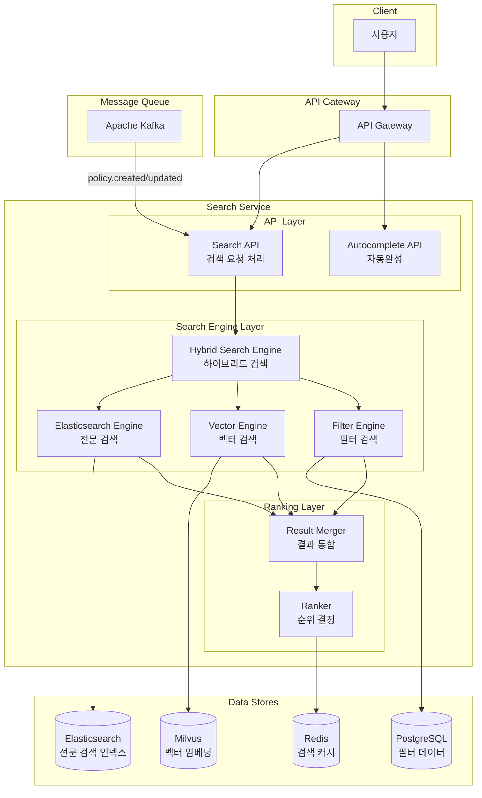

# Search Service Design Document

## Overview

Search Service는 이지스(Aegis) 시스템의 하이브리드 검색 엔진으로, 전문 검색, 벡터 검색, 필터 검색을 결합하여 최적의 검색 결과를 제공합니다.

**핵심 책임:**
1. 하이브리드 검색 (Elasticsearch + Milvus + PostgreSQL)
2. 검색 결과 순위 결정 (Ranking)
3. 자동완성 (Autocomplete)
4. 검색 분석 및 최적화
5. 검색 캐싱

**하이브리드 검색 전략:**
- **Elasticsearch**: 전문 검색 (Full-text Search) - 키워드 매칭
- **Milvus**: 벡터 검색 (Semantic Search) - 의미 기반 검색
- **PostgreSQL**: 필터 검색 (Structured Search) - 정확한 조건 검색

## Shared Library Integration

Search Service는 shared-library의 다양한 모듈을 활용하여 코드 중복을 제거하고 일관된 패턴을 유지합니다.

### 왜 Shared Library를 사용하는가?

**1. 데이터베이스 추상화 (BaseRepository)**
- 검색 로그, 사용자 선호도 등 PostgreSQL 데이터 접근 통일
- CRUD 자동 구현으로 보일러플레이트 코드 제거

**2. 중앙 에러 코드 (ErrorCode)**
- 모든 서비스에서 일관된 에러 응답
- 클라이언트가 에러 코드로 자동 처리 가능

**3. 캐싱 (cache_result)**
- 검색 결과 자동 캐싱
- Redis 연결 관리 자동화

**4. 로깅 및 모니터링**
- 구조화된 로깅으로 검색 분석 용이
- Prometheus 메트릭 자동 수집

**5. 이벤트 구독 (EventSubscriber)**
- Policy Service의 정책 변경 이벤트 자동 처리
- Kafka 연결 관리 자동화

### Before/After 비교

**Before (shared-library 없이):**
```python
# 수동 에러 처리
if not results:
    return JSONResponse(
        status_code=404,
        content={"error": "No results found"}
    )

# 수동 캐싱
cache_key = f"search:{query}"
cached = redis_client.get(cache_key)
if cached:
    return json.loads(cached)
results = await search(query)
redis_client.setex(cache_key, 300, json.dumps(results))

# 수동 로깅
print(f"Search completed: {query}")
```

**After (shared-library 사용):**
```python
from aegis_shared.database import BaseRepository
from aegis_shared.messaging import EventSubscriber
from aegis_shared.logging import get_logger
from aegis_shared.monitoring import track_metrics
from aegis_shared.errors import ErrorCode, ServiceException
from aegis_shared.cache import cache_result

# 자동 에러 처리
if not results:
    raise ServiceException(
        error_code=ErrorCode.ENTITY_NOT_FOUND,
        message="No search results found"
    )

# 자동 캐싱 (데코레이터)
@cache_result(ttl=300)
async def search(query: str):
    return await perform_search(query)

# 구조화된 로깅
logger.info("search_completed", query=query, results_count=len(results))
```

### 중앙 에러 코드 사용 예시

```python
from aegis_shared.errors import ErrorCode, ServiceException

class SearchService:
    async def search(self, query: str):
        if not query or len(query) < 2:
            raise ServiceException(
                error_code=ErrorCode.VALIDATION_FAILED,
                message="Query must be at least 2 characters",
                details={"query": query}
            )
        
        try:
            results = await self.hybrid_engine.search(query)
        except ElasticsearchException as e:
            raise ServiceException(
                error_code=ErrorCode.DATABASE_ERROR,
                message="Elasticsearch search failed",
                details={"error": str(e)}
            )
        except MilvusException as e:
            raise ServiceException(
                error_code=ErrorCode.DATABASE_ERROR,
                message="Milvus search failed",
                details={"error": str(e)}
            )
        
        if not results:
            raise ServiceException(
                error_code=ErrorCode.ENTITY_NOT_FOUND,
                message="No search results found"
            )
        
        return results
```

### 이벤트 구독 예시

```python
from aegis_shared.messaging import EventSubscriber, VersionedEvent

class PolicyEventSubscriber(EventSubscriber):
    """Policy Service 이벤트 구독"""
    
    def __init__(self):
        super().__init__(
            topics=["policy-events"],
            group_id="search-service-policy-consumer"
        )
    
    async def handle_event(self, event: VersionedEvent):
        """정책 변경 이벤트 처리"""
        if event.event_type == "policy.created":
            await self._index_policy(event.data)
        elif event.event_type == "policy.updated":
            await self._update_index(event.data)
        elif event.event_type == "policy.deleted":
            await self._delete_from_index(event.data['policy_id'])
    
    async def _index_policy(self, policy_data: Dict):
        """Elasticsearch 및 Milvus 인덱싱"""
        # Elasticsearch 인덱싱
        await self.es_client.index(
            index="policies",
            id=policy_data['policy_id'],
            body=policy_data
        )
        
        # Milvus 벡터 인덱싱
        embedding = self.model.encode(policy_data['title'] + " " + policy_data['content'])
        await self.milvus_collection.insert([{
            'policy_id': policy_data['policy_id'],
            'embedding': embedding.tolist()
        }])
        
        logger.info("policy_indexed", policy_id=policy_data['policy_id'])
```

## Architecture



## Components and Interfaces

### 1. Hybrid Search Engine

```python
from typing import List, Dict, Any
import asyncio

class HybridSearchEngine:
    """하이브리드 검색 엔진 - 3가지 검색 방식 결합"""
    
    def __init__(self):
        self.es_engine = ElasticsearchEngine()
        self.vector_engine = VectorEngine()
        self.filter_engine = FilterEngine()
        self.result_merger = ResultMerger()
        self.ranker = Ranker()
    
    @track_metrics("hybrid_search")
    @cache_result(ttl=300)  # 5분 캐싱
    async def search(
        self,
        query: str,
        filters: Optional[Dict[str, Any]] = None,
        limit: int = 20
    ) -> List[SearchResult]:
        """
        하이브리드 검색 실행
        
        프로세스:
        1. 3가지 검색 엔진 병렬 실행
        2. 결과 통합 (Result Merging)
        3. 순위 결정 (Ranking)
        4. 상위 N개 반환
        
        성능 목표: < 300ms
        """
        start_time = time.time()
        
        # 1. 병렬 검색 실행
        search_tasks = [
            self.es_engine.search(query, limit=limit*2),      # 전문 검색
            self.vector_engine.search(query, limit=limit*2),  # 벡터 검색
            self.filter_engine.search(filters, limit=limit*2) if filters else asyncio.sleep(0)  # 필터 검색
        ]
        
        results = await asyncio.gather(*search_tasks)
        es_results, vector_results, filter_results = results
        
        search_time = time.time() - start_time
        
        # 2. 결과 통합
        merged_results = await self.result_merger.merge(
            es_results=es_results,
            vector_results=vector_results,
            filter_results=filter_results if filters else []
        )
        
        merge_time = time.time() - start_time - search_time
        
        # 3. 순위 결정
        ranked_results = await self.ranker.rank(
            results=merged_results,
            query=query,
            limit=limit
        )
        
        rank_time = time.time() - start_time - search_time - merge_time
        total_time = time.time() - start_time
        
        # 성능 로깅
        logger.info(
            "hybrid_search_completed",
            query=query,
            total_results=len(ranked_results),
            total_time=total_time,
            search_time=search_time,
            merge_time=merge_time,
            rank_time=rank_time
        )
        
        if total_time > 0.5:
            logger.warning("slow_search", total_time=total_time)
        
        return ranked_results
```

### 2. Elasticsearch Engine

```python
from elasticsearch import AsyncElasticsearch

class ElasticsearchEngine:
    """Elasticsearch 전문 검색 엔진"""
    
    def __init__(self):
        self.es_client = AsyncElasticsearch(['http://elasticsearch:9200'])
    
    async def search(self, query: str, limit: int = 40) -> List[Dict[str, Any]]:
        """
        전문 검색 (Full-text Search)
        
        특징:
        - 키워드 매칭
        - 형태소 분석 (nori analyzer)
        - TF-IDF 기반 스코어링
        """
        # 검색 쿼리 구성
        search_query = {
            "query": {
                "multi_match": {
                    "query": query,
                    "fields": [
                        "title^3",           # 제목 가중치 3배
                        "content^2",         # 내용 가중치 2배
                        "issuing_organization",
                        "category"
                    ],
                    "type": "best_fields",
                    "fuzziness": "AUTO"      # 오타 허용
                }
            },
            "highlight": {
                "fields": {
                    "title": {},
                    "content": {}
                }
            },
            "size": limit
        }
        
        # 검색 실행
        response = await self.es_client.search(
            index="policies",
            body=search_query
        )
        
        # 결과 변환
        results = []
        for hit in response['hits']['hits']:
            results.append({
                'policy_id': hit['_id'],
                'score': hit['_score'],
                'source': 'elasticsearch',
                'data': hit['_source'],
                'highlight': hit.get('highlight', {})
            })
        
        logger.info(f"Elasticsearch found {len(results)} results")
        return results
```

### 3. Vector Engine

```python
from sentence_transformers import SentenceTransformer
from pymilvus import connections, Collection

class VectorEngine:
    """Milvus 벡터 검색 엔진"""
    
    def __init__(self):
        self.model = SentenceTransformer('paraphrase-multilingual-mpnet-base-v2')
        connections.connect("default", host="milvus", port="19530")
        self.collection = Collection("policy_embeddings")
    
    async def search(self, query: str, limit: int = 40) -> List[Dict[str, Any]]:
        """
        벡터 검색 (Semantic Search)
        
        특징:
        - 의미 기반 검색
        - 유사도 계산 (Cosine Similarity)
        - 동의어/유의어 자동 처리
        """
        # 쿼리 임베딩 생성
        query_embedding = self.model.encode(query).tolist()
        
        # 벡터 검색 실행
        search_params = {
            "metric_type": "COSINE",
            "params": {"nprobe": 10}
        }
        
        results = self.collection.search(
            data=[query_embedding],
            anns_field="embedding",
            param=search_params,
            limit=limit,
            output_fields=["policy_id", "title", "category"]
        )
        
        # 결과 변환
        vector_results = []
        for hits in results:
            for hit in hits:
                vector_results.append({
                    'policy_id': hit.entity.get('policy_id'),
                    'score': hit.distance,  # Cosine similarity
                    'source': 'milvus',
                    'data': {
                        'title': hit.entity.get('title'),
                        'category': hit.entity.get('category')
                    }
                })
        
        logger.info(f"Milvus found {len(vector_results)} results")
        return vector_results
```

### 4. Result Merger

```python
class ResultMerger:
    """검색 결과 통합기"""
    
    async def merge(
        self,
        es_results: List[Dict],
        vector_results: List[Dict],
        filter_results: List[Dict]
    ) -> List[Dict]:
        """
        3가지 검색 결과 통합
        
        전략:
        1. policy_id 기준으로 그룹화
        2. 각 소스별 스코어 정규화
        3. 가중 평균 계산
        """
        # policy_id별로 결과 그룹화
        merged = {}
        
        # Elasticsearch 결과 (가중치 0.4)
        for result in es_results:
            policy_id = result['policy_id']
            if policy_id not in merged:
                merged[policy_id] = {
                    'policy_id': policy_id,
                    'scores': {},
                    'data': result['data']
                }
            merged[policy_id]['scores']['elasticsearch'] = result['score']
        
        # Milvus 결과 (가중치 0.4)
        for result in vector_results:
            policy_id = result['policy_id']
            if policy_id not in merged:
                merged[policy_id] = {
                    'policy_id': policy_id,
                    'scores': {},
                    'data': result['data']
                }
            merged[policy_id]['scores']['milvus'] = result['score']
        
        # Filter 결과 (가중치 0.2)
        for result in filter_results:
            policy_id = result['policy_id']
            if policy_id not in merged:
                merged[policy_id] = {
                    'policy_id': policy_id,
                    'scores': {},
                    'data': result['data']
                }
            merged[policy_id]['scores']['filter'] = 1.0  # 필터 통과 = 1.0
        
        # 스코어 정규화 및 가중 평균
        for policy_id, data in merged.items():
            scores = data['scores']
            
            # 정규화 (0~1 범위)
            normalized_scores = {
                'elasticsearch': self._normalize_es_score(scores.get('elasticsearch', 0)),
                'milvus': scores.get('milvus', 0),  # 이미 0~1 범위
                'filter': scores.get('filter', 0)
            }
            
            # 가중 평균
            final_score = (
                normalized_scores['elasticsearch'] * 0.4 +
                normalized_scores['milvus'] * 0.4 +
                normalized_scores['filter'] * 0.2
            )
            
            data['final_score'] = final_score
            data['score_breakdown'] = normalized_scores
        
        return list(merged.values())
    
    def _normalize_es_score(self, score: float) -> float:
        """Elasticsearch 스코어 정규화 (0~1)"""
        # ES 스코어는 보통 0~20 범위
        return min(score / 20.0, 1.0)
```

### 5. Ranker

```python
class Ranker:
    """검색 결과 순위 결정기"""
    
    async def rank(
        self,
        results: List[Dict],
        query: str,
        limit: int
    ) -> List[SearchResult]:
        """
        검색 결과 순위 결정
        
        순위 결정 요소:
        1. 하이브리드 스코어 (60%)
        2. 품질 점수 (20%)
        3. 최신성 (10%)
        4. 인기도 (10%)
        """
        ranked_results = []
        
        for result in results:
            # 1. 하이브리드 스코어
            hybrid_score = result['final_score']
            
            # 2. 품질 점수 (PostgreSQL에서 조회)
            quality_score = await self._get_quality_score(result['policy_id'])
            
            # 3. 최신성 점수
            timeliness_score = await self._calculate_timeliness(result['policy_id'])
            
            # 4. 인기도 점수 (조회수, 클릭수)
            popularity_score = await self._get_popularity_score(result['policy_id'])
            
            # 최종 순위 점수 계산
            final_rank_score = (
                hybrid_score * 0.6 +
                quality_score * 0.2 +
                timeliness_score * 0.1 +
                popularity_score * 0.1
            )
            
            ranked_results.append({
                **result,
                'rank_score': final_rank_score,
                'rank_breakdown': {
                    'hybrid': hybrid_score,
                    'quality': quality_score,
                    'timeliness': timeliness_score,
                    'popularity': popularity_score
                }
            })
        
        # 순위 점수로 정렬
        ranked_results.sort(key=lambda x: x['rank_score'], reverse=True)
        
        return ranked_results[:limit]
```

## Performance Benchmarks

| 작업 | 목표 응답 시간 | 목표 TPS | 비고 |
|------|--------------|---------|------|
| 하이브리드 검색 | < 300ms | 300 | 3개 엔진 병렬 |
| 전문 검색만 | < 100ms | 500 | Elasticsearch |
| 벡터 검색만 | < 150ms | 400 | Milvus |
| 자동완성 | < 50ms | 1000 | Redis 캐시 |

## Error Handling

### 중앙 에러 코드 레지스트리 사용

```python
from aegis_shared.errors import ErrorCode, ServiceException

class SearchErrorHandler:
    """검색 서비스 에러 처리"""
    
    @staticmethod
    def handle_search_error(error: Exception) -> ServiceException:
        """검색 에러를 표준 에러로 변환"""
        
        if isinstance(error, ElasticsearchException):
            return ServiceException(
                error_code=ErrorCode.DATABASE_ERROR,
                message="Elasticsearch search failed",
                details={"service": "elasticsearch", "error": str(error)}
            )
        
        elif isinstance(error, MilvusException):
            return ServiceException(
                error_code=ErrorCode.DATABASE_ERROR,
                message="Milvus search failed",
                details={"service": "milvus", "error": str(error)}
            )
        
        elif isinstance(error, TimeoutError):
            return ServiceException(
                error_code=ErrorCode.EXT_SERVICE_TIMEOUT,
                message="Search timeout",
                details={"timeout": "300ms"}
            )
        
        else:
            return ServiceException(
                error_code=ErrorCode.INTERNAL_ERROR,
                message="Unexpected search error",
                details={"error": str(error)}
            )
```

### 에러 복구 전략

```python
from tenacity import retry, stop_after_attempt, wait_exponential

class ResilientSearchEngine:
    """장애 복구 기능이 있는 검색 엔진"""
    
    @retry(
        stop=stop_after_attempt(3),
        wait=wait_exponential(multiplier=1, min=1, max=10)
    )
    async def search_with_retry(self, query: str):
        """재시도 로직이 있는 검색"""
        try:
            return await self.hybrid_engine.search(query)
        except Exception as e:
            logger.warning("search_retry", error=str(e))
            raise
    
    async def search_with_fallback(self, query: str):
        """폴백 전략이 있는 검색"""
        try:
            # 1차: 하이브리드 검색
            return await self.hybrid_engine.search(query)
        except Exception as e:
            logger.warning("hybrid_search_failed", error=str(e))
            
            try:
                # 2차: Elasticsearch만 사용
                return await self.es_engine.search(query)
            except Exception as e2:
                logger.error("elasticsearch_fallback_failed", error=str(e2))
                
                # 3차: PostgreSQL 직접 검색
                return await self.postgres_fallback_search(query)
```

---

## Production Considerations

### 1. 확장성 (Scalability)

#### Horizontal Pod Autoscaling (HPA)

```yaml
# kubernetes/search-service-hpa.yaml
apiVersion: autoscaling/v2
kind: HorizontalPodAutoscaler
metadata:
  name: search-service-hpa
spec:
  scaleTargetRef:
    apiVersion: apps/v1
    kind: Deployment
    name: search-service
  minReplicas: 3
  maxReplicas: 20
  metrics:
  - type: Resource
    resource:
      name: cpu
      target:
        type: Utilization
        averageUtilization: 70
  - type: Resource
    resource:
      name: memory
      target:
        type: Utilization
        averageUtilization: 80
  - type: Pods
    pods:
      metric:
        name: search_requests_per_second
      target:
        type: AverageValue
        averageValue: "100"
```

#### 데이터베이스 연결 풀 관리

```python
from sqlalchemy.ext.asyncio import create_async_engine, AsyncSession
from sqlalchemy.orm import sessionmaker

class DatabaseManager:
    """데이터베이스 연결 풀 관리"""
    
    def __init__(self):
        self.engine = create_async_engine(
            DATABASE_URL,
            pool_size=20,           # 기본 연결 수
            max_overflow=40,        # 추가 연결 수
            pool_timeout=30,        # 연결 대기 시간
            pool_recycle=3600,      # 연결 재사용 시간
            pool_pre_ping=True      # 연결 상태 확인
        )
        
        self.session_factory = sessionmaker(
            self.engine,
            class_=AsyncSession,
            expire_on_commit=False
        )
```

#### 부하 분산 전략

```python
class LoadBalancedSearchEngine:
    """부하 분산 검색 엔진"""
    
    def __init__(self):
        # Elasticsearch 클러스터 (3개 노드)
        self.es_clients = [
            AsyncElasticsearch(['http://es-node-1:9200']),
            AsyncElasticsearch(['http://es-node-2:9200']),
            AsyncElasticsearch(['http://es-node-3:9200'])
        ]
        self.current_es_index = 0
    
    def get_es_client(self):
        """라운드 로빈 방식으로 ES 클라이언트 선택"""
        client = self.es_clients[self.current_es_index]
        self.current_es_index = (self.current_es_index + 1) % len(self.es_clients)
        return client
```

### 2. 장애 복구 (Fault Tolerance)

#### Circuit Breaker 패턴

```python
from circuitbreaker import circuit

class CircuitBreakerSearchEngine:
    """Circuit Breaker 패턴 적용"""
    
    @circuit(failure_threshold=5, recovery_timeout=60)
    async def search_elasticsearch(self, query: str):
        """Elasticsearch 검색 (Circuit Breaker 적용)"""
        return await self.es_client.search(query)
    
    @circuit(failure_threshold=5, recovery_timeout=60)
    async def search_milvus(self, query: str):
        """Milvus 검색 (Circuit Breaker 적용)"""
        return await self.milvus_client.search(query)
```

#### Retry 전략

```python
from tenacity import retry, stop_after_attempt, wait_exponential, retry_if_exception_type

class RetrySearchEngine:
    """재시도 전략 적용"""
    
    @retry(
        stop=stop_after_attempt(3),
        wait=wait_exponential(multiplier=1, min=1, max=10),
        retry=retry_if_exception_type((ConnectionError, TimeoutError))
    )
    async def search_with_retry(self, query: str):
        """재시도 로직이 있는 검색"""
        return await self.hybrid_engine.search(query)
```

#### Health Check

```python
from fastapi import APIRouter

health_router = APIRouter()

@health_router.get("/health")
async def health_check():
    """헬스 체크 엔드포인트"""
    health_status = {
        "status": "healthy",
        "checks": {}
    }
    
    # Elasticsearch 상태 확인
    try:
        await es_client.ping()
        health_status["checks"]["elasticsearch"] = "healthy"
    except:
        health_status["checks"]["elasticsearch"] = "unhealthy"
        health_status["status"] = "degraded"
    
    # Milvus 상태 확인
    try:
        await milvus_client.get_collection_stats()
        health_status["checks"]["milvus"] = "healthy"
    except:
        health_status["checks"]["milvus"] = "unhealthy"
        health_status["status"] = "degraded"
    
    # PostgreSQL 상태 확인
    try:
        await db_session.execute("SELECT 1")
        health_status["checks"]["postgresql"] = "healthy"
    except:
        health_status["checks"]["postgresql"] = "unhealthy"
        health_status["status"] = "degraded"
    
    # Redis 상태 확인
    try:
        await redis_client.ping()
        health_status["checks"]["redis"] = "healthy"
    except:
        health_status["checks"]["redis"] = "unhealthy"
        health_status["status"] = "degraded"
    
    return health_status
```

### 3. 캐싱 전략

#### 다층 캐싱 (Multi-level Caching)

```python
from functools import lru_cache
from aegis_shared.cache import RedisCache

class MultiLevelCache:
    """다층 캐싱 시스템"""
    
    def __init__(self):
        self.redis_cache = RedisCache()
        self.local_cache_size = 1000
    
    @lru_cache(maxsize=1000)  # L1: 메모리 캐시
    async def get_from_local_cache(self, cache_key: str):
        """로컬 메모리 캐시 조회"""
        return None  # LRU 캐시가 자동 관리
    
    async def get_from_redis(self, cache_key: str):
        """L2: Redis 캐시 조회"""
        return await self.redis_cache.get(cache_key)
    
    async def get_search_results(self, query: str):
        """다층 캐싱 적용 검색"""
        cache_key = f"search:{query}"
        
        # L1: 로컬 메모리 캐시 확인
        local_result = await self.get_from_local_cache(cache_key)
        if local_result:
            logger.info("cache_hit", level="L1", query=query)
            return local_result
        
        # L2: Redis 캐시 확인
        redis_result = await self.get_from_redis(cache_key)
        if redis_result:
            logger.info("cache_hit", level="L2", query=query)
            # L1 캐시에도 저장
            self.get_from_local_cache.cache_info()
            return redis_result
        
        # L3: 실제 검색 수행
        logger.info("cache_miss", query=query)
        results = await self.hybrid_engine.search(query)
        
        # 캐시에 저장
        await self.redis_cache.set(cache_key, results, ttl=300)
        
        return results
```

#### 캐시 무효화 전략

```python
class CacheInvalidator:
    """캐시 무효화 관리"""
    
    async def invalidate_policy_cache(self, policy_id: str):
        """정책 변경 시 관련 캐시 무효화"""
        # 1. 정책 ID로 시작하는 모든 캐시 키 삭제
        pattern = f"search:*{policy_id}*"
        keys = await redis_client.keys(pattern)
        if keys:
            await redis_client.delete(*keys)
            logger.info("cache_invalidated", policy_id=policy_id, keys_count=len(keys))
        
        # 2. 전체 검색 캐시 무효화 (선택적)
        # await redis_client.flushdb()
```

#### 캐시 히트율 모니터링

```python
from prometheus_client import Gauge

cache_hit_rate = Gauge('search_cache_hit_rate', 'Search cache hit rate', ['level'])

class CacheMonitor:
    """캐시 성능 모니터링"""
    
    def __init__(self):
        self.l1_hits = 0
        self.l2_hits = 0
        self.misses = 0
    
    def record_hit(self, level: str):
        if level == "L1":
            self.l1_hits += 1
        elif level == "L2":
            self.l2_hits += 1
        self._update_metrics()
    
    def record_miss(self):
        self.misses += 1
        self._update_metrics()
    
    def _update_metrics(self):
        total = self.l1_hits + self.l2_hits + self.misses
        if total > 0:
            l1_rate = self.l1_hits / total
            l2_rate = self.l2_hits / total
            cache_hit_rate.labels(level="L1").set(l1_rate)
            cache_hit_rate.labels(level="L2").set(l2_rate)
```

### 4. 모니터링 및 알림

#### Prometheus 메트릭

```python
from prometheus_client import Histogram, Counter, Gauge

# 검색 성능 메트릭
search_duration = Histogram(
    'search_duration_seconds',
    'Search duration in seconds',
    ['search_type', 'status'],
    buckets=[0.05, 0.1, 0.2, 0.3, 0.5, 1.0, 2.0]
)

search_results_count = Histogram(
    'search_results_count',
    'Number of search results',
    buckets=[0, 1, 5, 10, 20, 50, 100]
)

# 에러 메트릭
search_errors = Counter(
    'search_errors_total',
    'Total number of search errors',
    ['error_type', 'service']
)

# 캐시 메트릭
cache_hit_rate = Gauge('search_cache_hit_rate', 'Search cache hit rate', ['level'])
cache_size = Gauge('search_cache_size', 'Search cache size', ['level'])

# 데이터베이스 메트릭
db_connection_pool_size = Gauge(
    'db_connection_pool_size',
    'Database connection pool size',
    ['database']
)
```

#### Grafana 대시보드 설정

```yaml
# grafana/dashboards/search-service.json
{
  "dashboard": {
    "title": "Search Service Monitoring",
    "panels": [
      {
        "title": "Search Latency (p50, p95, p99)",
        "targets": [
          {
            "expr": "histogram_quantile(0.50, search_duration_seconds_bucket)"
          },
          {
            "expr": "histogram_quantile(0.95, search_duration_seconds_bucket)"
          },
          {
            "expr": "histogram_quantile(0.99, search_duration_seconds_bucket)"
          }
        ]
      },
      {
        "title": "Cache Hit Rate",
        "targets": [
          {
            "expr": "search_cache_hit_rate{level='L1'}"
          },
          {
            "expr": "search_cache_hit_rate{level='L2'}"
          }
        ]
      },
      {
        "title": "Error Rate",
        "targets": [
          {
            "expr": "rate(search_errors_total[5m])"
          }
        ]
      }
    ]
  }
}
```

#### 알림 규칙

```yaml
# prometheus/alerts/search-service.yaml
groups:
  - name: search_service_alerts
    interval: 30s
    rules:
      # 검색 지연 알림
      - alert: HighSearchLatency
        expr: histogram_quantile(0.95, search_duration_seconds_bucket) > 0.5
        for: 5m
        labels:
          severity: warning
        annotations:
          summary: "High search latency detected"
          description: "P95 search latency is {{ $value }}s (threshold: 0.5s)"
      
      # 에러율 알림
      - alert: HighSearchErrorRate
        expr: rate(search_errors_total[5m]) > 0.1
        for: 5m
        labels:
          severity: critical
        annotations:
          summary: "High search error rate"
          description: "Error rate is {{ $value }} errors/sec"
      
      # 캐시 히트율 알림
      - alert: LowCacheHitRate
        expr: search_cache_hit_rate < 0.5
        for: 10m
        labels:
          severity: warning
        annotations:
          summary: "Low cache hit rate"
          description: "Cache hit rate is {{ $value }} (threshold: 0.5)"
      
      # 데이터베이스 연결 알림
      - alert: DatabaseConnectionPoolExhausted
        expr: db_connection_pool_size > 50
        for: 5m
        labels:
          severity: critical
        annotations:
          summary: "Database connection pool exhausted"
          description: "Connection pool size is {{ $value }}"
```

### 5. 보안 (Security)

#### 인증 및 인가

```python
from aegis_shared.auth import get_current_user, require_permission

@router.post("/api/v1/search")
async def search(
    request: SearchRequest,
    current_user: User = Depends(get_current_user)
):
    """검색 API (인증 필요)"""
    # JWT 토큰 검증은 get_current_user가 자동 처리
    
    # 권한 확인
    if not current_user.has_permission("search:read"):
        raise ServiceException(
            error_code=ErrorCode.INSUFFICIENT_PERMISSION,
            message="Search permission required"
        )
    
    results = await search_service.search(request.query)
    return results
```

#### Rate Limiting

```python
from slowapi import Limiter
from slowapi.util import get_remote_address

limiter = Limiter(key_func=get_remote_address)

@router.post("/api/v1/search")
@limiter.limit("100/minute")  # 분당 100회 제한
async def search(request: SearchRequest):
    """Rate Limiting 적용 검색 API"""
    return await search_service.search(request.query)
```

#### 입력 검증 및 SQL Injection 방지

```python
from pydantic import BaseModel, validator

class SearchRequest(BaseModel):
    query: str
    filters: Optional[Dict[str, Any]] = None
    limit: int = 20
    
    @validator('query')
    def validate_query(cls, v):
        # 최소 길이 검증
        if len(v) < 2:
            raise ValueError("Query must be at least 2 characters")
        
        # 최대 길이 검증
        if len(v) > 200:
            raise ValueError("Query must be less than 200 characters")
        
        # 특수 문자 검증 (SQL Injection 방지)
        dangerous_chars = [';', '--', '/*', '*/', 'xp_', 'sp_']
        for char in dangerous_chars:
            if char in v.lower():
                raise ValueError(f"Invalid character: {char}")
        
        return v
    
    @validator('limit')
    def validate_limit(cls, v):
        if v < 1 or v > 100:
            raise ValueError("Limit must be between 1 and 100")
        return v
```

---

## Integration Testing Strategy

### 1. 계약 테스트 (Contract Testing)

```python
import pytest
from pact import Consumer, Provider

@pytest.fixture
def search_service_contract():
    """Search Service 계약 정의"""
    pact = Consumer('frontend').has_pact_with(Provider('search-service'))
    
    pact.given('policies exist in database') \
        .upon_receiving('a search request') \
        .with_request('POST', '/api/v1/search') \
        .will_respond_with(200, body={
            'results': [
                {'policy_id': '...', 'title': '...', 'score': 0.95}
            ]
        })
    
    return pact

def test_search_contract(search_service_contract):
    """계약 테스트 실행"""
    with search_service_contract:
        response = requests.post(
            'http://localhost:8000/api/v1/search',
            json={'query': 'test'}
        )
        assert response.status_code == 200
```

### 2. E2E 테스트

```python
import pytest
from httpx import AsyncClient

@pytest.mark.asyncio
async def test_search_e2e():
    """검색 E2E 테스트"""
    async with AsyncClient(app=app, base_url="http://test") as client:
        # 1. 정책 생성 (Policy Service)
        policy_response = await client.post(
            "/api/v1/policies",
            json={
                "title": "Test Policy",
                "content": "Test content"
            }
        )
        assert policy_response.status_code == 201
        policy_id = policy_response.json()['policy_id']
        
        # 2. 인덱싱 대기 (비동기 처리)
        await asyncio.sleep(2)
        
        # 3. 검색 실행
        search_response = await client.post(
            "/api/v1/search",
            json={"query": "Test Policy"}
        )
        assert search_response.status_code == 200
        results = search_response.json()['results']
        
        # 4. 검증
        assert len(results) > 0
        assert any(r['policy_id'] == policy_id for r in results)
```

### 3. 부하 테스트 (Locust)

```python
from locust import HttpUser, task, between

class SearchUser(HttpUser):
    """검색 사용자 시뮬레이션"""
    wait_time = between(1, 3)
    
    @task(3)
    def search_popular_query(self):
        """인기 검색어 (70%)"""
        self.client.post("/api/v1/search", json={
            "query": "소상공인 지원금"
        })
    
    @task(1)
    def search_rare_query(self):
        """희귀 검색어 (30%)"""
        self.client.post("/api/v1/search", json={
            "query": f"test query {random.randint(1, 10000)}"
        })
    
    @task(2)
    def autocomplete(self):
        """자동완성"""
        self.client.get("/api/v1/autocomplete?q=소상")

# 실행: locust -f locustfile.py --host=http://localhost:8000
```

---

## Monitoring

```python
from prometheus_client import Histogram, Counter, Gauge

# 검색 성능 메트릭
search_duration = Histogram(
    'search_duration_seconds',
    'Search duration in seconds',
    ['search_type', 'status'],
    buckets=[0.05, 0.1, 0.2, 0.3, 0.5, 1.0, 2.0]
)

search_results_count = Histogram(
    'search_results_count',
    'Number of search results',
    buckets=[0, 1, 5, 10, 20, 50, 100]
)

# 에러 메트릭
search_errors = Counter(
    'search_errors_total',
    'Total number of search errors',
    ['error_type', 'service']
)

# 캐시 메트릭
cache_hit_rate = Gauge('search_cache_hit_rate', 'Search cache hit rate', ['level'])
cache_size = Gauge('search_cache_size', 'Search cache size', ['level'])

# 데이터베이스 메트릭
db_connection_pool_size = Gauge(
    'db_connection_pool_size',
    'Database connection pool size',
    ['database']
)
```


---

## Data Models

### 1. Search Request

```python
from pydantic import BaseModel, validator
from typing import Optional, Dict, Any

class SearchRequest(BaseModel):
    """검색 요청 모델"""
    query: str
    filters: Optional[Dict[str, Any]] = None
    limit: int = 20
    offset: int = 0
    
    @validator('query')
    def validate_query(cls, v):
        if len(v) < 2:
            raise ValueError("Query must be at least 2 characters")
        if len(v) > 200:
            raise ValueError("Query must be less than 200 characters")
        return v
    
    @validator('limit')
    def validate_limit(cls, v):
        if v < 1 or v > 100:
            raise ValueError("Limit must be between 1 and 100")
        return v

class SearchFilters(BaseModel):
    """검색 필터 모델"""
    category: Optional[str] = None
    issuing_organization: Optional[str] = None
    target_business_type: Optional[List[str]] = None
    min_support_amount: Optional[int] = None
    max_support_amount: Optional[int] = None
    application_start_date: Optional[date] = None
    application_end_date: Optional[date] = None
```

### 2. Search Response

```python
class SearchResult(BaseModel):
    """검색 결과 모델"""
    policy_id: str
    title: str
    content: str
    category: str
    issuing_organization: str
    support_amount: Optional[int]
    application_period: Optional[str]
    
    # 스코어 정보
    rank_score: float
    score_breakdown: Dict[str, float]
    
    # 하이라이트
    highlight: Optional[Dict[str, List[str]]] = None
    
    # 메타데이터
    indexed_at: datetime
    quality_score: float

class SearchResponse(BaseModel):
    """검색 응답 모델"""
    results: List[SearchResult]
    total_count: int
    query: str
    filters: Optional[Dict[str, Any]]
    
    # 성능 정보
    search_time_ms: float
    cache_hit: bool
    
    # 페이지네이션
    limit: int
    offset: int
    has_more: bool
```

### 3. Autocomplete Models

```python
class AutocompleteRequest(BaseModel):
    """자동완성 요청 모델"""
    query: str
    limit: int = 10
    
    @validator('query')
    def validate_query(cls, v):
        if len(v) < 1:
            raise ValueError("Query must be at least 1 character")
        return v

class AutocompleteSuggestion(BaseModel):
    """자동완성 제안 모델"""
    text: str
    score: float
    category: Optional[str] = None

class AutocompleteResponse(BaseModel):
    """자동완성 응답 모델"""
    suggestions: List[AutocompleteSuggestion]
    query: str
```

### 4. Database Models

```python
from sqlalchemy import Column, String, Integer, Float, DateTime, JSON
from sqlalchemy.dialects.postgresql import UUID
from aegis_shared.database import Base

class SearchLog(Base):
    """검색 로그 테이블"""
    __tablename__ = "search_logs"
    
    id = Column(UUID(as_uuid=True), primary_key=True, default=uuid.uuid4)
    user_id = Column(UUID(as_uuid=True), nullable=True)
    query = Column(String(500), nullable=False)
    filters = Column(JSON, nullable=True)
    results_count = Column(Integer, nullable=False)
    search_time_ms = Column(Float, nullable=False)
    cache_hit = Column(Boolean, default=False)
    created_at = Column(DateTime, default=datetime.utcnow)
    
    # 인덱스
    __table_args__ = (
        Index('idx_search_logs_user_id', 'user_id'),
        Index('idx_search_logs_created_at', 'created_at'),
        Index('idx_search_logs_query', 'query'),
    )

class UserSearchPreference(Base):
    """사용자 검색 선호도 테이블"""
    __tablename__ = "user_search_preferences"
    
    id = Column(UUID(as_uuid=True), primary_key=True, default=uuid.uuid4)
    user_id = Column(UUID(as_uuid=True), nullable=False, unique=True)
    preferred_categories = Column(JSON, nullable=True)
    search_history = Column(JSON, nullable=True)  # 최근 검색어
    click_history = Column(JSON, nullable=True)   # 클릭한 정책
    updated_at = Column(DateTime, default=datetime.utcnow, onupdate=datetime.utcnow)
```

### 5. Elasticsearch Index Schema

```json
{
  "mappings": {
    "properties": {
      "policy_id": {
        "type": "keyword"
      },
      "title": {
        "type": "text",
        "analyzer": "nori",
        "fields": {
          "keyword": {
            "type": "keyword"
          }
        }
      },
      "content": {
        "type": "text",
        "analyzer": "nori"
      },
      "category": {
        "type": "keyword"
      },
      "issuing_organization": {
        "type": "keyword"
      },
      "target_business_type": {
        "type": "keyword"
      },
      "support_amount": {
        "type": "integer"
      },
      "application_start_date": {
        "type": "date"
      },
      "application_end_date": {
        "type": "date"
      },
      "indexed_at": {
        "type": "date"
      },
      "quality_score": {
        "type": "float"
      }
    }
  },
  "settings": {
    "analysis": {
      "analyzer": {
        "nori": {
          "type": "custom",
          "tokenizer": "nori_tokenizer",
          "filter": ["lowercase", "nori_part_of_speech"]
        }
      }
    },
    "number_of_shards": 3,
    "number_of_replicas": 2
  }
}
```

### 6. Milvus Collection Schema

```python
from pymilvus import CollectionSchema, FieldSchema, DataType

# Milvus 컬렉션 스키마
policy_embeddings_schema = CollectionSchema(
    fields=[
        FieldSchema(name="id", dtype=DataType.INT64, is_primary=True, auto_id=True),
        FieldSchema(name="policy_id", dtype=DataType.VARCHAR, max_length=100),
        FieldSchema(name="embedding", dtype=DataType.FLOAT_VECTOR, dim=768),
        FieldSchema(name="title", dtype=DataType.VARCHAR, max_length=500),
        FieldSchema(name="category", dtype=DataType.VARCHAR, max_length=100),
        FieldSchema(name="indexed_at", dtype=DataType.INT64)  # Unix timestamp
    ],
    description="Policy embeddings for semantic search"
)

# 인덱스 파라미터
index_params = {
    "metric_type": "COSINE",
    "index_type": "IVF_FLAT",
    "params": {"nlist": 1024}
}
```

### 7. Event Schemas

```python
from aegis_shared.messaging import VersionedEvent

class PolicyIndexedEvent(VersionedEvent):
    """정책 인덱싱 완료 이벤트"""
    event_type = "policy.indexed"
    version = "1.0.0"
    
    policy_id: str
    indexed_at: datetime
    elasticsearch_indexed: bool
    milvus_indexed: bool

class SearchPerformedEvent(VersionedEvent):
    """검색 수행 이벤트"""
    event_type = "search.performed"
    version = "1.0.0"
    
    user_id: Optional[str]
    query: str
    results_count: int
    search_time_ms: float
    cache_hit: bool
```


---

## Data Models (Complete)

### PostgreSQL Models

```python
from sqlalchemy import Column, String, Integer, Float, DateTime, JSON, Boolean, Text, Index
from sqlalchemy.dialects.postgresql import UUID
from aegis_shared.database import Base
from datetime import datetime
import uuid

class SearchQuery(Base):
    """검색 쿼리 로그"""
    __tablename__ = "search_queries"
    
    id = Column(UUID(as_uuid=True), primary_key=True, default=uuid.uuid4)
    user_id = Column(String(255), nullable=True, index=True)
    query_text = Column(Text, nullable=False)
    query_type = Column(String(50), nullable=False)  # keyword, semantic, hybrid
    filters = Column(JSON, nullable=True)
    results_count = Column(Integer, nullable=False)
    response_time_ms = Column(Integer, nullable=False)
    clicked_result_id = Column(String(255), nullable=True)
    click_position = Column(Integer, nullable=True)
    session_id = Column(String(255), nullable=True, index=True)
    created_at = Column(DateTime, nullable=False, default=datetime.utcnow, index=True)
    
    __table_args__ = (
        Index('idx_search_user_created', 'user_id', 'created_at'),
        Index('idx_search_query_text', 'query_text'),
    )

class PopularQuery(Base):
    """인기 검색어"""
    __tablename__ = "popular_queries"
    
    id = Column(UUID(as_uuid=True), primary_key=True, default=uuid.uuid4)
    query_text = Column(String(500), nullable=False, unique=True, index=True)
    search_count = Column(Integer, nullable=False, default=1)
    last_searched_at = Column(DateTime, nullable=False, default=datetime.utcnow)
    trending_score = Column(Float, nullable=False, default=0.0)
    category = Column(String(100), nullable=True)
    
    __table_args__ = (
        Index('idx_popular_trending', 'trending_score'),
    )

class SearchSuggestion(Base):
    """검색 제안"""
    __tablename__ = "search_suggestions"
    
    id = Column(UUID(as_uuid=True), primary_key=True, default=uuid.uuid4)
    original_query = Column(String(500), nullable=False, index=True)
    suggested_query = Column(String(500), nullable=False)
    suggestion_type = Column(String(50), nullable=False)  # spelling, synonym, related
    confidence_score = Column(Float, nullable=False)
    usage_count = Column(Integer, nullable=False, default=0)
    created_at = Column(DateTime, nullable=False, default=datetime.utcnow)

class UserSearchBehavior(Base):
    """사용자 검색 행동"""
    __tablename__ = "user_search_behaviors"
    
    id = Column(UUID(as_uuid=True), primary_key=True, default=uuid.uuid4)
    user_id = Column(String(255), nullable=False, index=True)
    preferred_categories = Column(JSON, nullable=True)
    preferred_regions = Column(JSON, nullable=True)
    avg_results_clicked = Column(Float, nullable=True)
    search_frequency = Column(Integer, nullable=False, default=0)
    last_search_at = Column(DateTime, nullable=True)
    updated_at = Column(DateTime, nullable=False, default=datetime.utcnow, onupdate=datetime.utcnow)
```

### Pydantic Models (API)

```python
from pydantic import BaseModel, Field, validator
from typing import List, Optional, Dict, Any
from datetime import datetime
from enum import Enum

class SearchType(str, Enum):
    KEYWORD = "keyword"
    SEMANTIC = "semantic"
    HYBRID = "hybrid"

class SortBy(str, Enum):
    RELEVANCE = "relevance"
    DATE = "date"
    AMOUNT = "amount"
    POPULARITY = "popularity"

class SearchRequest(BaseModel):
    query: str = Field(..., min_length=1, max_length=500, description="검색 쿼리")
    search_type: SearchType = Field(SearchType.HYBRID, description="검색 타입")
    filters: Optional[Dict[str, Any]] = Field(None, description="필터 조건")
    sort_by: SortBy = Field(SortBy.RELEVANCE, description="정렬 기준")
    page: int = Field(1, ge=1, description="페이지 번호")
    size: int = Field(20, ge=1, le=100, description="페이지 크기")
    
    @validator('query')
    def validate_query(cls, v):
        if len(v.strip()) < 2:
            raise ValueError("Query must be at least 2 characters")
        return v.strip()

class SearchResultItem(BaseModel):
    policy_id: str
    title: str
    content: str
    category: str
    issuing_organization: str
    support_amount: Optional[int] = None
    application_period: Optional[str] = None
    score: float
    score_breakdown: Dict[str, float]
    highlight: Optional[Dict[str, List[str]]] = None

class SearchFacets(BaseModel):
    categories: Dict[str, int]
    regions: Dict[str, int]
    organizations: Dict[str, int]
    support_types: Dict[str, int]

class SearchMetadata(BaseModel):
    total_results: int
    search_time_ms: int
    page: int
    size: int
    total_pages: int
    engines_used: List[str]

class SearchResponse(BaseModel):
    results: List[SearchResultItem]
    facets: SearchFacets
    metadata: SearchMetadata
    suggestions: Optional[List[str]] = None
```

---

## Service Integration (Complete)

### API 호출 (Policy Service)

```python
import httpx
from typing import Optional, Dict, Any, List

class PolicyServiceClient:
    """Policy Service API 클라이언트"""
    
    def __init__(self, base_url: str, timeout: int = 5):
        self.base_url = base_url
        self.client = httpx.AsyncClient(
            base_url=base_url,
            timeout=timeout
        )
    
    async def get_policy(self, policy_id: str) -> Optional[Dict[str, Any]]:
        """정책 상세 조회"""
        try:
            response = await self.client.get(f"/api/v1/policies/{policy_id}")
            if response.status_code == 200:
                return response.json()
            return None
        except Exception as e:
            logger.error("policy_service_error", error=str(e))
            return None
    
    async def get_policies_batch(self, policy_ids: List[str]) -> List[Dict[str, Any]]:
        """정책 일괄 조회"""
        try:
            response = await self.client.post(
                "/api/v1/policies/batch",
                json={"policy_ids": policy_ids}
            )
            if response.status_code == 200:
                return response.json()['policies']
            return []
        except Exception as e:
            logger.error("policy_batch_error", error=str(e))
            return []
```

### 이벤트 구독 (Kafka)

```python
from aegis_shared.messaging import EventSubscriber

class PolicyEventHandler:
    """Policy Service 이벤트 핸들러"""
    
    def __init__(self):
        self.subscriber = EventSubscriber(
            topics=["policy-events"],
            group_id="search-service"
        )
        self.es_client = get_elasticsearch_client()
        self.milvus_client = get_milvus_client()
    
    async def start(self):
        """이벤트 구독 시작"""
        async for event in self.subscriber.consume():
            await self.handle_event(event)
    
    async def handle_event(self, event: Dict[str, Any]):
        """이벤트 처리"""
        event_type = event.get('event_type')
        
        if event_type == 'policy.created':
            await self.index_policy(event['data'])
        elif event_type == 'policy.updated':
            await self.update_index(event['data'])
        elif event_type == 'policy.deleted':
            await self.delete_from_index(event['data']['policy_id'])
    
    async def index_policy(self, policy_data: Dict):
        """정책 인덱싱"""
        # Elasticsearch 인덱싱
        await self.es_client.index(
            index="policies",
            id=policy_data['policy_id'],
            body=policy_data
        )
        
        # Milvus 벡터 인덱싱
        embedding = self.generate_embedding(policy_data)
        await self.milvus_client.insert([{
            'policy_id': policy_data['policy_id'],
            'embedding': embedding
        }])
```

---

## Integration Testing Strategy

### 단위 테스트

```python
import pytest
from unittest.mock import Mock, AsyncMock

class TestHybridSearchEngine:
    @pytest.fixture
    def search_engine(self):
        return HybridSearchEngine()
    
    @pytest.mark.asyncio
    async def test_search_success(self, search_engine):
        # Given
        query = "소상공인 지원"
        
        # When
        results = await search_engine.search(query)
        
        # Then
        assert len(results) > 0
        assert all('policy_id' in r for r in results)
        assert all('score' in r for r in results)
```

### 통합 테스트

```python
@pytest.mark.integration
class TestSearchAPI:
    @pytest.mark.asyncio
    async def test_search_endpoint(self, client):
        # Given
        request_data = {
            "query": "소상공인",
            "search_type": "hybrid",
            "page": 1,
            "size": 20
        }
        
        # When
        response = await client.post("/api/v1/search", json=request_data)
        
        # Then
        assert response.status_code == 200
        data = response.json()
        assert 'results' in data
        assert 'metadata' in data
```

---

## API Specification (OpenAPI)

```yaml
openapi: 3.0.3
info:
  title: Search Service API
  version: 1.0.0
  description: 하이브리드 검색 서비스 API

paths:
  /api/v1/search:
    post:
      summary: 통합 검색
      tags: [Search]
      requestBody:
        required: true
        content:
          application/json:
            schema:
              $ref: '#/components/schemas/SearchRequest'
      responses:
        '200':
          description: 성공
          content:
            application/json:
              schema:
                $ref: '#/components/schemas/SearchResponse'
        '400':
          description: 잘못된 요청
        '500':
          description: 서버 에러

  /api/v1/suggestions:
    get:
      summary: 자동완성
      tags: [Suggestions]
      parameters:
        - name: q
          in: query
          required: true
          schema:
            type: string
        - name: limit
          in: query
          schema:
            type: integer
            default: 10
      responses:
        '200':
          description: 성공

components:
  schemas:
    SearchRequest:
      type: object
      required:
        - query
      properties:
        query:
          type: string
        search_type:
          type: string
          enum: [keyword, semantic, hybrid]
        filters:
          type: object
        page:
          type: integer
        size:
          type: integer
```

---

## Database Schema

### PostgreSQL 스키마

```sql
-- 검색 쿼리 로그
CREATE TABLE search_queries (
    id UUID PRIMARY KEY DEFAULT gen_random_uuid(),
    user_id VARCHAR(255),
    query_text TEXT NOT NULL,
    query_type VARCHAR(50) NOT NULL,
    filters JSONB,
    results_count INTEGER NOT NULL,
    response_time_ms INTEGER NOT NULL,
    clicked_result_id VARCHAR(255),
    click_position INTEGER,
    session_id VARCHAR(255),
    created_at TIMESTAMP WITH TIME ZONE NOT NULL DEFAULT NOW()
);

CREATE INDEX idx_search_user_created ON search_queries(user_id, created_at);
CREATE INDEX idx_search_query_text ON search_queries(query_text);
CREATE INDEX idx_search_session ON search_queries(session_id);

-- 인기 검색어
CREATE TABLE popular_queries (
    id UUID PRIMARY KEY DEFAULT gen_random_uuid(),
    query_text VARCHAR(500) NOT NULL UNIQUE,
    search_count INTEGER NOT NULL DEFAULT 1,
    last_searched_at TIMESTAMP WITH TIME ZONE NOT NULL DEFAULT NOW(),
    trending_score FLOAT NOT NULL DEFAULT 0.0,
    category VARCHAR(100)
);

CREATE INDEX idx_popular_trending ON popular_queries(trending_score DESC);
CREATE INDEX idx_popular_query ON popular_queries(query_text);

-- 검색 제안
CREATE TABLE search_suggestions (
    id UUID PRIMARY KEY DEFAULT gen_random_uuid(),
    original_query VARCHAR(500) NOT NULL,
    suggested_query VARCHAR(500) NOT NULL,
    suggestion_type VARCHAR(50) NOT NULL,
    confidence_score FLOAT NOT NULL,
    usage_count INTEGER NOT NULL DEFAULT 0,
    created_at TIMESTAMP WITH TIME ZONE NOT NULL DEFAULT NOW()
);

CREATE INDEX idx_suggestion_original ON search_suggestions(original_query);

-- 사용자 검색 행동
CREATE TABLE user_search_behaviors (
    id UUID PRIMARY KEY DEFAULT gen_random_uuid(),
    user_id VARCHAR(255) NOT NULL UNIQUE,
    preferred_categories JSONB,
    preferred_regions JSONB,
    avg_results_clicked FLOAT,
    search_frequency INTEGER NOT NULL DEFAULT 0,
    last_search_at TIMESTAMP WITH TIME ZONE,
    updated_at TIMESTAMP WITH TIME ZONE NOT NULL DEFAULT NOW()
);

CREATE INDEX idx_user_behavior ON user_search_behaviors(user_id);
```

---

## Configuration Management

### Settings 클래스

```python
from pydantic import BaseSettings

class Settings(BaseSettings):
    # 애플리케이션
    APP_NAME: str = "search-service"
    ENVIRONMENT: str = "production"
    DEBUG: bool = False
    
    # Elasticsearch
    ELASTICSEARCH_HOSTS: list = ["elasticsearch:9200"]
    ELASTICSEARCH_INDEX: str = "policies"
    
    # Milvus
    MILVUS_HOST: str = "milvus"
    MILVUS_PORT: int = 19530
    MILVUS_COLLECTION: str = "policy_embeddings"
    
    # PostgreSQL
    POSTGRES_HOST: str
    POSTGRES_PORT: int = 5432
    POSTGRES_DB: str = "aegis_search"
    POSTGRES_USER: str
    POSTGRES_PASSWORD: str
    
    # Redis
    REDIS_HOST: str = "redis"
    REDIS_PORT: int = 6379
    REDIS_DB: int = 0
    
    # 검색 설정
    DEFAULT_SEARCH_TYPE: str = "hybrid"
    MAX_RESULTS: int = 100
    CACHE_TTL: int = 300
    
    class Config:
        env_file = ".env"

settings = Settings()
```

### Kubernetes ConfigMap

```yaml
apiVersion: v1
kind: ConfigMap
metadata:
  name: search-service-config
data:
  ENVIRONMENT: "production"
  ELASTICSEARCH_HOSTS: '["elasticsearch:9200"]'
  MILVUS_HOST: "milvus"
  REDIS_HOST: "redis"
  DEFAULT_SEARCH_TYPE: "hybrid"
  MAX_RESULTS: "100"
  CACHE_TTL: "300"
```

---

## Logging Strategy

### 로그 레벨

- **DEBUG**: 개발 환경, 상세 디버깅
- **INFO**: 검색 요청, 결과 수, 응답 시간
- **WARNING**: 느린 검색, 캐시 미스
- **ERROR**: 검색 실패, 연결 오류
- **CRITICAL**: 서비스 다운, 데이터 손실

### 구조화된 로깅

```python
from aegis_shared.logging import get_logger

logger = get_logger(__name__)

# 검색 요청 로깅
logger.info(
    "search_request",
    query=query,
    search_type=search_type,
    user_id=user_id,
    filters=filters
)

# 검색 결과 로깅
logger.info(
    "search_completed",
    query=query,
    results_count=len(results),
    response_time_ms=response_time,
    engines_used=engines_used
)

# 에러 로깅
logger.error(
    "search_failed",
    query=query,
    error_code=error_code,
    error_message=str(error),
    exc_info=True
)
```

### 로그 보관 정책

- **검색 로그**: 30일 (Hot Storage)
- **에러 로그**: 90일 (Hot → Warm)
- **분석 로그**: 1년 (Warm → Cold)
