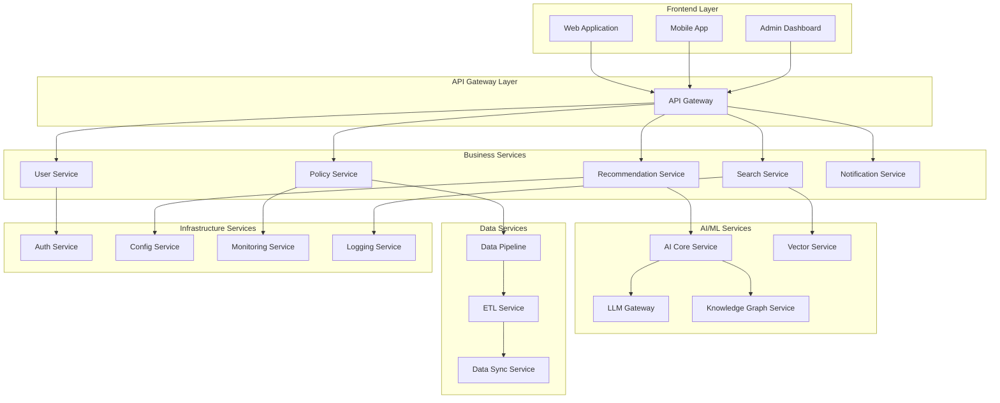

# 이지스(Aegis) Spec 분할 전략 및 관리 방법론

| 항목 | 내용 |
|------|------|
| 문서 ID | AEG-SPC-20250917-1.0 |
| 버전 | 1.0 |
| 최종 수정일 | 2025년 9월 17일 |
| 상태 | 확정 (Finalized) |

## 1. Spec 분할 철학 (Specification Division Philosophy)

### 1.1. 핵심 원칙
- **도메인 기반 분할**: 비즈니스 도메인과 기술 도메인을 명확히 구분
- **독립적 구현**: 각 Spec은 독립적으로 구현 가능해야 함
- **인터페이스 중심**: 서비스 간 인터페이스를 명확히 정의
- **테스트 가능성**: 각 Spec은 독립적으로 테스트 가능해야 함
- **진화 가능성**: 개별 Spec의 변경이 전체 시스템에 미치는 영향 최소화

### 1.2. 분할 기준 (Division Criteria)

#### 기능적 분할 (Functional Division)
```
비즈니스 도메인별 분할:
- 사용자 관리 (User Management)
- 정책 관리 (Policy Management)  
- 추천 엔진 (Recommendation Engine)
- 검색 서비스 (Search Service)
- 알림 서비스 (Notification Service)
```

#### 기술적 분할 (Technical Division)
```
기술 계층별 분할:
- 데이터 파이프라인 (Data Pipeline)
- AI/ML 서비스 (AI/ML Services)
- 인프라 서비스 (Infrastructure Services)
- 보안 서비스 (Security Services)
```

#### 운영적 분할 (Operational Division)
```
운영 관점별 분할:
- 모니터링 (Monitoring)
- 로깅 (Logging)
- 배포 (Deployment)
- 백업/복구 (Backup/Recovery)
```

## 2. 마이크로서비스별 Spec 구조 (Microservice Spec Structure)

### 2.1. 서비스 분할 맵 (Service Division Map)



### 2.2. 각 서비스별 Spec 구성 요소

#### 표준 Spec 템플릿
```
{SERVICE_NAME}/
├── 01_SERVICE_OVERVIEW.md       # 서비스 개요
├── 02_BUSINESS_REQUIREMENTS.md  # 비즈니스 요구사항
├── 03_TECHNICAL_DESIGN.md       # 기술 설계
├── 04_API_SPECIFICATION.md      # API 명세
├── 05_DATA_MODEL.md             # 데이터 모델
├── 06_INTEGRATION_SPECS.md      # 연동 명세
├── 07_DEPLOYMENT_GUIDE.md       # 배포 가이드
├── 08_TESTING_STRATEGY.md       # 테스트 전략
├── 09_MONITORING_SETUP.md       # 모니터링 설정
└── 10_TROUBLESHOOTING.md        # 트러블슈팅 가이드
```

## 3. 핵심 서비스별 Spec 분할 상세

### 3.1. User Service Spec
```
USER_SERVICE/
├── 01_USER_OVERVIEW.md
│   ├── 사용자 라이프사이클 관리
│   ├── 프로필 관리
│   └── 권한 관리
├── 02_USER_REQUIREMENTS.md
│   ├── 회원가입/로그인 요구사항
│   ├── 프로필 관리 요구사항
│   └── 보안 요구사항
├── 03_USER_DESIGN.md
│   ├── 사용자 도메인 모델
│   ├── 인증/인가 아키텍처
│   └── 데이터 보안 설계
├── 04_USER_API.md
│   ├── 인증 API (/auth/*)
│   ├── 사용자 관리 API (/users/*)
│   └── 프로필 API (/profiles/*)
└── ...
```

### 3.2. Policy Service Spec
```
POLICY_SERVICE/
├── 01_POLICY_OVERVIEW.md
│   ├── 정책 데이터 관리
│   ├── 정책 메타데이터 관리
│   └── 정책 버전 관리
├── 02_POLICY_REQUIREMENTS.md
│   ├── 정책 수집 요구사항
│   ├── 정책 분류 요구사항
│   └── 정책 업데이트 요구사항
├── 03_POLICY_DESIGN.md
│   ├── 정책 도메인 모델
│   ├── 정책 분류 체계
│   └── 정책 생명주기 관리
└── ...
```

### 3.3. Recommendation Service Spec
```
RECOMMENDATION_SERVICE/
├── 01_REC_OVERVIEW.md
│   ├── 추천 알고리즘 개요
│   ├── S.C.O.R.E. 프레임워크
│   └── 개인화 전략
├── 02_REC_REQUIREMENTS.md
│   ├── 추천 정확도 요구사항
│   ├── 응답 시간 요구사항
│   └── 설명가능성 요구사항
├── 03_REC_DESIGN.md
│   ├── RAG-KG 하이브리드 설계
│   ├── KMRR 알고리즘 설계
│   └── 실시간 추론 아키텍처
└── ...
```

### 3.4. AI Core Service Spec
```
AI_CORE_SERVICE/
├── 01_AI_OVERVIEW.md
│   ├── Interactive AI Core 개요
│   ├── LLM 추상화 계층
│   └── AI 파이프라인 설계
├── 02_AI_REQUIREMENTS.md
│   ├── AI 성능 요구사항
│   ├── 모델 관리 요구사항
│   └── 실시간 추론 요구사항
├── 03_AI_DESIGN.md
│   ├── AI 아키텍처 설계
│   ├── 모델 서빙 전략
│   └── A/B 테스트 프레임워크
└── ...
```

## 4. 데이터 파이프라인 Spec 분할

### 4.1. Data Pipeline Service Spec
```
DATA_PIPELINE/
├── 01_PIPELINE_OVERVIEW.md
│   ├── 이중 트랙 파이프라인 개요
│   ├── 실시간 vs 배치 처리
│   └── 데이터 품질 관리
├── 02_PIPELINE_REQUIREMENTS.md
│   ├── 데이터 수집 요구사항
│   ├── 데이터 처리 요구사항
│   └── 데이터 일관성 요구사항
├── 03_PIPELINE_DESIGN.md
│   ├── Kafka 이벤트 설계
│   ├── ETL 프로세스 설계
│   └── CDC (Change Data Capture) 설계
├── 04_EVENT_SCHEMA.md
│   ├── Kafka 토픽 설계
│   ├── 이벤트 스키마 정의
│   └── 이벤트 버전 관리
└── ...
```

## 5. 인프라 및 운영 Spec 분할

### 5.1. Infrastructure Specs
```
INFRASTRUCTURE/
├── KUBERNETES/
│   ├── 01_K8S_CLUSTER_DESIGN.md
│   ├── 02_NAMESPACE_STRATEGY.md
│   ├── 03_RESOURCE_MANAGEMENT.md
│   └── 04_SECURITY_POLICIES.md
├── MONITORING/
│   ├── 01_MONITORING_STRATEGY.md
│   ├── 02_METRICS_DEFINITION.md
│   ├── 03_ALERTING_RULES.md
│   └── 04_DASHBOARD_SPECS.md
├── SECURITY/
│   ├── 01_SECURITY_ARCHITECTURE.md
│   ├── 02_AUTHENTICATION_DESIGN.md
│   ├── 03_AUTHORIZATION_POLICIES.md
│   └── 04_COMPLIANCE_REQUIREMENTS.md
└── DEPLOYMENT/
    ├── 01_CI_CD_PIPELINE.md
    ├── 02_DEPLOYMENT_STRATEGY.md
    ├── 03_ROLLBACK_PROCEDURES.md
    └── 04_ENVIRONMENT_MANAGEMENT.md
```

## 6. Spec 간 의존성 관리 (Dependency Management)

### 6.1. 의존성 매트릭스
| 서비스 | User | Policy | Recommendation | Search | AI Core | Data Pipeline |
|--------|------|--------|----------------|--------|---------|---------------|
| **User** | - | ✓ | ✓ | ✓ | - | ✓ |
| **Policy** | - | - | ✓ | ✓ | - | ✓ |
| **Recommendation** | ✓ | ✓ | - | ✓ | ✓ | - |
| **Search** | ✓ | ✓ | - | - | ✓ | - |
| **AI Core** | - | ✓ | ✓ | ✓ | - | - |
| **Data Pipeline** | - | ✓ | - | - | - | - |

### 6.2. 인터페이스 계약 관리
```yaml
# interface-contracts.yml
services:
  user-service:
    provides:
      - user-authentication
      - user-profile-management
    consumes:
      - notification-service
      
  policy-service:
    provides:
      - policy-data-access
      - policy-metadata
    consumes:
      - data-pipeline
      
  recommendation-service:
    provides:
      - policy-recommendations
      - recommendation-explanations
    consumes:
      - user-service
      - policy-service
      - ai-core-service
```

## 7. Spec 작성 및 관리 프로세스

### 7.1. Spec 작성 워크플로우


### 7.2. Spec 품질 기준
#### 필수 요소 체크리스트
- [ ] **명확한 범위 정의**: 서비스의 책임과 경계가 명확함
- [ ] **API 계약 정의**: 모든 외부 인터페이스가 명시됨
- [ ] **데이터 모델 정의**: 입출력 데이터 구조가 명확함
- [ ] **에러 처리 정의**: 예외 상황과 처리 방법이 명시됨
- [ ] **성능 요구사항**: 응답시간, 처리량 등이 정량적으로 정의됨
- [ ] **보안 요구사항**: 인증, 인가, 데이터 보호 방안이 명시됨
- [ ] **모니터링 요구사항**: 메트릭, 로그, 알림 기준이 정의됨
- [ ] **테스트 전략**: 단위/통합/E2E 테스트 방법이 명시됨

### 7.3. Spec 버전 관리 전략
```
버전 관리 규칙:
- Major (X.0.0): 호환성을 깨는 변경
- Minor (X.Y.0): 하위 호환 기능 추가
- Patch (X.Y.Z): 버그 수정 및 문서 개선

예시:
- 1.0.0: 초기 Spec
- 1.1.0: 새로운 API 엔드포인트 추가
- 1.1.1: API 문서 오타 수정
- 2.0.0: API 구조 변경 (Breaking Change)
```

## 8. Spec 구현 및 검증 전략

### 8.1. 구현 우선순위
```
Phase 1: 핵심 비즈니스 서비스
1. User Service
2. Policy Service
3. Recommendation Service

Phase 2: 지원 서비스
4. Search Service
5. Notification Service
6. AI Core Service

Phase 3: 인프라 서비스
7. Data Pipeline
8. Monitoring Service
9. Security Service
```

### 8.2. 검증 방법론
#### Contract Testing
```yaml
# contract-tests.yml
user-service:
  consumer: recommendation-service
  provider: user-service
  interactions:
    - description: "Get user profile"
      request:
        method: GET
        path: /users/{userId}/profile
      response:
        status: 200
        body:
          userId: "string"
          businessInfo: "object"
```

#### Integration Testing
```python
# integration_test_example.py
class TestRecommendationIntegration:
    def test_user_profile_integration(self):
        # Given: 사용자 프로필이 존재함
        user_profile = create_test_user_profile()
        
        # When: 추천 요청
        recommendations = recommendation_service.get_recommendations(
            user_id=user_profile.id,
            query="창업자금 지원"
        )
        
        # Then: 추천 결과 검증
        assert len(recommendations) > 0
        assert all(rec.score > 0.5 for rec in recommendations)
```

## 9. 도구 및 자동화 (Tools & Automation)

### 9.1. Spec 생성 도구
```bash
# spec-generator CLI 도구
./spec-generator create-service \
  --name user-service \
  --type business \
  --dependencies auth-service,notification-service
```

### 9.2. Spec 검증 자동화
```yaml
# .github/workflows/spec-validation.yml
name: Spec Validation
on:
  pull_request:
    paths: ['docs/07_SPECIFICATIONS/**']
jobs:
  validate-specs:
    runs-on: ubuntu-latest
    steps:
      - name: Validate Spec Structure
      - name: Check API Contract Consistency
      - name: Verify Dependencies
      - name: Generate Implementation Checklist
```

---

**📋 관련 문서**
- [프로젝트 구조](./00_PROJECT_STRUCTURE.md)
- [시스템 아키텍처](../01_ARCHITECTURE/01_SYSTEM_OVERVIEW.md)
- [마스터플랜](../04_IMPLEMENTATION/01_MASTERPLAN.md)