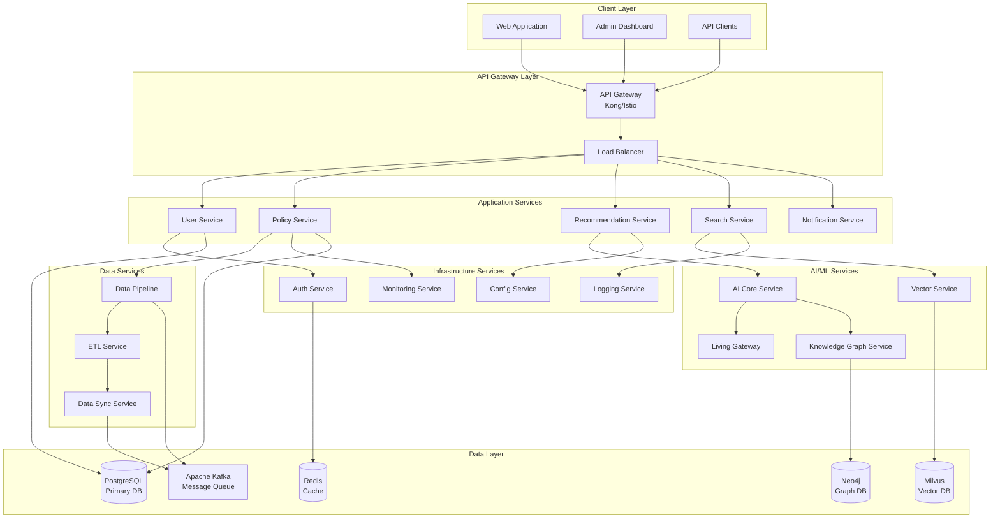
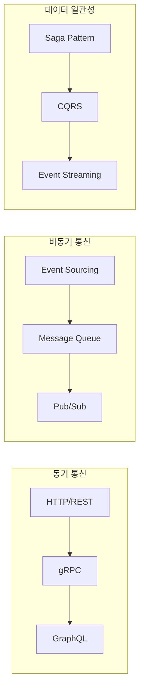
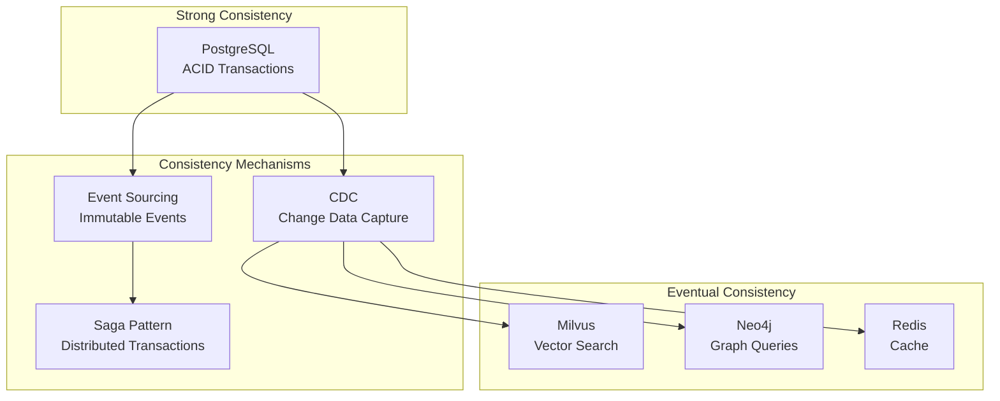
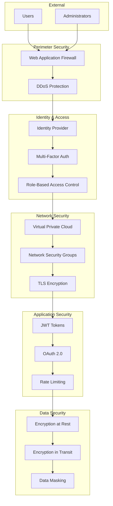

# 이지스(Aegis) 통합 시스템 아키텍처

| 항목 | 내용 |
|------|------|
| 문서 ID | AEG-ARC-20250917-2.0 |
| 버전 | 2.0 |
| 최종 수정일 | 2025년 9월 17일 |
| 작성자 | Dr. Aiden (수석 AI 시스템 아키텍트) |
| 검토자 | 시스템 아키텍처 위원회 |
| 승인자 | CTO |
| 상태 | 확정 (Finalized) |

## 1. 개요 (Overview)

본 문서는 이지스(Aegis) 프로젝트의 통합 시스템 아키텍처를 정의한다. **클라우드 네이티브** 원칙을 기반으로 한 **마이크로서비스 아키텍처**를 채택하며, **이중 트랙 파이프라인**, **Interactive AI Core**, **Living Gateway**, **Rules as Data** 등 4대 핵심 원칙을 구현하는 기술적 청사진을 제시한다.

### 1.1. 아키텍처 설계 원칙
- **확장성 (Scalability)**: 수평적 확장이 가능한 마이크로서비스 구조
- **가용성 (Availability)**: 99.9% 이상의 서비스 가용성 보장
- **일관성 (Consistency)**: 이중 트랙 파이프라인을 통한 데이터 일관성
- **관찰가능성 (Observability)**: 모든 시스템 동작의 추적 및 모니터링
- **보안성 (Security)**: Zero Trust 원칙 기반 보안 아키텍처

### 1.2. 아키텍처 품질 속성
| 품질 속성 | 목표 | 측정 방법 |
|-----------|------|-----------|
| **성능** | 응답시간 < 3초 | API 응답시간 모니터링 |
| **처리량** | 1,000 RPS | 부하 테스트 |
| **가용성** | 99.9% | 업타임 모니터링 |
| **확장성** | 10배 확장 가능 | 오토스케일링 테스트 |
| **보안** | OWASP Top 10 준수 | 보안 스캔 |

## 2. 시스템 아키텍처 개요

### 2.1. 고수준 아키텍처 다이어그램



### 2.2. 계층별 아키텍처 구조

#### 2.2.1. 프레젠테이션 계층 (Presentation Layer)
```
┌─────────────────────────────────────────────────────────────┐
│                    Client Applications                       │
├─────────────────────────────────────────────────────────────┤
│ • React Web Application (사용자 인터페이스)                    │
│ • Admin Dashboard (관리자 도구)                              │
│ • Mobile Web App (모바일 최적화)                             │
│ • API Documentation (Swagger UI)                           │
└─────────────────────────────────────────────────────────────┘
```

#### 2.2.2. API 게이트웨이 계층 (API Gateway Layer)
```
┌─────────────────────────────────────────────────────────────┐
│                     API Gateway                             │
├─────────────────────────────────────────────────────────────┤
│ • Request Routing (요청 라우팅)                              │
│ • Authentication & Authorization (인증/인가)                 │
│ • Rate Limiting (속도 제한)                                 │
│ • Request/Response Transformation (요청/응답 변환)           │
│ • Circuit Breaker (회로 차단기)                             │
│ • API Versioning (API 버전 관리)                            │
└─────────────────────────────────────────────────────────────┘
```

#### 2.2.3. 비즈니스 서비스 계층 (Business Services Layer)
```
┌─────────────────────────────────────────────────────────────┐
│                  Business Services                          │
├─────────────────────────────────────────────────────────────┤
│ ┌─────────────┐ ┌─────────────┐ ┌─────────────┐ ┌─────────────┐ │
│ │User Service │ │Policy Svc   │ │Recommend Svc│ │Search Svc   │ │
│ │             │ │             │ │             │ │             │ │
│ │• Profile    │ │• CRUD       │ │• AI Engine  │ │• Vector     │ │
│ │• Auth       │ │• Metadata   │ │• S.C.O.R.E  │ │• Filtering  │ │
│ │• Preferences│ │• Validation │ │• Explanation│ │• Ranking    │ │
│ └─────────────┘ └─────────────┘ └─────────────┘ └─────────────┘ │
└─────────────────────────────────────────────────────────────┘
```#### 2.
2.4. AI/ML 서비스 계층 (AI/ML Services Layer)
```
┌─────────────────────────────────────────────────────────────┐
│                    AI/ML Services                           │
├─────────────────────────────────────────────────────────────┤
│ ┌─────────────┐ ┌─────────────┐ ┌─────────────┐ ┌─────────────┐ │
│ │AI Core Svc  │ │Living GW    │ │Vector Svc   │ │KG Service   │ │
│ │             │ │             │ │             │ │             │ │
│ │• KMRR Algo  │ │• Multi-LLM  │ │• Embeddings │ │• Graph Query│ │
│ │• RAG-KG     │ │• Failover   │ │• Similarity │ │• Reasoning  │ │
│ │• Inference  │ │• Routing    │ │• Indexing   │ │• Rules      │ │
│ └─────────────┘ └─────────────┘ └─────────────┘ └─────────────┘ │
└─────────────────────────────────────────────────────────────┘
```

#### 2.2.5. 데이터 서비스 계층 (Data Services Layer)
```
┌─────────────────────────────────────────────────────────────┐
│                   Data Services                             │
├─────────────────────────────────────────────────────────────┤
│ ┌─────────────┐ ┌─────────────┐ ┌─────────────┐ ┌─────────────┐ │
│ │Data Pipeline│ │ETL Service  │ │Sync Service │ │Backup Svc   │ │
│ │             │ │             │ │             │ │             │ │
│ │• Hot Path   │ │• Transform  │ │• CDC        │ │• Automated  │ │
│ │• Cold Path  │ │• Validate   │ │• Event Pub  │ │• Versioned  │ │
│ │• Orchestrate│ │• Load       │ │• Consistency│ │• Encrypted  │ │
│ └─────────────┘ └─────────────┘ └─────────────┘ └─────────────┘ │
└─────────────────────────────────────────────────────────────┘
```

#### 2.2.6. 데이터 저장 계층 (Data Storage Layer)
```
┌─────────────────────────────────────────────────────────────┐
│                   Data Storage                              │
├─────────────────────────────────────────────────────────────┤
│ ┌─────────────┐ ┌─────────────┐ ┌─────────────┐ ┌─────────────┐ │
│ │PostgreSQL   │ │Milvus       │ │Neo4j        │ │Redis        │ │
│ │             │ │             │ │             │ │             │ │
│ │• ACID       │ │• Vector     │ │• Graph      │ │• Cache      │ │
│ │• Relations  │ │• Similarity │ │• Traversal  │ │• Session    │ │
│ │• SSoT       │ │• Indexing   │ │• Cypher     │ │• Pub/Sub    │ │
│ └─────────────┘ └─────────────┘ └─────────────┘ └─────────────┘ │
│                                                                 │
│ ┌─────────────────────────────────────────────────────────────┐ │
│ │                Apache Kafka                                 │ │
│ │ • Event Streaming • Message Queue • Data Pipeline          │ │
│ └─────────────────────────────────────────────────────────────┘ │
└─────────────────────────────────────────────────────────────┘
```

## 3. 핵심 아키텍처 패턴

### 3.1. 마이크로서비스 아키텍처 패턴

#### 3.1.1. 서비스 분해 전략
- **비즈니스 도메인 기반**: 각 서비스는 특정 비즈니스 도메인을 담당
- **데이터 소유권**: 각 서비스는 자신의 데이터를 완전히 소유
- **독립적 배포**: 서비스별 독립적인 배포 및 확장
- **기술 다양성**: 서비스별 최적의 기술 스택 선택

#### 3.1.2. 서비스 간 통신 패턴


### 3.2. 이벤트 기반 아키텍처 패턴

#### 3.2.1. 이벤트 소싱 (Event Sourcing)
```python
# 이벤트 소싱 예시
class PolicyEvent:
    def __init__(self, event_type, policy_id, data, timestamp):
        self.event_type = event_type
        self.policy_id = policy_id
        self.data = data
        self.timestamp = timestamp

class PolicyAggregate:
    def __init__(self):
        self.events = []
        self.state = {}
    
    def apply_event(self, event):
        if event.event_type == "PolicyCreated":
            self.state = event.data
        elif event.event_type == "PolicyUpdated":
            self.state.update(event.data)
        
        self.events.append(event)
```

#### 3.2.2. CQRS (Command Query Responsibility Segregation)
```
┌─────────────────────────────────────────────────────────────┐
│                        CQRS Pattern                         │
├─────────────────────────────────────────────────────────────┤
│                                                             │
│  ┌─────────────┐    Commands    ┌─────────────────────────┐  │
│  │   Client    │ ──────────────> │    Command Handler     │  │
│  │             │                 │                        │  │
│  │             │                 │ • Validate             │  │
│  │             │                 │ • Process              │  │
│  │             │                 │ • Emit Events          │  │
│  │             │                 └─────────────────────────┘  │
│  │             │                              │               │
│  │             │                              │ Events        │
│  │             │                              ▼               │
│  │             │                 ┌─────────────────────────┐  │
│  │             │                 │    Event Store          │  │
│  │             │                 │                        │  │
│  │             │                 │ • Append Only          │  │
│  │             │                 │ • Immutable            │  │
│  │             │                 │ • Audit Trail          │  │
│  │             │                 └─────────────────────────┘  │
│  │             │                              │               │
│  │             │                              │ Events        │
│  │             │                              ▼               │
│  │             │     Queries     ┌─────────────────────────┐  │
│  │             │ <────────────── │    Query Handler       │  │
│  └─────────────┘                 │                        │  │
│                                  │ • Read Models          │  │
│                                  │ • Projections          │  │
│                                  │ • Optimized Views      │  │
│                                  └─────────────────────────┘  │
└─────────────────────────────────────────────────────────────┘
```

### 3.3. 데이터 아키텍처 패턴

#### 3.3.1. Polyglot Persistence
각 데이터의 특성에 맞는 최적의 데이터베이스 선택:

| 데이터 타입 | 데이터베이스 | 사용 목적 | 특징 |
|-------------|--------------|-----------|------|
| **관계형 데이터** | PostgreSQL | 트랜잭션, 일관성 | ACID, 복잡한 쿼리 |
| **벡터 데이터** | Milvus | 유사도 검색 | 고성능 벡터 인덱싱 |
| **그래프 데이터** | Neo4j | 관계 추론 | 그래프 순회, 패턴 매칭 |
| **캐시 데이터** | Redis | 고속 액세스 | 인메모리, 다양한 자료구조 |
| **스트림 데이터** | Kafka | 이벤트 처리 | 높은 처리량, 내구성 |

#### 3.3.2. 데이터 일관성 전략


## 4. 기술 스택 상세

### 4.1. 프로그래밍 언어 및 프레임워크

#### 4.1.1. 백엔드 서비스
```yaml
Primary Language: Python 3.11+
Framework: FastAPI
Async Support: asyncio, aiohttp
Validation: Pydantic
ORM: SQLAlchemy 2.0 (async)
Testing: pytest, pytest-asyncio
```

**선정 사유:**
- **비동기 처리**: LLM API 호출 등 I/O 집약적 작업에 최적화
- **타입 안전성**: Pydantic을 통한 런타임 타입 검증
- **개발 생산성**: 자동 API 문서 생성, 빠른 개발 사이클
- **생태계**: 풍부한 AI/ML 라이브러리 지원

#### 4.1.2. 프론트엔드
```yaml
Framework: React 18+
Language: TypeScript
State Management: Zustand
Styling: Tailwind CSS
Build Tool: Vite
Testing: Vitest, React Testing Library
```

### 4.2. 데이터베이스 및 저장소

#### 4.2.1. 주 데이터베이스 (PostgreSQL)
```yaml
Version: PostgreSQL 15+
Extensions:
  - pg_vector: 벡터 연산 지원
  - pg_stat_statements: 쿼리 성능 모니터링
  - pg_cron: 스케줄링
Configuration:
  - Connection Pooling: PgBouncer
  - Replication: Streaming Replication
  - Backup: pg_dump + WAL-E
```

#### 4.2.2. 벡터 데이터베이스 (Milvus)
```yaml
Version: Milvus 2.3+
Index Types:
  - HNSW: 고성능 근사 검색
  - IVF_FLAT: 정확한 검색
  - IVF_PQ: 메모리 효율적 검색
Storage: MinIO (S3 호환)
Monitoring: Prometheus + Grafana
```

#### 4.2.3. 그래프 데이터베이스 (Neo4j)
```yaml
Version: Neo4j 5.0+
Edition: Community/Enterprise
Clustering: Causal Clustering
Backup: Neo4j Admin Backup
Monitoring: Neo4j Browser + Prometheus
```

### 4.3. 메시징 및 스트리밍

#### 4.3.1. Apache Kafka
```yaml
Version: Kafka 3.5+
Cluster Setup:
  - Brokers: 3+ nodes
  - Replication Factor: 3
  - Min In-Sync Replicas: 2
Components:
  - Zookeeper: Cluster coordination
  - Schema Registry: Avro schema management
  - Kafka Connect: Data integration
  - Kafka Streams: Stream processing
```

### 4.4. 컨테이너 및 오케스트레이션

#### 4.4.1. Kubernetes
```yaml
Version: Kubernetes 1.28+
Distribution: 
  - Cloud: EKS/GKE/AKS
  - On-premise: kubeadm
Networking: Calico/Flannel
Storage: CSI drivers
Service Mesh: Istio (optional)
```

#### 4.4.2. Docker
```yaml
Base Images:
  - Python: python:3.11-slim
  - Node.js: node:18-alpine
  - PostgreSQL: postgres:15
  - Redis: redis:7-alpine
Security:
  - Non-root user
  - Multi-stage builds
  - Vulnerability scanning
```

## 5. 보안 아키텍처

### 5.1. Zero Trust 보안 모델


### 5.2. 보안 제어 계층
| 계층 | 보안 제어 | 구현 방법 |
|------|-----------|-----------|
| **네트워크** | 방화벽, VPC, NSG | AWS Security Groups, NACLs |
| **애플리케이션** | 인증, 인가, 입력 검증 | JWT, OAuth 2.0, Input Validation |
| **데이터** | 암호화, 마스킹, 백업 | AES-256, Field-level encryption |
| **인프라** | 컨테이너 보안, 시크릿 관리 | Kubernetes RBAC, Vault |
| **모니터링** | 로깅, 감사, 알림 | ELK Stack, SIEM |

---

**📋 관련 문서**
- [마이크로서비스 설계](./02_MICROSERVICES_DESIGN.md)
- [데이터 아키텍처](./03_DATA_ARCHITECTURE.md)
- [보안 아키텍처](./04_SECURITY_ARCHITECTURE.md)
- [프로젝트 헌장](../00_FOUNDATION/00_CHARTER.md)