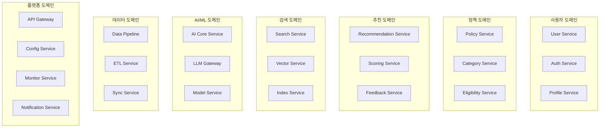

# 이지스(Aegis) 마이크로서비스 아키텍처 설계

| 항목 | 내용 |
|------|------|
| 문서 ID | AEG-ARC-20250917-2.0 |
| 버전 | 2.0 |
| 최종 수정일 | 2025년 9월 17일 |
| 상태 | 확정 (Finalized) |

## 1. 마이크로서비스 아키텍처 개요

### 1.1. 설계 철학
- **도메인 주도 설계(DDD)**: 비즈니스 도메인을 중심으로 서비스 경계 설정
- **단일 책임 원칙**: 각 서비스는 하나의 비즈니스 기능에 집중
- **데이터 소유권**: 각 서비스는 자신의 데이터를 완전히 소유하고 관리
- **느슨한 결합**: 서비스 간 의존성을 최소화하고 이벤트 기반 통신 활용
- **높은 응집도**: 관련된 기능들을 하나의 서비스로 그룹화

### 1.2. 서비스 분해 전략

#### 비즈니스 능력 기반 분해 (Business Capability Decomposition)


## 2. 핵심 마이크로서비스 상세 설계

### 2.1. User Service (사용자 서비스)

#### 책임 (Responsibilities)
- 사용자 계정 관리 (CRUD)
- 사용자 프로필 관리
- 사용자 선호도 관리
- 사용자 활동 이력 추적

#### 기술 스택
```yaml
Runtime: Python 3.11 + FastAPI
Database: PostgreSQL (Primary), Redis (Cache)
Message Queue: Kafka Producer/Consumer
Monitoring: Prometheus + Grafana
```

#### API 엔드포인트
```
POST   /users                    # 사용자 생성
GET    /users/{userId}           # 사용자 조회
PUT    /users/{userId}           # 사용자 수정
DELETE /users/{userId}           # 사용자 삭제
GET    /users/{userId}/profile   # 프로필 조회
PUT    /users/{userId}/profile   # 프로필 수정
GET    /users/{userId}/preferences # 선호도 조회
```

#### 이벤트 발행
```yaml
Events Published:
  - user.created
  - user.updated
  - user.deleted
  - profile.updated
  - preferences.changed
```

### 2.2. Policy Service (정책 서비스)

#### 책임 (Responsibilities)
- 정책 데이터 관리
- 정책 메타데이터 관리
- 정책 분류 및 태깅
- 정책 생명주기 관리

#### 기술 스택
```yaml
Runtime: Python 3.11 + FastAPI
Database: PostgreSQL (Primary), Neo4j (Graph)
Message Queue: Kafka Producer/Consumer
Search Engine: Elasticsearch
```

#### API 엔드포인트
```
GET    /policies                 # 정책 목록 조회
GET    /policies/{policyId}      # 정책 상세 조회
POST   /policies                 # 정책 생성
PUT    /policies/{policyId}      # 정책 수정
DELETE /policies/{policyId}      # 정책 삭제
GET    /policies/search          # 정책 검색
GET    /policies/categories      # 정책 카테고리 조회
```

#### 이벤트 발행/구독
```yaml
Events Published:
  - policy.created
  - policy.updated
  - policy.deleted
  - policy.categorized

Events Consumed:
  - data.policy.ingested
  - data.policy.validated
```

### 2.3. Recommendation Service (추천 서비스)

#### 책임 (Responsibilities)
- 개인화 추천 생성
- 추천 알고리즘 실행
- 추천 결과 랭킹
- 추천 근거 생성 (S.C.O.R.E.)

#### 기술 스택
```yaml
Runtime: Python 3.11 + FastAPI
Database: Redis (Cache), PostgreSQL (Results)
AI/ML: Custom RAG-KG Engine
Message Queue: Kafka Consumer
Vector DB: Milvus
```

#### API 엔드포인트
```
POST   /recommendations          # 추천 요청
GET    /recommendations/{recId}  # 추천 결과 조회
POST   /recommendations/batch    # 배치 추천
GET    /recommendations/explain/{recId} # 추천 근거 설명
POST   /recommendations/feedback # 피드백 제출
```

#### 이벤트 구독
```yaml
Events Consumed:
  - user.profile.updated
  - policy.updated
  - feedback.submitted
  - ai.model.updated
```

### 2.4. AI Core Service (AI 핵심 서비스)

#### 책임 (Responsibilities)
- RAG-KG 하이브리드 엔진 실행
- KMRR 알고리즘 처리
- LLM 요청 처리 및 응답 관리
- AI 모델 버전 관리

#### 기술 스택
```yaml
Runtime: Python 3.11 + FastAPI
AI Framework: LangChain, Transformers
Vector DB: Milvus
Graph DB: Neo4j
LLM: OpenAI GPT-4, Claude, Local Models
```

#### API 엔드포인트
```
POST   /ai/query                 # AI 쿼리 처리
POST   /ai/embed                 # 텍스트 임베딩 생성
POST   /ai/reasoning             # 논리적 추론 실행
GET    /ai/models                # 사용 가능한 모델 목록
POST   /ai/models/switch         # 모델 전환
```

### 2.5. Data Pipeline Service (데이터 파이프라인 서비스)

#### 책임 (Responsibilities)
- 외부 데이터 수집
- 데이터 정제 및 변환
- 실시간 데이터 스트리밍
- 데이터 품질 검증

#### 기술 스택
```yaml
Runtime: Python 3.11 + Apache Airflow
Message Queue: Apache Kafka
Stream Processing: Kafka Streams
Database: PostgreSQL, Neo4j, Milvus
```

#### 주요 파이프라인
```yaml
Pipelines:
  - government_api_ingestion    # 정부 API 데이터 수집
  - web_scraping_pipeline      # 웹 크롤링 파이프라인
  - data_validation_pipeline   # 데이터 검증 파이프라인
  - vector_embedding_pipeline  # 벡터 임베딩 생성
  - knowledge_graph_update     # 지식 그래프 업데이트
```

## 3. 서비스 간 통신 패턴

### 3.1. 동기 통신 (Synchronous Communication)

#### REST API 호출
```python
# 예시: Recommendation Service → User Service
async def get_user_profile(user_id: str) -> UserProfile:
    async with httpx.AsyncClient() as client:
        response = await client.get(
            f"{USER_SERVICE_URL}/users/{user_id}/profile",
            headers={"Authorization": f"Bearer {jwt_token}"}
        )
        return UserProfile.parse_obj(response.json())
```

#### gRPC 호출 (고성능 요구 시)
```python
# 예시: AI Core Service 내부 통신
import grpc
from ai_core_pb2_grpc import EmbeddingServiceStub

async def generate_embedding(text: str) -> List[float]:
    async with grpc.aio.insecure_channel('embedding-service:50051') as channel:
        stub = EmbeddingServiceStub(channel)
        response = await stub.GenerateEmbedding(
            EmbeddingRequest(text=text)
        )
        return response.embedding
```

### 3.2. 비동기 통신 (Asynchronous Communication)

#### 이벤트 기반 통신 (Kafka)
```python
# 이벤트 발행
class UserService:
    async def update_profile(self, user_id: str, profile: UserProfile):
        # 프로필 업데이트
        await self.repository.update_profile(user_id, profile)
        
        # 이벤트 발행
        event = UserProfileUpdatedEvent(
            user_id=user_id,
            profile=profile,
            timestamp=datetime.utcnow()
        )
        await self.event_publisher.publish("user.profile.updated", event)

# 이벤트 구독
class RecommendationService:
    @event_handler("user.profile.updated")
    async def handle_profile_updated(self, event: UserProfileUpdatedEvent):
        # 사용자 프로필 변경 시 추천 캐시 무효화
        await self.cache.invalidate_user_recommendations(event.user_id)
        
        # 새로운 추천 생성 (비동기)
        await self.generate_recommendations_async(event.user_id)
```

## 4. 데이터 관리 전략

### 4.1. Database per Service 패턴

#### 서비스별 데이터베이스 할당
```yaml
Services:
  user-service:
    primary: postgresql-user-db
    cache: redis-user-cache
    
  policy-service:
    primary: postgresql-policy-db
    graph: neo4j-policy-graph
    search: elasticsearch-policy-index
    
  recommendation-service:
    cache: redis-recommendation-cache
    results: postgresql-recommendation-db
    
  ai-core-service:
    vector: milvus-embeddings
    graph: neo4j-knowledge-graph
```

### 4.2. 데이터 일관성 관리

#### Saga 패턴 구현
```python
class RecommendationSaga:
    def __init__(self):
        self.steps = [
            self.validate_user,
            self.fetch_policies,
            self.generate_recommendations,
            self.store_results,
            self.send_notification
        ]
    
    async def execute(self, request: RecommendationRequest):
        compensation_actions = []
        
        try:
            for step in self.steps:
                result = await step(request)
                compensation_actions.append(step.compensate)
                
        except Exception as e:
            # 보상 트랜잭션 실행
            for compensate in reversed(compensation_actions):
                await compensate(request)
            raise
```

## 5. 서비스 디스커버리 및 로드 밸런싱

### 5.1. Kubernetes Service Discovery
```yaml
# user-service.yaml
apiVersion: v1
kind: Service
metadata:
  name: user-service
  labels:
    app: user-service
spec:
  selector:
    app: user-service
  ports:
    - port: 80
      targetPort: 8000
  type: ClusterIP
```

### 5.2. Istio Service Mesh
```yaml
# virtual-service.yaml
apiVersion: networking.istio.io/v1beta1
kind: VirtualService
metadata:
  name: user-service
spec:
  hosts:
    - user-service
  http:
    - match:
        - uri:
            prefix: "/users"
      route:
        - destination:
            host: user-service
            subset: v1
          weight: 90
        - destination:
            host: user-service
            subset: v2
          weight: 10  # Canary deployment
```

## 6. 보안 및 인증

### 6.1. JWT 기반 인증
```python
# API Gateway에서 JWT 검증
class JWTMiddleware:
    async def __call__(self, request: Request, call_next):
        token = request.headers.get("Authorization", "").replace("Bearer ", "")
        
        try:
            payload = jwt.decode(token, SECRET_KEY, algorithms=["HS256"])
            request.state.user_id = payload["user_id"]
            request.state.permissions = payload["permissions"]
            
        except jwt.InvalidTokenError:
            return JSONResponse(
                status_code=401,
                content={"error": "Invalid token"}
            )
        
        return await call_next(request)
```

### 6.2. 서비스 간 mTLS
```yaml
# istio-policy.yaml
apiVersion: security.istio.io/v1beta1
kind: PeerAuthentication
metadata:
  name: default
spec:
  mtls:
    mode: STRICT  # 모든 서비스 간 통신에 mTLS 강제
```

## 7. 모니터링 및 관찰가능성

### 7.1. 분산 추적 (Distributed Tracing)
```python
from opentelemetry import trace
from opentelemetry.exporter.jaeger.thrift import JaegerExporter

tracer = trace.get_tracer(__name__)

class RecommendationService:
    async def generate_recommendations(self, user_id: str):
        with tracer.start_as_current_span("generate_recommendations") as span:
            span.set_attribute("user_id", user_id)
            
            # User Service 호출
            with tracer.start_as_current_span("fetch_user_profile"):
                profile = await self.user_service.get_profile(user_id)
            
            # AI Core Service 호출
            with tracer.start_as_current_span("ai_inference"):
                recommendations = await self.ai_service.infer(profile)
            
            return recommendations
```

### 7.2. 메트릭 수집
```python
from prometheus_client import Counter, Histogram, Gauge

# 비즈니스 메트릭
recommendation_requests = Counter(
    'recommendation_requests_total',
    'Total recommendation requests',
    ['service', 'endpoint']
)

recommendation_latency = Histogram(
    'recommendation_duration_seconds',
    'Recommendation generation time'
)

active_users = Gauge(
    'active_users_total',
    'Number of active users'
)
```

## 8. 배포 및 운영

### 8.1. CI/CD 파이프라인
```yaml
# .gitlab-ci.yml
stages:
  - test
  - build
  - deploy

test:
  stage: test
  script:
    - pytest tests/
    - coverage report

build:
  stage: build
  script:
    - docker build -t $CI_REGISTRY_IMAGE:$CI_COMMIT_SHA .
    - docker push $CI_REGISTRY_IMAGE:$CI_COMMIT_SHA

deploy:
  stage: deploy
  script:
    - helm upgrade --install user-service ./helm/user-service
      --set image.tag=$CI_COMMIT_SHA
```

### 8.2. Blue-Green 배포
```yaml
# argocd-application.yaml
apiVersion: argoproj.io/v1alpha1
kind: Application
metadata:
  name: user-service
spec:
  source:
    repoURL: https://gitlab.com/aegis/user-service
    path: helm/
    targetRevision: HEAD
  destination:
    server: https://kubernetes.default.svc
    namespace: aegis-prod
  syncPolicy:
    automated:
      prune: true
      selfHeal: true
```

---

**📋 관련 문서**
- [시스템 개요](./01_SYSTEM_OVERVIEW.md)
- [데이터 아키텍처](./03_DATA_ARCHITECTURE.md)
- [보안 아키텍처](./04_SECURITY_ARCHITECTURE.md)
- [구현 가이드](../04_IMPLEMENTATION/02_IMPLEMENTATION_GUIDE.md)