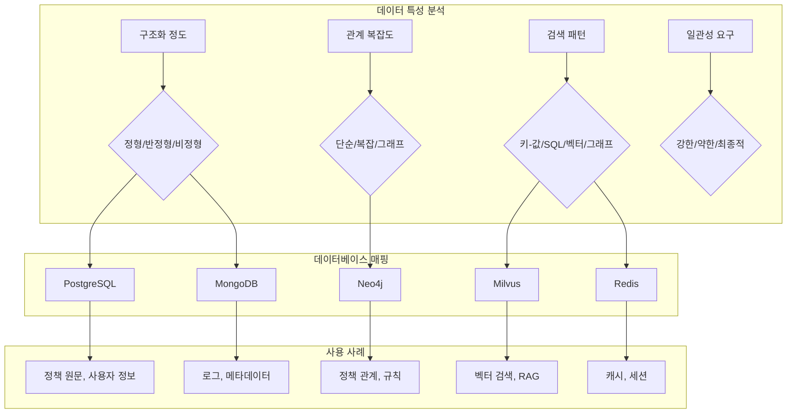
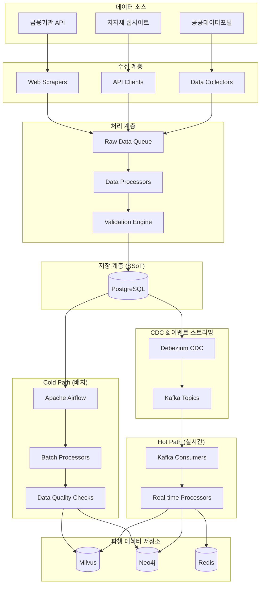

# 이지스(Aegis) 데이터 아키텍처 명세서

| 항목 | 내용 |
|------|------|
| 문서 ID | AEG-ARC-20250917-1.0 |
| 버전 | 1.0 |
| 최종 수정일 | 2025년 9월 17일 |
| 작성자 | Dr. Aiden (수석 AI 시스템 아키텍트) |
| 상태 | 확정 (Finalized) |

## 1. 개요 (Overview)

본 문서는 이지스 시스템의 데이터 아키텍처를 정의한다. **Polyglot Persistence** 패턴을 기반으로 각 데이터의 특성에 최적화된 데이터베이스를 사용하며, **이중 트랙 파이프라인**을 통해 데이터 일관성과 실시간성을 모두 보장하는 아키텍처를 구현한다.

## 2. 데이터 아키텍처 원칙

### 2.1. 핵심 원칙
- **단일 진실 공급원 (Single Source of Truth)**: PostgreSQL이 모든 데이터의 최종 권위
- **데이터 특성별 최적화**: 각 데이터 타입에 최적화된 저장소 사용
- **최종적 일관성 (Eventual Consistency)**: 실시간성과 일관성의 균형
- **이벤트 기반 동기화**: CDC와 이벤트 스트리밍을 통한 데이터 전파

### 2.2. 데이터 분류 체계

#### 마스터 데이터 (Master Data)
- **정책 원문 데이터**: 정부/지자체에서 수집한 원본 정책 정보
- **사용자 프로필**: 개인화를 위한 사용자 기본 정보
- **조직 정보**: 정책 발행 기관 및 관련 조직 데이터

#### 파생 데이터 (Derived Data)
- **벡터 임베딩**: 정책 텍스트의 의미적 표현
- **지식 그래프**: 정책 간 관계 및 규칙
- **집계 데이터**: 통계 및 분석을 위한 요약 데이터

#### 운영 데이터 (Operational Data)
- **추천 이력**: 사용자별 추천 결과 및 피드백
- **세션 데이터**: 사용자 세션 및 임시 상태
- **로그 데이터**: 시스템 운영 및 감사를 위한 로그

## 3. 데이터베이스 아키텍처

### 3.1. 데이터베이스 선택 기준



### 3.2. 데이터베이스별 역할 정의

#### PostgreSQL (Primary Database)
```sql
-- 역할: 시스템의 단일 진실 공급원 (SSoT)
-- 특징: ACID 트랜잭션, 강한 일관성, 복잡한 쿼리 지원

-- 주요 테이블
- policies: 정책 원문 및 메타데이터
- users: 사용자 계정 및 프로필
- organizations: 정책 발행 기관
- business_rules: 동적 비즈니스 규칙
- recommendation_history: 추천 이력
- data_ingestion_status: 데이터 처리 상태 추적
```

#### Milvus (Vector Database)
```python
# 역할: 대규모 벡터 유사도 검색
# 특징: 고성능 벡터 인덱싱, 필터링 지원

# 주요 컬렉션
collections = {
    "policy_embeddings": {
        "dimension": 768,  # sentence-transformers 임베딩
        "index_type": "HNSW",
        "metric_type": "L2"
    },
    "user_query_embeddings": {
        "dimension": 768,
        "index_type": "IVF_FLAT",
        "metric_type": "COSINE"
    }
}
```

#### Neo4j (Graph Database)
```cypher
// 역할: 복잡한 관계 모델링 및 논리적 추론
// 특징: 그래프 순회, 패턴 매칭, 추론 엔진

// 주요 노드 타입
(:Policy)-[:TARGETS]->(:Region)
(:Policy)-[:REQUIRES]->(:Eligibility)
(:Policy)-[:CONFLICTS_WITH]->(:Policy)
(:User)-[:BELONGS_TO]->(:BusinessType)
(:BusinessType)-[:ELIGIBLE_FOR]->(:Policy)
```

#### Redis (In-Memory Cache)
```redis
# 역할: 고성능 캐싱 및 세션 관리
# 특징: 메모리 기반, 다양한 데이터 구조 지원

# 주요 키 패턴
aegis:cache:policy:{policy_id}     # 정책 상세 캐시
aegis:session:{session_id}         # 사용자 세션
aegis:search:{query_hash}          # 검색 결과 캐시
aegis:user:profile:{user_id}       # 사용자 프로필 캐시
```

## 4. 데이터 흐름 아키텍처

### 4.1. 이중 트랙 데이터 파이프라인



### 4.2. 데이터 동기화 전략

#### CDC (Change Data Capture) 설정
```yaml
# debezium-connector-config.yml
name: "aegis-postgres-connector"
config:
  connector.class: "io.debezium.connector.postgresql.PostgresConnector"
  database.hostname: "postgres-primary"
  database.port: "5432"
  database.user: "debezium"
  database.password: "${DEBEZIUM_PASSWORD}"
  database.dbname: "aegis"
  database.server.name: "aegis-db"
  
  # 추적할 테이블 지정
  table.include.list: "public.policies,public.users,public.business_rules"
  
  # 이벤트 형식 설정
  transforms: "unwrap"
  transforms.unwrap.type: "io.debezium.transforms.ExtractNewRecordState"
  transforms.unwrap.drop.tombstones: "false"
  
  # Kafka 토픽 설정
  topic.prefix: "aegis"
```

#### 이벤트 스키마 정의
```json
{
  "schema": {
    "type": "struct",
    "fields": [
      {"field": "before", "type": "struct", "optional": true},
      {"field": "after", "type": "struct", "optional": true},
      {"field": "source", "type": "struct"},
      {"field": "op", "type": "string"},
      {"field": "ts_ms", "type": "int64"}
    ]
  },
  "payload": {
    "before": null,
    "after": {
      "policy_id": "uuid-string",
      "title": "정책명",
      "content": "정책 내용",
      "metadata": {"category": "창업지원"}
    },
    "source": {
      "version": "1.9.0",
      "connector": "postgresql",
      "name": "aegis-db",
      "ts_ms": 1663405368000,
      "snapshot": "false",
      "db": "aegis",
      "schema": "public",
      "table": "policies"
    },
    "op": "c",
    "ts_ms": 1663405368000
  }
}
```

## 5. 데이터 모델링 전략

### 5.1. 정규화 vs 비정규화 전략

#### PostgreSQL: 정규화 우선
```sql
-- 정규화된 구조로 데이터 무결성 보장
CREATE TABLE policies (
    policy_id UUID PRIMARY KEY,
    title VARCHAR(512) NOT NULL,
    issuing_organization_id UUID REFERENCES organizations(org_id),
    content TEXT NOT NULL,
    created_at TIMESTAMPTZ DEFAULT NOW()
);

CREATE TABLE policy_regions (
    policy_id UUID REFERENCES policies(policy_id),
    region_code VARCHAR(10) REFERENCES regions(code),
    PRIMARY KEY (policy_id, region_code)
);
```

#### Milvus: 비정규화된 메타데이터
```python
# 검색 성능을 위한 비정규화
policy_collection_schema = [
    FieldSchema(name="policy_id", dtype=DataType.VARCHAR, max_length=36),
    FieldSchema(name="embedding", dtype=DataType.FLOAT_VECTOR, dim=768),
    
    # 필터링을 위한 비정규화된 메타데이터
    FieldSchema(name="region_codes", dtype=DataType.VARCHAR, max_length=500),
    FieldSchema(name="industry_codes", dtype=DataType.VARCHAR, max_length=500),
    FieldSchema(name="business_types", dtype=DataType.VARCHAR, max_length=200),
    FieldSchema(name="funding_amount_min", dtype=DataType.INT64),
    FieldSchema(name="funding_amount_max", dtype=DataType.INT64),
]
```

### 5.2. 데이터 버전 관리

#### 스키마 진화 전략
```sql
-- 스키마 버전 관리 테이블
CREATE TABLE schema_versions (
    version VARCHAR(20) PRIMARY KEY,
    description TEXT NOT NULL,
    applied_at TIMESTAMPTZ DEFAULT NOW(),
    rollback_script TEXT
);

-- 데이터 버전 관리
CREATE TABLE policy_versions (
    policy_id UUID,
    version_number INTEGER,
    content JSONB NOT NULL,
    created_at TIMESTAMPTZ DEFAULT NOW(),
    created_by VARCHAR(255),
    PRIMARY KEY (policy_id, version_number)
);
```

#### 호환성 보장 전략
```python
class SchemaEvolution:
    """스키마 진화 관리"""
    
    def __init__(self):
        self.compatibility_matrix = {
            "v1.0": ["v1.1", "v1.2"],
            "v1.1": ["v1.2", "v2.0"],
            "v2.0": ["v2.1"]
        }
    
    def is_compatible(self, from_version: str, to_version: str) -> bool:
        """버전 간 호환성 검사"""
        return to_version in self.compatibility_matrix.get(from_version, [])
    
    def migrate_data(self, from_version: str, to_version: str, data: dict) -> dict:
        """데이터 마이그레이션"""
        migration_path = self.get_migration_path(from_version, to_version)
        
        for step in migration_path:
            data = self.apply_migration_step(step, data)
        
        return data
```

## 6. 데이터 품질 관리

### 6.1. 데이터 품질 메트릭

```python
class DataQualityMetrics:
    """데이터 품질 측정"""
    
    def calculate_completeness(self, dataset: pd.DataFrame) -> float:
        """완성도 측정"""
        total_cells = dataset.size
        non_null_cells = dataset.count().sum()
        return non_null_cells / total_cells
    
    def calculate_accuracy(self, dataset: pd.DataFrame, rules: List[ValidationRule]) -> float:
        """정확성 측정"""
        total_records = len(dataset)
        valid_records = 0
        
        for _, record in dataset.iterrows():
            if all(rule.validate(record) for rule in rules):
                valid_records += 1
        
        return valid_records / total_records
    
    def calculate_consistency(self, primary_data: pd.DataFrame, 
                            derived_data: pd.DataFrame) -> float:
        """일관성 측정"""
        # 기본 데이터와 파생 데이터 간 일관성 검사
        inconsistencies = 0
        total_comparisons = 0
        
        for primary_record in primary_data.itertuples():
            derived_record = derived_data[
                derived_data['source_id'] == primary_record.id
            ].iloc[0] if not derived_data.empty else None
            
            if derived_record is not None:
                total_comparisons += 1
                if not self.records_consistent(primary_record, derived_record):
                    inconsistencies += 1
        
        return 1 - (inconsistencies / total_comparisons) if total_comparisons > 0 else 1.0
```

### 6.2. 데이터 검증 파이프라인

```python
class DataValidationPipeline:
    """데이터 검증 파이프라인"""
    
    def __init__(self):
        self.validators = [
            SchemaValidator(),
            BusinessRuleValidator(),
            ReferentialIntegrityValidator(),
            DataQualityValidator()
        ]
    
    async def validate_policy_data(self, policy_data: dict) -> ValidationResult:
        """정책 데이터 검증"""
        results = []
        
        for validator in self.validators:
            result = await validator.validate(policy_data)
            results.append(result)
            
            if result.severity == ValidationSeverity.ERROR:
                return ValidationResult(
                    is_valid=False,
                    errors=result.errors,
                    warnings=[r.warnings for r in results]
                )
        
        return ValidationResult(
            is_valid=True,
            warnings=[r.warnings for r in results if r.warnings]
        )

class SchemaValidator:
    """스키마 검증기"""
    
    def __init__(self):
        self.schema = {
            "type": "object",
            "required": ["title", "content", "issuing_organization"],
            "properties": {
                "title": {"type": "string", "minLength": 1, "maxLength": 512},
                "content": {"type": "string", "minLength": 10},
                "issuing_organization": {"type": "string", "minLength": 1},
                "metadata": {"type": "object"}
            }
        }
    
    async def validate(self, data: dict) -> ValidationResult:
        """스키마 검증 실행"""
        try:
            jsonschema.validate(data, self.schema)
            return ValidationResult(is_valid=True)
        except jsonschema.ValidationError as e:
            return ValidationResult(
                is_valid=False,
                errors=[f"Schema validation failed: {e.message}"],
                severity=ValidationSeverity.ERROR
            )
```

## 7. 성능 최적화 전략

### 7.1. 인덱싱 전략

#### PostgreSQL 인덱스 설계
```sql
-- 복합 인덱스: 자주 함께 사용되는 컬럼
CREATE INDEX idx_policies_active_region ON policies (is_active, target_regions) 
WHERE is_active = true;

-- 부분 인덱스: 조건부 인덱스로 크기 최적화
CREATE INDEX idx_policies_recent ON policies (created_at) 
WHERE created_at > NOW() - INTERVAL '1 year';

-- GIN 인덱스: 배열 및 JSONB 검색
CREATE INDEX idx_policies_metadata_gin ON policies USING GIN (metadata);
CREATE INDEX idx_policies_regions_gin ON policies USING GIN (target_regions);

-- 함수 기반 인덱스: 계산된 값에 대한 인덱스
CREATE INDEX idx_policies_title_search ON policies 
USING GIN (to_tsvector('korean', title));
```

#### Milvus 인덱스 최적화
```python
# HNSW 인덱스 파라미터 튜닝
hnsw_index_params = {
    "metric_type": "L2",
    "index_type": "HNSW",
    "params": {
        "M": 16,              # 연결 수 (메모리 vs 성능)
        "efConstruction": 64, # 구축 시 탐색 깊이
        "ef": 32             # 검색 시 탐색 깊이
    }
}

# 파티션 전략: 지역별 분할로 검색 성능 향상
partitions = [
    "seoul",      # 서울특별시
    "gyeonggi",   # 경기도
    "busan",      # 부산광역시
    "national",   # 전국 대상
    "others"      # 기타 지역
]
```

### 7.2. 캐싱 전략

#### 다층 캐싱 아키텍처
```python
class MultiLevelCache:
    """다층 캐싱 시스템"""
    
    def __init__(self):
        self.l1_cache = {}  # 애플리케이션 레벨 캐시
        self.l2_cache = redis.Redis()  # Redis 캐시
        self.l3_cache = None  # CDN 캐시 (정적 컨텐츠)
    
    async def get(self, key: str) -> Optional[Any]:
        """캐시에서 데이터 조회"""
        # L1 캐시 확인
        if key in self.l1_cache:
            return self.l1_cache[key]
        
        # L2 캐시 확인
        l2_data = await self.l2_cache.get(key)
        if l2_data:
            # L1 캐시에 저장
            self.l1_cache[key] = json.loads(l2_data)
            return self.l1_cache[key]
        
        return None
    
    async def set(self, key: str, value: Any, ttl: int = 3600):
        """캐시에 데이터 저장"""
        # L1 캐시 저장
        self.l1_cache[key] = value
        
        # L2 캐시 저장
        await self.l2_cache.setex(key, ttl, json.dumps(value, default=str))

# 캐시 무효화 전략
class CacheInvalidationStrategy:
    """캐시 무효화 전략"""
    
    def __init__(self, cache: MultiLevelCache):
        self.cache = cache
        self.invalidation_patterns = {
            "policy_updated": ["policy:{policy_id}", "search:*", "recommendations:*"],
            "user_profile_updated": ["user:profile:{user_id}", "recommendations:{user_id}:*"],
            "business_rules_updated": ["recommendations:*", "search:*"]
        }
    
    async def invalidate_on_event(self, event_type: str, event_data: dict):
        """이벤트 기반 캐시 무효화"""
        patterns = self.invalidation_patterns.get(event_type, [])
        
        for pattern in patterns:
            # 패턴에 이벤트 데이터 적용
            cache_key = pattern.format(**event_data)
            
            if "*" in cache_key:
                # 와일드카드 패턴 처리
                await self.invalidate_pattern(cache_key)
            else:
                # 단일 키 무효화
                await self.cache.delete(cache_key)
```

## 8. 데이터 보안 및 프라이버시

### 8.1. 데이터 분류 및 보호 수준

```python
from enum import Enum

class DataClassification(Enum):
    PUBLIC = "public"           # 공개 데이터
    INTERNAL = "internal"       # 내부 데이터
    CONFIDENTIAL = "confidential"  # 기밀 데이터
    RESTRICTED = "restricted"   # 제한 데이터

class DataProtectionStrategy:
    """데이터 보호 전략"""
    
    def __init__(self):
        self.protection_rules = {
            DataClassification.PUBLIC: {
                "encryption": False,
                "access_control": "none",
                "audit_logging": False
            },
            DataClassification.INTERNAL: {
                "encryption": False,
                "access_control": "authentication",
                "audit_logging": True
            },
            DataClassification.CONFIDENTIAL: {
                "encryption": True,
                "access_control": "role_based",
                "audit_logging": True,
                "data_masking": True
            },
            DataClassification.RESTRICTED: {
                "encryption": True,
                "access_control": "attribute_based",
                "audit_logging": True,
                "data_masking": True,
                "field_level_encryption": True
            }
        }
    
    def get_protection_requirements(self, classification: DataClassification) -> dict:
        """데이터 분류별 보호 요구사항 반환"""
        return self.protection_rules[classification]
```

### 8.2. 개인정보 보호 구현

```python
class PIIProtection:
    """개인정보 보호"""
    
    def __init__(self):
        self.encryptor = Fernet(settings.ENCRYPTION_KEY)
        self.hasher = hashlib.sha256
    
    def encrypt_pii(self, data: str) -> str:
        """개인정보 암호화"""
        return self.encryptor.encrypt(data.encode()).decode()
    
    def decrypt_pii(self, encrypted_data: str) -> str:
        """개인정보 복호화"""
        return self.encryptor.decrypt(encrypted_data.encode()).decode()
    
    def hash_identifier(self, identifier: str) -> str:
        """식별자 해시화 (사업자등록번호 등)"""
        return self.hasher(identifier.encode()).hexdigest()
    
    def mask_data(self, data: str, mask_char: str = "*") -> str:
        """데이터 마스킹"""
        if len(data) <= 4:
            return mask_char * len(data)
        
        # 앞 2자리와 뒤 2자리만 보여주고 나머지는 마스킹
        return data[:2] + mask_char * (len(data) - 4) + data[-2:]

# 사용 예시
class UserProfileService:
    def __init__(self):
        self.pii_protection = PIIProtection()
    
    def store_user_profile(self, profile_data: dict) -> dict:
        """사용자 프로필 저장 시 PII 보호 적용"""
        protected_profile = profile_data.copy()
        
        # 사업자등록번호 해시화
        if 'business_registration_number' in protected_profile:
            protected_profile['business_registration_number'] = \
                self.pii_protection.hash_identifier(
                    protected_profile['business_registration_number']
                )
        
        # 상세 주소 암호화
        if 'detailed_address' in protected_profile:
            protected_profile['detailed_address'] = \
                self.pii_protection.encrypt_pii(
                    protected_profile['detailed_address']
                )
        
        return protected_profile
```

## 9. 모니터링 및 관찰가능성

### 9.1. 데이터 품질 모니터링

```python
from prometheus_client import Gauge, Counter, Histogram

class DataQualityMonitoring:
    """데이터 품질 모니터링"""
    
    def __init__(self):
        # 데이터 품질 메트릭
        self.data_completeness = Gauge('data_completeness_ratio', 'Data completeness ratio', ['table'])
        self.data_accuracy = Gauge('data_accuracy_ratio', 'Data accuracy ratio', ['table'])
        self.data_freshness = Gauge('data_freshness_hours', 'Data freshness in hours', ['table'])
        
        # 데이터 처리 메트릭
        self.records_processed = Counter('data_records_processed_total', 'Total records processed', ['source', 'status'])
        self.processing_duration = Histogram('data_processing_duration_seconds', 'Data processing duration')
        
        # 데이터 동기화 메트릭
        self.sync_lag = Gauge('data_sync_lag_seconds', 'Data synchronization lag', ['source', 'target'])
        self.sync_errors = Counter('data_sync_errors_total', 'Data synchronization errors', ['source', 'target'])
    
    async def monitor_data_quality(self):
        """데이터 품질 모니터링 실행"""
        tables = ['policies', 'users', 'organizations']
        
        for table in tables:
            # 완성도 측정
            completeness = await self.calculate_completeness(table)
            self.data_completeness.labels(table=table).set(completeness)
            
            # 정확성 측정
            accuracy = await self.calculate_accuracy(table)
            self.data_accuracy.labels(table=table).set(accuracy)
            
            # 신선도 측정
            freshness = await self.calculate_freshness(table)
            self.data_freshness.labels(table=table).set(freshness)
```

### 9.2. 데이터 리니지 추적

```python
class DataLineageTracker:
    """데이터 리니지 추적"""
    
    def __init__(self):
        self.lineage_graph = nx.DiGraph()
    
    def track_data_transformation(self, source: str, target: str, 
                                transformation: str, metadata: dict):
        """데이터 변환 추적"""
        self.lineage_graph.add_edge(
            source, target,
            transformation=transformation,
            timestamp=datetime.utcnow(),
            metadata=metadata
        )
    
    def get_data_lineage(self, data_id: str) -> dict:
        """특정 데이터의 리니지 조회"""
        upstream = list(nx.ancestors(self.lineage_graph, data_id))
        downstream = list(nx.descendants(self.lineage_graph, data_id))
        
        return {
            "data_id": data_id,
            "upstream_dependencies": upstream,
            "downstream_impacts": downstream,
            "transformation_path": self.get_transformation_path(data_id)
        }
    
    def impact_analysis(self, source_change: str) -> List[str]:
        """변경 영향 분석"""
        affected_data = list(nx.descendants(self.lineage_graph, source_change))
        return affected_data
```

---

**📋 관련 문서**
- [시스템 개요](./01_SYSTEM_OVERVIEW.md)
- [마이크로서비스 설계](./02_MICROSERVICES_DESIGN.md)
- [데이터베이스 스키마](../03_DATA_AND_APIS/01_DATABASE_SCHEMA.md)
- [이중 트랙 파이프라인](../02_CORE_COMPONENTS/01_DUAL_TRACK_PIPELINE.md)