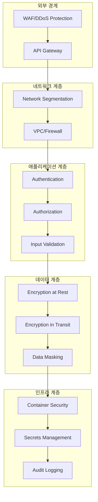

# 이지스(Aegis) 보안 아키텍처 명세서

| 항목 | 내용 |
|------|------|
| 문서 ID | AEG-ARC-20250917-1.0 |
| 버전 | 1.0 |
| 최종 수정일 | 2025년 9월 17일 |
| 작성자 | Dr. Aiden (수석 AI 시스템 아키텍트) |
| 상태 | 확정 (Finalized) |

## 1. 개요 (Overview)

본 문서는 이지스 시스템의 보안 아키텍처를 정의한다. **Zero Trust** 원칙을 기반으로 하며, **심층 방어(Defense in Depth)** 전략을 통해 다층적 보안을 구현한다. 특히 AI 시스템의 특성을 고려한 보안 위협에 대응하고, 개인정보보호법 및 관련 규정을 준수하는 보안 체계를 구축한다.

## 2. 보안 아키텍처 원칙

### 2.1. 핵심 보안 원칙

#### Zero Trust Architecture
- **"신뢰하지 말고 검증하라"**: 모든 요청을 검증
- **최소 권한 원칙**: 필요한 최소한의 권한만 부여
- **지속적 검증**: 실시간 위험 평가 및 적응적 접근 제어

#### 심층 방어 (Defense in Depth)


### 2.2. AI 시스템 특화 보안 고려사항

#### AI 모델 보안
- **모델 무결성**: 모델 변조 및 독성 공격 방지
- **프롬프트 인젝션 방지**: 악의적 입력으로부터 LLM 보호
- **데이터 독성 방지**: 학습 데이터 오염 공격 대응
- **모델 추론 보안**: 추론 과정의 기밀성 보장

#### 개인정보 보호
- **데이터 최소화**: 필요한 최소한의 개인정보만 수집
- **목적 제한**: 수집 목적 범위 내에서만 사용
- **저장 기간 제한**: 보유 기간 경과 시 자동 삭제
- **동의 관리**: 사용자 동의 상태 추적 및 관리

## 3. 인증 및 인가 아키텍처

### 3.1. 인증 (Authentication) 시스템

#### JWT 기반 토큰 인증
```python
class JWTAuthenticationSystem:
    """JWT 기반 인증 시스템"""
    
    def __init__(self):
        self.access_token_expire = timedelta(hours=1)
        self.refresh_token_expire = timedelta(days=30)
        self.secret_key = settings.JWT_SECRET_KEY
        self.algorithm = "HS256"
    
    def create_access_token(self, user_id: str, roles: List[str]) -> str:
        """액세스 토큰 생성"""
        payload = {
            "sub": user_id,
            "roles": roles,
            "type": "access",
            "iat": datetime.utcnow(),
            "exp": datetime.utcnow() + self.access_token_expire,
            "jti": str(uuid4())  # JWT ID for revocation
        }
        
        return jwt.encode(payload, self.secret_key, algorithm=self.algorithm)
    
    def verify_token(self, token: str) -> Dict[str, Any]:
        """토큰 검증"""
        try:
            payload = jwt.decode(token, self.secret_key, algorithms=[self.algorithm])
            
            # 토큰 블랙리스트 확인
            if self.is_token_revoked(payload.get("jti")):
                raise TokenRevokedError()
            
            return payload
            
        except jwt.ExpiredSignatureError:
            raise TokenExpiredError()
        except jwt.InvalidTokenError:
            raise InvalidTokenError()
    
    def revoke_token(self, jti: str):
        """토큰 무효화"""
        # Redis에 블랙리스트 저장
        self.redis_client.setex(
            f"revoked_token:{jti}",
            self.access_token_expire.total_seconds(),
            "revoked"
        )
```

#### 다중 인증 요소 (MFA)
```python
class MFAService:
    """다중 인증 요소 서비스"""
    
    def __init__(self):
        self.totp = pyotp.TOTP
        self.sms_service = SMSService()
        self.email_service = EmailService()
    
    def setup_totp(self, user_id: str) -> dict:
        """TOTP 설정"""
        secret = pyotp.random_base32()
        totp = self.totp(secret)
        
        # QR 코드 생성
        qr_url = totp.provisioning_uri(
            name=f"user_{user_id}",
            issuer_name="Aegis Policy Recommendation"
        )
        
        # 임시로 시크릿 저장 (사용자 확인 후 영구 저장)
        self.redis_client.setex(
            f"totp_setup:{user_id}",
            300,  # 5분
            secret
        )
        
        return {
            "secret": secret,
            "qr_url": qr_url,
            "backup_codes": self.generate_backup_codes()
        }
    
    def verify_totp(self, user_id: str, token: str) -> bool:
        """TOTP 토큰 검증"""
        user_secret = self.get_user_totp_secret(user_id)
        if not user_secret:
            return False
        
        totp = self.totp(user_secret)
        return totp.verify(token, valid_window=1)  # 30초 윈도우
```

### 3.2. 인가 (Authorization) 시스템

#### 역할 기반 접근 제어 (RBAC)
```python
from enum import Enum
from typing import Set

class Permission(str, Enum):
    # 정책 관련 권한
    READ_POLICIES = "policies:read"
    WRITE_POLICIES = "policies:write"
    DELETE_POLICIES = "policies:delete"
    
    # 사용자 관련 권한
    READ_USERS = "users:read"
    WRITE_USERS = "users:write"
    DELETE_USERS = "users:delete"
    
    # 추천 관련 권한
    GET_RECOMMENDATIONS = "recommendations:get"
    MANAGE_RECOMMENDATIONS = "recommendations:manage"
    
    # 시스템 관리 권한
    ADMIN_SYSTEM = "system:admin"
    ADMIN_USERS = "users:admin"
    ADMIN_POLICIES = "policies:admin"

class Role(str, Enum):
    USER = "user"
    PREMIUM_USER = "premium_user"
    POLICY_MANAGER = "policy_manager"
    SYSTEM_ADMIN = "system_admin"
    SUPER_ADMIN = "super_admin"

class RBACService:
    """역할 기반 접근 제어 서비스"""
    
    def __init__(self):
        self.role_permissions = {
            Role.USER: {
                Permission.READ_POLICIES,
                Permission.GET_RECOMMENDATIONS,
                Permission.READ_USERS  # 자신의 정보만
            },
            Role.PREMIUM_USER: {
                Permission.READ_POLICIES,
                Permission.GET_RECOMMENDATIONS,
                Permission.READ_USERS,
                # 추가 프리미엄 기능들
            },
            Role.POLICY_MANAGER: {
                Permission.READ_POLICIES,
                Permission.WRITE_POLICIES,
                Permission.DELETE_POLICIES,
                Permission.MANAGE_RECOMMENDATIONS
            },
            Role.SYSTEM_ADMIN: {
                Permission.ADMIN_SYSTEM,
                Permission.ADMIN_USERS,
                Permission.READ_POLICIES,
                Permission.WRITE_POLICIES
            },
            Role.SUPER_ADMIN: set(Permission)  # 모든 권한
        }
    
    def has_permission(self, user_roles: List[Role], 
                      required_permission: Permission) -> bool:
        """권한 확인"""
        user_permissions = set()
        for role in user_roles:
            user_permissions.update(self.role_permissions.get(role, set()))
        
        return required_permission in user_permissions
    
    def check_resource_access(self, user_id: str, resource_id: str, 
                            action: Permission) -> bool:
        """리소스별 접근 권한 확인"""
        # 사용자 자신의 리소스인지 확인
        if action in [Permission.READ_USERS, Permission.WRITE_USERS]:
            return user_id == resource_id
        
        # 일반적인 권한 확인
        user_roles = self.get_user_roles(user_id)
        return self.has_permission(user_roles, action)
```

#### 속성 기반 접근 제어 (ABAC)
```python
class ABACService:
    """속성 기반 접근 제어 서비스"""
    
    def __init__(self):
        self.policy_engine = PolicyEngine()
    
    def evaluate_access(self, subject: dict, resource: dict, 
                       action: str, environment: dict) -> bool:
        """접근 권한 평가"""
        policy = self.get_applicable_policy(subject, resource, action)
        
        if not policy:
            return False  # 기본적으로 거부
        
        return self.policy_engine.evaluate(policy, {
            "subject": subject,
            "resource": resource,
            "action": action,
            "environment": environment
        })
    
    def get_applicable_policy(self, subject: dict, resource: dict, 
                            action: str) -> Optional[dict]:
        """적용 가능한 정책 조회"""
        # 예시: 시간 기반 접근 제어
        time_based_policy = {
            "rule": "allow_business_hours",
            "condition": {
                "and": [
                    {">=": [{"var": "environment.hour"}, 9]},
                    {"<=": [{"var": "environment.hour"}, 18]},
                    {"in": [{"var": "environment.day_of_week"}, [1, 2, 3, 4, 5]]}
                ]
            }
        }
        
        # 예시: 지역 기반 접근 제어
        location_based_policy = {
            "rule": "allow_korea_only",
            "condition": {
                "==": [{"var": "environment.country"}, "KR"]
            }
        }
        
        return time_based_policy  # 실제로는 복잡한 정책 매칭 로직
```

## 4. 네트워크 보안

### 4.1. 네트워크 분할 (Network Segmentation)

```yaml
# Kubernetes Network Policies
apiVersion: networking.k8s.io/v1
kind: NetworkPolicy
metadata:
  name: aegis-network-policy
  namespace: aegis-production
spec:
  podSelector: {}
  policyTypes:
  - Ingress
  - Egress
  
  # 인그레스 규칙
  ingress:
  - from:
    - namespaceSelector:
        matchLabels:
          name: aegis-production
    - podSelector:
        matchLabels:
          app: api-gateway
    ports:
    - protocol: TCP
      port: 8080
  
  # 이그레스 규칙
  egress:
  - to:
    - namespaceSelector:
        matchLabels:
          name: aegis-data
    ports:
    - protocol: TCP
      port: 5432  # PostgreSQL
    - protocol: TCP
      port: 19530  # Milvus
    - protocol: TCP
      port: 7687   # Neo4j
```

### 4.2. TLS/SSL 구성

```python
class TLSConfiguration:
    """TLS/SSL 구성 관리"""
    
    def __init__(self):
        self.min_tls_version = "1.2"
        self.cipher_suites = [
            "ECDHE-RSA-AES256-GCM-SHA384",
            "ECDHE-RSA-AES128-GCM-SHA256",
            "ECDHE-RSA-AES256-SHA384",
            "ECDHE-RSA-AES128-SHA256"
        ]
        self.cert_manager = CertificateManager()
    
    def get_ssl_context(self) -> ssl.SSLContext:
        """SSL 컨텍스트 생성"""
        context = ssl.create_default_context(ssl.Purpose.SERVER_AUTH)
        context.minimum_version = ssl.TLSVersion.TLSv1_2
        context.set_ciphers(':'.join(self.cipher_suites))
        
        # 인증서 검증 강화
        context.check_hostname = True
        context.verify_mode = ssl.CERT_REQUIRED
        
        return context
    
    def setup_mutual_tls(self, client_cert_path: str, client_key_path: str):
        """상호 TLS 인증 설정"""
        context = self.get_ssl_context()
        context.load_cert_chain(client_cert_path, client_key_path)
        return context
```

## 5. 데이터 보안

### 5.1. 암호화 전략

#### 저장 데이터 암호화 (Encryption at Rest)
```python
from cryptography.fernet import Fernet
from cryptography.hazmat.primitives import hashes
from cryptography.hazmat.primitives.kdf.pbkdf2 import PBKDF2HMAC
import base64

class DataEncryption:
    """데이터 암호화 서비스"""
    
    def __init__(self):
        self.master_key = self.load_master_key()
        self.fernet = Fernet(self.master_key)
    
    def encrypt_field(self, data: str, field_type: str = "general") -> str:
        """필드별 암호화"""
        if field_type == "pii":
            # 개인정보는 더 강한 암호화
            return self.encrypt_pii(data)
        else:
            return self.fernet.encrypt(data.encode()).decode()
    
    def decrypt_field(self, encrypted_data: str, field_type: str = "general") -> str:
        """필드별 복호화"""
        if field_type == "pii":
            return self.decrypt_pii(encrypted_data)
        else:
            return self.fernet.decrypt(encrypted_data.encode()).decode()
    
    def encrypt_pii(self, pii_data: str) -> str:
        """개인정보 암호화 (AES-256)"""
        # 솔트 생성
        salt = os.urandom(16)
        
        # 키 파생
        kdf = PBKDF2HMAC(
            algorithm=hashes.SHA256(),
            length=32,
            salt=salt,
            iterations=100000,
        )
        key = base64.urlsafe_b64encode(kdf.derive(self.master_key))
        
        # 암호화
        f = Fernet(key)
        encrypted = f.encrypt(pii_data.encode())
        
        # 솔트와 암호화된 데이터 결합
        return base64.urlsafe_b64encode(salt + encrypted).decode()
    
    def hash_identifier(self, identifier: str) -> str:
        """식별자 해시화 (단방향)"""
        return hashlib.sha256(
            (identifier + settings.HASH_SALT).encode()
        ).hexdigest()
```

#### 전송 데이터 암호화 (Encryption in Transit)
```python
class TransitEncryption:
    """전송 중 데이터 암호화"""
    
    def __init__(self):
        self.session_keys = {}
    
    def establish_secure_channel(self, client_id: str) -> dict:
        """보안 채널 설정"""
        # 임시 세션 키 생성
        session_key = Fernet.generate_key()
        self.session_keys[client_id] = session_key
        
        # 클라이언트 공개키로 세션 키 암호화
        client_public_key = self.get_client_public_key(client_id)
        encrypted_session_key = client_public_key.encrypt(
            session_key,
            padding.OAEP(
                mgf=padding.MGF1(algorithm=hashes.SHA256()),
                algorithm=hashes.SHA256(),
                label=None
            )
        )
        
        return {
            "session_id": client_id,
            "encrypted_session_key": base64.b64encode(encrypted_session_key).decode()
        }
    
    def encrypt_message(self, client_id: str, message: str) -> str:
        """메시지 암호화"""
        session_key = self.session_keys.get(client_id)
        if not session_key:
            raise SecurityError("No secure channel established")
        
        f = Fernet(session_key)
        return f.encrypt(message.encode()).decode()
```

### 5.2. 데이터 마스킹 및 익명화

```python
class DataMasking:
    """데이터 마스킹 서비스"""
    
    def __init__(self):
        self.masking_rules = {
            "email": self.mask_email,
            "phone": self.mask_phone,
            "business_registration": self.mask_business_reg,
            "address": self.mask_address
        }
    
    def mask_data(self, data: dict, user_role: str) -> dict:
        """역할별 데이터 마스킹"""
        masked_data = data.copy()
        
        for field, value in data.items():
            if field in self.masking_rules:
                if not self.has_access_to_field(user_role, field):
                    masked_data[field] = self.masking_rules[field](value)
        
        return masked_data
    
    def mask_email(self, email: str) -> str:
        """이메일 마스킹"""
        if "@" not in email:
            return "*" * len(email)
        
        local, domain = email.split("@", 1)
        if len(local) <= 2:
            masked_local = "*" * len(local)
        else:
            masked_local = local[0] + "*" * (len(local) - 2) + local[-1]
        
        return f"{masked_local}@{domain}"
    
    def mask_phone(self, phone: str) -> str:
        """전화번호 마스킹"""
        if len(phone) <= 4:
            return "*" * len(phone)
        
        return phone[:3] + "*" * (len(phone) - 6) + phone[-3:]
    
    def anonymize_dataset(self, dataset: pd.DataFrame) -> pd.DataFrame:
        """데이터셋 익명화"""
        anonymized = dataset.copy()
        
        # 직접 식별자 제거
        direct_identifiers = ["name", "email", "phone", "address"]
        anonymized = anonymized.drop(columns=direct_identifiers, errors='ignore')
        
        # 준식별자 일반화
        if "age" in anonymized.columns:
            anonymized["age_group"] = pd.cut(
                anonymized["age"], 
                bins=[0, 30, 40, 50, 60, 100], 
                labels=["20대", "30대", "40대", "50대", "60대+"]
            )
            anonymized = anonymized.drop(columns=["age"])
        
        # k-익명성 보장 (k=5)
        return self.ensure_k_anonymity(anonymized, k=5)
```

## 6. 애플리케이션 보안

### 6.1. 입력 검증 및 살균

```python
from typing import Any, Dict
import re
import html

class InputValidation:
    """입력 검증 및 살균"""
    
    def __init__(self):
        self.sql_injection_patterns = [
            r"(\b(SELECT|INSERT|UPDATE|DELETE|DROP|CREATE|ALTER)\b)",
            r"(\b(UNION|OR|AND)\b.*\b(SELECT|INSERT|UPDATE|DELETE)\b)",
            r"(--|#|/\*|\*/)",
            r"(\b(EXEC|EXECUTE|SP_|XP_)\b)"
        ]
        
        self.xss_patterns = [
            r"<script[^>]*>.*?</script>",
            r"javascript:",
            r"on\w+\s*=",
            r"<iframe[^>]*>.*?</iframe>"
        ]
        
        self.prompt_injection_patterns = [
            r"ignore\s+previous\s+instructions",
            r"system\s*:\s*you\s+are",
            r"act\s+as\s+if\s+you\s+are",
            r"pretend\s+to\s+be"
        ]
    
    def validate_and_sanitize(self, data: Dict[str, Any], 
                            validation_rules: Dict[str, Any]) -> Dict[str, Any]:
        """데이터 검증 및 살균"""
        sanitized_data = {}
        
        for field, value in data.items():
            if field not in validation_rules:
                continue
            
            rule = validation_rules[field]
            
            # 타입 검증
            if not isinstance(value, rule.get("type", str)):
                raise ValidationError(f"Invalid type for field {field}")
            
            # 길이 검증
            if isinstance(value, str):
                if len(value) > rule.get("max_length", 1000):
                    raise ValidationError(f"Field {field} too long")
                
                if len(value) < rule.get("min_length", 0):
                    raise ValidationError(f"Field {field} too short")
            
            # 패턴 검증
            if "pattern" in rule:
                if not re.match(rule["pattern"], str(value)):
                    raise ValidationError(f"Field {field} invalid format")
            
            # 보안 검증
            sanitized_value = self.sanitize_input(str(value))
            sanitized_data[field] = sanitized_value
        
        return sanitized_data
    
    def sanitize_input(self, input_str: str) -> str:
        """입력 살균"""
        # HTML 이스케이프
        sanitized = html.escape(input_str)
        
        # SQL 인젝션 패턴 검사
        for pattern in self.sql_injection_patterns:
            if re.search(pattern, sanitized, re.IGNORECASE):
                raise SecurityError("Potential SQL injection detected")
        
        # XSS 패턴 검사
        for pattern in self.xss_patterns:
            if re.search(pattern, sanitized, re.IGNORECASE):
                raise SecurityError("Potential XSS attack detected")
        
        # 프롬프트 인젝션 검사
        for pattern in self.prompt_injection_patterns:
            if re.search(pattern, sanitized, re.IGNORECASE):
                raise SecurityError("Potential prompt injection detected")
        
        return sanitized
    
    def validate_llm_input(self, prompt: str) -> str:
        """LLM 입력 특별 검증"""
        # 프롬프트 길이 제한
        if len(prompt) > 2000:
            raise ValidationError("Prompt too long")
        
        # 시스템 명령어 패턴 검사
        system_commands = [
            "rm -rf", "del /f", "format c:",
            "DROP TABLE", "DELETE FROM",
            "sudo", "chmod", "passwd"
        ]
        
        for command in system_commands:
            if command.lower() in prompt.lower():
                raise SecurityError("System command detected in prompt")
        
        # 개인정보 패턴 검사
        pii_patterns = [
            r"\b\d{3}-\d{2}-\d{5}\b",  # 사업자등록번호
            r"\b\d{6}-\d{7}\b",        # 주민등록번호
            r"\b\d{3}-\d{4}-\d{4}\b"   # 전화번호
        ]
        
        for pattern in pii_patterns:
            if re.search(pattern, prompt):
                raise SecurityError("Personal information detected in prompt")
        
        return prompt
```

### 6.2. API 보안

```python
from functools import wraps
import time

class APISecurityMiddleware:
    """API 보안 미들웨어"""
    
    def __init__(self):
        self.rate_limiter = RateLimiter()
        self.request_validator = RequestValidator()
        self.audit_logger = AuditLogger()
    
    def secure_endpoint(self, 
                       rate_limit: int = 100,
                       require_auth: bool = True,
                       require_permissions: List[str] = None):
        """보안 엔드포인트 데코레이터"""
        def decorator(func):
            @wraps(func)
            async def wrapper(request: Request, *args, **kwargs):
                start_time = time.time()
                
                try:
                    # 1. 요청 검증
                    await self.request_validator.validate_request(request)
                    
                    # 2. 속도 제한 확인
                    client_ip = self.get_client_ip(request)
                    if not self.rate_limiter.allow_request(client_ip, rate_limit):
                        raise RateLimitExceededError()
                    
                    # 3. 인증 확인
                    user = None
                    if require_auth:
                        user = await self.authenticate_request(request)
                    
                    # 4. 권한 확인
                    if require_permissions and user:
                        await self.authorize_request(user, require_permissions)
                    
                    # 5. 실제 함수 실행
                    response = await func(request, *args, **kwargs)
                    
                    # 6. 감사 로그 기록
                    await self.audit_logger.log_request(
                        user_id=user.id if user else None,
                        endpoint=request.url.path,
                        method=request.method,
                        status="success",
                        duration=time.time() - start_time
                    )
                    
                    return response
                    
                except Exception as e:
                    # 에러 감사 로그
                    await self.audit_logger.log_request(
                        user_id=user.id if user else None,
                        endpoint=request.url.path,
                        method=request.method,
                        status="error",
                        error=str(e),
                        duration=time.time() - start_time
                    )
                    raise
            
            return wrapper
        return decorator

class RateLimiter:
    """속도 제한기"""
    
    def __init__(self):
        self.redis_client = redis.Redis()
        self.window_size = 3600  # 1시간
    
    def allow_request(self, client_id: str, limit: int) -> bool:
        """요청 허용 여부 확인"""
        key = f"rate_limit:{client_id}"
        current_time = int(time.time())
        window_start = current_time - self.window_size
        
        # 슬라이딩 윈도우 구현
        pipe = self.redis_client.pipeline()
        pipe.zremrangebyscore(key, 0, window_start)
        pipe.zcard(key)
        pipe.zadd(key, {str(current_time): current_time})
        pipe.expire(key, self.window_size)
        
        results = pipe.execute()
        current_requests = results[1]
        
        return current_requests < limit
```

## 7. 컨테이너 및 인프라 보안

### 7.1. 컨테이너 보안

```dockerfile
# 보안 강화된 Dockerfile 예시
FROM python:3.11-slim as builder

# 보안 업데이트
RUN apt-get update && apt-get upgrade -y && \
    apt-get install -y --no-install-recommends \
    build-essential \
    && rm -rf /var/lib/apt/lists/*

# 비특권 사용자 생성
RUN groupadd -r aegis && useradd -r -g aegis aegis

# 의존성 설치
COPY requirements.txt .
RUN pip install --no-cache-dir -r requirements.txt

# 프로덕션 이미지
FROM python:3.11-slim

# 보안 업데이트
RUN apt-get update && apt-get upgrade -y && \
    rm -rf /var/lib/apt/lists/*

# 비특권 사용자 생성
RUN groupadd -r aegis && useradd -r -g aegis aegis

# 애플리케이션 디렉토리 생성
WORKDIR /app
RUN chown aegis:aegis /app

# 빌더에서 의존성 복사
COPY --from=builder /usr/local/lib/python3.11/site-packages /usr/local/lib/python3.11/site-packages
COPY --from=builder /usr/local/bin /usr/local/bin

# 애플리케이션 코드 복사
COPY --chown=aegis:aegis . .

# 비특권 사용자로 전환
USER aegis

# 헬스체크 추가
HEALTHCHECK --interval=30s --timeout=3s --start-period=5s --retries=3 \
    CMD python -c "import requests; requests.get('http://localhost:8000/health')"

EXPOSE 8000
CMD ["python", "-m", "uvicorn", "main:app", "--host", "0.0.0.0", "--port", "8000"]
```

### 7.2. Kubernetes 보안 정책

```yaml
# Pod Security Policy
apiVersion: policy/v1beta1
kind: PodSecurityPolicy
metadata:
  name: aegis-psp
spec:
  privileged: false
  allowPrivilegeEscalation: false
  requiredDropCapabilities:
    - ALL
  volumes:
    - 'configMap'
    - 'emptyDir'
    - 'projected'
    - 'secret'
    - 'downwardAPI'
    - 'persistentVolumeClaim'
  runAsUser:
    rule: 'MustRunAsNonRoot'
  seLinux:
    rule: 'RunAsAny'
  fsGroup:
    rule: 'RunAsAny'

---
# Security Context Constraints
apiVersion: v1
kind: SecurityContextConstraints
metadata:
  name: aegis-scc
allowHostDirVolumePlugin: false
allowHostIPC: false
allowHostNetwork: false
allowHostPID: false
allowHostPorts: false
allowPrivilegedContainer: false
allowedCapabilities: null
defaultAddCapabilities: null
requiredDropCapabilities:
- KILL
- MKNOD
- SETUID
- SETGID
runAsUser:
  type: MustRunAsNonRoot
seLinuxContext:
  type: MustRunAs
volumes:
- configMap
- downwardAPI
- emptyDir
- persistentVolumeClaim
- projected
- secret
```

## 8. 보안 모니터링 및 감사

### 8.1. 보안 이벤트 모니터링

```python
from enum import Enum
import json

class SecurityEventType(Enum):
    AUTHENTICATION_FAILURE = "auth_failure"
    AUTHORIZATION_FAILURE = "authz_failure"
    SUSPICIOUS_ACTIVITY = "suspicious_activity"
    DATA_ACCESS_VIOLATION = "data_access_violation"
    SYSTEM_INTRUSION = "system_intrusion"
    MALICIOUS_INPUT = "malicious_input"

class SecurityMonitoring:
    """보안 모니터링 시스템"""
    
    def __init__(self):
        self.event_store = EventStore()
        self.alert_manager = AlertManager()
        self.ml_detector = AnomalyDetector()
    
    async def log_security_event(self, event_type: SecurityEventType,
                                details: dict, severity: str = "medium"):
        """보안 이벤트 로깅"""
        event = {
            "timestamp": datetime.utcnow().isoformat(),
            "event_type": event_type.value,
            "severity": severity,
            "details": details,
            "source_ip": details.get("source_ip"),
            "user_id": details.get("user_id"),
            "session_id": details.get("session_id")
        }
        
        # 이벤트 저장
        await self.event_store.store_event(event)
        
        # 실시간 분석
        await self.analyze_security_event(event)
        
        # 심각도에 따른 알림
        if severity in ["high", "critical"]:
            await self.alert_manager.send_alert(event)
    
    async def analyze_security_event(self, event: dict):
        """보안 이벤트 분석"""
        # 패턴 기반 분석
        if await self.detect_brute_force_attack(event):
            await self.handle_brute_force_attack(event)
        
        if await self.detect_privilege_escalation(event):
            await self.handle_privilege_escalation(event)
        
        # ML 기반 이상 탐지
        anomaly_score = await self.ml_detector.calculate_anomaly_score(event)
        if anomaly_score > 0.8:
            await self.handle_anomaly(event, anomaly_score)
    
    async def detect_brute_force_attack(self, event: dict) -> bool:
        """무차별 대입 공격 탐지"""
        if event["event_type"] != SecurityEventType.AUTHENTICATION_FAILURE.value:
            return False
        
        source_ip = event["details"].get("source_ip")
        if not source_ip:
            return False
        
        # 최근 10분간 실패 횟수 확인
        recent_failures = await self.event_store.count_events(
            event_type=SecurityEventType.AUTHENTICATION_FAILURE,
            source_ip=source_ip,
            time_window=600  # 10분
        )
        
        return recent_failures >= 5
    
    async def handle_brute_force_attack(self, event: dict):
        """무차별 대입 공격 대응"""
        source_ip = event["details"]["source_ip"]
        
        # IP 차단
        await self.block_ip(source_ip, duration=3600)  # 1시간 차단
        
        # 알림 발송
        await self.alert_manager.send_alert({
            "type": "brute_force_attack",
            "source_ip": source_ip,
            "action": "ip_blocked"
        })
```

### 8.2. 감사 로깅

```python
class AuditLogger:
    """감사 로깅 시스템"""
    
    def __init__(self):
        self.logger = logging.getLogger("audit")
        self.log_store = AuditLogStore()
    
    async def log_data_access(self, user_id: str, resource_type: str,
                            resource_id: str, action: str, result: str):
        """데이터 접근 감사 로그"""
        audit_log = {
            "timestamp": datetime.utcnow().isoformat(),
            "event_type": "data_access",
            "user_id": user_id,
            "resource_type": resource_type,
            "resource_id": resource_id,
            "action": action,
            "result": result,
            "session_id": self.get_current_session_id(),
            "ip_address": self.get_client_ip()
        }
        
        await self.log_store.store_audit_log(audit_log)
        self.logger.info(json.dumps(audit_log))
    
    async def log_admin_action(self, admin_id: str, action: str,
                             target: str, details: dict):
        """관리자 작업 감사 로그"""
        audit_log = {
            "timestamp": datetime.utcnow().isoformat(),
            "event_type": "admin_action",
            "admin_id": admin_id,
            "action": action,
            "target": target,
            "details": details,
            "session_id": self.get_current_session_id(),
            "ip_address": self.get_client_ip()
        }
        
        await self.log_store.store_audit_log(audit_log)
        self.logger.warning(json.dumps(audit_log))
    
    async def generate_audit_report(self, start_date: datetime,
                                  end_date: datetime) -> dict:
        """감사 보고서 생성"""
        logs = await self.log_store.get_logs_by_date_range(start_date, end_date)
        
        report = {
            "period": {
                "start": start_date.isoformat(),
                "end": end_date.isoformat()
            },
            "summary": {
                "total_events": len(logs),
                "data_access_events": len([l for l in logs if l["event_type"] == "data_access"]),
                "admin_actions": len([l for l in logs if l["event_type"] == "admin_action"]),
                "security_events": len([l for l in logs if l["event_type"] == "security_event"])
            },
            "top_users": self.get_top_users_by_activity(logs),
            "suspicious_activities": self.identify_suspicious_activities(logs)
        }
        
        return report
```

## 9. 보안 테스트 및 검증

### 9.1. 자동화된 보안 테스트

```python
import pytest
from unittest.mock import Mock, patch

class SecurityTestSuite:
    """보안 테스트 스위트"""
    
    def __init__(self):
        self.test_client = TestClient()
        self.security_scanner = SecurityScanner()
    
    @pytest.mark.security
    async def test_sql_injection_protection(self):
        """SQL 인젝션 방어 테스트"""
        malicious_inputs = [
            "'; DROP TABLE users; --",
            "1' OR '1'='1",
            "admin'/**/OR/**/1=1#",
            "1; SELECT * FROM users WHERE 't'='t"
        ]
        
        for malicious_input in malicious_inputs:
            response = await self.test_client.post("/api/v1/search", json={
                "query": malicious_input
            })
            
            # 400 Bad Request 또는 보안 에러 응답 확인
            assert response.status_code in [400, 403]
            assert "error" in response.json()
    
    @pytest.mark.security
    async def test_xss_protection(self):
        """XSS 방어 테스트"""
        xss_payloads = [
            "<script>alert('XSS')</script>",
            "javascript:alert('XSS')",
            "",
            "<iframe src='javascript:alert(\"XSS\")'></iframe>"
        ]
        
        for payload in xss_payloads:
            response = await self.test_client.post("/api/v1/users/profile", json={
                "business_name": payload
            })
            
            assert response.status_code in [400, 403]
    
    @pytest.mark.security
    async def test_authentication_bypass(self):
        """인증 우회 시도 테스트"""
        protected_endpoints = [
            "/api/v1/users/profile",
            "/api/v1/recommendations",
            "/api/v1/admin/users"
        ]
        
        for endpoint in protected_endpoints:
            # 토큰 없이 접근 시도
            response = await self.test_client.get(endpoint)
            assert response.status_code == 401
            
            # 잘못된 토큰으로 접근 시도
            response = await self.test_client.get(
                endpoint,
                headers={"Authorization": "Bearer invalid_token"}
            )
            assert response.status_code == 401
    
    @pytest.mark.security
    async def test_rate_limiting(self):
        """속도 제한 테스트"""
        endpoint = "/api/v1/auth/login"
        
        # 연속으로 많은 요청 전송
        responses = []
        for i in range(10):
            response = await self.test_client.post(endpoint, json={
                "email": f"test{i}@example.com",
                "password": "wrong_password"
            })
            responses.append(response)
        
        # 마지막 몇 개 요청은 429 (Too Many Requests) 응답
        assert any(r.status_code == 429 for r in responses[-3:])
```

### 9.2. 침투 테스트 자동화

```python
class PenetrationTestSuite:
    """침투 테스트 자동화"""
    
    def __init__(self):
        self.target_url = "https://api.aegis.kr"
        self.scanner = VulnerabilityScanner()
    
    async def run_owasp_top10_tests(self):
        """OWASP Top 10 취약점 테스트"""
        results = {}
        
        # A01: Broken Access Control
        results["broken_access_control"] = await self.test_broken_access_control()
        
        # A02: Cryptographic Failures
        results["cryptographic_failures"] = await self.test_cryptographic_failures()
        
        # A03: Injection
        results["injection"] = await self.test_injection_vulnerabilities()
        
        # A04: Insecure Design
        results["insecure_design"] = await self.test_insecure_design()
        
        # A05: Security Misconfiguration
        results["security_misconfiguration"] = await self.test_security_misconfiguration()
        
        return results
    
    async def test_broken_access_control(self):
        """접근 제어 취약점 테스트"""
        test_cases = [
            # 수직 권한 상승
            {
                "name": "vertical_privilege_escalation",
                "method": "GET",
                "endpoint": "/api/v1/admin/users",
                "token": "user_token",  # 일반 사용자 토큰
                "expected_status": 403
            },
            # 수평 권한 상승
            {
                "name": "horizontal_privilege_escalation",
                "method": "GET",
                "endpoint": "/api/v1/users/other_user_id/profile",
                "token": "user_token",
                "expected_status": 403
            }
        ]
        
        results = []
        for test_case in test_cases:
            result = await self.execute_test_case(test_case)
            results.append(result)
        
        return results
```

---

**📋 관련 문서**
- [시스템 개요](./01_SYSTEM_OVERVIEW.md)
- [데이터 아키텍처](./03_DATA_ARCHITECTURE.md)
- [보안 운영](../05_OPERATIONS/03_SECURITY_OPERATIONS.md)
- [보안 테스트](../06_QUALITY_ASSURANCE/03_SECURITY_TESTING.md)