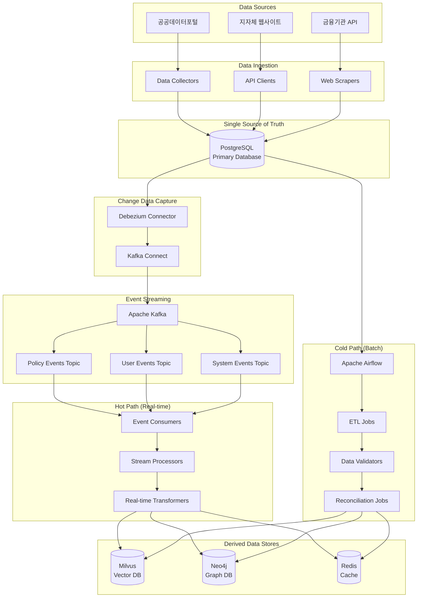

# 이중 트랙 데이터 파이프라인 상세 명세서

| 항목 | 내용 |
|------|------|
| 문서 ID | AEG-CMP-20250917-2.0 |
| 버전 | 2.0 |
| 최종 수정일 | 2025년 9월 17일 |
| 작성자 | Dr. Aiden (수석 AI 시스템 아키텍트) |
| 검토자 | 데이터 아키텍처 팀 |
| 승인자 | CTO |
| 상태 | 확정 (Finalized) |

## 1. 개요 (Overview)

본 문서는 이지스 4대 핵심 원칙 중 **제 1원칙: 데이터 무결성**을 구현하는 **이중 트랙 데이터 파이프라인**의 상세 설계 명세를 정의한다. 이 파이프라인은 **실시간성**과 **최종적 일관성**을 모두 보장하는 Lambda Architecture 패턴을 기반으로 구현된다.

### 1.1. 설계 목표
- **실시간 데이터 처리**: 데이터 변경을 수 초 내에 시스템 전체에 반영
- **최종적 일관성**: 배치 처리를 통한 데이터 정합성 보장
- **장애 복구**: 자동화된 오류 감지 및 복구 메커니즘
- **확장성**: 대용량 데이터 처리 및 수평적 확장 지원
- **관찰가능성**: 모든 데이터 처리 과정의 추적 및 모니터링

### 1.2. 아키텍처 원칙
- **단일 진실 공급원 (SSoT)**: PostgreSQL이 모든 데이터의 최종 권위
- **이벤트 기반 아키텍처**: 모든 데이터 변경을 이벤트로 처리
- **멱등성 (Idempotency)**: 동일한 작업의 반복 실행이 안전
- **보상 트랜잭션 (Compensating Transaction)**: 실패 시 자동 롤백

## 2. 이중 트랙 아키텍처 개요

### 2.1. 전체 아키텍처 다이어그램



### 2.2. 데이터 흐름 패턴

#### 2.2.1. 핫 패스 (Hot Path) - 실시간 처리
```
데이터 변경 → CDC → Kafka → Stream Processing → 파생 데이터 저장소
     ↓           ↓      ↓           ↓                    ↓
  PostgreSQL → Debezium → Events → Consumers → Milvus/Neo4j/Redis
  (수 초)      (수 초)   (수 초)   (수 초)        (수 초)
```

#### 2.2.2. 콜드 패스 (Cold Path) - 배치 처리
```
스케줄 트리거 → 전체 데이터 검증 → 불일치 감지 → 수정 → 파생 데이터 동기화
      ↓              ↓              ↓         ↓           ↓
   Airflow → PostgreSQL 스캔 → 차이 분석 → 데이터 수정 → 재처리
   (일 단위)      (분 단위)        (분 단위)   (분 단위)    (분 단위)
```

## 3. 핫 패스 (Hot Path) 상세 설계

### 3.1. Change Data Capture (CDC) 구성

#### 3.1.1. Debezium 커넥터 설정
```json
{
  "name": "aegis-postgres-connector",
  "config": {
    "connector.class": "io.debezium.connector.postgresql.PostgresConnector",
    "database.hostname": "postgres-primary",
    "database.port": "5432",
    "database.user": "debezium_user",
    "database.password": "${DEBEZIUM_PASSWORD}",
    "database.dbname": "aegis",
    "database.server.name": "aegis-db",
    "table.include.list": "public.policies,public.users,public.business_rules",
    "plugin.name": "pgoutput",
    "slot.name": "aegis_slot",
    "publication.name": "aegis_publication",
    "transforms": "unwrap",
    "transforms.unwrap.type": "io.debezium.transforms.ExtractNewRecordState",
    "transforms.unwrap.drop.tombstones": "false",
    "key.converter": "org.apache.kafka.connect.json.JsonConverter",
    "value.converter": "org.apache.kafka.connect.json.JsonConverter",
    "topic.prefix": "aegis"
  }
}
```

#### 3.1.2. PostgreSQL 설정
```sql
-- WAL 레벨 설정
ALTER SYSTEM SET wal_level = logical;
ALTER SYSTEM SET max_replication_slots = 10;
ALTER SYSTEM SET max_wal_senders = 10;

-- Publication 생성
CREATE PUBLICATION aegis_publication FOR TABLE policies, users, business_rules;

-- Debezium 사용자 생성
CREATE USER debezium_user WITH REPLICATION PASSWORD 'secure_password';
GRANT SELECT ON ALL TABLES IN SCHEMA public TO debezium_user;
GRANT USAGE ON SCHEMA public TO debezium_user;
```

### 3.2. 이벤트 스키마 정의

#### 3.2.1. 정책 이벤트 스키마
```json
{
  "schema": {
    "type": "struct",
    "fields": [
      {"field": "before", "type": "struct", "optional": true},
      {"field": "after", "type": "struct", "optional": true},
      {"field": "source", "type": "struct"},
      {"field": "op", "type": "string"},
      {"field": "ts_ms", "type": "int64"},
      {"field": "transaction", "type": "struct", "optional": true}
    ]
  },
  "payload": {
    "before": null,
    "after": {
      "policy_id": "POL-2025-001",
      "title": "청년 창업 특례 보증",
      "content": "청년 창업자를 위한 특별 보증 프로그램...",
      "issuing_organization": "기술보증기금",
      "target_regions": ["11", "26", "27"],
      "target_industries": ["J", "M", "N"],
      "funding_amount_min": 10000000,
      "funding_amount_max": 500000000,
      "interest_rate": 2.5,
      "application_start_date": "2025-01-01",
      "application_end_date": "2025-12-31",
      "created_at": "2025-09-17T10:30:00Z",
      "updated_at": "2025-09-17T10:30:00Z"
    },
    "source": {
      "version": "1.9.0",
      "connector": "postgresql",
      "name": "aegis-db",
      "ts_ms": 1663405368000,
      "snapshot": "false",
      "db": "aegis",
      "schema": "public",
      "table": "policies",
      "txId": 12345,
      "lsn": 67890
    },
    "op": "c",
    "ts_ms": 1663405368000,
    "transaction": {
      "id": "12345",
      "total_order": 1,
      "data_collection_order": 1
    }
  }
}
```

### 3.3. 실시간 이벤트 처리

#### 3.3.1. 이벤트 컨슈머 구현
```python
import asyncio
import json
from typing import Dict, Any, List
from kafka import KafkaConsumer
from kafka.errors import KafkaError
import logging

class PolicyEventConsumer:
    """정책 이벤트 실시간 처리 컨슈머"""
    
    def __init__(self, kafka_config: Dict[str, Any]):
        self.kafka_config = kafka_config
        self.consumer = None
        self.processors = {
            'c': self.handle_create_event,
            'u': self.handle_update_event,
            'd': self.handle_delete_event
        }
        self.milvus_client = MilvusClient()
        self.neo4j_client = Neo4jClient()
        self.redis_client = RedisClient()
        
    async def start_consuming(self):
        """이벤트 소비 시작"""
        self.consumer = KafkaConsumer(
            'aegis.public.policies',
            bootstrap_servers=self.kafka_config['bootstrap_servers'],
            group_id='policy-processor-group',
            value_deserializer=lambda m: json.loads(m.decode('utf-8')),
            enable_auto_commit=False,
            max_poll_records=100
        )
        
        try:
            for message in self.consumer:
                await self.process_message(message)
        except KafkaError as e:
            logging.error(f"Kafka error: {e}")
            raise
        finally:
            self.consumer.close()
    
    async def process_message(self, message):
        """개별 메시지 처리"""
        try:
            event_data = message.value
            operation = event_data['payload']['op']
            
            if operation in self.processors:
                await self.processors[operation](event_data)
                
            # 수동 커밋 (처리 완료 후)
            self.consumer.commit()
            
        except Exception as e:
            logging.error(f"Message processing failed: {e}")
            # 에러 처리 로직 (DLQ 전송 등)
            await self.handle_processing_error(message, e)
    
    async def handle_create_event(self, event_data: Dict[str, Any]):
        """정책 생성 이벤트 처리"""
        policy_data = event_data['payload']['after']
        policy_id = policy_data['policy_id']
        
        try:
            # 1. 벡터 임베딩 생성 및 Milvus 저장
            await self.create_vector_embedding(policy_data)
            
            # 2. 지식 그래프 노드 생성 및 Neo4j 저장
            await self.create_graph_node(policy_data)
            
            # 3. 캐시 무효화
            await self.invalidate_related_cache(policy_id)
            
            logging.info(f"Policy created successfully: {policy_id}")
            
        except Exception as e:
            logging.error(f"Failed to process create event for {policy_id}: {e}")
            # 보상 트랜잭션 실행
            await self.compensate_create_failure(policy_id)
            raise
    
    async def handle_update_event(self, event_data: Dict[str, Any]):
        """정책 업데이트 이벤트 처리"""
        before_data = event_data['payload']['before']
        after_data = event_data['payload']['after']
        policy_id = after_data['policy_id']
        
        try:
            # 변경된 필드 감지
            changed_fields = self.detect_changed_fields(before_data, after_data)
            
            # 벡터 관련 필드 변경 시 임베딩 업데이트
            if self.requires_vector_update(changed_fields):
                await self.update_vector_embedding(after_data)
            
            # 그래프 관련 필드 변경 시 노드 업데이트
            if self.requires_graph_update(changed_fields):
                await self.update_graph_node(after_data)
            
            # 캐시 무효화
            await self.invalidate_related_cache(policy_id)
            
            logging.info(f"Policy updated successfully: {policy_id}")
            
        except Exception as e:
            logging.error(f"Failed to process update event for {policy_id}: {e}")
            await self.compensate_update_failure(policy_id, before_data)
            raise
    
    async def handle_delete_event(self, event_data: Dict[str, Any]):
        """정책 삭제 이벤트 처리"""
        policy_data = event_data['payload']['before']
        policy_id = policy_data['policy_id']
        
        try:
            # 1. Milvus에서 벡터 삭제
            await self.delete_vector_embedding(policy_id)
            
            # 2. Neo4j에서 노드 및 관계 삭제
            await self.delete_graph_node(policy_id)
            
            # 3. 캐시에서 삭제
            await self.delete_from_cache(policy_id)
            
            logging.info(f"Policy deleted successfully: {policy_id}")
            
        except Exception as e:
            logging.error(f"Failed to process delete event for {policy_id}: {e}")
            # 삭제 실패 시 복구는 콜드 패스에서 처리
            raise
```

#### 3.3.2. 벡터 임베딩 처리
```python
class VectorEmbeddingProcessor:
    """벡터 임베딩 생성 및 관리"""
    
    def __init__(self):
        self.embedding_model = SentenceTransformer('sentence-transformers/all-MiniLM-L6-v2')
        self.milvus_client = MilvusClient()
    
    async def create_vector_embedding(self, policy_data: Dict[str, Any]):
        """정책 데이터의 벡터 임베딩 생성"""
        policy_id = policy_data['policy_id']
        
        # 임베딩 대상 텍스트 구성
        embedding_text = self.compose_embedding_text(policy_data)
        
        # 벡터 임베딩 생성
        embedding = self.embedding_model.encode(embedding_text)
        
        # Milvus에 저장할 데이터 구성
        milvus_data = {
            'policy_id': policy_id,
            'embedding': embedding.tolist(),
            'title': policy_data['title'],
            'target_regions': ','.join(policy_data.get('target_regions', [])),
            'target_industries': ','.join(policy_data.get('target_industries', [])),
            'funding_amount_min': policy_data.get('funding_amount_min', 0),
            'funding_amount_max': policy_data.get('funding_amount_max', 0),
            'interest_rate': policy_data.get('interest_rate', 0.0),
            'created_at': policy_data['created_at']
        }
        
        # Milvus 컬렉션에 삽입
        await self.milvus_client.insert('policy_embeddings', [milvus_data])
        
        logging.info(f"Vector embedding created for policy: {policy_id}")
    
    def compose_embedding_text(self, policy_data: Dict[str, Any]) -> str:
        """임베딩을 위한 텍스트 구성"""
        components = [
            policy_data.get('title', ''),
            policy_data.get('content', ''),
            policy_data.get('issuing_organization', ''),
            f"지원금액: {policy_data.get('funding_amount_min', 0)}원 ~ {policy_data.get('funding_amount_max', 0)}원",
            f"금리: {policy_data.get('interest_rate', 0)}%"
        ]
        
        return ' '.join(filter(None, components))
```

### 3.4. 오류 처리 및 복구

#### 3.4.1. 보상 트랜잭션 패턴
```python
class CompensationManager:
    """보상 트랜잭션 관리"""
    
    def __init__(self):
        self.milvus_client = MilvusClient()
        self.neo4j_client = Neo4jClient()
        self.redis_client = RedisClient()
    
    async def compensate_create_failure(self, policy_id: str):
        """생성 실패 시 보상 트랜잭션"""
        try:
            # 부분적으로 생성된 데이터 정리
            await self.milvus_client.delete('policy_embeddings', f'policy_id == "{policy_id}"')
            await self.neo4j_client.delete_node('Policy', {'policy_id': policy_id})
            await self.redis_client.delete(f'policy:{policy_id}')
            
            logging.info(f"Compensation completed for failed create: {policy_id}")
            
        except Exception as e:
            logging.error(f"Compensation failed for {policy_id}: {e}")
            # 보상 실패는 콜드 패스에서 처리
    
    async def compensate_update_failure(self, policy_id: str, original_data: Dict[str, Any]):
        """업데이트 실패 시 보상 트랜잭션"""
        try:
            # 원본 데이터로 복원
            await self.restore_original_data(policy_id, original_data)
            
            logging.info(f"Compensation completed for failed update: {policy_id}")
            
        except Exception as e:
            logging.error(f"Update compensation failed for {policy_id}: {e}")
```

## 4. 콜드 패스 (Cold Path) 상세 설계

### 4.1. Apache Airflow DAG 구성

#### 4.1.1. 메인 데이터 동기화 DAG
```python
from airflow import DAG
from airflow.operators.python import PythonOperator
from airflow.operators.bash import BashOperator
from airflow.utils.dates import days_ago
from datetime import timedelta

default_args = {
    'owner': 'aegis-data-team',
    'depends_on_past': False,
    'start_date': days_ago(1),
    'email_on_failure': True,
    'email_on_retry': False,
    'retries': 3,
    'retry_delay': timedelta(minutes=5),
    'execution_timeout': timedelta(hours=4)
}

dag = DAG(
    'aegis_data_consistency_check',
    default_args=default_args,
    description='Daily data consistency verification and correction',
    schedule_interval='0 3 * * *',  # 매일 03:00 KST
    catchup=False,
    max_active_runs=1,
    tags=['data', 'consistency', 'batch']
)

# Task 1: 데이터 소스 수집
extract_external_data = PythonOperator(
    task_id='extract_external_data',
    python_callable=extract_policy_data_from_sources,
    dag=dag
)

# Task 2: 데이터 검증 및 스테이징
validate_and_stage = PythonOperator(
    task_id='validate_and_stage',
    python_callable=validate_and_stage_data,
    dag=dag
)

# Task 3: PostgreSQL 동기화
sync_postgresql = PythonOperator(
    task_id='sync_postgresql',
    python_callable=sync_primary_database,
    dag=dag
)

# Task 4: 벡터 데이터 동기화
sync_vector_data = PythonOperator(
    task_id='sync_vector_data',
    python_callable=sync_milvus_data,
    dag=dag
)

# Task 5: 그래프 데이터 동기화
sync_graph_data = PythonOperator(
    task_id='sync_graph_data',
    python_callable=sync_neo4j_data,
    dag=dag
)

# Task 6: 일관성 검증
verify_consistency = PythonOperator(
    task_id='verify_consistency',
    python_callable=verify_data_consistency,
    dag=dag
)

# Task 7: 정리 작업
cleanup_orphaned_data = PythonOperator(
    task_id='cleanup_orphaned_data',
    python_callable=cleanup_orphaned_records,
    dag=dag
)

# Task 의존성 정의
extract_external_data >> validate_and_stage >> sync_postgresql
sync_postgresql >> [sync_vector_data, sync_graph_data]
[sync_vector_data, sync_graph_data] >> verify_consistency >> cleanup_orphaned_data
```

#### 4.1.2. 데이터 일관성 검증 로직
```python
class DataConsistencyVerifier:
    """데이터 일관성 검증"""
    
    def __init__(self):
        self.postgres_client = PostgreSQLClient()
        self.milvus_client = MilvusClient()
        self.neo4j_client = Neo4jClient()
        self.redis_client = RedisClient()
    
    async def verify_data_consistency(self):
        """전체 데이터 일관성 검증"""
        consistency_report = {
            'timestamp': datetime.utcnow().isoformat(),
            'checks': {},
            'inconsistencies': [],
            'actions_taken': []
        }
        
        # 1. PostgreSQL vs Milvus 일관성 검증
        milvus_consistency = await self.verify_milvus_consistency()
        consistency_report['checks']['milvus'] = milvus_consistency
        
        # 2. PostgreSQL vs Neo4j 일관성 검증
        neo4j_consistency = await self.verify_neo4j_consistency()
        consistency_report['checks']['neo4j'] = neo4j_consistency
        
        # 3. 캐시 일관성 검증
        cache_consistency = await self.verify_cache_consistency()
        consistency_report['checks']['cache'] = cache_consistency
        
        # 4. 불일치 해결
        if milvus_consistency['inconsistent_count'] > 0:
            await self.resolve_milvus_inconsistencies(milvus_consistency['inconsistencies'])
        
        if neo4j_consistency['inconsistent_count'] > 0:
            await self.resolve_neo4j_inconsistencies(neo4j_consistency['inconsistencies'])
        
        # 5. 보고서 생성
        await self.generate_consistency_report(consistency_report)
        
        return consistency_report
    
    async def verify_milvus_consistency(self) -> Dict[str, Any]:
        """Milvus 데이터 일관성 검증"""
        # PostgreSQL에서 모든 정책 ID 조회
        postgres_policies = await self.postgres_client.fetch_all(
            "SELECT policy_id, updated_at FROM policies WHERE is_active = true"
        )
        
        # Milvus에서 모든 정책 ID 조회
        milvus_policies = await self.milvus_client.query(
            collection_name='policy_embeddings',
            expr='',
            output_fields=['policy_id', 'created_at']
        )
        
        postgres_ids = {p['policy_id']: p['updated_at'] for p in postgres_policies}
        milvus_ids = {p['policy_id']: p['created_at'] for p in milvus_policies}
        
        # 불일치 감지
        missing_in_milvus = set(postgres_ids.keys()) - set(milvus_ids.keys())
        orphaned_in_milvus = set(milvus_ids.keys()) - set(postgres_ids.keys())
        
        inconsistencies = []
        
        # 누락된 데이터
        for policy_id in missing_in_milvus:
            inconsistencies.append({
                'type': 'missing_in_milvus',
                'policy_id': policy_id,
                'action': 'create_embedding'
            })
        
        # 고아 데이터
        for policy_id in orphaned_in_milvus:
            inconsistencies.append({
                'type': 'orphaned_in_milvus',
                'policy_id': policy_id,
                'action': 'delete_embedding'
            })
        
        return {
            'total_postgres': len(postgres_ids),
            'total_milvus': len(milvus_ids),
            'missing_count': len(missing_in_milvus),
            'orphaned_count': len(orphaned_in_milvus),
            'inconsistent_count': len(inconsistencies),
            'inconsistencies': inconsistencies
        }
```

---

**📋 관련 문서**
- [Interactive AI Core](./02_INTERACTIVE_AI_CORE.md)
- [데이터 아키텍처](../01_ARCHITECTURE/03_DATA_ARCHITECTURE.md)
- [이벤트 스키마](../03_DATA_AND_APIS/03_EVENT_SCHEMA.md)
- [데이터 파이프라인 Spec](../07_SPECIFICATIONS/DATA_PIPELINE/01_DATA_PIPELINE_OVERVIEW.md)