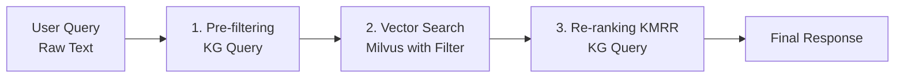

# 상호작용 AI 코어 명세

| 항목 | 내용 |
|------|------|
| 문서 ID | AEG-CMP-20250917-1.0 |
| 버전 | 1.0 |
| 최종 수정일 | 2025년 9월 17일 |
| 작성자 | Dr. Aiden (수석 AI 시스템 아키텍트) |
| 상태 | 확정 (Finalized) |

## 1. 개요 (Overview)

본 문서는 '이지스(Aegis) 4대 원칙' 중 제 2원칙인 지능형 검색을 기술적으로 구현하는 '상호작용 AI 코어(Interactive AI Core)'의 상세 아키텍처를 정의한다. 이 코어의 핵심은 검색(RAG)과 추론(KG)이 단방향으로 흐르지 않고 양방향으로 상호작용하여, 표면적인 유사성을 넘어 '논리적으로 검증된 최적의 해답'을 찾아내는 것이다.

## 2. 사용자 쿼리 처리 흐름

사용자 쿼리가 입력되었을 때, AI 코어는 다음과 같은 순서로 작업을 수행한다.



### 2.1. 처리 단계별 설명

- **사전 필터링 (Pre-filtering)**: 사용자의 기본 자격 요건을 KG에서 조회하여 검색 공간을 좁힌다.
- **벡터 검색 (Vector Search)**: 필터링된 검색 공간 내에서 의미적으로 가장 유사한 후보군을 Milvus에서 추출한다.
- **재순위 (Re-ranking)**: KMRR 알고리즘을 통해 후보군을 KG의 논리적 규칙으로 재평가하여 최종 순위를 결정한다.

## 3. 핵심 기능 1: 지식 그래프 기반 사전 필터링 (KG-Informed Pre-filtering)
이는 단순 벡터 검색의 'Top-K 한계' (정답이 유사도 순위 K개 밖에 있어 검색되지 않는 문제)를 극복하기 위한 핵심 메커니즘이다.

### 3.1. 동작 방식

#### 제약 조건 식별
사용자 쿼리(경기도에서 카페 창업 예정)와 사용자 프로필 데이터(가입 시 입력)에서 지역: 경기도, 업종: 요식업, 창업 단계: 예비와 같은 핵심 제약 조건을 식별한다.

#### KG 질의
식별된 제약 조건을 바탕으로 Neo4j에 질의하여, 벡터 검색 시 적용할 메타데이터 필터 조건을 생성한다.

#### 필터링된 벡터 검색
생성된 필터 조건을 Milvus 쿼리에 포함하여, 처음부터 사용자의 기본 자격 요건을 만족하는 문서들만을 대상으로 의미 검색을 수행한다.

### 3.2. 구현 예시
# 1. 제약 조건 식별
user_constraints = {"region": "경기도", "biz_category": "요식업"}

# 2. Milvus 필터 표현식 생성
filter_expression = " and ".join([f"{key} == '{value}'" for key, value in user_constraints.items()])
# 결과: "region == '경기도' and biz_category == '요식업'"

# 3. 필터링된 벡터 검색 수행
query_vector = embed(user_query)
search_results = milvus.search(
    data=query_vector,
    filter=filter_expression, # 필터 조건 적용
    limit=50
)

## 4. 핵심 기능 2: 지식기반 재순위 알고리즘 (KMRR)

KMRR(Knowledge-Modulated Re-ranking)은 사전 필터링을 거쳐 선정된 후보군에 대해, KG의 깊이 있는 논리적 사실을 적용하여 최종 순위를 결정하는 알고리즘이다.

### 4.1. 알고리즘 의사 코드 (Pseudo-code)
function KMRR_Fusion(query: str, user_context: dict) -> list[Document]:
    # --- Stage 1: Candidate Generation (Pre-filtered Vector Search) ---
    filter_expr = generate_filter_from_context(user_context)
    candidates = milvus.search(embed(query), filter=filter_expr, limit=50)
    # candidates: [(doc_1, 0.92), (doc_2, 0.88), ...]

    # --- Stage 2: Knowledge Modulation & Re-ranking ---
    final_results = []
    for doc, initial_score in candidates:
        # KG에서 문서와 사용자에 대한 논리적 사실(facts) 조회
        kg_facts = neo4j.query_facts(doc_id=doc.id, user=user_context)

        rerank_score = initial_score

        # Rule 1: Hard Filtering (절대 규칙) - 모순 처리
        # 자격 미달, 중복 불가 등 절대적 배제 조건 확인
        if kg_facts.get("is_ineligible") or kg_facts.get("is_conflicting"):
            continue # 후보군에서 완전히 제거

        # Rule 2: Soft Modulation (가중치 조정)
        # 추천 강도, 절차 복잡도 등에 따라 점수 가감
        boost_factor = 1.0
        if kg_facts.get("is_highly_recommended"):
            boost_factor *= 1.2
        if kg_facts.get("has_complex_procedure"):
            boost_factor *= 0.9
        
        rerank_score *= boost_factor
        
        final_results.append((doc, rerank_score))

    # --- Stage 3: Final Ranking ---
    # 최종 점수 기준 내림차순 정렬
    return sorted(final_results, key=lambda item: item[1], reverse=True)

이 알고리즘을 통해 우리 시스템은 단순한 '관련 문서'가 아닌, 사용자의 상황에 가장 적합하며 논리적으로도 타당한 '최적의 솔루션'을 추천할 수 있게 된다.
```p
ython
# 1. 제약 조건 식별
user_constraints = {"region": "경기도", "biz_category": "요식업"}

# 2. Milvus 필터 표현식 생성
filter_expression = " and ".join([f"{key} == '{value}'" for key, value in user_constraints.items()])
# 결과: "region == '경기도' and biz_category == '요식업'"

# 3. 필터링된 벡터 검색 수행
query_vector = embed(user_query)
search_results = milvus.search(
    data=query_vector,
    filter=filter_expression, # 필터 조건 적용
    limit=50
)
```

### 3.3. 구현 클래스

```python
from typing import List, Dict, Any, Tuple
import numpy as np
from dataclasses import dataclass

@dataclass
class SearchCandidate:
    """검색 후보"""
    document_id: str
    content: str
    metadata: Dict[str, Any]
    similarity_score: float

class KGInformedPrefilter:
    """지식 그래프 기반 사전 필터"""
    
    def __init__(self, neo4j_client, embedding_service):
        self.neo4j = neo4j_client
        self.embedding_service = embedding_service
    
    async def extract_constraints(self, user_query: str, user_profile: Dict[str, Any]) -> Dict[str, Any]:
        """사용자 쿼리와 프로필에서 제약 조건 추출"""
        constraints = {}
        
        # 프로필에서 기본 제약 조건 추출
        if "region" in user_profile:
            constraints["region"] = user_profile["region"]
        if "industry_code" in user_profile:
            constraints["industry_code"] = user_profile["industry_code"]
        if "business_type" in user_profile:
            constraints["business_type"] = user_profile["business_type"]
        
        # 쿼리에서 추가 제약 조건 추출 (NLP 기반)
        query_constraints = await self._extract_query_constraints(user_query)
        constraints.update(query_constraints)
        
        return constraints
    
    async def generate_filter_expression(self, constraints: Dict[str, Any]) -> str:
        """제약 조건을 Milvus 필터 표현식으로 변환"""
        filter_parts = []
        
        for key, value in constraints.items():
            if isinstance(value, list):
                # 배열 값의 경우 IN 연산자 사용
                value_str = "', '".join(str(v) for v in value)
                filter_parts.append(f"{key} in ['{value_str}']")
            else:
                filter_parts.append(f"{key} == '{value}'")
        
        return " and ".join(filter_parts)
```

```python
function KMRR_Fusion(query: str, user_context: dict) -> list[Document]:
    # --- Stage 1: Candidate Generation (Pre-filtered Vector Search) ---
    filter_expr = generate_filter_from_context(user_context)
    candidates = milvus.search(embed(query), filter=filter_expr, limit=50)
    # candidates: [(doc_1, 0.92), (doc_2, 0.88), ...]

    # --- Stage 2: Knowledge Modulation & Re-ranking ---
    final_results = []
    for doc, initial_score in candidates:
        # KG에서 문서와 사용자에 대한 논리적 사실(facts) 조회
        kg_facts = neo4j.query_facts(doc_id=doc.id, user=user_context)

        rerank_score = initial_score

        # Rule 1: Hard Filtering (절대 규칙) - 모순 처리
        # 자격 미달, 중복 불가 등 절대적 배제 조건 확인
        if kg_facts.get("is_ineligible") or kg_facts.get("is_conflicting"):
            continue # 후보군에서 완전히 제거

        # Rule 2: Soft Modulation (가중치 조정)
        # 추천 강도, 절차 복잡도 등에 따라 점수 가감
        boost_factor = 1.0
        if kg_facts.get("is_highly_recommended"):
            boost_factor *= 1.2
        if kg_facts.get("has_complex_procedure"):
            boost_factor *= 0.9
        
        rerank_score *= boost_factor
        
        final_results.append((doc, rerank_score))

    # --- Stage 3: Final Ranking ---
    # 최종 점수 기준 내림차순 정렬
    return sorted(final_results, key=lambda item: item[1], reverse=True)
```

### 4.2. KMRR 알고리즘 구현

```python
class KMRRAlgorithm:
    """Knowledge-Modulated Retrieval and Re-ranking 알고리즘"""
    
    def __init__(self, milvus_client, neo4j_client, rule_engine):
        self.milvus = milvus_client
        self.neo4j = neo4j_client
        self.rule_engine = rule_engine
        self.prefilter = KGInformedPrefilter(neo4j_client, None)
    
    async def search_and_rank(self, query: str, user_context: Dict[str, Any]) -> List[SearchCandidate]:
        """검색 및 재순위화 실행"""
        
        # Stage 1: Pre-filtered Vector Search
        constraints = await self.prefilter.extract_constraints(query, user_context)
        filter_expr = await self.prefilter.generate_filter_expression(constraints)
        
        query_vector = await self._embed_query(query)
        candidates = await self.milvus.search(
            data=[query_vector],
            filter=filter_expr,
            limit=50,
            output_fields=["document_id", "content", "metadata"]
        )
        
        # Stage 2: Knowledge Modulation & Re-ranking
        final_results = []
        
        for candidate in candidates[0]:  # milvus returns list of lists
            doc_id = candidate.entity.get("document_id")
            initial_score = candidate.score
            
            # KG에서 논리적 사실 조회
            kg_facts = await self._query_kg_facts(doc_id, user_context)
            
            # Hard Filtering (절대 규칙)
            if self._should_exclude(kg_facts):
                continue
            
            # Soft Modulation (가중치 조정)
            rerank_score = await self._apply_knowledge_modulation(
                initial_score, kg_facts, user_context
            )
            
            final_results.append(SearchCandidate(
                document_id=doc_id,
                content=candidate.entity.get("content"),
                metadata=candidate.entity.get("metadata"),
                similarity_score=rerank_score
            ))
        
        # Stage 3: Final Ranking
        return sorted(final_results, key=lambda x: x.similarity_score, reverse=True)
    
    async def _query_kg_facts(self, doc_id: str, user_context: Dict[str, Any]) -> Dict[str, Any]:
        """지식 그래프에서 논리적 사실 조회"""
        cypher_query = """
        MATCH (p:Policy {id: $doc_id})
        MATCH (u:User {region: $user_region, industry: $user_industry})
        RETURN {
            is_eligible: EXISTS((u)-[:ELIGIBLE_FOR]->(p)),
            is_conflicting: EXISTS((u)-[:HAS_CONFLICTING_POLICY]->(p)),
            is_highly_recommended: p.recommendation_score > 0.8,
            has_complex_procedure: p.complexity_score > 0.7,
            success_rate: p.success_rate
        } as facts
        """
        
        result = await self.neo4j.run(cypher_query, 
            doc_id=doc_id,
            user_region=user_context.get("region"),
            user_industry=user_context.get("industry_code")
        )
        
        return result.single()["facts"] if result.single() else {}
    
    def _should_exclude(self, kg_facts: Dict[str, Any]) -> bool:
        """절대 배제 조건 확인"""
        return (
            kg_facts.get("is_ineligible", False) or
            kg_facts.get("is_conflicting", False)
        )
    
    async def _apply_knowledge_modulation(self, initial_score: float, 
                                        kg_facts: Dict[str, Any], 
                                        user_context: Dict[str, Any]) -> float:
        """지식 기반 점수 조정"""
        modulated_score = initial_score
        
        # 규칙 엔진에서 적용 가능한 규칙 조회
        applicable_rules = await self.rule_engine.get_applicable_rules(
            user_context, kg_facts
        )
        
        for rule in applicable_rules:
            if rule.action == "BOOST":
                modulated_score *= rule.parameters.get("factor", 1.0)
            elif rule.action == "PENALIZE":
                modulated_score /= rule.parameters.get("factor", 1.0)
        
        return modulated_score
```

## 5. 성능 최적화

### 5.1. 캐싱 전략

```python
class InteractiveAICoreCache:
    """AI 코어 캐싱 시스템"""
    
    def __init__(self, redis_client):
        self.redis = redis_client
        self.cache_ttl = 3600  # 1시간
    
    async def get_cached_results(self, query_hash: str) -> Optional[List[SearchCandidate]]:
        """캐시된 검색 결과 조회"""
        cache_key = f"ai_core:search:{query_hash}"
        cached_data = await self.redis.get(cache_key)
        
        if cached_data:
            return self._deserialize_candidates(cached_data)
        
        return None
    
    async def cache_results(self, query_hash: str, results: List[SearchCandidate]) -> None:
        """검색 결과 캐싱"""
        cache_key = f"ai_core:search:{query_hash}"
        serialized_data = self._serialize_candidates(results)
        
        await self.redis.setex(cache_key, self.cache_ttl, serialized_data)
```

### 5.2. 배치 처리 최적화

```python
class BatchProcessor:
    """배치 처리 최적화"""
    
    async def process_batch_queries(self, queries: List[Tuple[str, Dict[str, Any]]]) -> List[List[SearchCandidate]]:
        """배치 쿼리 처리"""
        # 1. 배치 임베딩 생성
        query_texts = [q[0] for q in queries]
        query_vectors = await self._batch_embed(query_texts)
        
        # 2. 배치 벡터 검색
        batch_results = await self.milvus.search(
            data=query_vectors,
            limit=50,
            output_fields=["document_id", "content", "metadata"]
        )
        
        # 3. 배치 KG 조회 및 재순위화
        final_results = []
        for i, (query, user_context) in enumerate(queries):
            candidates = batch_results[i]
            reranked = await self._rerank_candidates(candidates, user_context)
            final_results.append(reranked)
        
        return final_results
```

이 알고리즘을 통해 우리 시스템은 단순한 '관련 문서'가 아닌, 사용자의 상황에 가장 적합하며 논리적으로도 타당한 '최적의 솔루션'을 추천할 수 있게 된다.

---

**📋 관련 문서**
- [이중 트랙 파이프라인](./01_DUAL_TRACK_PIPELINE.md)
- [살아있는 게이트웨이](./03_LIVING_GATEWAY.md)
- [규칙 엔진](./04_RULE_ENGINE.md)
- [S.C.O.R.E. 프레임워크](./05_SCORE_FRAMEWORK.md)