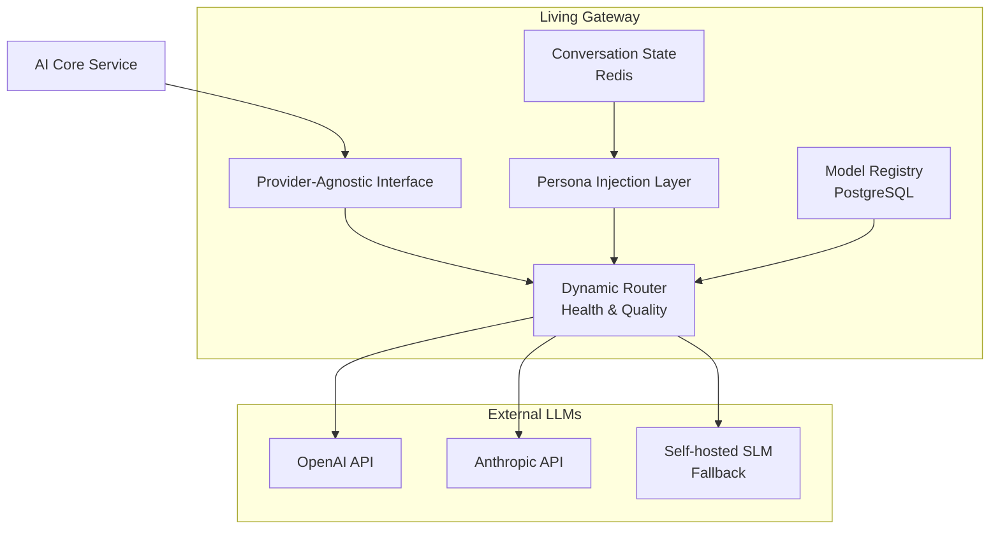

# 살아있는 게이트웨이 명세

| 항목 | 내용 |
|------|------|
| 문서 ID | AEG-CMP-20250917-1.0 |
| 버전 | 1.0 |
| 최종 수정일 | 2025년 9월 17일 |
| 작성자 | Dr. Aiden (수석 AI 시스템 아키텍트) |
| 상태 | 확정 (Finalized) |

## 1. 개요 (Overview)

본 문서는 '이지스(Aegis) 4대 원칙' 중 제 3원칙인 적응형 회복탄력성을 기술적으로 구현하는 '살아있는 게이트웨이(Living Gateway)'의 상세 아키텍처를 정의한다. 이 게이트웨이는 단순한 API 프록시를 넘어, 외부 LLM 제공사의 장애, 성능 저하, 정책 변경과 같은 통제 불가능한 위험으로부터 시스템을 보호하고, 사용자 경험의 일관성을 보장하는 능동적인 방어벽 역할을 수행한다.

## 2. 아키텍처 및 동작 흐름



## 3. 핵심 기능 1: LLM 제공사 추상화 (Provider-Agnostic Interface)
시스템 내부의 모든 서비스는 게이트웨이가 제공하는 단일 표준 인터페이스와 통신한다. 이를 통해 내부 서비스는 실제 호출되는 LLM이 OpenAI의 GPT-4o인지, Anthropic의 Claude 3인지 전혀 알 필요가 없다.

### 3.1. 표준 인터페이스 스키마

#### 요청 스키마
```json
{
  "session_id": "user123-sess456",
  "prompt": "경기도에서 카페 창업 자금을 찾고 있습니다",
  "config": {
    "temperature": 0.7,
    "max_tokens": 1000
  }
}
```

#### 응답 스키마
```json
{
  "content": "경기도 소상공인 특별경영자금을 추천드립니다...",
  "model_used": "gpt-4o",
  "latency_ms": 500,
  "tokens_used": 245
}
```

## 4. 핵심 기능 2: 동적 라우팅 및 자동 페일오버 (Dynamic Routing & Failover)
### 4.1. Model Registry

PostgreSQL에 모든 사용 가능한 LLM 모델의 메타데이터를 저장하고 관리하는 단일 진실 공급원.

#### 스키마 예시
```sql
CREATE TABLE llm_models (
    model_id VARCHAR(50) PRIMARY KEY,
    provider VARCHAR(50) NOT NULL,
    status VARCHAR(20) NOT NULL, -- ACTIVE, DEGRADED, INACTIVE
    cost_per_token DECIMAL(10,8),
    avg_latency_ms INTEGER,
    quality_score DECIMAL(3,2),
    last_health_check TIMESTAMPTZ
);
```

### 4.2. Health Checker

백그라운드에서 주기적으로 각 LLM API의 상태(응답 시간, 에러율)를 체크하고, Model Registry의 status를 실시간으로 업데이트한다.

### 4.3. 라우팅 규칙

- **Primary**: quality_score가 가장 높고 status가 ACTIVE인 모델을 선택한다.
- **Secondary**: Primary 모델의 status가 DEGRADED 또는 INACTIVE일 경우, 차순위 모델을 선택한다.
- **Fallback**: 모든 외부 API가 INACTIVE 상태인 최악의 경우, 내부적으로 호스팅되는 경량 모델(SLM)로 요청을 라우팅하여 서비스 중단을 방지한다.

## 5. 핵심 기능 3: 의미적 일관성 보장
### 5.1. 표준화된 대화 상태 (Standardized Conversation State)

대화 도중 LLM이 교체되더라도 맥락이 유지되도록, 대화 상태를 모델 중립적인 형식으로 Redis에 관리한다.

#### 상태 객체 스키마
```json
{
  "session_id": "user123-sess456",
  "user_profile": { 
    "region": "서울", 
    "business_type": "요식업",
    "startup_stage": "예비창업자"
  },
  "raw_history": [
    {"role": "user", "content": "카페 창업 자금을 찾고 있어요"},
    {"role": "assistant", "content": "어느 지역에서 창업을 계획하고 계신가요?"}
  ],
  "contextual_summary": "사용자는 서울 지역의 요식업 창업 자금에 대해 문의했으며, 초기 자본금과 보증 가능 여부에 관심이 많음."
}
```

#### 동작 방식
페일오버 시, 게이트웨이는 새로운 LLM에 전체 대화 기록이 아닌, contextual_summary와 최근 일부 대화 기록만을 전달하여 모델이 핵심 맥락을 빠르게 파악하고 일관된 답변을 생성하도록 유도한다.

### 5.2. 동적 페르소나 주입 (Dynamic Persona Injection)

Model Registry에 각 LLM 모델별로 최적화된 '페르소나 시스템 프롬프트'를 저장하고, 라우터가 모델을 선택할 때 해당 프롬프트를 자동으로 주입한다. 이를 통해 어떤 모델이 응답하더라도 AI 에이전트의 말투, 성격, 역할(Persona)이 일관되게 유지된다.

#### 페르소나 예시
```json
{
  "model_id": "gpt-4o",
  "persona_prompt": "당신은 소상공인을 위한 정책자금 전문 상담사입니다. 친근하고 전문적인 톤으로 답변하며, 복잡한 정책 용어는 쉽게 설명해주세요."
}
```

## 6. 구현 상세

### 6.1. Provider-Agnostic Interface 구현

```python
from abc import ABC, abstractmethod
from typing import Dict, Any, Optional
from dataclasses import dataclass
from enum import Enum

class ModelProvider(str, Enum):
    OPENAI = "openai"
    ANTHROPIC = "anthropic"
    SELF_HOSTED = "self_hosted"

@dataclass
class LLMRequest:
    """표준 LLM 요청"""
    session_id: str
    prompt: str
    config: Dict[str, Any]
    user_context: Optional[Dict[str, Any]] = None

@dataclass
class LLMResponse:
    """표준 LLM 응답"""
    content: str
    model_used: str
    provider: str
    latency_ms: int
    tokens_used: int
    cost: float

class LLMProvider(ABC):
    """LLM 제공자 추상 인터페이스"""
    
    @abstractmethod
    async def generate(self, request: LLMRequest) -> LLMResponse:
        """텍스트 생성"""
        pass
    
    @abstractmethod
    async def health_check(self) -> bool:
        """헬스 체크"""
        pass
    
    @abstractmethod
    def get_cost_per_token(self) -> float:
        """토큰당 비용"""
        pass

class OpenAIProvider(LLMProvider):
    """OpenAI 제공자 구현"""
    
    def __init__(self, api_key: str, model: str = "gpt-4o"):
        self.api_key = api_key
        self.model = model
        self.client = OpenAI(api_key=api_key)
    
    async def generate(self, request: LLMRequest) -> LLMResponse:
        """OpenAI API 호출"""
        start_time = time.time()
        
        try:
            response = await self.client.chat.completions.create(
                model=self.model,
                messages=[
                    {"role": "system", "content": self._get_system_prompt()},
                    {"role": "user", "content": request.prompt}
                ],
                temperature=request.config.get("temperature", 0.7),
                max_tokens=request.config.get("max_tokens", 1000)
            )
            
            latency_ms = int((time.time() - start_time) * 1000)
            
            return LLMResponse(
                content=response.choices[0].message.content,
                model_used=self.model,
                provider="openai",
                latency_ms=latency_ms,
                tokens_used=response.usage.total_tokens,
                cost=response.usage.total_tokens * self.get_cost_per_token()
            )
            
        except Exception as e:
            raise LLMProviderError(f"OpenAI API error: {str(e)}")
    
    async def health_check(self) -> bool:
        """OpenAI API 헬스 체크"""
        try:
            response = await self.client.chat.completions.create(
                model=self.model,
                messages=[{"role": "user", "content": "test"}],
                max_tokens=1
            )
            return True
        except:
            return False
    
    def get_cost_per_token(self) -> float:
        """토큰당 비용 (USD)"""
        cost_map = {
            "gpt-4o": 0.00003,
            "gpt-4o-mini": 0.00000015,
            "gpt-3.5-turbo": 0.000001
        }
        return cost_map.get(self.model, 0.00003)
```

### 6.2. Dynamic Router 구현

```python
class DynamicRouter:
    """동적 라우터"""
    
    def __init__(self, model_registry, health_checker):
        self.model_registry = model_registry
        self.health_checker = health_checker
        self.providers: Dict[str, LLMProvider] = {}
        self.fallback_provider: Optional[LLMProvider] = None
    
    def register_provider(self, model_id: str, provider: LLMProvider) -> None:
        """제공자 등록"""
        self.providers[model_id] = provider
    
    def set_fallback_provider(self, provider: LLMProvider) -> None:
        """폴백 제공자 설정"""
        self.fallback_provider = provider
    
    async def route_request(self, request: LLMRequest) -> LLMResponse:
        """요청 라우팅"""
        # 1. 최적 모델 선택
        selected_model = await self._select_best_model()
        
        if not selected_model:
            if self.fallback_provider:
                return await self.fallback_provider.generate(request)
            else:
                raise NoAvailableProviderError("No available LLM providers")
        
        # 2. 페르소나 주입
        enhanced_request = await self._inject_persona(request, selected_model)
        
        # 3. 요청 실행
        try:
            provider = self.providers[selected_model["model_id"]]
            response = await provider.generate(enhanced_request)
            
            # 4. 성공 메트릭 업데이트
            await self._update_success_metrics(selected_model["model_id"], response)
            
            return response
            
        except Exception as e:
            # 5. 실패 시 폴백 처리
            await self._handle_provider_failure(selected_model["model_id"], e)
            
            if self.fallback_provider:
                return await self.fallback_provider.generate(request)
            else:
                raise e
    
    async def _select_best_model(self) -> Optional[Dict[str, Any]]:
        """최적 모델 선택"""
        active_models = await self.model_registry.get_active_models()
        
        if not active_models:
            return None
        
        # 품질 점수와 가용성을 고려한 선택
        best_model = max(active_models, key=lambda m: (
            m["status"] == "ACTIVE",  # 활성 상태 우선
            m["quality_score"],       # 품질 점수
            -m["avg_latency_ms"]      # 낮은 지연시간 우선
        ))
        
        return best_model
    
    async def _inject_persona(self, request: LLMRequest, model: Dict[str, Any]) -> LLMRequest:
        """페르소나 주입"""
        persona_prompt = await self.model_registry.get_persona_prompt(model["model_id"])
        
        if persona_prompt:
            # 시스템 프롬프트와 사용자 프롬프트 결합
            enhanced_prompt = f"{persona_prompt}\n\nUser: {request.prompt}"
            request.prompt = enhanced_prompt
        
        return request
```

### 6.3. Conversation State Manager 구현

```python
import json
from typing import List, Dict, Any
from dataclasses import dataclass, asdict

@dataclass
class ConversationTurn:
    """대화 턴"""
    role: str  # "user" or "assistant"
    content: str
    timestamp: str
    model_used: Optional[str] = None

@dataclass
class ConversationState:
    """대화 상태"""
    session_id: str
    user_profile: Dict[str, Any]
    raw_history: List[ConversationTurn]
    contextual_summary: str
    last_model_used: Optional[str] = None
    created_at: str = ""
    updated_at: str = ""

class ConversationStateManager:
    """대화 상태 관리자"""
    
    def __init__(self, redis_client, summarizer_service):
        self.redis = redis_client
        self.summarizer = summarizer_service
        self.state_ttl = 86400  # 24시간
    
    async def get_conversation_state(self, session_id: str) -> Optional[ConversationState]:
        """대화 상태 조회"""
        cache_key = f"conversation:{session_id}"
        cached_data = await self.redis.get(cache_key)
        
        if cached_data:
            state_dict = json.loads(cached_data)
            return ConversationState(**state_dict)
        
        return None
    
    async def update_conversation_state(self, session_id: str, 
                                      new_turn: ConversationTurn,
                                      user_profile: Dict[str, Any]) -> ConversationState:
        """대화 상태 업데이트"""
        # 기존 상태 조회
        state = await self.get_conversation_state(session_id)
        
        if not state:
            # 새로운 대화 상태 생성
            state = ConversationState(
                session_id=session_id,
                user_profile=user_profile,
                raw_history=[],
                contextual_summary="",
                created_at=datetime.utcnow().isoformat()
            )
        
        # 새로운 턴 추가
        state.raw_history.append(new_turn)
        state.last_model_used = new_turn.model_used
        state.updated_at = datetime.utcnow().isoformat()
        
        # 대화 요약 업데이트 (5턴마다)
        if len(state.raw_history) % 5 == 0:
            state.contextual_summary = await self._generate_summary(state)
        
        # Redis에 저장
        await self._save_state(state)
        
        return state
    
    async def prepare_context_for_failover(self, session_id: str) -> Dict[str, Any]:
        """페일오버를 위한 컨텍스트 준비"""
        state = await self.get_conversation_state(session_id)
        
        if not state:
            return {}
        
        # 최근 3턴과 요약만 포함하여 컨텍스트 크기 최소화
        recent_history = state.raw_history[-3:] if len(state.raw_history) > 3 else state.raw_history
        
        return {
            "user_profile": state.user_profile,
            "contextual_summary": state.contextual_summary,
            "recent_history": [asdict(turn) for turn in recent_history]
        }
    
    async def _generate_summary(self, state: ConversationState) -> str:
        """대화 요약 생성"""
        conversation_text = "\n".join([
            f"{turn.role}: {turn.content}" for turn in state.raw_history
        ])
        
        summary_prompt = f"""
        다음 대화를 핵심 내용 중심으로 요약해주세요:
        
        {conversation_text}
        
        요약 시 다음 사항을 포함해주세요:
        - 사용자의 주요 관심사
        - 논의된 정책이나 자금 유형
        - 사용자의 특별한 요구사항이나 제약사항
        """
        
        return await self.summarizer.generate_summary(summary_prompt)
    
    async def _save_state(self, state: ConversationState) -> None:
        """상태 저장"""
        cache_key = f"conversation:{state.session_id}"
        state_json = json.dumps(asdict(state), ensure_ascii=False)
        
        await self.redis.setex(cache_key, self.state_ttl, state_json)
```

### 6.4. Health Checker 구현

```python
import asyncio
from datetime import datetime, timedelta

class HealthChecker:
    """헬스 체커"""
    
    def __init__(self, model_registry, providers: Dict[str, LLMProvider]):
        self.model_registry = model_registry
        self.providers = providers
        self.check_interval = 60  # 60초마다 체크
        self.running = False
    
    async def start_monitoring(self) -> None:
        """모니터링 시작"""
        self.running = True
        
        while self.running:
            await self._perform_health_checks()
            await asyncio.sleep(self.check_interval)
    
    def stop_monitoring(self) -> None:
        """모니터링 중지"""
        self.running = False
    
    async def _perform_health_checks(self) -> None:
        """헬스 체크 수행"""
        models = await self.model_registry.get_all_models()
        
        for model in models:
            model_id = model["model_id"]
            provider = self.providers.get(model_id)
            
            if not provider:
                continue
            
            # 헬스 체크 실행
            start_time = time.time()
            is_healthy = False
            
            try:
                is_healthy = await asyncio.wait_for(
                    provider.health_check(), 
                    timeout=10.0  # 10초 타임아웃
                )
                latency_ms = int((time.time() - start_time) * 1000)
            except asyncio.TimeoutError:
                latency_ms = 10000  # 타임아웃 시 10초로 설정
            except Exception:
                latency_ms = 10000
            
            # 상태 업데이트
            new_status = self._determine_status(is_healthy, latency_ms)
            
            await self.model_registry.update_model_health(
                model_id=model_id,
                status=new_status,
                latency_ms=latency_ms,
                last_check=datetime.utcnow()
            )
    
    def _determine_status(self, is_healthy: bool, latency_ms: int) -> str:
        """상태 결정"""
        if not is_healthy:
            return "INACTIVE"
        elif latency_ms > 5000:  # 5초 이상
            return "DEGRADED"
        else:
            return "ACTIVE"
```

## 7. 모니터링 및 관찰성

### 7.1. 메트릭 수집

```python
from prometheus_client import Counter, Histogram, Gauge

class LivingGatewayMetrics:
    """Living Gateway 메트릭"""
    
    def __init__(self):
        # 요청 관련 메트릭
        self.request_total = Counter(
            'llm_requests_total',
            'Total LLM requests',
            ['provider', 'model', 'status']
        )
        
        self.request_duration = Histogram(
            'llm_request_duration_seconds',
            'LLM request duration',
            ['provider', 'model']
        )
        
        self.token_usage = Counter(
            'llm_tokens_total',
            'Total tokens used',
            ['provider', 'model', 'type']  # type: input/output
        )
        
        # 비용 관련 메트릭
        self.cost_total = Counter(
            'llm_cost_total_usd',
            'Total LLM cost in USD',
            ['provider', 'model']
        )
        
        # 헬스 관련 메트릭
        self.provider_health = Gauge(
            'llm_provider_health',
            'LLM provider health status',
            ['provider', 'model']
        )
        
        # 페일오버 관련 메트릭
        self.failover_total = Counter(
            'llm_failover_total',
            'Total failover events',
            ['from_provider', 'to_provider', 'reason']
        )
    
    def record_request(self, provider: str, model: str, 
                      duration: float, tokens: int, cost: float, status: str) -> None:
        """요청 메트릭 기록"""
        self.request_total.labels(provider=provider, model=model, status=status).inc()
        self.request_duration.labels(provider=provider, model=model).observe(duration)
        self.token_usage.labels(provider=provider, model=model, type='total').inc(tokens)
        self.cost_total.labels(provider=provider, model=model).inc(cost)
    
    def record_failover(self, from_provider: str, to_provider: str, reason: str) -> None:
        """페일오버 메트릭 기록"""
        self.failover_total.labels(
            from_provider=from_provider,
            to_provider=to_provider,
            reason=reason
        ).inc()
```

이러한 Living Gateway를 통해 우리 시스템은 외부 LLM 제공사의 불안정성으로부터 보호받으며, 사용자에게 일관된 고품질 서비스를 제공할 수 있게 된다.

---

**📋 관련 문서**
- [이중 트랙 파이프라인](./01_DUAL_TRACK_PIPELINE.md)
- [Interactive AI Core](./02_INTERACTIVE_AI_CORE.md)
- [규칙 엔진](./04_RULE_ENGINE.md)
- [S.C.O.R.E. 프레임워크](./05_SCORE_FRAMEWORK.md)