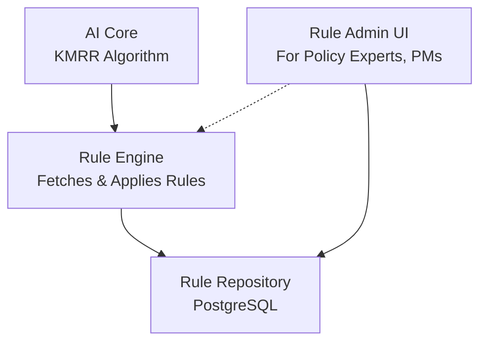

# 규칙 엔진 관리 시스템 명세

| 항목 | 내용 |
|------|------|
| 문서 ID | AEG-CMP-20250917-1.0 |
| 버전 | 1.0 |
| 최종 수정일 | 2025년 9월 17일 |
| 작성자 | Dr. Aiden (수석 AI 시스템 아키텍트) |
| 상태 | 확정 (Finalized) |

## 1. 개요 (Overview)

본 문서는 '이지스(Aegis) 4대 원칙' 중 제 4원칙인 외부화된 로직을 기술적으로 구현하는 '규칙 엔진 관리 시스템(Rule Engine Management System)'의 상세 아키텍처를 정의한다. 이 시스템의 목표는 KMRR 알고리즘에 사용되는 가중치, 부스트 인자, 자격 조건과 같은 비즈니스 규칙을 소스 코드에서 완전히 분리하여, 정책 전문가나 기획자가 직접 규칙을 관리하고 시스템의 행동을 유연하게 수정할 수 있도록 하는 것이다.

## 2. 아키텍처



## 3. 핵심 컴포넌트 1: 규칙 저장소 (Rule Repository)
모든 비즈니스 규칙은 PostgreSQL 데이터베이스에 '데이터'로서 저장되며, 시스템의 모든 행동 로직에 대한 단일 진실 공급원(Single Source of Truth) 역할을 한다.

### 3.1. rules 테이블 스키마 (DDL)
CREATE TYPE rule_action_type AS ENUM ('BOOST', 'PENALIZE', 'FILTER');

CREATE TABLE rules (
    rule_id UUID PRIMARY KEY DEFAULT gen_random_uuid(),
    rule_name VARCHAR(255) NOT NULL,
    description TEXT,
    
    -- 규칙이 적용될 조건 (JSON Logic 형식)
    conditions JSONB NOT NULL,
    
    -- 규칙이 발동했을 때 수행할 액션
    action rule_action_type NOT NULL,
    
    -- 액션에 필요한 파라미터 (e.g., {"factor": 1.2})
    parameters JSONB NOT NULL,
    
    -- 규칙 간 충돌 시 우선순위 (낮을수록 높음)
    priority INT NOT NULL DEFAULT 100,
    
    -- 규칙 활성화 여부
    is_active BOOLEAN NOT NULL DEFAULT TRUE,
    
    created_at TIMESTAMPTZ DEFAULT NOW(),
    updated_at TIMESTAMPTZ DEFAULT NOW(),
    
    -- 무결성 제약 조건
    CONSTRAINT valid_parameters CHECK (
        (action = 'BOOST' AND parameters ? 'factor') OR
        (action = 'PENALIZE' AND parameters ? 'factor') OR
        (action = 'FILTER')
    )
);

CREATE INDEX idx_rules_active_priority ON rules (is_active, priority);

3.2. conditions 필드 예시 (JSON Logic)
{
  "and": [
    { "==": [{ "var": "user.region" }, "서울"] },
    { "<": [{ "var": "user.startup_age" }, 3] },
    { "in": [{ "var": "doc.category" }, ["IT", "제조업"]] }
  ]
}

4. 핵심 컴포넌트 2: 규칙 관리자 UI (Functional Specification)
정책 전문가 등 비개발자가 규칙을 관리하기 위한 웹 기반 관리 도구의 필수 기능 명세.

규칙 CRUD: 직관적인 UI를 통해 규칙(조건, 액션, 파라미터 등)을 생성, 조회, 수정, 삭제할 수 있어야 한다.

활성화/비활성화: 단일 클릭으로 규칙을 켜고 끌 수 있는 토글 기능을 제공해야 한다.

시뮬레이션 ('Dry Run'): 규칙을 저장하기 전, 가상의 사용자 프로필과 문서 데이터를 입력하여 해당 규칙이 어떻게 동작할지 미리 테스트해볼 수 있는 '미리보기' 기능을 제공해야 한다.

버전 관리: 모든 규칙의 변경 이력을 추적하여, 언제 누가 무엇을 변경했는지 확인할 수 있고 필요시 이전 버전으로 롤백할 수 있어야 한다.

5. KMRR 알고리즘과의 통합
규칙 엔진이 도입됨에 따라, 02_INTERACTIVE_AI_CORE.md에 정의된 KMRR 알고리즘의 Rule 2: Soft Modulation 부분은 다음과 같이 진화한다.

# KMRR 알고리즘 내 수정된 부분

# ... Stage 2 ...
for doc, initial_score in candidates:
    # ... Rule 1: Hard Filtering ...
    
    # --- Rule 2: Dynamic Modulation via Rule Engine ---
    rerank_score = initial_score
    
    # 현재 사용자/문서 컨텍스트에 적용 가능한 모든 활성 규칙을 가져옴
    applicable_rules = rule_engine.get_applicable_rules(user=user_context, doc=doc)
    
    for rule in applicable_rules:
        if rule.action == 'BOOST':
            rerank_score *= rule.parameters['factor']
        elif rule.action == 'PENALIZE':
            rerank_score /= rule.parameters['factor'] # 혹은 차감 로직
            
    final_results.append((doc, rerank_score))

# ... Stage 3 ...

## 6. 구현 상세

### 6.1. 규칙 데이터 모델

```sql
CREATE TABLE rules (
    rule_id UUID PRIMARY KEY DEFAULT gen_random_uuid(),
    rule_name VARCHAR(255) NOT NULL,
    rule_type VARCHAR(50) NOT NULL, -- 'BOOST', 'FILTER', 'WEIGHT'
    conditions JSONB NOT NULL,      -- 규칙 적용 조건
    actions JSONB NOT NULL,         -- 규칙 실행 액션
    priority INTEGER DEFAULT 0,    -- 우선순위 (높을수록 먼저 적용)
    is_active BOOLEAN DEFAULT TRUE,
    created_at TIMESTAMPTZ DEFAULT NOW(),
    updated_at TIMESTAMPTZ DEFAULT NOW(),
    created_by VARCHAR(255),
    description TEXT
);

-- 인덱스
CREATE INDEX idx_rules_type_active ON rules (rule_type, is_active);
CREATE INDEX idx_rules_priority ON rules (priority DESC);
```

### 6.2. 규칙 데이터 예시

#### 부스트 규칙 예시
```json
{
  "rule_id": "boost-startup-funding",
  "rule_name": "창업자금 부스트",
  "rule_type": "BOOST",
  "conditions": {
    "user_profile.business_stage": "startup",
    "policy.category": "창업지원"
  },
  "actions": {
    "boost_factor": 1.3,
    "reason": "창업 단계에 특화된 정책"
  },
  "priority": 10,
  "is_active": true
}
```

#### 필터 규칙 예시
```json
{
  "rule_id": "filter-ineligible-region",
  "rule_name": "지역 부적격 필터",
  "rule_type": "FILTER",
  "conditions": {
    "user_profile.region": {"not_in": ["서울", "경기"]},
    "policy.target_regions": ["서울", "경기"]
  },
  "actions": {
    "exclude": true,
    "reason": "지역 자격 요건 미충족"
  },
  "priority": 100,
  "is_active": true
}
```

## 7. 핵심 컴포넌트 2: 규칙 엔진 (Rule Engine)

규칙 엔진은 저장된 규칙들을 실시간으로 평가하고 적용하는 핵심 컴포넌트이다.

### 7.1. 규칙 엔진 구현

```python
from typing import List, Dict, Any, Optional
from dataclasses import dataclass
from enum import Enum
import json

class RuleType(str, Enum):
    BOOST = "BOOST"          # 점수 증가
    PENALIZE = "PENALIZE"    # 점수 감소
    FILTER = "FILTER"        # 결과 필터링
    WEIGHT = "WEIGHT"        # 가중치 조정

@dataclass
class Rule:
    """규칙 데이터 클래스"""
    rule_id: str
    rule_name: str
    rule_type: RuleType
    conditions: Dict[str, Any]
    actions: Dict[str, Any]
    priority: int
    is_active: bool
    description: str

@dataclass
class RuleEvaluationContext:
    """규칙 평가 컨텍스트"""
    user_profile: Dict[str, Any]
    policy_metadata: Dict[str, Any]
    kg_facts: Dict[str, Any]
    current_score: float

@dataclass
class RuleResult:
    """규칙 적용 결과"""
    rule_id: str
    applied: bool
    new_score: Optional[float] = None
    exclude: bool = False
    reason: str = ""

class RuleEngine:
    """규칙 엔진"""
    
    def __init__(self, rule_repository):
        self.rule_repository = rule_repository
        self.condition_evaluator = ConditionEvaluator()
    
    async def evaluate_rules(self, context: RuleEvaluationContext) -> List[RuleResult]:
        """규칙 평가 및 적용"""
        # 활성 규칙 조회 (우선순위 순)
        active_rules = await self.rule_repository.get_active_rules_by_priority()
        
        results = []
        current_score = context.current_score
        should_exclude = False
        
        for rule in active_rules:
            # 규칙 조건 평가
            if await self._evaluate_conditions(rule, context):
                # 규칙 액션 적용
                result = await self._apply_rule_actions(rule, context, current_score)
                results.append(result)
                
                # 점수 업데이트
                if result.new_score is not None:
                    current_score = result.new_score
                
                # 제외 처리
                if result.exclude:
                    should_exclude = True
                    break
        
        return results
    
    async def _evaluate_conditions(self, rule: Rule, context: RuleEvaluationContext) -> bool:
        """규칙 조건 평가"""
        return await self.condition_evaluator.evaluate(
            conditions=rule.conditions,
            context=context
        )
    
    async def _apply_rule_actions(self, rule: Rule, context: RuleEvaluationContext, 
                                current_score: float) -> RuleResult:
        """규칙 액션 적용"""
        actions = rule.actions
        
        if rule.rule_type == RuleType.BOOST:
            boost_factor = actions.get("boost_factor", 1.0)
            new_score = current_score * boost_factor
            
            return RuleResult(
                rule_id=rule.rule_id,
                applied=True,
                new_score=new_score,
                reason=actions.get("reason", f"부스트 적용: {boost_factor}x")
            )
        
        elif rule.rule_type == RuleType.PENALIZE:
            penalty_factor = actions.get("penalty_factor", 1.0)
            new_score = current_score / penalty_factor
            
            return RuleResult(
                rule_id=rule.rule_id,
                applied=True,
                new_score=new_score,
                reason=actions.get("reason", f"페널티 적용: /{penalty_factor}")
            )
        
        elif rule.rule_type == RuleType.FILTER:
            should_exclude = actions.get("exclude", False)
            
            return RuleResult(
                rule_id=rule.rule_id,
                applied=True,
                exclude=should_exclude,
                reason=actions.get("reason", "필터 규칙 적용")
            )
        
        elif rule.rule_type == RuleType.WEIGHT:
            weight_adjustment = actions.get("weight_adjustment", 0.0)
            new_score = current_score + weight_adjustment
            
            return RuleResult(
                rule_id=rule.rule_id,
                applied=True,
                new_score=new_score,
                reason=actions.get("reason", f"가중치 조정: +{weight_adjustment}")
            )
        
        return RuleResult(
            rule_id=rule.rule_id,
            applied=False,
            reason="알 수 없는 규칙 타입"
        )

class ConditionEvaluator:
    """조건 평가자"""
    
    async def evaluate(self, conditions: Dict[str, Any], 
                      context: RuleEvaluationContext) -> bool:
        """조건 평가"""
        for condition_path, expected_value in conditions.items():
            actual_value = self._get_value_by_path(condition_path, context)
            
            if not self._compare_values(actual_value, expected_value):
                return False
        
        return True
    
    def _get_value_by_path(self, path: str, context: RuleEvaluationContext) -> Any:
        """경로로 값 조회"""
        parts = path.split('.')
        
        if parts[0] == "user_profile":
            return self._navigate_dict(context.user_profile, parts[1:])
        elif parts[0] == "policy":
            return self._navigate_dict(context.policy_metadata, parts[1:])
        elif parts[0] == "kg_facts":
            return self._navigate_dict(context.kg_facts, parts[1:])
        
        return None
    
    def _navigate_dict(self, data: Dict[str, Any], path_parts: List[str]) -> Any:
        """딕셔너리 네비게이션"""
        current = data
        
        for part in path_parts:
            if isinstance(current, dict) and part in current:
                current = current[part]
            else:
                return None
        
        return current
    
    def _compare_values(self, actual: Any, expected: Any) -> bool:
        """값 비교"""
        if isinstance(expected, dict):
            # 복합 조건 처리
            if "in" in expected:
                return actual in expected["in"]
            elif "not_in" in expected:
                return actual not in expected["not_in"]
            elif "gt" in expected:
                return actual > expected["gt"]
            elif "lt" in expected:
                return actual < expected["lt"]
            elif "gte" in expected:
                return actual >= expected["gte"]
            elif "lte" in expected:
                return actual <= expected["lte"]
        
        # 단순 동등 비교
        return actual == expected
```

### 7.2. 규칙 저장소 구현

```python
import asyncpg
from typing import List, Optional

class RuleRepository:
    """규칙 저장소"""
    
    def __init__(self, db_connection):
        self.db = db_connection
    
    async def get_active_rules_by_priority(self) -> List[Rule]:
        """우선순위 순으로 활성 규칙 조회"""
        query = """
        SELECT rule_id, rule_name, rule_type, conditions, actions, 
               priority, is_active, description
        FROM rules 
        WHERE is_active = TRUE 
        ORDER BY priority DESC, created_at ASC
        """
        
        rows = await self.db.fetch(query)
        
        return [
            Rule(
                rule_id=row['rule_id'],
                rule_name=row['rule_name'],
                rule_type=RuleType(row['rule_type']),
                conditions=row['conditions'],
                actions=row['actions'],
                priority=row['priority'],
                is_active=row['is_active'],
                description=row['description']
            )
            for row in rows
        ]
    
    async def create_rule(self, rule: Rule) -> str:
        """규칙 생성"""
        query = """
        INSERT INTO rules (rule_name, rule_type, conditions, actions, 
                          priority, is_active, description, created_by)
        VALUES ($1, $2, $3, $4, $5, $6, $7, $8)
        RETURNING rule_id
        """
        
        rule_id = await self.db.fetchval(
            query,
            rule.rule_name,
            rule.rule_type.value,
            json.dumps(rule.conditions),
            json.dumps(rule.actions),
            rule.priority,
            rule.is_active,
            rule.description,
            "system"  # created_by
        )
        
        return str(rule_id)
    
    async def update_rule(self, rule_id: str, updates: Dict[str, Any]) -> bool:
        """규칙 업데이트"""
        set_clauses = []
        values = []
        
        for key, value in updates.items():
            if key in ['conditions', 'actions']:
                value = json.dumps(value)
            
            set_clauses.append(f"{key} = ${len(values) + 1}")
            values.append(value)
        
        if not set_clauses:
            return False
        
        query = f"""
        UPDATE rules 
        SET {', '.join(set_clauses)}, updated_at = NOW()
        WHERE rule_id = ${len(values) + 1}
        """
        
        values.append(rule_id)
        
        result = await self.db.execute(query, *values)
        return result == "UPDATE 1"
    
    async def delete_rule(self, rule_id: str) -> bool:
        """규칙 삭제 (비활성화)"""
        query = """
        UPDATE rules 
        SET is_active = FALSE, updated_at = NOW()
        WHERE rule_id = $1
        """
        
        result = await self.db.execute(query, rule_id)
        return result == "UPDATE 1"
```

## 8. 핵심 컴포넌트 3: 규칙 관리 UI (Rule Admin UI)

### 8.1. 웹 기반 규칙 관리 인터페이스

```python
from fastapi import FastAPI, HTTPException, Depends
from pydantic import BaseModel
from typing import List, Dict, Any, Optional

app = FastAPI(title="Rule Management API")

class RuleCreateRequest(BaseModel):
    rule_name: str
    rule_type: str
    conditions: Dict[str, Any]
    actions: Dict[str, Any]
    priority: int = 0
    description: str = ""

class RuleUpdateRequest(BaseModel):
    rule_name: Optional[str] = None
    conditions: Optional[Dict[str, Any]] = None
    actions: Optional[Dict[str, Any]] = None
    priority: Optional[int] = None
    is_active: Optional[bool] = None
    description: Optional[str] = None

@app.get("/rules")
async def list_rules(rule_repository: RuleRepository = Depends()) -> List[Dict[str, Any]]:
    """규칙 목록 조회"""
    rules = await rule_repository.get_all_rules()
    
    return [
        {
            "rule_id": rule.rule_id,
            "rule_name": rule.rule_name,
            "rule_type": rule.rule_type.value,
            "conditions": rule.conditions,
            "actions": rule.actions,
            "priority": rule.priority,
            "is_active": rule.is_active,
            "description": rule.description
        }
        for rule in rules
    ]

@app.post("/rules")
async def create_rule(request: RuleCreateRequest, 
                     rule_repository: RuleRepository = Depends()) -> Dict[str, str]:
    """규칙 생성"""
    rule = Rule(
        rule_id="",  # DB에서 생성
        rule_name=request.rule_name,
        rule_type=RuleType(request.rule_type),
        conditions=request.conditions,
        actions=request.actions,
        priority=request.priority,
        is_active=True,
        description=request.description
    )
    
    rule_id = await rule_repository.create_rule(rule)
    
    return {"rule_id": rule_id, "message": "규칙이 생성되었습니다."}

@app.put("/rules/{rule_id}")
async def update_rule(rule_id: str, request: RuleUpdateRequest,
                     rule_repository: RuleRepository = Depends()) -> Dict[str, str]:
    """규칙 업데이트"""
    updates = {k: v for k, v in request.dict().items() if v is not None}
    
    success = await rule_repository.update_rule(rule_id, updates)
    
    if not success:
        raise HTTPException(status_code=404, detail="규칙을 찾을 수 없습니다.")
    
    return {"message": "규칙이 업데이트되었습니다."}

@app.delete("/rules/{rule_id}")
async def delete_rule(rule_id: str, 
                     rule_repository: RuleRepository = Depends()) -> Dict[str, str]:
    """규칙 삭제"""
    success = await rule_repository.delete_rule(rule_id)
    
    if not success:
        raise HTTPException(status_code=404, detail="규칙을 찾을 수 없습니다.")
    
    return {"message": "규칙이 삭제되었습니다."}

@app.post("/rules/test")
async def test_rule(rule_data: Dict[str, Any], 
                   test_context: Dict[str, Any]) -> Dict[str, Any]:
    """규칙 테스트"""
    # 테스트용 규칙 생성
    rule = Rule(
        rule_id="test",
        rule_name="테스트 규칙",
        rule_type=RuleType(rule_data["rule_type"]),
        conditions=rule_data["conditions"],
        actions=rule_data["actions"],
        priority=0,
        is_active=True,
        description="테스트용 규칙"
    )
    
    # 테스트 컨텍스트 생성
    context = RuleEvaluationContext(
        user_profile=test_context.get("user_profile", {}),
        policy_metadata=test_context.get("policy_metadata", {}),
        kg_facts=test_context.get("kg_facts", {}),
        current_score=test_context.get("current_score", 1.0)
    )
    
    # 규칙 엔진으로 테스트
    rule_engine = RuleEngine(None)  # 테스트용이므로 repository 없음
    
    # 조건 평가
    condition_met = await rule_engine._evaluate_conditions(rule, context)
    
    result = None
    if condition_met:
        result = await rule_engine._apply_rule_actions(rule, context, context.current_score)
    
    return {
        "condition_met": condition_met,
        "result": {
            "applied": result.applied if result else False,
            "new_score": result.new_score if result else None,
            "exclude": result.exclude if result else False,
            "reason": result.reason if result else ""
        } if result else None
    }
```

## 9. 실제 사용 예시

### 9.1. KMRR 알고리즘과의 통합

```python
class KMRRWithRuleEngine:
    """규칙 엔진이 통합된 KMRR 알고리즘"""
    
    def __init__(self, milvus_client, neo4j_client, rule_engine):
        self.milvus = milvus_client
        self.neo4j = neo4j_client
        self.rule_engine = rule_engine
    
    async def search_and_rank(self, query: str, user_context: Dict[str, Any]) -> List[Dict[str, Any]]:
        """검색 및 규칙 기반 재순위화"""
        
        # 1. 벡터 검색으로 후보 선별
        candidates = await self._vector_search(query, user_context)
        
        # 2. 각 후보에 대해 규칙 적용
        final_results = []
        
        for candidate in candidates:
            # KG에서 사실 조회
            kg_facts = await self._get_kg_facts(candidate["document_id"], user_context)
            
            # 규칙 평가 컨텍스트 생성
            context = RuleEvaluationContext(
                user_profile=user_context,
                policy_metadata=candidate["metadata"],
                kg_facts=kg_facts,
                current_score=candidate["similarity_score"]
            )
            
            # 규칙 엔진으로 점수 조정
            rule_results = await self.rule_engine.evaluate_rules(context)
            
            # 제외 규칙 확인
            should_exclude = any(result.exclude for result in rule_results if result.applied)
            
            if should_exclude:
                continue
            
            # 최종 점수 계산
            final_score = context.current_score
            applied_rules = []
            
            for result in rule_results:
                if result.applied and result.new_score is not None:
                    final_score = result.new_score
                    applied_rules.append({
                        "rule_id": result.rule_id,
                        "reason": result.reason
                    })
            
            final_results.append({
                "document_id": candidate["document_id"],
                "content": candidate["content"],
                "original_score": candidate["similarity_score"],
                "final_score": final_score,
                "applied_rules": applied_rules,
                "metadata": candidate["metadata"]
            })
        
        # 최종 점수로 정렬
        return sorted(final_results, key=lambda x: x["final_score"], reverse=True)
```

이러한 규칙 엔진을 통해 우리 시스템은 코드 수정 없이도 비즈니스 로직을 유연하게 조정할 수 있으며, 정책 전문가들이 직접 시스템의 행동을 제어할 수 있게 된다.

---

**📋 관련 문서**
- [이중 트랙 파이프라인](./01_DUAL_TRACK_PIPELINE.md)
- [Interactive AI Core](./02_INTERACTIVE_AI_CORE.md)
- [살아있는 게이트웨이](./03_LIVING_GATEWAY.md)
- [S.C.O.R.E. 프레임워크](./05_SCORE_FRAMEWORK.md)