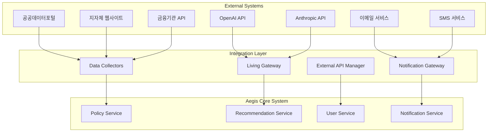

# 이지스(Aegis) 외부 연동 명세서

| 항목 | 내용 |
|------|------|
| 문서 ID | AEG-API-20250917-1.0 |
| 버전 | 1.0 |
| 최종 수정일 | 2025년 9월 17일 |
| 작성자 | Dr. Aiden (수석 AI 시스템 아키텍트) |
| 상태 | 확정 (Finalized) |

## 1. 개요 (Overview)

본 문서는 이지스 시스템이 외부 시스템 및 서비스와 연동하는 모든 인터페이스를 정의한다. **살아있는 게이트웨이(Living Gateway)**를 통한 LLM 연동, **이중 트랙 파이프라인**을 통한 데이터 소스 연동, 그리고 각종 외부 API와의 안전하고 효율적인 통합 방법을 명시한다.

## 2. 연동 아키텍처 개요

### 2.1. 외부 연동 계층 구조



### 2.2. 연동 원칙

#### 안정성 우선 (Reliability First)
- **Circuit Breaker 패턴**: 외부 서비스 장애 시 자동 차단
- **Retry with Backoff**: 지수 백오프를 통한 재시도
- **Timeout 관리**: 적절한 타임아웃 설정으로 리소스 보호

#### 보안 강화 (Security Enhanced)
- **API 키 관리**: 안전한 인증 정보 저장 및 순환
- **Rate Limiting**: 외부 API 호출 제한 준수
- **데이터 검증**: 외부에서 받은 모든 데이터 검증

#### 모니터링 및 관찰가능성 (Observability)
- **연동 상태 모니터링**: 실시간 외부 서비스 상태 추적
- **성능 메트릭**: 응답 시간, 성공률, 에러율 측정
- **알림 시스템**: 연동 장애 시 즉시 알림

## 3. LLM 서비스 연동 (Living Gateway)

### 3.1. 지원 LLM 제공사

| 제공사 | 모델 | 용도 | 우선순위 |
|--------|------|------|----------|
| **OpenAI** | GPT-4o, GPT-4o-mini | 주요 추천 생성 | 1 |
| **Anthropic** | Claude 3.5 Sonnet | 백업 및 비교 | 2 |
| **Google** | Gemini Pro | 특수 용도 | 3 |
| **Self-hosted** | Llama 3.1 8B | 폴백 모델 | 4 |

### 3.2. Living Gateway 구현

```python
from abc import ABC, abstractmethod
from typing import Dict, Any, Optional, List
import asyncio
import aiohttp
from enum import Enum

class LLMProvider(str, Enum):
    OPENAI = "openai"
    ANTHROPIC = "anthropic"
    GOOGLE = "google"
    SELF_HOSTED = "self_hosted"

class LLMResponse(BaseModel):
    content: str
    model_used: str
    provider: LLMProvider
    tokens_used: int
    latency_ms: int
    confidence_score: Optional[float] = None

class BaseLLMClient(ABC):
    """LLM 클라이언트 기본 클래스"""
    
    @abstractmethod
    async def generate_response(self, prompt: str, **kwargs) -> LLMResponse:
        pass
    
    @abstractmethod
    async def health_check(self) -> bool:
        pass

class OpenAIClient(BaseLLMClient):
    """OpenAI API 클라이언트"""
    
    def __init__(self, api_key: str, model: str = "gpt-4o"):
        self.api_key = api_key
        self.model = model
        self.base_url = "https://api.openai.com/v1"
        self.session = None
    
    async def generate_response(self, prompt: str, **kwargs) -> LLMResponse:
        """OpenAI API 호출"""
        if not self.session:
            self.session = aiohttp.ClientSession()
        
        headers = {
            "Authorization": f"Bearer {self.api_key}",
            "Content-Type": "application/json"
        }
        
        payload = {
            "model": self.model,
            "messages": [{"role": "user", "content": prompt}],
            "temperature": kwargs.get("temperature", 0.7),
            "max_tokens": kwargs.get("max_tokens", 1000)
        }
        
        start_time = asyncio.get_event_loop().time()
        
        try:
            async with self.session.post(
                f"{self.base_url}/chat/completions",
                headers=headers,
                json=payload,
                timeout=aiohttp.ClientTimeout(total=30)
            ) as response:
                if response.status != 200:
                    raise LLMAPIError(f"OpenAI API error: {response.status}")
                
                data = await response.json()
                latency_ms = int((asyncio.get_event_loop().time() - start_time) * 1000)
                
                return LLMResponse(
                    content=data["choices"][0]["message"]["content"],
                    model_used=self.model,
                    provider=LLMProvider.OPENAI,
                    tokens_used=data["usage"]["total_tokens"],
                    latency_ms=latency_ms
                )
        
        except asyncio.TimeoutError:
            raise LLMTimeoutError("OpenAI API timeout")
        except Exception as e:
            raise LLMAPIError(f"OpenAI API error: {str(e)}")
    
    async def health_check(self) -> bool:
        """OpenAI API 상태 확인"""
        try:
            await self.generate_response("Hello", max_tokens=5)
            return True
        except:
            return False

class AnthropicClient(BaseLLMClient):
    """Anthropic API 클라이언트"""
    
    def __init__(self, api_key: str, model: str = "claude-3-5-sonnet-20241022"):
        self.api_key = api_key
        self.model = model
        self.base_url = "https://api.anthropic.com/v1"
        self.session = None
    
    async def generate_response(self, prompt: str, **kwargs) -> LLMResponse:
        """Anthropic API 호출"""
        if not self.session:
            self.session = aiohttp.ClientSession()
        
        headers = {
            "x-api-key": self.api_key,
            "Content-Type": "application/json",
            "anthropic-version": "2023-06-01"
        }
        
        payload = {
            "model": self.model,
            "max_tokens": kwargs.get("max_tokens", 1000),
            "messages": [{"role": "user", "content": prompt}]
        }
        
        start_time = asyncio.get_event_loop().time()
        
        try:
            async with self.session.post(
                f"{self.base_url}/messages",
                headers=headers,
                json=payload,
                timeout=aiohttp.ClientTimeout(total=30)
            ) as response:
                if response.status != 200:
                    raise LLMAPIError(f"Anthropic API error: {response.status}")
                
                data = await response.json()
                latency_ms = int((asyncio.get_event_loop().time() - start_time) * 1000)
                
                return LLMResponse(
                    content=data["content"][0]["text"],
                    model_used=self.model,
                    provider=LLMProvider.ANTHROPIC,
                    tokens_used=data["usage"]["input_tokens"] + data["usage"]["output_tokens"],
                    latency_ms=latency_ms
                )
        
        except asyncio.TimeoutError:
            raise LLMTimeoutError("Anthropic API timeout")
        except Exception as e:
            raise LLMAPIError(f"Anthropic API error: {str(e)}")

class LivingGateway:
    """살아있는 게이트웨이 - LLM 통합 관리"""
    
    def __init__(self):
        self.clients: Dict[LLMProvider, BaseLLMClient] = {}
        self.health_status: Dict[LLMProvider, bool] = {}
        self.circuit_breakers: Dict[LLMProvider, CircuitBreaker] = {}
        self.model_registry = ModelRegistry()
        
    def register_client(self, provider: LLMProvider, client: BaseLLMClient):
        """LLM 클라이언트 등록"""
        self.clients[provider] = client
        self.circuit_breakers[provider] = CircuitBreaker(
            failure_threshold=5,
            recovery_timeout=60,
            expected_exception=LLMAPIError
        )
    
    async def generate_response(self, prompt: str, **kwargs) -> LLMResponse:
        """최적 LLM을 선택하여 응답 생성"""
        # 1. 사용 가능한 모델 선택
        available_providers = await self.get_available_providers()
        
        if not available_providers:
            raise NoAvailableLLMError("No LLM providers available")
        
        # 2. 우선순위에 따라 시도
        for provider in available_providers:
            try:
                circuit_breaker = self.circuit_breakers[provider]
                
                async with circuit_breaker:
                    client = self.clients[provider]
                    response = await client.generate_response(prompt, **kwargs)
                    
                    # 성공 시 메트릭 기록
                    await self.record_success_metric(provider, response.latency_ms)
                    return response
                    
            except CircuitBreakerOpenError:
                logger.warning(f"Circuit breaker open for {provider}")
                continue
            except Exception as e:
                logger.error(f"LLM error for {provider}: {e}")
                await self.record_error_metric(provider, str(e))
                continue
        
        raise AllLLMProvidersFailedError("All LLM providers failed")
    
    async def get_available_providers(self) -> List[LLMProvider]:
        """사용 가능한 LLM 제공사 목록"""
        available = []
        
        for provider, client in self.clients.items():
            # Circuit Breaker 상태 확인
            if self.circuit_breakers[provider].state == CircuitBreakerState.OPEN:
                continue
            
            # 헬스체크 결과 확인 (캐시된 결과 사용)
            if self.health_status.get(provider, False):
                available.append(provider)
        
        # 우선순위 정렬
        priority_order = [
            LLMProvider.OPENAI,
            LLMProvider.ANTHROPIC,
            LLMProvider.GOOGLE,
            LLMProvider.SELF_HOSTED
        ]
        
        return sorted(available, key=lambda x: priority_order.index(x))
    
    async def health_check_all(self):
        """모든 LLM 제공사 헬스체크"""
        tasks = []
        for provider, client in self.clients.items():
            tasks.append(self.health_check_provider(provider, client))
        
        await asyncio.gather(*tasks, return_exceptions=True)
    
    async def health_check_provider(self, provider: LLMProvider, client: BaseLLMClient):
        """개별 LLM 제공사 헬스체크"""
        try:
            is_healthy = await client.health_check()
            self.health_status[provider] = is_healthy
            
            if is_healthy:
                logger.info(f"LLM provider {provider} is healthy")
            else:
                logger.warning(f"LLM provider {provider} is unhealthy")
                
        except Exception as e:
            logger.error(f"Health check failed for {provider}: {e}")
            self.health_status[provider] = False

class CircuitBreaker:
    """Circuit Breaker 패턴 구현"""
    
    def __init__(self, failure_threshold: int = 5, recovery_timeout: int = 60,
                 expected_exception: Exception = Exception):
        self.failure_threshold = failure_threshold
        self.recovery_timeout = recovery_timeout
        self.expected_exception = expected_exception
        
        self.failure_count = 0
        self.last_failure_time = None
        self.state = CircuitBreakerState.CLOSED
    
    async def __aenter__(self):
        if self.state == CircuitBreakerState.OPEN:
            if self._should_attempt_reset():
                self.state = CircuitBreakerState.HALF_OPEN
            else:
                raise CircuitBreakerOpenError("Circuit breaker is open")
        
        return self
    
    async def __aexit__(self, exc_type, exc_val, exc_tb):
        if exc_type is None:
            # 성공
            self._on_success()
        elif issubclass(exc_type, self.expected_exception):
            # 예상된 예외
            self._on_failure()
        
        return False
    
    def _should_attempt_reset(self) -> bool:
        """재시도 가능 여부 확인"""
        return (
            self.last_failure_time and
            time.time() - self.last_failure_time >= self.recovery_timeout
        )
    
    def _on_success(self):
        """성공 시 처리"""
        self.failure_count = 0
        self.state = CircuitBreakerState.CLOSED
    
    def _on_failure(self):
        """실패 시 처리"""
        self.failure_count += 1
        self.last_failure_time = time.time()
        
        if self.failure_count >= self.failure_threshold:
            self.state = CircuitBreakerState.OPEN

class CircuitBreakerState(Enum):
    CLOSED = "closed"
    OPEN = "open"
    HALF_OPEN = "half_open"
```

## 4. 데이터 소스 연동

### 4.1. 공공데이터포털 연동

```python
class PublicDataPortalClient:
    """공공데이터포털 API 클라이언트"""
    
    def __init__(self, service_key: str):
        self.service_key = service_key
        self.base_url = "https://apis.data.go.kr"
        self.session = None
    
    async def fetch_policy_data(self, page: int = 1, num_of_rows: int = 100) -> List[Dict]:
        """정책 데이터 조회"""
        if not self.session:
            self.session = aiohttp.ClientSession()
        
        params = {
            "serviceKey": self.service_key,
            "pageNo": page,
            "numOfRows": num_of_rows,
            "resultType": "json"
        }
        
        try:
            async with self.session.get(
                f"{self.base_url}/1262000/PolicyInfoService/getPolicyInfo",
                params=params,
                timeout=aiohttp.ClientTimeout(total=30)
            ) as response:
                if response.status != 200:
                    raise DataSourceError(f"Public data portal error: {response.status}")
                
                data = await response.json()
                
                # 응답 구조 검증
                if "response" not in data or "body" not in data["response"]:
                    raise DataSourceError("Invalid response structure")
                
                items = data["response"]["body"].get("items", [])
                return self._transform_policy_data(items)
        
        except asyncio.TimeoutError:
            raise DataSourceTimeoutError("Public data portal timeout")
        except Exception as e:
            raise DataSourceError(f"Public data portal error: {str(e)}")
    
    def _transform_policy_data(self, raw_items: List[Dict]) -> List[Dict]:
        """원시 데이터를 표준 형식으로 변환"""
        transformed = []
        
        for item in raw_items:
            try:
                policy = {
                    "external_id": item.get("policyId"),
                    "title": item.get("policyNm", "").strip(),
                    "content": item.get("policyCn", "").strip(),
                    "issuing_organization": item.get("mngtMson", "").strip(),
                    "category": self._map_category(item.get("policyTpCd")),
                    "target_regions": self._parse_regions(item.get("rgnCd")),
                    "target_age": self._parse_age_range(item.get("ageInfo")),
                    "application_start_date": self._parse_date(item.get("rqutPrdCn")),
                    "application_end_date": self._parse_date(item.get("rqutPrdCn")),
                    "original_url": item.get("rfrncUrla1"),
                    "source_system": "public_data_portal",
                    "raw_data": item,
                    "collected_at": datetime.utcnow().isoformat()
                }
                
                # 필수 필드 검증
                if policy["title"] and policy["content"]:
                    transformed.append(policy)
                    
            except Exception as e:
                logger.warning(f"Failed to transform policy item: {e}")
                continue
        
        return transformed
    
    def _map_category(self, policy_type_code: str) -> str:
        """정책 유형 코드를 카테고리로 매핑"""
        category_mapping = {
            "023010": "창업지원",
            "023020": "운영자금",
            "023030": "시설자금",
            "023040": "기술개발",
            "023050": "마케팅",
            "023060": "수출지원"
        }
        return category_mapping.get(policy_type_code, "기타")
```

### 4.2. 지자체 웹사이트 크롤링

```python
from bs4 import BeautifulSoup
import aiohttp
from typing import List, Dict

class LocalGovWebScraper:
    """지자체 웹사이트 크롤러"""
    
    def __init__(self):
        self.scrapers = {
            "seoul": SeoulScraper(),
            "gyeonggi": GyeonggiScraper(),
            "busan": BusanScraper()
        }
    
    async def scrape_all_regions(self) -> List[Dict]:
        """모든 지역 데이터 수집"""
        all_policies = []
        
        for region, scraper in self.scrapers.items():
            try:
                policies = await scraper.scrape_policies()
                logger.info(f"Scraped {len(policies)} policies from {region}")
                all_policies.extend(policies)
                
                # 요청 간격 준수
                await asyncio.sleep(2)
                
            except Exception as e:
                logger.error(f"Failed to scrape {region}: {e}")
                continue
        
        return all_policies

class SeoulScraper:
    """서울시 웹사이트 크롤러"""
    
    def __init__(self):
        self.base_url = "https://www.seoul.go.kr"
        self.session = None
    
    async def scrape_policies(self) -> List[Dict]:
        """서울시 정책 데이터 수집"""
        if not self.session:
            self.session = aiohttp.ClientSession()
        
        policies = []
        
        # 정책 목록 페이지 조회
        list_url = f"{self.base_url}/seoul/policy/business.do"
        
        try:
            async with self.session.get(list_url) as response:
                if response.status != 200:
                    raise ScrapingError(f"Seoul website error: {response.status}")
                
                html = await response.text()
                soup = BeautifulSoup(html, 'html.parser')
                
                # 정책 링크 추출
                policy_links = soup.find_all('a', class_='policy-link')
                
                for link in policy_links[:10]:  # 최대 10개만 처리
                    policy_url = urljoin(self.base_url, link.get('href'))
                    policy_data = await self.scrape_policy_detail(policy_url)
                    
                    if policy_data:
                        policies.append(policy_data)
                    
                    # 요청 간격 준수
                    await asyncio.sleep(1)
        
        except Exception as e:
            logger.error(f"Seoul scraping error: {e}")
            raise ScrapingError(f"Seoul scraping failed: {str(e)}")
        
        return policies
    
    async def scrape_policy_detail(self, url: str) -> Optional[Dict]:
        """개별 정책 상세 정보 수집"""
        try:
            async with self.session.get(url) as response:
                if response.status != 200:
                    return None
                
                html = await response.text()
                soup = BeautifulSoup(html, 'html.parser')
                
                # 정책 정보 추출
                title = soup.find('h1', class_='policy-title')
                content = soup.find('div', class_='policy-content')
                organization = soup.find('span', class_='organization')
                
                if not (title and content):
                    return None
                
                return {
                    "title": title.get_text().strip(),
                    "content": content.get_text().strip(),
                    "issuing_organization": organization.get_text().strip() if organization else "서울특별시",
                    "target_regions": ["11"],  # 서울시 코드
                    "original_url": url,
                    "source_system": "seoul_website",
                    "collected_at": datetime.utcnow().isoformat()
                }
        
        except Exception as e:
            logger.warning(f"Failed to scrape policy detail from {url}: {e}")
            return None
```

### 4.3. 금융기관 API 연동

```python
class FinancialInstitutionClient:
    """금융기관 API 클라이언트"""
    
    def __init__(self):
        self.clients = {
            "kodit": KoditClient(),  # 기술보증기금
            "kosmes": KosmesClient(),  # 소상공인시장진흥공단
            "sbc": SbcClient()  # 서울신용보증재단
        }
    
    async def fetch_guarantee_products(self) -> List[Dict]:
        """보증 상품 정보 조회"""
        all_products = []
        
        for institution, client in self.clients.items():
            try:
                products = await client.get_products()
                logger.info(f"Fetched {len(products)} products from {institution}")
                all_products.extend(products)
                
            except Exception as e:
                logger.error(f"Failed to fetch from {institution}: {e}")
                continue
        
        return all_products

class KoditClient:
    """기술보증기금 API 클라이언트"""
    
    def __init__(self):
        self.api_key = settings.KODIT_API_KEY
        self.base_url = "https://api.kodit.co.kr"
        self.session = None
    
    async def get_products(self) -> List[Dict]:
        """보증 상품 목록 조회"""
        if not self.session:
            self.session = aiohttp.ClientSession()
        
        headers = {
            "Authorization": f"Bearer {self.api_key}",
            "Content-Type": "application/json"
        }
        
        try:
            async with self.session.get(
                f"{self.base_url}/v1/products",
                headers=headers,
                timeout=aiohttp.ClientTimeout(total=30)
            ) as response:
                if response.status != 200:
                    raise FinancialAPIError(f"KODIT API error: {response.status}")
                
                data = await response.json()
                return self._transform_kodit_products(data.get("products", []))
        
        except asyncio.TimeoutError:
            raise FinancialAPITimeoutError("KODIT API timeout")
        except Exception as e:
            raise FinancialAPIError(f"KODIT API error: {str(e)}")
    
    def _transform_kodit_products(self, raw_products: List[Dict]) -> List[Dict]:
        """KODIT 상품 데이터 변환"""
        transformed = []
        
        for product in raw_products:
            try:
                policy = {
                    "external_id": product.get("productId"),
                    "title": product.get("productName", "").strip(),
                    "content": product.get("description", "").strip(),
                    "issuing_organization": "기술보증기금",
                    "category": "보증서",
                    "funding_details": {
                        "max_amount": product.get("maxAmount"),
                        "guarantee_rate": product.get("guaranteeRate"),
                        "guarantee_fee": product.get("guaranteeFee")
                    },
                    "target_industries": product.get("targetIndustries", []),
                    "eligibility_criteria": product.get("eligibilityCriteria", []),
                    "original_url": product.get("detailUrl"),
                    "source_system": "kodit_api",
                    "raw_data": product,
                    "collected_at": datetime.utcnow().isoformat()
                }
                
                if policy["title"] and policy["content"]:
                    transformed.append(policy)
                    
            except Exception as e:
                logger.warning(f"Failed to transform KODIT product: {e}")
                continue
        
        return transformed
```

## 5. 알림 서비스 연동

### 5.1. 이메일 서비스 연동

```python
import smtplib
from email.mime.text import MIMEText
from email.mime.multipart import MIMEMultipart
from email.mime.base import MIMEBase
from email import encoders

class EmailService:
    """이메일 서비스"""
    
    def __init__(self):
        self.smtp_server = settings.SMTP_SERVER
        self.smtp_port = settings.SMTP_PORT
        self.username = settings.SMTP_USERNAME
        self.password = settings.SMTP_PASSWORD
        self.from_email = settings.FROM_EMAIL
    
    async def send_verification_email(self, to_email: str, verification_token: str):
        """이메일 인증 메일 발송"""
        subject = "[이지스] 이메일 인증을 완료해주세요"
        
        verification_url = f"{settings.FRONTEND_URL}/verify-email?token={verification_token}"
        
        html_content = f"""
        <html>
        <body>
            <h2>이메일 인증</h2>
            <p>안녕하세요! 이지스 정책자금 추천 서비스에 가입해주셔서 감사합니다.</p>
            <p>아래 링크를 클릭하여 이메일 인증을 완료해주세요:</p>
            <p><a href="{verification_url}" style="background-color: #4CAF50; color: white; padding: 10px 20px; text-decoration: none; border-radius: 5px;">이메일 인증하기</a></p>
            <p>링크가 작동하지 않는 경우, 다음 URL을 브라우저에 직접 입력해주세요:</p>
            <p>{verification_url}</p>
            <p>감사합니다.</p>
        </body>
        </html>
        """
        
        await self._send_email(to_email, subject, html_content)
    
    async def send_recommendation_notification(self, to_email: str, 
                                             recommendations: List[Dict]):
        """추천 결과 알림 메일 발송"""
        subject = "[이지스] 새로운 정책자금 추천이 도착했습니다"
        
        # 추천 정책 목록 HTML 생성
        recommendations_html = ""
        for i, rec in enumerate(recommendations[:3], 1):  # 상위 3개만
            recommendations_html += f"""
            <div style="border: 1px solid #ddd; padding: 15px; margin: 10px 0; border-radius: 5px;">
                <h3>{rec['title']}</h3>
                <p><strong>발행기관:</strong> {rec['issuing_organization']}</p>
                <p><strong>추천 점수:</strong> {rec['score']:.2f}</p>
                <p><strong>추천 이유:</strong> {rec['explanation']}</p>
                <a href="{rec['detail_url']}" style="color: #4CAF50;">자세히 보기</a>
            </div>
            """
        
        html_content = f"""
        <html>
        <body>
            <h2>맞춤형 정책자금 추천</h2>
            <p>귀하의 프로필에 맞는 새로운 정책자금을 찾았습니다!</p>
            {recommendations_html}
            <p><a href="{settings.FRONTEND_URL}/recommendations" style="background-color: #4CAF50; color: white; padding: 10px 20px; text-decoration: none; border-radius: 5px;">전체 추천 보기</a></p>
        </body>
        </html>
        """
        
        await self._send_email(to_email, subject, html_content)
    
    async def _send_email(self, to_email: str, subject: str, html_content: str):
        """이메일 발송 실행"""
        try:
            msg = MIMEMultipart('alternative')
            msg['From'] = self.from_email
            msg['To'] = to_email
            msg['Subject'] = subject
            
            # HTML 파트 추가
            html_part = MIMEText(html_content, 'html', 'utf-8')
            msg.attach(html_part)
            
            # SMTP 서버 연결 및 발송
            with smtplib.SMTP(self.smtp_server, self.smtp_port) as server:
                server.starttls()
                server.login(self.username, self.password)
                server.send_message(msg)
            
            logger.info(f"Email sent successfully to {to_email}")
            
        except Exception as e:
            logger.error(f"Failed to send email to {to_email}: {e}")
            raise EmailSendError(f"Email sending failed: {str(e)}")
```

### 5.2. SMS 서비스 연동

```python
class SMSService:
    """SMS 서비스 (예: 네이버 클라우드 플랫폼)"""
    
    def __init__(self):
        self.access_key = settings.NCP_ACCESS_KEY
        self.secret_key = settings.NCP_SECRET_KEY
        self.service_id = settings.NCP_SMS_SERVICE_ID
        self.from_number = settings.SMS_FROM_NUMBER
        self.base_url = "https://sens.apigw.ntruss.com"
    
    async def send_verification_sms(self, to_number: str, verification_code: str):
        """SMS 인증 코드 발송"""
        message = f"[이지스] 인증번호: {verification_code} (3분 내 입력해주세요)"
        
        await self._send_sms(to_number, message)
    
    async def send_notification_sms(self, to_number: str, policy_count: int):
        """정책 알림 SMS 발송"""
        message = f"[이지스] 새로운 정책자금 {policy_count}개가 추천되었습니다. 앱에서 확인해보세요!"
        
        await self._send_sms(to_number, message)
    
    async def _send_sms(self, to_number: str, message: str):
        """SMS 발송 실행"""
        import hmac
        import hashlib
        import base64
        import time
        
        timestamp = str(int(time.time() * 1000))
        
        # 서명 생성
        method = "POST"
        uri = f"/sms/v2/services/{self.service_id}/messages"
        message_body = {
            "type": "SMS",
            "from": self.from_number,
            "content": message,
            "messages": [{"to": to_number}]
        }
        
        message_str = json.dumps(message_body, separators=(',', ':'))
        string_to_sign = f"{method} {uri}\n{timestamp}\n{self.access_key}"
        
        signature = base64.b64encode(
            hmac.new(
                self.secret_key.encode('utf-8'),
                string_to_sign.encode('utf-8'),
                hashlib.sha256
            ).digest()
        ).decode('utf-8')
        
        headers = {
            "Content-Type": "application/json; charset=utf-8",
            "x-ncp-apigw-timestamp": timestamp,
            "x-ncp-iam-access-key": self.access_key,
            "x-ncp-apigw-signature-v2": signature
        }
        
        try:
            async with aiohttp.ClientSession() as session:
                async with session.post(
                    f"{self.base_url}{uri}",
                    headers=headers,
                    json=message_body,
                    timeout=aiohttp.ClientTimeout(total=10)
                ) as response:
                    if response.status != 202:
                        raise SMSSendError(f"SMS API error: {response.status}")
                    
                    logger.info(f"SMS sent successfully to {to_number}")
        
        except Exception as e:
            logger.error(f"Failed to send SMS to {to_number}: {e}")
            raise SMSSendError(f"SMS sending failed: {str(e)}")
```

## 6. 연동 모니터링 및 관리

### 6.1. 외부 서비스 상태 모니터링

```python
from prometheus_client import Gauge, Counter, Histogram
from typing import Dict, Any

class IntegrationMonitoring:
    """외부 연동 모니터링"""
    
    def __init__(self):
        # 외부 서비스 상태 메트릭
        self.external_service_status = Gauge(
            'external_service_status',
            'External service health status (1=healthy, 0=unhealthy)',
            ['service_name']
        )
        
        # API 호출 메트릭
        self.external_api_calls = Counter(
            'external_api_calls_total',
            'Total external API calls',
            ['service_name', 'status']
        )
        
        self.external_api_duration = Histogram(
            'external_api_duration_seconds',
            'External API call duration',
            ['service_name']
        )
        
        # 데이터 수집 메트릭
        self.data_collection_records = Counter(
            'data_collection_records_total',
            'Total records collected from external sources',
            ['source', 'status']
        )
        
        self.data_collection_duration = Histogram(
            'data_collection_duration_seconds',
            'Data collection job duration',
            ['source']
        )
    
    async def monitor_all_services(self):
        """모든 외부 서비스 모니터링"""
        services = {
            "openai": self.check_openai_health,
            "anthropic": self.check_anthropic_health,
            "public_data_portal": self.check_public_data_portal_health,
            "email_service": self.check_email_service_health,
            "sms_service": self.check_sms_service_health
        }
        
        for service_name, health_check_func in services.items():
            try:
                is_healthy = await health_check_func()
                self.external_service_status.labels(service_name=service_name).set(
                    1 if is_healthy else 0
                )
                
                if not is_healthy:
                    await self.send_service_down_alert(service_name)
                    
            except Exception as e:
                logger.error(f"Health check failed for {service_name}: {e}")
                self.external_service_status.labels(service_name=service_name).set(0)
    
    async def check_openai_health(self) -> bool:
        """OpenAI API 상태 확인"""
        try:
            client = OpenAIClient(api_key=settings.OPENAI_API_KEY)
            await client.health_check()
            return True
        except:
            return False
    
    async def record_api_call(self, service_name: str, duration: float, 
                            success: bool):
        """API 호출 메트릭 기록"""
        status = "success" if success else "error"
        
        self.external_api_calls.labels(
            service_name=service_name,
            status=status
        ).inc()
        
        self.external_api_duration.labels(
            service_name=service_name
        ).observe(duration)
    
    async def send_service_down_alert(self, service_name: str):
        """서비스 다운 알림 발송"""
        alert_message = f"External service '{service_name}' is down or unhealthy"
        
        # Slack, 이메일 등으로 알림 발송
        await self.alert_manager.send_alert(
            severity="high",
            message=alert_message,
            service=service_name
        )
```

### 6.2. 연동 설정 관리

```python
class IntegrationConfigManager:
    """외부 연동 설정 관리"""
    
    def __init__(self):
        self.config_store = ConfigStore()
        self.secret_manager = SecretManager()
    
    async def get_integration_config(self, service_name: str) -> Dict[str, Any]:
        """연동 설정 조회"""
        config = await self.config_store.get_config(f"integration.{service_name}")
        
        # 민감한 정보는 별도 관리
        if "api_key" in config:
            config["api_key"] = await self.secret_manager.get_secret(
                f"{service_name}_api_key"
            )
        
        return config
    
    async def update_integration_config(self, service_name: str, 
                                      config: Dict[str, Any]):
        """연동 설정 업데이트"""
        # 민감한 정보 분리
        sensitive_keys = ["api_key", "secret_key", "password"]
        public_config = {}
        secrets = {}
        
        for key, value in config.items():
            if key in sensitive_keys:
                secrets[key] = value
            else:
                public_config[key] = value
        
        # 공개 설정 저장
        await self.config_store.set_config(
            f"integration.{service_name}",
            public_config
        )
        
        # 민감한 정보 저장
        for key, value in secrets.items():
            await self.secret_manager.set_secret(
                f"{service_name}_{key}",
                value
            )
    
    async def rotate_api_keys(self, service_name: str):
        """API 키 순환"""
        # 새로운 API 키 생성 또는 갱신
        new_api_key = await self.generate_new_api_key(service_name)
        
        # 기존 키 백업
        old_api_key = await self.secret_manager.get_secret(f"{service_name}_api_key")
        await self.secret_manager.set_secret(
            f"{service_name}_api_key_backup",
            old_api_key
        )
        
        # 새 키 적용
        await self.secret_manager.set_secret(
            f"{service_name}_api_key",
            new_api_key
        )
        
        # 연동 테스트
        if await self.test_integration(service_name):
            logger.info(f"API key rotation successful for {service_name}")
        else:
            # 롤백
            await self.secret_manager.set_secret(
                f"{service_name}_api_key",
                old_api_key
            )
            raise APIKeyRotationError(f"API key rotation failed for {service_name}")

class SecretManager:
    """시크릿 관리 (예: AWS Secrets Manager, HashiCorp Vault)"""
    
    def __init__(self):
        self.vault_client = hvac.Client(url=settings.VAULT_URL)
        self.vault_client.token = settings.VAULT_TOKEN
    
    async def get_secret(self, secret_name: str) -> str:
        """시크릿 조회"""
        try:
            response = self.vault_client.secrets.kv.v2.read_secret_version(
                path=secret_name
            )
            return response['data']['data']['value']
        except Exception as e:
            logger.error(f"Failed to get secret {secret_name}: {e}")
            raise SecretRetrievalError(f"Secret retrieval failed: {str(e)}")
    
    async def set_secret(self, secret_name: str, secret_value: str):
        """시크릿 저장"""
        try:
            self.vault_client.secrets.kv.v2.create_or_update_secret(
                path=secret_name,
                secret={'value': secret_value}
            )
        except Exception as e:
            logger.error(f"Failed to set secret {secret_name}: {e}")
            raise SecretStorageError(f"Secret storage failed: {str(e)}")
```

## 7. 에러 처리 및 복구 전략

### 7.1. 연동 에러 분류 및 처리

```python
class IntegrationError(Exception):
    """연동 에러 기본 클래스"""
    pass

class ExternalServiceUnavailableError(IntegrationError):
    """외부 서비스 사용 불가"""
    pass

class APIRateLimitExceededError(IntegrationError):
    """API 호출 한도 초과"""
    pass

class DataTransformationError(IntegrationError):
    """데이터 변환 에러"""
    pass

class IntegrationErrorHandler:
    """연동 에러 처리기"""
    
    def __init__(self):
        self.retry_strategies = {
            ExternalServiceUnavailableError: ExponentialBackoffRetry(max_retries=3),
            APIRateLimitExceededError: FixedDelayRetry(delay=60, max_retries=5),
            DataTransformationError: NoRetry()
        }
    
    async def handle_error(self, error: Exception, context: Dict[str, Any]):
        """에러 처리"""
        error_type = type(error)
        
        # 에러 로깅
        logger.error(f"Integration error: {error}", extra=context)
        
        # 메트릭 기록
        await self.record_error_metric(error_type, context)
        
        # 재시도 전략 적용
        if error_type in self.retry_strategies:
            retry_strategy = self.retry_strategies[error_type]
            
            if retry_strategy.should_retry(context.get("attempt", 1)):
                delay = retry_strategy.get_delay(context.get("attempt", 1))
                logger.info(f"Retrying after {delay} seconds")
                
                await asyncio.sleep(delay)
                return True  # 재시도 허용
        
        # 알림 발송
        if self.is_critical_error(error_type):
            await self.send_error_alert(error, context)
        
        return False  # 재시도 불허
    
    def is_critical_error(self, error_type: type) -> bool:
        """치명적 에러 여부 판단"""
        critical_errors = [
            ExternalServiceUnavailableError,
            # 기타 치명적 에러들
        ]
        return error_type in critical_errors

class ExponentialBackoffRetry:
    """지수 백오프 재시도"""
    
    def __init__(self, max_retries: int = 3, base_delay: float = 1.0):
        self.max_retries = max_retries
        self.base_delay = base_delay
    
    def should_retry(self, attempt: int) -> bool:
        return attempt <= self.max_retries
    
    def get_delay(self, attempt: int) -> float:
        return self.base_delay * (2 ** (attempt - 1))
```

---

**📋 관련 문서**
- [살아있는 게이트웨이](../02_CORE_COMPONENTS/03_LIVING_GATEWAY.md)
- [이중 트랙 파이프라인](../02_CORE_COMPONENTS/01_DUAL_TRACK_PIPELINE.md)
- [보안 아키텍처](../01_ARCHITECTURE/04_SECURITY_ARCHITECTURE.md)
- [모니터링 및 관찰가능성](../05_OPERATIONS/03_MONITORING_AND_OBSERVABILITY.md)