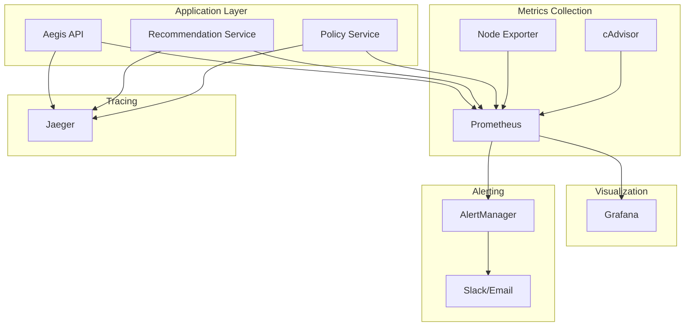

# 이지스(Aegis) 모니터링 설정 명세서

| 항목 | 내용 |
|------|------|
| 문서 ID | AEG-OPS-20250917-2.0 |
| 버전 | 2.0 |
| 최종 수정일 | 2025년 9월 17일 |
| 작성자 | Dr. Aiden (수석 AI 시스템 아키텍트) |
| 상태 | 확정 (Finalized) |

## 1. 개요 (Overview)

본 문서는 이지스 시스템의 포괄적인 모니터링 및 관찰가능성(Observability) 구현을 정의한다. **Prometheus + Grafana + Jaeger** 스택을 기반으로 한 완전한 모니터링 솔루션을 제공한다.

## 2. 모니터링 아키텍처

### 2.1. 모니터링 스택


### 2.2. 메트릭 수집 전략
| 메트릭 타입 | 수집 도구 | 수집 주기 | 보존 기간 |
|-------------|-----------|-----------|-----------|
| **애플리케이션 메트릭** | Prometheus | 15초 | 30일 |
| **시스템 메트릭** | Node Exporter | 15초 | 30일 |
| **컨테이너 메트릭** | cAdvisor | 15초 | 7일 |
| **분산 추적** | Jaeger | 실시간 | 7일 |

## 3. Prometheus 설정

### 3.1. Prometheus 배포
```yaml
apiVersion: apps/v1
kind: Deployment
metadata:
  name: prometheus
  namespace: monitoring
spec:
  replicas: 1
  selector:
    matchLabels:
      app: prometheus
  template:
    metadata:
      labels:
        app: prometheus
    spec:
      containers:
      - name: prometheus
        image: prom/prometheus:latest
        ports:
        - containerPort: 9090
        volumeMounts:
        - name: prometheus-config
          mountPath: /etc/prometheus
        - name: prometheus-storage
          mountPath: /prometheus
        args:
          - '--config.file=/etc/prometheus/prometheus.yml'
          - '--storage.tsdb.path=/prometheus'
          - '--web.console.libraries=/etc/prometheus/console_libraries'
          - '--web.console.templates=/etc/prometheus/consoles'
          - '--storage.tsdb.retention.time=30d'
          - '--web.enable-lifecycle'
      volumes:
      - name: prometheus-config
        configMap:
          name: prometheus-config
      - name: prometheus-storage
        persistentVolumeClaim:
          claimName: prometheus-pvc
```

### 3.2. Prometheus 설정 파일
```yaml
apiVersion: v1
kind: ConfigMap
metadata:
  name: prometheus-config
  namespace: monitoring
data:
  prometheus.yml: |
    global:
      scrape_interval: 15s
      evaluation_interval: 15s
    
    rule_files:
      - "aegis_rules.yml"
    
    alerting:
      alertmanagers:
        - static_configs:
            - targets:
              - alertmanager:9093
    
    scrape_configs:
      # Aegis API 메트릭
      - job_name: 'aegis-api'
        kubernetes_sd_configs:
        - role: pod
          namespaces:
            names:
            - aegis-production
        relabel_configs:
        - source_labels: [__meta_kubernetes_pod_label_app]
          action: keep
          regex: aegis-api
        - source_labels: [__meta_kubernetes_pod_annotation_prometheus_io_scrape]
          action: keep
          regex: true
        - source_labels: [__meta_kubernetes_pod_annotation_prometheus_io_path]
          action: replace
          target_label: __metrics_path__
          regex: (.+)
      
      # PostgreSQL 메트릭
      - job_name: 'postgres'
        static_configs:
        - targets: ['postgres-exporter:9187']
      
      # Redis 메트릭
      - job_name: 'redis'
        static_configs:
        - targets: ['redis-exporter:9121']
      
      # Node 메트릭
      - job_name: 'node-exporter'
        kubernetes_sd_configs:
        - role: node
        relabel_configs:
        - action: labelmap
          regex: __meta_kubernetes_node_label_(.+)
        - target_label: __address__
          replacement: kubernetes.default.svc:443
        - source_labels: [__meta_kubernetes_node_name]
          regex: (.+)
          target_label: __metrics_path__
          replacement: /api/v1/nodes/${1}/proxy/metrics
  
  aegis_rules.yml: |
    groups:
    - name: aegis_alerts
      rules:
      - alert: HighAPILatency
        expr: histogram_quantile(0.95, rate(http_request_duration_seconds_bucket[5m])) > 3
        for: 5m
        labels:
          severity: warning
        annotations:
          summary: "High API latency detected"
          description: "95th percentile latency is {{ $value }}s"
      
      - alert: HighErrorRate
        expr: rate(http_requests_total{status=~"5.."}[5m]) / rate(http_requests_total[5m]) > 0.01
        for: 5m
        labels:
          severity: critical
        annotations:
          summary: "High error rate detected"
          description: "Error rate is {{ $value | humanizePercentage }}"
      
      - alert: DatabaseConnectionHigh
        expr: pg_stat_activity_count > 80
        for: 5m
        labels:
          severity: warning
        annotations:
          summary: "High database connections"
          description: "Database has {{ $value }} active connections"
```

## 4. Grafana 대시보드

### 4.1. Grafana 배포
```yaml
apiVersion: apps/v1
kind: Deployment
metadata:
  name: grafana
  namespace: monitoring
spec:
  replicas: 1
  selector:
    matchLabels:
      app: grafana
  template:
    metadata:
      labels:
        app: grafana
    spec:
      containers:
      - name: grafana
        image: grafana/grafana:latest
        ports:
        - containerPort: 3000
        env:
        - name: GF_SECURITY_ADMIN_PASSWORD
          valueFrom:
            secretKeyRef:
              name: grafana-secret
              key: admin-password
        volumeMounts:
        - name: grafana-storage
          mountPath: /var/lib/grafana
        - name: grafana-config
          mountPath: /etc/grafana/provisioning
      volumes:
      - name: grafana-storage
        persistentVolumeClaim:
          claimName: grafana-pvc
      - name: grafana-config
        configMap:
          name: grafana-config
```

### 4.2. 대시보드 설정
```yaml
apiVersion: v1
kind: ConfigMap
metadata:
  name: grafana-config
  namespace: monitoring
data:
  datasources.yml: |
    apiVersion: 1
    datasources:
    - name: Prometheus
      type: prometheus
      access: proxy
      url: http://prometheus:9090
      isDefault: true
    - name: Jaeger
      type: jaeger
      access: proxy
      url: http://jaeger-query:16686
  
  dashboards.yml: |
    apiVersion: 1
    providers:
    - name: 'aegis-dashboards'
      orgId: 1
      folder: 'Aegis'
      type: file
      disableDeletion: false
      updateIntervalSeconds: 10
      options:
        path: /var/lib/grafana/dashboards
```

## 5. 애플리케이션 메트릭

### 5.1. Python 애플리케이션 메트릭
```python
from prometheus_client import Counter, Histogram, Gauge, generate_latest
from fastapi import FastAPI, Response
import time

app = FastAPI()

# 메트릭 정의
REQUEST_COUNT = Counter(
    'http_requests_total',
    'Total HTTP requests',
    ['method', 'endpoint', 'status']
)

REQUEST_DURATION = Histogram(
    'http_request_duration_seconds',
    'HTTP request duration',
    ['method', 'endpoint']
)

ACTIVE_CONNECTIONS = Gauge(
    'active_connections',
    'Active database connections'
)

RECOMMENDATION_ACCURACY = Gauge(
    'recommendation_accuracy_score',
    'Current recommendation accuracy score'
)

# 미들웨어
@app.middleware("http")
async def metrics_middleware(request, call_next):
    start_time = time.time()
    
    response = await call_next(request)
    
    # 메트릭 기록
    REQUEST_COUNT.labels(
        method=request.method,
        endpoint=request.url.path,
        status=response.status_code
    ).inc()
    
    REQUEST_DURATION.labels(
        method=request.method,
        endpoint=request.url.path
    ).observe(time.time() - start_time)
    
    return response

# 메트릭 엔드포인트
@app.get("/metrics")
async def metrics():
    return Response(
        generate_latest(),
        media_type="text/plain"
    )

# 비즈니스 메트릭 업데이트
async def update_business_metrics():
    # 추천 정확도 업데이트
    accuracy = await calculate_recommendation_accuracy()
    RECOMMENDATION_ACCURACY.set(accuracy)
    
    # 활성 연결 수 업데이트
    active_conns = await get_active_db_connections()
    ACTIVE_CONNECTIONS.set(active_conns)
```

## 6. 분산 추적 (Jaeger)

### 6.1. Jaeger 배포
```yaml
apiVersion: apps/v1
kind: Deployment
metadata:
  name: jaeger
  namespace: monitoring
spec:
  replicas: 1
  selector:
    matchLabels:
      app: jaeger
  template:
    metadata:
      labels:
        app: jaeger
    spec:
      containers:
      - name: jaeger
        image: jaegertracing/all-in-one:latest
        ports:
        - containerPort: 16686  # UI
        - containerPort: 14268  # HTTP collector
        - containerPort: 6831   # UDP agent
        env:
        - name: COLLECTOR_ZIPKIN_HTTP_PORT
          value: "9411"
```

### 6.2. 애플리케이션 추적 설정
```python
from opentelemetry import trace
from opentelemetry.exporter.jaeger.thrift import JaegerExporter
from opentelemetry.sdk.trace import TracerProvider
from opentelemetry.sdk.trace.export import BatchSpanProcessor
from opentelemetry.instrumentation.fastapi import FastAPIInstrumentor
from opentelemetry.instrumentation.requests import RequestsInstrumentor

# 추적 설정
trace.set_tracer_provider(TracerProvider())
tracer = trace.get_tracer(__name__)

# Jaeger 익스포터 설정
jaeger_exporter = JaegerExporter(
    agent_host_name="jaeger",
    agent_port=6831,
)

span_processor = BatchSpanProcessor(jaeger_exporter)
trace.get_tracer_provider().add_span_processor(span_processor)

# FastAPI 자동 계측
FastAPIInstrumentor.instrument_app(app)
RequestsInstrumentor().instrument()

# 커스텀 추적
@app.post("/recommendations")
async def get_recommendations(request: RecommendationRequest):
    with tracer.start_as_current_span("recommendation_generation") as span:
        span.set_attribute("user_id", request.user_id)
        span.set_attribute("query", request.query)
        
        # 벡터 검색 추적
        with tracer.start_as_current_span("vector_search") as vector_span:
            vector_results = await vector_search(request.query)
            vector_span.set_attribute("results_count", len(vector_results))
        
        # KG 추론 추적
        with tracer.start_as_current_span("kg_reasoning") as kg_span:
            kg_results = await knowledge_graph_reasoning(request.user_profile)
            kg_span.set_attribute("rules_applied", len(kg_results))
        
        # 최종 결과 생성
        recommendations = await generate_recommendations(vector_results, kg_results)
        span.set_attribute("recommendations_count", len(recommendations))
        
        return recommendations
```

## 7. 알림 설정

### 7.1. AlertManager 설정
```yaml
apiVersion: v1
kind: ConfigMap
metadata:
  name: alertmanager-config
  namespace: monitoring
data:
  alertmanager.yml: |
    global:
      smtp_smarthost: 'smtp.gmail.com:587'
      smtp_from: 'alerts@aegis.kr'
    
    route:
      group_by: ['alertname']
      group_wait: 10s
      group_interval: 10s
      repeat_interval: 1h
      receiver: 'web.hook'
      routes:
      - match:
          severity: critical
        receiver: 'critical-alerts'
      - match:
          severity: warning
        receiver: 'warning-alerts'
    
    receivers:
    - name: 'web.hook'
      webhook_configs:
      - url: 'http://localhost:5001/'
    
    - name: 'critical-alerts'
      slack_configs:
      - api_url: 'YOUR_SLACK_WEBHOOK_URL'
        channel: '#alerts-critical'
        title: 'Critical Alert: {{ .GroupLabels.alertname }}'
        text: '{{ range .Alerts }}{{ .Annotations.description }}{{ end }}'
      email_configs:
      - to: 'ops-team@aegis.kr'
        subject: 'Critical Alert: {{ .GroupLabels.alertname }}'
        body: '{{ range .Alerts }}{{ .Annotations.description }}{{ end }}'
    
    - name: 'warning-alerts'
      slack_configs:
      - api_url: 'YOUR_SLACK_WEBHOOK_URL'
        channel: '#alerts-warning'
        title: 'Warning: {{ .GroupLabels.alertname }}'
        text: '{{ range .Alerts }}{{ .Annotations.description }}{{ end }}'
```

---

**📋 관련 문서**
- [Kubernetes 명세](./01_KUBERNETES_SPECS.md)
- [모니터링 및 관찰가능성](./03_MONITORING_AND_OBSERVABILITY.md)
- [성능 명세](../06_QUALITY_ASSURANCE/02_PERFORMANCE_SPECS.md)