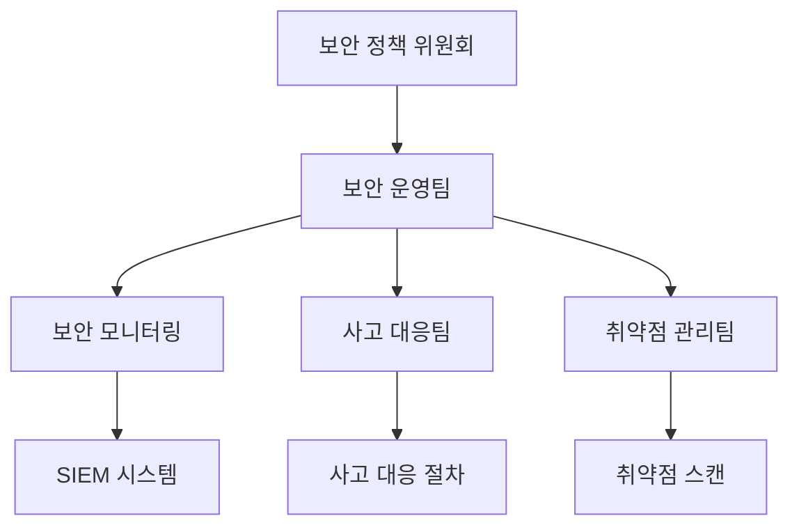
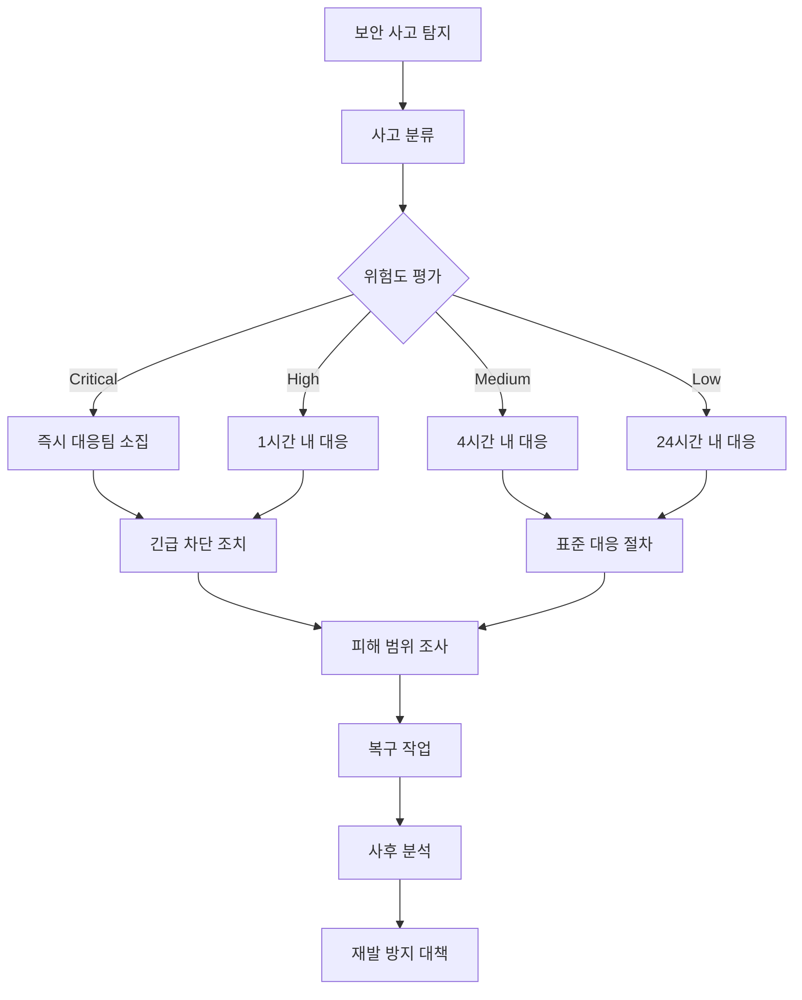

# 이지스(Aegis) 보안 운영 명세서

| 항목 | 내용 |
|------|------|
| 문서 ID | AEG-OPS-20250917-1.0 |
| 버전 | 1.0 |
| 최종 수정일 | 2025년 9월 17일 |
| 작성자 | Dr. Aiden (수석 AI 시스템 아키텍트) |
| 상태 | 확정 (Finalized) |

## 1. 개요 (Overview)

본 문서는 이지스 시스템의 보안 운영 절차, 정책, 모니터링 방법을 정의한다. **Zero Trust** 원칙을 기반으로 한 보안 운영 체계를 통해 시스템과 데이터의 안전성을 보장한다.

## 2. 보안 운영 원칙

### 2.1. 핵심 원칙
- **Zero Trust**: 모든 접근을 검증하고 최소 권한 부여
- **심층 방어**: 다층적 보안 체계 구축
- **지속적 모니터링**: 실시간 보안 위협 탐지
- **자동화된 대응**: 보안 사고 발생 시 자동 대응 체계

### 2.2. 보안 운영 체계

#### 보안 거버넌스


## 3. 접근 제어 관리

### 3.1. 사용자 접근 관리

#### 계정 생명주기 관리
```python
class UserAccessManagement:
    """사용자 접근 관리"""
    
    def __init__(self):
        self.ldap_client = LDAPClient()
        self.rbac_service = RBACService()
        self.audit_logger = AuditLogger()
    
    async def provision_user(self, user_data: dict) -> dict:
        """사용자 계정 프로비저닝"""
        try:
            # 1. 계정 생성
            user_account = await self.create_user_account(user_data)
            
            # 2. 역할 할당
            roles = await self.determine_user_roles(user_data)
            await self.rbac_service.assign_roles(user_account.id, roles)
            
            # 3. 초기 권한 설정
            await self.setup_initial_permissions(user_account.id)
            
            # 4. 감사 로그 기록
            await self.audit_logger.log_user_provisioning(user_account.id)
            
            return {
                "user_id": user_account.id,
                "status": "provisioned",
                "roles": roles
            }
            
        except Exception as e:
            await self.audit_logger.log_provisioning_failure(user_data, str(e))
            raise
    
    async def deprovision_user(self, user_id: str) -> dict:
        """사용자 계정 해제"""
        try:
            # 1. 활성 세션 종료
            await self.terminate_user_sessions(user_id)
            
            # 2. 권한 회수
            await self.rbac_service.revoke_all_permissions(user_id)
            
            # 3. 계정 비활성화
            await self.deactivate_user_account(user_id)
            
            # 4. 데이터 보존/삭제 처리
            await self.handle_user_data_retention(user_id)
            
            # 5. 감사 로그 기록
            await self.audit_logger.log_user_deprovisioning(user_id)
            
            return {"user_id": user_id, "status": "deprovisioned"}
            
        except Exception as e:
            await self.audit_logger.log_deprovisioning_failure(user_id, str(e))
            raise
```

### 3.2. 시스템 접근 제어

#### API 접근 제어
```python
class APIAccessControl:
    """API 접근 제어"""
    
    def __init__(self):
        self.rate_limiter = RateLimiter()
        self.ip_whitelist = IPWhitelist()
        self.api_key_manager = APIKeyManager()
    
    async def validate_api_access(self, request: Request) -> bool:
        """API 접근 검증"""
        client_ip = self.get_client_ip(request)
        api_key = request.headers.get("X-API-Key")
        
        # 1. IP 화이트리스트 확인
        if not await self.ip_whitelist.is_allowed(client_ip):
            await self.log_blocked_access(client_ip, "IP_NOT_WHITELISTED")
            return False
        
        # 2. API 키 검증
        if not await self.api_key_manager.validate_key(api_key):
            await self.log_blocked_access(client_ip, "INVALID_API_KEY")
            return False
        
        # 3. 속도 제한 확인
        if not await self.rate_limiter.allow_request(client_ip):
            await self.log_blocked_access(client_ip, "RATE_LIMIT_EXCEEDED")
            return False
        
        return True
```

## 4. 보안 모니터링

### 4.1. 실시간 위협 탐지

#### 보안 이벤트 모니터링
```python
class SecurityEventMonitor:
    """보안 이벤트 모니터링"""
    
    def __init__(self):
        self.event_processor = SecurityEventProcessor()
        self.threat_detector = ThreatDetector()
        self.alert_manager = SecurityAlertManager()
    
    async def process_security_event(self, event: dict):
        """보안 이벤트 처리"""
        # 1. 이벤트 정규화
        normalized_event = await self.event_processor.normalize(event)
        
        # 2. 위협 분석
        threat_level = await self.threat_detector.analyze(normalized_event)
        
        # 3. 위험도에 따른 대응
        if threat_level >= ThreatLevel.HIGH:
            await self.handle_high_threat(normalized_event)
        elif threat_level >= ThreatLevel.MEDIUM:
            await self.handle_medium_threat(normalized_event)
        
        # 4. 이벤트 저장
        await self.store_security_event(normalized_event, threat_level)
    
    async def handle_high_threat(self, event: dict):
        """고위험 위협 처리"""
        # 즉시 알림 발송
        await self.alert_manager.send_immediate_alert(event)
        
        # 자동 차단 조치
        if event.get("source_ip"):
            await self.auto_block_ip(event["source_ip"])
        
        # 사고 대응팀 호출
        await self.escalate_to_incident_response(event)
```

### 4.2. 취약점 관리

#### 자동화된 취약점 스캔
```python
class VulnerabilityScanner:
    """취약점 스캐너"""
    
    def __init__(self):
        self.container_scanner = ContainerScanner()
        self.dependency_scanner = DependencyScanner()
        self.infrastructure_scanner = InfrastructureScanner()
    
    async def run_comprehensive_scan(self) -> dict:
        """종합 취약점 스캔"""
        scan_results = {
            "timestamp": datetime.utcnow().isoformat(),
            "scan_id": str(uuid4()),
            "results": {}
        }
        
        # 1. 컨테이너 이미지 스캔
        container_results = await self.container_scanner.scan_all_images()
        scan_results["results"]["containers"] = container_results
        
        # 2. 의존성 스캔
        dependency_results = await self.dependency_scanner.scan_dependencies()
        scan_results["results"]["dependencies"] = dependency_results
        
        # 3. 인프라 스캔
        infra_results = await self.infrastructure_scanner.scan_infrastructure()
        scan_results["results"]["infrastructure"] = infra_results
        
        # 4. 위험도 평가
        risk_assessment = await self.assess_overall_risk(scan_results)
        scan_results["risk_assessment"] = risk_assessment
        
        # 5. 자동 수정 가능한 취약점 처리
        await self.auto_remediate_vulnerabilities(scan_results)
        
        return scan_results
```

## 5. 사고 대응

### 5.1. 보안 사고 대응 절차

#### 사고 대응 워크플로우


#### 자동화된 사고 대응
```python
class IncidentResponseSystem:
    """사고 대응 시스템"""
    
    def __init__(self):
        self.incident_classifier = IncidentClassifier()
        self.response_orchestrator = ResponseOrchestrator()
        self.communication_manager = CommunicationManager()
    
    async def handle_security_incident(self, incident: dict):
        """보안 사고 처리"""
        # 1. 사고 분류
        incident_type = await self.incident_classifier.classify(incident)
        severity = await self.incident_classifier.assess_severity(incident)
        
        # 2. 초기 대응
        response_plan = await self.get_response_plan(incident_type, severity)
        await self.response_orchestrator.execute_initial_response(response_plan)
        
        # 3. 이해관계자 통보
        await self.communication_manager.notify_stakeholders(incident, severity)
        
        # 4. 상세 조사 시작
        investigation_id = await self.start_investigation(incident)
        
        # 5. 지속적 모니터링
        await self.monitor_incident_progress(investigation_id)
        
        return {
            "incident_id": incident["id"],
            "classification": incident_type,
            "severity": severity,
            "investigation_id": investigation_id
        }
```

## 6. 컴플라이언스 관리

### 6.1. 규정 준수 모니터링

#### 자동화된 컴플라이언스 검사
```python
class ComplianceMonitor:
    """컴플라이언스 모니터"""
    
    def __init__(self):
        self.policy_engine = PolicyEngine()
        self.audit_collector = AuditCollector()
        self.report_generator = ComplianceReportGenerator()
    
    async def run_compliance_check(self, framework: str) -> dict:
        """컴플라이언스 검사 실행"""
        compliance_rules = await self.policy_engine.get_rules(framework)
        check_results = []
        
        for rule in compliance_rules:
            result = await self.check_compliance_rule(rule)
            check_results.append(result)
        
        # 전체 준수율 계산
        compliance_score = self.calculate_compliance_score(check_results)
        
        # 보고서 생성
        report = await self.report_generator.generate_report(
            framework, check_results, compliance_score
        )
        
        return {
            "framework": framework,
            "compliance_score": compliance_score,
            "total_rules": len(compliance_rules),
            "passed_rules": len([r for r in check_results if r["status"] == "PASS"]),
            "failed_rules": len([r for r in check_results if r["status"] == "FAIL"]),
            "report_url": report["url"]
        }
```

## 7. 보안 교육 및 인식 제고

### 7.1. 보안 교육 프로그램

#### 교육 관리 시스템
```python
class SecurityTrainingManager:
    """보안 교육 관리"""
    
    def __init__(self):
        self.training_scheduler = TrainingScheduler()
        self.progress_tracker = ProgressTracker()
        self.assessment_engine = AssessmentEngine()
    
    async def schedule_mandatory_training(self, user_id: str, role: str):
        """필수 보안 교육 스케줄링"""
        required_modules = await self.get_required_modules(role)
        
        for module in required_modules:
            await self.training_scheduler.schedule_training(
                user_id=user_id,
                module_id=module["id"],
                deadline=module["deadline"],
                priority=module["priority"]
            )
    
    async def track_training_completion(self, user_id: str, module_id: str):
        """교육 완료 추적"""
        # 진도 업데이트
        await self.progress_tracker.update_progress(user_id, module_id)
        
        # 평가 실시
        assessment_result = await self.assessment_engine.conduct_assessment(
            user_id, module_id
        )
        
        # 수료 여부 결정
        if assessment_result["score"] >= 80:
            await self.issue_completion_certificate(user_id, module_id)
        else:
            await self.schedule_remedial_training(user_id, module_id)
```

## 8. 보안 메트릭 및 KPI

### 8.1. 보안 성과 지표

#### 핵심 보안 메트릭
```python
class SecurityMetrics:
    """보안 메트릭 수집"""
    
    def __init__(self):
        self.metrics_collector = MetricsCollector()
        self.dashboard_updater = DashboardUpdater()
    
    async def collect_security_metrics(self) -> dict:
        """보안 메트릭 수집"""
        metrics = {
            # 사고 관련 메트릭
            "incidents": {
                "total_incidents": await self.count_incidents_this_month(),
                "critical_incidents": await self.count_critical_incidents(),
                "mean_time_to_detection": await self.calculate_mttd(),
                "mean_time_to_response": await self.calculate_mttr()
            },
            
            # 취약점 관련 메트릭
            "vulnerabilities": {
                "total_vulnerabilities": await self.count_open_vulnerabilities(),
                "critical_vulnerabilities": await self.count_critical_vulnerabilities(),
                "remediation_rate": await self.calculate_remediation_rate(),
                "time_to_patch": await self.calculate_time_to_patch()
            },
            
            # 접근 제어 메트릭
            "access_control": {
                "failed_login_attempts": await self.count_failed_logins(),
                "privileged_access_usage": await self.track_privileged_access(),
                "access_review_completion": await self.calculate_access_review_rate()
            },
            
            # 컴플라이언스 메트릭
            "compliance": {
                "overall_compliance_score": await self.calculate_compliance_score(),
                "policy_violations": await self.count_policy_violations(),
                "audit_findings": await self.count_audit_findings()
            }
        }
        
        # 대시보드 업데이트
        await self.dashboard_updater.update_security_dashboard(metrics)
        
        return metrics
```

---

**📋 관련 문서**
- [보안 아키텍처](../01_ARCHITECTURE/04_SECURITY_ARCHITECTURE.md)
- [모니터링 설정](./02_MONITORING_SETUP.md)
- [재해 복구](./04_DISASTER_RECOVERY.md)
- [컴플라이언스 체크리스트](../06_QUALITY_ASSURANCE/04_COMPLIANCE_CHECKLIST.md)