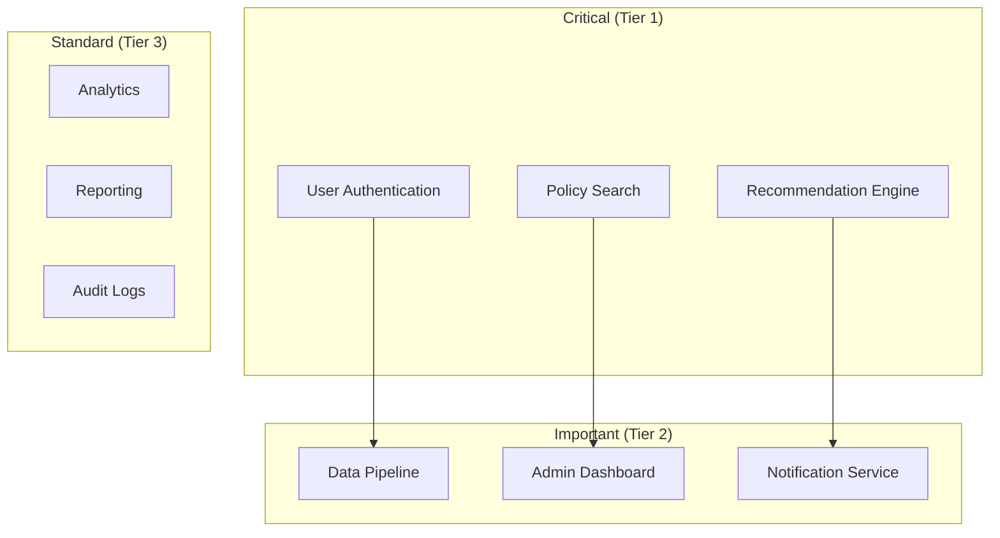

# 이지스(Aegis) 재해 복구 계획

| 항목 | 내용 |
|------|------|
| 문서 ID | AEG-OPS-20250917-1.0 |
| 버전 | 1.0 |
| 최종 수정일 | 2025년 9월 17일 |
| 작성자 | Dr. Aiden (수석 AI 시스템 아키텍트) |
| 상태 | 확정 (Finalized) |

## 1. 개요 (Overview)

본 문서는 이지스 시스템의 재해 복구(Disaster Recovery) 계획을 정의한다. 자연재해, 시스템 장애, 사이버 공격 등 다양한 재해 상황에서 **서비스 연속성**을 보장하고 **데이터 무결성**을 유지하는 체계적인 복구 절차를 제시한다.

## 2. 재해 복구 목표

### 2.1. 핵심 목표 지표

| 지표 | 목표값 | 설명 |
|------|--------|------|
| **RTO (Recovery Time Objective)** | 4시간 | 서비스 복구까지 허용 시간 |
| **RPO (Recovery Point Objective)** | 15분 | 데이터 손실 허용 범위 |
| **MTTR (Mean Time To Recovery)** | 2시간 | 평균 복구 시간 |
| **가용성 목표** | 99.9% | 연간 서비스 가용성 |

### 2.2. 비즈니스 영향 분석

#### 서비스별 우선순위


## 3. 재해 시나리오 및 대응 전략

### 3.1. 재해 시나리오 분류

#### 시나리오 1: 데이터센터 전체 장애
```yaml
재해 유형: 물리적 인프라 장애
영향 범위: 전체 서비스
복구 전략: 다른 지역 데이터센터로 페일오버
예상 RTO: 2-4시간
예상 RPO: 5-15분
```

#### 시나리오 2: 데이터베이스 장애
```yaml
재해 유형: 데이터베이스 서버 장애
영향 범위: 데이터 의존 서비스
복구 전략: 백업에서 복원 또는 복제본 승격
예상 RTO: 30분-2시간
예상 RPO: 0-5분
```

#### 시나리오 3: 사이버 공격 (랜섬웨어)
```yaml
재해 유형: 악성 소프트웨어 공격
영향 범위: 감염된 시스템
복구 전략: 격리 후 클린 백업에서 복원
예상 RTO: 4-8시간
예상 RPO: 1시간
```

### 3.2. 재해 대응 체계

#### 재해 대응팀 구성
```python
class DisasterResponseTeam:
    """재해 대응팀"""
    
    def __init__(self):
        self.incident_commander = IncidentCommander()
        self.technical_leads = {
            "infrastructure": InfrastructureTeamLead(),
            "database": DatabaseTeamLead(),
            "application": ApplicationTeamLead(),
            "security": SecurityTeamLead()
        }
        self.communication_manager = CommunicationManager()
    
    async def activate_disaster_response(self, disaster_type: str, severity: str):
        """재해 대응 활성화"""
        # 1. 대응팀 소집
        await self.assemble_response_team(disaster_type, severity)
        
        # 2. 상황 평가
        situation_assessment = await self.assess_situation(disaster_type)
        
        # 3. 복구 계획 선택
        recovery_plan = await self.select_recovery_plan(situation_assessment)
        
        # 4. 복구 작업 시작
        await self.execute_recovery_plan(recovery_plan)
        
        # 5. 이해관계자 통보
        await self.communication_manager.notify_stakeholders(
            disaster_type, severity, recovery_plan
        )
```

## 4. 백업 전략

### 4.1. 데이터 백업 체계

#### 백업 스케줄
```yaml
# PostgreSQL 백업
postgresql_backup:
  full_backup:
    schedule: "0 2 * * 0"  # 매주 일요일 02:00
    retention: "4 weeks"
  incremental_backup:
    schedule: "0 2 * * 1-6"  # 월-토 02:00
    retention: "1 week"
  transaction_log_backup:
    schedule: "*/15 * * * *"  # 15분마다
    retention: "3 days"

# Neo4j 백업
neo4j_backup:
  full_backup:
    schedule: "0 3 * * *"  # 매일 03:00
    retention: "7 days"
  
# Milvus 백업
milvus_backup:
  collection_backup:
    schedule: "0 4 * * *"  # 매일 04:00
    retention: "7 days"
```

#### 자동화된 백업 시스템
```python
class BackupManager:
    """백업 관리자"""
    
    def __init__(self):
        self.postgres_backup = PostgreSQLBackup()
        self.neo4j_backup = Neo4jBackup()
        self.milvus_backup = MilvusBackup()
        self.storage_manager = BackupStorageManager()
    
    async def execute_scheduled_backup(self, backup_type: str):
        """예약된 백업 실행"""
        backup_id = f"backup_{datetime.utcnow().strftime('%Y%m%d_%H%M%S')}"
        
        try:
            # 1. 백업 시작 로깅
            await self.log_backup_start(backup_id, backup_type)
            
            # 2. 데이터베이스별 백업 실행
            backup_results = {}
            
            if backup_type in ["full", "postgresql"]:
                postgres_result = await self.postgres_backup.create_backup(backup_id)
                backup_results["postgresql"] = postgres_result
            
            if backup_type in ["full", "neo4j"]:
                neo4j_result = await self.neo4j_backup.create_backup(backup_id)
                backup_results["neo4j"] = neo4j_result
            
            if backup_type in ["full", "milvus"]:
                milvus_result = await self.milvus_backup.create_backup(backup_id)
                backup_results["milvus"] = milvus_result
            
            # 3. 백업 파일 검증
            await self.verify_backup_integrity(backup_results)
            
            # 4. 원격 저장소에 업로드
            await self.storage_manager.upload_backups(backup_results)
            
            # 5. 백업 완료 로깅
            await self.log_backup_completion(backup_id, backup_results)
            
            return {
                "backup_id": backup_id,
                "status": "success",
                "results": backup_results
            }
            
        except Exception as e:
            await self.log_backup_failure(backup_id, str(e))
            await self.notify_backup_failure(backup_id, str(e))
            raise
    
    async def verify_backup_integrity(self, backup_results: dict):
        """백업 무결성 검증"""
        for db_type, result in backup_results.items():
            backup_file = result["backup_file"]
            
            # 파일 존재 확인
            if not os.path.exists(backup_file):
                raise BackupError(f"Backup file not found: {backup_file}")
            
            # 파일 크기 확인
            file_size = os.path.getsize(backup_file)
            if file_size < result.get("expected_min_size", 0):
                raise BackupError(f"Backup file too small: {backup_file}")
            
            # 체크섬 검증
            calculated_checksum = await self.calculate_checksum(backup_file)
            if calculated_checksum != result.get("checksum"):
                raise BackupError(f"Checksum mismatch: {backup_file}")
```

### 4.2. 백업 저장소 관리

#### 다중 저장소 전략
```python
class BackupStorageManager:
    """백업 저장소 관리"""
    
    def __init__(self):
        self.local_storage = LocalStorage()
        self.s3_storage = S3Storage()
        self.azure_storage = AzureStorage()
        self.encryption_service = EncryptionService()
    
    async def upload_backups(self, backup_results: dict):
        """백업 파일 업로드"""
        for db_type, result in backup_results.items():
            backup_file = result["backup_file"]
            
            # 1. 백업 파일 암호화
            encrypted_file = await self.encryption_service.encrypt_file(backup_file)
            
            # 2. 다중 저장소에 업로드
            upload_tasks = [
                self.s3_storage.upload(encrypted_file, f"backups/{db_type}/"),
                self.azure_storage.upload(encrypted_file, f"backups/{db_type}/")
            ]
            
            upload_results = await asyncio.gather(*upload_tasks, return_exceptions=True)
            
            # 3. 업로드 결과 검증
            successful_uploads = [r for r in upload_results if not isinstance(r, Exception)]
            if len(successful_uploads) < 1:
                raise BackupError(f"Failed to upload backup to any storage: {backup_file}")
            
            # 4. 로컬 파일 정리 (선택적)
            if len(successful_uploads) >= 2:  # 최소 2개 저장소에 성공
                await self.cleanup_local_backup(backup_file)
```

## 5. 복구 절차

### 5.1. 자동화된 복구 시스템

#### 복구 오케스트레이터
```python
class RecoveryOrchestrator:
    """복구 오케스트레이터"""
    
    def __init__(self):
        self.health_checker = HealthChecker()
        self.backup_manager = BackupManager()
        self.service_manager = ServiceManager()
        self.dns_manager = DNSManager()
    
    async def execute_disaster_recovery(self, disaster_scenario: str):
        """재해 복구 실행"""
        recovery_plan = await self.get_recovery_plan(disaster_scenario)
        
        try:
            # 1. 현재 상태 평가
            system_status = await self.health_checker.comprehensive_check()
            
            # 2. 복구 전략 결정
            recovery_strategy = await self.determine_recovery_strategy(
                disaster_scenario, system_status
            )
            
            # 3. 복구 작업 실행
            if recovery_strategy == "failover":
                await self.execute_failover_recovery()
            elif recovery_strategy == "restore_from_backup":
                await self.execute_backup_restore()
            elif recovery_strategy == "partial_recovery":
                await self.execute_partial_recovery()
            
            # 4. 서비스 검증
            await self.verify_service_recovery()
            
            # 5. 트래픽 라우팅 복원
            await self.restore_traffic_routing()
            
            return {
                "status": "success",
                "recovery_strategy": recovery_strategy,
                "recovery_time": self.calculate_recovery_time()
            }
            
        except Exception as e:
            await self.handle_recovery_failure(e)
            raise
    
    async def execute_failover_recovery(self):
        """페일오버 복구"""
        # 1. 대기 환경 활성화
        await self.service_manager.activate_standby_environment()
        
        # 2. 데이터베이스 복제본 승격
        await self.promote_database_replicas()
        
        # 3. 애플리케이션 서비스 시작
        await self.service_manager.start_application_services()
        
        # 4. 로드 밸런서 설정 업데이트
        await self.update_load_balancer_config()
    
    async def execute_backup_restore(self):
        """백업 복원"""
        # 1. 최신 백업 식별
        latest_backups = await self.backup_manager.identify_latest_backups()
        
        # 2. 백업 파일 다운로드
        await self.backup_manager.download_backup_files(latest_backups)
        
        # 3. 데이터베이스 복원
        for db_type, backup_info in latest_backups.items():
            await self.restore_database(db_type, backup_info)
        
        # 4. 애플리케이션 재시작
        await self.service_manager.restart_all_services()
```

### 5.2. 서비스별 복구 절차

#### PostgreSQL 복구
```python
class PostgreSQLRecovery:
    """PostgreSQL 복구"""
    
    async def restore_from_backup(self, backup_info: dict):
        """백업에서 복원"""
        try:
            # 1. 기존 데이터베이스 중지
            await self.stop_postgresql_service()
            
            # 2. 데이터 디렉토리 백업
            await self.backup_current_data_directory()
            
            # 3. 백업 파일 복원
            await self.restore_backup_file(backup_info["backup_file"])
            
            # 4. 트랜잭션 로그 적용
            if backup_info.get("transaction_logs"):
                await self.apply_transaction_logs(backup_info["transaction_logs"])
            
            # 5. PostgreSQL 서비스 시작
            await self.start_postgresql_service()
            
            # 6. 복구 검증
            await self.verify_database_integrity()
            
        except Exception as e:
            # 복구 실패 시 롤백
            await self.rollback_recovery()
            raise RecoveryError(f"PostgreSQL recovery failed: {e}")
```

## 6. 테스트 및 검증

### 6.1. 재해 복구 테스트

#### 정기 DR 테스트
```python
class DRTestManager:
    """재해 복구 테스트 관리"""
    
    def __init__(self):
        self.test_scheduler = TestScheduler()
        self.test_executor = TestExecutor()
        self.report_generator = TestReportGenerator()
    
    async def schedule_regular_dr_tests(self):
        """정기 DR 테스트 스케줄링"""
        test_scenarios = [
            {
                "name": "database_failover_test",
                "schedule": "0 2 1 * *",  # 매월 1일 02:00
                "duration": "2 hours"
            },
            {
                "name": "full_system_recovery_test",
                "schedule": "0 2 1 */3 *",  # 분기별
                "duration": "4 hours"
            },
            {
                "name": "backup_restore_test",
                "schedule": "0 2 15 * *",  # 매월 15일
                "duration": "1 hour"
            }
        ]
        
        for scenario in test_scenarios:
            await self.test_scheduler.schedule_test(scenario)
    
    async def execute_dr_test(self, test_scenario: str):
        """DR 테스트 실행"""
        test_id = f"dr_test_{datetime.utcnow().strftime('%Y%m%d_%H%M%S')}"
        
        try:
            # 1. 테스트 환경 준비
            await self.prepare_test_environment(test_scenario)
            
            # 2. 테스트 실행
            test_results = await self.test_executor.run_test(test_scenario)
            
            # 3. 결과 검증
            validation_results = await self.validate_test_results(test_results)
            
            # 4. 테스트 환경 정리
            await self.cleanup_test_environment()
            
            # 5. 보고서 생성
            report = await self.report_generator.generate_test_report(
                test_id, test_scenario, test_results, validation_results
            )
            
            return {
                "test_id": test_id,
                "scenario": test_scenario,
                "status": "completed",
                "results": test_results,
                "report_url": report["url"]
            }
            
        except Exception as e:
            await self.handle_test_failure(test_id, test_scenario, str(e))
            raise
```

## 7. 모니터링 및 알림

### 7.1. 재해 감지 시스템

#### 자동 재해 감지
```python
class DisasterDetectionSystem:
    """재해 감지 시스템"""
    
    def __init__(self):
        self.health_monitors = {
            "infrastructure": InfrastructureMonitor(),
            "database": DatabaseMonitor(),
            "application": ApplicationMonitor(),
            "network": NetworkMonitor()
        }
        self.alert_manager = AlertManager()
        self.escalation_manager = EscalationManager()
    
    async def continuous_monitoring(self):
        """지속적 모니터링"""
        while True:
            try:
                # 1. 전체 시스템 상태 확인
                system_health = await self.check_system_health()
                
                # 2. 재해 패턴 분석
                disaster_indicators = await self.analyze_disaster_patterns(system_health)
                
                # 3. 재해 위험도 평가
                risk_level = await self.assess_disaster_risk(disaster_indicators)
                
                # 4. 위험도에 따른 대응
                if risk_level >= RiskLevel.CRITICAL:
                    await self.trigger_disaster_response(disaster_indicators)
                elif risk_level >= RiskLevel.HIGH:
                    await self.send_warning_alerts(disaster_indicators)
                
                await asyncio.sleep(30)  # 30초마다 확인
                
            except Exception as e:
                logger.error(f"Disaster detection error: {e}")
                await asyncio.sleep(60)
    
    async def trigger_disaster_response(self, indicators: dict):
        """재해 대응 트리거"""
        # 1. 즉시 알림 발송
        await self.alert_manager.send_critical_alert(indicators)
        
        # 2. 재해 대응팀 호출
        await self.escalation_manager.activate_response_team()
        
        # 3. 자동 복구 절차 시작 (설정된 경우)
        if self.is_auto_recovery_enabled():
            await self.initiate_auto_recovery(indicators)
```

---

**📋 관련 문서**
- [모니터링 설정](./02_MONITORING_SETUP.md)
- [보안 운영](./03_SECURITY_OPERATIONS.md)
- [유지보수 가이드](./05_MAINTENANCE_GUIDE.md)
- [데이터 아키텍처](../01_ARCHITECTURE/03_DATA_ARCHITECTURE.md)