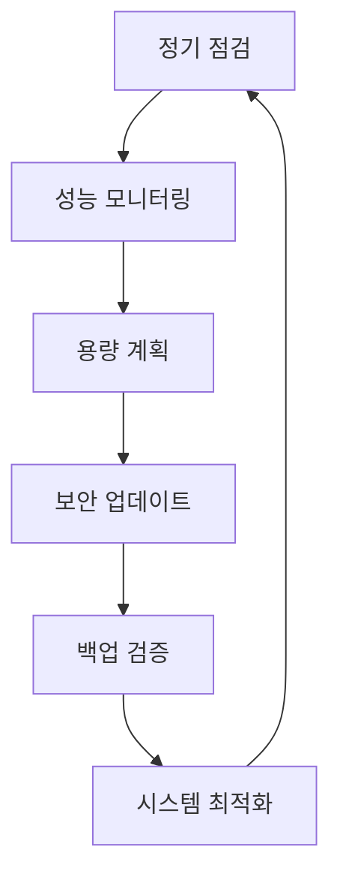

# 이지스(Aegis) 유지보수 가이드

| 항목 | 내용 |
|------|------|
| 문서 ID | AEG-OPS-20250917-1.0 |
| 버전 | 1.0 |
| 최종 수정일 | 2025년 9월 17일 |
| 작성자 | Dr. Aiden (수석 AI 시스템 아키텍트) |
| 상태 | 확정 (Finalized) |

## 1. 개요 (Overview)

본 문서는 이지스 시스템의 일상적인 유지보수 절차, 예방적 관리 방법, 성능 최적화 전략을 정의한다. **예방적 유지보수**를 통해 시스템의 안정성과 성능을 지속적으로 보장하고, **계획된 유지보수**를 통해 서비스 중단을 최소화한다.

## 2. 유지보수 전략

### 2.1. 유지보수 철학
- **예방 우선**: 문제 발생 전 사전 예방
- **최소 중단**: 서비스 영향 최소화
- **자동화**: 반복 작업의 자동화
- **모니터링 기반**: 데이터 기반 의사결정

### 2.2. 유지보수 분류

#### 예방적 유지보수 (Preventive Maintenance)


#### 교정적 유지보수 (Corrective Maintenance)
- 장애 발생 시 긴급 수리
- 버그 수정 및 패치 적용
- 성능 저하 문제 해결

#### 적응적 유지보수 (Adaptive Maintenance)
- 환경 변화에 따른 시스템 조정
- 새로운 요구사항 반영
- 기술 스택 업그레이드

## 3. 일상 유지보수 절차

### 3.1. 일일 점검 항목

#### 자동화된 일일 점검
```python
class DailyMaintenanceChecker:
    """일일 유지보수 점검"""
    
    def __init__(self):
        self.system_monitor = SystemMonitor()
        self.database_checker = DatabaseChecker()
        self.service_checker = ServiceChecker()
        self.log_analyzer = LogAnalyzer()
        self.report_generator = MaintenanceReportGenerator()
    
    async def run_daily_checks(self) -> dict:
        """일일 점검 실행"""
        check_results = {
            "timestamp": datetime.utcnow().isoformat(),
            "checks": {}
        }
        
        # 1. 시스템 리소스 점검
        system_status = await self.system_monitor.check_resources()
        check_results["checks"]["system_resources"] = system_status
        
        # 2. 데이터베이스 상태 점검
        db_status = await self.database_checker.check_all_databases()
        check_results["checks"]["databases"] = db_status
        
        # 3. 서비스 상태 점검
        service_status = await self.service_checker.check_all_services()
        check_results["checks"]["services"] = service_status
        
        # 4. 로그 분석
        log_analysis = await self.log_analyzer.analyze_recent_logs()
        check_results["checks"]["log_analysis"] = log_analysis
        
        # 5. 전체 상태 평가
        overall_health = await self.evaluate_overall_health(check_results)
        check_results["overall_health"] = overall_health
        
        # 6. 보고서 생성
        report = await self.report_generator.generate_daily_report(check_results)
        check_results["report_url"] = report["url"]
        
        # 7. 문제 발견 시 알림
        if overall_health["status"] != "healthy":
            await self.send_maintenance_alert(check_results)
        
        return check_results
    
    async def check_disk_usage(self) -> dict:
        """디스크 사용량 점검"""
        disk_usage = {}
        critical_threshold = 85  # 85% 이상 시 경고
        warning_threshold = 75   # 75% 이상 시 주의
        
        for mount_point in ["/", "/var/lib/postgresql", "/var/lib/docker"]:
            usage = await self.get_disk_usage(mount_point)
            status = "normal"
            
            if usage["percent"] >= critical_threshold:
                status = "critical"
            elif usage["percent"] >= warning_threshold:
                status = "warning"
            
            disk_usage[mount_point] = {
                "usage_percent": usage["percent"],
                "free_space_gb": usage["free_gb"],
                "status": status
            }
        
        return disk_usage
```

### 3.2. 주간 유지보수 작업

#### 주간 점검 및 최적화
```python
class WeeklyMaintenanceTasks:
    """주간 유지보수 작업"""
    
    def __init__(self):
        self.database_optimizer = DatabaseOptimizer()
        self.log_rotator = LogRotator()
        self.cache_manager = CacheManager()
        self.security_scanner = SecurityScanner()
    
    async def run_weekly_maintenance(self):
        """주간 유지보수 실행"""
        maintenance_tasks = [
            self.optimize_databases(),
            self.rotate_logs(),
            self.clean_cache(),
            self.run_security_scan(),
            self.update_system_packages(),
            self.analyze_performance_trends()
        ]
        
        results = await asyncio.gather(*maintenance_tasks, return_exceptions=True)
        
        # 결과 정리 및 보고
        maintenance_report = await self.compile_maintenance_report(results)
        await self.send_weekly_report(maintenance_report)
        
        return maintenance_report
    
    async def optimize_databases(self):
        """데이터베이스 최적화"""
        optimization_results = {}
        
        # PostgreSQL 최적화
        postgres_result = await self.database_optimizer.optimize_postgresql()
        optimization_results["postgresql"] = postgres_result
        
        # Neo4j 최적화
        neo4j_result = await self.database_optimizer.optimize_neo4j()
        optimization_results["neo4j"] = neo4j_result
        
        # Milvus 최적화
        milvus_result = await self.database_optimizer.optimize_milvus()
        optimization_results["milvus"] = milvus_result
        
        return optimization_results
    
    async def rotate_logs(self):
        """로그 로테이션"""
        log_rotation_results = {}
        
        # 애플리케이션 로그 로테이션
        app_logs = await self.log_rotator.rotate_application_logs()
        log_rotation_results["application"] = app_logs
        
        # 시스템 로그 로테이션
        system_logs = await self.log_rotator.rotate_system_logs()
        log_rotation_results["system"] = system_logs
        
        # 오래된 로그 아카이브
        archived_logs = await self.log_rotator.archive_old_logs()
        log_rotation_results["archived"] = archived_logs
        
        return log_rotation_results
```

### 3.3. 월간 유지보수 작업

#### 포괄적 시스템 점검
```python
class MonthlyMaintenanceTasks:
    """월간 유지보수 작업"""
    
    def __init__(self):
        self.capacity_planner = CapacityPlanner()
        self.performance_analyzer = PerformanceAnalyzer()
        self.security_auditor = SecurityAuditor()
        self.backup_validator = BackupValidator()
    
    async def run_monthly_maintenance(self):
        """월간 유지보수 실행"""
        # 1. 용량 계획 분석
        capacity_analysis = await self.capacity_planner.analyze_capacity_trends()
        
        # 2. 성능 분석
        performance_analysis = await self.performance_analyzer.analyze_monthly_performance()
        
        # 3. 보안 감사
        security_audit = await self.security_auditor.conduct_monthly_audit()
        
        # 4. 백업 검증
        backup_validation = await self.backup_validator.validate_all_backups()
        
        # 5. 시스템 업데이트 계획
        update_plan = await self.plan_system_updates()
        
        # 6. 월간 보고서 생성
        monthly_report = await self.generate_monthly_report({
            "capacity_analysis": capacity_analysis,
            "performance_analysis": performance_analysis,
            "security_audit": security_audit,
            "backup_validation": backup_validation,
            "update_plan": update_plan
        })
        
        return monthly_report
```

## 4. 성능 최적화

### 4.1. 데이터베이스 최적화

#### PostgreSQL 최적화
```python
class PostgreSQLOptimizer:
    """PostgreSQL 최적화"""
    
    def __init__(self):
        self.connection_pool = PostgreSQLConnectionPool()
        self.query_analyzer = QueryAnalyzer()
        self.index_optimizer = IndexOptimizer()
    
    async def optimize_postgresql(self):
        """PostgreSQL 최적화 실행"""
        optimization_results = {}
        
        # 1. 쿼리 성능 분석
        slow_queries = await self.query_analyzer.find_slow_queries()
        optimization_results["slow_queries"] = slow_queries
        
        # 2. 인덱스 최적화
        index_recommendations = await self.index_optimizer.analyze_indexes()
        optimization_results["index_recommendations"] = index_recommendations
        
        # 3. 테이블 통계 업데이트
        stats_update = await self.update_table_statistics()
        optimization_results["statistics_update"] = stats_update
        
        # 4. VACUUM 및 ANALYZE 실행
        vacuum_results = await self.run_vacuum_analyze()
        optimization_results["vacuum_results"] = vacuum_results
        
        # 5. 연결 풀 최적화
        connection_pool_optimization = await self.optimize_connection_pool()
        optimization_results["connection_pool"] = connection_pool_optimization
        
        return optimization_results
    
    async def run_vacuum_analyze(self):
        """VACUUM ANALYZE 실행"""
        vacuum_results = {}
        
        # 대용량 테이블 목록
        large_tables = await self.get_large_tables()
        
        for table in large_tables:
            try:
                start_time = time.time()
                
                # VACUUM ANALYZE 실행
                await self.connection_pool.execute(
                    f"VACUUM ANALYZE {table['table_name']}"
                )
                
                duration = time.time() - start_time
                vacuum_results[table['table_name']] = {
                    "status": "success",
                    "duration_seconds": duration,
                    "table_size_mb": table['size_mb']
                }
                
            except Exception as e:
                vacuum_results[table['table_name']] = {
                    "status": "failed",
                    "error": str(e)
                }
        
        return vacuum_results
```

#### Milvus 최적화
```python
class MilvusOptimizer:
    """Milvus 최적화"""
    
    def __init__(self):
        self.milvus_client = MilvusClient()
        self.collection_manager = CollectionManager()
    
    async def optimize_milvus(self):
        """Milvus 최적화 실행"""
        optimization_results = {}
        
        # 1. 컬렉션 압축
        compaction_results = await self.compact_collections()
        optimization_results["compaction"] = compaction_results
        
        # 2. 인덱스 재구성
        index_rebuild = await self.rebuild_indexes()
        optimization_results["index_rebuild"] = index_rebuild
        
        # 3. 메모리 최적화
        memory_optimization = await self.optimize_memory_usage()
        optimization_results["memory_optimization"] = memory_optimization
        
        return optimization_results
    
    async def compact_collections(self):
        """컬렉션 압축"""
        collections = await self.collection_manager.list_collections()
        compaction_results = {}
        
        for collection_name in collections:
            try:
                # 압축 실행
                await self.milvus_client.compact(collection_name)
                
                # 압축 상태 확인
                compaction_status = await self.milvus_client.get_compaction_state(collection_name)
                
                compaction_results[collection_name] = {
                    "status": "success",
                    "compaction_state": compaction_status
                }
                
            except Exception as e:
                compaction_results[collection_name] = {
                    "status": "failed",
                    "error": str(e)
                }
        
        return compaction_results
```

### 4.2. 애플리케이션 최적화

#### 캐시 최적화
```python
class CacheOptimizer:
    """캐시 최적화"""
    
    def __init__(self):
        self.redis_client = RedisClient()
        self.cache_analyzer = CacheAnalyzer()
    
    async def optimize_cache(self):
        """캐시 최적화 실행"""
        optimization_results = {}
        
        # 1. 캐시 히트율 분석
        hit_rate_analysis = await self.cache_analyzer.analyze_hit_rates()
        optimization_results["hit_rate_analysis"] = hit_rate_analysis
        
        # 2. 메모리 사용량 최적화
        memory_optimization = await self.optimize_memory_usage()
        optimization_results["memory_optimization"] = memory_optimization
        
        # 3. 만료된 키 정리
        expired_keys_cleanup = await self.cleanup_expired_keys()
        optimization_results["expired_keys_cleanup"] = expired_keys_cleanup
        
        # 4. 캐시 전략 최적화
        strategy_optimization = await self.optimize_cache_strategies()
        optimization_results["strategy_optimization"] = strategy_optimization
        
        return optimization_results
    
    async def cleanup_expired_keys(self):
        """만료된 키 정리"""
        cleanup_results = {
            "keys_scanned": 0,
            "keys_deleted": 0,
            "memory_freed_mb": 0
        }
        
        # 패턴별로 키 스캔
        patterns = ["aegis:cache:*", "aegis:session:*", "aegis:temp:*"]
        
        for pattern in patterns:
            keys = await self.redis_client.scan_iter(match=pattern)
            
            async for key in keys:
                cleanup_results["keys_scanned"] += 1
                
                # TTL 확인
                ttl = await self.redis_client.ttl(key)
                
                if ttl == -1:  # TTL이 설정되지 않은 키
                    # 키의 생성 시간 확인하여 오래된 키 삭제
                    if await self.is_old_key(key):
                        memory_usage = await self.redis_client.memory_usage(key)
                        await self.redis_client.delete(key)
                        
                        cleanup_results["keys_deleted"] += 1
                        cleanup_results["memory_freed_mb"] += memory_usage / (1024 * 1024)
        
        return cleanup_results
```

## 5. 시스템 업데이트 관리

### 5.1. 업데이트 계획 및 실행

#### 업데이트 관리자
```python
class UpdateManager:
    """시스템 업데이트 관리"""
    
    def __init__(self):
        self.package_manager = PackageManager()
        self.service_manager = ServiceManager()
        self.rollback_manager = RollbackManager()
        self.testing_framework = TestingFramework()
    
    async def plan_system_updates(self):
        """시스템 업데이트 계획"""
        update_plan = {
            "timestamp": datetime.utcnow().isoformat(),
            "updates": {}
        }
        
        # 1. 사용 가능한 업데이트 확인
        available_updates = await self.package_manager.check_available_updates()
        
        # 2. 업데이트 우선순위 결정
        prioritized_updates = await self.prioritize_updates(available_updates)
        
        # 3. 업데이트 일정 계획
        update_schedule = await self.schedule_updates(prioritized_updates)
        
        update_plan["updates"] = update_schedule
        
        return update_plan
    
    async def execute_planned_updates(self, update_plan: dict):
        """계획된 업데이트 실행"""
        execution_results = {}
        
        for update_group in update_plan["updates"]:
            group_name = update_group["name"]
            
            try:
                # 1. 업데이트 전 백업
                backup_result = await self.create_pre_update_backup(group_name)
                
                # 2. 업데이트 실행
                update_result = await self.execute_update_group(update_group)
                
                # 3. 업데이트 후 테스트
                test_result = await self.testing_framework.run_post_update_tests()
                
                # 4. 결과 검증
                if test_result["success"]:
                    execution_results[group_name] = {
                        "status": "success",
                        "backup": backup_result,
                        "update": update_result,
                        "tests": test_result
                    }
                else:
                    # 테스트 실패 시 롤백
                    rollback_result = await self.rollback_manager.rollback_update(
                        group_name, backup_result
                    )
                    execution_results[group_name] = {
                        "status": "rolled_back",
                        "reason": "test_failure",
                        "rollback": rollback_result
                    }
                
            except Exception as e:
                # 업데이트 실패 시 롤백
                rollback_result = await self.rollback_manager.rollback_update(
                    group_name, backup_result
                )
                execution_results[group_name] = {
                    "status": "failed",
                    "error": str(e),
                    "rollback": rollback_result
                }
        
        return execution_results
```

## 6. 모니터링 및 알림

### 6.1. 유지보수 모니터링

#### 유지보수 메트릭 수집
```python
class MaintenanceMetrics:
    """유지보수 메트릭 수집"""
    
    def __init__(self):
        self.metrics_collector = MetricsCollector()
        self.trend_analyzer = TrendAnalyzer()
    
    async def collect_maintenance_metrics(self):
        """유지보수 메트릭 수집"""
        metrics = {
            "system_health": await self.collect_system_health_metrics(),
            "performance": await self.collect_performance_metrics(),
            "capacity": await self.collect_capacity_metrics(),
            "maintenance_tasks": await self.collect_maintenance_task_metrics()
        }
        
        # 트렌드 분석
        trends = await self.trend_analyzer.analyze_trends(metrics)
        metrics["trends"] = trends
        
        return metrics
    
    async def collect_system_health_metrics(self):
        """시스템 건강 메트릭"""
        return {
            "cpu_usage": await self.get_cpu_usage(),
            "memory_usage": await self.get_memory_usage(),
            "disk_usage": await self.get_disk_usage(),
            "network_usage": await self.get_network_usage(),
            "service_availability": await self.get_service_availability()
        }
```

## 7. 문서화 및 지식 관리

### 7.1. 유지보수 문서 관리

#### 자동 문서 생성
```python
class MaintenanceDocumentationManager:
    """유지보수 문서 관리"""
    
    def __init__(self):
        self.document_generator = DocumentGenerator()
        self.knowledge_base = KnowledgeBase()
    
    async def generate_maintenance_documentation(self, maintenance_results: dict):
        """유지보수 문서 생성"""
        # 1. 실행 로그 문서화
        execution_log = await self.document_generator.create_execution_log(
            maintenance_results
        )
        
        # 2. 문제 해결 가이드 업데이트
        troubleshooting_updates = await self.update_troubleshooting_guide(
            maintenance_results
        )
        
        # 3. 베스트 프랙티스 문서 업데이트
        best_practices_updates = await self.update_best_practices(
            maintenance_results
        )
        
        # 4. 지식 베이스 업데이트
        await self.knowledge_base.update_maintenance_knowledge(
            execution_log, troubleshooting_updates, best_practices_updates
        )
        
        return {
            "execution_log": execution_log,
            "troubleshooting_updates": troubleshooting_updates,
            "best_practices_updates": best_practices_updates
        }
```

---

**📋 관련 문서**
- [모니터링 설정](./02_MONITORING_SETUP.md)
- [재해 복구](./04_DISASTER_RECOVERY.md)
- [보안 운영](./03_SECURITY_OPERATIONS.md)
- [성능 명세](../06_QUALITY_ASSURANCE/02_PERFORMANCE_SPECS.md)