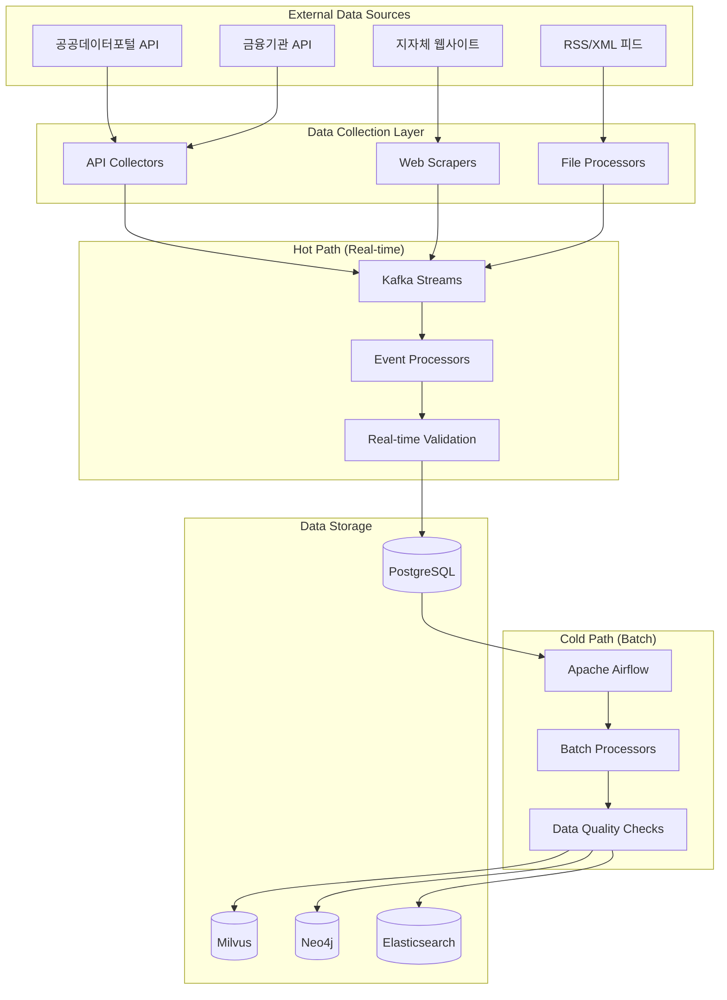

# 데이터 파이프라인 명세서 (Data Pipeline Specification)

| 항목 | 내용 |
|------|------|
| 문서 ID | AEG-SPC-20250917-1.0 |
| 버전 | 1.0 |
| 최종 수정일 | 2025년 9월 17일 |
| 작성자 | Dr. Aiden (수석 AI 시스템 아키텍트) |
| 상태 | 확정 (Finalized) |

## 1. 서비스 개요 (Service Overview)

데이터 파이프라인 서비스는 이지스 시스템의 **이중 트랙 파이프라인(Dual-Track Pipeline)**을 구현하는 핵심 서비스이다. 실시간 데이터 처리(Hot Path)와 배치 데이터 처리(Cold Path)를 통해 데이터 무결성과 실시간성을 모두 보장한다.

### 1.1. 핵심 책임 (Core Responsibilities)
- 외부 데이터 소스 연동 및 수집
- 실시간 데이터 스트리밍 처리 (Hot Path)
- 배치 데이터 처리 및 검증 (Cold Path)
- 데이터 품질 관리 및 모니터링
- 데이터 변환 및 표준화

### 1.2. 서비스 경계 (Service Boundaries)
**포함하는 기능:**
- 데이터 수집 및 ETL 프로세스
- 실시간 이벤트 스트리밍
- 데이터 품질 검증
- 데이터 동기화 관리

**포함하지 않는 기능:**
- 데이터 저장소 관리 (각 DB 서비스 담당)
- 비즈니스 로직 처리 (각 도메인 서비스 담당)
- 사용자 인터페이스 (Frontend 담당)

## 2. 이중 트랙 파이프라인 아키텍처

### 2.1. 전체 아키텍처


### 2.2. Hot Path vs Cold Path
| 특성 | Hot Path | Cold Path |
|------|----------|-----------|
| **처리 방식** | 실시간 스트리밍 | 배치 처리 |
| **지연 시간** | < 1초 | 분/시간 단위 |
| **데이터 품질** | 기본 검증 | 완전한 검증 |
| **처리량** | 높음 | 매우 높음 |
| **복잡성** | 단순 | 복잡 |
| **용도** | 즉시 반영 | 정확성 보장 |

## 3. Hot Path 구현 (실시간 처리)

### 3.1. Kafka Streams 처리
```python
from kafka import KafkaProducer, KafkaConsumer
import asyncio
import json

class HotPathProcessor:
    def __init__(self):
        self.producer = KafkaProducer(
            bootstrap_servers=['kafka:9092'],
            value_serializer=lambda v: json.dumps(v).encode('utf-8')
        )
        self.consumer = KafkaConsumer(
            'raw_policy_data',
            bootstrap_servers=['kafka:9092'],
            value_deserializer=lambda m: json.loads(m.decode('utf-8'))
        )
    
    async def process_policy_event(self, event: dict):
        """정책 이벤트 실시간 처리"""
        try:
            # 1. 기본 검증
            validated_data = await self.basic_validation(event)
            
            # 2. 데이터 변환
            transformed_data = await self.transform_data(validated_data)
            
            # 3. PostgreSQL에 즉시 저장
            await self.save_to_postgres(transformed_data)
            
            # 4. 다운스트림 이벤트 발행
            await self.publish_downstream_event(transformed_data)
            
            logger.info(f"Hot path processed policy: {transformed_data['policy_id']}")
            
        except Exception as e:
            logger.error(f"Hot path processing failed: {e}")
            # Dead Letter Queue로 전송
            await self.send_to_dlq(event, str(e))
    
    async def basic_validation(self, data: dict) -> dict:
        """기본 데이터 검증"""
        required_fields = ['title', 'content', 'issuing_organization']
        
        for field in required_fields:
            if not data.get(field):
                raise ValidationError(f"Missing required field: {field}")
        
        # 데이터 타입 검증
        if not isinstance(data.get('title'), str):
            raise ValidationError("Title must be string")
        
        return data
    
    async def transform_data(self, data: dict) -> dict:
        """데이터 변환"""
        return {
            'policy_id': str(uuid.uuid4()),
            'title': data['title'].strip(),
            'content': data['content'].strip(),
            'issuing_organization': data['issuing_organization'].strip(),
            'source_system': data.get('source_system', 'unknown'),
            'collected_at': datetime.utcnow().isoformat(),
            'processing_path': 'hot',
            'raw_data': data
        }
    
    async def save_to_postgres(self, data: dict):
        """PostgreSQL에 저장"""
        async with self.db_pool.acquire() as conn:
            await conn.execute("""
                INSERT INTO policies (
                    policy_id, title, content, issuing_organization,
                    source_system, collected_at, raw_data
                ) VALUES ($1, $2, $3, $4, $5, $6, $7)
                ON CONFLICT (policy_id) DO UPDATE SET
                    title = EXCLUDED.title,
                    content = EXCLUDED.content,
                    updated_at = NOW()
            """, 
            data['policy_id'], data['title'], data['content'],
            data['issuing_organization'], data['source_system'],
            data['collected_at'], json.dumps(data['raw_data'])
            )
```

### 3.2. 실시간 이벤트 처리
```python
class RealTimeEventProcessor:
    def __init__(self):
        self.kafka_consumer = KafkaConsumer('policy_events')
        self.event_handlers = {
            'policy_created': self.handle_policy_created,
            'policy_updated': self.handle_policy_updated,
            'policy_deleted': self.handle_policy_deleted
        }
    
    async def start_processing(self):
        """실시간 이벤트 처리 시작"""
        async for message in self.kafka_consumer:
            try:
                event = json.loads(message.value)
                event_type = event.get('event_type')
                
                if event_type in self.event_handlers:
                    await self.event_handlers[event_type](event)
                else:
                    logger.warning(f"Unknown event type: {event_type}")
                    
            except Exception as e:
                logger.error(f"Event processing failed: {e}")
                await self.handle_processing_error(message, e)
    
    async def handle_policy_created(self, event: dict):
        """정책 생성 이벤트 처리"""
        policy_data = event['data']
        
        # 벡터 임베딩 생성 (비동기)
        asyncio.create_task(self.generate_embedding(policy_data))
        
        # 검색 인덱스 업데이트
        await self.update_search_index(policy_data)
        
        # 캐시 무효화
        await self.invalidate_cache(policy_data)
```

## 4. Cold Path 구현 (배치 처리)

### 4.1. Apache Airflow DAG
```python
from airflow import DAG
from airflow.operators.python import PythonOperator
from airflow.operators.bash import BashOperator
from datetime import datetime, timedelta

default_args = {
    'owner': 'aegis-data-team',
    'depends_on_past': False,
    'start_date': datetime(2025, 1, 1),
    'email_on_failure': True,
    'email_on_retry': False,
    'retries': 3,
    'retry_delay': timedelta(minutes=5)
}

dag = DAG(
    'aegis_data_pipeline',
    default_args=default_args,
    description='Aegis Cold Path Data Pipeline',
    schedule_interval='@daily',
    catchup=False,
    max_active_runs=1
)

def extract_external_data(**context):
    """외부 데이터 추출"""
    from data_pipeline.extractors import PolicyDataExtractor
    
    extractor = PolicyDataExtractor()
    
    # 공공데이터포털에서 데이터 추출
    public_data = extractor.extract_from_public_portal()
    
    # 지자체 웹사이트에서 데이터 추출
    local_gov_data = extractor.extract_from_local_gov()
    
    # 금융기관 API에서 데이터 추출
    financial_data = extractor.extract_from_financial_apis()
    
    # 추출된 데이터를 임시 저장소에 저장
    total_extracted = len(public_data) + len(local_gov_data) + len(financial_data)
    
    logger.info(f"Extracted {total_extracted} policy records")
    
    return {
        'public_data_count': len(public_data),
        'local_gov_data_count': len(local_gov_data),
        'financial_data_count': len(financial_data)
    }

def transform_and_validate(**context):
    """데이터 변환 및 검증"""
    from data_pipeline.transformers import PolicyDataTransformer
    from data_pipeline.validators import DataQualityValidator
    
    transformer = PolicyDataTransformer()
    validator = DataQualityValidator()
    
    # 원시 데이터 로드
    raw_data = transformer.load_raw_data()
    
    # 데이터 변환
    transformed_data = transformer.transform_policies(raw_data)
    
    # 데이터 품질 검증
    validation_results = validator.validate_batch(transformed_data)
    
    # 검증 실패한 데이터 처리
    failed_records = [r for r in validation_results if not r.is_valid]
    if failed_records:
        logger.warning(f"Found {len(failed_records)} invalid records")
        # 실패한 레코드를 별도 테이블에 저장
        transformer.save_failed_records(failed_records)
    
    # 검증 통과한 데이터만 다음 단계로
    valid_data = [r.data for r in validation_results if r.is_valid]
    transformer.save_validated_data(valid_data)
    
    return {
        'total_processed': len(transformed_data),
        'valid_records': len(valid_data),
        'failed_records': len(failed_records)
    }

def load_to_databases(**context):
    """검증된 데이터를 각 데이터베이스에 로드"""
    from data_pipeline.loaders import DatabaseLoader
    
    loader = DatabaseLoader()
    
    # PostgreSQL 업데이트
    postgres_results = loader.load_to_postgres()
    
    # Milvus 벡터 인덱스 업데이트
    milvus_results = loader.load_to_milvus()
    
    # Neo4j 지식 그래프 업데이트
    neo4j_results = loader.load_to_neo4j()
    
    # Elasticsearch 검색 인덱스 업데이트
    es_results = loader.load_to_elasticsearch()
    
    return {
        'postgres_loaded': postgres_results['loaded_count'],
        'milvus_loaded': milvus_results['loaded_count'],
        'neo4j_loaded': neo4j_results['loaded_count'],
        'elasticsearch_loaded': es_results['loaded_count']
    }

def data_quality_check(**context):
    """최종 데이터 품질 검사"""
    from data_pipeline.quality import DataQualityChecker
    
    checker = DataQualityChecker()
    
    # 데이터 일관성 검사
    consistency_results = checker.check_cross_database_consistency()
    
    # 데이터 완성도 검사
    completeness_results = checker.check_data_completeness()
    
    # 데이터 신선도 검사
    freshness_results = checker.check_data_freshness()
    
    # 품질 점수 계산
    overall_quality_score = checker.calculate_overall_quality_score(
        consistency_results, completeness_results, freshness_results
    )
    
    # 품질 점수가 임계값 이하면 알림
    if overall_quality_score < 0.8:
        checker.send_quality_alert(overall_quality_score)
    
    return {
        'quality_score': overall_quality_score,
        'consistency_score': consistency_results['score'],
        'completeness_score': completeness_results['score'],
        'freshness_score': freshness_results['score']
    }

# Task 정의
extract_task = PythonOperator(
    task_id='extract_external_data',
    python_callable=extract_external_data,
    dag=dag
)

transform_task = PythonOperator(
    task_id='transform_and_validate',
    python_callable=transform_and_validate,
    dag=dag
)

load_task = PythonOperator(
    task_id='load_to_databases',
    python_callable=load_to_databases,
    dag=dag
)

quality_check_task = PythonOperator(
    task_id='data_quality_check',
    python_callable=data_quality_check,
    dag=dag
)

# Task 의존성 설정
extract_task >> transform_task >> load_task >> quality_check_task
```

### 4.2. 데이터 품질 관리
```python
class DataQualityManager:
    def __init__(self):
        self.quality_rules = [
            RequiredFieldRule(['title', 'content', 'issuing_organization']),
            DataTypeRule({'title': str, 'content': str}),
            LengthRule({'title': (1, 512), 'content': (10, None)}),
            FormatRule({'url': r'https?://.*'}),
            BusinessRule('funding_amount_positive'),
            ConsistencyRule('cross_database_sync')
        ]
    
    async def validate_batch(self, data_batch: List[dict]) -> List[ValidationResult]:
        """배치 데이터 검증"""
        results = []
        
        for record in data_batch:
            validation_result = ValidationResult(
                record_id=record.get('policy_id'),
                is_valid=True,
                errors=[],
                warnings=[],
                quality_score=1.0
            )
            
            # 각 규칙 적용
            for rule in self.quality_rules:
                rule_result = await rule.validate(record)
                
                if not rule_result.is_valid:
                    validation_result.is_valid = False
                    validation_result.errors.extend(rule_result.errors)
                
                validation_result.warnings.extend(rule_result.warnings)
                validation_result.quality_score *= rule_result.score
            
            results.append(validation_result)
        
        return results
    
    async def check_cross_database_consistency(self) -> ConsistencyReport:
        """데이터베이스 간 일관성 검사"""
        # PostgreSQL의 정책 수
        pg_count = await self.postgres.count_active_policies()
        
        # Milvus의 벡터 수
        milvus_count = await self.milvus.count_vectors()
        
        # Neo4j의 노드 수
        neo4j_count = await self.neo4j.count_policy_nodes()
        
        # Elasticsearch의 문서 수
        es_count = await self.elasticsearch.count_documents()
        
        # 일관성 점수 계산
        counts = [pg_count, milvus_count, neo4j_count, es_count]
        max_count = max(counts)
        min_count = min(counts)
        
        consistency_score = min_count / max_count if max_count > 0 else 0
        
        return ConsistencyReport(
            postgres_count=pg_count,
            milvus_count=milvus_count,
            neo4j_count=neo4j_count,
            elasticsearch_count=es_count,
            consistency_score=consistency_score,
            is_consistent=consistency_score > 0.95
        )
```

---

**📋 관련 문서**
- [이중 트랙 파이프라인](../../02_CORE_COMPONENTS/01_DUAL_TRACK_PIPELINE.md)
- [데이터 아키텍처](../../01_ARCHITECTURE/03_DATA_ARCHITECTURE.md)
- [이벤트 스키마](../../03_DATA_AND_APIS/03_EVENT_SCHEMA.md)