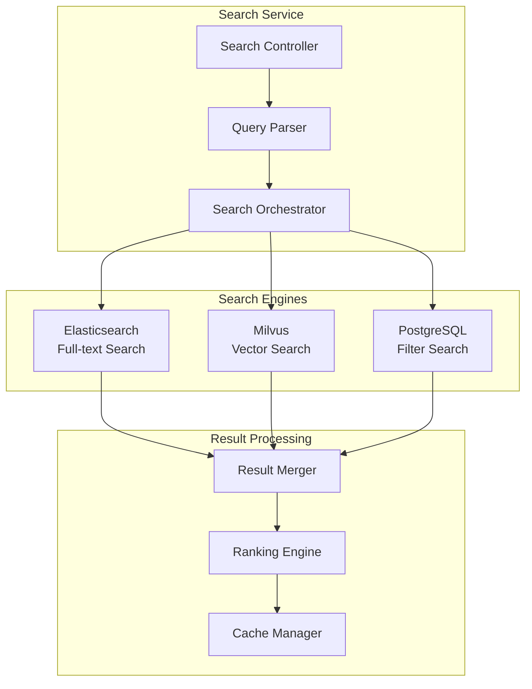

# 검색 서비스 명세서 (Search Service Specification)

| 항목 | 내용 |
|------|------|
| 문서 ID | AEG-SPC-20250917-1.0 |
| 버전 | 1.0 |
| 최종 수정일 | 2025년 9월 17일 |
| 작성자 | Dr. Aiden (수석 AI 시스템 아키텍트) |
| 상태 | 확정 (Finalized) |

## 1. 서비스 개요 (Service Overview)

검색 서비스는 이지스 시스템의 정책 검색 기능을 담당하는 전문 서비스이다. **하이브리드 검색 엔진**을 통해 키워드 검색, 의미 검색, 필터링 검색을 통합하여 사용자에게 정확하고 빠른 검색 결과를 제공한다.

### 1.1. 핵심 책임 (Core Responsibilities)
- 키워드 기반 전문 검색 (Full-text Search)
- 의미 기반 벡터 검색 (Semantic Search)
- 다중 조건 필터링 검색
- 검색 결과 랭킹 및 정렬
- 검색 성능 최적화 및 캐싱

### 1.2. 서비스 경계 (Service Boundaries)
**포함하는 기능:**
- 정책 검색 엔진
- 검색 인덱스 관리
- 검색 결과 캐싱
- 검색 성능 모니터링

**포함하지 않는 기능:**
- 개인화 추천 (Recommendation Service 담당)
- 사용자 관리 (User Service 담당)
- 정책 데이터 관리 (Policy Service 담당)

## 2. 검색 아키텍처

### 2.1. 하이브리드 검색 엔진


### 2.2. 검색 전략
| 검색 타입 | 엔진 | 용도 | 가중치 |
|-----------|------|------|--------|
| **키워드 검색** | Elasticsearch | 정확한 용어 매칭 | 40% |
| **의미 검색** | Milvus | 의미적 유사성 | 35% |
| **필터 검색** | PostgreSQL | 조건부 필터링 | 25% |

## 3. API 명세

### 3.1. 통합 검색 API
```http
GET /api/v1/search/policies
```

**Query Parameters:**
```
q: 검색 키워드 (필수)
region: 지역 필터 (선택)
industry: 업종 필터 (선택)
business_type: 사업자 유형 필터 (선택)
funding_type: 자금 유형 필터 (선택)
amount_min: 최소 지원금액 (선택)
amount_max: 최대 지원금액 (선택)
sort: 정렬 기준 (relevance|amount|deadline) (기본값: relevance)
limit: 결과 수 제한 (기본값: 20, 최대: 100)
offset: 페이지네이션 오프셋 (기본값: 0)
```

**Response Example:**
```json
{
  "success": true,
  "data": {
    "policies": [
      {
        "policy_id": "uuid",
        "title": "경기도 소상공인 특별경영자금",
        "issuing_organization": "경기도청",
        "summary": "경기도 내 소상공인 경영 안정 지원",
        "funding_details": {
          "max_amount": 50000000,
          "interest_rate": 2.5,
          "funding_type": "대출"
        },
        "application_period": {
          "start_date": "2025-01-01",
          "end_date": "2025-12-31"
        },
        "relevance_score": 0.95,
        "match_reasons": [
          "키워드 '소상공인' 정확 매칭",
          "지역 조건 일치",
          "업종 조건 부분 일치"
        ]
      }
    ],
    "pagination": {
      "total": 156,
      "limit": 20,
      "offset": 0,
      "has_next": true
    },
    "search_metadata": {
      "query_time_ms": 45,
      "total_searched": 3456,
      "search_strategy": "hybrid",
      "cache_hit": false
    }
  }
}
```

### 3.2. 자동완성 API
```http
GET /api/v1/search/autocomplete?q={partial_query}
```

**Response Example:**
```json
{
  "success": true,
  "data": {
    "suggestions": [
      {
        "text": "소상공인 운영자금",
        "type": "keyword",
        "frequency": 1250
      },
      {
        "text": "소상공인 창업자금",
        "type": "keyword", 
        "frequency": 890
      }
    ]
  }
}
```

## 4. 검색 엔진별 구현

### 4.1. Elasticsearch 설정
```json
{
  "settings": {
    "analysis": {
      "analyzer": {
        "korean_analyzer": {
          "type": "custom",
          "tokenizer": "nori_tokenizer",
          "filter": [
            "lowercase",
            "nori_part_of_speech",
            "nori_readingform",
            "stop"
          ]
        }
      }
    }
  },
  "mappings": {
    "properties": {
      "title": {
        "type": "text",
        "analyzer": "korean_analyzer",
        "fields": {
          "keyword": {
            "type": "keyword"
          }
        }
      },
      "content": {
        "type": "text",
        "analyzer": "korean_analyzer"
      },
      "issuing_organization": {
        "type": "keyword"
      },
      "target_regions": {
        "type": "keyword"
      },
      "target_industries": {
        "type": "keyword"
      },
      "funding_amount_max": {
        "type": "long"
      },
      "application_end_date": {
        "type": "date"
      }
    }
  }
}
```

### 4.2. 검색 쿼리 구현
```python
class SearchService:
    def __init__(self):
        self.elasticsearch = Elasticsearch()
        self.milvus = MilvusClient()
        self.postgres = PostgreSQLClient()
        self.cache = RedisClient()
    
    async def hybrid_search(self, query: SearchQuery) -> SearchResult:
        """하이브리드 검색 실행"""
        # 캐시 확인
        cache_key = self.generate_cache_key(query)
        cached_result = await self.cache.get(cache_key)
        if cached_result:
            return cached_result
        
        # 병렬 검색 실행
        tasks = [
            self.elasticsearch_search(query),
            self.vector_search(query),
            self.filter_search(query)
        ]
        
        es_results, vector_results, filter_results = await asyncio.gather(*tasks)
        
        # 결과 통합 및 랭킹
        merged_results = self.merge_results(es_results, vector_results, filter_results)
        ranked_results = self.rank_results(merged_results, query)
        
        # 캐시 저장
        await self.cache.setex(cache_key, 300, ranked_results)  # 5분 캐시
        
        return ranked_results
    
    async def elasticsearch_search(self, query: SearchQuery) -> List[PolicyResult]:
        """Elasticsearch 키워드 검색"""
        search_body = {
            "query": {
                "bool": {
                    "must": [
                        {
                            "multi_match": {
                                "query": query.text,
                                "fields": ["title^3", "content^1", "summary^2"],
                                "type": "best_fields",
                                "fuzziness": "AUTO"
                            }
                        }
                    ],
                    "filter": self.build_filters(query)
                }
            },
            "highlight": {
                "fields": {
                    "title": {},
                    "content": {}
                }
            },
            "size": query.limit * 2  # 더 많은 후보 확보
        }
        
        response = await self.elasticsearch.search(
            index="aegis_policies",
            body=search_body
        )
        
        return self.parse_es_results(response)
    
    async def vector_search(self, query: SearchQuery) -> List[PolicyResult]:
        """Milvus 벡터 검색"""
        # 쿼리 임베딩 생성
        query_embedding = await self.embedding_service.embed(query.text)
        
        # 벡터 검색 실행
        search_params = {
            "metric_type": "L2",
            "params": {"ef": 64}
        }
        
        results = await self.milvus.search(
            collection_name="aegis_policies_v1",
            data=[query_embedding],
            anns_field="embedding",
            param=search_params,
            limit=query.limit * 2,
            expr=self.build_milvus_filter(query)
        )
        
        return self.parse_vector_results(results)
    
    def merge_results(self, es_results: List, vector_results: List, 
                     filter_results: List) -> List[PolicyResult]:
        """검색 결과 통합"""
        result_map = {}
        
        # Elasticsearch 결과 (가중치: 0.4)
        for result in es_results:
            policy_id = result.policy_id
            if policy_id not in result_map:
                result_map[policy_id] = result
                result_map[policy_id].scores = {}
            result_map[policy_id].scores['elasticsearch'] = result.score * 0.4
        
        # Vector 검색 결과 (가중치: 0.35)
        for result in vector_results:
            policy_id = result.policy_id
            if policy_id not in result_map:
                result_map[policy_id] = result
                result_map[policy_id].scores = {}
            result_map[policy_id].scores['vector'] = result.score * 0.35
        
        # Filter 검색 결과 (가중치: 0.25)
        for result in filter_results:
            policy_id = result.policy_id
            if policy_id not in result_map:
                result_map[policy_id] = result
                result_map[policy_id].scores = {}
            result_map[policy_id].scores['filter'] = result.score * 0.25
        
        # 최종 점수 계산
        for result in result_map.values():
            result.final_score = sum(result.scores.values())
        
        return list(result_map.values())
```

## 5. 성능 최적화

### 5.1. 캐싱 전략
```python
class SearchCacheManager:
    def __init__(self):
        self.redis = RedisClient()
        self.cache_ttl = {
            'search_results': 300,      # 5분
            'autocomplete': 3600,       # 1시간
            'popular_queries': 86400,   # 24시간
        }
    
    def generate_cache_key(self, query: SearchQuery) -> str:
        """캐시 키 생성"""
        key_parts = [
            query.text,
            query.region or '',
            query.industry or '',
            query.business_type or '',
            str(query.limit),
            str(query.offset),
            query.sort
        ]
        
        key_string = '|'.join(key_parts)
        return f"search:{hashlib.md5(key_string.encode()).hexdigest()}"
    
    async def get_cached_result(self, cache_key: str) -> Optional[SearchResult]:
        """캐시된 결과 조회"""
        cached_data = await self.redis.get(cache_key)
        if cached_data:
            return SearchResult.parse_raw(cached_data)
        return None
    
    async def cache_result(self, cache_key: str, result: SearchResult):
        """검색 결과 캐싱"""
        await self.redis.setex(
            cache_key,
            self.cache_ttl['search_results'],
            result.json()
        )
```

### 5.2. 인덱스 최적화
```python
class IndexOptimizer:
    async def optimize_elasticsearch_index(self):
        """Elasticsearch 인덱스 최적화"""
        # 인덱스 설정 최적화
        settings = {
            "refresh_interval": "30s",  # 실시간성 vs 성능 균형
            "number_of_replicas": 1,
            "max_result_window": 10000
        }
        
        await self.elasticsearch.indices.put_settings(
            index="aegis_policies",
            body={"settings": settings}
        )
    
    async def optimize_milvus_index(self):
        """Milvus 인덱스 최적화"""
        index_params = {
            "metric_type": "L2",
            "index_type": "HNSW",
            "params": {
                "M": 16,
                "efConstruction": 64
            }
        }
        
        await self.milvus.create_index(
            collection_name="aegis_policies_v1",
            field_name="embedding",
            index_params=index_params
        )
```

---

**📋 관련 문서**
- [추천 서비스](../RECOMMENDATION_SERVICE/01_RECOMMENDATION_SERVICE_OVERVIEW.md)
- [정책 서비스](../POLICY_SERVICE/01_POLICY_SERVICE_OVERVIEW.md)
- [API 명세서](../../03_DATA_AND_APIS/02_API_CONTRACT.md)