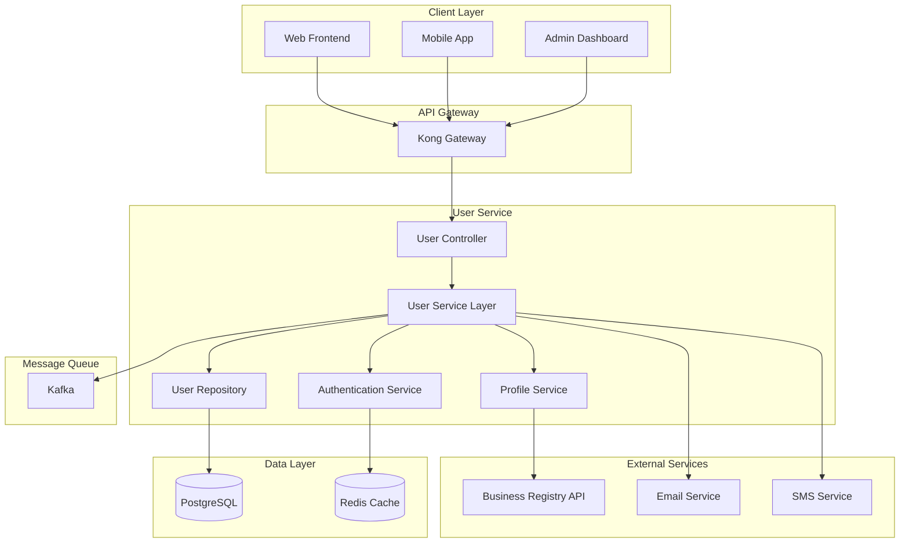

# 사용자 서비스 기술 설계

| 항목 | 내용 |
|------|------|
| 문서 ID | AEG-SPC-USER-20250917-3.0 |
| 버전 | 3.0 |
| 최종 수정일 | 2025년 9월 17일 |
| 작성자 | Dr. Aiden (수석 AI 시스템 아키텍트) |
| 상태 | 확정 (Finalized) |

## 1. 개요 (Overview)

본 문서는 이지스 시스템의 사용자 서비스에 대한 상세 기술 설계를 정의한다. **마이크로서비스 아키텍처** 패턴을 기반으로 하며, **도메인 주도 설계(DDD)** 원칙을 적용하여 사용자 도메인의 복잡성을 효과적으로 관리한다.

## 2. 아키텍처 설계

### 2.1. 서비스 아키텍처



### 2.2. 도메인 모델 설계

#### 핵심 도메인 엔티티
```python
from dataclasses import dataclass
from typing import Optional, List
from datetime import datetime
from enum import Enum

class BusinessType(str, Enum):
    SOLE_PROPRIETORSHIP = "개인사업자"
    CORPORATION = "법인사업자"
    PARTNERSHIP = "조합"

class UserStatus(str, Enum):
    ACTIVE = "active"
    INACTIVE = "inactive"
    SUSPENDED = "suspended"
    PENDING_VERIFICATION = "pending_verification"

@dataclass
class User:
    """사용자 애그리게이트 루트"""
    user_id: str
    email: str
    password_hash: str
    status: UserStatus
    created_at: datetime
    updated_at: datetime
    last_login_at: Optional[datetime] = None
    email_verified: bool = False
    
    # 도메인 메서드
    def verify_email(self) -> None:
        """이메일 인증 처리"""
        self.email_verified = True
        self.status = UserStatus.ACTIVE
        self.updated_at = datetime.utcnow()
    
    def update_last_login(self) -> None:
        """마지막 로그인 시간 업데이트"""
        self.last_login_at = datetime.utcnow()
    
    def suspend(self, reason: str) -> None:
        """계정 정지"""
        self.status = UserStatus.SUSPENDED
        self.updated_at = datetime.utcnow()

@dataclass
class BusinessProfile:
    """사업체 프로필 엔티티"""
    profile_id: str
    user_id: str
    business_registration_number: str
    business_name: str
    business_type: BusinessType
    industry_code: str
    industry_name: str
    establishment_date: datetime
    annual_revenue: Optional[int] = None
    employee_count: Optional[int] = None
    business_address: Optional[str] = None
    created_at: datetime = datetime.utcnow()
    updated_at: datetime = datetime.utcnow()
    
    def update_financial_info(self, revenue: int, employees: int) -> None:
        """재무 정보 업데이트"""
        self.annual_revenue = revenue
        self.employee_count = employees
        self.updated_at = datetime.utcnow()

@dataclass
class UserPreferences:
    """사용자 선호도 엔티티"""
    preference_id: str
    user_id: str
    preferred_funding_types: List[str]
    max_interest_rate: Optional[float] = None
    preferred_amount_range: Optional[tuple] = None
    complexity_tolerance: str = "medium"  # low, medium, high
    notification_preferences: dict = None
    created_at: datetime = datetime.utcnow()
    updated_at: datetime = datetime.utcnow()
```

### 2.3. 서비스 계층 설계

#### 애플리케이션 서비스
```python
from abc import ABC, abstractmethod
from typing import Optional, List

class UserService:
    """사용자 애플리케이션 서비스"""
    
    def __init__(self, 
                 user_repository: UserRepository,
                 profile_repository: BusinessProfileRepository,
                 auth_service: AuthenticationService,
                 event_publisher: EventPublisher):
        self.user_repository = user_repository
        self.profile_repository = profile_repository
        self.auth_service = auth_service
        self.event_publisher = event_publisher
    
    async def register_user(self, registration_data: UserRegistrationRequest) -> UserRegistrationResponse:
        """사용자 등록"""
        # 1. 중복 검사
        existing_user = await self.user_repository.find_by_email(registration_data.email)
        if existing_user:
            raise UserAlreadyExistsError("이미 등록된 이메일입니다")
        
        # 2. 사업자등록번호 검증
        business_info = await self.verify_business_registration(
            registration_data.business_registration_number
        )
        
        # 3. 사용자 생성
        user = User(
            user_id=generate_uuid(),
            email=registration_data.email,
            password_hash=await self.auth_service.hash_password(registration_data.password),
            status=UserStatus.PENDING_VERIFICATION,
            created_at=datetime.utcnow(),
            updated_at=datetime.utcnow()
        )
        
        # 4. 사업체 프로필 생성
        profile = BusinessProfile(
            profile_id=generate_uuid(),
            user_id=user.user_id,
            business_registration_number=registration_data.business_registration_number,
            business_name=business_info.business_name,
            business_type=business_info.business_type,
            industry_code=business_info.industry_code,
            industry_name=business_info.industry_name,
            establishment_date=business_info.establishment_date
        )
        
        # 5. 저장
        await self.user_repository.save(user)
        await self.profile_repository.save(profile)
        
        # 6. 이벤트 발행
        await self.event_publisher.publish(UserRegisteredEvent(
            user_id=user.user_id,
            email=user.email,
            business_type=profile.business_type,
            industry_code=profile.industry_code
        ))
        
        # 7. 이메일 인증 발송
        await self.send_verification_email(user.email, user.user_id)
        
        return UserRegistrationResponse(
            user_id=user.user_id,
            status="pending_verification",
            message="회원가입이 완료되었습니다. 이메일을 확인해주세요."
        )
    
    async def authenticate_user(self, login_request: LoginRequest) -> LoginResponse:
        """사용자 인증"""
        # 1. 사용자 조회
        user = await self.user_repository.find_by_email(login_request.email)
        if not user:
            raise InvalidCredentialsError("잘못된 이메일 또는 비밀번호입니다")
        
        # 2. 비밀번호 검증
        if not await self.auth_service.verify_password(login_request.password, user.password_hash):
            raise InvalidCredentialsError("잘못된 이메일 또는 비밀번호입니다")
        
        # 3. 계정 상태 확인
        if user.status != UserStatus.ACTIVE:
            raise AccountNotActiveError("계정이 활성화되지 않았습니다")
        
        # 4. JWT 토큰 생성
        access_token = await self.auth_service.create_access_token(user.user_id)
        refresh_token = await self.auth_service.create_refresh_token(user.user_id)
        
        # 5. 로그인 시간 업데이트
        user.update_last_login()
        await self.user_repository.save(user)
        
        # 6. 이벤트 발행
        await self.event_publisher.publish(UserLoggedInEvent(
            user_id=user.user_id,
            login_time=datetime.utcnow()
        ))
        
        return LoginResponse(
            access_token=access_token,
            refresh_token=refresh_token,
            user_id=user.user_id,
            expires_in=3600
        )
```

### 2.4. 데이터 접근 계층

#### Repository 패턴 구현
```python
class UserRepository(ABC):
    """사용자 리포지토리 인터페이스"""
    
    @abstractmethod
    async def save(self, user: User) -> None:
        pass
    
    @abstractmethod
    async def find_by_id(self, user_id: str) -> Optional[User]:
        pass
    
    @abstractmethod
    async def find_by_email(self, email: str) -> Optional[User]:
        pass
    
    @abstractmethod
    async def delete(self, user_id: str) -> None:
        pass

class PostgreSQLUserRepository(UserRepository):
    """PostgreSQL 사용자 리포지토리 구현"""
    
    def __init__(self, db_connection: AsyncConnection):
        self.db = db_connection
    
    async def save(self, user: User) -> None:
        """사용자 저장"""
        query = """
        INSERT INTO users (user_id, email, password_hash, status, created_at, updated_at, 
                          last_login_at, email_verified)
        VALUES ($1, $2, $3, $4, $5, $6, $7, $8)
        ON CONFLICT (user_id) DO UPDATE SET
            email = EXCLUDED.email,
            password_hash = EXCLUDED.password_hash,
            status = EXCLUDED.status,
            updated_at = EXCLUDED.updated_at,
            last_login_at = EXCLUDED.last_login_at,
            email_verified = EXCLUDED.email_verified
        """
        
        await self.db.execute(query, 
            user.user_id, user.email, user.password_hash, user.status.value,
            user.created_at, user.updated_at, user.last_login_at, user.email_verified
        )
    
    async def find_by_email(self, email: str) -> Optional[User]:
        """이메일로 사용자 조회"""
        query = """
        SELECT user_id, email, password_hash, status, created_at, updated_at, 
               last_login_at, email_verified
        FROM users 
        WHERE email = $1
        """
        
        row = await self.db.fetchrow(query, email)
        if not row:
            return None
        
        return User(
            user_id=row['user_id'],
            email=row['email'],
            password_hash=row['password_hash'],
            status=UserStatus(row['status']),
            created_at=row['created_at'],
            updated_at=row['updated_at'],
            last_login_at=row['last_login_at'],
            email_verified=row['email_verified']
        )
```

## 3. 보안 설계

### 3.1. 인증 및 인가

#### JWT 토큰 관리
```python
import jwt
from datetime import datetime, timedelta
from typing import Dict, Any

class JWTAuthenticationService:
    """JWT 인증 서비스"""
    
    def __init__(self, secret_key: str, algorithm: str = "HS256"):
        self.secret_key = secret_key
        self.algorithm = algorithm
        self.access_token_expire = timedelta(hours=1)
        self.refresh_token_expire = timedelta(days=30)
    
    async def create_access_token(self, user_id: str, roles: List[str] = None) -> str:
        """액세스 토큰 생성"""
        payload = {
            "sub": user_id,
            "type": "access",
            "roles": roles or [],
            "iat": datetime.utcnow(),
            "exp": datetime.utcnow() + self.access_token_expire,
            "jti": generate_uuid()
        }
        
        return jwt.encode(payload, self.secret_key, algorithm=self.algorithm)
    
    async def verify_token(self, token: str) -> Dict[str, Any]:
        """토큰 검증"""
        try:
            payload = jwt.decode(token, self.secret_key, algorithms=[self.algorithm])
            
            # 토큰 블랙리스트 확인
            if await self.is_token_blacklisted(payload.get("jti")):
                raise TokenBlacklistedError("토큰이 무효화되었습니다")
            
            return payload
            
        except jwt.ExpiredSignatureError:
            raise TokenExpiredError("토큰이 만료되었습니다")
        except jwt.InvalidTokenError:
            raise InvalidTokenError("유효하지 않은 토큰입니다")
```

### 3.2. 비밀번호 보안

#### 비밀번호 해싱 및 검증
```python
import bcrypt
import secrets
from typing import str

class PasswordService:
    """비밀번호 보안 서비스"""
    
    def __init__(self):
        self.rounds = 12  # bcrypt 라운드 수
    
    async def hash_password(self, password: str) -> str:
        """비밀번호 해싱"""
        # 솔트 생성
        salt = bcrypt.gensalt(rounds=self.rounds)
        
        # 비밀번호 해싱
        hashed = bcrypt.hashpw(password.encode('utf-8'), salt)
        
        return hashed.decode('utf-8')
    
    async def verify_password(self, password: str, hashed: str) -> bool:
        """비밀번호 검증"""
        return bcrypt.checkpw(password.encode('utf-8'), hashed.encode('utf-8'))
    
    def generate_secure_password(self, length: int = 12) -> str:
        """안전한 임시 비밀번호 생성"""
        alphabet = "abcdefghijklmnopqrstuvwxyzABCDEFGHIJKLMNOPQRSTUVWXYZ0123456789!@#$%^&*"
        return ''.join(secrets.choice(alphabet) for _ in range(length))
    
    def validate_password_strength(self, password: str) -> Dict[str, bool]:
        """비밀번호 강도 검증"""
        return {
            "min_length": len(password) >= 8,
            "has_uppercase": any(c.isupper() for c in password),
            "has_lowercase": any(c.islower() for c in password),
            "has_digit": any(c.isdigit() for c in password),
            "has_special": any(c in "!@#$%^&*()_+-=[]{}|;:,.<>?" for c in password)
        }
```

## 4. 캐싱 전략

### 4.1. Redis 캐싱 구현

```python
import redis.asyncio as redis
import json
from typing import Optional, Any
from datetime import timedelta

class UserCacheService:
    """사용자 캐싱 서비스"""
    
    def __init__(self, redis_client: redis.Redis):
        self.redis = redis_client
        self.default_ttl = 3600  # 1시간
    
    async def cache_user_profile(self, user_id: str, profile: dict, ttl: int = None) -> None:
        """사용자 프로필 캐싱"""
        cache_key = f"user:profile:{user_id}"
        cache_ttl = ttl or self.default_ttl
        
        await self.redis.setex(
            cache_key,
            cache_ttl,
            json.dumps(profile, default=str)
        )
    
    async def get_cached_user_profile(self, user_id: str) -> Optional[dict]:
        """캐시된 사용자 프로필 조회"""
        cache_key = f"user:profile:{user_id}"
        cached_data = await self.redis.get(cache_key)
        
        if cached_data:
            return json.loads(cached_data)
        
        return None
    
    async def invalidate_user_cache(self, user_id: str) -> None:
        """사용자 캐시 무효화"""
        patterns = [
            f"user:profile:{user_id}",
            f"user:preferences:{user_id}",
            f"user:session:{user_id}:*"
        ]
        
        for pattern in patterns:
            if "*" in pattern:
                # 패턴 매칭으로 삭제
                keys = await self.redis.keys(pattern)
                if keys:
                    await self.redis.delete(*keys)
            else:
                await self.redis.delete(pattern)
```

## 5. 이벤트 처리

### 5.1. 도메인 이벤트 정의

```python
from dataclasses import dataclass
from datetime import datetime
from typing import Dict, Any

@dataclass
class DomainEvent:
    """도메인 이벤트 기본 클래스"""
    event_id: str
    event_type: str
    aggregate_id: str
    occurred_at: datetime
    version: int = 1

@dataclass
class UserRegisteredEvent(DomainEvent):
    """사용자 등록 이벤트"""
    email: str
    business_type: str
    industry_code: str
    
    def __post_init__(self):
        self.event_type = "UserRegistered"

@dataclass
class UserProfileUpdatedEvent(DomainEvent):
    """사용자 프로필 업데이트 이벤트"""
    changes: Dict[str, Any]
    
    def __post_init__(self):
        self.event_type = "UserProfileUpdated"

class EventPublisher:
    """이벤트 발행자"""
    
    def __init__(self, kafka_producer: KafkaProducer):
        self.producer = kafka_producer
    
    async def publish(self, event: DomainEvent) -> None:
        """이벤트 발행"""
        topic = f"aegis.user.{event.event_type.lower()}.v1"
        
        message = {
            "eventId": event.event_id,
            "eventType": event.event_type,
            "aggregateId": event.aggregate_id,
            "occurredAt": event.occurred_at.isoformat(),
            "version": event.version,
            "data": event.__dict__
        }
        
        await self.producer.send(topic, value=message)
```

## 6. 성능 최적화

### 6.1. 데이터베이스 최적화

#### 인덱스 전략
```sql
-- 사용자 테이블 인덱스
CREATE INDEX CONCURRENTLY idx_users_email ON users (email);
CREATE INDEX CONCURRENTLY idx_users_status ON users (status) WHERE status = 'active';
CREATE INDEX CONCURRENTLY idx_users_created_at ON users (created_at);

-- 사업체 프로필 테이블 인덱스
CREATE INDEX CONCURRENTLY idx_business_profiles_user_id ON business_profiles (user_id);
CREATE INDEX CONCURRENTLY idx_business_profiles_business_reg_num ON business_profiles (business_registration_number);
CREATE INDEX CONCURRENTLY idx_business_profiles_industry ON business_profiles (industry_code);

-- 복합 인덱스
CREATE INDEX CONCURRENTLY idx_users_email_status ON users (email, status);
```

### 6.2. 연결 풀 관리

```python
import asyncpg
from typing import Optional

class DatabaseConnectionPool:
    """데이터베이스 연결 풀 관리"""
    
    def __init__(self, database_url: str):
        self.database_url = database_url
        self.pool: Optional[asyncpg.Pool] = None
    
    async def initialize(self) -> None:
        """연결 풀 초기화"""
        self.pool = await asyncpg.create_pool(
            self.database_url,
            min_size=5,
            max_size=20,
            max_queries=50000,
            max_inactive_connection_lifetime=300,
            command_timeout=60
        )
    
    async def get_connection(self) -> asyncpg.Connection:
        """연결 획득"""
        if not self.pool:
            await self.initialize()
        
        return await self.pool.acquire()
    
    async def release_connection(self, connection: asyncpg.Connection) -> None:
        """연결 반환"""
        await self.pool.release(connection)
    
    async def close(self) -> None:
        """연결 풀 종료"""
        if self.pool:
            await self.pool.close()
```

---

**📋 관련 문서**
- [비즈니스 요구사항](./02_BUSINESS_REQUIREMENTS.md)
- [API 명세](./04_API_SPECIFICATION.md)
- [데이터 모델](./05_DATA_MODEL.md)
- [테스트 전략](./08_TESTING_STRATEGY.md)