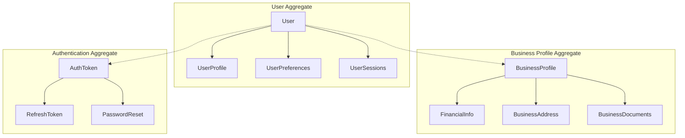

# 사용자 서비스 데이터 모델

| 항목 | 내용 |
|------|------|
| 문서 ID | AEG-SPC-USER-20250917-5.0 |
| 버전 | 5.0 |
| 최종 수정일 | 2025년 9월 17일 |
| 작성자 | Dr. Aiden (수석 AI 시스템 아키텍트) |
| 상태 | 확정 (Finalized) |

## 1. 개요 (Overview)

본 문서는 이지스 시스템의 사용자 서비스에서 사용하는 모든 데이터 모델을 정의한다. **도메인 주도 설계(DDD)** 원칙을 따라 비즈니스 도메인을 정확히 반영하는 데이터 구조를 설계한다.

## 2. 도메인 모델 개요

### 2.1. 애그리게이트 구조



## 3. 핵심 엔티티 정의

### 3.1. User 엔티티

#### 데이터베이스 스키마
```sql
CREATE TABLE users (
    user_id UUID PRIMARY KEY DEFAULT gen_random_uuid(),
    email VARCHAR(255) UNIQUE NOT NULL,
    password_hash VARCHAR(255) NOT NULL,
    status VARCHAR(50) NOT NULL DEFAULT 'pending_verification',
    email_verified BOOLEAN DEFAULT FALSE,
    created_at TIMESTAMPTZ DEFAULT NOW(),
    updated_at TIMESTAMPTZ DEFAULT NOW(),
    last_login_at TIMESTAMPTZ,
    login_count INTEGER DEFAULT 0,
    failed_login_attempts INTEGER DEFAULT 0,
    locked_until TIMESTAMPTZ,
    
    -- 제약 조건
    CONSTRAINT users_email_check CHECK (email ~* '^[A-Za-z0-9._%+-]+@[A-Za-z0-9.-]+\.[A-Za-z]{2,}$'),
    CONSTRAINT users_status_check CHECK (status IN ('pending_verification', 'active', 'inactive', 'suspended', 'deleted'))
);

-- 인덱스
CREATE INDEX idx_users_email ON users (email);
CREATE INDEX idx_users_status ON users (status) WHERE status = 'active';
CREATE INDEX idx_users_created_at ON users (created_at);
CREATE INDEX idx_users_last_login ON users (last_login_at) WHERE last_login_at IS NOT NULL;
```

#### Python 도메인 모델
```python
from dataclasses import dataclass, field
from datetime import datetime
from typing import Optional
from enum import Enum

class UserStatus(str, Enum):
    PENDING_VERIFICATION = "pending_verification"
    ACTIVE = "active"
    INACTIVE = "inactive"
    SUSPENDED = "suspended"
    DELETED = "deleted"

@dataclass
class User:
    """사용자 애그리게이트 루트"""
    user_id: str
    email: str
    password_hash: str
    status: UserStatus = UserStatus.PENDING_VERIFICATION
    email_verified: bool = False
    created_at: datetime = field(default_factory=datetime.utcnow)
    updated_at: datetime = field(default_factory=datetime.utcnow)
    last_login_at: Optional[datetime] = None
    login_count: int = 0
    failed_login_attempts: int = 0
    locked_until: Optional[datetime] = None
    
    def verify_email(self) -> None:
        """이메일 인증 처리"""
        if self.status == UserStatus.PENDING_VERIFICATION:
            self.email_verified = True
            self.status = UserStatus.ACTIVE
            self.updated_at = datetime.utcnow()
    
    def record_successful_login(self) -> None:
        """성공적인 로그인 기록"""
        self.last_login_at = datetime.utcnow()
        self.login_count += 1
        self.failed_login_attempts = 0
        self.locked_until = None
        self.updated_at = datetime.utcnow()
    
    def record_failed_login(self) -> None:
        """실패한 로그인 기록"""
        self.failed_login_attempts += 1
        if self.failed_login_attempts >= 5:
            self.locked_until = datetime.utcnow() + timedelta(minutes=15)
        self.updated_at = datetime.utcnow()
    
    def is_locked(self) -> bool:
        """계정 잠금 상태 확인"""
        if self.locked_until is None:
            return False
        return datetime.utcnow() < self.locked_until
    
    def can_login(self) -> bool:
        """로그인 가능 여부 확인"""
        return (
            self.status == UserStatus.ACTIVE and
            self.email_verified and
            not self.is_locked()
        )
```

### 3.2. BusinessProfile 엔티티

#### 데이터베이스 스키마
```sql
CREATE TABLE business_profiles (
    profile_id UUID PRIMARY KEY DEFAULT gen_random_uuid(),
    user_id UUID NOT NULL REFERENCES users(user_id) ON DELETE CASCADE,
    
    -- 사업체 기본 정보
    business_registration_number VARCHAR(12) UNIQUE NOT NULL,
    business_name VARCHAR(255) NOT NULL,
    business_type VARCHAR(50) NOT NULL,
    industry_code VARCHAR(10) NOT NULL,
    industry_name VARCHAR(255) NOT NULL,
    establishment_date DATE NOT NULL,
    
    -- 재무 정보
    annual_revenue BIGINT,
    employee_count INTEGER DEFAULT 0,
    capital_amount BIGINT,
    
    -- 주소 정보
    business_address JSONB,
    
    -- 연락처 정보
    business_phone VARCHAR(20),
    business_email VARCHAR(255),
    representative_name VARCHAR(100),
    
    -- 인증 상태
    verification_status VARCHAR(50) DEFAULT 'pending',
    verified_at TIMESTAMPTZ,
    
    -- 시스템 필드
    created_at TIMESTAMPTZ DEFAULT NOW(),
    updated_at TIMESTAMPTZ DEFAULT NOW(),
    
    -- 제약 조건
    CONSTRAINT business_profiles_reg_num_check CHECK (business_registration_number ~ '^\d{3}-\d{2}-\d{5}$'),
    CONSTRAINT business_profiles_business_type_check CHECK (business_type IN ('개인사업자', '법인사업자', '조합')),
    CONSTRAINT business_profiles_verification_status_check CHECK (verification_status IN ('pending', 'verified', 'rejected'))
);

-- 인덱스
CREATE INDEX idx_business_profiles_user_id ON business_profiles (user_id);
CREATE INDEX idx_business_profiles_reg_num ON business_profiles (business_registration_number);
CREATE INDEX idx_business_profiles_industry ON business_profiles (industry_code);
CREATE INDEX idx_business_profiles_verification ON business_profiles (verification_status);
```

#### Python 도메인 모델
```python
@dataclass
class BusinessAddress:
    """사업장 주소"""
    postal_code: str
    address: str
    detailed_address: Optional[str] = None
    region_code: str = ""
    region_name: str = ""

@dataclass
class FinancialInfo:
    """재무 정보"""
    annual_revenue: Optional[int] = None
    employee_count: int = 0
    capital_amount: Optional[int] = None
    credit_rating: Optional[str] = None
    existing_loans: Optional[int] = None

class BusinessType(str, Enum):
    SOLE_PROPRIETORSHIP = "개인사업자"
    CORPORATION = "법인사업자"
    PARTNERSHIP = "조합"

class VerificationStatus(str, Enum):
    PENDING = "pending"
    VERIFIED = "verified"
    REJECTED = "rejected"

@dataclass
class BusinessProfile:
    """사업체 프로필 엔티티"""
    profile_id: str
    user_id: str
    business_registration_number: str
    business_name: str
    business_type: BusinessType
    industry_code: str
    industry_name: str
    establishment_date: datetime
    business_address: Optional[BusinessAddress] = None
    financial_info: Optional[FinancialInfo] = None
    business_phone: Optional[str] = None
    business_email: Optional[str] = None
    representative_name: Optional[str] = None
    verification_status: VerificationStatus = VerificationStatus.PENDING
    verified_at: Optional[datetime] = None
    created_at: datetime = field(default_factory=datetime.utcnow)
    updated_at: datetime = field(default_factory=datetime.utcnow)
    
    def update_financial_info(self, revenue: int, employees: int) -> None:
        """재무 정보 업데이트"""
        if not self.financial_info:
            self.financial_info = FinancialInfo()
        
        self.financial_info.annual_revenue = revenue
        self.financial_info.employee_count = employees
        self.updated_at = datetime.utcnow()
    
    def verify_business(self) -> None:
        """사업체 인증 완료"""
        self.verification_status = VerificationStatus.VERIFIED
        self.verified_at = datetime.utcnow()
        self.updated_at = datetime.utcnow()
    
    def is_verified(self) -> bool:
        """인증 상태 확인"""
        return self.verification_status == VerificationStatus.VERIFIED
```

### 3.3. UserPreferences 엔티티

#### 데이터베이스 스키마
```sql
CREATE TABLE user_preferences (
    preference_id UUID PRIMARY KEY DEFAULT gen_random_uuid(),
    user_id UUID NOT NULL REFERENCES users(user_id) ON DELETE CASCADE,
    
    -- 정책 선호도
    preferred_funding_types TEXT[] DEFAULT '{}',
    max_interest_rate DECIMAL(5,2),
    preferred_amount_range JSONB, -- {"min": 1000000, "max": 50000000}
    complexity_tolerance VARCHAR(20) DEFAULT 'medium',
    
    -- 알림 설정
    notification_preferences JSONB DEFAULT '{}',
    
    -- 개인화 설정
    recommendation_frequency VARCHAR(20) DEFAULT 'weekly',
    auto_apply_filters BOOLEAN DEFAULT TRUE,
    
    -- 시스템 필드
    created_at TIMESTAMPTZ DEFAULT NOW(),
    updated_at TIMESTAMPTZ DEFAULT NOW(),
    
    -- 제약 조건
    CONSTRAINT user_preferences_complexity_check CHECK (complexity_tolerance IN ('low', 'medium', 'high')),
    CONSTRAINT user_preferences_frequency_check CHECK (recommendation_frequency IN ('daily', 'weekly', 'monthly', 'never'))
);

-- 인덱스
CREATE INDEX idx_user_preferences_user_id ON user_preferences (user_id);
```

#### Python 도메인 모델
```python
@dataclass
class AmountRange:
    """금액 범위"""
    min_amount: int
    max_amount: int

@dataclass
class NotificationPreferences:
    """알림 설정"""
    email_notifications: bool = True
    sms_notifications: bool = False
    push_notifications: bool = True
    marketing_notifications: bool = False

class ComplexityTolerance(str, Enum):
    LOW = "low"
    MEDIUM = "medium"
    HIGH = "high"

class RecommendationFrequency(str, Enum):
    DAILY = "daily"
    WEEKLY = "weekly"
    MONTHLY = "monthly"
    NEVER = "never"

@dataclass
class UserPreferences:
    """사용자 선호도 엔티티"""
    preference_id: str
    user_id: str
    preferred_funding_types: List[str] = field(default_factory=list)
    max_interest_rate: Optional[float] = None
    preferred_amount_range: Optional[AmountRange] = None
    complexity_tolerance: ComplexityTolerance = ComplexityTolerance.MEDIUM
    notification_preferences: NotificationPreferences = field(default_factory=NotificationPreferences)
    recommendation_frequency: RecommendationFrequency = RecommendationFrequency.WEEKLY
    auto_apply_filters: bool = True
    created_at: datetime = field(default_factory=datetime.utcnow)
    updated_at: datetime = field(default_factory=datetime.utcnow)
    
    def update_funding_preferences(self, funding_types: List[str], 
                                 max_rate: float, amount_range: AmountRange) -> None:
        """자금 선호도 업데이트"""
        self.preferred_funding_types = funding_types
        self.max_interest_rate = max_rate
        self.preferred_amount_range = amount_range
        self.updated_at = datetime.utcnow()
    
    def update_notification_settings(self, preferences: NotificationPreferences) -> None:
        """알림 설정 업데이트"""
        self.notification_preferences = preferences
        self.updated_at = datetime.utcnow()
```

## 4. 인증 관련 모델

### 4.1. AuthToken 엔티티

#### 데이터베이스 스키마
```sql
CREATE TABLE auth_tokens (
    token_id UUID PRIMARY KEY DEFAULT gen_random_uuid(),
    user_id UUID NOT NULL REFERENCES users(user_id) ON DELETE CASCADE,
    token_type VARCHAR(20) NOT NULL,
    token_hash VARCHAR(255) NOT NULL,
    expires_at TIMESTAMPTZ NOT NULL,
    is_revoked BOOLEAN DEFAULT FALSE,
    created_at TIMESTAMPTZ DEFAULT NOW(),
    last_used_at TIMESTAMPTZ,
    
    -- 제약 조건
    CONSTRAINT auth_tokens_type_check CHECK (token_type IN ('access', 'refresh', 'verification', 'reset'))
);

-- 인덱스
CREATE INDEX idx_auth_tokens_user_id ON auth_tokens (user_id);
CREATE INDEX idx_auth_tokens_hash ON auth_tokens (token_hash);
CREATE INDEX idx_auth_tokens_expires ON auth_tokens (expires_at) WHERE is_revoked = FALSE;
```

## 5. 이벤트 모델

### 5.1. 도메인 이벤트 정의

```python
@dataclass
class UserRegisteredEvent:
    """사용자 등록 이벤트"""
    event_id: str
    user_id: str
    email: str
    business_type: str
    industry_code: str
    occurred_at: datetime = field(default_factory=datetime.utcnow)

@dataclass
class UserProfileUpdatedEvent:
    """사용자 프로필 업데이트 이벤트"""
    event_id: str
    user_id: str
    changed_fields: List[str]
    old_values: Dict[str, Any]
    new_values: Dict[str, Any]
    occurred_at: datetime = field(default_factory=datetime.utcnow)

@dataclass
class UserLoggedInEvent:
    """사용자 로그인 이벤트"""
    event_id: str
    user_id: str
    login_time: datetime
    ip_address: str
    user_agent: str
    occurred_at: datetime = field(default_factory=datetime.utcnow)
```

## 6. 값 객체 (Value Objects)

### 6.1. 이메일 값 객체

```python
import re
from dataclasses import dataclass

@dataclass(frozen=True)
class Email:
    """이메일 값 객체"""
    value: str
    
    def __post_init__(self):
        if not self._is_valid_email(self.value):
            raise ValueError(f"Invalid email format: {self.value}")
    
    def _is_valid_email(self, email: str) -> bool:
        pattern = r'^[A-Za-z0-9._%+-]+@[A-Za-z0-9.-]+\.[A-Za-z]{2,}$'
        return re.match(pattern, email) is not None
    
    def domain(self) -> str:
        """이메일 도메인 반환"""
        return self.value.split('@')[1]
    
    def local_part(self) -> str:
        """이메일 로컬 부분 반환"""
        return self.value.split('@')[0]
```

### 6.2. 사업자등록번호 값 객체

```python
@dataclass(frozen=True)
class BusinessRegistrationNumber:
    """사업자등록번호 값 객체"""
    value: str
    
    def __post_init__(self):
        if not self._is_valid_format(self.value):
            raise ValueError(f"Invalid business registration number format: {self.value}")
        if not self._is_valid_checksum(self.value):
            raise ValueError(f"Invalid business registration number checksum: {self.value}")
    
    def _is_valid_format(self, number: str) -> bool:
        """형식 검증 (000-00-00000)"""
        pattern = r'^\d{3}-\d{2}-\d{5}$'
        return re.match(pattern, number) is not None
    
    def _is_valid_checksum(self, number: str) -> bool:
        """체크섬 검증"""
        digits = number.replace('-', '')
        if len(digits) != 10:
            return False
        
        # 사업자등록번호 체크섬 알고리즘
        multipliers = [1, 3, 7, 1, 3, 7, 1, 3, 5]
        total = sum(int(digit) * multiplier for digit, multiplier in zip(digits[:9], multipliers))
        
        check_digit = (10 - (total % 10)) % 10
        return check_digit == int(digits[9])
    
    def formatted(self) -> str:
        """형식화된 번호 반환"""
        return self.value
    
    def digits_only(self) -> str:
        """숫자만 반환"""
        return self.value.replace('-', '')
```

## 7. 리포지토리 인터페이스

### 7.1. 사용자 리포지토리

```python
from abc import ABC, abstractmethod
from typing import Optional, List

class UserRepository(ABC):
    """사용자 리포지토리 인터페이스"""
    
    @abstractmethod
    async def save(self, user: User) -> None:
        """사용자 저장"""
        pass
    
    @abstractmethod
    async def find_by_id(self, user_id: str) -> Optional[User]:
        """ID로 사용자 조회"""
        pass
    
    @abstractmethod
    async def find_by_email(self, email: Email) -> Optional[User]:
        """이메일로 사용자 조회"""
        pass
    
    @abstractmethod
    async def find_active_users(self, limit: int = 100) -> List[User]:
        """활성 사용자 목록 조회"""
        pass
    
    @abstractmethod
    async def delete(self, user_id: str) -> None:
        """사용자 삭제"""
        pass

class BusinessProfileRepository(ABC):
    """사업체 프로필 리포지토리 인터페이스"""
    
    @abstractmethod
    async def save(self, profile: BusinessProfile) -> None:
        """프로필 저장"""
        pass
    
    @abstractmethod
    async def find_by_user_id(self, user_id: str) -> Optional[BusinessProfile]:
        """사용자 ID로 프로필 조회"""
        pass
    
    @abstractmethod
    async def find_by_business_registration_number(self, 
                                                 reg_num: BusinessRegistrationNumber) -> Optional[BusinessProfile]:
        """사업자등록번호로 프로필 조회"""
        pass
```

## 8. 데이터 검증 규칙

### 8.1. 입력 검증

```python
from pydantic import BaseModel, validator, Field
from typing import Optional, List

class UserRegistrationRequest(BaseModel):
    """사용자 등록 요청 모델"""
    email: str = Field(..., regex=r'^[A-Za-z0-9._%+-]+@[A-Za-z0-9.-]+\.[A-Za-z]{2,}$')
    password: str = Field(..., min_length=8, max_length=128)
    business_registration_number: str = Field(..., regex=r'^\d{3}-\d{2}-\d{5}$')
    terms_agreed: bool = Field(..., const=True)
    privacy_policy_agreed: bool = Field(..., const=True)
    marketing_agreed: bool = False
    
    @validator('password')
    def validate_password_strength(cls, v):
        """비밀번호 강도 검증"""
        if not re.search(r'[A-Z]', v):
            raise ValueError('Password must contain at least one uppercase letter')
        if not re.search(r'[a-z]', v):
            raise ValueError('Password must contain at least one lowercase letter')
        if not re.search(r'\d', v):
            raise ValueError('Password must contain at least one digit')
        if not re.search(r'[!@#$%^&*()_+\-=\[\]{}|;:,.<>?]', v):
            raise ValueError('Password must contain at least one special character')
        return v

class UserProfileUpdateRequest(BaseModel):
    """사용자 프로필 업데이트 요청 모델"""
    annual_revenue: Optional[int] = Field(None, ge=0, le=999999999999)
    employee_count: Optional[int] = Field(None, ge=0, le=10000)
    business_phone: Optional[str] = Field(None, regex=r'^0\d{1,2}-\d{3,4}-\d{4}$')
    preferred_funding_types: Optional[List[str]] = None
    max_interest_rate: Optional[float] = Field(None, ge=0, le=100)
```

---

**📋 관련 문서**
- [기술 설계](./03_TECHNICAL_DESIGN.md)
- [API 명세](./04_API_SPECIFICATION.md)
- [테스트 전략](./08_TESTING_STRATEGY.md)
- [데이터베이스 스키마](../../03_DATA_AND_APIS/01_DATABASE_SCHEMA.md)