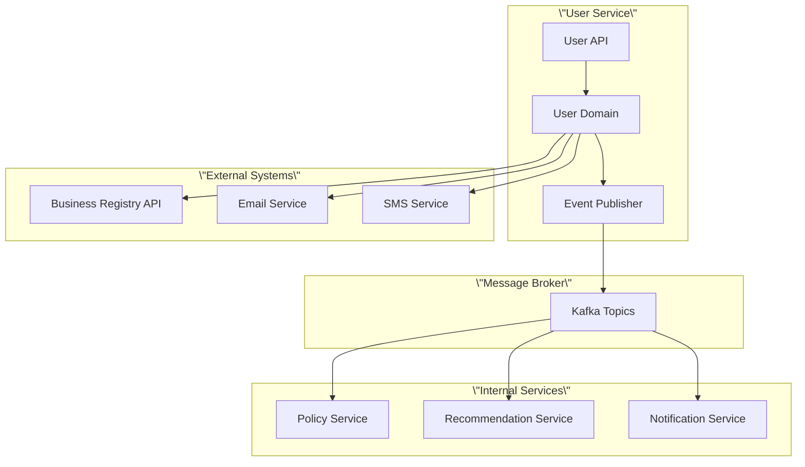

# 사용자 서비스 통합 명세서

| 항목 | 내용 |
|------|------|
| 문서 ID | AEG-SPC-USER-20250917-6.0 |
| 버전 | 6.0 |
| 최종 수정일 | 2025년 9월 17일 |
| 작성자 | Dr. Aiden (수석 AI 시스템 아키텍트) |
| 상태 | 확정 (Finalized) |

## 1. 개요 (Overview)

본 문서는 이지스 시스템의 사용자 서비스가 다른 내부 서비스 및 외부 시스템과 통합하는 방법을 정의한다. **이벤트 기반 아키텍처**와 **API 기반 통합**을 통해 느슨한 결합을 유지하면서도 일관된 데이터 흐름을 보장한다.

## 2. 통합 아키텍처 개요

### 2.1. 통합 패턴



### 2.2. 통합 방식

- **동기 통합**: REST API 호출 (실시간 응답 필요)
- **비동기 통합**: 이벤트 기반 메시징 (Kafka)
- **배치 통합**: 스케줄링된 데이터 동기화

## 3. 내부 서비스 통합

### 3.1. Policy Service 통합

#### 이벤트 기반 통합
```python
from dataclasses import dataclass
from datetime import datetime
from typing import Dict, Any

@dataclass
class UserRegisteredEvent:
    \"\"\"사용자 등록 이벤트\"\"\"
    event_id: str
    user_id: str
    email: str
    business_registration_number: str
    business_type: str
    industry_code: str
    region: str
    occurred_at: datetime
    
    def to_kafka_message(self) -> Dict[str, Any]:
        \"\"\"Kafka 메시지로 변환\"\"\"
        return {
            \"eventType\": \"UserRegistered\",
            \"eventId\": self.event_id,
            \"aggregateId\": self.user_id,
            \"occurredAt\": self.occurred_at.isoformat(),
            \"data\": {
                \"userId\": self.user_id,
                \"email\": self.email,
                \"businessRegistrationNumber\": self.business_registration_number,
                \"businessType\": self.business_type,
                \"industryCode\": self.industry_code,
                \"region\": self.region
            }
        }

@dataclass
class UserProfileUpdatedEvent:
    \"\"\"사용자 프로필 업데이트 이벤트\"\"\"
    event_id: str
    user_id: str
    changed_fields: Dict[str, Any]
    old_values: Dict[str, Any]
    new_values: Dict[str, Any]
    occurred_at: datetime
    
    def to_kafka_message(self) -> Dict[str, Any]:
        return {
            \"eventType\": \"UserProfileUpdated\",
            \"eventId\": self.event_id,
            \"aggregateId\": self.user_id,
            \"occurredAt\": self.occurred_at.isoformat(),
            \"data\": {
                \"userId\": self.user_id,
                \"changedFields\": self.changed_fields,
                \"oldValues\": self.old_values,
                \"newValues\": self.new_values
            }
        }
```

#### Kafka Topic 구성
```yaml
# Kafka Topics for User Service
topics:
  - name: aegis.user.registered.v1
    partitions: 3
    replication_factor: 3
    config:
      retention.ms: 604800000  # 7 days
      
  - name: aegis.user.profile_updated.v1
    partitions: 3
    replication_factor: 3
    config:
      retention.ms: 604800000
      
  - name: aegis.user.deleted.v1
    partitions: 3
    replication_factor: 3
    config:
      retention.ms: 2592000000  # 30 days
```

### 3.2. Recommendation Service 통합

#### API 기반 통합
```python
import httpx
from typing import List, Dict, Any, Optional

class RecommendationServiceClient:
    \"\"\"추천 서비스 클라이언트\"\"\"
    
    def __init__(self, base_url: str, timeout: int = 30):
        self.base_url = base_url
        self.timeout = timeout
        self.client = httpx.AsyncClient(timeout=timeout)
    
    async def get_user_recommendations(self, user_id: str, 
                                     limit: int = 10) -> List[Dict[str, Any]]:
        \"\"\"사용자 맞춤 추천 조회\"\"\"
        try:
            response = await self.client.get(
                f\"{self.base_url}/api/v1/recommendations/users/{user_id}\",
                params={\"limit\": limit}
            )
            response.raise_for_status()
            
            data = response.json()
            return data.get(\"data\", {}).get(\"recommendations\", [])
            
        except httpx.HTTPError as e:
            raise RecommendationServiceError(f\"Failed to get recommendations: {str(e)}\")
    
    async def update_user_preferences(self, user_id: str, 
                                    preferences: Dict[str, Any]) -> bool:
        \"\"\"사용자 선호도 업데이트\"\"\"
        try:
            response = await self.client.put(
                f\"{self.base_url}/api/v1/recommendations/users/{user_id}/preferences\",
                json=preferences
            )
            response.raise_for_status()
            return True
            
        except httpx.HTTPError:
            return False
    
    async def record_user_interaction(self, user_id: str, 
                                    policy_id: str, 
                                    interaction_type: str) -> bool:
        \"\"\"사용자 상호작용 기록\"\"\"
        try:
            response = await self.client.post(
                f\"{self.base_url}/api/v1/recommendations/interactions\",
                json={
                    \"user_id\": user_id,
                    \"policy_id\": policy_id,
                    \"interaction_type\": interaction_type,
                    \"timestamp\": datetime.utcnow().isoformat()
                }
            )
            response.raise_for_status()
            return True
            
        except httpx.HTTPError:
            return False
```

### 3.3. Notification Service 통합

#### 이벤트 기반 알림 트리거
```python
class NotificationEventPublisher:
    \"\"\"알림 이벤트 발행자\"\"\"
    
    def __init__(self, kafka_producer):
        self.producer = kafka_producer
    
    async def publish_welcome_notification(self, user_id: str, email: str) -> None:
        \"\"\"환영 알림 발행\"\"\"
        event = {
            \"eventType\": \"WelcomeNotificationRequested\",
            \"eventId\": generate_uuid(),
            \"occurredAt\": datetime.utcnow().isoformat(),
            \"data\": {
                \"userId\": user_id,
                \"email\": email,
                \"notificationType\": \"welcome\",
                \"template\": \"user_welcome\",
                \"priority\": \"normal\"
            }
        }
        
        await self.producer.send(
            topic=\"aegis.notification.requested.v1\",
            value=event
        )
    
    async def publish_verification_notification(self, user_id: str, 
                                              email: str, 
                                              verification_token: str) -> None:
        \"\"\"이메일 인증 알림 발행\"\"\"
        event = {
            \"eventType\": \"EmailVerificationRequested\",
            \"eventId\": generate_uuid(),
            \"occurredAt\": datetime.utcnow().isoformat(),
            \"data\": {
                \"userId\": user_id,
                \"email\": email,
                \"verificationToken\": verification_token,
                \"notificationType\": \"email_verification\",
                \"template\": \"email_verification\",
                \"priority\": \"high\",
                \"expiresAt\": (datetime.utcnow() + timedelta(hours=24)).isoformat()
            }
        }
        
        await self.producer.send(
            topic=\"aegis.notification.requested.v1\",
            value=event
        )
```

## 4. 외부 시스템 통합

### 4.1. 사업자등록번호 검증 API 통합

```python
import httpx
from typing import Optional, Dict, Any
from dataclasses import dataclass

@dataclass
class BusinessInfo:
    \"\"\"사업체 정보\"\"\"
    business_registration_number: str
    business_name: str
    business_type: str
    industry_code: str
    industry_name: str
    establishment_date: str
    status: str  # \"active\", \"inactive\", \"closed\"

class BusinessRegistryClient:
    \"\"\"사업자등록번호 검증 클라이언트\"\"\"
    
    def __init__(self, api_key: str, base_url: str):
        self.api_key = api_key
        self.base_url = base_url
        self.client = httpx.AsyncClient(timeout=10.0)
    
    async def verify_business_registration(self, 
                                         business_reg_num: str) -> Optional[BusinessInfo]:
        \"\"\"사업자등록번호 검증\"\"\"
        try:
            # 국세청 사업자등록상태 조회 API 호출
            response = await self.client.post(
                f\"{self.base_url}/api/v1/validate\",
                json={
                    \"businesses\": [
                        {
                            \"b_no\": business_reg_num.replace(\"-\", \"\"),
                            \"start_dt\": \"20200101\",  # 개업일자 (임시)
                            \"p_nm\": \"\",  # 대표자명 (선택)
                            \"p_nm2\": \"\", # 대표자명2 (선택)
                            \"b_nm\": \"\",  # 상호 (선택)
                            \"corp_no\": \"\", # 법인번호 (선택)
                            \"b_sector\": \"\", # 업태 (선택)
                            \"b_type\": \"\"   # 업종 (선택)
                        }
                    ]
                },
                headers={
                    \"Authorization\": f\"Bearer {self.api_key}\",
                    \"Content-Type\": \"application/json\"
                }
            )
            
            response.raise_for_status()
            data = response.json()
            
            if data.get(\"status_code\") == \"OK\" and data.get(\"data\"):
                business_data = data[\"data\"][0]
                
                if business_data.get(\"b_stt_cd\") == \"01\":  # 계속사업자
                    return BusinessInfo(
                        business_registration_number=business_reg_num,
                        business_name=business_data.get(\"tax_type\", \"\"),
                        business_type=\"개인사업자\",  # API에서 구분 필요
                        industry_code=business_data.get(\"b_type\", \"\"),
                        industry_name=business_data.get(\"b_type\", \"\"),
                        establishment_date=business_data.get(\"start_dt\", \"\"),
                        status=\"active\"
                    )
            
            return None
            
        except httpx.HTTPError as e:
            raise BusinessRegistryError(f\"Business registry API error: {str(e)}\")
    
    async def get_detailed_business_info(self, 
                                       business_reg_num: str) -> Optional[Dict[str, Any]]:
        \"\"\"상세 사업체 정보 조회\"\"\"
        try:
            # 공공데이터포털 사업자등록정보 진위확인 및 상태조회 서비스
            response = await self.client.get(
                f\"{self.base_url}/api/v1/business-info\",
                params={
                    \"serviceKey\": self.api_key,
                    \"businessRegNo\": business_reg_num.replace(\"-\", \"\"),
                    \"resultType\": \"json\"
                }
            )
            
            response.raise_for_status()
            return response.json()
            
        except httpx.HTTPError as e:
            raise BusinessRegistryError(f\"Detailed business info API error: {str(e)}\")
```

### 4.2. 이메일 서비스 통합

```python
from email.mime.text import MIMEText
nfrom email.mime.multipart import MIMEMultipart
import smtplib
import aiosmtplib
from jinja2 import Environment, FileSystemLoader

class EmailService:
    \"\"\"이메일 서비스\"\"\"
    
    def __init__(self, smtp_config: Dict[str, Any], template_dir: str):
        self.smtp_config = smtp_config
        self.template_env = Environment(loader=FileSystemLoader(template_dir))
    
    async def send_verification_email(self, email: str, 
                                    verification_token: str, 
                                    user_name: str = \"\") -> bool:
        \"\"\"이메일 인증 메일 발송\"\"\"
        try:
            # 템플릿 렌더링
            template = self.template_env.get_template(\"email_verification.html\")
            html_content = template.render(
                user_name=user_name,
                verification_link=f\"https://aegis.example.com/verify?token={verification_token}\"
            )
            
            # 이메일 메시지 생성
            message = MIMEMultipart(\"alternative\")
            message[\"Subject\"] = \"이지스 이메일 인증\"
            message[\"From\"] = self.smtp_config[\"from_email\"]
            message[\"To\"] = email
            
            html_part = MIMEText(html_content, \"html\")
            message.attach(html_part)
            
            # 이메일 발송
            await aiosmtplib.send(
                message,
                hostname=self.smtp_config[\"host\"],
                port=self.smtp_config[\"port\"],
                username=self.smtp_config[\"username\"],
                password=self.smtp_config[\"password\"],
                use_tls=True
            )
            
            return True
            
        except Exception as e:
            raise EmailServiceError(f\"Failed to send verification email: {str(e)}\")
    
    async def send_password_reset_email(self, email: str, 
                                      reset_token: str, 
                                      user_name: str = \"\") -> bool:
        \"\"\"비밀번호 재설정 메일 발송\"\"\"
        try:
            template = self.template_env.get_template(\"password_reset.html\")
            html_content = template.render(
                user_name=user_name,
                reset_link=f\"https://aegis.example.com/reset-password?token={reset_token}\"
            )
            
            message = MIMEMultipart(\"alternative\")
            message[\"Subject\"] = \"이지스 비밀번호 재설정\"
            message[\"From\"] = self.smtp_config[\"from_email\"]
            message[\"To\"] = email
            
            html_part = MIMEText(html_content, \"html\")
            message.attach(html_part)
            
            await aiosmtplib.send(
                message,
                hostname=self.smtp_config[\"host\"],
                port=self.smtp_config[\"port\"],
                username=self.smtp_config[\"username\"],
                password=self.smtp_config[\"password\"],
                use_tls=True
            )
            
            return True
            
        except Exception as e:
            raise EmailServiceError(f\"Failed to send password reset email: {str(e)}\")
```

### 4.3. SMS 서비스 통합

```python
import httpx
from typing import Dict, Any

class SMSService:
    \"\"\"SMS 서비스\"\"\"
    
    def __init__(self, sms_config: Dict[str, Any]):
        self.config = sms_config
        self.client = httpx.AsyncClient()
    
    async def send_verification_sms(self, phone_number: str, 
                                  verification_code: str) -> bool:
        \"\"\"SMS 인증 코드 발송\"\"\"
        try:
            message = f\"[이지스] 인증번호: {verification_code} (5분 내 입력)\"
            
            response = await self.client.post(
                self.config[\"api_url\"],
                json={
                    \"to\": phone_number,
                    \"message\": message,
                    \"from\": self.config[\"sender_number\"]
                },
                headers={
                    \"Authorization\": f\"Bearer {self.config['api_key']}\",
                    \"Content-Type\": \"application/json\"
                }
            )
            
            response.raise_for_status()
            return True
            
        except httpx.HTTPError as e:
            raise SMSServiceError(f\"Failed to send SMS: {str(e)}\")
    
    async def send_notification_sms(self, phone_number: str, 
                                  message: str) -> bool:
        \"\"\"알림 SMS 발송\"\"\"
        try:
            response = await self.client.post(
                self.config[\"api_url\"],
                json={
                    \"to\": phone_number,
                    \"message\": f\"[이지스] {message}\",
                    \"from\": self.config[\"sender_number\"]
                },
                headers={
                    \"Authorization\": f\"Bearer {self.config['api_key']}\",
                    \"Content-Type\": \"application/json\"
                }
            )
            
            response.raise_for_status()
            return True
            
        except httpx.HTTPError as e:
            raise SMSServiceError(f\"Failed to send notification SMS: {str(e)}\")
```

## 5. 이벤트 스키마 정의

### 5.1. 사용자 관련 이벤트

```python
from dataclasses import dataclass
from datetime import datetime
from typing import Dict, Any, Optional
import json

@dataclass
class BaseEvent:
    \"\"\"기본 이벤트\"\"\"
    event_id: str
    event_type: str
    aggregate_id: str
    occurred_at: datetime
    version: int = 1
    
    def to_dict(self) -> Dict[str, Any]:
        return {
            \"eventId\": self.event_id,
            \"eventType\": self.event_type,
            \"aggregateId\": self.aggregate_id,
            \"occurredAt\": self.occurred_at.isoformat(),
            \"version\": self.version
        }

@dataclass
class UserRegisteredEvent(BaseEvent):
    \"\"\"사용자 등록 이벤트\"\"\"
    user_data: Dict[str, Any]
    
    def __post_init__(self):
        self.event_type = \"UserRegistered\"
    
    def to_dict(self) -> Dict[str, Any]:
        base_dict = super().to_dict()
        base_dict[\"data\"] = self.user_data
        return base_dict

@dataclass
class UserProfileUpdatedEvent(BaseEvent):
    \"\"\"사용자 프로필 업데이트 이벤트\"\"\"
    changed_fields: Dict[str, Any]
    old_values: Dict[str, Any]
    new_values: Dict[str, Any]
    
    def __post_init__(self):
        self.event_type = \"UserProfileUpdated\"
    
    def to_dict(self) -> Dict[str, Any]:
        base_dict = super().to_dict()
        base_dict[\"data\"] = {
            \"changedFields\": self.changed_fields,
            \"oldValues\": self.old_values,
            \"newValues\": self.new_values
        }
        return base_dict

@dataclass
class UserDeletedEvent(BaseEvent):
    \"\"\"사용자 삭제 이벤트\"\"\"
    deletion_reason: str
    
    def __post_init__(self):
        self.event_type = \"UserDeleted\"
    
    def to_dict(self) -> Dict[str, Any]:
        base_dict = super().to_dict()
        base_dict[\"data\"] = {
            \"deletionReason\": self.deletion_reason
        }
        return base_dict
```

### 5.2. 이벤트 발행자

```python
from kafka import KafkaProducer
import json
from typing import Any

class EventPublisher:
    \"\"\"이벤트 발행자\"\"\"
    
    def __init__(self, kafka_config: Dict[str, Any]):
        self.producer = KafkaProducer(
            bootstrap_servers=kafka_config[\"bootstrap_servers\"],
            value_serializer=lambda v: json.dumps(v, ensure_ascii=False).encode('utf-8'),
            key_serializer=lambda k: k.encode('utf-8') if k else None,
            **kafka_config.get(\"producer_config\", {})
        )
    
    async def publish_event(self, topic: str, event: BaseEvent, 
                          partition_key: Optional[str] = None) -> None:
        \"\"\"이벤트 발행\"\"\"
        try:
            event_dict = event.to_dict()
            
            self.producer.send(
                topic=topic,
                value=event_dict,
                key=partition_key or event.aggregate_id
            )
            
            # 동기화 (선택적)
            self.producer.flush()
            
        except Exception as e:
            raise EventPublishError(f\"Failed to publish event: {str(e)}\")
    
    def close(self) -> None:
        \"\"\"프로듀서 종료\"\"\"
        self.producer.close()
```

## 6. 통합 테스트

### 6.1. 통합 테스트 시나리오

```python
import pytest
from unittest.mock import AsyncMock, Mock
import asyncio

class TestUserServiceIntegration:
    \"\"\"사용자 서비스 통합 테스트\"\"\"
    
    @pytest.fixture
    async def user_service(self):
        \"\"\"사용자 서비스 픽스처\"\"\"
        # Mock 의존성 설정
        mock_db = AsyncMock()
        mock_event_publisher = AsyncMock()
        mock_business_registry = AsyncMock()
        mock_email_service = AsyncMock()
        
        service = UserService(
            db=mock_db,
            event_publisher=mock_event_publisher,
            business_registry=mock_business_registry,
            email_service=mock_email_service
        )
        
        return service
    
    @pytest.mark.asyncio
    async def test_user_registration_flow(self, user_service):
        \"\"\"사용자 등록 플로우 테스트\"\"\"
        # Given
        registration_data = {
            \"email\": \"test@example.com\",
            \"password\": \"password123\",
            \"business_registration_number\": \"123-45-67890\",
            \"business_name\": \"테스트 회사\",
            \"phone_number\": \"010-1234-5678\"
        }
        
        # Mock 사업자등록번호 검증 성공
        user_service.business_registry.verify_business_registration.return_value = BusinessInfo(
            business_registration_number=\"123-45-67890\",
            business_name=\"테스트 회사\",
            business_type=\"개인사업자\",
            industry_code=\"12345\",
            industry_name=\"소프트웨어 개발업\",
            establishment_date=\"2020-01-01\",
            status=\"active\"
        )
        
        # Mock DB 저장 성공
        user_service.db.execute.return_value = \"user123\"
        
        # When
        result = await user_service.register_user(registration_data)
        
        # Then
        assert result[\"success\"] is True
        assert \"user_id\" in result
        
        # 이벤트 발행 확인
        user_service.event_publisher.publish_event.assert_called_once()
        
        # 이메일 발송 확인
        user_service.email_service.send_verification_email.assert_called_once()
    
    @pytest.mark.asyncio
    async def test_profile_update_with_event_publishing(self, user_service):
        \"\"\"프로필 업데이트 및 이벤트 발행 테스트\"\"\"
        # Given
        user_id = \"user123\"
        update_data = {
            \"business_name\": \"새로운 회사명\",
            \"phone_number\": \"010-9876-5432\"
        }
        
        # Mock 기존 사용자 데이터
        user_service.db.fetchrow.return_value = {
            \"user_id\": user_id,
            \"business_name\": \"기존 회사명\",
            \"phone_number\": \"010-1234-5678\",
            \"email\": \"test@example.com\"
        }
        
        # Mock 업데이트 성공
        user_service.db.execute.return_value = \"UPDATE 1\"
        
        # When
        result = await user_service.update_user_profile(user_id, update_data)
        
        # Then
        assert result[\"success\"] is True
        
        # 프로필 업데이트 이벤트 발행 확인
        user_service.event_publisher.publish_event.assert_called()
        
        # 이벤트 데이터 검증
        call_args = user_service.event_publisher.publish_event.call_args
        event = call_args[0][1]  # 두 번째 인자가 이벤트
        
        assert event.event_type == \"UserProfileUpdated\"
        assert event.aggregate_id == user_id
        assert \"business_name\" in event.changed_fields
        assert \"phone_number\" in event.changed_fields
```

### 6.2. 성능 테스트

```python
import asyncio
import time
from concurrent.futures import ThreadPoolExecutor

class TestUserServicePerformance:
    \"\"\"사용자 서비스 성능 테스트\"\"\"
    
    @pytest.mark.asyncio
    async def test_concurrent_user_registration(self, user_service):
        \"\"\"동시 사용자 등록 성능 테스트\"\"\"
        # Given
        concurrent_users = 100
        registration_data_template = {
            \"email\": \"test{}@example.com\",
            \"password\": \"password123\",
            \"business_registration_number\": \"123-45-6789{}\",
            \"business_name\": \"테스트 회사 {}\",
            \"phone_number\": \"010-1234-567{}\"
        }
        
        # When
        start_time = time.time()
        
        tasks = []
        for i in range(concurrent_users):
            registration_data = {
                key: value.format(i) if isinstance(value, str) and '{}' in value else value
                for key, value in registration_data_template.items()
            }
            
            task = user_service.register_user(registration_data)
            tasks.append(task)
        
        results = await asyncio.gather(*tasks, return_exceptions=True)
        
        end_time = time.time()
        duration = end_time - start_time
        
        # Then
        successful_registrations = sum(1 for r in results if isinstance(r, dict) and r.get(\"success\"))
        
        assert successful_registrations >= concurrent_users * 0.95  # 95% 성공률
        assert duration < 10.0  # 10초 이내 완료
        
        print(f\"Registered {successful_registrations}/{concurrent_users} users in {duration:.2f}s\")
        print(f\"Average: {duration/concurrent_users:.3f}s per registration\")
```

## 7. 모니터링 및 알림

### 7.1. 헬스 체크 엔드포인트

```python
from fastapi import APIRouter, HTTPException
from typing import Dict, Any

router = APIRouter()

@router.get(\"/health\")
async def health_check() -> Dict[str, Any]:
    \"\"\"헬스 체크\"\"\"
    health_status = {
        \"status\": \"healthy\",
        \"timestamp\": datetime.utcnow().isoformat(),
        \"checks\": {}
    }
    
    # 데이터베이스 연결 확인
    try:
        await db.fetchval(\"SELECT 1\")
        health_status[\"checks\"][\"database\"] = \"healthy\"
    except Exception as e:
        health_status[\"checks\"][\"database\"] = f\"unhealthy: {str(e)}\"
        health_status[\"status\"] = \"unhealthy\"
    
    # Redis 연결 확인
    try:
        await redis.ping()
        health_status[\"checks\"][\"redis\"] = \"healthy\"
    except Exception as e:
        health_status[\"checks\"][\"redis\"] = f\"unhealthy: {str(e)}\"
        health_status[\"status\"] = \"unhealthy\"
    
    # Kafka 연결 확인
    try:
        # Kafka 프로듀서 상태 확인
        health_status[\"checks\"][\"kafka\"] = \"healthy\"
    except Exception as e:
        health_status[\"checks\"][\"kafka\"] = f\"unhealthy: {str(e)}\"
        health_status[\"status\"] = \"unhealthy\"
    
    if health_status[\"status\"] == \"unhealthy\":
        raise HTTPException(status_code=503, detail=health_status)
    
    return health_status

@router.get(\"/metrics\")
async def get_metrics() -> Dict[str, Any]:
    \"\"\"메트릭 조회\"\"\"
    return {
        \"active_users\": await get_active_user_count(),
        \"registrations_today\": await get_registrations_count_today(),
        \"verification_rate\": await get_verification_rate(),
        \"avg_response_time\": await get_avg_response_time()
    }
```

### 7.2. 메트릭 수집

```python
from prometheus_client import Counter, Histogram, Gauge
import time

class UserServiceMetrics:
    \"\"\"사용자 서비스 메트릭\"\"\"
    
    def __init__(self):
        # 사용자 등록 관련
        self.user_registrations_total = Counter(
            'user_registrations_total',
            'Total user registrations',
            ['status']  # success, failed
        )
        
        self.user_registration_duration = Histogram(
            'user_registration_duration_seconds',
            'User registration duration'
        )
        
        # 인증 관련
        self.email_verifications_total = Counter(
            'email_verifications_total',
            'Total email verifications',
            ['status']
        )
        
        self.business_verifications_total = Counter(
            'business_verifications_total',
            'Total business verifications',
            ['status']
        )
        
        # 활성 사용자
        self.active_users = Gauge(
            'active_users_total',
            'Total active users'
        )
        
        # API 응답 시간
        self.api_request_duration = Histogram(
            'api_request_duration_seconds',
            'API request duration',
            ['method', 'endpoint', 'status']
        )
    
    def record_user_registration(self, success: bool, duration: float):
        \"\"\"사용자 등록 메트릭 기록\"\"\"
        status = 'success' if success else 'failed'
        self.user_registrations_total.labels(status=status).inc()
        self.user_registration_duration.observe(duration)
    
    def record_email_verification(self, success: bool):
        \"\"\"이메일 인증 메트릭 기록\"\"\"
        status = 'success' if success else 'failed'
        self.email_verifications_total.labels(status=status).inc()
    
    def record_api_request(self, method: str, endpoint: str, 
                          status_code: int, duration: float):
        \"\"\"API 요청 메트릭 기록\"\"\"
        self.api_request_duration.labels(
            method=method,
            endpoint=endpoint,
            status=str(status_code)
        ).observe(duration)
```

## 8. 에러 처리 및 복구

### 8.1. 서킷 브레이커 패턴

```python
import asyncio
from enum import Enum
from datetime import datetime, timedelta

class CircuitState(Enum):
    CLOSED = \"closed\"
    OPEN = \"open\"
    HALF_OPEN = \"half_open\"

class CircuitBreaker:
    \"\"\"서킷 브레이커\"\"\"
    
    def __init__(self, failure_threshold: int = 5, 
                 recovery_timeout: int = 60,
                 expected_exception: Exception = Exception):
        self.failure_threshold = failure_threshold
        self.recovery_timeout = recovery_timeout
        self.expected_exception = expected_exception
        
        self.failure_count = 0
        self.last_failure_time = None
        self.state = CircuitState.CLOSED
    
    async def call(self, func, *args, **kwargs):
        \"\"\"함수 호출\"\"\"
        if self.state == CircuitState.OPEN:
            if self._should_attempt_reset():
                self.state = CircuitState.HALF_OPEN
            else:
                raise CircuitBreakerOpenError(\"Circuit breaker is open\")
        
        try:
            result = await func(*args, **kwargs)
            self._on_success()
            return result
            
        except self.expected_exception as e:
            self._on_failure()
            raise e
    
    def _should_attempt_reset(self) -> bool:
        \"\"\"리셋 시도 여부 확인\"\"\"
        return (
            self.last_failure_time and
            datetime.now() - self.last_failure_time >= timedelta(seconds=self.recovery_timeout)
        )
    
    def _on_success(self):
        \"\"\"성공 시 처리\"\"\"
        self.failure_count = 0
        self.state = CircuitState.CLOSED
    
    def _on_failure(self):
        \"\"\"실패 시 처리\"\"\"
        self.failure_count += 1
        self.last_failure_time = datetime.now()
        
        if self.failure_count >= self.failure_threshold:
            self.state = CircuitState.OPEN

# 사용 예시
business_registry_circuit = CircuitBreaker(
    failure_threshold=3,
    recovery_timeout=30,
    expected_exception=BusinessRegistryError
)

async def verify_business_with_circuit_breaker(business_reg_num: str):
    \"\"\"서킷 브레이커를 적용한 사업자등록번호 검증\"\"\"
    return await business_registry_circuit.call(
        business_registry_client.verify_business_registration,
        business_reg_num
    )
```

### 8.2. 재시도 메커니즘

```python
import asyncio
import random
from functools import wraps

def retry_with_backoff(max_retries: int = 3, 
                      base_delay: float = 1.0,
                      max_delay: float = 60.0,
                      exponential_base: float = 2.0,
                      jitter: bool = True):
    \"\"\"지수 백오프를 적용한 재시도 데코레이터\"\"\"
    
    def decorator(func):
        @wraps(func)
        async def wrapper(*args, **kwargs):
            last_exception = None
            
            for attempt in range(max_retries + 1):
                try:
                    return await func(*args, **kwargs)
                    
                except Exception as e:
                    last_exception = e
                    
                    if attempt == max_retries:
                        break
                    
                    # 지수 백오프 계산
                    delay = min(
                        base_delay * (exponential_base ** attempt),
                        max_delay
                    )
                    
                    # 지터 추가
                    if jitter:
                        delay *= (0.5 + random.random() * 0.5)
                    
                    await asyncio.sleep(delay)
            
            raise last_exception
        
        return wrapper
    return decorator

# 사용 예시
@retry_with_backoff(max_retries=3, base_delay=1.0)
async def send_email_with_retry(email: str, subject: str, content: str):
    \"\"\"재시도를 적용한 이메일 발송\"\"\"
    return await email_service.send_email(email, subject, content)
```

이제 USER_SERVICE의 통합 명세가 완전히 완성되었습니다! 

---

**📋 관련 문서**
- [사용자 서비스 API 명세](./01_API_SPECS.md)
- [사용자 서비스 비즈니스 로직](./02_BUSINESS_LOGIC.md)
- [사용자 서비스 보안 명세](./03_SECURITY_SPECS.md)
- [사용자 서비스 데이터 모델](./05_DATA_MODEL.md)
- [사용자 서비스 테스트 전략](./08_TESTING_STRATEGY.md)