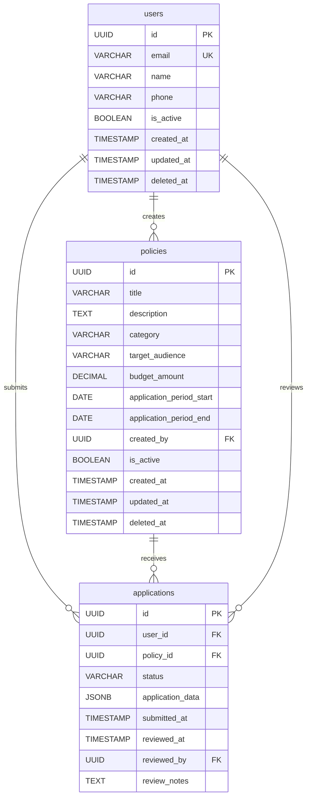

# 스키마 레지스트리 (Schema Registry)

Aegis Shared Library의 스키마 레지스트리는 모든 서비스의 데이터베이스 스키마를 중앙에서 관리하고 서비스 간 데이터 계약을 명확히 정의하는 시스템입니다.

## 개요

스키마 레지스트리는 다음과 같은 기능을 제공합니다:

- **중앙 집중식 스키마 관리**: 모든 테이블 스키마를 YAML 형식으로 관리
- **서비스 간 의존성 추적**: 외래 키 관계와 참조하는 서비스 명시
- **마이그레이션 조율**: 의존성 순서에 따른 안전한 마이그레이션 실행
- **스키마 검증**: 참조 무결성 및 호환성 자동 검증
- **문서 자동 생성**: ERD 및 스키마 문서 자동 생성

## 디렉토리 구조

```
.kiro/schemas/
├── registry.yaml          # 레지스트리 메타데이터
├── users.yaml            # 사용자 테이블 스키마
├── policies.yaml         # 정책 테이블 스키마
├── applications.yaml     # 신청 테이블 스키마
└── audit_logs.yaml       # 감사 로그 테이블 스키마
```

## 1. 스키마 정의

### 1.1 기본 스키마 구조

```yaml
# .kiro/schemas/users.yaml
name: users
owner: user-service
version: 1.0.0
description: 사용자 정보를 저장하는 테이블

columns:
  - name: id
    type: UUID
    nullable: false
    primary_key: true
    description: 사용자 고유 식별자
  
  - name: email
    type: VARCHAR(255)
    nullable: false
    unique: true
    description: 사용자 이메일 주소
  
  - name: name
    type: VARCHAR(100)
    nullable: false
    description: 사용자 이름
  
  - name: phone
    type: VARCHAR(20)
    nullable: true
    description: 사용자 전화번호
  
  - name: is_active
    type: BOOLEAN
    nullable: false
    default: "true"
    description: 사용자 활성 상태
  
  - name: created_at
    type: TIMESTAMP
    nullable: false
    default: "CURRENT_TIMESTAMP"
    description: 생성 일시
  
  - name: updated_at
    type: TIMESTAMP
    nullable: false
    default: "CURRENT_TIMESTAMP"
    description: 수정 일시
  
  - name: deleted_at
    type: TIMESTAMP
    nullable: true
    description: 삭제 일시 (소프트 삭제)

references: []

indexes:
  - name: idx_users_email
    columns: [email]
    unique: true
  
  - name: idx_users_active
    columns: [is_active, deleted_at]
    unique: false
```

### 1.2 참조 관계가 있는 스키마

```yaml
# .kiro/schemas/policies.yaml
name: policies
owner: policy-service
version: 1.0.0
description: 정책 정보를 저장하는 테이블

columns:
  - name: id
    type: UUID
    nullable: false
    primary_key: true
    description: 정책 고유 식별자
  
  - name: title
    type: VARCHAR(200)
    nullable: false
    description: 정책 제목
  
  - name: description
    type: TEXT
    nullable: true
    description: 정책 설명
  
  - name: category
    type: VARCHAR(50)
    nullable: false
    description: 정책 카테고리
  
  - name: target_audience
    type: VARCHAR(100)
    nullable: false
    description: 대상 고객
  
  - name: budget_amount
    type: DECIMAL(15,2)
    nullable: true
    description: 지원 금액
  
  - name: application_period_start
    type: DATE
    nullable: true
    description: 신청 기간 시작일
  
  - name: application_period_end
    type: DATE
    nullable: true
    description: 신청 기간 종료일
  
  - name: created_by
    type: UUID
    nullable: false
    description: 정책 생성자 (사용자 ID)
  
  - name: is_active
    type: BOOLEAN
    nullable: false
    default: "true"
    description: 정책 활성 상태
  
  - name: created_at
    type: TIMESTAMP
    nullable: false
    default: "CURRENT_TIMESTAMP"
  
  - name: updated_at
    type: TIMESTAMP
    nullable: false
    default: "CURRENT_TIMESTAMP"
  
  - name: deleted_at
    type: TIMESTAMP
    nullable: true

references:
  - schema: users
    column: id
    foreign_key: created_by
    on_delete: RESTRICT
    on_update: CASCADE
    description: 정책 생성자 참조

indexes:
  - name: idx_policies_category
    columns: [category]
  
  - name: idx_policies_active
    columns: [is_active, deleted_at]
  
  - name: idx_policies_created_by
    columns: [created_by]
```

### 1.3 복합 참조 관계 스키마

```yaml
# .kiro/schemas/applications.yaml
name: applications
owner: application-service
version: 1.0.0
description: 정책 신청 정보를 저장하는 테이블

columns:
  - name: id
    type: UUID
    nullable: false
    primary_key: true
  
  - name: user_id
    type: UUID
    nullable: false
    description: 신청자 사용자 ID
  
  - name: policy_id
    type: UUID
    nullable: false
    description: 신청한 정책 ID
  
  - name: status
    type: VARCHAR(20)
    nullable: false
    default: "'PENDING'"
    description: 신청 상태 (PENDING, APPROVED, REJECTED, CANCELLED)
  
  - name: application_data
    type: JSONB
    nullable: false
    description: 신청 데이터 (JSON 형식)
  
  - name: submitted_at
    type: TIMESTAMP
    nullable: false
    default: "CURRENT_TIMESTAMP"
    description: 신청 제출 일시
  
  - name: reviewed_at
    type: TIMESTAMP
    nullable: true
    description: 검토 완료 일시
  
  - name: reviewed_by
    type: UUID
    nullable: true
    description: 검토자 사용자 ID
  
  - name: review_notes
    type: TEXT
    nullable: true
    description: 검토 의견

references:
  - schema: users
    column: id
    foreign_key: user_id
    on_delete: RESTRICT
    on_update: CASCADE
    description: 신청자 참조
  
  - schema: policies
    column: id
    foreign_key: policy_id
    on_delete: RESTRICT
    on_update: CASCADE
    description: 신청 정책 참조
  
  - schema: users
    column: id
    foreign_key: reviewed_by
    on_delete: SET NULL
    on_update: CASCADE
    description: 검토자 참조

indexes:
  - name: idx_applications_user_policy
    columns: [user_id, policy_id]
    unique: true
    description: 사용자당 정책별 중복 신청 방지
  
  - name: idx_applications_status
    columns: [status]
  
  - name: idx_applications_submitted_at
    columns: [submitted_at]
```

## 2. 스키마 레지스트리 사용

### 2.1 스키마 레지스트리 초기화

```python
from aegis_shared.schemas import SchemaRegistry

# 스키마 레지스트리 초기화
registry = SchemaRegistry(registry_path=".kiro/schemas")

# 모든 스키마 로드 확인
print(f"Loaded {len(registry.schemas)} schemas:")
for name, schema in registry.schemas.items():
    print(f"  - {name} (owner: {schema.owner}, version: {schema.version})")
```

### 2.2 스키마 등록

```python
from aegis_shared.schemas.models import SchemaDefinition, SchemaColumn, SchemaReference

# 새로운 스키마 정의
audit_logs_schema = SchemaDefinition(
    name="audit_logs",
    owner="audit-service",
    version="1.0.0",
    description="시스템 감사 로그",
    columns=[
        SchemaColumn(
            name="id",
            type="UUID",
            nullable=False,
            primary_key=True
        ),
        SchemaColumn(
            name="user_id",
            type="UUID",
            nullable=True,
            description="작업 수행 사용자"
        ),
        SchemaColumn(
            name="action",
            type="VARCHAR(50)",
            nullable=False,
            description="수행된 작업"
        ),
        SchemaColumn(
            name="resource_type",
            type="VARCHAR(50)",
            nullable=False,
            description="대상 리소스 타입"
        ),
        SchemaColumn(
            name="resource_id",
            type="VARCHAR(100)",
            nullable=True,
            description="대상 리소스 ID"
        ),
        SchemaColumn(
            name="changes",
            type="JSONB",
            nullable=True,
            description="변경 내용"
        ),
        SchemaColumn(
            name="timestamp",
            type="TIMESTAMP",
            nullable=False,
            default="CURRENT_TIMESTAMP"
        )
    ],
    references=[
        SchemaReference(
            schema="users",
            column="id",
            foreign_key="user_id",
            on_delete="SET NULL",
            on_update="CASCADE"
        )
    ]
)

# 스키마 등록
registry.register_schema(audit_logs_schema)
```

### 2.3 스키마 조회 및 분석

```python
# 특정 스키마 조회
users_schema = registry.get_schema("users")
if users_schema:
    print(f"Users schema owner: {users_schema.owner}")
    print(f"Columns: {len(users_schema.columns)}")

# 의존성 분석
dependent_services = registry.get_dependent_services("users")
print(f"Services depending on 'users': {dependent_services}")

# 의존성 그래프 생성
dependency_graph = registry.get_dependency_graph()
print("Dependency graph:")
for schema, dependencies in dependency_graph.items():
    print(f"  {schema} depends on: {dependencies}")

# 마이그레이션 순서 생성
migration_order = registry.generate_migration_order()
print(f"Migration order: {migration_order}")
```

### 2.4 스키마 검증

```python
# 참조 무결성 검증
validation_errors = registry.validate_references()
if validation_errors:
    print("Schema validation errors:")
    for error in validation_errors:
        print(f"  - {error}")
else:
    print("All schema references are valid")

# 순환 의존성 탐지
circular_dependencies = registry.detect_circular_dependencies()
if circular_dependencies:
    print("Circular dependencies detected:")
    for cycle in circular_dependencies:
        print(f"  - {' -> '.join(cycle)}")
else:
    print("No circular dependencies found")
```

## 3. 마이그레이션 조율

### 3.1 마이그레이션 계획 수립

```python
from aegis_shared.migration import MigrationCoordinator

# 마이그레이션 조율자 초기화
coordinator = MigrationCoordinator(schema_registry=registry)

# 스키마 변경 정의
schema_changes = {
    "users": """
        ALTER TABLE users 
        ADD COLUMN last_login_at TIMESTAMP NULL,
        ADD COLUMN login_count INTEGER DEFAULT 0;
    """,
    "policies": """
        ALTER TABLE policies 
        ADD COLUMN priority INTEGER DEFAULT 0,
        ADD INDEX idx_policies_priority (priority);
    """
}

# 마이그레이션 계획 수립
migration_steps = coordinator.plan_migration(schema_changes)

print("Migration plan:")
for i, step in enumerate(migration_steps, 1):
    print(f"{i}. {step.service} - {step.schema}")
    print(f"   SQL: {step.sql[:50]}...")
    print(f"   Dependencies: {step.dependencies}")
```

### 3.2 마이그레이션 검증

```python
# 마이그레이션 사전 검증
validation_result = coordinator.validate_migration(schema_changes)

if validation_result.is_valid:
    print("Migration validation passed")
else:
    print("Migration validation failed:")
    for warning in validation_result.warnings:
        print(f"  Warning: {warning}")
    for error in validation_result.errors:
        print(f"  Error: {error}")
```

### 3.3 마이그레이션 실행

```python
# 마이그레이션 실행
try:
    execution_result = await coordinator.execute_migration(migration_steps)
    
    if execution_result.success:
        print("Migration completed successfully")
        print(f"Executed {len(execution_result.completed_steps)} steps")
    else:
        print("Migration failed")
        print(f"Failed at step: {execution_result.failed_step}")
        print(f"Error: {execution_result.error}")
        
        # 자동 롤백 수행
        rollback_result = await coordinator.rollback_migration(execution_result)
        if rollback_result.success:
            print("Rollback completed successfully")
        else:
            print("Rollback failed - manual intervention required")
            
except Exception as e:
    print(f"Migration execution error: {e}")
```

## 4. 문서 자동 생성

### 4.1 스키마 문서 생성

```python
# 마크다운 문서 생성
documentation = registry.generate_documentation()

# 파일로 저장
with open("docs/database-schema.md", "w", encoding="utf-8") as f:
    f.write(documentation)

print("Schema documentation generated: docs/database-schema.md")
```

### 4.2 ERD 다이어그램 생성

```python
# Mermaid ERD 다이어그램 생성
erd_diagram = registry.generate_erd_diagram()

# 파일로 저장
with open("docs/erd-diagram.mmd", "w", encoding="utf-8") as f:
    f.write(erd_diagram)

print("ERD diagram generated: docs/erd-diagram.mmd")
```

생성된 ERD 다이어그램 예시:



## 5. 실제 사용 시나리오

### 5.1 새 서비스 추가 시

```python
# 1. 새 서비스의 스키마 정의
notifications_schema = SchemaDefinition(
    name="notifications",
    owner="notification-service",
    version="1.0.0",
    description="알림 정보 저장",
    columns=[
        SchemaColumn(name="id", type="UUID", primary_key=True, nullable=False),
        SchemaColumn(name="user_id", type="UUID", nullable=False),
        SchemaColumn(name="type", type="VARCHAR(50)", nullable=False),
        SchemaColumn(name="title", type="VARCHAR(200)", nullable=False),
        SchemaColumn(name="message", type="TEXT", nullable=False),
        SchemaColumn(name="is_read", type="BOOLEAN", default="false", nullable=False),
        SchemaColumn(name="created_at", type="TIMESTAMP", default="CURRENT_TIMESTAMP", nullable=False)
    ],
    references=[
        SchemaReference(
            schema="users",
            column="id",
            foreign_key="user_id",
            on_delete="CASCADE",
            on_update="CASCADE"
        )
    ]
)

# 2. 스키마 등록
registry.register_schema(notifications_schema)

# 3. 검증
errors = registry.validate_references()
if not errors:
    print("New schema is valid and ready for migration")
```

### 5.2 스키마 변경 시

```python
# 1. 기존 스키마 조회
users_schema = registry.get_schema("users")

# 2. 새 컬럼 추가
users_schema.columns.append(
    SchemaColumn(
        name="profile_image_url",
        type="VARCHAR(500)",
        nullable=True,
        description="프로필 이미지 URL"
    )
)

# 3. 버전 업데이트
users_schema.version = "1.1.0"

# 4. 스키마 재등록
registry.register_schema(users_schema)

# 5. 마이그레이션 SQL 생성
migration_sql = """
ALTER TABLE users 
ADD COLUMN profile_image_url VARCHAR(500) NULL 
COMMENT '프로필 이미지 URL';
"""

# 6. 마이그레이션 실행
await coordinator.execute_migration({"users": migration_sql})
```

## 6. 모범 사례

### 6.1 스키마 설계 원칙

1. **명확한 네이밍**: 테이블과 컬럼명은 명확하고 일관성 있게
2. **적절한 데이터 타입**: 데이터 특성에 맞는 타입 선택
3. **NULL 허용 정책**: 비즈니스 규칙에 따른 명확한 NULL 정책
4. **인덱스 전략**: 쿼리 패턴을 고려한 인덱스 설계
5. **외래 키 제약**: 데이터 무결성을 위한 적절한 제약 조건

### 6.2 버전 관리

```yaml
# 스키마 버전 관리 예시
name: users
owner: user-service
version: 1.2.0  # Major.Minor.Patch
description: 사용자 정보 테이블

# 버전 히스토리
version_history:
  - version: 1.0.0
    date: 2024-01-01
    changes: 초기 스키마 생성
  
  - version: 1.1.0
    date: 2024-02-01
    changes: profile_image_url 컬럼 추가
  
  - version: 1.2.0
    date: 2024-03-01
    changes: last_login_at, login_count 컬럼 추가
```

### 6.3 마이그레이션 안전성

1. **백업**: 마이그레이션 전 데이터 백업
2. **단계적 실행**: 큰 변경사항은 여러 단계로 분할
3. **롤백 계획**: 항상 롤백 계획 수립
4. **테스트**: 개발/스테이징 환경에서 충분한 테스트
5. **모니터링**: 마이그레이션 중 시스템 모니터링

### 6.4 팀 협업

1. **코드 리뷰**: 스키마 변경 시 반드시 리뷰
2. **문서화**: 변경 사유와 영향도 문서화
3. **커뮤니케이션**: 관련 팀에 사전 공지
4. **일정 조율**: 서비스 간 마이그레이션 일정 조율

## 7. 트러블슈팅

### 7.1 일반적인 문제들

**문제**: 순환 의존성 발생
```python
# 해결: 의존성 구조 재설계
cycles = registry.detect_circular_dependencies()
if cycles:
    print("Circular dependencies found:")
    for cycle in cycles:
        print(f"  {' -> '.join(cycle)}")
    # 중간 테이블이나 다른 설계 패턴 고려
```

**문제**: 참조 무결성 오류
```python
# 해결: 참조 관계 확인 및 수정
errors = registry.validate_references()
for error in errors:
    print(f"Reference error: {error}")
    # 스키마 파일에서 참조 관계 수정
```

**문제**: 마이그레이션 실패
```python
# 해결: 단계별 롤백 및 재시도
try:
    result = await coordinator.execute_migration(steps)
except MigrationError as e:
    print(f"Migration failed: {e}")
    # 롤백 실행
    await coordinator.rollback_migration(result)
    # 문제 해결 후 재시도
```

스키마 레지스트리를 통해 데이터베이스 스키마를 체계적으로 관리하고 안전한 마이그레이션을 수행할 수 있습니다!