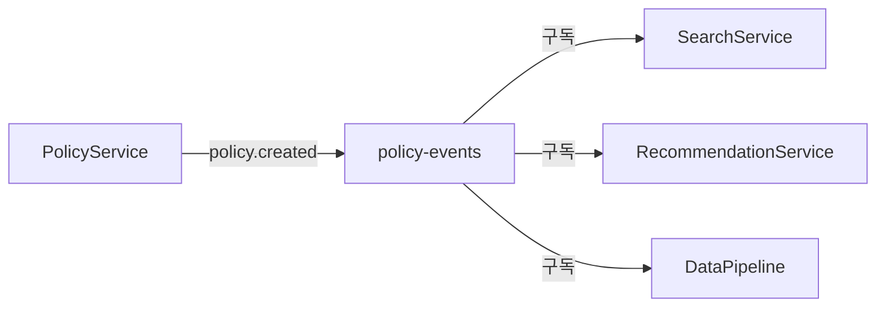

# Spec 작성 및 검토 가이드

**최종 업데이트**: 2025-10-07  
**목적**: 12개 Spec의 일관된 품질 보장 및 프로덕션 준비

---

## 📋 문서화 목표

### 1. 완전성 (Completeness)

누구나 이 문서만으로 시스템을 이해하고 구현할 수 있어야 함

### 2. 명확성 (Clarity)

기술적 배경이 다른 개발자도 이해 가능한 설명

### 3. 실용성 (Practicality)

프로덕션 환경에서 실제 사용 가능한 수준

### 4. 일관성 (Consistency)

모든 spec에서 동일한 구조와 패턴 사용

### 5. 추상화 (Abstraction)

shared-library를 통한 공통 로직 추상화, 클라우드 독립적 설계

---

## 📐 각 문서별 필수 섹션

### Requirements.md 체크리스트

- [ ] **Introduction**: 서비스 목적, 핵심 책임, 역할 구분
- [ ] **User Stories**: "As a [role], I want [feature], so that [benefit]"
- [ ] **Acceptance Criteria**: EARS 형식 (WHEN/IF/THEN/SHALL)
- [ ] **Functional Requirements**: 기능 요구사항
- [ ] **Non-Functional Requirements**: 성능, 확장성, 가용성, 보안
- [ ] **Dependencies**: 의존 서비스, 데이터베이스, 외부 시스템
- [ ] **Constraints**: 기술적/비즈니스 제약사항

### Design.md 체크리스트 (35개 항목)

#### 🔴 최우선 섹션 (8개 - 반드시 포함)

1. [ ] **Overview**: 핵심 책임, 역할 구분, 설계 원칙
2. [ ] **Shared Library Integration** ⭐: 사용 이유, Before/After 비교, 코드 예시
3. [ ] **Architecture**: Mermaid 다이어그램, 컴포넌트 연결, 데이터 흐름
4. [ ] **Components and Interfaces**: 실제 동작 가능한 코드, 타입 힌트, 에러 처리
5. [ ] **Error Handling** ⭐: 중앙 에러 코드, 복구 전략, 로깅
6. [ ] **Production Considerations** ⭐: 확장성, 장애 복구, 캐싱, 모니터링, 보안
7. [ ] **Data Models**: API 모델, DB 모델, 이벤트 스키마, 검증 로직
8. [ ] **Service Integration**: 이벤트 발행/구독, API 호출, DB 연결

#### 🟡 높은 우선순위 (7개 - 강력 권장)

9. [ ] **Integration Testing Strategy**: 단위/통합/계약/E2E/부하 테스트
10. [ ] **Performance Benchmarks**: 응답 시간, TPS, 리소스 제한
11. [ ] **Monitoring**: Prometheus 메트릭, Grafana 대시보드, 알림 규칙
12. [ ] **API Specification**: OpenAPI 스펙, 버전 관리, 에러 응답
13. [ ] **Database Schema**: 스키마 정의, 참조 무결성, 마이그레이션
14. [ ] **Configuration Management**: 환경 변수, 시크릿, Feature Flags
15. [ ] **Logging Strategy**: 로그 레벨, 컨텍스트, 보관 정책, 마스킹

#### 🟢 중간 우선순위 (6개 - 권장)

16. [ ] **Observability**: 분산 추적, 메트릭, 로그 집계, 대시보드
17. [ ] **Disaster Recovery**: 백업, 복구 절차, 장애 시나리오
18. [ ] **Compliance and Audit**: 데이터 보호, 감사 로그, 접근 제어
19. [ ] **Dependency Management**: 외부 라이브러리, 서비스 의존성, API 계약
20. [ ] **Development Workflow**: 로컬 환경, 코드 리뷰, 브랜치 전략
21. [ ] **Capacity Planning**: 리소스 요구사항, 확장 계획, 부하 테스트

#### 🔵 낮은 우선순위 (6개 - 선택적)

22. [ ] **Documentation**: API 문서, 운영 가이드, ADR
23. [ ] **Internationalization**: 다국어, 시간대, 통화
24. [ ] **Accessibility**: 웹 접근성, API 접근성
25. [ ] **Versioning Strategy**: 서비스/API/DB 버전 관리
26. [ ] **Cost Optimization**: 리소스 효율성, 데이터 저장, 네트워크
27. [ ] **Team Collaboration**: 코드 소유권, 커뮤니케이션, 온보딩

**상세 체크리스트**: SPEC_COMPLETE_CHECKLIST.md 참조

### Tasks.md 체크리스트

- [ ] **작업 구조**: 최대 2단계 계층, 체크박스 형식
- [ ] **작업 내용**: 명확한 목표, 요구사항 참조, 파일 경로
- [ ] **작업 순서**: 의존성 순서, 테스트 직후 배치
- [ ] **테스트 규칙**: 단위 테스트는 선택적(\*), 통합 테스트는 필수

---

## 🔗 연결성 확인 (매우 중요)

### 1. shared-library 연결성 ⭐ 최우선

**모든 백엔드 서비스가 반드시 확인해야 할 사항**

#### 1.1 Database 모듈

- [ ] BaseRepository 상속 확인
- [ ] 중앙 스키마 레지스트리에 스키마 등록
- [ ] 마이그레이션 조율 시스템 사용
- [ ] 트랜잭션 관리 패턴 일치
- [ ] 연결 풀 설정 일치

#### 1.2 Auth 모듈

- [ ] JWTHandler 사용 (토큰 생성/검증)
- [ ] AuthMiddleware 적용
- [ ] RBAC 권한 관리 사용
- [ ] 모든 보호된 엔드포인트에 인증 적용

#### 1.3 Logging 모듈

- [ ] 구조화된 로깅 사용 (structlog)
- [ ] 컨텍스트 자동 추가 (request_id, user_id)
- [ ] 로그 레벨 일치 (DEBUG, INFO, WARNING, ERROR)
- [ ] Elasticsearch 연동 확인

#### 1.4 Messaging 모듈

- [ ] EventPublisher 사용 (Kafka 발행)
- [ ] EventSubscriber 사용 (Kafka 구독)
- [ ] 이벤트 스키마 버전 관리 (VersionedEvent)
- [ ] 이벤트 타입 네이밍 컨벤션 일치 (service.action)

#### 1.5 Monitoring 모듈

- [ ] Prometheus 메트릭 수집 (@track_metrics)
- [ ] 분산 추적 (OpenTelemetry)
- [ ] 헬스 체크 엔드포인트 (/health)
- [ ] 메트릭 네이밍 컨벤션 일치

#### 1.6 Cache 모듈

- [ ] Redis 클라이언트 사용
- [ ] 캐싱 데코레이터 사용 (@cache_result)
- [ ] 캐시 무효화 전략 일치
- [ ] TTL 설정 근거 명시

#### 1.7 Error 모듈

- [ ] 중앙 에러 코드 레지스트리 사용 (ErrorCode)
- [ ] ServiceException 사용
- [ ] 에러 응답 형식 일치
- [ ] 에러 로깅 패턴 일치

#### 1.8 Config 모듈

- [ ] 환경 설정 관리 일치
- [ ] 시크릿 관리 방법 일치
- [ ] 환경별 설정 분리 (dev/staging/prod)

### 2. 백엔드 서비스 간 연결성

#### 2.1 이벤트 기반 통신 (Kafka)

- [ ] **발행하는 이벤트 목록 명시**
  - [ ] 이벤트 타입 (예: policy.created, user.updated)
  - [ ] Kafka Topic 이름
  - [ ] 이벤트 스키마 (VersionedEvent)
  - [ ] 발행 시점 및 조건
- [ ] **구독하는 이벤트 목록 명시**
  - [ ] 구독 Topic 이름
  - [ ] Consumer Group ID
  - [ ] 이벤트 처리 로직
  - [ ] 실패 시 DLQ 전략
- [ ] **이벤트 순서 보장**
  - [ ] Partition Key 전략
  - [ ] 순서가 중요한 이벤트 명시
- [ ] **이벤트 스키마 버전 관리**
  - [ ] 버전 번호 (SemVer)
  - [ ] 하위 호환성 보장
  - [ ] 스키마 변경 시 영향 분석

#### 2.2 동기 API 호출

- [ ] **API 엔드포인트 명시**
  - [ ] HTTP Method (GET/POST/PUT/DELETE)
  - [ ] URL 경로
  - [ ] 요청/응답 모델 (Pydantic)
- [ ] **인증 방법**
  - [ ] JWT 토큰 전달 방법
  - [ ] Service-to-Service 인증
- [ ] **에러 처리**
  - [ ] HTTP 상태 코드
  - [ ] 에러 응답 형식
  - [ ] Retry 전략
- [ ] **Timeout 설정**
  - [ ] 연결 Timeout
  - [ ] 읽기 Timeout
  - [ ] 전체 Timeout

#### 2.3 서비스 의존성 매트릭스

각 서비스는 다음 매트릭스를 명시해야 함:

| 의존 서비스    | 통신 방식   | 목적             | 필수/선택 |
| -------------- | ----------- | ---------------- | --------- |
| user-service   | API 호출    | 사용자 정보 조회 | 필수      |
| policy-service | 이벤트 구독 | 정책 변경 감지   | 필수      |
| search-service | API 호출    | 검색 기능        | 선택      |

### 3. 데이터베이스 연결성

#### 3.1 PostgreSQL (Source of Truth)

- [ ] **스키마 정의**
  - [ ] 중앙 스키마 레지스트리에 등록 (.kiro/schemas/\*.yaml)
  - [ ] 테이블 이름, 컬럼, 타입, 제약조건
  - [ ] 인덱스 정의 및 근거
- [ ] **참조 무결성**
  - [ ] Foreign Key 관계 명시
  - [ ] ON DELETE/UPDATE 동작
  - [ ] 순환 참조 없음 확인
- [ ] **마이그레이션**
  - [ ] Alembic 마이그레이션 파일
  - [ ] 마이그레이션 순서 (위상 정렬)
  - [ ] 롤백 전략
- [ ] **연결 풀 설정**
  - [ ] pool_size (기본 연결 수)
  - [ ] max_overflow (추가 연결 수)
  - [ ] pool_timeout (대기 시간)
  - [ ] pool_recycle (재사용 시간)

#### 3.2 Milvus (Vector DB)

- [ ] **컬렉션 스키마**
  - [ ] 컬렉션 이름
  - [ ] 벡터 차원 (예: 768)
  - [ ] 메트릭 타입 (COSINE, L2, IP)
  - [ ] 인덱스 타입 (IVF_FLAT, HNSW)
- [ ] **데이터 동기화**
  - [ ] PostgreSQL → Milvus 동기화 방법
  - [ ] 동기화 주기 (실시간/배치)
  - [ ] 일관성 검증 방법
- [ ] **검색 파라미터**
  - [ ] nprobe, ef, search_k 등
  - [ ] 성능 vs 정확도 트레이드오프

#### 3.3 Neo4j (Graph DB)

- [ ] **그래프 스키마**
  - [ ] 노드 레이블 및 속성
  - [ ] 관계 타입 및 방향
  - [ ] 인덱스 및 제약조건
- [ ] **데이터 동기화**
  - [ ] PostgreSQL → Neo4j 동기화 방법
  - [ ] 그래프 구축 로직
  - [ ] 일관성 검증 방법
- [ ] **Cypher 쿼리 최적화**
  - [ ] 인덱스 활용
  - [ ] 쿼리 성능 목표

#### 3.4 Elasticsearch (Search Index)

- [ ] **인덱스 스키마**
  - [ ] 인덱스 이름
  - [ ] 매핑 정의 (필드 타입, 분석기)
  - [ ] 샤드 및 레플리카 설정
- [ ] **데이터 동기화**
  - [ ] PostgreSQL → Elasticsearch 동기화 방법
  - [ ] 동기화 주기
  - [ ] 일관성 검증 방법
- [ ] **검색 설정**
  - [ ] 분석기 (nori, standard 등)
  - [ ] 검색 쿼리 전략

#### 3.5 Redis (Cache)

- [ ] **캐시 키 네이밍**
  - [ ] 네이밍 컨벤션 (예: service:entity:id)
  - [ ] 키 충돌 방지
- [ ] **TTL 전략**
  - [ ] 각 캐시 타입별 TTL
  - [ ] TTL 설정 근거
- [ ] **캐시 무효화**
  - [ ] 무효화 트리거
  - [ ] 무효화 패턴 (키 패턴 매칭)

### 4. 메시지 큐 연결성 (Kafka)

#### 4.1 Topic 관리

- [ ] **Topic 네이밍 컨벤션**
  - [ ] 형식: {service}-events (예: policy-events)
  - [ ] 일관성 확인
- [ ] **Topic 설정**
  - [ ] Partition 수 (병렬 처리 고려)
  - [ ] Replication Factor (가용성 고려)
  - [ ] Retention 정책 (시간/크기)
- [ ] **Topic 소유권**
  - [ ] 각 Topic의 소유 서비스 명시
  - [ ] 스키마 관리 책임

#### 4.2 Producer 설정

- [ ] **메시지 전송 보장**
  - [ ] acks 설정 (0, 1, all)
  - [ ] 재시도 정책
  - [ ] Idempotence 설정
- [ ] **메시지 키 전략**
  - [ ] Partition Key 선택 근거
  - [ ] 순서 보장 필요 여부

#### 4.3 Consumer 설정

- [ ] **Consumer Group 관리**
  - [ ] Group ID 네이밍 컨벤션
  - [ ] 멤버십 관리
- [ ] **Offset 관리**
  - [ ] Auto Commit vs Manual Commit
  - [ ] Offset Reset 정책 (earliest, latest)
- [ ] **에러 처리**
  - [ ] 재시도 로직
  - [ ] Dead Letter Queue (DLQ)
  - [ ] 에러 알림

#### 4.4 이벤트 흐름 다이어그램

각 서비스는 이벤트 흐름을 Mermaid로 시각화:



### 5. 프론트엔드 연결성

#### 5.1 API Gateway 통합

- [ ] **라우팅 규칙**
  - [ ] 각 백엔드 서비스로의 라우팅 경로
  - [ ] URL 재작성 규칙
- [ ] **인증 통합**
  - [ ] JWT 토큰 검증
  - [ ] 토큰 갱신 메커니즘
- [ ] **CORS 설정**
  - [ ] 허용 Origin
  - [ ] 허용 Method
  - [ ] 허용 Header

#### 5.2 API 계약 (OpenAPI)

- [ ] **API 명세 파일**
  - [ ] .kiro/contracts/{service}-api.yaml
  - [ ] 모든 엔드포인트 정의
  - [ ] 요청/응답 스키마
- [ ] **계약 테스트**
  - [ ] Pact 또는 Spring Cloud Contract
  - [ ] 프론트엔드-백엔드 계약 검증
- [ ] **API 버전 관리**
  - [ ] URL 버전 (예: /api/v1/)
  - [ ] 하위 호환성 보장

#### 5.3 WebSocket 연결 (필요시)

- [ ] **WebSocket 엔드포인트**
  - [ ] 연결 URL
  - [ ] 인증 방법
- [ ] **메시지 프로토콜**
  - [ ] 메시지 형식 (JSON)
  - [ ] 이벤트 타입
- [ ] **연결 관리**
  - [ ] 재연결 전략
  - [ ] Heartbeat

#### 5.4 에러 응답 형식

모든 서비스는 일관된 에러 응답 형식 사용:

```json
{
  "error_code": "AUTH_1001",
  "message": "Invalid token",
  "details": {},
  "timestamp": "2025-10-07T12:00:00Z"
}
```

### 6. 인프라 연결성

#### 6.1 Kubernetes 리소스

- [ ] **Deployment**
  - [ ] 컨테이너 이미지 및 태그
  - [ ] 리소스 요청/제한 (CPU, Memory)
  - [ ] 환경 변수 (ConfigMap/Secret)
  - [ ] Health Check (Liveness/Readiness Probe)
- [ ] **Service**
  - [ ] Service 타입 (ClusterIP, NodePort, LoadBalancer)
  - [ ] 포트 매핑
  - [ ] Selector 레이블
- [ ] **HPA (Horizontal Pod Autoscaler)**
  - [ ] 최소/최대 레플리카 수
  - [ ] 메트릭 (CPU, Memory, Custom)
  - [ ] 스케일링 정책
- [ ] **ConfigMap**
  - [ ] 설정 키-값 쌍
  - [ ] 마운트 경로
- [ ] **Secret**
  - [ ] 민감 정보 (DB 비밀번호, API 키)
  - [ ] 암호화 방법

#### 6.2 네트워크 정책

- [ ] **Ingress**
  - [ ] 도메인 및 경로 규칙
  - [ ] TLS 인증서
  - [ ] Rate Limiting
- [ ] **Network Policy**
  - [ ] Pod 간 통신 규칙
  - [ ] Namespace 격리
- [ ] **Service Mesh (Istio/Linkerd)**
  - [ ] 트래픽 관리
  - [ ] 보안 정책
  - [ ] 관찰성

#### 6.3 스토리지

- [ ] **PersistentVolume**
  - [ ] 스토리지 클래스
  - [ ] 용량
  - [ ] 접근 모드
- [ ] **PersistentVolumeClaim**
  - [ ] 요청 용량
  - [ ] 마운트 경로

### 7. 로깅 연결성

#### 7.1 로그 수집 파이프라인

- [ ] **애플리케이션 로그**
  - [ ] shared-library 구조화된 로깅 사용
  - [ ] 로그 레벨 설정
  - [ ] 컨텍스트 정보 (request_id, user_id)
- [ ] **로그 전송**
  - [ ] Filebeat/Fluentd → Logstash
  - [ ] 로그 포맷 (JSON)
- [ ] **로그 저장**
  - [ ] Elasticsearch 인덱스 패턴
  - [ ] ILM (Index Lifecycle Management)
  - [ ] 보관 기간

#### 7.2 로그 쿼리 및 분석

- [ ] **Kibana 대시보드**
  - [ ] 서비스별 대시보드
  - [ ] 에러 로그 필터
  - [ ] 성능 분석
- [ ] **로그 알림**
  - [ ] 에러율 임계값
  - [ ] 알림 채널 (Slack, Email)

#### 7.3 감사 로그

- [ ] **감사 이벤트**
  - [ ] 사용자 인증/인가
  - [ ] 데이터 변경 (CRUD)
  - [ ] 민감 정보 접근
- [ ] **감사 로그 저장**
  - [ ] 별도 인덱스 또는 테이블
  - [ ] 장기 보관 (규정 준수)

### 8. 모니터링 연결성

#### 8.1 메트릭 수집

- [ ] **Prometheus 메트릭**
  - [ ] 애플리케이션 메트릭 (shared-library @track_metrics)
  - [ ] 시스템 메트릭 (CPU, Memory, Disk)
  - [ ] 비즈니스 메트릭 (요청 수, 에러율, 응답 시간)
- [ ] **메트릭 네이밍**
  - [ ] 컨벤션: {service}_{metric}_{unit}
  - [ ] 예: user_service_requests_total
- [ ] **메트릭 레이블**
  - [ ] 서비스 이름
  - [ ] 환경 (dev/staging/prod)
  - [ ] 버전

#### 8.2 Grafana 대시보드

- [ ] **서비스별 대시보드**
  - [ ] 요청 처리량 (TPS)
  - [ ] 응답 시간 (p50, p95, p99)
  - [ ] 에러율
  - [ ] 리소스 사용량
- [ ] **시스템 대시보드**
  - [ ] 클러스터 전체 상태
  - [ ] 노드 리소스
  - [ ] 네트워크 트래픽
- [ ] **비즈니스 대시보드**
  - [ ] 사용자 활동
  - [ ] 추천 정확도
  - [ ] 검색 성능

#### 8.3 알림 규칙

- [ ] **Prometheus Alertmanager**
  - [ ] 알림 조건 (PromQL)
  - [ ] 알림 심각도 (critical, warning, info)
  - [ ] 알림 채널 (Slack, PagerDuty, Email)
- [ ] **알림 예시**
  - [ ] 높은 에러율 (> 5%)
  - [ ] 느린 응답 시간 (p95 > 1s)
  - [ ] 리소스 부족 (CPU > 80%)
  - [ ] 서비스 다운

#### 8.4 분산 추적

- [ ] **OpenTelemetry**
  - [ ] Trace ID 전파
  - [ ] Span 생성
  - [ ] 컨텍스트 전달
- [ ] **Jaeger/Zipkin**
  - [ ] Trace 시각화
  - [ ] 병목 지점 분석
  - [ ] 서비스 의존성 맵

### 9. CI/CD 연결성

#### 9.1 소스 코드 관리

- [ ] **Git 브랜치 전략**
  - [ ] main/master (프로덕션)
  - [ ] develop (개발)
  - [ ] feature/\* (기능 개발)
  - [ ] hotfix/\* (긴급 수정)
- [ ] **커밋 메시지 컨벤션**
  - [ ] 형식: type(scope): message
  - [ ] 예: feat(user): add login API

#### 9.2 CI 파이프라인

- [ ] **빌드 단계**
  - [ ] 의존성 설치
  - [ ] 코드 컴파일/빌드
  - [ ] 도커 이미지 빌드
- [ ] **테스트 단계**
  - [ ] 단위 테스트
  - [ ] 통합 테스트
  - [ ] 코드 커버리지 (목표: 80%)
- [ ] **정적 분석**
  - [ ] Linting (pylint, eslint)
  - [ ] 타입 체크 (mypy, TypeScript)
  - [ ] 보안 스캔 (Snyk, Trivy)
- [ ] **아티팩트 저장**
  - [ ] 도커 이미지 레지스트리
  - [ ] 버전 태깅 (SemVer)

#### 9.3 CD 파이프라인

- [ ] **배포 전략**
  - [ ] Rolling Update (무중단 배포)
  - [ ] Blue-Green Deployment
  - [ ] Canary Deployment
- [ ] **환경별 배포**
  - [ ] dev: 자동 배포
  - [ ] staging: 자동 배포 + 승인
  - [ ] prod: 수동 승인 필수
- [ ] **배포 검증**
  - [ ] Health Check
  - [ ] Smoke Test
  - [ ] 롤백 조건

#### 9.4 GitOps (ArgoCD)

- [ ] **Git 저장소 구조**
  - [ ] 애플리케이션 코드 저장소
  - [ ] Kubernetes 매니페스트 저장소
- [ ] **ArgoCD Application**
  - [ ] Application 정의
  - [ ] 동기화 정책
  - [ ] 자동 동기화 vs 수동 동기화
- [ ] **환경별 설정**
  - [ ] Kustomize 또는 Helm
  - [ ] 환경별 오버레이

### 10. 배포 연결성

#### 10.1 배포 순서

서비스 의존성에 따른 배포 순서:

1. **Phase 0: 기반**

   - shared-library (PyPI 배포)
   - infrastructure-setup (Kubernetes, DB, Kafka)
   - development-environment (로컬 환경)

2. **Phase 1: 핵심 서비스**

   - user-service
   - policy-service
   - logging-audit

3. **Phase 2: AI 서비스**

   - search-service
   - recommendation-service

4. **Phase 3: 통합**
   - data-pipeline
   - api-gateway
   - frontend

#### 10.2 배포 체크리스트

각 서비스 배포 시 확인:

- [ ] **사전 확인**
  - [ ] 의존 서비스 정상 동작
  - [ ] 데이터베이스 마이그레이션 완료
  - [ ] ConfigMap/Secret 업데이트
  - [ ] 도커 이미지 빌드 및 푸시
- [ ] **배포 실행**
  - [ ] Kubernetes 매니페스트 적용
  - [ ] Pod 상태 확인 (Running)
  - [ ] Health Check 통과
- [ ] **배포 후 확인**
  - [ ] 로그 확인 (에러 없음)
  - [ ] 메트릭 확인 (정상 범위)
  - [ ] Smoke Test 실행
  - [ ] 알림 확인 (알림 없음)
- [ ] **롤백 준비**
  - [ ] 이전 버전 이미지 보관
  - [ ] 롤백 명령 준비
  - [ ] 롤백 조건 정의

#### 10.3 무중단 배포

- [ ] **Rolling Update 설정**
  - [ ] maxSurge: 1 (추가 Pod 수)
  - [ ] maxUnavailable: 0 (중단 허용 Pod 수)
- [ ] **Readiness Probe**
  - [ ] 초기 지연 (initialDelaySeconds)
  - [ ] 체크 주기 (periodSeconds)
  - [ ] 실패 임계값 (failureThreshold)
- [ ] **Graceful Shutdown**
  - [ ] SIGTERM 처리
  - [ ] 진행 중인 요청 완료 대기
  - [ ] 타임아웃 설정

#### 10.4 데이터베이스 마이그레이션

- [ ] **마이그레이션 전략**
  - [ ] 하위 호환 마이그레이션 우선
  - [ ] 데이터 마이그레이션 분리
  - [ ] 롤백 스크립트 준비
- [ ] **마이그레이션 실행**
  - [ ] 백업 생성
  - [ ] 마이그레이션 실행 (Alembic)
  - [ ] 검증 쿼리 실행
- [ ] **마이그레이션 실패 시**
  - [ ] 롤백 실행
  - [ ] 백업 복원
  - [ ] 원인 분석

---

## ⚠️ 주의사항

### shared-library 관련

- ⚠️ 사용 이유를 명확히 설명 (Before/After 비교)
- ⚠️ 모든 서비스에서 일관된 패턴 사용
- ❌ shared-library 없이 직접 구현 금지
- ❌ 독자적 에러 코드 정의 금지

### 프로덕션 고려사항

- ⚠️ 확장성, 장애 복구, 캐싱, 모니터링, 보안 5개 영역 필수
- ⚠️ Kubernetes HPA, Circuit Breaker, Prometheus 메트릭 포함
- ❌ 추상적 표현 금지 (구체적 설정 값 필요)
- ❌ 모니터링 없이 배포 금지

### 클라우드 추상화

- ⚠️ 특정 클라우드 제공자 독립적 설계
- ⚠️ Kubernetes 기반 추상화
- ⚠️ 환경 변수로 설정 관리
- ❌ AWS/GCP/Azure 특정 서비스 직접 의존 금지

### 코드 품질

- ⚠️ 실제 동작 가능한 코드 (타입 힌트, 에러 처리, 로깅 포함)
- ❌ 의사 코드(pseudo code) 금지
- ❌ "..." 생략 표현 최소화
- ❌ 컴파일/실행 불가능한 코드 금지

### 문서 작성

- ⚠️ 기술 용어는 처음 사용 시 정의
- ⚠️ 다이어그램으로 시각화
- ⚠️ 왜 이렇게 설계했는지 이유 설명
- ❌ "나중에 추가 예정" 표현 금지
- ❌ 불완전한 섹션 금지

---

## 📊 Spec 현황 추적

### Phase 0: 기반 (3개)

| Spec                    | Req | Design | Tasks | 상태      |
| ----------------------- | --- | ------ | ----- | --------- |
| shared-library          | ✅  | ✅     | ✅    | 완료      |
| infrastructure-setup    | ⚠️  | ⚠️     | ⚠️    | 검토 필요 |
| development-environment | ⚠️  | ⚠️     | ⚠️    | 검토 필요 |

### Phase 1: 핵심 서비스 (3개)

| Spec           | Req | Design | Tasks | 상태 |
| -------------- | --- | ------ | ----- | ---- |
| user-service   | ✅  | ✅     | ✅    | 완료 |
| policy-service | ✅  | ✅     | ✅    | 완료 |
| logging-audit  | ✅  | ✅     | ✅    | 완료 |

### Phase 2: AI 서비스 (2개)

| Spec                   | Req | Design | Tasks | 상태      |
| ---------------------- | --- | ------ | ----- | --------- |
| search-service         | ✅  | ✅     | ✅    | 완료      |
| recommendation-service | ⚠️  | ⚠️     | ⚠️    | 검토 필요 |

### Phase 3: 통합 (3개)

| Spec          | Req | Design | Tasks | 상태      |
| ------------- | --- | ------ | ----- | --------- |
| data-pipeline | ✅  | ✅     | ✅    | 완료      |
| api-gateway   | ⚠️  | ⚠️     | ⚠️    | 검토 필요 |
| frontend      | ⚠️  | ⚠️     | ⚠️    | 검토 필요 |

### Phase 4: 고급 (1개)

| Spec          | Req | Design | Tasks | 상태      |
| ------------- | --- | ------ | ----- | --------- |
| cicd-pipeline | ⚠️  | ⚠️     | ⚠️    | 검토 필요 |

**완료**: 6/12 (50%)  
**검토 필요**: 6/12 (50%)

---

## 🎯 다음 작업 우선순위

### 1. recommendation-service

- Shared Library Integration 상세화
- Living Gateway 구현 상세화
- RAG-KG 하이브리드 엔진 상세화
- 프로덕션 고려사항 5개 영역 추가

### 2. api-gateway

- Living Gateway 역할 명확화 (Recommendation Service로 이관)
- Rate Limiting 전략 상세화
- 라우팅 규칙 상세화
- 프로덕션 고려사항 추가

### 3. infrastructure-setup

- Kafka KRaft 모드 설정
- Kubernetes 클러스터 설정 상세화
- 모니터링 스택 설정 상세화

### 4. development-environment

- 시드 데이터 생성 전략 상세화
- Docker Compose 환경 설정

### 5. frontend

- API 연동 상세화
- 상태 관리 전략
- 컴포넌트 구조

### 6. cicd-pipeline

- GitOps 전략 상세화
- 배포 파이프라인 상세화

---

## 📝 참고 문서

- **SPEC_COMPLETION_REPORT.md**: 최종 완성 보고서
- `.kiro/specs/*/requirements.md`: 요구사항 정의
- `.kiro/specs/*/design.md`: 설계 문서
- `.kiro/specs/*/tasks.md`: 구현 계획


---

## 🔄 문서 재구성 가이드

### 재구성이 필요한 경우

다음 중 **3개 이상** 해당 시 재구성 권장:

1. **최우선 섹션 3개 이상 누락**
   - Overview, Shared Library Integration, Architecture 등

2. **기존 내용이 불완전하거나 부정확**
   - 코드 예시가 동작하지 않음
   - 다이어그램이 실제와 불일치
   - 설명이 추상적

3. **연결성 문제**
   - 다른 서비스와의 연동 불명확
   - 이벤트 발행/구독 정보 누락
   - 데이터베이스 스키마 불일치

4. **프로덕션 고려사항 대부분 누락**
   - 확장성, 장애 복구, 캐싱, 모니터링, 보안 중 3개 이상 누락

5. **문서 구조가 체계적이지 않음**
   - 섹션 순서가 논리적이지 않음
   - 중복 내용 산재
   - 일관성 없는 용어

### 재구성 절차

#### 1. 전체 문서 읽기 (30분)
- [ ] Requirements.md 전체 읽기
- [ ] Design.md 전체 읽기
- [ ] Tasks.md 전체 읽기
- [ ] 35개 체크리스트 항목 확인
- [ ] 재사용 가능한 내용 표시

#### 2. 재구성 계획 수립 (15분)
- [ ] 섹션 순서 결정
- [ ] 작성 우선순위 설정 (최우선 → 높음 → 중간 → 낮음)
- [ ] 필요한 정보 수집
- [ ] 다른 Spec 참조 확인

#### 3. 문서 재작성 (2-3시간)
- [ ] 최우선 8개 섹션 작성
- [ ] 높은 우선순위 7개 섹션 작성
- [ ] 중간 우선순위 6개 섹션 작성 (최소 4개)
- [ ] 낮은 우선순위 섹션 작성 (선택적)

#### 4. 검증 및 승인 (30분)
- [ ] 35개 항목 모두 존재 확인
- [ ] 코드 예시 문법 검증
- [ ] 다이어그램 렌더링 확인
- [ ] 일관성 검증
- [ ] 연결성 검증
- [ ] 점수 95% 이상 확인

### 재구성 시 필수 포함

#### Shared Library Integration
- **왜 사용하는지** 명확한 이유
- **Before/After** 코드 비교
- 효과 정량화 (코드 라인 수 감소 등)
- 모든 모듈 사용 예시

#### Production Considerations
- **Kubernetes HPA** 설정 (YAML)
- **Circuit Breaker** 구현 (코드)
- **다층 캐싱** 전략 (코드)
- **Prometheus 메트릭** 정의 (코드)
- **알림 규칙** (YAML)

#### Service Integration
- 발행하는 이벤트 목록 (표)
- 구독하는 이벤트 목록 (표)
- API 호출 관계 (표)
- 데이터베이스 연결 정보 (표)

### 재구성 vs 부분 수정

| 누락 섹션 | 내용 품질 | 연결성 | 권장 조치 |
|----------|----------|--------|----------|
| 0-2개 | 좋음 | 좋음 | 부분 수정 |
| 0-2개 | 나쁨 | 나쁨 | 부분 수정 (내용 보완) |
| 3-5개 | 좋음 | 좋음 | 재구성 (누락 섹션 추가) |
| 3-5개 | 나쁨 | 나쁨 | 재구성 (전면 재작성) |
| 6개 이상 | 나쁨 | 나쁨 | 재구성 (전면 재작성) |

### 재구성 체크리스트

- [ ] 1단계: 전체 문서 읽기 완료
- [ ] 2단계: 재구성 계획 수립 완료
- [ ] 3단계: 문서 재작성 완료
- [ ] 4단계: 검증 및 승인 완료
- [ ] 점수 95% 이상 달성
- [ ] 모든 기능 포함 확인
- [ ] 연결성 문제 해결 확인
- [ ] 다른 Spec과 일관성 확보

---

## 📝 검토 기록 템플릿

### Spec: [이름]

**검토 일시**: [날짜 시간]  
**검토자**: [이름]

#### Requirements.md
- 읽기 완료: [ ]
- 점수: __/100
- 재구성 필요: [ ] 예 [ ] 아니오
- 이유: 
- 조치: 

#### Design.md
- 읽기 완료: [ ]
- 점수: __/79
- 재구성 필요: [ ] 예 [ ] 아니오
- 누락 섹션: 
- 이유:
- 조치:

#### Tasks.md
- 읽기 완료: [ ]
- 점수: __/100
- 재구성 필요: [ ] 예 [ ] 아니오
- 이유:
- 조치:

#### 최종 결정
- [ ] 부분 수정
- [ ] 재구성
- 예상 소요 시간: __시간
- 우선순위: [ ] 높음 [ ] 중간 [ ] 낮음

---

## 🎯 검토 목표 및 기준

### 목표
- **문서별**: Requirements 100%, Design 95%+, Tasks 100%
- **Spec별**: 전체 평균 95% 이상
- **전체**: 12개 Spec 모두 95% 이상

### 완성도 기준
- **100%**: 모든 항목 완전 + 프로덕션 준비
- **95%**: 최우선 + 높은 우선순위 + 중간 4개 이상
- **90%**: 최우선 + 높은 우선순위 5개 이상
- **80%**: 최우선 6개 이상
- **70% 미만**: 대폭 보완 필요

### 프로덕션 준비도 기준
- **95%**: 모든 프로덕션 고려사항 완비
- **90%**: 프로덕션 고려사항 4개 이상
- **80%**: 프로덕션 고려사항 3개 이상
- **70% 미만**: 프로덕션 배포 불가

---

## 📚 참고 문서

- **SPEC_COMPLETE_CHECKLIST.md**: 35개 항목 상세 설명 및 재구성 가이드
- **SPEC_INSPECTION_CHECKLIST.md**: 12개 Spec 36개 문서 체크리스트
- **SPEC_MASTER_TRACKER.md**: 전체 진행 상황 추적
- **SPEC_COMPLETION_REPORT.md**: 최종 완성 보고서
